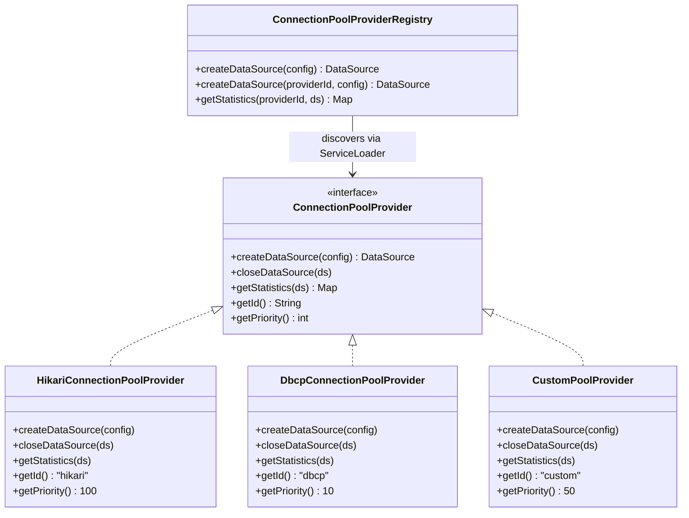

# Appendix F: Visual Asset Prompts

This appendix contains all image prompts referenced throughout the e-book, organized by chapter. Each prompt includes its source chapter and section for easy reference.

## Purpose

These prompts are designed for AI image generation services (DALL-E 3, Midjourney, Stable Diffusion) to create professional diagrams, charts, and illustrations that complement the technical content. All prompts follow corporate template specifications with consistent color schemes and styling.

## Corporate Template Specifications

**Color Scheme:**
- Primary Blues: #0277BD, #0288D1, #03A9F4
- Secondary Greens: #388E3C, #4CAF50
- Accent Orange: #F57C00, #FF9800
- Neutral Grays: #424242, #616161, #9E9E9E

**Image Format:**
- Diagrams: PNG, 1920x1080
- Charts: PNG, 1200x800
- Style: Professional, clean, modern

## How to Use This Appendix

1. **For AI Generation:** Use the prompts as-is with your chosen AI service
2. **For Manual Creation:** Use prompts as detailed specifications
3. **For Integration:** Reference the chapter/section to place generated images
4. **For Automation:** Use `/documents/ebook/scripts/extract-image-prompts.sh` to export to JSON

## Cost Estimates

- **DALL-E 3 (HD quality):** ~$20 for all 139 images
- **Midjourney (Standard plan):** ~$30/month subscription
- **Stable Diffusion (Cloud GPU):** ~$5-10 total

## Image Prompts by Chapter

### Chapter 1: Introduction to OJP

**Source:** `documents/ebook/part1-chapter1-introduction.md`

#### Prompt 1

**[IMAGE PROMPT 1]**: Create a diagram showing the three types of JDBC drivers:
- Type 1 (JDBC-ODBC Bridge): Shows application → JDBC → ODBC → Database
- Type 2 (Native-API): Shows application → JDBC → Native Library → Database  
- Type 3 (Network Protocol): Shows application → JDBC → Middleware Server → Database
Highlight Type 3 with emphasis on the network protocol layer. Use professional technical style with clean lines and modern colors (blues and greens). Show OJP logo on the Type 3 middleware component.

JDBC drivers come in different types, each with distinct characteristics. Type 1 drivers use the JDBC-ODBC Bridge to translate JDBC calls into ODBC calls, while Type 2 drivers convert JDBC calls directly to database-specific native calls. Type 4 drivers, the most common today, directly convert JDBC calls to the database-specific protocol in pure Java. But OJP takes a different approach: it's a **Type 3 driver**, meaning it communicates with a middleware server (the OJP Server) that then connects to the database.

This middleware architecture provides several advantages that we'll explore throughout this book:


The Type 3 architecture means all database connections are managed centrally by the OJP Server, not by individual applications. This enables efficient connection multiplexing over gRPC, allowing your applications to scale elastically without proportionally increasing database connections. The architecture also provides database independence—you can switch between databases without changing application code.

#### Prompt 2

**[IMAGE PROMPT 2]**: Create an illustration showing the OSI model layers (1-7) on the left side, with Layer 7 (Application Layer) highlighted. On the right, show OJP operating at Layer 7, intercepting JDBC/SQL operations and intelligently routing them to a database pool. Use professional network diagram style with clear layer separation. Include labels: "HTTP", "SQL", "JDBC" at Layer 7.

OJP operates as a **Layer 7 (Application Layer) proxy**, which means it understands and operates on the application protocol itself—in this case, JDBC/SQL. Unlike lower-layer proxies (like Layer 4 TCP proxies), OJP can inspect SQL statements and make intelligent routing decisions. It can classify queries as fast or slow (enabling the slow query segregation feature), manage transactions at the application protocol level, and implement connection pooling with full awareness of JDBC semantics. This deep protocol understanding also enables OJP to provide detailed telemetry about query execution and performance.

#### Prompt 3

**[IMAGE PROMPT 3]**: Create a dramatic "before and after" comparison:
LEFT SIDE (Problem): Show multiple microservice instances (10-20 containers) each with 10-20 connections all pointing to a single database. The database should look overwhelmed with red warning indicators. Label: "Traditional Architecture: N instances × M connections = Database Overload"
RIGHT SIDE (Solution): Show the same microservice instances connecting to OJP Server (shown as a smart gateway), which maintains a controlled pool of connections to the database. The database looks calm with green indicators. Label: "OJP Architecture: Controlled Connection Pool"
Use a modern infographic style with icons for microservices, clear connection lines, and professional color scheme.

Consider this scenario:


**The Problem**: Each application instance maintains its own connection pool. When you scale to 6 instances with 20 connections each, you need 120 database connections—exceeding your database's limit of 100. The result is connection pool exhaustion where new instances can't connect, database overload where too many connections degrade performance, and resource waste with connections held idle across many instances. This creates hard scaling limits—you can't scale applications without overwhelming the database. Deployments or restarts create connection storms that can bring the database down entirely.

#### Prompt 4

**[IMAGE PROMPT 4]**: Create a detailed technical diagram:
LEFT: Show application code with JDBC connection objects (labeled "Virtual Connections" - shown as lightweight, hollow circles in blue)
CENTER: Show OJP Server as a gateway/bridge component
RIGHT: Show database with actual connection pool (labeled "Real Connections" - shown as solid, filled circles in green)
Add annotations showing:
- "100 Virtual Connections" on left
- "Only 20 Real Connections" on right
- "1:5 Ratio" in the center
Use technical diagram style with clear labels and connection flow arrows.

The key insight: **Your application can have as many JDBC connections as it needs, but only a controlled number of real database connections are used.**


**How it Works**:

1. **Application Requests Connection**: Your app calls `DriverManager.getConnection()` as usual
2. **Virtual Connection Returned**: OJP JDBC Driver returns a connection object immediately (no database connection yet)
3. **Lazy Connection Allocation**: When you execute a query, OJP Server allocates a real database connection from its pool
4. **Query Execution**: The query runs on the real connection
5. **Smart Release**: The real connection returns to the pool after the operation completes (but remains held for active transactions or open ResultSets)
6. **Virtual Connection Remains**: Your application still holds the "connection," but minimal database resources are consumed

**Important**: Real connections are retained for the duration of:
- Active transactions (until `commit()` or `rollback()` is called)
- Open ResultSets (until `ResultSet.close()` or the ResultSet is fully consumed)

#### Prompt 5

**[IMAGE PROMPT 5]**: Create an infographic showing a flow control system:
Show traffic/load coming from left (multiple application instances)
OJP Server in middle acting as a "smart valve" or "traffic controller" 
Database on right with stable, controlled flow
Use metaphor of water flow or traffic control
Include visual indicators: "100 requests/sec" → "Regulated to 20 concurrent" → "Database stable"
Professional infographic style with icons and clear flow indicators.

OJP implements **intelligent backpressure** to protect your database:


**Backpressure Features**:

When request volume exceeds available connections, OJP implements smart backpressure controls. Connection limits enforce maximum concurrent connections, while request queuing allows excess requests to wait safely instead of failing immediately. Timeout management prevents indefinite waiting, and the slow query segregation feature ensures fast queries aren't blocked by slow ones. The built-in circuit breaker protects against cascading failures across your system.

#### Prompt 6

**[IMAGE PROMPT 6]**: Create a diagram showing OJP Server at the center connected to multiple different databases:
- PostgreSQL (with logo)
- MySQL (with logo)
- Oracle (with logo)
- SQL Server (with logo)
- MariaDB (with logo)
- H2 (with logo)
Show OJP managing separate connection pools for each database
Use a hub-and-spoke layout with OJP as the central hub
Professional enterprise architecture diagram style

OJP can simultaneously manage connections to multiple databases:


---

#### Prompt 7

**[IMAGE PROMPT 7]**: Create a comparison chart/graph:
X-axis: Number of application instances (5, 10, 20, 50)
Y-axis: Database connections needed
Two lines: "Traditional" (exponential growth) vs "OJP" (flat line)
Highlight the growing gap between the lines
Use professional chart style with clear legend and gridlines
Include a "breaking point" marker where traditional approach fails

This makes OJP perfect for cloud environments where instances scale up and down automatically, and ideal for serverless platforms like AWS Lambda and Azure Functions where connection management has traditionally been a major pain point.

#### Prompt 8

**[IMAGE PROMPT 16]**: Create a comparison matrix showing three workload types (OLTP, Mixed, Batch) rated across multiple dimensions: Connection Efficiency, Latency Sensitivity, Transaction Patterns, Scale Elasticity. Use traffic light colors (green/yellow/red) to show fit. OLTP and Mixed workloads should be mostly green, while Batch should show mixed results. Professional business matrix style.

OJP excels in specific architectural patterns and workload types:

#### Prompt 9

**[IMAGE PROMPT 17]**: Create warning-style infographic showing anti-patterns: ultra-low latency trading (with clock icon showing microseconds), data warehousing (with large database icon), single monolithic app (one big server), embedded systems (small device icon). Use red/orange warning colors. Professional warning poster style.

Understanding when NOT to use OJP is as important as knowing when to use it:

#### Prompt 10

**[IMAGE PROMPT 18]**: Create a balanced scale diagram showing trade-offs: Left side "What You Gain" (scalability, centralization, backpressure), Right side "What You Accept" (latency overhead, complexity, dependency). Use professional illustration style with icons representing each concept.

OJP makes intentional trade-offs that may not suit every use case:

#### Prompt 11

**[IMAGE PROMPT 19]**: Create a fault-tree diagram showing new failure scenarios: OJP Server down, network partition, gRPC issues, pool exhaustion. Use red indicators for failure points and yellow for degraded states. Include mitigation strategies in green boxes. Professional risk assessment diagram style.

Understanding new failure modes helps you prepare mitigation strategies:

#### Prompt 12

**[IMAGE PROMPT 20]**: Create a decision tree flowchart starting with "Considering OJP?" and branching through key questions: "Multiple app instances?", "OLTP workload?", "Can accept 1-3ms latency?", "Need elastic scaling?". Green paths lead to "OJP is a good fit", red paths lead to "Consider alternatives". Professional flowchart style with clear yes/no branches.

Use this framework to assess whether OJP reduces net risk for your team:


### Chapter 2: Architecture and Design

**Source:** `documents/ebook/part1-chapter2-architecture.md`

#### Prompt 1

**[IMAGE PROMPT 1]**: Create a detailed component diagram of ojp-server showing:
- gRPC Server endpoint (port 1059)
- HikariCP Connection Pool Manager
- Multiple database pools (PostgreSQL, MySQL, Oracle)
- Request Handler threads
- Metrics/Telemetry collector (Prometheus on port 9159)
- Configuration manager
Use a layered architecture style with clear component boundaries
Professional enterprise architecture diagram with icons and labels

The **ojp-server** is the heart of the OJP system. It's a standalone gRPC server that manages database connections and executes SQL operations on behalf of client applications.

At its core, the server listens for client requests over gRPC on port 1059 by default. When requests arrive, the server maintains HikariCP connection pools for each configured database, ensuring efficient resource utilization. The server then executes queries and updates against real database connections, managing the entire lifecycle of SQL operations. Throughout this process, it tracks client sessions and their transactional state, ensuring data consistency across distributed applications. For observability, the server exports comprehensive metrics via Prometheus on port 9159, and enforces security through IP whitelisting and access controls.

**Architecture Layers**:


The server offers flexible deployment options to fit various infrastructure needs. You can run it as a Docker container with pre-built images that include open-source drivers, as a runnable JAR for standalone execution with external driver support, or deploy it to Kubernetes using Helm charts for cloud-native environments.

**Configuration**: Server behavior is controlled through environment variables or JVM system properties:

```properties

#### Prompt 2

**[IMAGE PROMPT 2]**: Create a layered diagram showing:
TOP: Standard JDBC interfaces (Connection, Statement, ResultSet, PreparedStatement)
MIDDLE: OJP implementations (OjpConnection, OjpStatement, OjpResultSet)
BOTTOM: gRPC Client communicating with OJP Server
Show how JDBC methods map to gRPC calls
Use UML-style class diagram with interfaces and implementations
Professional technical diagram style

The **ojp-jdbc-driver** is a complete JDBC 4.2 specification implementation that applications use as a drop-in replacement for traditional JDBC drivers.

The driver implements the JDBC API interfaces to ensure compliance with the standard. Rather than maintaining actual database connections, it provides lightweight virtual connection objects that delegate to the server. Under the hood, it acts as a gRPC client, communicating with ojp-server to execute all database operations. The driver handles result set streaming efficiently to minimize memory overhead, and manages transaction state across the network boundary. For high availability scenarios, it supports connecting to multiple OJP servers simultaneously, automatically failing over when needed.

**JDBC Implementation Mapping**:


**Maven Dependency**:

```xml
<dependency>
    <groupId>org.openjproxy</groupId>
    <artifactId>ojp-jdbc-driver</artifactId>
    <version>0.3.1-beta</version>
</dependency>
```

**Usage Example**:

```java
// Load the OJP JDBC driver
Class.forName("org.openjproxy.jdbc.Driver");

// Connect with OJP URL format
String url = "jdbc:ojp[localhost:1059]_postgresql://localhost:5432/mydb";
Connection conn = DriverManager.getConnection(url, "user", "password");

// Use standard JDBC operations
Statement stmt = conn.createStatement();
ResultSet rs = stmt.executeQuery("SELECT * FROM users");

while (rs.next()) {
    System.out.println(rs.getString("username"));
}

rs.close();
stmt.close();
conn.close();
```

**Important Consideration**: When using OJP, you must **disable** any existing application-level connection pooling (HikariCP, C3P0, DBCP2) as it creates double-pooling and defeats OJP's purpose.

#### Prompt 3

**[IMAGE PROMPT 3]**: Create a diagram showing Protocol Buffers (.proto files) in the center, with arrows pointing to:
LEFT: Java generated classes for ojp-jdbc-driver
RIGHT: Java generated classes for ojp-server
Show the contract acting as a bridge/shared language
Include sample proto message definitions (StatementRequest, ResultSetResponse)
Use professional technical documentation style

The **ojp-grpc-commons** module contains the gRPC service definitions and Protocol Buffer message schemas shared between the driver and server.

This module serves as the contract between client and server. It defines the gRPC service interfaces in `.proto` files, specifying exactly how client and server communicate. These files describe all request and response message structures with precise field types and semantics. From these proto files, Java classes are auto-generated at build time, ensuring both sides work with identical data structures. This approach guarantees version compatibility—when driver and server are compiled against the same proto definitions, protocol mismatches become impossible.

**Protocol Buffer Example**:

```protobuf
// Simplified example of protocol definition
service StatementService {
  rpc ExecuteQuery(StatementRequest) returns (stream ResultSetResponse);
  rpc ExecuteUpdate(StatementRequest) returns (UpdateResponse);
  rpc CreateSession(SessionRequest) returns (SessionResponse);
  rpc Commit(TransactionRequest) returns (TransactionResponse);
}

message StatementRequest {
  string session_id = 1;
  string sql = 2;
  repeated Parameter parameters = 3;
  int32 fetch_size = 4;
}

message ResultSetResponse {
  repeated Row rows = 1;
  ColumnMetadata metadata = 2;
  bool has_more = 3;
}
```

**Why This Matters**: The shared contract ensures type safety and version compatibility. Both driver and server are compiled against the same proto definitions, preventing protocol mismatches.

---

#### Prompt 4

**[IMAGE PROMPT 4]**: Create a comparison infographic:
Traditional REST/JSON vs gRPC/Protocol Buffers
Show metrics: Latency, Throughput, Payload Size, Connection Efficiency
Use bar charts or comparison cards
Highlight gRPC advantages: HTTP/2, Binary encoding, Streaming, Type safety
Professional infographic style with clear data visualization

From the Architectural Decision Record (ADR-002):

> "gRPC's HTTP/2 transport enables multiplexed streams and low-latency communication, aligning perfectly with the project's scalability goals."

gRPC brings several compelling advantages to OJP's architecture. Its HTTP/2 multiplexing allows multiple requests to travel over a single TCP connection, dramatically reducing connection overhead. The binary protocol using Protocol Buffers results in much smaller payload sizes compared to JSON—typically 60-80% smaller. This isn't just about bandwidth; smaller payloads mean faster serialization and deserialization. gRPC provides native support for bi-directional streaming, perfect for handling large result sets efficiently. Protocol Buffers also bring compile-time type safety, catching errors during development rather than at runtime. The protocol is language-agnostic, making it straightforward to implement clients in languages beyond Java. Overall, gRPC delivers significantly better performance than traditional REST/JSON approaches, which is critical when database operations are involved.

When comparing REST/JSON to gRPC/Protobuf, the differences are striking. REST typically uses HTTP/1.1 with text-based JSON encoding, leading to larger payloads and limited streaming capabilities. Type checking happens at runtime, and performance is merely good. gRPC, on the other hand, uses HTTP/2 with binary encoding, achieving 60-80% payload size reduction, native streaming support, compile-time type safety, and excellent performance.

#### Prompt 5

**[IMAGE PROMPT 5]**: Create a detailed sequence diagram showing:
1. Application calls executeQuery()
2. OJP Driver serializes to protobuf
3. gRPC call over HTTP/2
4. OJP Server deserializes
5. Server acquires pool connection
6. SQL executed on database
7. Results serialized to protobuf
8. Streamed back via gRPC
9. Driver deserializes
10. Returns to application
Use professional sequence diagram style with clear swim lanes and timing indicators

Let's trace a complete SQL query execution:


**Key Observations**:

- **Step 1-3**: Request serialization and transmission (~1-2ms)
- **Step 4-7**: Database operation execution (depends on query)
- **Step 8-10**: Result streaming and deserialization (~2-5ms for 1000 rows)
- **Connection Held**: Only during steps 6-7 (actual SQL execution)
- **Total Network Overhead**: ~5-10ms (much less than database operation time)

#### Prompt 6

**[IMAGE PROMPT 6]**: Create a diagram showing:
LEFT: Multiple application threads/requests
CENTER: Session Manager maintaining session state (sessionId, transaction state, isolation level)
RIGHT: Server-side resources (connections, prepared statements)
Show how sessionId maps requests to resources
Use professional system architecture diagram style

Sessions maintain state across multiple requests:


Each OJP session has several important characteristics that make the system work smoothly. Every connection gets a unique UUID as its session identifier, ensuring that requests are properly tracked across the distributed system. The session tracks transaction state meticulously, knowing whether a transaction is in progress and what operations have been committed or rolled back. Prepared statements are cached at the server side for reuse, avoiding repeated parsing overhead. The system maintains JDBC isolation level settings across the network boundary, preserving transactional semantics. In multi-node deployments, sessions exhibit connection affinity—once a session starts on a particular server, it sticks to that server for consistency.

#### Prompt 7

**[IMAGE PROMPT 7]**: Create a technical diagram showing:
Multiple JDBC operations from different threads
All multiplexed over a single gRPC channel (HTTP/2 connection)
Show concurrent streams within the single TCP connection
Label: "10 concurrent queries" → "1 TCP connection" → "10 database operations"
Use network diagram style with clear connection visualization

One of gRPC's killer features is connection multiplexing:


This multiplexing delivers several concrete benefits. The reduced overhead from maintaining one TCP connection instead of many translates to better performance and resource utilization. Server resources are conserved—fewer sockets and file descriptors mean more capacity for actual work. Most importantly, the system can handle concurrent operations gracefully, with multiple queries in flight simultaneously without the connection management overhead of traditional approaches.

---

#### Prompt 8

**[IMAGE PROMPT 8]**: Create a performance comparison chart:
Show HikariCP vs other connection pools (C3P0, DBCP, Tomcat Pool)
Metrics: Throughput (ops/sec), Latency (ms), Memory usage
Bar chart or radar chart showing HikariCP's superiority
Include quote: "HikariCP is the fastest JDBC connection pool"
Professional data visualization style

From the Architectural Decision Record (ADR-003):

> "HikariCP is the fastest JDBC connection pool, with extensive configuration options and a proven track record in high-performance systems."

HikariCP brings multiple advantages that make it the ideal choice for OJP. Benchmark results consistently show it's 2-10x faster than alternatives like C3P0, DBCP2, or Tomcat's pool. This speed isn't theoretical—HikariCP has been extensively tested in production environments across thousands of deployments. It maintains minimal memory and CPU footprint, leaving more resources for your actual application logic. The pool works great out-of-the-box with smart defaults, though it offers extensive tuning options when needed. Finally, it's actively developed and well-maintained, with responsive support for issues and continuous improvements.

Performance benchmarks tell the story clearly. HikariCP achieves approximately 45,000 operations per second with 0.9ms average latency. Compare this to Tomcat's pool at 23,000 ops/sec with 1.8ms latency, C3P0 at 18,000 ops/sec with 2.3ms latency, or DBCP2 at 20,000 ops/sec with 2.1ms latency. HikariCP essentially doubles the throughput while halving the latency.

#### Prompt 9

**[IMAGE PROMPT 9]**: Create an infographic showing optimal pool sizing:
Show relationship between: # of cores, # of concurrent queries, optimal pool size
Include the formula: connections = ((core_count * 2) + effective_spindle_count)
Visualize with server icons, CPU cores, and database connections
Professional technical infographic style

OJP Server manages separate HikariCP pools for each database:


**Key Configuration Parameters**:

```properties

#### Prompt 10

**[IMAGE PROMPT 10]**: Create an architecture diagram showing:
TOP: OJP Server using ConnectionPoolProvider interface
MIDDLE: Provider SPI layer (abstraction)
BOTTOM: Multiple implementations (HikariCP, DBCP2, Custom)
Show pluggable architecture with different providers
UML-style interface diagram showing polymorphism
Professional software architecture diagram style

OJP includes a **Connection Pool Provider SPI** (Service Provider Interface) that abstracts the underlying connection pool implementation:



The abstraction layer brings several important benefits. It provides flexibility—you can switch connection pool implementations without changing any code. The system is extensible through the SPI, allowing organizations to add custom pool providers. This abstraction makes testing easier, as you can mock the pool provider for unit tests. Most importantly, it future-proofs the architecture, making it simple to adapt to new pool technologies as they emerge.

OJP ships with multiple providers out of the box. HikariCP is the default provider with ID "hikari" and priority 100, recommended for its high performance. Apache DBCP2 is available as an alternative with ID "dbcp" and priority 10, offering a feature-rich implementation. Organizations can also create custom providers with user-defined IDs and priorities for specialized requirements. The provider with the highest priority is used by default, though you can explicitly specify which provider to use when creating a data source.

The provider with the highest priority is used by default, but you can explicitly specify a provider:

```java
// Default (highest priority - HikariCP)
DataSource ds = ConnectionPoolProviderRegistry.createDataSource(config);

// Explicit provider selection
DataSource ds = ConnectionPoolProviderRegistry.createDataSource("dbcp", config);
```

#### Prompt 11

**[IMAGE PROMPT 11]**: Create a comprehensive end-to-end architecture diagram showing:
- Application layer (multiple instances)
- OJP JDBC Driver layer
- Network layer (gRPC/HTTP2)
- OJP Server layer (with all internal components)
- Connection Pool layer (HikariCP with multiple DB pools)
- Database layer (multiple databases)
Include all protocols, ports, and data flows
Use professional enterprise architecture poster style
Large, detailed, suitable for printing

Here's the complete OJP architecture from end to end:

```mermaid
graph TB
    subgraph "Application Tier"
    APP1[Spring Boot App 1]
    APP2[Quarkus App 2]
    APP3[Micronaut App 3]
    end
    
    subgraph "OJP JDBC Driver"
    DRIVER1[OjpConnection]
    DRIVER2[OjpStatement]
    DRIVER3[OjpResultSet]
    GRPC_CLIENT[gRPC Client]
    end
    
    subgraph "Network Layer"
    GRPC_PROTO[gRPC/HTTP2<br/>Port 1059]
    end
    
    subgraph "OJP Server"
    GRPC_SERVER[gRPC Server]
    
    subgraph "Service Layer"
    STMT_SVC[Statement Service]
    SESS_MGR[Session Manager]
    CIRC_BRK[Circuit Breaker]
    SLOW_SEG[Slow Query Segregation]
    end
    
    subgraph "Pool Management"
    POOL_MGR[Pool Manager]
    HIKARI1[HikariCP Pool 1]
    HIKARI2[HikariCP Pool 2]
    HIKARI3[HikariCP Pool 3]
    end
    
    subgraph "Observability"
    OTEL[OpenTelemetry]
    PROM[Prometheus<br/>Port 9159]
    end
    
    end
    
    subgraph "Database Tier"
    PG[(PostgreSQL)]
    MY[(MySQL)]
    OR[(Oracle)]
    end
    
    APP1 --> DRIVER1
    APP2 --> DRIVER1
    APP3 --> DRIVER1
    
    DRIVER1 --> DRIVER2
    DRIVER2 --> DRIVER3
    DRIVER1 --> GRPC_CLIENT
    
    GRPC_CLIENT --> GRPC_PROTO
    GRPC_PROTO --> GRPC_SERVER
    
    GRPC_SERVER --> STMT_SVC
    STMT_SVC --> SESS_MGR
    STMT_SVC --> CIRC_BRK
    STMT_SVC --> SLOW_SEG
    STMT_SVC --> POOL_MGR
    
    POOL_MGR --> HIKARI1
    POOL_MGR --> HIKARI2
    POOL_MGR --> HIKARI3
    
    HIKARI1 --> PG
    HIKARI2 --> MY
    HIKARI3 --> OR
    
    STMT_SVC --> OTEL
    OTEL --> PROM
    
    style APP1 fill:#e1f5fe
    style APP2 fill:#e1f5fe
    style APP3 fill:#e1f5fe
    style DRIVER1 fill:#81c784
    style GRPC_SERVER fill:#ffd54f
    style POOL_MGR fill:#ff8a65
    style PG fill:#336791
    style MY fill:#4479a1
    style OR fill:#f80000
```



#### Prompt 12

**[IMAGE PROMPT 12]**: Create a detailed component interaction diagram showing:
- How components communicate
- What data flows between them
- Key interfaces and contracts
- Configuration and dependencies
Use UML component diagram notation
Professional software architecture documentation style

Let's examine how components interact during a typical database operation:


#### Prompt 13

**[IMAGE PROMPT 13]**: Create a data flow diagram (DFD) showing:
- External entities (Applications, Databases, Monitoring systems)
- Processes (OJP Driver, OJP Server, Connection Pools)
- Data stores (Session cache, Prepared statement cache, Metrics)
- Data flows (SQL queries, Result sets, Metrics, Configuration)
Use standard DFD notation with appropriate symbols
Professional systems analysis diagram style

The flow of data through the OJP system:


---


### Chapter 3: Quick Start Guide

**Source:** `documents/ebook/part1-chapter3-quickstart.md`

#### Prompt 1

**[IMAGE PROMPT 1]**: Create a simple requirements checklist infographic:
- OJP Server: Java 21+ (with Java logo)
- OJP JDBC Driver: Java 11+ (with Java logo)
- Maven 3.9+ or Gradle (with logos)
- Docker (optional, with Docker logo)
- Network access (ports 1059, 9159)
Use clean, modern icon-based design with checkmarks
Professional getting-started guide style

OJP has different Java requirements for server and client:
- **OJP Server** requires **Java 21 or higher**
- **OJP JDBC Driver** requires **Java 11 or higher** (for broader client compatibility)

**Verify your Java version**:

```bash
java -version
```

Expected output:
```
openjdk version "22.0.1" 2024-04-16
OpenJDK Runtime Environment (build 22.0.1+8-16)
OpenJDK 64-Bit Server VM (build 22.0.1+8-16, mixed mode, sharing)
```

If you don't have Java 22+, you can download it from Eclipse Temurin at adoptium.net, Oracle JDK from oracle.com, or Amazon Corretto from aws.amazon.com/corretto.

#### Prompt 2

**[IMAGE PROMPT 2]**: Create a step-by-step visual guide showing:
Step 1: Docker command in terminal
Step 2: OJP Server starting up (container icon)
Step 3: Server ready with ports exposed
Step 4: Applications connecting to OJP
Use a horizontal timeline or numbered steps format
Modern tutorial style with screenshots/mockups

The fastest way to get started is using the pre-built Docker image that includes open-source database drivers (H2, PostgreSQL, MySQL, MariaDB).

**Start OJP Server**:

```bash
docker run --rm -d \
  --name ojp-server \
  --network host \
  rrobetti/ojp:0.3.1-beta
```

This command accomplishes several things in one step. It downloads the OJP Server image (approximately 50MB), which includes drivers for H2, PostgreSQL, MySQL, and MariaDB out of the box. The server starts on port 1059 for gRPC communication and exposes metrics on port 9159 for Prometheus. The `-d` flag runs the container in detached mode, while `--rm` ensures the container is automatically removed when stopped.

**Verify it's running**:

```bash
docker ps | grep ojp-server

#### Prompt 3

**[IMAGE PROMPT 3]**: Create a visual guide for JAR deployment showing:
1. Download/build JAR file
2. Download database drivers
3. Run Java command
4. Server startup confirmation
Use terminal screenshots with highlighted commands
Professional technical documentation style

If Docker isn't available, use the standalone executable JAR.

**Download or Build the JAR**:

```bash

#### Prompt 4

**[IMAGE PROMPT 4]**: Create a development workflow diagram showing:
Git clone → Maven build → Run tests → Start server
Include relevant logos (Git, Maven, Java)
Developer-focused technical diagram style

For developers who want to modify or contribute to OJP:

**Complete Build Process**:

```bash

#### Prompt 5

**[IMAGE PROMPT 5]**: Create a side-by-side comparison showing:
LEFT: Maven pom.xml with ojp-jdbc-driver dependency
RIGHT: Gradle build.gradle with ojp-jdbc-driver dependency
Use code editor style with syntax highlighting
Professional code documentation style

**Maven** (`pom.xml`):

```xml
<dependency>
    <groupId>org.openjproxy</groupId>
    <artifactId>ojp-jdbc-driver</artifactId>
    <version>0.3.1-beta</version>
</dependency>
```

**Gradle** (`build.gradle`):

```groovy
dependencies {
    implementation 'org.openjproxy:ojp-jdbc-driver:0.3.1-beta'
}
```

**Gradle Kotlin** (`build.gradle.kts`):

```kotlin
dependencies {
    implementation("org.openjproxy:ojp-jdbc-driver:0.3.1-beta")
}
```

#### Prompt 6

**[IMAGE PROMPT 6]**: Create a before/after transformation diagram:
Show traditional JDBC URLs transforming to OJP URLs for different databases
Use arrows showing the transformation
Include PostgreSQL, MySQL, Oracle, SQL Server examples
Infographic style with database logos

The only code change required is modifying your JDBC URL by prefixing it with `ojp[host:port]_`.

**URL Format**:
```
jdbc:ojp[ojp-server-host:port]_original-jdbc-url
```

**Examples for Different Databases**:

```java
// ============ PostgreSQL ============
// Before
String url = "jdbc:postgresql://localhost:5432/mydb";

// After
String url = "jdbc:ojp[localhost:1059]_postgresql://localhost:5432/mydb";

// ============ MySQL ============
// Before
String url = "jdbc:mysql://localhost:3306/mydb";

// After
String url = "jdbc:ojp[localhost:1059]_mysql://localhost:3306/mydb";

// ============ Oracle ============
// Before
String url = "jdbc:oracle:thin:@localhost:1521/XEPDB1";

// After
String url = "jdbc:ojp[localhost:1059]_oracle:thin:@localhost:1521/XEPDB1";

// ============ SQL Server ============
// Before
String url = "jdbc:sqlserver://localhost:1433;databaseName=mydb";

// After
String url = "jdbc:ojp[localhost:1059]_sqlserver://localhost:1433;databaseName=mydb";

// ============ H2 (for testing) ============
// Before
String url = "jdbc:h2:~/testdb";

// After
String url = "jdbc:ojp[localhost:1059]_h2:~/testdb";
```

**URL Components**:


#### Prompt 7

**[IMAGE PROMPT 7]**: Create a complete code example visualization showing:
Full Java class with imports, connection setup, query execution, and result processing
Highlight the OJP-specific parts (URL format, driver class)
Use IDE/code editor style with line numbers and syntax highlighting
Include success output at the bottom
Professional code tutorial style

**Complete Working Example**:

```java
import java.sql.*;

public class OjpQuickStart {
    
    public static void main(String[] args) {
        // OJP JDBC URL - only change from traditional JDBC
        String url = "jdbc:ojp[localhost:1059]_h2:~/testdb";
        String username = "sa";
        String password = "";
        
        try {
            // Optional: Explicitly load the driver
            Class.forName("org.openjproxy.jdbc.Driver");
            
            // Connect to database through OJP
            try (Connection conn = DriverManager.getConnection(url, username, password)) {
                
                System.out.println("✅ Connected to database via OJP!");
                System.out.println("   Connection class: " + conn.getClass().getName());
                
                // Create a test table
                try (Statement stmt = conn.createStatement()) {
                    stmt.executeUpdate(
                        "CREATE TABLE IF NOT EXISTS users (" +
                        "id INT PRIMARY KEY, " +
                        "name VARCHAR(100), " +
                        "email VARCHAR(100))"
                    );
                    System.out.println("✅ Table created");
                }
                
                // Insert test data
                try (PreparedStatement pstmt = conn.prepareStatement(
                    "INSERT INTO users (id, name, email) VALUES (?, ?, ?)")) {
                    
                    pstmt.setInt(1, 1);
                    pstmt.setString(2, "Alice");
                    pstmt.setString(3, "alice@example.com");
                    pstmt.executeUpdate();
                    
                    pstmt.setInt(1, 2);
                    pstmt.setString(2, "Bob");
                    pstmt.setString(3, "bob@example.com");
                    pstmt.executeUpdate();
                    
                    System.out.println("✅ Data inserted");
                }
                
                // Query data
                try (Statement stmt = conn.createStatement();
                     ResultSet rs = stmt.executeQuery("SELECT * FROM users")) {
                    
                    System.out.println("\n📊 Query Results:");
                    System.out.println("ID | Name  | Email");
                    System.out.println("---|-------|-------------------");
                    
                    while (rs.next()) {
                        System.out.printf("%2d | %-5s | %s%n",
                            rs.getInt("id"),
                            rs.getString("name"),
                            rs.getString("email"));
                    }
                }
                
                System.out.println("\n✅ All operations completed successfully!");
                
            }
            
        } catch (SQLException e) {
            System.err.println("❌ SQL Error: " + e.getMessage());
            e.printStackTrace();
        } catch (ClassNotFoundException e) {
            System.err.println("❌ JDBC Driver not found: " + e.getMessage());
        }
    }
}
```

**Expected Output**:

```
✅ Connected to database via OJP!
   Connection class: org.openjproxy.jdbc.OjpConnection
✅ Table created
✅ Data inserted

📊 Query Results:
ID | Name  | Email
---|-------|-------------------
 1 | Alice | alice@example.com
 2 | Bob   | bob@example.com

✅ All operations completed successfully!
```

#### Prompt 8

**[IMAGE PROMPT 8]**: Create a troubleshooting flowchart or FAQ-style infographic:
Show common problems and their solutions:
- Connection refused → Check OJP server is running
- Double pooling → Disable application pool
- Driver not found → Check dependency
- Port conflict → Change port configuration
Use friendly, helpful design with icons for each issue
Professional troubleshooting guide style

#### Prompt 9

**[IMAGE PROMPT 9]**: Create a verification checklist infographic:
- Server is running ✓
- Port is accessible ✓
- Driver dependency added ✓
- URL format is correct ✓
- First query successful ✓
Use checkboxes and friendly icons
Professional setup verification guide style

Use this checklist to verify your OJP installation:

```bash


### Chapter 3a: Kubernetes Deployment with Helm

**Source:** `documents/ebook/part1-chapter3a-kubernetes-helm.md`

#### Prompt 1

**[IMAGE PROMPT 1]**: Create a prerequisites checklist infographic showing:
- Kubernetes cluster (with K8s logo and version 1.20+)
- Helm 3.x installed (with Helm logo)
- kubectl configured (with kubectl logo)
- Network access to cluster
Use modern cloud-native design with icons
Professional getting-started guide style with checkboxes


#### Prompt 2

**[IMAGE PROMPT 2]**: Create a visual guide showing Helm installation on different platforms:
- macOS (using Homebrew)
- Linux (using package manager)
- Windows (using Chocolatey)
Show terminal commands and success indicators
Professional cross-platform installation guide style

Install Helm 3.x (Helm 2 is not supported):

**macOS**:
```bash
brew install helm
```

**Linux**:
```bash
curl https://raw.githubusercontent.com/helm/helm/main/scripts/get-helm-3 | bash
```

**Windows (Chocolatey)**:
```bash
choco install kubernetes-helm
```

**Verify Helm installation**:
```bash
helm version

#### Prompt 3

**[IMAGE PROMPT 3]**: Create a step-by-step visual guide showing:
Step 1: helm repo add command
Step 2: helm repo update command
Step 3: helm search showing ojp-server
Step 4: Success confirmation
Use terminal-style screenshots with highlighted commands
Professional Helm tutorial style

First, add the OJP Helm repository to your Helm configuration:

```bash

#### Prompt 4

**[IMAGE PROMPT 4]**: Create a Kubernetes deployment visualization showing:
- Helm chart being deployed
- Kubernetes resources being created (StatefulSet, Services, ConfigMap)
- Pods starting up with stable identities (ojp-server-0, ojp-server-1, ojp-server-2)
- Individual per-pod LoadBalancer services exposing each pod
- Headless service for StatefulSet DNS discovery
Use Kubernetes architecture diagram style with resource icons
Professional cloud-native deployment guide showing StatefulSet architecture

Install OJP Server with default configuration:

```bash

#### Prompt 5

**[IMAGE PROMPT 5]**: Create a side-by-side comparison showing:
LEFT: Default installation with standard values
RIGHT: Custom installation with custom values file
Show configuration differences highlighted
Professional configuration guide style

Create a custom `values.yaml` file to override defaults:

```yaml

#### Prompt 6

**[IMAGE PROMPT 6]**: Create a visual representation of Helm upgrade process:
Show: Current release → Helm upgrade command → Rolling update → New version deployed
Include rollback option as a safety net
Use flowchart style with Kubernetes rolling update visualization
Professional deployment pipeline style

Update your deployment with new configuration or chart version:

```bash

#### Prompt 7

**[IMAGE PROMPT 7]**: Create an infographic showing configuration categories:
- Server Settings (port, thread pool, timeouts)
- Observability (OpenTelemetry, Prometheus)
- Advanced Features (slow query segregation, circuit breaker)
- Kubernetes Settings (replicas, resources, autoscaling)
Use categorized sections with icons for each category
Professional configuration reference guide style

#### Prompt 8

**[IMAGE PROMPT 8]**: Create a diagram showing OJP StatefulSet service architecture:
- Headless service (ClusterIP: None) for StatefulSet DNS
- Individual per-pod LoadBalancer services (ojp-server-0, ojp-server-1, ojp-server-2)
- Each pod with its own external IP
- Clients connecting directly to specific pods
Use Kubernetes service architecture style with StatefulSet networking patterns
Professional K8s networking guide showing per-pod service model

```yaml
service:
  # Main headless service for StatefulSet (always clusterIP: None)
  type: ClusterIP
  port: 1059                        # Main OJP server port for client connections

#### Prompt 9

**[IMAGE PROMPT 9]**: Create a diagram showing:
ConfigMap for non-sensitive configuration
Secret for sensitive data (passwords, API keys)
Both being mounted into OJP pods
Use Kubernetes security diagram style
Professional K8s configuration management guide

#### Prompt 10

**[IMAGE PROMPT 10]**: Create a security-focused diagram showing:
Kubernetes Secret encrypted at rest
Secret mounted as environment variable or file
Application accessing secret securely
Use security/encryption iconography
Professional security guide style

Create a secret for database credentials:

```bash

#### Prompt 11

**[IMAGE PROMPT 11]**: Create a diagram showing:
PersistentVolumeClaim → PersistentVolume → Storage Backend
Pod mounting the PVC for log persistence
Use Kubernetes storage architecture diagram style
Professional K8s storage guide

For persistent log storage:

```yaml

#### Prompt 12

**[IMAGE PROMPT 12]**: Create a network security diagram showing:
Allowed traffic: Applications → OJP (port 1059)
Allowed traffic: OJP → Database
Allowed traffic: Monitoring → Metrics (port 9090)
Blocked: All other traffic
Use network security diagram with firewall iconography
Professional K8s security guide

Restrict network access to OJP:

```yaml

#### Prompt 13

**[IMAGE PROMPT 13]**: Create an architecture diagram showing:
- Recommended approach: External traffic → Individual OJP Pod Services (StatefulSet) → Client-side load balancing
- Show: StatefulSet pods (ojp-server-0, ojp-server-1, ojp-server-2) each with dedicated LoadBalancer/NodePort service
- Illustrate JDBC driver connecting to all three endpoints simultaneously
- Use Kubernetes architecture style with multinode connection visualization
Professional K8s networking guide for OJP

#### Prompt 14

**[IMAGE PROMPT 14]**: Create a diagram showing Kubernetes health check lifecycle:
Pod starts → Startup probe → Readiness probe → Liveness probe
Show when traffic is routed and when pods are restarted
Use flowchart with health status indicators
Professional K8s reliability guide

Configure probes for OJP:

```yaml

#### Prompt 15

**[IMAGE PROMPT 15]**: Create a visual representation of rolling update strategy for OJP StatefulSet:
Show StatefulSet pods (0,1,2) gradually being replaced by new versions
Display: Pod termination → Client failover → New pod ready
Illustrate graceful client failover to remaining pods during update
Use timeline/animation-style diagram showing JDBC driver reconnection behavior
Professional StatefulSet deployment strategy guide

#### Prompt 16

**[IMAGE PROMPT 16]**: Create a comprehensive monitoring stack diagram:
- Prometheus scraping OJP metrics
- Grafana dashboards visualizing data
- Logs flowing to centralized logging (Loki, ELK)
- Alerts being sent to notification systems
Use modern observability architecture style
Professional monitoring guide

#### Prompt 17

**[IMAGE PROMPT 17]**: Create a high-availability deployment diagram showing:
- 3 OJP StatefulSet pods (ojp-server-0, ojp-server-1, ojp-server-2) with individual LoadBalancer services
- Each pod with its own stable network identity and external IP
- JDBC driver connecting to all three endpoints simultaneously via multi-host connection string
- Client-side load balancing and failover arrows
- Node failure scenario with automatic failover to remaining pods
- Each replica connecting to the same database backend
Use HA architecture diagram style emphasizing StatefulSet and per-pod services
Professional high-availability guide with OJP multinode focus

#### Prompt 18

**[IMAGE PROMPT 18]**: Create a production readiness checklist infographic:
- Resource limits configured ✓
- Health probes configured ✓
- Multiple replicas ✓
- Monitoring enabled ✓
- Logs centralized ✓
- Network policies applied ✓
- Security contexts set ✓
- Backup strategy defined ✓
Use checklist style with completion indicators
Professional production readiness guide

Before going to production, verify:

```yaml


### Chapter 4: Database Drivers and Setup

**Source:** `documents/ebook/part2-chapter4-database-drivers.md`

#### Prompt 1

**[IMAGE PROMPT 1]**: Create an infographic showing the four included open-source databases:
- H2 (with logo) - Embedded/file-based
- PostgreSQL (with logo) - Enterprise-grade
- MySQL (with logo) - Widely-used
- MariaDB (with logo) - MySQL-compatible
Show each with a checkmark indicating "included by default"
Use professional database vendor style with clean icons
Modern "batteries included" theme


These drivers are:
These drivers come pre-installed in Docker images, making deployment instant. For runnable JAR deployments, they're automatically available through the download script. All drivers are tested and verified to work correctly with OJP, and they're kept up-to-date with the latest stable versions from Maven Central.

#### Prompt 2

**[IMAGE PROMPT 2]**: Create a step-by-step visual guide showing:
Step 1: Docker pull command
Step 2: Docker run with included drivers
Step 3: Instant connection to any of the 4 databases
Step 4: Success indicator
Use terminal-style screenshots with highlights
Professional Docker quick start style

The simplest way to use OJP with open-source databases is Docker:

```bash

#### Prompt 3

**[IMAGE PROMPT 3]**: Create a visual showing the download-drivers.sh script in action:
Show script downloading from Maven Central
Progress indicators for each driver
Files appearing in ojp-libs directory
Success confirmation with checksums
Use terminal screenshot style with clear file operations
Professional script execution guide

For runnable JAR deployments, OJP provides a convenient script:

```bash

#### Prompt 4

**[IMAGE PROMPT 4]**: Create a verification checklist infographic showing:
- Check files exist in ojp-libs
- Check file sizes match expected
- Check server logs for driver loading
- Test connection to each database type
Use checklist style with file icons and status indicators
Professional verification guide style

Verify drivers are available:

```bash

#### Prompt 5

**[IMAGE PROMPT 5]**: Create a database support matrix infographic:
LEFT: Proprietary databases (Oracle, SQL Server, DB2) with logos
CENTER: "Add driver" arrow indicating manual step
RIGHT: OJP Server with support enabled
Include vendor download links
Professional enterprise database guide style


**Proprietary Driver Sources**:

| Database | Driver Name | Download Source |
|----------|-------------|-----------------|
| Oracle | ojdbc11.jar | [Oracle JDBC Downloads](https://www.oracle.com/database/technologies/jdbc-downloads.html) |
| SQL Server | mssql-jdbc-*.jar | [Microsoft JDBC Downloads](https://learn.microsoft.com/en-us/sql/connect/jdbc/download-microsoft-jdbc-driver-for-sql-server) |
| DB2 | db2jcc*.jar | IBM Support / DB2 installation |
| CockroachDB | postgresql-*.jar | Compatible with PostgreSQL driver (included!) |

#### Prompt 6

**[IMAGE PROMPT 6]**: Create a step-by-step Oracle setup guide:
Step 1: Download ojdbc11.jar from Oracle
Step 2: Place in ojp-libs directory
Step 3: (Optional) Add UCP jars for XA support
Step 4: Restart OJP Server
Step 5: Connect using Oracle JDBC URL
Use Oracle-themed colors and clear file operations
Professional Oracle DBA style guide

#### Prompt 7

**[IMAGE PROMPT 7]**: Create a diagram showing Oracle UCP integration:
Show OJP Server → Oracle UCP → Oracle Database
Highlight XA transaction support
Include SPI implementation requirement
Use Oracle architecture diagram style
Professional Oracle advanced features guide

For XA transaction support or advanced Oracle features, add Oracle UCP (Universal Connection Pool):

```bash

#### Prompt 8

**[IMAGE PROMPT 8]**: Create a SQL Server setup guide:
Step 1: Download mssql-jdbc jar from Microsoft
Step 2: Place in ojp-libs directory
Step 3: Restart OJP Server
Step 4: Connect using SQL Server URL with options
Use SQL Server themed colors (blue)
Professional SQL Server DBA guide

Download and install the Microsoft JDBC driver:

```bash

#### Prompt 9

**[IMAGE PROMPT 9]**: Create a DB2 setup guide:
Step 1: Locate db2jcc*.jar in DB2 installation or download from IBM
Step 2: Place in ojp-libs directory
Step 3: Optional license jar for specific features
Step 4: Restart and connect
Use IBM blue theme
Professional DB2 DBA guide

IBM DB2 drivers are typically found in your DB2 installation:

```bash

#### Prompt 10

**[IMAGE PROMPT 10]**: Create an infographic showing CockroachDB compatibility:
Show CockroachDB logo with PostgreSQL driver
Indicate "wire-compatible" connection
Highlight that no additional driver needed
Use modern distributed database theme
Professional compatibility guide

Good news! CockroachDB uses the PostgreSQL wire protocol:

```java
// CockroachDB works with the included PostgreSQL driver!
String url = "jdbc:ojp[localhost:1059]_postgresql://localhost:26257/mydb?" +
             "sslmode=disable";
Connection conn = DriverManager.getConnection(url, "root", "");

// CockroachDB cluster
String clusterUrl = "jdbc:ojp[localhost:1059]_postgresql://" +
                    "node1:26257,node2:26257,node3:26257/mydb?" +
                    "sslmode=require&load_balance=true";
```

**No additional driver required** - the included PostgreSQL driver works out of the box!

---

#### Prompt 11

**[IMAGE PROMPT 11]**: Create an architecture diagram showing:
- ojp-libs directory on filesystem
- OJP Server ClassLoader scanning directory
- All JARs loaded at startup
- Drivers registered with DriverManager
- Additional libraries available to OJP
Use technical architecture style with class loading visualization
Professional Java ClassLoader guide


**Key Features**:
1. **Automatic Discovery**: All `.jar` files in the directory are loaded
2. **ServiceLoader Integration**: JDBC drivers self-register automatically
3. **No Recompilation**: Add drivers without rebuilding OJP
4. **Additional Libraries**: Include connection pools, monitoring tools, etc.

#### Prompt 12

**[IMAGE PROMPT 12]**: Create a use case diagram showing different types of libraries:
- JDBC Drivers (database connectivity)
- Connection Pools (Oracle UCP, HikariCP variants)
- Monitoring/Telemetry (custom exporters)
- Security Libraries (encryption, authentication)
Show each category with example JARs
Professional library management guide

Beyond JDBC drivers, you can add:

**Oracle UCP (Universal Connection Pool)**:
```bash

#### Prompt 13

**[IMAGE PROMPT 13]**: Create a testing workflow diagram:
Step 1: Start local database (Docker/Native)
Step 2: Start OJP Server with drivers
Step 3: Test connection from application
Step 4: Verify in OJP logs
Step 5: Check metrics
Use flowchart style with success/failure paths
Professional testing guide

#### Prompt 14

**[IMAGE PROMPT 14]**: Create a quick H2 testing guide:
Show H2 in-memory and file-based modes
Include console access instructions
Display connection success indicators
Use development/testing theme
Professional H2 guide

Perfect for development and testing:

```bash

#### Prompt 15

**[IMAGE PROMPT 15]**: Create a Docker Compose architecture diagram:
Show OJP Server container + multiple database containers
All connected on same network
Clear port mappings and service names
Use Docker Compose visualization style
Professional multi-container setup guide

Create `docker-compose.yml`:

```yaml
version: '3.8'

services:
  ojp-server:
    image: rrobetti/ojp:0.3.1-beta
    ports:
      - "1059:1059"
      - "9159:9159"
    networks:
      - ojp-network
  
  postgres:
    image: postgres:15
    environment:
      POSTGRES_PASSWORD: postgres
      POSTGRES_DB: testdb
    ports:
      - "5432:5432"
    networks:
      - ojp-network
  
  mysql:
    image: mysql:8
    environment:
      MYSQL_ROOT_PASSWORD: mysql
      MYSQL_DATABASE: testdb
    ports:
      - "3306:3306"
    networks:
      - ojp-network
  
  mariadb:
    image: mariadb:10
    environment:
      MARIADB_ROOT_PASSWORD: mariadb
      MARIADB_DATABASE: testdb
    ports:
      - "3307:3306"
    networks:
      - ojp-network

networks:
  ojp-network:
    driver: bridge
```

**Start all services**:

```bash
docker-compose up -d

#### Prompt 16

**[IMAGE PROMPT 16]**: Create a Testcontainers workflow diagram:
Show: JUnit test → Testcontainers starts DB → OJP connects → Test runs → Cleanup
Include code snippets and Docker icons
Use testing framework style
Professional integration testing guide

For automated testing with JUnit:

```java
import org.junit.jupiter.api.Test;
import org.testcontainers.containers.PostgreSQLContainer;
import org.testcontainers.junit.jupiter.Container;
import org.testcontainers.junit.jupiter.Testcontainers;

@Testcontainers
public class OjpPostgreSQLTest {
    
    @Container
    public static PostgreSQLContainer<?> postgres = 
        new PostgreSQLContainer<>("postgres:15")
            .withDatabaseName("testdb")
            .withUsername("test")
            .withPassword("test");
    
    @Test
    public void testOjpWithPostgreSQL() throws SQLException {
        // OJP Server should be running on localhost:1059
        String ojpUrl = String.format(
            "jdbc:ojp[localhost:1059]_postgresql://%s:%d/%s",
            postgres.getHost(),
            postgres.getFirstMappedPort(),
            postgres.getDatabaseName()
        );
        
        try (Connection conn = DriverManager.getConnection(
                ojpUrl, 
                postgres.getUsername(), 
                postgres.getPassword())) {
            
            // Run your tests
            assertNotNull(conn);
            assertFalse(conn.isClosed());
        }
    }
}
```

#### Prompt 17

**[IMAGE PROMPT 17]**: Create a visual test utility interface mockup:
Show input fields for database type, host, port, credentials
Test button
Success/failure results with connection details
Use UI mockup style
Professional testing tool interface

Create a simple test utility:

```java
public class OjpDriverTest {
    
    public static void main(String[] args) {
        testDatabase("H2", "jdbc:ojp[localhost:1059]_h2:~/test", "sa", "");
        testDatabase("PostgreSQL", "jdbc:ojp[localhost:1059]_postgresql://localhost:5432/testdb", "postgres", "postgres");
        testDatabase("MySQL", "jdbc:ojp[localhost:1059]_mysql://localhost:3306/testdb", "root", "mysql");
        testDatabase("MariaDB", "jdbc:ojp[localhost:1059]_mariadb://localhost:3307/testdb", "root", "mariadb");
    }
    
    private static void testDatabase(String name, String url, String user, String pass) {
        try (Connection conn = DriverManager.getConnection(url, user, pass)) {
            DatabaseMetaData meta = conn.getMetaData();
            System.out.printf("✓ %s: Connected to %s %s%n", 
                name, 
                meta.getDatabaseProductName(), 
                meta.getDatabaseProductVersion());
        } catch (SQLException e) {
            System.out.printf("✗ %s: Failed - %s%n", name, e.getMessage());
        }
    }
}
```

---


### Chapter 5: JDBC Configuration

**Source:** `documents/ebook/part2-chapter5-jdbc-configuration.md`

#### Prompt 1

**[IMAGE PROMPT 1]**: Create a detailed URL anatomy diagram:
Break down the OJP URL into components with labels and examples:
- Protocol prefix (jdbc:ojp)
- Server location [host:port]
- Optional datasource name (datasourceName)
- Separator (_)
- Original JDBC URL (database-specific)
Use color coding for each component
Professional URL specification guide style

```mermaid
graph LR
    A["jdbc:ojp"] --> B["[localhost:1059]"]
    B --> C["(mainApp)"]
    C --> D["_postgresql://"]
    D --> E["localhost:5432/mydb"]
    
    A1[Protocol<br/>Prefix] -.-> A
    B1[OJP Server<br/>Location] -.-> B
    C1[DataSource Name<br/>Optional] -.-> C
    D1[Database<br/>Type] -.-> D
    E1[Database<br/>Connection] -.-> E
    
    style A fill:#4caf50
    style B fill:#ffd54f
    style C fill:#90caf9
    style D fill:#ff8a65
    style E fill:#ba68c8
```

**Basic Format**:
```
jdbc:ojp[server-host:server-port]_original-jdbc-url
```

**With DataSource Name**:
```
jdbc:ojp[server-host:server-port(datasource-name)]_original-jdbc-url
```

#### Prompt 2

**[IMAGE PROMPT 2]**: Create a reference card showing URL examples for all major databases:
PostgreSQL, MySQL, MariaDB, H2, Oracle, SQL Server, DB2
Show both before and after OJP URL format
Use database vendor colors and logos
Professional quick reference card style

**PostgreSQL**:
```java
// Before OJP
String before = "jdbc:postgresql://localhost:5432/mydb";

// After OJP
String after = "jdbc:ojp[localhost:1059]_postgresql://localhost:5432/mydb";

// With datasource name
String named = "jdbc:ojp[localhost:1059(mainApp)]_postgresql://localhost:5432/mydb";

// With connection parameters (including SSL)
String params = "jdbc:ojp[localhost:1059]_postgresql://localhost:5432/mydb?" +
                "ssl=true&sslfactory=org.postgresql.ssl.NonValidatingFactory";
// For SSL configuration details between OJP and database, see Chapter 11: Security & Network Architecture
```

**MySQL**:
```java
// Standard MySQL
String mysql = "jdbc:ojp[localhost:1059]_mysql://localhost:3306/mydb";

// With timezone
String tz = "jdbc:ojp[localhost:1059]_mysql://localhost:3306/mydb?" +
            "serverTimezone=UTC";

// With charset
String charset = "jdbc:ojp[localhost:1059]_mysql://localhost:3306/mydb?" +
                 "useUnicode=true&characterEncoding=utf8";
```

**Oracle**:
```java
// Thin connection with service name
String service = "jdbc:ojp[localhost:1059]_oracle:thin:@localhost:1521/XEPDB1";

// Thin connection with SID
String sid = "jdbc:ojp[localhost:1059]_oracle:thin:@localhost:1521:XE";

// TNS Names
String tns = "jdbc:ojp[localhost:1059]_oracle:thin:@PROD_DB";

// Oracle RAC
String rac = "jdbc:ojp[localhost:1059]_oracle:thin:@" +
             "(DESCRIPTION=" +
             "(ADDRESS_LIST=" +
             "(ADDRESS=(PROTOCOL=TCP)(HOST=rac1)(PORT=1521))" +
             "(ADDRESS=(PROTOCOL=TCP)(HOST=rac2)(PORT=1521)))" +
             "(CONNECT_DATA=(SERVICE_NAME=racdb)))";
```

**SQL Server**:
```java
// With database name
String db = "jdbc:ojp[localhost:1059]_sqlserver://localhost:1433;" +
            "databaseName=mydb;encrypt=false";

// With instance
String instance = "jdbc:ojp[localhost:1059]_sqlserver://localhost;" +
                  "instanceName=SQLEXPRESS;databaseName=mydb";

// Windows authentication
String winAuth = "jdbc:ojp[localhost:1059]_sqlserver://localhost:1433;" +
                 "databaseName=mydb;integratedSecurity=true";
```

**H2**:
```java
// File-based
String file = "jdbc:ojp[localhost:1059]_h2:~/testdb";

// In-memory
String mem = "jdbc:ojp[localhost:1059]_h2:mem:testdb";

// With options
String opts = "jdbc:ojp[localhost:1059]_h2:~/testdb;AUTO_SERVER=TRUE";
```

#### Prompt 3

**[IMAGE PROMPT 3]**: Create an infographic showing how parameters are passed through:
Application → OJP URL with params → OJP Server → Database with params
Highlight that database-specific parameters are preserved
Use data flow diagram style
Professional parameter handling guide

Database-specific parameters are passed through to the underlying database:

```java
// PostgreSQL with SSL
String pgSsl = "jdbc:ojp[localhost:1059]_postgresql://localhost:5432/mydb?" +
               "ssl=true&sslmode=require&sslcert=/path/to/cert.pem";

// MySQL with connection options
String myOpts = "jdbc:ojp[localhost:1059]_mysql://localhost:3306/mydb?" +
                "useSSL=true&requireSSL=true&" +
                "serverTimezone=UTC&" +
                "maxAllowedPacket=1048576";

// Oracle with connection properties
String orOpts = "jdbc:ojp[localhost:1059]_oracle:thin:@localhost:1521/XEPDB1?" +
                "oracle.net.encryption_client=REQUIRED&" +
                "oracle.net.encryption_types_client=(AES256)";
```

**Key Point**: OJP passes all database-specific parameters directly to the underlying driver. Configure SSL, timeouts, and other database settings as you normally would.

---

#### Prompt 4

**[IMAGE PROMPT 4]**: Create a file location diagram showing:
- Classpath root (src/main/resources)
- ojp.properties file
- Application loading configuration
- Multiple datasource configs in one file
Use file system and classpath visualization
Professional configuration management guide

The `ojp.properties` file should be placed in your application's classpath root:

```
src/
└── main/
    └── resources/
        └── ojp.properties   ← Place here
```

**Alternative locations**:
- JAR root: `/ojp.properties` (inside the JAR)
- Working directory: `./ojp.properties` (for quick testing)
- Custom location: Use system property `-Dojp.config.file=/path/to/ojp.properties`

#### Prompt 5

**[IMAGE PROMPT 5]**: Create a configuration example showing:
Default datasource configuration with common settings
Side annotations explaining each property
Use code editor style with syntax highlighting
Professional configuration guide

**Example `ojp.properties`**:

```properties

#### Prompt 6

**[IMAGE PROMPT 6]**: Create a comprehensive configuration reference table:
Show all HikariCP properties with:
- Property name
- Default value
- Recommended range
- Use case
Use table/matrix format
Professional reference documentation style

```mermaid
graph TB
    subgraph "Connection Pool Lifecycle"
    CREATE[Connection<br/>Created]
    IDLE[Idle Pool<br/>minimumIdle]
    ACTIVE[Active<br/>In Use]
    TIMEOUT[Idle Timeout<br/>Close]
    LIFETIME[Max Lifetime<br/>Close]
    end
    
    CREATE --> IDLE
    IDLE --> ACTIVE
    ACTIVE --> IDLE
    IDLE --> TIMEOUT
    ACTIVE --> LIFETIME
    
    style IDLE fill:#4caf50
    style ACTIVE fill:#ffd54f
    style TIMEOUT fill:#ff5252
    style LIFETIME fill:#ff5252
```

**Complete Property Reference**:

| Property | Type | Default | Description |
|----------|------|---------|-------------|
| `maximumPoolSize` | int | 10 | Maximum number of connections in pool |
| `minimumIdle` | int | same as max | Minimum number of idle connections |
| `connectionTimeout` | long | 30000 | Max wait for connection (ms) |
| `idleTimeout` | long | 600000 | Max idle time before close (ms) |
| `maxLifetime` | long | 1800000 | Max connection lifetime (ms) |
| `connectionTestQuery` | String | null | Query to test connection validity |
| `initializationFailTimeout` | long | 1 | Timeout for pool initialization (ms) |
| `leakDetectionThreshold` | long | 0 | Connection leak detection (ms, 0=off) |
| `validationTimeout` | long | 5000 | Max time for connection validation (ms) |
| `keepaliveTime` | long | 0 | Keepalive interval (ms, 0=off) |

#### Prompt 7

**[IMAGE PROMPT 7]**: Create an infographic showing pool sizing recommendations:
Show relationship between: # of CPU cores, concurrent requests, optimal pool size
Include formulas and examples for different workloads
Use charts and calculations
Professional capacity planning guide

**Sizing Formula** (General Guidance):

The most well-known pool sizing guidance comes from Brett Wooldridge (creator of HikariCP) and the PostgreSQL wiki:
```
Pool Size = (number of CPU cores × 2) + effective spindle count
```

For application-centric sizing based on concurrent thread load, an alternative formula is:
```
Pool Size = (Tn × (Cm - 1)) + 1

Where:
Tn = Number of threads making requests
Cm = Connection multiplier (1.5-2.0 for most workloads)
```

**Important**: These formulas are provided as general guidance only. Real-world pool sizing depends heavily on your specific workload characteristics, query execution times, transaction patterns, database capabilities, and hardware resources. Start with these recommendations, then adjust based on monitoring data, connection wait times, and actual usage patterns. Always load test with your specific workload before deploying to production.

**Recommendations by Workload**:

| Application Type | Concurrent Requests | Suggested Pool Size |
|------------------|---------------------|---------------------|
| Microservice (lightweight) | 10-20 | 5-10 |
| Web Application | 50-100 | 20-30 |
| API Server | 100-500 | 30-50 |
| Batch Processing | Variable | 10-20 |
| Real-time Analytics | High | 50-100 |

**Example Configurations**:

```properties

#### Prompt 8

**[IMAGE PROMPT 8]**: Create a code example showing:
Programmatic configuration via Properties object
Setting properties before getting connection
Use IDE/code style with syntax highlighting
Professional Java configuration guide

For applications that need dynamic configuration:

```java
import java.sql.*;
import java.util.Properties;

public class OjpProgrammaticConfig {
    
    public static Connection getConfiguredConnection() throws SQLException {
        String url = "jdbc:ojp[localhost:1059]_postgresql://localhost:5432/mydb";
        
        // Create properties
        Properties props = new Properties();
        props.setProperty("user", "myuser");
        props.setProperty("password", "mypassword");
        
        // OJP-specific properties (optional)
        props.setProperty("ojp.connection.pool.maximumPoolSize", "30");
        props.setProperty("ojp.connection.pool.minimumIdle", "10");
        props.setProperty("ojp.connection.pool.connectionTimeout", "25000");
        
        // Database-specific properties
        props.setProperty("ssl", "true");
        props.setProperty("sslfactory", "org.postgresql.ssl.NonValidatingFactory");
        
        return DriverManager.getConnection(url, props);
    }
    
    public static void main(String[] args) throws SQLException {
        try (Connection conn = getConfiguredConnection()) {
            DatabaseMetaData meta = conn.getMetaData();
            System.out.println("Connected to: " + meta.getDatabaseProductName());
        }
    }
}
```

#### Prompt 9

**[IMAGE PROMPT 9]**: Create a multi-environment configuration diagram:
Show Development, Testing, Production environments
Each with different pool sizes and timeouts
Use environment-specific color coding
Professional multi-environment guide

**Development Environment**:
```properties

#### Prompt 10

**[IMAGE PROMPT 10]**: Create a "do's and don'ts" infographic:
DON'T: Application pool + OJP pool (double pooling)
DO: Direct connection + OJP pool
Show resource waste in double pooling scenario
Use warning icons and clear visual contrast
Professional best practices guide

**Critical Rule**: ⚠️ **Disable all application-level connection pooling when using OJP**

```mermaid
graph TB
    subgraph "❌ WRONG: Double Pooling"
    APP1[Application]
    POOL1[HikariCP<br/>20 connections]
    OJP1[OJP Server<br/>20 connections]
    DB1[(Database<br/>400 connections!)]
    
    APP1 --> POOL1
    POOL1 --> OJP1
    OJP1 --> DB1
    end
    
    subgraph "✅ CORRECT: OJP Only"
    APP2[Application]
    OJP2[OJP Server<br/>20 connections]
    DB2[(Database<br/>20 connections)]
    
    APP2 --> OJP2
    OJP2 --> DB2
    end
    
    style POOL1 fill:#ff5252,color:#fff
    style DB1 fill:#ff5252,color:#fff
    style OJP2 fill:#4caf50
    style DB2 fill:#4caf50
```

Double pooling creates several serious problems. It wastes connections through multiplication—N applications times M pool size times P OJP pool size equals N×M×P database connections, far more than needed. This defeats OJP's core purpose of providing centralized connection control. Resource exhaustion becomes inevitable as database connection limits are reached quickly. Finally, performance degrades because multiple pool layers add unnecessary overhead at each level.

#### Prompt 11

**[IMAGE PROMPT 12]**: Create a transaction flow diagram:
Show: Application → Transaction Manager → OJP Connection → Database
Highlight that standard JTA/JDBC transactions work normally
Use transaction sequence diagram style
Professional transaction management guide

OJP fully supports standard JDBC transactions:

```java
import org.springframework.transaction.annotation.Transactional;
import org.springframework.stereotype.Service;

@Service
public class UserService {
    
    private final JdbcTemplate jdbcTemplate;
    
    // Spring's @Transactional works normally with OJP
    @Transactional
    public void transferFunds(int fromAccount, int toAccount, double amount) {
        // Both operations in same transaction
        jdbcTemplate.update(
            "UPDATE accounts SET balance = balance - ? WHERE id = ?",
            amount, fromAccount
        );
        
        jdbcTemplate.update(
            "UPDATE accounts SET balance = balance + ? WHERE id = ?",
            amount, toAccount
        );
        
        // Transaction commits automatically (or rolls back on exception)
    }
    
    // Manual transaction management also works
    public void manualTransaction() throws SQLException {
        String url = "jdbc:ojp[localhost:1059]_postgresql://localhost:5432/mydb";
        
        try (Connection conn = DriverManager.getConnection(url, "user", "pass")) {
            conn.setAutoCommit(false);  // Start transaction
            
            try (Statement stmt = conn.createStatement()) {
                stmt.executeUpdate("UPDATE accounts SET balance = balance - 100 WHERE id = 1");
                stmt.executeUpdate("UPDATE accounts SET balance = balance + 100 WHERE id = 2");
                
                conn.commit();  // Commit transaction
                System.out.println("Transaction committed");
            } catch (SQLException e) {
                conn.rollback();  // Rollback on error
                System.out.println("Transaction rolled back");
                throw e;
            }
        }
    }
}
```

**Transaction Isolation Levels**:

```java
// Set isolation level (works with OJP)
connection.setTransactionIsolation(Connection.TRANSACTION_READ_COMMITTED);
connection.setTransactionIsolation(Connection.TRANSACTION_REPEATABLE_READ);
connection.setTransactionIsolation(Connection.TRANSACTION_SERIALIZABLE);
```

---


### Chapter 6: Server Configuration

**Source:** `documents/ebook/part2-chapter6-server-configuration.md`

#### Prompt 1

**[IMAGE PROMPT: Create a layered diagram showing configuration hierarchy with three levels: "JVM System Properties" at the top (highest priority, shown in bold color), "Environment Variables" in the middle (medium priority), and "Default Values" at the bottom (lowest priority, shown in faded color). Use arrows flowing upward labeled "Overrides" to show precedence. Include example values at each level like `-Dojp.server.port=9059`, `OJP_SERVER_PORT=1059`, and `default: 1059`. Style: Clean, hierarchical infographic with color-coded priority levels.]**

```mermaid
graph TD
    A[Configuration Request] --> B{JVM Property Set?}
    B -->|Yes| C[Use JVM Property]
    B -->|No| D{Environment Variable Set?}
    D -->|Yes| E[Use Environment Variable]
    D -->|No| F[Use Default Value]
    C --> G[Configuration Applied]
    E --> G
    F --> G
```

#### Prompt 2

**[IMAGE PROMPT: Create a technical server architecture diagram showing OJP Server as a central component with two network interfaces: one labeled "gRPC Port :1059" (shown with database connection icons) and another labeled "Prometheus Port :9159" (shown with metrics/monitoring icons). Include a thread pool visualization showing multiple worker threads (default: 200) handling concurrent requests. Use professional blue and gray color scheme with clear labels and connection lines. Style: Modern technical architecture diagram.]**

The maximum request size setting provides protection against oversized requests that could impact server stability. The default of 4MB is generous for typical JDBC operations, but you might increase it if you're working with very large result sets or binary data. Just remember that larger request sizes consume more memory, so balance this against your available resources.

Connection idle timeout controls how long the server waits before closing inactive **gRPC connections** from clients. The default of 30 seconds strikes a balance between resource conservation and connection overhead. 

**Important**: These are gRPC connection timeouts, not database connection timeouts. Each gRPC connection uses HTTP/2 multiplexing, allowing many virtual JDBC connections to share a single gRPC connection. This multiplexed architecture means one gRPC connection can handle hundreds of `getConnection()` calls from the client side.

For most deployments, the default 30-second timeout works well. However, consider increasing this timeout (or even disabling it with a very high value) for environments with consistent traffic patterns, as maintaining the gRPC connection reduces overhead. The gRPC connection reestablishment is relatively lightweight, but avoiding it entirely is even better for performance.

Here's how you configure these core settings:

```bash

#### Prompt 3

**[IMAGE PROMPT: Create a network security diagram showing OJP Server at the center with two separate firewalls/shields. The left shield guards "gRPC Endpoint" with rules like "192.168.1.0/24" and "10.0.0.0/8" (labeled "Application Network"). The right shield guards "Prometheus Endpoint" with rules like "192.168.100.0/24" (labeled "Monitoring Network"). Show blocked connections (red X) and allowed connections (green checkmark) from different IP ranges. Style: Professional security diagram with red, green, and blue color coding.]**

A common pattern is to allow gRPC connections from your application network while restricting Prometheus access to your monitoring infrastructure. This separation of concerns reflects the principle of least privilege—applications need database access, but they don't need access to operational metrics.

```bash

#### Prompt 4

**[IMAGE PROMPT: Create a flowchart diagram showing IP access control decision process. Start with "Incoming Connection" at top, flow through "Extract Client IP", then "Check Against Whitelist Rules" (shown as a list icon with CIDR rules), then a diamond decision "Match Found?". On "Yes" path: "Allow Connection" (green box), on "No" path: "Reject Connection" (red box) with "Log Security Event" beneath it. Style: Clean technical flowchart with green/red color coding for accept/reject paths.]**

#### Prompt 5

**[IMAGE PROMPT: Create a layered visualization showing three log level views of the same event. Top layer labeled "INFO" shows a single line: "Connection established to PostgreSQL". Middle layer labeled "DEBUG" shows INFO plus 3-4 additional lines with connection details. Bottom layer labeled "TRACE" shows DEBUG plus many detailed lines including raw protocol messages and timestamps. Use different background shades (light, medium, dark) to distinguish layers. Style: Code editor-style display with monospace font and subtle line numbers.]**

The log format is designed for both human readability and machine parsing. Each log entry includes a timestamp, thread ID, log level, logger name, and message. This structured format works well with log aggregation tools like Splunk, ELK Stack, or CloudWatch Logs.

```mermaid
graph LR
    A[Log Event] --> B{Log Level Setting}
    B -->|INFO| C[Basic Events Only]
    B -->|DEBUG| D[Events + Decisions]
    B -->|TRACE| E[Complete Detail]
    C --> F[Log Output]
    D --> F
    E --> F
    F --> G[Log Aggregation]
    G --> H[Monitoring Dashboard]
```

#### Prompt 6

**[IMAGE PROMPT: Create a distributed tracing visualization showing a waterfall diagram of nested spans. Start with "HTTP Request" span at top, followed by nested "JDBC Query" span, then "OJP Server Processing" span (highlighted), then "Database Query" span at bottom. Show timing bars for each span with duration labels. Include trace ID and span IDs. Use different colors for each service layer (blue for app, orange for OJP, green for database). Style: Modern APM tool waterfall display with timing metrics.]**

The default configuration works with OpenTelemetry's standard environment variables and auto-discovery mechanisms. If you're using the OpenTelemetry Java agent, it will automatically detect and configure OJP's telemetry export. For custom configurations, you can specify an explicit endpoint:

```bash

#### Prompt 7

**[IMAGE PROMPT: Create a state machine diagram showing circuit breaker states. Three circles labeled "CLOSED" (green), "OPEN" (red), and "HALF-OPEN" (yellow). Arrows between states: "CLOSED to OPEN" labeled "3 failures" (configurable threshold), "OPEN to HALF-OPEN" labeled "60s timeout", "HALF-OPEN to CLOSED" labeled "Success", "HALF-OPEN to OPEN" labeled "Failure". Include small icons: green checkmark for CLOSED, red X for OPEN, yellow caution symbol for HALF-OPEN. Style: Clean state diagram with color-coded states and clear transition labels.]**

The failure threshold defaults to 3 consecutive failures, which strikes a balance between resilience and responsiveness. If you're experiencing intermittent network issues, you might increase this threshold to avoid unnecessary circuit trips. In environments where database downtime is rare but catastrophic, a lower threshold helps protect application resources more aggressively.

The timeout period controls how long the circuit breaker stays open before attempting recovery. The default of 60 seconds gives most transient issues time to resolve without excessive retry overhead. Adjust this based on your recovery time objectives and database restart characteristics.

```bash

#### Prompt 8

**[IMAGE PROMPT: Create a side-by-side comparison showing connection pool behavior. Left side labeled "Without Segregation": single queue with fast queries (lightning bolt icons) blocked behind slow queries (turtle icons), showing red warning indicators. Right side labeled "With Segregation": two separate queues, top queue "Fast Slots (80%)" with lightning bolts flowing freely, bottom queue "Slow Slots (20%)" with turtle icons, showing green success indicators. Style: Before/after comparison with color-coded performance indicators.]**

Slow query segregation is enabled by default because it provides significant benefits with minimal configuration. The percentage of slots reserved for slow operations defaults to 20%, which accommodates most workload patterns. You might increase this if you have many legitimate long-running queries, or decrease it if your workload is predominantly fast transactional operations.

```bash

#### Prompt 9

**[IMAGE PROMPT: Create a dynamic allocation diagram showing how idle slots can be borrowed between pools. Show two pools: "Fast Slots" (4 boxes, 3 active, 1 idle) and "Slow Slots" (2 boxes, 1 active, 1 idle). Draw a curved arrow labeled "Temporary Borrow (if idle >10s)" from the idle slow slot to fast pool. Include a timer icon and "Returns when fast demand drops" annotation. Use green for active, gray for idle, and dotted lines for temporary borrowing. Style: Technical system diagram with clear state visualization.]**

The classification algorithm adapts to your workload patterns over time. An operation that starts fast but becomes slow under load will gradually migrate to slow slot management. This dynamic behavior means you don't need to manually categorize your queries—the server learns from observation.

```mermaid
graph TD
    A[Operation Request] --> B{Historical Data?}
    B -->|No| C[Use Fast Pool]
    B -->|Yes| D{Classified as Slow?}
    D -->|No| E[Try Fast Pool]
    D -->|Yes| F[Try Slow Pool]
    E --> G{Fast Pool Available?}
    F --> H{Slow Pool Available?}
    G -->|Yes| I[Execute in Fast Pool]
    G -->|No| J{Slow Pool Idle >10s?}
    H -->|Yes| K[Execute in Slow Pool]
    H -->|No| L{Fast Pool Idle >10s?}
    J -->|Yes| M[Borrow from Slow Pool]
    J -->|No| N[Wait for Fast Slot]
    L -->|Yes| O[Borrow from Fast Pool]
    L -->|No| P[Wait for Slow Slot]
    M --> I
    O --> K
    I --> Q[Update Statistics]
    K --> Q
    Q --> R[Adjust Classification]
```

#### Prompt 10

**[IMAGE PROMPT: Create a comparison table visualization showing recommended configurations for three environments. Three columns labeled "Development", "Staging", and "Production". Rows for key settings like Log Level (DEBUG/INFO/INFO), Security (Open/Restricted/Locked Down), Telemetry (Optional/Enabled/Required), Thread Pool (Low/Medium/High), Circuit Breaker (Tolerant/Balanced/Strict). Use color coding: green for development-friendly, yellow for balanced, red for production-strict. Style: Professional configuration matrix with clear visual hierarchy.]**

Monitor your configuration's effectiveness through the Prometheus metrics endpoint. Watch for circuit breaker trips, connection pool saturation, slow query segregation balance, and request latencies. These metrics tell you if your configuration matches your workload or needs adjustment.

Remember that configuration is not set-and-forget. As your application evolves and workload patterns change, revisit your OJP server configuration. What worked for 1000 requests per second might not work for 10000. Continuous monitoring and periodic tuning keep your server running optimally.

```mermaid
graph LR
    A[Default Config] --> B[Deploy]
    B --> C[Monitor Metrics]
    C --> D{Issues Detected?}
    D -->|No| E[Continue Monitoring]
    D -->|Yes| F[Analyze Patterns]
    F --> G[Adjust Config]
    G --> B
    E --> C
```

#### Prompt 11

**[IMAGE PROMPT: Create a troubleshooting flowchart for common configuration issues. Start with "Server Won't Start" diamond. Branch to "Check Logs" which shows code snippet of startup logs. From there, multiple paths: "Port Conflict?" leads to "Change Port", "Invalid IP Format?" leads to "Fix CIDR Syntax", "Missing Required Value?" leads to "Set Property". Each resolution path leads back to "Restart Server" then "Verify Success" (green checkmark). Style: Decision tree flowchart with code snippets and clear resolution paths.]**

For Docker deployments, remember that environment variables must use the `OJP_` prefix and uppercase with underscores. JVM system properties use the `ojp.` prefix with lowercase and dots. Mixing these formats is a common mistake that results in configuration being silently ignored.

```bash

#### Prompt 12

**[IMAGE PROMPT: Create a summary mind map with "OJP Server Configuration" at the center. Six main branches radiating outward: "Core Settings" (server icon), "Security" (lock icon), "Logging" (document icon), "Telemetry" (graph icon), "Circuit Breaker" (shield icon), and "Slow Query Segregation" (speedometer icon). Each branch has 2-3 sub-branches with key points. Use colors to group related concepts and make it visually hierarchical. Style: Modern mind map with icons and color coding.]**


### Chapter 7: Framework Integration

**Source:** `documents/ebook/part2-chapter7-framework-integration.md`

#### Prompt 1

**[IMAGE PROMPT: Create a before/after architecture diagram comparing traditional vs OJP connection management. Top half "Before OJP": Show 3 application instances, each with its own HikariCP pool (mini pool icons) connecting to database, resulting in 3 separate connection pools. Label: "Each app maintains separate pool, difficult to coordinate". Bottom half "With OJP": Show 3 application instances with thin dotted lines to central OJP Server (large pool icon), which connects to database with single consolidated pool. Label: "Centralized pooling, coordinated management". Style: Clear before/after comparison with color coding—red for problematic pattern, green for improved pattern.]**

This architectural shift requires you to disable the framework's local connection pooling. If you leave it enabled, you'll end up with double-pooling: your application creates a pool of virtual OJP connections, which then compete for real database connections in the OJP pool. This wastes resources and obscures the benefits of centralized management.

The integration pattern always follows three steps, regardless of framework. First, update your JDBC URL to use the OJP format that specifies the OJP server location and target database. Second, remove or disable the framework's bundled connection pool implementation. Third, add the OJP JDBC driver as a dependency so your application can communicate with the OJP server.

```mermaid
graph TD
    A[Start Integration] --> B[Step 1: Update JDBC URL]
    B --> C[Step 2: Disable Local Pool]
    C --> D[Step 3: Add OJP Driver]
    D --> E[Framework Unchanged]
    E --> F[Transactions Work]
    E --> G[Queries Work]
    E --> H[ORM Works]
    F --> I[Success]
    G --> I
    H --> I
```

Let's see how this pattern applies to each major framework.

#### Prompt 2

**[IMAGE PROMPT: Create a side-by-side code comparison showing application.properties transformation. Left side labeled "Before OJP": Shows traditional config with `spring.datasource.url=jdbc:postgresql://localhost:5432/mydb` and default HikariCP settings. Right side labeled "With OJP": Shows `spring.datasource.url=jdbc:ojp[localhost:1059]_postgresql://localhost:5432/mydb`, `spring.datasource.driver-class-name=org.openjproxy.jdbc.Driver`, and `spring.datasource.type=SimpleDriverDataSource`. Highlight the changes with arrows and annotations. Style: Clean code comparison with syntax highlighting and change indicators.]**

Here's a complete configuration example:

```properties

#### Prompt 3

**[IMAGE PROMPT: Create a Quarkus-specific configuration diagram showing the application.properties file with key settings highlighted. Show three configuration layers: top layer "JDBC Enabled" (checkmark icon), middle layer "Unpooled Mode" (crossed-out pool icon), bottom layer "OJP URL & Driver" (connection icon). Use arrows to show how these settings work together to disable local pooling while enabling OJP connectivity. Style: Layered technical diagram with clear annotations.]**

#### Prompt 4

**[IMAGE PROMPT: Create a code visualization showing the Micronaut DataSource factory pattern. Show a class diagram-style representation with DataSourceFactory at the top, connecting to a simple DataSource implementation below, which connects to DriverManager. Highlight that this pattern bypasses HikariCP pooling. Use arrows labeled "Creates", "Returns", and "Uses" to show relationships. Include code snippets for key methods. Style: Clean UML-style class diagram with code integration.]**

This factory creates a DataSource that obtains connections directly from DriverManager rather than maintaining a pool. Since DriverManager is registered with the OJP JDBC driver, it returns OJP virtual connections automatically.

Your `application.properties` file provides the configuration values:

```properties
datasources.default.url=jdbc:ojp[localhost:1059]_postgresql://localhost:5432/mydb
datasources.default.driver-class-name=org.openjproxy.jdbc.Driver
datasources.default.username=myuser
datasources.default.password=mypassword

#### Prompt 5

**[IMAGE PROMPT: Create a comparison matrix showing the three frameworks. Three columns (Spring Boot, Quarkus, Micronaut), rows for: "Configuration Complexity" (Low/Low/Medium), "Custom Code Required" (None/None/Factory Class), "Native Compilation" (Limited/Excellent/Good), "Ecosystem Maturity" (Highest/Growing/Moderate), "Integration Smoothness" (Smoothest/Smooth/Moderate). Use color coding: green for best, yellow for good, orange for moderate. Style: Professional comparison matrix with visual indicators.]**

All three frameworks support the full feature set of JDBC and JPA. Transactions, connection pooling (via OJP), batch operations, and stored procedures all work correctly regardless of framework choice. The differences lie in configuration style rather than capabilities.

#### Prompt 6

**[IMAGE PROMPT: Create a timing diagram showing timeout coordination. Show three horizontal bars representing different timeout layers from top to bottom: "Framework Datasource Timeout" (90s), "OJP Connection Acquisition" (60s), and "Database Query Timeout" (30s). Use arrows and labels to show cascading timeout behavior: if database times out, OJP catches it; if OJP times out, framework catches it. Style: Technical timing diagram with color-coded layers and clear duration labels.]**

Fourth, leverage your framework's transaction management properly. Use `@Transactional` annotations (or equivalent) to define clear transaction boundaries. OJP tracks transaction state across the virtual connection, ensuring that real database connections are held only for the duration of your transactions, not the entire HTTP request.

Finally, test your integration thoroughly. Write integration tests that exercise database operations through your framework's repository layer. Verify that transactions commit and rollback correctly, that connection leaks don't occur, and that concurrent requests don't interfere with each other. These tests give you confidence that OJP integration works correctly in your specific application context.

#### Prompt 7

**[IMAGE PROMPT: Create a migration roadmap showing five phases as connected blocks: "1. Deploy OJP Server" → "2. Test Connection" → "3. Update Config" → "4. Test Application" → "5. Monitor Production". Each block contains 2-3 checkpoints. Use a timeline-style layout with checkmarks for completed steps and circles for pending steps. Include risk indicators (red/yellow/green) for each phase. Style: Project management roadmap with clear progression.]**

Monitor your applications closely after migration. Look at connection metrics, query performance, transaction success rates, and error logs. Compare these metrics to pre-migration baselines to ensure OJP integration hasn't introduced regressions. Most issues surface quickly if they exist—within the first day or two of running with real traffic.

```mermaid
graph TD
    A[Existing App] --> B[Add OJP Driver Dependency]
    B --> C[Update Configuration]
    C --> D[Remove Local Pool]
    D --> E[Deploy to Test Environment]
    E --> F{Tests Pass?}
    F -->|No| G[Debug Issues]
    G --> C
    F -->|Yes| H[Monitor in Test]
    H --> I{Metrics Good?}
    I -->|No| J[Tune Configuration]
    J --> E
    I -->|Yes| K[Deploy to Production]
    K --> L[Monitor in Production]
    L --> M{Production Stable?}
    M -->|No| N[Rollback or Fix]
    M -->|Yes| O[Migration Complete]
```

#### Prompt 8

**[IMAGE PROMPT: Create a summary diagram showing the three frameworks (Spring Boot, Quarkus, Micronaut logos) all connecting to a central OJP Server icon, which then connects to a database. Above each framework, show the key integration requirements in small text: "Exclude HikariCP + SimpleDriverDataSource", "Unpooled=true", "Custom DataSource Factory". Below the database, show benefits: "Centralized Pooling", "Coordinated Management", "Transparent to App Code". Style: Clean architectural summary with icons and clear relationships.]**


### Chapter 10: XA Distributed Transactions

**Source:** `documents/ebook/part3-chapter10-xa-transactions.md`

#### Prompt 1

**[IMAGE PROMPT: Two-Phase Commit Protocol Flow Diagram]**
Create a professional infographic showing the 2PC protocol flow. Top section shows Transaction Manager in center with three database icons below (DB1, DB2, DB3). Phase 1 arrows show "Prepare?" flowing from manager to each database, with "XA_OK" responses flowing back. Phase 2 arrows show "Commit!" flowing from manager to each database. Use color coding: blue for Phase 1 (prepare), green for Phase 2 (commit), red dotted lines showing alternate rollback path. Include small icons showing "Write to disk" at each database during prepare phase. Style: Clean, modern, with clear visual separation between phases.

#### Prompt 2

**[IMAGE PROMPT: Client-Side XA Component Architecture]**
Create a layered architecture diagram showing OJP XA client components. Top layer shows Application code icon. Second layer shows three boxes side-by-side: OjpXADataSource (labeled "Entry Point"), OjpXAConnection (labeled "Session Wrapper"), and OjpXAResource (labeled "TX Control"). Third layer shows OjpXALogicalConnection (labeled "SQL Execution" with a prohibition symbol for commit/rollback). Bottom layer shows gRPC channel icon connecting to server. Use arrows showing data flow: app -> XADataSource -> XAConnection, then splitting to XAResource (transaction operations) and LogicalConnection (SQL operations). Color code: blue for XA control path, green for SQL execution path. Style: Clean, technical, with clear layering.

#### Prompt 3

**[IMAGE PROMPT: Dual-Condition Lifecycle State Diagram]**
Create a state diagram showing backend session lifecycle. Center shows large "Backend Session" box with three states: "In Pool" (green), "Active - Transaction Incomplete" (yellow), "Active - Transaction Complete" (orange). Show transitions: from Pool to Active (arrow labeled "borrow on getXAConnection()"), from Active-Incomplete to Active-Complete (arrow labeled "commit/rollback"), from Active-Complete back to Active-Incomplete (dotted arrow labeled "start new transaction"), from Active-Complete to Pool (arrow labeled "XAConnection.close()"). Add two condition badges: "Condition 1: Transaction Complete" (checkmark) and "Condition 2: XAConnection Closed" (checkmark). Both must be checked for return to pool transition. Style: Professional state diagram with clear color coding and annotations.

Let me show you this lifecycle in action with a concrete example:

```java
// Application opens XA connection
XAConnection xaConnection = xaDataSource.getXAConnection();
// SERVER: Borrows backend session from pool (State: Active, TX Incomplete)

Connection connection = xaConnection.getConnection();
XAResource xaResource = xaConnection.getXAResource();

// First transaction
Xid xid1 = new MyXid("tx-1", "branch-1");
xaResource.start(xid1, XAResource.TMNOFLAGS);
// Execute SQL operations
xaResource.end(xid1, XAResource.TMSUCCESS);
xaResource.prepare(xid1);
xaResource.commit(xid1, false);
// SERVER: Marks transaction complete (State: Active, TX Complete)
// Backend session stays with OJP session (XAConnection still open)

// Second transaction on SAME XAConnection
Xid xid2 = new MyXid("tx-2", "branch-1");
xaResource.start(xid2, XAResource.TMNOFLAGS);
// SERVER: Reuses same backend session (no new connection!)
// Execute SQL operations
xaResource.end(xid2, XAResource.TMSUCCESS);
xaResource.prepare(xid2);
xaResource.commit(xid2, false);
// SERVER: Marks transaction complete again

// Application closes XAConnection
connection.close();
xaConnection.close();
// SERVER: BOTH conditions met:
//   1. Transaction complete ✓
//   2. XAConnection closed ✓
// Returns backend session to pool (State: In Pool)
// Physical PostgreSQL connection stays OPEN for next use
```

#### Prompt 4

**[IMAGE PROMPT: Spring XA Transaction Flow]**
Create a sequence diagram showing Spring transaction flow with multiple XADataSources. Left side shows Spring transaction manager icon. Middle section shows two parallel flows: one to "Orders Database" via OJP Server 1, another to "Inventory Database" via OJP Server 2. Show transaction phases: 1) @Transactional begins, 2) Execute SQL on both databases (parallel arrows), 3) Prepare phase (synchronization point), 4) Commit phase (parallel completion). Use Spring green color for framework layer, OJP blue for server layer, database gray for backends. Include timing indicators showing phases happen in sequence. Style: Technical sequence diagram with clear temporal ordering.

#### Prompt 5

**[IMAGE PROMPT: Performance Comparison Chart]**
Create a bar chart comparing transaction execution times. X-axis shows transaction type: "Traditional XA" (tallest bar, red, ~600ms), "OJP XA First TX" (medium bar, yellow, ~220ms), "OJP XA Subsequent TX" (shortest bar, green, ~120ms), "Local TX" (reference bar, blue, ~50ms). Break each bar into segments showing: Connection Establish (only in Traditional and First TX), 2PC Protocol Overhead (in all XA types), SQL Execution (in all types). Add annotations: "Connection reuse eliminates 80% of XA overhead" between Traditional and OJP bars. Include small database icons at top showing "New Connection" for Traditional, "Pooled Connection" for OJP. Style: Professional chart with clear labeling, color-coded segments, and data labels showing milliseconds.

#### Prompt 6

**[IMAGE PROMPT: Multinode XA Coordination Diagram]**
Create a network topology diagram showing multinode XA coordination. Top shows Transaction Manager (circle, orange). Three branches below show OJP Server 1, 2, and 3 (rounded rectangles, blue). Below each server show corresponding databases: PostgreSQL, MySQL, and Oracle (cylinders, gray). Show bidirectional arrows between TM and each server (XA protocol, labeled "prepare/commit"). Show bidirectional arrows between each server and its database (SQL execution). Add cloud of client applications at very top connecting to TM. Include annotations: "Health Check" between servers (dotted lines), "Pool: 11 sessions" label on each server, "2PC Coordinator" label on TM. Show one server with red X (failed) and arrows showing remaining servers expanding to "Pool: 16 sessions". Style: Professional network diagram with clear layering and annotations.

#### Prompt 7

**[IMAGE PROMPT: XA Pool Housekeeping Dashboard]**
Create a monitoring dashboard visualization showing three panels. Top panel shows leak detection with a timeline of connections (some marked in red as "leaked" after 5min threshold), middle panel shows max lifetime with a connection lifecycle diagram (creation → active use → idle time → expiration after 30min), bottom panel shows diagnostics metrics (bar chart showing active/idle/waiters over time, line graph showing utilization percentage). Use green for healthy states, yellow for warning thresholds, red for critical states. Include timestamps and actual metric values. Style: Modern monitoring dashboard with dark background, bright colored metrics, clear visual hierarchy.

#### Prompt 8

**[IMAGE PROMPT: Housekeeping Features Comparison Matrix]**
Create a comparison table visualization with three rows (Leak Detection, Max Lifetime, Enhanced Diagnostics) and six columns (Purpose, Default State, CPU Overhead, Memory Overhead, Thread Requirement, When to Enable). Use icons for visual clarity: checkmark for "Enabled", X for "Disabled", speedometer for performance metrics, memory chip for memory, thread icon for threading. Color-code the overhead cells: green for <0.5%, yellow for 0.5-1%, red for >1%. Bottom shows summary: "Combined Impact: <1% overhead for production-grade connection health monitoring." Style: Professional comparison matrix with clear grid lines, icon-based visual language, color coding for quick scanning.

#### Prompt 9

**[IMAGE PROMPT: XA Guarantees Spectrum Diagram]**
Create a horizontal spectrum visualization showing the continuum of XA guarantees. Left side labeled "XA API Compliance" with checkmark and icons: JDBC interfaces (code icon), 2PC protocol (numbered circles 1→2), transaction coordination (organization chart). Center section labeled "OJP XA Support" with large green zone showing: normal operations (99.9%), common failures (network icon, server restart icon), rare edge cases (warning triangle with "manual recovery" label). Right side labeled "Strict XA Correctness" with icons crossed out: durable logs (database with X), crash recovery (broken server with X), zero heuristics (no ambiguity symbol with X). Bottom shows arrow labeled "Increasing Guarantee Strength" from left to right. Color coding: green for what OJP provides, yellow for boundary cases, red for what OJP cannot guarantee. Style: Professional spectrum diagram with clear zones, icon-based visual language, explicit boundary between supported and unsupported guarantees.

#### Prompt 10

**[IMAGE PROMPT: Chapter Summary Infographic]**
Create a visual summary showing OJP XA benefits vs. traditional XA. Left side shows "Traditional XA" with icons: new connection for each TX (stopwatch showing 500ms), complex manual pooling (confused person), single point of failure (broken link). Right side shows "OJP XA" with icons: pooled connections (swimming pool with stopwatch showing 50ms), automatic management (robot), high availability (interconnected servers). Center shows "80% Faster, 100% Reliable" in large text. Bottom shows mini timeline: Transaction 1 → Transaction 2 → Transaction 3, with line showing "Same Connection" underneath. Style: Modern infographic with icons, contrasting colors (red for traditional problems, green for OJP solutions), clear visual hierarchy.

**Key Takeaways:**
- XA transactions coordinate atomic updates across multiple databases
- OJP's backend session pooling eliminates 80% of traditional XA overhead
- Dual-condition lifecycle enables connection reuse across transactions
- Multinode support provides both distribution and high availability
- Integration with standard transaction managers requires no application code changes
- Design for idempotency and keep transactions short for best results

In the next chapter, we'll explore the Connection Pool Provider SPI, which provides the foundation for OJP's pluggable pooling architecture and enables custom pool implementations for specialized use cases.


### Chapter 11: Security & Network Architecture

**Source:** `documents/ebook/part3-chapter11-security.md`

#### Prompt 1

**[IMAGE PROMPT: Create a multi-layered security diagram showing OJP Server at the center with four concentric rings/shields: outermost ring labeled "Network Segregation" (showing isolated network zones), second ring "IP Whitelisting" (showing firewall rules), third ring "TLS Encryption" (showing encrypted tunnel), innermost ring "mTLS Authentication" (showing certificate exchange). Use blue/green color gradient from outer to inner rings. Show threat types blocked at each layer (network intrusion, unauthorized access, eavesdropping, impersonation). Style: Professional infographic with clear layer separation and security shield icons.]**

```mermaid
graph TD
    A[Client Application] -->|1. Network Access| B{IP Whitelist?}
    B -->|Denied| C[Connection Rejected]
    B -->|Allowed| D{TLS Handshake?}
    D -->|Failed| C
    D -->|Success| E{mTLS Certificate Valid?}
    E -->|Invalid| C
    E -->|Valid| F[Encrypted Channel Established]
    F --> G[OJP Server]
    G -->|TLS Connection| H{Database TLS?}
    H -->|Yes| I[Encrypted Database Connection]
    H -->|No| J[Plain Database Connection]
    I --> K[Database Server]
    J --> K
    
    style B fill:#ff9999
    style D fill:#ffcc99
    style E fill:#99ccff
    style F fill:#99ff99
```

#### Prompt 2

**[IMAGE PROMPT: Create a before/after comparison diagram. LEFT side shows "Without TLS" - OJP Server connected to Database with transparent pipe showing readable SQL queries, passwords, and data flowing (labeled "Plaintext - Vulnerable to Interception"). RIGHT side shows "With TLS" - same connection but with opaque encrypted tunnel, showing padlock icons and encrypted data symbols (labeled "Encrypted - Protected from Eavesdropping"). Include a hacker icon with X on the right side showing blocked attack. Use red for left, green for right. Style: Clear visual comparison with security indicators.]**

#### Prompt 3

**[IMAGE PROMPT: Create a sequence diagram showing mTLS handshake between Client Application and OJP Server. Show 6 steps: 1) Client initiates connection, 2) Server sends its certificate, 3) Client validates server certificate against CA, 4) Client sends its certificate, 5) Server validates client certificate against CA, 6) Encrypted channel established. Use different colors for client-to-server (blue) and server-to-client (green) messages. Show certificate icons and CA validation steps. Include padlock icon when channel is established. Style: Clear technical sequence diagram with labeled steps.]**

```mermaid
sequenceDiagram
    participant App as Client Application
    participant OJP as OJP Server
    participant CA as Certificate Authority
    
    App->>OJP: 1. TLS Handshake Request
    OJP->>App: 2. Server Certificate
    App->>CA: 3. Validate Server Cert
    CA->>App: Valid ✓
    App->>OJP: 4. Client Certificate
    OJP->>CA: 5. Validate Client Cert
    CA->>OJP: Valid ✓
    OJP->>App: 6. Handshake Complete
    Note over App,OJP: Encrypted + Authenticated Channel
    App->>OJP: JDBC Requests (encrypted)
    OJP->>App: Responses (encrypted)
```

#### Prompt 4

**[IMAGE PROMPT: Create a certificate lifecycle flowchart showing: "Certificate Generation" (day 0) → "Deployment" (day 1) → "Active Use" (days 2-335) → "Expiration Warning" (day 335, yellow alert) → "Rotation Begins" (day 350, orange) → "New Certificate Active" (day 360) → "Old Certificate Removed" (day 365+30). Show calendar icons and color progression from green (early) to yellow (warning) to orange (critical). Include automation arrows for monitoring and rotation. Style: Process flowchart with time-based progression and alert indicators.]**

#### Prompt 5

**[IMAGE PROMPT: Create a network topology diagram showing three zones from top to bottom: "Internet" (cloud icon) → "Application Network" zone (containing 3 app servers and 1 OJP server in light blue box) → "Database Network" zone (containing 2 database servers in darker blue box). Show firewall icons between zones. Highlight the connection path from App Servers → OJP (local network, green) and OJP → Database (cross-zone, orange with firewall). Include latency indicators (~0.5ms local, ~2ms cross-zone). Style: Clean network diagram with zone separation and traffic flow indicators.]**

#### Prompt 6

**[IMAGE PROMPT: Create a network topology diagram showing: "Application Network" zone (top, containing 4 app servers in light gray box) connected via firewall to "Database Network" zone (bottom, containing 1 OJP server and 3 database servers in dark blue box). Show firewall rules explicitly: "Allow gRPC :1059 from App Network" and "Deny All Other Traffic". Highlight App→OJP path (cross-boundary, orange with latency ~3ms) and OJP→DB path (local, green with latency <1ms). Show shield icons on Database Network. Style: Professional architecture diagram with security emphasis and clear zone boundaries.]**

#### Prompt 7

**[IMAGE PROMPT: Create a three-tier network diagram showing: "Application Network" (top tier, light blue with app servers) → Firewall 1 → "Middleware Network" (middle tier, green with OJP servers) → Firewall 2 → "Database Network" (bottom tier, dark blue with databases). Show traffic flow vertically with latency annotations (~2ms per firewall hop). Include monitoring icons on each firewall. Show "Security Zone 1", "Security Zone 2", "Security Zone 3" labels. Highlight that app-to-database requires crossing two boundaries. Style: Enterprise architecture diagram with emphasis on defense in depth and zone isolation.]**

#### Prompt 8

**[IMAGE PROMPT: Create a comprehensive security checklist infographic with 5 main sections arranged vertically, each with icons and checkboxes: 1) "Transport Security" (padlock icon) - TLS encryption enabled, Certificates valid, Strong cipher suites; 2) "Authentication" (key icon) - mTLS configured, Client certificates issued, Certificate rotation scheduled; 3) "Network Security" (firewall icon) - IP whitelist configured, Network segregation implemented, Firewall rules tested; 4) "Operations" (gear icon) - Secrets in vault, Audit logging enabled, Monitoring configured; 5) "Compliance" (clipboard icon) - Regular assessments, Policies documented, Team trained. Use green checkmarks for completed items. Style: Professional checklist poster with clear hierarchy and actionable items.]**

---


### Chapter 12: Connection Pool Provider SPI

**Source:** `documents/ebook/part3-chapter12-pool-provider-spi.md`

#### Prompt 1

**[IMAGE PROMPT: Connection Pool Abstraction Architecture]**
Create a layered architecture diagram showing the abstraction stack from top to bottom. Top layer: "OJP Server (StatementServiceImpl)" in blue. Middle layer: "ConnectionPoolProviderRegistry" (discovery and factory) in purple. Third layer: "ConnectionPoolProvider SPI Interface" (with method signatures: createDataSource, closeDataSource, getStatistics) in orange. Bottom layer split into three sections showing "HikariCP Provider (Priority: 100, Default)", "DBCP Provider (Priority: 10, Alternative)", and "Custom Provider (Priority: 0, User-defined)" all in different colors connecting down to their respective implementations. Use arrows to show the flow from top to bottom, with a side note showing "ServiceLoader Discovery" pointing to the provider layer.

The abstraction excels in Non-XA scenarios where traditional connection pooling applies. For XA distributed transactions, a specialized variation called the **XA Connection Pool Provider SPI** handles the unique requirements of XA session management. Chapter 10 explored this in depth, but the key difference lies in how XA connections maintain their association with transaction branches even after the application code releases them—a capability that requires custom pool logic beyond what standard connection pools provide.

#### Prompt 2

**[IMAGE PROMPT: HikariCP vs DBCP Comparison Matrix]**
Create a side-by-side comparison chart showing HikariCP on the left and DBCP on the right. Include these comparison dimensions as rows: Performance (HikariCP: Very High with speedometer icon, DBCP: High), Configurability (HikariCP: Streamlined/Essential, DBCP: Extensive/Granular), Maturity (HikariCP: Modern/Optimized, DBCP: Battle-Tested/Legacy), Use Cases (HikariCP: High-throughput APIs, Web apps, DBCP: Enterprise apps, Batch jobs), Learning Curve (HikariCP: Gentle, DBCP: Steeper), Monitoring Depth (HikariCP: JMX/Micrometer, DBCP: Detailed statistics). Use green for strengths, yellow for neutral, and provide icons to make it visually engaging.

#### Prompt 3

**[IMAGE PROMPT: Configuration Flow Diagram]**
Create a flowchart showing configuration flowing from left to right. Start with "ojp.properties" or "PoolConfig.builder()" on the left. Arrow to "Property Mapping" box showing standard properties (maxPoolSize, minIdle, timeouts). Split into two paths: upper path shows "Standard PoolConfig Fields" (blue) flowing to "Provider Translation", lower path shows "Provider-Specific Properties Map" (orange) bypassing translation. Both merge at "Selected Provider" (HikariCP or DBCP icon). Final arrow to "DataSource Creation" with checkmark. Add small icons for config files, translation gears, and datasource pool. Use clear colors to distinguish standard vs provider-specific flows.

#### Prompt 4

**[IMAGE PROMPT: Monitoring Dashboard Mockup]**
Create a monitoring dashboard visualization showing 4 panels arranged in a grid. Top-left: Line graph "Connection Pool Utilization" showing active (green), idle (blue), and max (red dashed) over time. Top-right: Gauge "Current Pool Status" showing 18/30 connections used (60%) in yellow. Bottom-left: Bar chart "Connection Acquisition Latency" showing P50, P95, P99 percentiles in milliseconds. Bottom-right: Counter "Threads Awaiting Connection" showing "0" in green with checkmark. Add time range selector at top and provider name (HikariCP) in corner. Use professional dashboard styling like Grafana.

#### Prompt 5

**[IMAGE PROMPT: Custom Provider Development Workflow]**
Create a workflow diagram showing 6 sequential steps from left to right with arrows connecting them. Step 1: "Implement ConnectionPoolProvider" (code icon). Step 2: "Create ServiceLoader Registration" (file icon with META-INF path). Step 3: "Map Configuration" (mapping arrows between boxes). Step 4: "Handle Lifecycle" (circular lifecycle arrows). Step 5: "Implement Statistics" (chart icon). Step 6: "Package as JAR" (JAR file icon with checkmark). Below the main flow, add a testing loop showing "Unit Tests" and "Integration Tests" feeding back to early steps. Use progressive colors from blue to green to show progress.

#### Prompt 6

**[IMAGE PROMPT: Circuit Breaker State Machine]**
Create a state diagram showing three states: CLOSED (green circle), OPEN (red circle), and HALF_OPEN (yellow circle). CLOSED transitions to OPEN when "Failures >= Threshold" (5 failed attempts shown as X marks). OPEN transitions to HALF_OPEN after "Timeout Duration" (30s timer). HALF_OPEN transitions back to CLOSED on "Success" (checkmark) or to OPEN on "Failure" (X mark). Show connection icons flowing through in CLOSED state, blocked in OPEN state, and single test connection in HALF_OPEN state. Use bold arrows and clear labels.

#### Prompt 7

**[IMAGE PROMPT: SQL Enhancement Flow Diagram]**
Create a detailed flowchart showing the SQL enhancement process. Start with "SQL Query" entering from the left, flowing to a "Cache Check" diamond. The cache hit path (marked "70-90% of queries") flows directly to execution with green highlighting and "<1ms" badge. The cache miss path (marked "10-30% of queries") flows through "Parse with Apache Calcite" (5-150ms in orange), then "Validate Structure" (with checkmark icon), then "Cache Result" (storing to cache with purple highlighting), and finally joins the main execution path. Show the cache as a cylinder labeled "XXHash Cache" with capacity notes. Use distinct colors for fast path (green), slow path (orange), and cache operations (purple). Include timing annotations and percentage badges to emphasize the performance characteristics.

#### Prompt 8

**[IMAGE PROMPT: SQL Enhancer Monitoring Dashboard Concept]**
Create a monitoring dashboard mockup showing SQL Enhancer metrics. Include four main panels: 1) "Cache Hit Rate" gauge showing 87% in green, 2) "Parse Performance" line graph showing parse times declining over time as cache warms up (starting at 50ms average, declining to 2ms average), 3) "Query Status" pie chart showing 87% cached (green), 11% parsed (yellow), 2% passthrough on error (orange), and 4) "Recent Activity" log showing last 5 queries with timestamps, SQL snippets, cache hit/miss status, and parse times. Use a modern dashboard style with purple/blue color scheme, clean typography, and status badges (Enabled, Healthy). Include a timestamp "2026-01-10 10:30:00" and total queries processed "1,247,892" in header.


### Chapter 20: Implementation Analysis

**Source:** `documents/ebook/part6-chapter20-implementation-analysis.md`

#### Prompt 1

**[IMAGE PROMPT: Driver Externalization Architecture]**
Create a diagram showing two side-by-side comparisons. Left side labeled "Before: Embedded Drivers" shows a large monolithic JAR (70MB) containing OJP Server + H2 + PostgreSQL + MySQL + MariaDB all bundled together, with arrows pointing to update/security challenges. Right side labeled "After: Externalized Drivers" shows a smaller OJP Server JAR (20MB) separate from an `ojp-libs` directory containing individual driver JARs, with arrows showing independent updates, selective inclusion, and flexible versions. Use distinct colors for the server (blue) vs drivers (green/yellow).

The benefits extend beyond just file size. Security scanning became simpler because drivers can be analyzed separately from OJP's core code. Compliance teams can create minimal configurations containing only approved drivers. Development teams can test against specific driver versions without rebuilding the entire server. The architecture even enables organizations to use internal mirrors or proxies for driver distribution in air-gapped environments.

```mermaid
graph TD
    A[OJP Server Startup] --> B{Check ojp-libs Directory}
    B --> C[Scan for JAR Files]
    C --> D{Driver Found?}
    D -->|Yes| E[Load via URLClassLoader]
    D -->|No| F[Log Info Message]
    E --> G[Register with DriverManager]
    F --> H[Continue Startup]
    G --> H
    H --> I[Server Ready]
```

This implementation demonstrates a key principle in OJP's design philosophy: start with simplicity but architect for flexibility. The "batteries included" Docker image preserves the easy onboarding experience, while the externalization architecture accommodates enterprise requirements for control and customization.

#### Prompt 2

**[IMAGE PROMPT: Pool Disable Configuration Options]**
Create an infographic showing configuration hierarchy for pool disable feature. Display three tiers from top to bottom: 1) Environment Variables (shown as system-level config with UPPERCASE_NAMING), 2) System Properties (shown as Java process flags with -D notation), 3) Properties File (shown as ojp.properties file content). Each tier should show example syntax for both `ojp.connection.pool.enabled` and `ojp.xa.connection.pool.enabled`. Use arrows showing precedence from top to bottom. Include color coding: environment variables (green), system properties (yellow), properties file (blue).

The configuration follows a clear precedence hierarchy. Environment variables take highest priority, allowing operations teams to override behavior without changing application code. System properties provide flexibility for testing and development scenarios. Finally, the `ojp.properties` file serves as the default configuration, easily version-controlled and deployed with the application.

```properties

#### Prompt 3

**[IMAGE PROMPT: Pooling Decision Flow]**
Create a flowchart showing the connection acquisition decision process. Start with "Connection Request" splitting into "Non-XA" and "XA" paths. Each path then has a decision diamond "Pooling Enabled?" leading to either "Get from HikariCP Pool" or "Create via DriverManager" for Non-XA, and "Get from Backend Session Pool" or "Create XADataSource Directly" for XA. End both paths at "Connection Ready". Use consistent shapes: ovals for start/end, rectangles for processes, diamonds for decisions. Color code: Non-XA path (blue), XA path (purple).

From a performance perspective, disabled pooling introduces additional overhead for each connection request but eliminates the pooling infrastructure entirely. For workloads dominated by long-lived connections, this trade-off makes sense. For high-frequency, short-lived operations, pooling remains the clear winner. The feature empowers users to make this decision based on their specific workload characteristics rather than forcing a one-size-fits-all approach.

#### Prompt 4

**[IMAGE PROMPT: XA Pool SPI Architecture]**
Create a layered architecture diagram showing the XA Pool SPI structure. Top layer: "Application Code" making XA transaction calls. Middle layer: "OJP XA Management" containing the ConnectionPoolProvider SPI interface (shown as a plug-point). Bottom layer: Three provider implementations side-by-side: "Commons Pool 2 Provider" (default), "Oracle UCP Provider" (example), and "Custom Provider" (extensibility). Beneath these, show the actual pool implementations connecting down to "Backend XA Sessions". Use different colors for each provider and arrows showing the plug-in relationship to the SPI interface.

The SPI also facilitates testing and development. A `MockXAProvider` implementation can simulate various failure scenarios—connection timeouts, transaction failures, resource manager issues—without requiring actual database infrastructure. Development teams can validate error handling and recovery logic in isolation before progressing to integration testing against real databases.

Performance monitoring benefits from the SPI's `PoolStatistics` interface. Each provider exposes metrics relevant to its implementation: active connections, idle connections, wait times, timeouts, and any provider-specific data. These metrics integrate with OJP's telemetry infrastructure, enabling consistent monitoring regardless of which provider is active.

Migration between providers happens at configuration time without code changes. A team might start with Commons Pool during initial development, switch to Oracle UCP when deploying to production Oracle RAC clusters, and use a custom provider for specialized requirements. The application code remains unchanged—the provider swap happens transparently behind the SPI boundary.

#### Prompt 5

**[IMAGE PROMPT: Provider Selection and Configuration]**
Create a decision tree diagram showing provider selection logic. Start with "XA Connection Pool Initialization" at the top. First decision: "Provider Specified in Config?" If yes, arrow to "Load Specified Provider". If no, arrow to "Database Type Detection". From "Database Type Detection", show branches for "Oracle?" leading to "Try Oracle UCP Provider", "PostgreSQL/MySQL/Others?" leading to "Use Commons Pool 2 Provider". All paths converge at "Provider Initialized". Include configuration snippets beside relevant nodes showing example properties: `ojp.xa.pool.provider=oracle-ucp` for explicit configuration, and automatic selection for implicit configuration.

Looking forward, the SPI enables community contributions without requiring changes to OJP's core. An organization using Atomikos for transaction management could contribute an AtomikosXAProvider. A team leveraging HikariCP's XA support (if they extend it) could build a HikariXAProvider. The SPI creates an ecosystem where specialized implementations can coexist, each serving different use cases while maintaining API compatibility.

The implementation demonstrates sophisticated software engineering: defining clear boundaries, minimizing coupling, maximizing cohesion, and enabling extension without modification. It's the Open-Closed Principle in action—OJP is closed for modification but open for extension through the SPI mechanism.


### Chapter 21: Fixed Issues and Lessons Learned

**Source:** `documents/ebook/part6-chapter21-lessons-learned.md`

#### Prompt 1

**[IMAGE PROMPT: Thread Blocking Visualization]**
Create a diagram showing the progression of thread exhaustion. Top section shows "Normal Operation" with 10 gRPC threads, 10 pool connections, flowing smoothly between "Request" and "Response" with green arrows. Middle section shows "High Load Begins" with 50 threads trying to acquire connections from the 10-connection pool, some threads (yellow) waiting. Bottom section shows "System Locked" with 100+ threads all blocked (red) waiting for connections, no green arrows flowing, system completely deadlocked. Include a timeline arrow on the left showing progression over 5-10 seconds.

The solution required a multi-layered approach, starting with enhanced timeout protection at the application level. A new `ConnectionAcquisitionManager` class wraps connection requests in a `CompletableFuture` with a strict 15-second timeout. If acquisition doesn't complete within this window, the future times out with a clear error message rather than blocking indefinitely. This pattern provides absolute guarantee against indefinite waits, regardless of pool configuration.

```java
public static Connection acquireConnection(HikariDataSource dataSource, 
                                          String connectionHash) throws SQLException {
    CompletableFuture<Connection> connectionFuture = CompletableFuture.supplyAsync(() -> {
        try {
            return dataSource.getConnection();
        } catch (SQLException e) {
            throw new RuntimeException(e);
        }
    });
    
    try {
        return connectionFuture.get(ACQUISITION_TIMEOUT_MS, TimeUnit.MILLISECONDS);
    } catch (TimeoutException e) {
        connectionFuture.cancel(true);
        throw new SQLException(
            String.format("Connection acquisition timeout (%dms) for connection hash: %s", 
                         ACQUISITION_TIMEOUT_MS, connectionHash),
            "08001", e);
    }
}
```

Pool configuration required recalibration for better high-concurrency behavior. The maximum pool size increased from 10 to 20 connections, providing more capacity for concurrent operations. Minimum idle connections decreased from 10 to 5, allowing the pool to scale down during quiet periods while maintaining a ready reserve. Connection timeout shortened from 30 seconds to 10 seconds, providing faster feedback when the pool is exhausted.

Additional reliability improvements addressed related concerns. Leak detection with a 60-second threshold identifies connections that applications fail to close, preventing gradual pool exhaustion. Faster validation timeouts (5 seconds) ensure that broken connections don't waste time. JMX monitoring enables external tools to observe pool health. Unique pool names assist in diagnosing issues when multiple pools coexist.

```mermaid
stateDiagram-v2
    [*] --> ConnectionRequest
    ConnectionRequest --> AttemptAcquisition
    AttemptAcquisition --> AcquisitionSuccess: Connection Available
    AttemptAcquisition --> Waiting: Pool Exhausted
    Waiting --> AcquisitionSuccess: Connection Released<br/>Within 15s
    Waiting --> TimeoutError: 15s Elapsed
    AcquisitionSuccess --> ProcessingRequest
    ProcessingRequest --> [*]
    TimeoutError --> ErrorResponse
    ErrorResponse --> [*]
```

The test results demonstrated dramatic improvement. Before the fix, the test never completed—it had to be killed after indefinite waiting with no error feedback. After the fix, the test completes in approximately 8 seconds with controlled failures. The system reports clear timeout errors: "Connection acquisition timeout (15000ms)" rather than hanging silently. Most crucially, the server remains responsive throughout, processing subsequent requests normally after load subsides.

The lessons learned extend far beyond this specific issue. First, **timeout protection belongs at multiple layers**. Don't rely solely on library defaults; implement application-level timeouts as a safety net. Second, **fail-fast beats fail-silent**. The pre-fix behavior's complete silence was worse than any error message. Third, **stress testing reveals architectural assumptions**. Code that works perfectly under modest load may behave catastrophically under stress.

Fourth, **connection pool sizing is workload-dependent**. There's no universal "right" size; it depends on query duration, concurrency patterns, and system resources. Fifth, **observability must include error scenarios**. Monitoring connection pool metrics during normal operation is useful, but understanding behavior during exhaustion is critical. Finally, **graceful degradation beats cascading failure**. The fix allows the system to shed load gracefully under pressure rather than collapsing entirely.

#### Prompt 2

**[IMAGE PROMPT: Before and After Comparison]**
Create a split-screen comparison showing system behavior under high load. Left side "Before Fix": Show a dashboard with all metrics flatlined or frozen, system status "UNRESPONSIVE", error log showing no new entries, and a timestamp showing "10+ minutes elapsed". Right side "After Fix": Show active metrics with some operations succeeding (green) and some failing with timeout errors (yellow), system status "RESPONSIVE", error log showing clear timeout messages, and timestamp showing "~8 seconds elapsed". Include visual metaphors: left side shows a completely blocked pipe, right side shows a pipe with controlled flow and pressure relief valve.

#### Prompt 3

**[IMAGE PROMPT: Connection Redistribution Diagram]**
Create a three-panel timeline showing connection redistribution. Panel 1 "Initial State": Three servers, each with 30 connections (boxes), total = 90. Panel 2 "Server 2 Fails": Two servers remain, each still showing 30 connections, total drops to 60, with red warning indicating capacity loss. Panel 3 "After Redistribution": Two servers, each now showing 45 connections, total restored to 90, with green checkmark indicating full capacity maintained. Use color coding: healthy connections (blue), connection redistribution (purple arrows), failed server (red X).

Monitoring integration proved essential for operational confidence. The redistribution events generate log entries indicating the old and new pool sizes, helping operators understand system behavior during topology changes. Metrics exposed through Prometheus track actual pool sizes across the cluster, enabling alerts when redistribution completes or if servers maintain unexpected sizes.

The configuration design balances simplicity with control. Users specify total desired connections in their configuration, and OJP handles the arithmetic of distributing them across servers. Advanced users can override this automatic behavior with explicit per-server pool sizes if their deployment requires asymmetric configurations—perhaps dedicating more resources to specific servers based on their hardware or network proximity to the database.

The lessons learned from this issue emphasize the importance of **thinking at the cluster level, not just the server level**. In distributed systems, configuration that seems local often has global implications. Second, **automatic coordination beats manual calculation**. Expecting operators to manually calculate and adjust pool sizes during topology changes invites errors. Third, **smooth transitions prevent disruption**. Immediately closing connections during scale-down would terminate in-flight operations; gradual adjustment through attrition maintains service continuity.

#### Prompt 4

**[IMAGE PROMPT: Lessons Learned Infographic]**
Create an infographic summarizing key lessons learned. Display five sections vertically: 1) "Timeout Protection" showing layered timeouts (library + application level), 2) "Fail Fast" showing explicit error vs silent failure, 3) "Cluster Thinking" showing individual server vs cluster-wide view, 4) "Gradual Adjustment" showing smooth scaling vs abrupt changes, 5) "Observable Everything" showing metrics/logs/traces coverage. Use icons and color coding consistently. Include a banner at top stating "Production Lessons from OJP" with project logo.

**Testing Philosophy Evolution**: Early OJP testing focused on functional correctness—does the feature work? Production experience shifted emphasis toward non-functional testing—how does it behave under stress, during failures, when misconfigured? Integration tests now routinely include timeout scenarios, resource exhaustion, network partitions, and database failures. The lesson: testing the happy path is table stakes; testing failure modes is where reliability is proven.

**Documentation as Living Artifact**: Initially, documentation captured the intended design. Production deployment revealed gaps between intention and reality—configurations that theoretically should work but practically don't, workarounds necessary for specific databases, performance characteristics that only emerge under load. Documentation evolved to capture this operational wisdom, not just design specifications. The lesson: documentation must reflect reality, including the rough edges.


### Chapter 22: Project Vision and Future

**Source:** `documents/ebook/part7-chapter22-vision-future.md`

#### Prompt 1

**[IMAGE PROMPT: Vision Illustration - Decoupled Scaling]**
Create a conceptual diagram showing OJP's vision. Top half labeled "Without OJP": Show 10 application instances (small boxes) each with arrows connecting to a database, creating 100 connections (10 per instance). Add a red warning symbol and text "100 connections from 10 instances". Bottom half labeled "With OJP": Show 10 application instances connecting through 1-2 OJP servers (shown as blue proxy layer), which then connect to the database with only 20-30 connections. Add a green checkmark and text "30 connections for 10 instances". Include scaling arrows showing applications can scale further without increasing database connections.

The target architectures tell the story of where OJP provides maximum value:

**Microservices** proliferate instances. A typical microservices application might run dozens of service types, each with multiple instances for reliability and scale. Traditional connection pooling multiplies each service's pool size by its instance count, creating connection management nightmares. OJP collapses this multiplication, providing stable connection counts regardless of microservice instance scaling.

**Event-driven architectures** face variable load patterns. Message queue consumers scale up during high-volume periods and scale down during quiet times. Without OJP, the database experiences corresponding connection fluctuations. With OJP, the database sees stable connection counts even as event processors scale dynamically.

**Serverless functions** represent the extreme case. Each function invocation potentially creates a new runtime environment with its own connection pool. AWS Lambda, Azure Functions, and Google Cloud Functions all benefit from OJP's ability to maintain a steady-state connection pool while serverless functions scale to thousands of concurrent executions.

The vision extends beyond just connection count management. Intelligent features like slow query segregation prevent long-running analytical queries from starving fast transactional operations. XA transaction support enables distributed transaction coordination without requiring complex application-level orchestration. Multinode deployment provides high availability and horizontal scaling for the proxy layer itself.

#### Prompt 2

**[IMAGE PROMPT: Limitations vs Solutions Matrix]**
Create a table-style infographic showing current limitations and their solutions/mitigations. Four columns: "Limitation", "Impact", "Mitigation", "Roadmap Status". Rows include: Network Latency (Impact: 1-3ms, Mitigation: Accept for non-latency-critical apps, Status: Inherent trade-off), Single Point of Failure (Impact: Total outage, Mitigation: Deploy multinode, Status: Solved), Observability Gaps (Impact: Limited tracing, Mitigation: Use Prometheus metrics, Status: Planned), Manual Discovery (Impact: Manual updates, Mitigation: Use ConfigMaps, Status: Planned). Use color coding: red for high impact, yellow for medium, green for mitigated.

#### Prompt 3

**[IMAGE PROMPT: Roadmap Timeline]**
Create a roadmap visualization showing enhancement phases. Display a horizontal timeline with three phases: "Near Term (6-12 months)", "Mid Term (1-2 years)", "Long Term (2+ years)". Near Term shows: Distributed Tracing Export, Enhanced Health Checks. Mid Term shows: Dynamic Server Discovery, Configuration Sync, SQL-Level Instrumentation. Long Term shows: Read Replica Routing, Connection Pool Autoscaling, Query Caching. Use different colors for observability (blue), operational (green), and performance (orange) enhancements. Add icons representing each feature.

The roadmap remains intentionally flexible. Community priorities help shape which enhancements arrive first. If multiple users request dynamic discovery, it jumps in priority. If distributed tracing emerges as a critical need, it accelerates. Open-source projects thrive on this feedback loop—users identifying needs, contributors implementing solutions, and the maintainers integrating improvements into the core.

#### Prompt 4

**[IMAGE PROMPT: Community and Ecosystem Map]**
Create a visual ecosystem map placing "OJP Core" at the center. Surround it with connected circles representing: "Contributors" (developers, documentation writers, testers), "Partners" (JUG communities, tool providers), "Users" (enterprises, startups, individual developers), "Integrations" (Spring Boot, Quarkus, Kubernetes), "Distribution" (Maven Central, Docker Hub, Artifact Hub), and "Support" (Discord, GitHub Issues, Stack Overflow). Use connecting lines showing interactions. Use brand colors where applicable and icons representing each ecosystem participant.

## Summary

**Total Prompts:** 139 across 14 chapters

## Integration Workflow

After generating images:
1. Place images in `/documents/ebook/images/` subdirectories
2. Run `python3 /documents/ebook/scripts/update-image-references.py`
3. Review and commit the updated markdown files

See `/documents/ebook/scripts/IMAGE-GENERATION-GUIDE.md` for detailed instructions.
