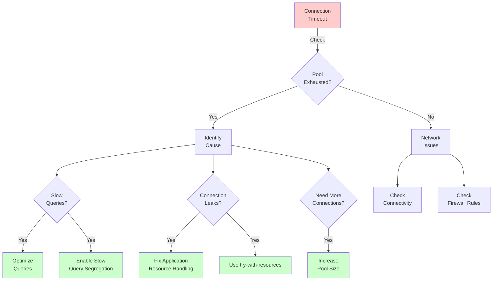

# Appendix G: Troubleshooting

Even the most robust systems encounter issues in production. Open J Proxy aims for reliability, but database proxies sit in a complex stack where problems can originate from applications, networks, the proxy itself, or databases. This appendix equips you with diagnostic techniques and solutions for the most common problems you'll encounter.

## G.1 Diagnostic Fundamentals

Before diving into specific issues, let's establish a systematic troubleshooting approach that applies to any OJP problem.

### The Troubleshooting Mindset

When something goes wrong with OJP, resist the urge to immediately blame the proxy. Database connectivity issues often stem from network problems, database server issues, or application misconfiguration. OJP might be the messenger reporting these problems rather than their cause.

Start by identifying symptoms precisely. "OJP doesn't work" isn't actionable, but "applications timeout after 30 seconds when executing SELECT queries" gives you something concrete to investigate. Note when the problem started, which operations fail, and whether any changes preceded the issue.

Reproduce the problem in a controlled environment if possible. Intermittent issues in production become much easier to debug when you can trigger them reliably in a test environment. Simplified reproduction—like running a single query from a JDBC test program—eliminates variables and focuses your investigation.

### Essential Diagnostic Tools

Several tools prove invaluable when troubleshooting OJP deployments.

Enable debug logging to see what OJP is actually doing. Add `-Dojp.log.level=DEBUG` to your server startup and `-Dojp.jdbc.log.level=DEBUG` to your application if you're using the JDBC driver. Debug logs reveal connection acquisition attempts, query routing decisions, and error conditions that normal logs don't show.

Network analysis tools like `tcpdump` or Wireshark help when you suspect network issues. Capture packets between your application and OJP, or between OJP and the database, to verify connectivity and inspect actual network traffic.

Database server logs often contain critical clues. If OJP reports connection failures, check whether the database rejected connections due to authentication failures, resource limits, or server configuration issues.

Prometheus metrics (Chapter 13) provide operational visibility. Check connection pool utilization, error rates, and latency metrics before assuming OJP itself has failed. High connection pool utilization might indicate slow queries rather than OJP problems.

**[AI Image Prompt: Create a troubleshooting workflow diagram showing the systematic approach to OJP issues. Display a decision tree: 1) Start with "Identify symptoms" (collect exact error messages, timing, affected operations), 2) "Can reproduce?" branch (yes=controlled test, no=production investigation), 3) "Check logs" (OJP debug logs, database logs, application logs), 4) "Check metrics" (connection pools, latency, errors), 5) "Network test" (connectivity, latency, packet loss), 6) "Isolate layer" (application, OJP, network, database). Use flowchart style with clear decision points and action boxes. Include icons for each tool/step. Style: Technical flowchart, professional, clear visual hierarchy, color-coded severity levels.]**

## G.2 Build and Installation Issues

Getting OJP built and running correctly forms the foundation for everything else. Let's address common setup problems.

### Build Failures

When building OJP from source, Maven might fail with dependency resolution errors. The most common cause is an outdated Maven repository index. Run `mvn clean install -U` to force dependency updates. The `-U` flag tells Maven to check for updated snapshots and releases, which resolves most dependency issues.

Compilation errors mentioning gRPC or protobuf classes usually indicate the Protocol Buffer compiler hasn't generated Java code. Ensure you have `protoc` installed and accessible in your PATH. The Maven build should invoke it automatically, but you can manually trigger code generation with `mvn clean generate-sources`.

If tests fail during the build, you might be hitting database connectivity issues. OJP's test suite requires Docker to spin up test databases. Verify Docker is running and you have sufficient resources allocated (at least 4GB RAM for Docker). Some tests use Testcontainers, which needs Docker socket access—ensure your user has permission to access `/var/run/docker.sock`.

Memory errors during the build typically stem from insufficient heap space for Maven. Set `MAVEN_OPTS` to allocate more memory:

```bash
export MAVEN_OPTS="-Xmx2g -XX:MaxPermSize=512m"
mvn clean install
```

### JAR Execution Problems

When running the OJP Server JAR, "class not found" errors indicate classpath issues. The ojp-server JAR should be a fat JAR containing all dependencies. Verify you're using the correct JAR file—it's in `ojp-server/target/` and includes `-jar-with-dependencies` in the filename.

Port conflicts prevent OJP from starting when another process already uses its ports. OJP listens on port 9090 (gRPC) and 9159 (metrics) by default. Check what's using these ports:

```bash
# On Linux/Mac
lsof -i :9090
lsof -i :9159

# On Windows
netstat -ano | findstr :9090
netstat -ano | findstr :9159
```

Change OJP's ports if needed using `-Dojp.server.port=9091 -Dojp.prometheus.port=9160`.

Permission errors accessing configuration files usually mean file ownership or permissions are incorrect. Ensure the user running OJP has read access to any configuration files and write access to log directories.

### Driver Installation Issues

The JDBC driver must be accessible to your application's classloader. For Maven projects, add the dependency:

```xml
<dependency>
    <groupId>org.openjproxy</groupId>
    <artifactId>ojp-jdbc-driver</artifactId>
    <version>0.3.1-beta</version>
</dependency>
```

For non-Maven projects, download the driver JAR and add it to your application's classpath. Don't mix multiple versions of the driver in the same classloader—this causes class loading conflicts and unpredictable behavior.

Class loading issues in application servers (Tomcat, JBoss) sometimes require placing the driver in a parent classloader. For Tomcat, this means `$CATALINA_HOME/lib`. For JBoss/WildFire, consult their documentation on JDBC driver installation.

**[AI Image Prompt: Create a troubleshooting checklist infographic for OJP installation issues. Display 5 common problems as separate cards: 1) Build failures (Maven flags, protoc check, Docker requirement), 2) JAR execution (classpath verification, port conflicts, permissions), 3) Driver installation (Maven dependencies, classloader considerations), 4) Database drivers (ojp-libs directory, download script), 5) First connection (JDBC URL format, server connectivity). For each card, show problem symptoms, diagnostic commands, and solutions. Use checkmark icons for steps to verify. Style: Checklist infographic, modern flat design, organized layout, clear typography.]**

## G.3 Connection Problems

Connection issues account for the majority of OJP troubleshooting cases. Let's systematically address them.

### Cannot Connect to OJP Server

When applications can't connect to OJP Server, start by verifying the server is actually running. Check the process exists and is listening on the expected port:

```bash
# Verify process is running
ps aux | grep ojp-server

# Check it's listening on the gRPC port
netstat -ln | grep 9090
```

If the server isn't running, check its logs for startup failures. Common startup problems include configuration errors, missing database drivers, or insufficient system resources.

Network connectivity between application and OJP requires testing. From the application host, try connecting to OJP's port:

```bash
telnet ojp-server.example.com 9090
# or
nc -zv ojp-server.example.com 9090
```

Firewall rules might block the gRPC port. Many corporate firewalls don't allow non-standard ports. Verify firewall rules permit traffic on port 9090, or configure OJP to use a different port if needed.

JDBC URL format errors prevent successful connections even when network connectivity works. The correct format is:

```
jdbc:ojp://hostname:port/database
```

Common mistakes include forgetting the `ojp://` protocol, using wrong port numbers, or including database-specific parameters that should go in the ojp.properties file instead.

### Authentication Failures

Authentication errors like "Access denied for user" actually originate from the database server, not OJP. OJP passes credentials through to the database, so authentication failures indicate either incorrect credentials or database-side permission issues.

Verify credentials work by connecting directly to the database, bypassing OJP:

```bash
# PostgreSQL
psql -h db.example.com -U myuser -d mydb

# MySQL
mysql -h db.example.com -u myuser -p mydb
```

If direct connections work but OJP connections fail, check the properties you're passing. The JDBC driver sends properties to OJP, which forwards them to the database. Ensure you're setting `user` and `password` properties correctly:

```java
Properties props = new Properties();
props.setProperty("user", "myuser");
props.setProperty("password", "mypassword");
Connection conn = DriverManager.getConnection("jdbc:ojp://localhost:9090/mydb", props);
```

Some databases require additional authentication parameters. Oracle might need `oracle.net.authentication_services=(TCPS)` for SSL authentication. PostgreSQL might require `ssl=true`. These go in the properties object, not the JDBC URL.

### Connection Pool Exhaustion

When all connections in OJP's pool are busy, new requests must wait. If they wait too long, connection timeout exceptions occur. This manifests as intermittent failures during peak load—requests succeed initially but start timing out as the pool fills.

Check connection pool metrics in Prometheus. `hikaricp_connections_active` shows busy connections, while `hikaricp_connections_idle` shows available connections. If idle connections drop to zero regularly, you've hit pool capacity.

Identify why connections aren't being released. The two most common causes:

Long-running queries hold connections for extended periods. Check your database's slow query log to identify expensive queries. Optimize them or segregate them using OJP's slow query segregation feature (Chapter 8).

Connection leaks occur when applications don't close connections, statements, or result sets properly. Always use try-with-resources in Java:

```java
try (Connection conn = dataSource.getConnection();
     PreparedStatement stmt = conn.prepareStatement(sql);
     ResultSet rs = stmt.executeQuery()) {
    // Process results
} // Connection automatically returned to pool
```

Forgotten ResultSets are particularly problematic. Even if you close the Connection, an unclosed ResultSet keeps the actual database connection busy until garbage collection runs.

Increase pool size if your application legitimately needs more concurrent connections. Edit `ojp.properties`:

```properties
# Increase maximum pool size
hikariCP.maximumPoolSize=50

# Increase minimum idle connections
hikariCP.minimumIdle=10
```

Remember that each connection consumes database resources. Don't set pool sizes arbitrarily large—size them based on measured concurrent connection needs.



### Connection Timeouts

When connections time out, you need to determine where the timeout occurs—at the JDBC driver, at OJP Server, or at the database.

JDBC driver timeouts are configured in your connection properties:

```properties
# Connection timeout in milliseconds
ojp.connection.timeout=30000

# Query timeout in seconds
queryTimeout=60
```

If connections time out before queries complete, increase `ojp.connection.timeout`. If queries themselves time out, either increase `queryTimeout` or optimize the queries.

OJP Server has its own timeout settings for backend database connections. Check `ojp-server-config.properties`:

```properties
# Maximum connection lifetime (milliseconds)
hikariCP.maxLifetime=600000

# Connection timeout to database (milliseconds)  
hikariCP.connectionTimeout=10000
```

Database timeouts require checking database server configuration. PostgreSQL has `statement_timeout` and `idle_in_transaction_session_timeout`. MySQL has `wait_timeout` and `interactive_timeout`. These database-side timeouts can terminate connections or queries even if OJP's timeouts are generous.

Coordinate timeouts across layers. As a general rule:
- Application query timeout < OJP connection timeout < Database statement timeout
- This ensures timeouts happen at the application layer where you can handle them gracefully, rather than deeper in the stack where they cause more disruptive failures.

## G.4 Performance Problems

When OJP performs poorly, multiple factors might be responsible. Let's diagnose and resolve them systematically.

### High Latency

If database queries through OJP are slower than direct connections, measure where latency accumulates. Enable debug logging and time each phase:

```java
long start = System.nanoTime();
Connection conn = dataSource.getConnection();
long connectionTime = System.nanoTime() - start;

start = System.nanoTime();
Statement stmt = conn.createStatement();
ResultSet rs = stmt.executeQuery("SELECT * FROM users");
long queryTime = System.nanoTime() - start;

start = System.nanoTime();
while (rs.next()) {
    // Process row
}
long fetchTime = System.nanoTime() - start;
```

This reveals whether latency comes from connection acquisition (OJP's connection pool), query execution (database performance), or result fetching (network throughput).

Network latency between application and OJP, or between OJP and database, adds up. Measure round-trip times:

```bash
# Measure latency to OJP Server
ping -c 10 ojp-server.example.com

# Measure latency to database
ping -c 10 db.example.com
```

High network latency (>10ms) significantly impacts query performance, especially for queries that return many small rows. Consider deploying OJP closer to either the application or database, whichever has worse latency.

Connection pool configuration affects latency. If `minimumIdle` is too low, requests must wait for new connections to be established. Set `minimumIdle` to handle your typical concurrent request load:

```properties
hikariCP.minimumIdle=20
```

Too many concurrent connections can also cause latency. If you're maxing out database connection limits, queries queue waiting for database connections to become available. This is a capacity issue—scale your database or reduce concurrent query load.

### Memory Pressure

High memory usage in OJP Server typically stems from buffering large result sets. OJP tries to stream results, but if your application doesn't consume them fast enough, buffering occurs.

Monitor JVM memory metrics:

```bash
# Check heap usage
jps -l | grep ojp-server  # Get PID
jstat -gc <PID> 1000      # GC stats every second
```

Frequent garbage collections or OOM errors indicate memory pressure. Common causes:

Large result sets that applications fetch entirely into memory. Use streaming fetch (set fetch size) to process results incrementally:

```java
Statement stmt = conn.createStatement();
stmt.setFetchSize(1000);  // Fetch 1000 rows at a time
ResultSet rs = stmt.executeQuery(sql);
```

Too many concurrent connections multiplied by per-connection memory overhead. Each connection consumes heap space for connection state, buffers, and metadata. Reduce `maximumPoolSize` if memory becomes constrained:

```properties
hikariCP.maximumPoolSize=30
```

Tune JVM heap size based on observed usage. Allocate enough heap for peak load plus headroom for garbage collection:

```bash
java -Xms2g -Xmx4g -jar ojp-server.jar
```

Use `-Xms` (initial heap) close to `-Xmx` (maximum heap) to avoid heap resizing overhead. Monitor GC logs (`-Xlog:gc*:file=gc.log`) to verify GC behavior is acceptable—minor GCs should complete in under 100ms, major GCs should be infrequent.

**[AI Image Prompt: Create a performance troubleshooting decision tree diagram. Start with "Performance Issue" at top, branch into three main categories: 1) High Latency (branches: connection acquisition, query execution, result fetching, network latency), 2) Memory Pressure (branches: large result sets, too many connections, insufficient heap), 3) CPU Saturation (branches: too many concurrent queries, expensive queries, insufficient resources). For each leaf node, show diagnostic commands and solutions. Use color coding: red for symptoms, yellow for diagnostics, green for solutions. Style: Technical decision tree, clear hierarchy, professional colors, monospace font for commands.]**

## G.5 Multinode Deployment Issues

Multinode OJP deployments introduce additional complexity. Let's troubleshoot common multinode problems.

### Server Discovery Failures

In multinode mode, OJP instances must discover each other. If discovery fails, you'll see log messages indicating the cluster size is incorrect or servers aren't detecting peers.

Verify network connectivity between all OJP instances. Each server must reach every other server on the gRPC port:

```bash
# From server1, test connectivity to server2
nc -zv server2.example.com 9090

# From server2, test connectivity to server1
nc -zv server1.example.com 9090
```

Check that all servers are configured with the same cluster membership. The JDBC URL must include all server addresses:

```
jdbc:ojp://server1:9090,server2:9090,server3:9090/mydb
```

Missing servers in this list prevent clients from discovering them.

DNS resolution problems cause intermittent discovery failures. Test DNS resolution from each server:

```bash
nslookup server1.example.com
nslookup server2.example.com
```

If DNS is unreliable, use IP addresses in the JDBC URL instead of hostnames, or set up local `/etc/hosts` entries for stable resolution.

### Load Imbalance

Ideally, OJP's load-aware selection distributes queries evenly across healthy servers. If you observe significant load imbalance, investigate why.

Check load metrics in Prometheus. Compare `grpc_server_started_total` across servers—they should be roughly equal if load distribution works correctly.

Network latency differences cause load imbalance. If one server has better network connectivity to the application cluster, it will receive more queries. Measure latency from applications to each OJP server:

```bash
# From application host
for i in server1 server2 server3; do
    echo -n "$i: "
    ping -c 5 $i.example.com | grep avg | awk '{print $4}' | cut -d/ -f2
done
```

Significant latency differences (>5ms) cause noticeable load imbalance. Deploy OJP servers symmetrically with respect to network topology to minimize latency variance.

Server capacity differences also create imbalance. If one server has more CPU or memory than others, it can handle more load. OJP's load balancing doesn't account for server capacity—it assumes homogeneous servers. Use identical server configurations in multinode clusters.

### Connection Redistribution Problems

When a failed server recovers, connections should redistribute to it over time. If they don't, you might be experiencing the bug documented in the multinode-connection-redistribution-fix.

Verify redistribution is enabled in OJP's configuration:

```properties
ojp.redistribution.enabled=true
```

Check server health check logs for messages about recovered servers and redistribution:

```
INFO  Triggering connection redistribution for 1 recovered server(s)
```

If you see these logs but connections don't redistribute, the redistribution logic might not be working. This is particularly relevant for XA mode, where connection redistribution follows different rules than non-XA mode.

For XA deployments, connection redistribution happens through session invalidation rather than active rebalancing. When a server fails, XA sessions are invalidated. New sessions are created on recovered servers as needed. This process is passive—you won't see active redistribution messages in logs.

### Split-Brain Scenarios

In rare cases, network partitions can cause split-brain scenarios where different OJP servers have different views of cluster membership. Servers in separate network partitions both think they're the only healthy instances.

Split-brain manifests as inconsistent behavior—some clients see one set of servers healthy, others see a different set. Database connections might get duplicated across partitions rather than properly managed by the cluster.

Preventing split-brain requires proper network configuration. Ensure all OJP servers share the same network with reliable connectivity. Deploy servers in the same datacenter when possible, or use site-to-site VPNs for multi-datacenter deployments.

Detecting split-brain requires monitoring cluster membership from an external observer. A monitoring system that queries all servers can identify when servers disagree about cluster state:

```bash
# Query server1's view of cluster
curl http://server1:9159/metrics | grep multinode_cluster_size

# Query server2's view of cluster
curl http://server2:9159/metrics | grep multinode_cluster_size
```

If these values differ, you have a split-brain condition. Restart affected servers to force them to rediscover the cluster correctly.

**[AI Image Prompt: Create an illustrated guide showing multinode troubleshooting scenarios. Display 4 panels: 1) "Discovery Failure" - show servers unable to see each other with X marks on network connections, 2) "Load Imbalance" - show 3 servers with uneven load bars (80%, 40%, 20%), 3) "Connection Redistribution" - show before/after server recovery with connection flow arrows redistributing, 4) "Split-Brain" - show two groups of servers with different cluster views separated by a network partition symbol. Use server rack icons, network connection lines, and clear visual metaphors. Style: Technical illustration, isometric or flat design, clear problem representation.]**

## G.6 Database-Specific Issues

Different databases have unique quirks that affect OJP behavior. Let's address database-specific problems.

### PostgreSQL Issues

PostgreSQL's `idle_in_transaction` timeout can terminate connections that OJP is holding in its pool. If you see connection errors after periods of inactivity, this timeout is likely the cause.

Increase PostgreSQL's timeout or configure HikariCP's `maxLifetime` to be less than the timeout:

```sql
-- In PostgreSQL
ALTER DATABASE mydb SET idle_in_transaction_session_timeout = 600000;  -- 10 minutes
```

```properties
# In ojp.properties
hikariCP.maxLifetime=540000  -- 9 minutes, less than PostgreSQL timeout
```

PostgreSQL's connection limit is per-database-instance. If you hit `too many connections` errors, either increase PostgreSQL's `max_connections` setting or reduce OJP's connection pool size:

```sql
-- In postgresql.conf
max_connections = 200
```

SSL connection issues with PostgreSQL require the appropriate JDBC parameters:

```
jdbc:ojp://localhost:9090/mydb?ssl=true&sslmode=require
```

Some PostgreSQL deployments require client certificates. Place certificates in OJP Server's environment and reference them in JDBC properties.

### MySQL/MariaDB Issues

MySQL's `wait_timeout` setting terminates idle connections. Set HikariCP's `maxLifetime` below this value:

```sql
-- In MySQL
SHOW VARIABLES LIKE 'wait_timeout';  -- Check current value
SET GLOBAL wait_timeout = 28800;     -- 8 hours
```

```properties
# In ojp.properties
hikariCP.maxLifetime=25200000  -- 7 hours
```

Character encoding issues cause garbled data in results. Ensure consistent encoding throughout the stack:

```
jdbc:ojp://localhost:9090/mydb?characterEncoding=utf8&useUnicode=true
```

MySQL's `max_allowed_packet` limits result set sizes. If you fetch large result sets and see packet errors, increase this setting:

```sql
SET GLOBAL max_allowed_packet=67108864;  -- 64MB
```

### Oracle Issues

Oracle requires proprietary drivers that OJP doesn't include by default. Download Oracle JDBC drivers and place them in the `ojp-libs` directory (Chapter 4).

Oracle's service name vs. SID distinction confuses many users. Use the correct JDBC URL format:

```
# Service name
jdbc:ojp://localhost:9090/service_name?service_name=ORCL

# SID
jdbc:ojp://localhost:9090/sid?SID=ORCL
```

Oracle's session multiplexing (shared server mode) incompatible with connection pooling can cause weird behavior. Ensure your Oracle instance runs in dedicated server mode for use with OJP.

Oracle RAC deployments require special handling. While OJP's multinode mode handles OJP server failures, Oracle RAC handles database node failures. These are complementary—use both for maximum availability.

### SQL Server Issues

SQL Server's connection string syntax differs from other databases. Use the correct format:

```
jdbc:ojp://localhost:9090/mydb?databaseName=MyDB&instance=SQLEXPRESS
```

Windows authentication with SQL Server requires the `integratedSecurity` parameter and appropriate native libraries:

```
jdbc:ojp://localhost:9090/mydb?integratedSecurity=true
```

The SQL Server JDBC driver must be present in `ojp-libs` and native libraries in the system path.

SQL Server's lock escalation can cause timeouts under heavy load. Monitor lock waits and consider query optimization or changing isolation levels:

```sql
-- Set isolation level
SET TRANSACTION ISOLATION LEVEL READ UNCOMMITTED;
```

## G.7 Logging and Debug Techniques

Effective logging makes troubleshooting dramatically easier. Let's explore OJP's logging capabilities.

### Adjusting Log Levels

OJP uses SLF4J with Logback as the logging implementation. Control log levels through JVM properties or logback.xml configuration.

For temporary debugging, use JVM properties to increase verbosity:

```bash
# Enable debug logging for all OJP components
java -Dojp.log.level=DEBUG -jar ojp-server.jar

# Enable debug logging for specific packages
java -Dorg.openjproxy.grpc.client.level=DEBUG -jar ojp-server.jar
```

For permanent configuration, create or edit `logback.xml` in your classpath:

```xml
<configuration>
    <appender name="STDOUT" class="ch.qos.logback.core.ConsoleAppender">
        <encoder>
            <pattern>%d{HH:mm:ss.SSS} [%thread] %-5level %logger{36} - %msg%n</pattern>
        </encoder>
    </appender>

    <!-- Set package-specific log levels -->
    <logger name="org.openjproxy.grpc.client" level="DEBUG"/>
    <logger name="org.openjproxy.grpc.server" level="INFO"/>
    <logger name="com.zaxxer.hikari" level="DEBUG"/>  <!-- HikariCP -->

    <root level="INFO">
        <appender-ref ref="STDOUT"/>
    </root>
</configuration>
```

Key packages to adjust for troubleshooting:
- `org.openjproxy.grpc.client` - JDBC driver behavior
- `org.openjproxy.grpc.server` - Server-side operations
- `com.zaxxer.hikari` - Connection pool behavior
- `io.grpc` - gRPC framework (very verbose, use sparingly)

### Understanding Log Messages

Debug logs contain valuable information. Learn to interpret common log patterns:

```
DEBUG [grpc-default-executor-0] MultinodeConnectionManager - Selected server server1:9090 with load 15
```

This shows which server was chosen for a connection and why (load = 15 active connections). If load distributions look wrong, you've identified a load balancing issue.

```
DEBUG [grpc-default-executor-1] HikariPool - Connection acquired in 234ms
```

Connection acquisition taking >100ms suggests pool contention. Check if you need more connections or have slow queries holding connections.

```
WARN [ojp-health-check-thread] ServerEndpoint - Health check failed for server2:9090: Connection refused
```

Health check failures indicate a server is unreachable. Verify the server is running and network connectivity works.

```
ERROR [grpc-default-executor-2] GrpcExceptionHandler - Unhandled exception: java.sql.SQLException: Connection timed out
```

Unhandled exceptions in gRPC threads indicate errors not properly caught and handled. These often represent bugs in error handling code.

### Enabling gRPC Debug Logging

For deep gRPC protocol debugging, enable gRPC's native logging:

```bash
java -Djava.util.logging.config.file=grpc-logging.properties -jar ojp-server.jar
```

Create `grpc-logging.properties`:

```properties
handlers=java.util.logging.ConsoleHandler
java.util.logging.ConsoleHandler.level=ALL

# gRPC loggers
io.grpc.level=FINE
io.grpc.netty.level=FINE
io.netty.level=INFO
```

This produces extremely verbose output showing every gRPC call, stream lifecycle event, and HTTP/2 frame. Use this only when you need to debug protocol-level issues, not for routine troubleshooting.

### Structured Logging for Production

Production systems benefit from structured logging that's machine-parseable. Configure Logback to output JSON:

```xml
<encoder class="net.logstash.logback.encoder.LogstashEncoder">
    <includeContext>false</includeContext>
    <includeMdc>true</includeMdc>
</encoder>
```

This outputs logs in JSON format suitable for ingestion by Elasticsearch, Splunk, or other log aggregation systems:

```json
{
  "timestamp": "2025-01-04T10:30:45.123Z",
  "level": "ERROR",
  "logger": "org.openjproxy.grpc.server.OjpServiceImpl",
  "message": "Query execution failed",
  "exception": "java.sql.SQLException: ...",
  "thread": "grpc-default-executor-5",
  "mdc": {
    "connectionId": "conn-12345",
    "queryId": "query-67890"
  }
}
```

Structured logs enable powerful queries like "show all errors for connection conn-12345" or "find queries that took >1 second."

**[AI Image Prompt: Create a visual guide to OJP log levels and their use cases. Display 5 log levels as horizontal bars with increasing verbosity: 1) ERROR (red) - production, critical issues only, 2) WARN (orange) - production, includes recoverable issues, 3) INFO (blue) - production, operational events, 4) DEBUG (yellow) - troubleshooting, detailed operation flow, 5) TRACE (purple) - development only, extremely verbose. For each level, show example log messages, appropriate use case, and performance impact indicator. Include a "severity meter" showing which levels to use when. Style: Educational infographic, color-coded severity, clear information hierarchy, code samples in monospace font.]**

## G.8 Failure Scenarios and Recovery Procedures

Production systems must handle failures gracefully. This section examines critical failure scenarios you'll encounter with OJP and provides systematic recovery procedures. Understanding these failure modes helps you build resilient architectures and respond effectively when things go wrong.

### Network Partition Scenarios

Network partitions—where network connectivity fails between components—represent one of the most challenging failure scenarios in distributed systems. OJP deployments are particularly vulnerable because they sit between applications and databases with network hops in both directions.

#### Application-to-OJP Partition

When network connectivity fails between your application and OJP Server, applications immediately experience connection failures. The JDBC driver attempts reconnection with exponential backoff, but prolonged partitions exhaust retry limits and propagate errors to your application code.

**Impact**: Applications see `java.net.ConnectException` or `io.grpc.StatusRuntimeException` with `UNAVAILABLE` status. Database connections in OJP Server's pool remain healthy but unused—the server can't reach clients to serve them.

**Detection**:
- Application logs show repeated connection failures
- OJP metrics show healthy pools but zero query throughput
- Network monitoring indicates packet loss or connectivity issues between application and OJP

**Recovery procedure**:
1. **Diagnose the partition**: Use `ping` and `traceroute` between application and OJP hosts to verify network connectivity
2. **Check network infrastructure**: Verify firewall rules, security groups, load balancers, and switches
3. **Engage network team**: If basic connectivity tools fail, escalate to network engineering
4. **Implement application circuit breaker**: Prevent connection attempts during known outages to reduce log noise
5. **Monitor automatic recovery**: Once network restores, JDBC drivers reconnect automatically within 30-60 seconds

**Prevention strategies**:
- Deploy applications and OJP in the same network segment or availability zone
- Use redundant network paths when possible
- Implement health checks that detect network issues early
- Configure aggressive TCP keepalive settings to detect dead connections quickly

#### OJP-to-Database Partition

When network connectivity fails between OJP Server and the database, the impact differs from application-to-OJP partitions. Existing connections may remain alive briefly due to TCP keepalive settings, but new connection attempts fail immediately.

**Impact**: Applications receive `SQLException` indicating connection timeout or refused connections. HikariCP connection pool health checks fail, marking connections as invalid. The pool attempts to establish new connections, which also fail, eventually exhausting the pool.

**Detection**:
- OJP logs show database connection failures: `Connection refused`, `Connection timed out`, or `Communications link failure`
- HikariCP metrics show connection creation failures and pool utilization at 100%
- Database server logs show no connection attempts (packets never arrive)

**Recovery procedure**:
1. **Verify database reachability**: From the OJP host, test database connectivity: `telnet database.host 5432`
2. **Check database server status**: Ensure the database process runs and accepts connections
3. **Examine network path**: Use `traceroute` to identify where packets fail between OJP and database
4. **Review recent changes**: Network equipment firmware updates, firewall rule changes, and routing table modifications often cause partitions
5. **Restart OJP Server**: If connectivity restores but pools don't recover, restart OJP to rebuild connection pools
6. **Monitor pool recovery**: Watch HikariCP metrics for successful connection creation and health checks passing

**Prevention strategies**:
- Enable HikariCP's connection test query: `hikariCP.connectionTestQuery=SELECT 1`
- Set aggressive connection timeouts to fail fast: `hikariCP.connectionTimeout=5000`
- Deploy monitoring that alerts on database connectivity before pools exhaust
- Use database high-availability solutions (replication, clustering) for automatic failover

#### Multi-Segment Partitions

In multinode OJP deployments, network partitions can isolate different server subsets, creating split-brain scenarios where servers can't see each other but applications can reach all servers.

**Impact**: Applications distributed across the partition reach different OJP servers. Each server thinks other servers are down and attempts to serve all traffic itself. Connection pools on isolated servers can become overloaded while other servers sit idle.

**Detection**:
- Multinode cluster membership metrics disagree across servers
- Some applications report healthy connections while others experience overload
- OJP logs show servers repeatedly failing to discover each other

**Recovery procedure**:
1. **Identify partition boundaries**: Query each server's view of cluster membership
2. **Assess server health**: Verify which servers remain healthy and accessible
3. **Force cluster refresh**: Restart all OJP servers simultaneously to re-establish cluster state
4. **Verify cluster convergence**: Confirm all servers agree on membership before restoring application traffic
5. **Investigate root cause**: Work with network team to identify why cluster discovery failed

**Prevention strategies**:
- Deploy OJP servers in the same network segment with reliable connectivity
- Use dedicated networks or VLANs for OJP cluster communication
- Implement external health monitoring that can detect split-brain conditions
- Consider deploying OJP in fewer, larger instances rather than many small instances

**[AI Image Prompt: Create a comprehensive network partition troubleshooting flowchart. Display three partition types as separate swim lanes: 1) App-to-OJP Partition (show application servers unable to reach OJP, with symptoms, detection methods, and recovery steps), 2) OJP-to-Database Partition (show OJP unable to reach database, with connection pool exhaustion, HikariCP failures, and recovery procedures), 3) Multi-Segment Partition (show split cluster with servers isolated from each other but not from applications). Use color-coded severity (red=critical, yellow=degraded), diagnostic commands in code blocks, and recovery procedure checklists. Style: Technical flowchart with decision trees, command examples, architectural diagrams showing network topology.]**

### Cascading Failure Scenarios

Cascading failures occur when one component's failure triggers failures in dependent components, creating a domino effect. OJP deployments are susceptible because they centralize database connectivity—when OJP struggles, all applications struggle.

#### Database Slowdown Cascade

When databases experience performance degradation, the effects ripple through OJP to all connected applications. Slow queries hold connections longer, exhausting connection pools and forcing applications to wait for available connections.

**Failure progression**:
1. Database query execution slows (disk contention, lock waits, resource saturation)
2. OJP's connection pools fill with connections executing slow queries
3. New queries queue waiting for available connections
4. Application request threads block waiting for database connections
5. Application thread pools exhaust, rejecting new requests
6. Load balancer health checks fail, removing application instances
7. Remaining instances receive more traffic, accelerating their failure

**Impact**: Complete application outage despite database remaining technically operational. Recovery requires addressing the root cause (slow queries) rather than just restarting components.

**Detection signals**:
- Database query latency spikes (p95, p99)
- OJP connection pool utilization reaches 100%
- Application response times increase dramatically
- Application thread pool saturation metrics

**Recovery procedure**:
1. **Identify slow queries**: Check database slow query logs and OJP query performance metrics
2. **Kill problematic queries**: Use database-specific commands to terminate long-running queries
   ```sql
   -- PostgreSQL
   SELECT pg_terminate_backend(pid) FROM pg_stat_activity WHERE state = 'active' AND query_start < now() - interval '5 minutes';
   
   -- MySQL
   SHOW FULL PROCESSLIST;
   KILL <process_id>;
   ```
3. **Increase connection timeouts temporarily**: Give legitimate queries more time to complete
4. **Scale connection pools**: Temporarily increase pool sizes if database can handle more connections
5. **Implement query circuit breakers**: Block problematic query patterns from reaching the database
6. **Monitor recovery**: Watch for connection pool utilization decreasing and query latency returning to normal

**Prevention strategies**:
- Implement query timeout limits: `hikariCP.connectionTimeout`, `hikariCP.validationTimeout`
- Enable slow query segregation (Chapter 8) to isolate problematic queries
- Set application-level timeouts shorter than database timeouts
- Implement circuit breakers in applications to fail fast
- Monitor query performance and alert on degradation before pools exhaust

#### Connection Pool Exhaustion Cascade

When one pool exhausts its connections, it can trigger exhaustion in other pools through retry and failover logic, eventually bringing down the entire system.

**Failure progression**:
1. One OJP server's connection pool exhausts (slow queries, database issues)
2. Applications timeout waiting for connections from that server
3. JDBC driver failover logic redirects requests to other servers
4. Other servers receive sudden traffic spike
5. Their connection pools also exhaust under increased load
6. Applications experience widespread connection failures

**Impact**: What starts as a single-server problem cascades to all servers, causing complete outage.

**Recovery procedure**:
1. **Identify the initial failure**: Examine metrics to determine which server exhausted first
2. **Address root cause**: Fix the issue causing initial exhaustion (slow queries, database connectivity)
3. **Restart affected servers**: Clear hung connections and reset pool state
4. **Gradually restore traffic**: Use connection limits to prevent immediate re-exhaustion
5. **Monitor for stability**: Ensure pools remain healthy before fully restoring traffic

**Prevention strategies**:
- Configure appropriate maximum pool sizes: `hikariCP.maximumPoolSize`
- Implement connection acquisition timeouts: `hikariCP.connectionTimeout=30000`
- Use HikariCP's leak detection: `hikariCP.leakDetectionThreshold=300000`
- Deploy sufficient OJP server capacity with headroom for traffic spikes
- Implement application-level retry limits to prevent request amplification

#### OJP Server Overload Cascade

When OJP servers become overloaded (CPU saturation, memory pressure), they slow down or crash, redistributing load to surviving servers and potentially causing their failure too.

**Failure progression**:
1. One OJP server experiences high CPU or memory usage
2. Server becomes unresponsive or crashes
3. Health checks fail, removing server from load balancer rotation
4. Traffic redistributes to remaining servers
5. Remaining servers receive more load than they can handle
6. Additional servers fail, creating a cascade

**Recovery procedure**:
1. **Stop the cascade**: Reduce application traffic immediately (rate limiting, traffic shedding)
2. **Restart failed servers**: Clear any hung states and restore capacity
3. **Gradually increase traffic**: Slowly ramp up load while monitoring server health
4. **Identify overload cause**: Examine what triggered initial overload (traffic spike, memory leak, inefficient query patterns)
5. **Implement mitigation**: Address root cause before fully restoring traffic

**Prevention strategies**:
- Deploy sufficient OJP server capacity (N+2 redundancy minimum)
- Implement autoscaling for OJP servers based on CPU and memory metrics
- Configure JVM heap sizes appropriately (Chapter 6)
- Enable GC logging to identify memory issues early
- Use connection limits and rate limiting to prevent overload

**[AI Image Prompt: Create a cascading failure sequence diagram showing three failure types. Display as timeline diagrams: 1) Database Slowdown Cascade - show 5-stage progression from slow DB queries to complete app outage with time markers and component state (healthy→degraded→failed), 2) Connection Pool Exhaustion Cascade - show domino effect of pool exhaustion across 4 OJP servers with metrics graphs, 3) Server Overload Cascade - show CPU/memory overload triggering health check failures and traffic redistribution causing secondary failures. Use red arrows showing failure propagation, metrics graphs showing degradation, and recovery steps as green action boxes. Style: Technical sequence diagram with timeline, state transitions, metrics visualization, clear cause-effect relationships.]**

### Server Restart and Upgrade Procedures

Restarting or upgrading OJP servers requires careful coordination to minimize application impact. Improper procedures can cause widespread connection failures and data inconsistency.

#### Graceful Server Shutdown

Shutting down an OJP server while applications actively use it requires draining connections gracefully rather than abrupt termination.

**Standard shutdown procedure**:
1. **Remove from load balancer**: Stop sending new connections to the server
2. **Wait for connection drain**: Monitor active connection count decreasing
   ```bash
   # Watch active connections
   curl http://server:9159/metrics | grep hikari_active_connections
   ```
3. **Send shutdown signal**: Use `SIGTERM` (not `SIGKILL`) to allow graceful shutdown
   ```bash
   kill -TERM <ojp-server-pid>
   ```
4. **Wait for complete shutdown**: OJP attempts to close pools and release resources (30-60 seconds)
5. **Verify shutdown**: Confirm process terminated and ports released

**Forced shutdown** (when graceful fails):
```bash
# If SIGTERM doesn't work after 60 seconds
kill -KILL <ojp-server-pid>
```

Force-killing leaves connections in undefined states. Applications may experience connection errors and need to reconnect.

#### Rolling Upgrades

Upgrading OJP servers without downtime requires rolling upgrades—updating servers one at a time while others handle traffic.

**Rolling upgrade procedure**:
1. **Pre-upgrade validation**:
   - Test new version in non-production environment
   - Review release notes for breaking changes
   - Backup current configuration
   - Verify rollback plan

2. **Upgrade first server**:
   - Remove server from load balancer
   - Wait for connection drain (2-5 minutes)
   - Stop OJP Server process
   - Deploy new version
   - Start new version with same configuration
   - Verify startup (check logs for errors)
   - Verify health checks pass
   - Monitor for 5-10 minutes before proceeding

3. **Verify before continuing**:
   - Check metrics for any anomalies
   - Test connectivity from applications
   - Ensure no error rate increase

4. **Upgrade remaining servers**:
   - Repeat process for each server
   - Leave sufficient time between upgrades (10-15 minutes)
   - Keep at least 50% of servers on old version until confident

5. **Complete upgrade**:
   - Update all servers to new version
   - Update JDBC driver version if needed
   - Monitor for 24 hours after completion

**Rollback procedure** (if issues detected):
1. **Stop upgrade immediately**: Don't upgrade additional servers
2. **Revert upgraded servers**: Redeploy previous version
3. **Verify stability**: Ensure original version operates normally
4. **Investigate issues**: Determine what caused upgrade failure

#### Multinode Cluster Restarts

Restarting all servers in a multinode cluster requires special consideration because cluster membership discovery happens during startup.

**Cluster restart procedure**:
1. **Plan maintenance window**: Brief application outage unavoidable during full cluster restart
2. **Notify applications**: Inform application teams of maintenance window
3. **Stop all servers simultaneously**: Prevents split-brain scenarios
4. **Verify all stopped**: Confirm no servers remain running
5. **Start servers with delay**: Start first server, wait for full startup (30-60 seconds), start next
6. **Verify cluster formation**: Check that all servers discover each other
   ```bash
   curl http://server1:9159/metrics | grep multinode_cluster_size
   curl http://server2:9159/metrics | grep multinode_cluster_size
   ```
7. **Restore traffic gradually**: Don't send full load immediately after restart

**Common restart failures**:
- **Split-brain**: Servers form separate clusters. Solution: Restart all servers simultaneously.
- **Discovery timeout**: Servers don't find each other. Solution: Verify multicast/unicast configuration, check network connectivity.
- **Port conflicts**: New servers can't bind to ports. Solution: Verify old processes fully terminated, check for orphaned processes.

**[AI Image Prompt: Create a visual guide for OJP server restart and upgrade procedures. Display 4 panels: 1) Graceful Shutdown - show step-by-step workflow with load balancer removal, connection draining graph (decreasing from 100 to 0 over time), SIGTERM signal, and verification steps, 2) Rolling Upgrade - show 4-server cluster with sequential upgrade (server states: running→draining→upgrading→verifying→complete), time markers between steps, 3) Rollback Decision Tree - show decision points for continue vs. rollback, 4) Cluster Restart - show synchronized shutdown of all servers, startup sequence with delays, cluster discovery verification. Include command examples, timing guidance, and state indicators. Style: Technical procedure guide with diagrams, timelines, command blocks, clear decision points.]**

### Database Failover Handling

When databases fail over to replicas or DR sites, OJP must handle the transition gracefully. Different database architectures require different handling approaches.

#### PostgreSQL Replication Failover

PostgreSQL commonly uses streaming replication with automatic failover tools like Patroni or repmgr. When the primary fails, a replica promotes to primary.

**Failover behavior**:
- Connections to old primary fail immediately
- HikariCP detects failures through connection validation
- New connections route to new primary (if JDBC URL updated)
- Connection pool must rebuild with connections to new primary

**Handling with OJP**:
1. **Use DNS for database addressing**: Point JDBC URLs to DNS names that update during failover
2. **Configure read-write split**: Use separate JDBC URLs for read replicas vs. primary
3. **Set aggressive connection validation**: `hikariCP.connectionTestQuery=SELECT 1`, `hikariCP.validationTimeout=3000`
4. **Implement application retry logic**: Applications should retry failed transactions
5. **Monitor failover metrics**: Track connection creation failures during failover

**Recovery timeline**:
- Failover detection: 5-15 seconds (depends on connection validation interval)
- Connection pool rebuild: 10-30 seconds (depends on pool size)
- Full recovery: 30-60 seconds total

#### MySQL/MariaDB Replication Failover

MySQL replication with MHA or ProxySQL provides automatic failover. The process is similar to PostgreSQL but with different failure characteristics.

**Handling with OJP**:
1. **Configure semi-synchronous replication**: Reduces data loss risk during failover
2. **Set connection timeouts appropriately**: `hikariCP.connectionTimeout=10000`
3. **Test failover procedures**: Regular failover drills ensure smooth operation

#### Oracle RAC Failover

Oracle RAC provides transparent application failover (TAF) at the database layer. OJP's connection pooling interacts with RAC's native failover mechanisms.

**Configuration**:
```properties
# JDBC URL with RAC configuration
jdbc:ojp://localhost:9090/orcl?oracle.net.tns_admin=/path/to/tnsnames

# RAC-specific properties
oracle.net.tns_admin=/path/to/tnsnames
oracle.jdbc.implicitStatementCacheSize=50
```

**Handling RAC failover**:
- Let Oracle RAC handle instance failures automatically
- OJP connection pooling works alongside RAC services
- Configure SCAN addresses in tnsnames.ora
- Use RAC connection load balancing with OJP's server load balancing

#### SQL Server Always On Availability Groups

SQL Server's Always On provides automatic failover with ApplicationIntent routing for read-only workloads.

**Configuration**:
```properties
# Connection string with multisubnetfailover
jdbc:ojp://localhost:9090/mydb?multiSubnetFailover=true&applicationIntent=ReadWrite
```

**Handling failover**:
1. **Enable multiSubnetFailover**: Speeds failover detection in multi-subnet deployments
2. **Set failover partner**: `failoverPartner=secondary.server` in JDBC URL
3. **Configure connection retry logic**: SQL Server driver has built-in retry logic
4. **Monitor replica lag**: Ensure secondary replicas stay synchronized

**[AI Image Prompt: Create a database failover handling guide showing 4 database systems. Display as a comparison matrix: 1) PostgreSQL Replication - show primary/replica architecture, Patroni failover workflow, DNS update, OJP connection pool rebuild sequence, 2) MySQL/MariaDB - show MHA or ProxySQL routing, failover detection, connection recreation, 3) Oracle RAC - show RAC cluster with SCAN listeners, TAF working with OJP, service routing, 4) SQL Server Always On - show availability group, automatic failover, multiSubnetFailover flag effect. For each, include configuration examples, failover timeline (seconds to recovery), and OJP-specific handling. Style: Technical comparison chart with architecture diagrams, configuration snippets, timeline graphs, clear visual separation between database systems.]**

### Resource Exhaustion and Recovery

Resource exhaustion—running out of memory, threads, or connections—can cripple OJP deployments. Understanding exhaustion patterns and recovery procedures is critical.

#### Memory Exhaustion

OJP Server can exhaust heap memory through connection pool growth, query result buffering, or memory leaks. When heap exhausts, the JVM triggers full GC cycles that pause all threads, making the server unresponsive.

**Symptoms**:
- Server becomes unresponsive or very slow
- GC logs show frequent full GC cycles consuming most CPU time
- Eventually: `OutOfMemoryError: Java heap space` crashes the server

**Detection**:
```bash
# Monitor heap usage
jstat -gcutil <pid> 1000 10

# Heap dump for analysis
jmap -dump:live,format=b,file=heap.hprof <pid>

# Analyze with tools like Eclipse MAT or VisualVM
```

**Immediate recovery**:
1. **Restart server**: Only way to recover from OOME
2. **Increase heap size temporarily**: Add more RAM if available
3. **Reduce connection pool sizes**: Lower `hikariCP.maximumPoolSize` to reduce memory footprint
4. **Limit concurrent queries**: Reduce application load while investigating

**Root cause analysis**:
1. **Analyze heap dump**: Identify what objects consume memory
2. **Check for memory leaks**: Look for growing collections or unreleased resources
3. **Review query patterns**: Large result sets or inefficient queries cause memory pressure
4. **Examine GC logs**: Identify memory allocation patterns

**Long-term prevention**:
- Size heap appropriately for workload: typically 2-8GB for OJP Server
- Configure JVM flags: `-Xmx4g -XX:+UseG1GC -XX:MaxGCPauseMillis=200`
- Enable GC logging: `-Xlog:gc*:file=gc.log:time,uptime`
- Implement connection pool size limits based on available memory
- Monitor heap usage and alert before exhaustion

#### Thread Exhaustion

gRPC servers use thread pools to handle concurrent requests. When all threads execute long-running operations, new requests queue and eventually time out.

**Symptoms**:
- Applications experience connection timeouts
- OJP server remains running but unresponsive
- Thread dumps show all threads blocked on database operations
- Metrics show maximal thread utilization

**Detection**:
```bash
# Get thread dump
jstack <pid> > threads.txt

# Count threads by state
jstack <pid> | grep "java.lang.Thread.State" | sort | uniq -c

# Check for blocked threads
jstack <pid> | grep -A 5 "State: BLOCKED"
```

**Immediate recovery**:
1. **Identify blocking operations**: Thread dump reveals what threads are doing
2. **Kill problematic database queries**: Use database commands to terminate long-running queries
3. **Restart server if necessary**: If threads remain hung after query termination
4. **Reduce concurrent load**: Limit application traffic while investigating

**Prevention**:
- Configure appropriate thread pool sizes
- Implement query timeouts at application and database levels
- Use connection timeouts to fail fast: `hikariCP.connectionTimeout=30000`
- Monitor thread utilization and alert on high usage
- Implement request rate limiting at application level

#### Connection Leak Exhaustion

Applications that don't close connections exhaust connection pools, causing new requests to timeout waiting for available connections.

**Symptoms**:
- Connection pool utilization remains at 100%
- Applications experience connection timeout errors
- HikariCP leak detection logs show leaked connections
- Pool metrics show connections never return to pool

**Detection**:
```properties
# Enable HikariCP leak detection
hikariCP.leakDetectionThreshold=60000  # 60 seconds
```

Leaked connections appear in logs:
```
WARN HikariPool - Connection leak detection triggered for conn123, stack trace follows
```

**Immediate recovery**:
1. **Identify leaking code**: Stack traces reveal where connections are acquired but not closed
2. **Fix resource management**: Ensure try-with-resources or finally blocks close connections
3. **Increase pool size temporarily**: Provide more connections while fixing leaks
4. **Enable max lifetime**: `hikariCP.maxLifetime=1800000` (30 minutes) forces connection recycling

**Code pattern fix**:
```java
// BAD: Connection leak
Connection conn = DriverManager.getConnection(url);
// ... operations ...
// Connection never closed!

// GOOD: Try-with-resources ensures closure
try (Connection conn = DriverManager.getConnection(url)) {
    // ... operations ...
} // Automatically closed
```

**Prevention**:
- Always use try-with-resources for JDBC objects
- Enable leak detection in development and testing
- Perform code reviews focusing on resource management
- Use static analysis tools (FindBugs, SpotBugs) to detect resource leaks
- Monitor connection pool utilization and alert on sustained high usage

**[AI Image Prompt: Create a resource exhaustion troubleshooting guide showing 3 exhaustion types. Display as diagnosis and recovery workflow: 1) Memory Exhaustion - show heap usage graph growing to 100%, GC time increasing, heap dump analysis workflow, recovery steps (restart, resize heap, reduce pools), prevention configurations, 2) Thread Exhaustion - show thread pool saturation graph, thread dump analysis showing blocked threads, query termination commands, thread pool sizing recommendations, 3) Connection Leak - show connection pool usage stuck at 100%, leak detection stack trace example, try-with-resources pattern fix, HikariCP configuration. Include command examples, code snippets, metrics graphs, and step-by-step recovery procedures. Style: Technical troubleshooting guide with graphs, code examples, command blocks, clear visual hierarchy.]**

### Poison Query Handling

Poison queries—queries that consistently cause failures or performance problems—can bring down entire systems if not handled properly. Unlike one-time problematic queries, poison queries repeat and accumulate impact.

#### Identifying Poison Queries

Poison queries exhibit consistent patterns: they always run slowly, consume excessive resources, or trigger database errors. Identifying them requires monitoring and analysis.

**Characteristics**:
- Execution time consistently exceeds thresholds (e.g., always >30 seconds)
- High CPU or memory consumption on database server
- Trigger database-specific errors (lock timeouts, temp space exhaustion)
- Cause cascading failures by holding connections

**Detection methods**:
1. **Query performance monitoring**: Chapter 13's telemetry identifies slow queries
2. **Database slow query logs**: Most databases log queries exceeding thresholds
3. **Pattern analysis**: Look for query templates that always perform poorly
4. **Resource monitoring**: Correlate resource spikes with specific query patterns

**Example detection query**:
```sql
-- PostgreSQL: Find consistently slow queries
SELECT
    calls,
    mean_exec_time,
    max_exec_time,
    query
FROM pg_stat_statements
WHERE mean_exec_time > 10000  -- 10 seconds
ORDER BY mean_exec_time DESC
LIMIT 20;
```

#### Mitigation Strategies

Once identified, poison queries require immediate mitigation to prevent system impact.

**Short-term mitigation**:
1. **Query blocking**: Block the exact query pattern at application or OJP level
2. **Client blocking**: If queries come from specific clients, block those clients
3. **Connection limits**: Limit concurrent executions of the query pattern
4. **Timeout reduction**: Lower query timeout specifically for problem patterns

**Medium-term fixes**:
1. **Query optimization**: Add indexes, rewrite query, update statistics
2. **Data partitioning**: Break large tables into partitions for better performance
3. **Caching layer**: Cache results for expensive queries
4. **Application changes**: Modify application to avoid problematic query patterns

**Long-term prevention**:
1. **Query validation**: Implement slow query segregation (Chapter 8)
2. **Performance testing**: Test query performance before production deployment
3. **Monitoring and alerting**: Alert on query performance degradation
4. **Regular optimization**: Maintain database indexes, update statistics, vacuum tables

#### Implementing Query Governors

Query governors limit impact of problematic queries by enforcing execution constraints.

**Statement timeout governor**:
```properties
# Set maximum query execution time
hikariCP.connectionInitSql=SET statement_timeout = '30s'
```

**Resource governor** (database-specific):
```sql
-- PostgreSQL: Limit query resources
ALTER ROLE application_user SET statement_timeout = '30s';
ALTER ROLE application_user SET temp_buffers = '100MB';

-- SQL Server: Use Resource Governor
CREATE RESOURCE POOL limited_pool WITH (MAX_CPU_PERCENT = 50);
CREATE WORKLOAD GROUP limited_group USING limited_pool;
```

**Circuit breaker pattern** (application-level):
```java
// Circuit breaker for problematic queries
if (circuitBreaker.isOpen("expensive_query")) {
    throw new ServiceUnavailableException("Circuit breaker open for this query");
}

try {
    // Execute query
    result = executeExpensiveQuery();
    circuitBreaker.recordSuccess("expensive_query");
} catch (SlowQueryException e) {
    circuitBreaker.recordFailure("expensive_query");
    throw e;
}
```

## G.9 When to Escalate Issues

Sometimes you'll encounter problems beyond your ability to resolve. Knowing when and how to escalate ensures you get help effectively.

### Gather Diagnostic Information

Before opening an issue or asking for help, collect comprehensive diagnostic information:

- **OJP versions**: Server version, JDBC driver version, and any plugins
- **Environment details**: OS, JVM version, database type and version
- **Configuration**: Relevant portions of `ojp.properties`, `ojp-server-config.properties`, and JDBC URLs (sanitized of passwords)
- **Logs**: Debug-level logs showing the problem, ideally with timestamps
- **Metrics**: Prometheus metrics during the problem period
- **Reproduction**: Steps to reproduce the issue consistently

### Creating Minimal Reproductions

The best bug reports include minimal reproductions—the simplest possible code that demonstrates the problem. This might be a small Java program:

```java
public class OJPReproduction {
    public static void main(String[] args) throws Exception {
        // Demonstrate the specific problem
        Class.forName("org.openjproxy.grpc.client.OjpDriver");
        Properties props = new Properties();
        props.setProperty("user", "testuser");
        props.setProperty("password", "testpass");
        
        try (Connection conn = DriverManager.getConnection(
                "jdbc:ojp://localhost:9090/testdb", props)) {
            // Reproduce the issue here
            Statement stmt = conn.createStatement();
            ResultSet rs = stmt.executeQuery("SELECT * FROM problem_table");
            while (rs.next()) {
                // Process results
            }
        }
    }
}
```

Minimal reproductions eliminate variables and help maintainers quickly understand and fix the issue.

### GitHub Issues

Open issues on the OJP GitHub repository (https://github.com/Open-J-Proxy/ojp/issues) for bugs or feature requests. Use the issue templates provided—they prompt for necessary information.

Search existing issues before opening a new one. Your problem might already be documented with a workaround or fix.

Good issue titles are specific: "Connection timeout after 30s with PostgreSQL 14" is much better than "OJP doesn't work."

### Community Support

The OJP community can often help with troubleshooting. Engage through:
- GitHub Discussions for questions and general troubleshooting
- The project's Discord or Slack channel (if available)
- Stack Overflow with the `open-j-proxy` tag

When asking for help, provide context and diagnostic information upfront. "My query is slow" doesn't give others enough to help. "Query X takes 5 seconds through OJP but 1 second direct to database, here are logs and metrics" gives the community something to work with.

### Professional Support

For production issues requiring immediate response, consider commercial support if available from the project maintainers or consulting firms specializing in database infrastructure.

**[AI Image Prompt: Create a poison query identification and mitigation workflow. Display as a 4-stage process: 1) Detection - show query performance monitoring dashboard with slow queries highlighted, database slow query log example, pattern analysis showing repeated problematic query, 2) Analysis - show query execution plan, resource consumption graph (CPU/memory over time), impact assessment (connections held, throughput degraded), 3) Mitigation Options - show decision tree for immediate actions (block query, reduce timeout, limit connections) vs. medium-term fixes (optimize query, add indexes, partition data), 4) Prevention - show monitoring setup, alerting configuration, SQL review checklist, query validation in CI/CD. Include SQL examples, configuration snippets, and metrics visualizations. Style: Technical workflow diagram with decision trees, code samples, graph visualizations, clear action steps.]**

---

This chapter provided comprehensive troubleshooting guidance for Open J Proxy. You learned systematic diagnostic approaches, solutions for common problems across installation, connectivity, performance, and multinode deployments, detailed failure scenario analysis and recovery procedures, and how to leverage logging effectively. You understand how to handle network partitions, cascading failures, database failovers, resource exhaustion, and poison queries. You also know when and how to escalate issues for additional help.

The addition of failure scenarios and recovery procedures in Section 15.8 provides the operational resilience knowledge needed for production deployments. Understanding these failure modes, their detection signatures, and systematic recovery procedures enables you to build robust, self-healing systems and respond effectively when problems occur.

We've completed the Operations section (Part IV) of the e-book. The next section will cover Development and Contribution, teaching you how to set up a development environment, contribute code, and understand OJP's architecture decisions. Whether you want to extend OJP with custom features or contribute back to the project, Part V provides the foundation you need.
