# Chapter 1: Introduction to Open J Proxy

> **Chapter Overview**: This chapter introduces Open J Proxy (OJP), explaining what it is, the critical problem it solves in modern architectures, how it works, and the key benefits it provides to development teams.

---

## 1.1 What is Open J Proxy?

Open J Proxy (OJP) is a **Type 3 JDBC Driver** and **Layer 7 Proxy Server** designed to decouple applications from direct database connection management. It acts as an intelligent intermediary between your Java applications and relational databases, providing a transparent Quality-of-Service layer that optimizes connection pooling and resource utilization.

### Understanding Type 3 JDBC Drivers

**[IMAGE PROMPT 1]**: Create a diagram showing the three types of JDBC drivers:
- Type 1 (JDBC-ODBC Bridge): Shows application → JDBC → ODBC → Database
- Type 2 (Native-API): Shows application → JDBC → Native Library → Database  
- Type 3 (Network Protocol): Shows application → JDBC → Middleware Server → Database
Highlight Type 3 with emphasis on the network protocol layer. Use professional technical style with clean lines and modern colors (blues and greens). Show OJP logo on the Type 3 middleware component.

JDBC drivers come in different types, each with distinct characteristics. Type 1 drivers use the JDBC-ODBC Bridge to translate JDBC calls into ODBC calls, while Type 2 drivers convert JDBC calls directly to database-specific native calls. Type 4 drivers, the most common today, directly convert JDBC calls to the database-specific protocol in pure Java. But OJP takes a different approach: it's a **Type 3 driver**, meaning it communicates with a middleware server (the OJP Server) that then connects to the database.

This middleware architecture provides several advantages that we'll explore throughout this book:


The Type 3 architecture means all database connections are managed centrally by the OJP Server, not by individual applications. This enables efficient connection multiplexing over gRPC, allowing your applications to scale elastically without proportionally increasing database connections. The architecture also provides database independence—you can switch between databases without changing application code.

### Layer 7 Proxy Architecture

**[IMAGE PROMPT 2]**: Create an illustration showing the OSI model layers (1-7) on the left side, with Layer 7 (Application Layer) highlighted. On the right, show OJP operating at Layer 7, intercepting JDBC/SQL operations and intelligently routing them to a database pool. Use professional network diagram style with clear layer separation. Include labels: "HTTP", "SQL", "JDBC" at Layer 7.

OJP operates as a **Layer 7 (Application Layer) proxy**, which means it understands and operates on the application protocol itself—in this case, JDBC/SQL. Unlike lower-layer proxies (like Layer 4 TCP proxies), OJP can inspect SQL statements and make intelligent routing decisions. It can classify queries as fast or slow (enabling the slow query segregation feature), manage transactions at the application protocol level, and implement connection pooling with full awareness of JDBC semantics. This deep protocol understanding also enables OJP to provide detailed telemetry about query execution and performance.

### Core Definition

> **Open J Proxy is the only open-source JDBC Type 3 driver globally**, introducing a transparent Quality-of-Service layer that decouples application performance from database bottlenecks.

In simple terms: **OJP sits between your application and your database, intelligently managing connections so your application can scale elastically without overwhelming your database.**

---

## 1.2 The Problem OJP Solves

Modern software architectures—microservices, event-driven systems, and serverless platforms—face a critical challenge: **database connection management at scale**.

### The Connection Storm Problem

**[IMAGE PROMPT 3]**: Create a dramatic "before and after" comparison:
LEFT SIDE (Problem): Show multiple microservice instances (10-20 containers) each with 10-20 connections all pointing to a single database. The database should look overwhelmed with red warning indicators. Label: "Traditional Architecture: N instances × M connections = Database Overload"
RIGHT SIDE (Solution): Show the same microservice instances connecting to OJP Server (shown as a smart gateway), which maintains a controlled pool of connections to the database. The database looks calm with green indicators. Label: "OJP Architecture: Controlled Connection Pool"
Use a modern infographic style with icons for microservices, clear connection lines, and professional color scheme.

Consider this scenario:


**The Problem**: Each application instance maintains its own connection pool. When you scale to 6 instances with 20 connections each, you need 120 database connections—exceeding your database's limit of 100. The result is connection pool exhaustion where new instances can't connect, database overload where too many connections degrade performance, and resource waste with connections held idle across many instances. This creates hard scaling limits—you can't scale applications without overwhelming the database. Deployments or restarts create connection storms that can bring the database down entirely.

### Real-World Pain Points

#### Microservices Architecture
In a microservices environment with 50 services, each scaled to 3 instances with 10 connections per instance, you need **1,500 database connections**. Most databases can't handle this load efficiently.

#### Serverless/Lambda Functions
Serverless functions spin up and down frequently. Each invocation traditionally needs a database connection, which creates cold start penalties while establishing connections, introduces connection pool management complexity, generates frequent connection churn, and causes database connection limits to be reached quickly during burst traffic.

#### Event-Driven Systems
Systems processing high volumes of events face unpredictable load spikes that require elastic scaling. However, database connection bottlenecks during peak loads make it impossible to scale event processors independently from database capacity.

#### Elastic Scaling Challenges

```mermaid
graph TD
    subgraph "Scaling Without OJP"
    S1[Scale Up] --> C1[More Connections Needed]
    C1 --> D1[Database Limit Reached]
    D1 --> F1[Scaling Blocked ❌]
    end
    
    subgraph "Scaling With OJP"
    S2[Scale Up] --> C2[Same Connection Pool]
    C2 --> D2[Database Happy]
    D2 --> F2[Scale Freely ✅]
    end
    
    style F1 fill:#ff5252,color:#fff
    style F2 fill:#4caf50,color:#fff
```



### The Consequences

When connection management isn't properly handled, teams experience performance degradation as the database becomes the bottleneck, outages when connection storms during deployments cause database crashes, and hard scaling limits where business growth is blocked by technical constraints. The financial impact includes high costs from over-provisioned databases needed to handle connection overhead. Operationally, teams face complexity managing connection tuning across many services, creating development friction as developers spend time on infrastructure instead of features.

> **Real-World Quote**: "The only open-source JDBC Type 3 driver globally, this project introduces a transparent Quality-of-Service layer that decouples application performance from database bottlenecks. It's a must-try for any team struggling with data access contention, offering easy-to-implement back-pressure and pooling management." 
> 
> — Bruno Bossola, Java Champion and CTO @ Meterian.io

---

## 1.3 How OJP Works

OJP solves the connection management problem through a clever architectural pattern: **virtual connections on the client side, managed connection pool on the server side**.

### Virtual vs Real Connections

**[IMAGE PROMPT 4]**: Create a detailed technical diagram:
LEFT: Show application code with JDBC connection objects (labeled "Virtual Connections" - shown as lightweight, hollow circles in blue)
CENTER: Show OJP Server as a gateway/bridge component
RIGHT: Show database with actual connection pool (labeled "Real Connections" - shown as solid, filled circles in green)
Add annotations showing:
- "100 Virtual Connections" on left
- "Only 20 Real Connections" on right
- "1:5 Ratio" in the center
Use technical diagram style with clear labels and connection flow arrows.

The key insight: **Your application can have as many JDBC connections as it needs, but only a controlled number of real database connections are used.**


**How it Works**:

1. **Application Requests Connection**: Your app calls `DriverManager.getConnection()` as usual
2. **Virtual Connection Returned**: OJP JDBC Driver returns a connection object immediately (no database connection yet)
3. **Lazy Connection Allocation**: When you execute a query, OJP Server allocates a real database connection from its pool
4. **Query Execution**: The query runs on the real connection
5. **Smart Release**: The real connection returns to the pool after the operation completes (but remains held for active transactions or open ResultSets)
6. **Virtual Connection Remains**: Your application still holds the "connection," but minimal database resources are consumed

**Important**: Real connections are retained for the duration of:
- Active transactions (until `commit()` or `rollback()` is called)
- Open ResultSets (until `ResultSet.close()` or the ResultSet is fully consumed)

### Smart Backpressure Mechanism

**[IMAGE PROMPT 5]**: Create an infographic showing a flow control system:
Show traffic/load coming from left (multiple application instances)
OJP Server in middle acting as a "smart valve" or "traffic controller" 
Database on right with stable, controlled flow
Use metaphor of water flow or traffic control
Include visual indicators: "100 requests/sec" → "Regulated to 20 concurrent" → "Database stable"
Professional infographic style with icons and clear flow indicators.

OJP implements **intelligent backpressure** to protect your database:


**Backpressure Features**:

When request volume exceeds available connections, OJP implements smart backpressure controls. Connection limits enforce maximum concurrent connections, while request queuing allows excess requests to wait safely instead of failing immediately. Timeout management prevents indefinite waiting, and the slow query segregation feature ensures fast queries aren't blocked by slow ones. The built-in circuit breaker protects against cascading failures across your system.

### Connection Lifecycle

Let's walk through a complete example:

```java
// Application Code (unchanged from standard JDBC)
String url = "jdbc:ojp[localhost:1059]_postgresql://localhost:5432/mydb";
try (Connection conn = DriverManager.getConnection(url, "user", "pass")) {
    // Virtual connection created instantly
    
    PreparedStatement stmt = conn.prepareStatement("SELECT * FROM users WHERE id = ?");
    stmt.setInt(1, 123);
    
    // Real connection acquired from OJP Server pool
    ResultSet rs = stmt.executeQuery();
    
    while (rs.next()) {
        System.out.println(rs.getString("name"));
    }
    rs.close(); // NOW real connection returned to pool
    
} // Virtual connection closed, no database impact

// Note: If you don't explicitly close the ResultSet, 
// the real connection is held until the ResultSet is garbage collected
```

**Connection Lifecycle Stages**:


### Multi-Database Support

**[IMAGE PROMPT 6]**: Create a diagram showing OJP Server at the center connected to multiple different databases:
- PostgreSQL (with logo)
- MySQL (with logo)
- Oracle (with logo)
- SQL Server (with logo)
- MariaDB (with logo)
- H2 (with logo)
Show OJP managing separate connection pools for each database
Use a hub-and-spoke layout with OJP as the central hub
Professional enterprise architecture diagram style

OJP can simultaneously manage connections to multiple databases:


---

## 1.4 Key Features and Benefits

### Smart Connection Management

OJP implements centralized pooling where all applications share a single, efficiently managed connection pool per database, eliminating the N×M connection problem entirely. Through lazy allocation, connections are allocated only when performing database operations, not when creating Connection objects. After each operation completes, automatic release returns connections to the pool immediately, maximizing utilization across all your applications.

### Elastic Scalability

With OJP, you can scale your application instances independently without increasing database connections. Consider the dramatic difference: with the traditional approach, 5 instances with 20 connections each require 100 database connections, 10 instances need 200, and 50 instances would demand 1,000 connections. With OJP, all scenarios use just 20 connections—the same pool size regardless of application scale.

**[IMAGE PROMPT 7]**: Create a comparison chart/graph:
X-axis: Number of application instances (5, 10, 20, 50)
Y-axis: Database connections needed
Two lines: "Traditional" (exponential growth) vs "OJP" (flat line)
Highlight the growing gap between the lines
Use professional chart style with clear legend and gridlines
Include a "breaking point" marker where traditional approach fails

This makes OJP perfect for cloud environments where instances scale up and down automatically, and ideal for serverless platforms like AWS Lambda and Azure Functions where connection management has traditionally been a major pain point.

### Multi-Database Support

OJP is database agnostic, supporting any database with a JDBC driver. This includes PostgreSQL, MySQL, MariaDB, Oracle, SQL Server, DB2, H2, CockroachDB, and any other JDBC-compliant database. You can even manage connections to multiple different databases from a single OJP Server instance, providing a unified connection management layer across your entire data infrastructure.

### Minimal Configuration Changes

Adopting OJP requires almost zero code changes. The only modification needed is your JDBC URL:

```java
// Before
String url = "jdbc:postgresql://localhost:5432/mydb";

// After  
String url = "jdbc:ojp[localhost:1059]_postgresql://localhost:5432/mydb";
```

That's it. OJP is a drop-in replacement—no need to change your existing JDBC code, SQL queries, or transaction management. It works seamlessly with Spring Boot, Quarkus, Micronaut, and any Java framework that uses JDBC.

### Open Source Advantage

OJP is free and open source under the Apache 2.0 license, meaning it's completely free to use, modify, and distribute. The project is community-driven with active development and support, and the full source code is available for review and contribution. There's no vendor lock-in—you can deploy anywhere, modify the code as needed, and face no licensing fees or restrictions.

### Advanced Features

**Smart Load Balancing and Automatic Failover**: OJP's JDBC driver provides client-side load balancing with real-time load awareness and transparent failover capabilities, surpassing traditional database proxies (covered in Chapter 2a).

**Slow Query Segregation**: Automatically separates fast and slow queries to prevent connection starvation (covered in Chapter 8).

**High Availability**: Multi-node deployment with automatic failover and load balancing (covered in Chapters 2a and 9).

**Observability**: Built-in OpenTelemetry support with Prometheus metrics (covered in Chapter 13).

**Circuit Breaker**: Protects against cascading failures with automatic circuit breaking (covered in Chapter 12).

### Business Benefits

OJP delivers tangible business value through multiple dimensions. Cost reduction comes from smaller database instances, reduced licensing costs, and lower infrastructure overhead. Performance improves through better connection utilization, reduced contention, and faster response times. Operational excellence stems from centralized monitoring and management, easier troubleshooting, and better capacity planning. Development velocity increases as developers focus on features rather than connection management, deployments become faster without database concerns, and microservices architecture simplifies. Risk mitigation includes protection against connection storms, graceful degradation under load, and better resilience and uptime.

---

## 1.7 Is OJP Right for You? Workload Fit and Risk Assessment

Before adopting OJP, it's essential to understand whether it fits your use case. While OJP solves critical problems for many architectures, it's not a universal solution. This section helps you assess whether OJP will reduce or increase risk for your specific workload.

### Ideal Workloads for OJP

**[IMAGE PROMPT 16]**: Create a comparison matrix showing three workload types (OLTP, Mixed, Batch) rated across multiple dimensions: Connection Efficiency, Latency Sensitivity, Transaction Patterns, Scale Elasticity. Use traffic light colors (green/yellow/red) to show fit. OLTP and Mixed workloads should be mostly green, while Batch should show mixed results. Professional business matrix style.

OJP excels in specific architectural patterns and workload types:

#### ✅ Online Transaction Processing (OLTP)
**Perfect Fit** - OJP is designed for OLTP workloads characterized by:
- Short-lived queries (milliseconds to seconds)
- High concurrency with many simultaneous connections
- Read-heavy or balanced read/write patterns
- Frequent connection open/close cycles
- Elastic scaling requirements

**Why It Works**: Virtual connections eliminate connection establishment overhead, pooling optimizes resource usage, and backpressure protects against traffic spikes.

**Example**: E-commerce platform with thousands of concurrent users, each session requiring database access for authentication, product lookups, and cart operations.

#### ✅ Microservices Architectures
**Excellent Fit** - Ideal for service-oriented designs where:
- Many services need database access
- Each service may scale independently
- Connection coordination is complex
- Deployment frequency is high

**Why It Works**: Centralized connection management prevents connection multiplication, independent service scaling doesn't proportionally increase database load, and rolling deployments don't cause connection storms.

**Example**: 30 microservices, each with 3-10 instances, all needing access to shared or separate databases without overwhelming connection limits.

#### ✅ Mixed OLTP/Analytics (Operational Reporting)
**Good Fit** - Suitable for workloads combining transactional and analytical queries:
- Primary traffic is OLTP
- Periodic or on-demand analytical queries run alongside
- Slow queries shouldn't block fast queries

**Why It Works**: Slow query segregation (Chapter 8) isolates analytical queries, preventing connection starvation for OLTP traffic.

**Example**: SaaS application where users run real-time dashboards and reports while the system handles high-volume transactional operations.

#### ⚠️ Batch Processing
**Conditional Fit** - Works for specific batch patterns:
- **Good**: Parallel batch jobs with many workers needing connection sharing
- **Good**: Event-driven batch processing with variable load
- **Poor**: Single-threaded batch ETL with one long-running connection

**Why It May Work**: If batch workload benefits from connection pooling across parallel workers or elastic scaling.

**Why It May Not**: Overhead from gRPC and virtualization adds latency to each query; single long-running connections gain no benefit from pooling.

### Workloads NOT Recommended for OJP

**[IMAGE PROMPT 17]**: Create warning-style infographic showing anti-patterns: ultra-low latency trading (with clock icon showing microseconds), data warehousing (with large database icon), single monolithic app (one big server), embedded systems (small device icon). Use red/orange warning colors. Professional warning poster style.

Understanding when NOT to use OJP is as important as knowing when to use it:

#### ❌ Ultra-Low Latency Requirements (Microseconds)
**Do NOT Use** if your SLA requires single-digit millisecond or sub-millisecond response times:
- High-frequency trading systems
- Real-time bidding platforms
- Gaming backends with microsecond budgets

**Why Not**: OJP adds ~1-3ms of network hop overhead (gRPC round-trip) plus protocol serialization. For workloads measuring latency in microseconds, this overhead is unacceptable.

**Alternative**: Use in-process connection pooling (HikariCP, DBCP) with direct database connections.

#### ❌ Pure Analytics / Data Warehousing
**Do NOT Use** for analytics-only workloads:
- Long-running analytical queries (minutes to hours)
- Few concurrent users
- Large result set transfers (GB of data)
- Scan-heavy workloads on columnar databases

**Why Not**: OJP's strength is connection management, not query optimization. Long-running queries don't benefit from pooling, and streaming large results through gRPC adds overhead. Connection virtualization provides no value when connections are held for hours.

**Alternative**: Direct connections to analytical databases (Redshift, BigQuery, Snowflake) or dedicated query engines.

#### ❌ Single Monolithic Application
**Limited Value** if you have:
- One application instance
- Predictable, constant load
- No elastic scaling requirements
- Already using efficient in-process pooling

**Why Not**: OJP's benefits emerge from managing connections across multiple instances. A single instance with stable load gains little from centralized pooling and pays overhead for network hops.

**Alternative**: Stick with in-process connection pooling unless preparing for future scale-out.

#### ❌ Embedded Systems / Resource-Constrained Environments
**Do NOT Use** in:
- IoT devices
- Edge computing with tight resource budgets
- Environments where deploying a separate server is prohibitive

**Why Not**: OJP requires running a separate server process (OJP Server), which consumes resources. The architecture assumes network availability between client and server.

**Alternative**: Lightweight embedded databases (SQLite) or direct connections to remote databases.

### Trade-Offs and Non-Guarantees

**[IMAGE PROMPT 18]**: Create a balanced scale diagram showing trade-offs: Left side "What You Gain" (scalability, centralization, backpressure), Right side "What You Accept" (latency overhead, complexity, dependency). Use professional illustration style with icons representing each concept.

OJP makes intentional trade-offs that may not suit every use case:

#### ✅ What OJP Provides
- **Connection Scalability**: Applications can scale elastically without proportional database connection growth
- **Centralized Management**: Single point of control for monitoring, configuration, and troubleshooting
- **Backpressure & Resilience**: Protection against connection storms and cascading failures
- **Multi-Database Support**: Manage connections to multiple databases from one server

#### ⚠️ What OJP Does NOT Guarantee
- **Strict JDBC Equivalence**: While OJP implements JDBC interfaces, some edge cases may behave differently (see Appendix E for compatibility matrix)
- **Zero Latency Overhead**: Network hop adds 1-3ms per operation; unacceptable for microsecond-latency requirements
- **Strict XA Correctness Under All Failures**: OJP coordinates XA transactions reliably but cannot guarantee exactly-once commit semantics under catastrophic failures (coordinator crashes during commit, network partitions). See Chapter 10 Section 10.9 for detailed analysis of XA guarantees and limitations.
- **Query Optimization**: OJP doesn't optimize SQL queries; it manages connections. Slow queries remain slow.
- **Transparent Failover for All Scenarios**: Failover works for idle connections; active transactions may need application-level retry

#### 🔄 Trade-Offs Accepted
- **Latency vs. Scalability**: Accept 1-3ms network overhead in exchange for elastic scaling capability
- **Complexity vs. Control**: Introduce middleware layer in exchange for centralized connection management
- **Dependency vs. Efficiency**: Applications depend on OJP Server availability in exchange for efficient resource usage

### New Failure Modes Introduced

**[IMAGE PROMPT 19]**: Create a fault-tree diagram showing new failure scenarios: OJP Server down, network partition, gRPC issues, pool exhaustion. Use red indicators for failure points and yellow for degraded states. Include mitigation strategies in green boxes. Professional risk assessment diagram style.

Understanding new failure modes helps you prepare mitigation strategies:

#### 1. OJP Server Availability
**New Failure Mode**: If OJP Server is down, applications cannot access the database.

**Impact**: Single point of failure for database access (though not for your application logic).

**Mitigation**:
- Deploy OJP Server in high-availability configuration (Chapter 9)
- Implement application-level circuit breakers to fail fast
- Consider multi-region deployments for critical systems
- Monitor OJP Server health proactively (Chapter 13)

#### 2. Network Partitions
**New Failure Mode**: Network issues between application and OJP Server break database access, even if database is healthy.

**Impact**: Applications appear to lose database connectivity despite database being operational.

**Mitigation**:
- Deploy OJP Server close to applications (same availability zone/data center)
- Implement connection retry logic with exponential backoff
- Use network redundancy where possible
- Monitor network latency and packet loss (Chapter 13)

#### 3. gRPC/Protocol Issues
**New Failure Mode**: gRPC connection problems, serialization failures, or protocol bugs can block operations.

**Impact**: Operations may fail with gRPC-specific errors not seen in direct JDBC connections.

**Mitigation**:
- Keep OJP JDBC Driver and Server versions synchronized
- Implement proper error handling for gRPC exceptions
- Use connection pooling at the driver level to recover from transient gRPC failures
- Review Appendix G (Troubleshooting) for gRPC diagnostics

#### 4. Connection Pool Exhaustion
**New Failure Mode**: If OJP Server pool is exhausted, new requests queue or timeout even if applications have capacity.

**Impact**: Backpressure queue fills, requests timeout, applications experience "connection unavailable" errors.

**Mitigation**:
- Right-size OJP Server connection pool based on workload (Chapter 6)
- Enable and monitor pool metrics (Chapter 13)
- Configure appropriate timeout values to fail fast
- Use slow query segregation to prevent pool monopolization (Chapter 8)

#### 5. Cascading Failures
**New Failure Mode**: Issues in one application can affect other applications sharing the same OJP Server.

**Impact**: Noisy neighbor problem—one misbehaving application can starve others of connections.

**Mitigation**:
- Deploy separate OJP Server instances for critical vs. non-critical workloads
- Implement per-application connection limits (Chapter 6)
- Use circuit breakers in applications (Chapter 12)
- Monitor per-application connection usage (Chapter 13)

### Decision Framework: Should You Adopt OJP?

**[IMAGE PROMPT 20]**: Create a decision tree flowchart starting with "Considering OJP?" and branching through key questions: "Multiple app instances?", "OLTP workload?", "Can accept 1-3ms latency?", "Need elastic scaling?". Green paths lead to "OJP is a good fit", red paths lead to "Consider alternatives". Professional flowchart style with clear yes/no branches.

Use this framework to assess whether OJP reduces net risk for your team:

#### ✅ Strong Fit Indicators
Answer "Yes" to most of these questions:
1. Do you have multiple application instances accessing the same database?
2. Is your workload primarily OLTP (short queries, high concurrency)?
3. Can you accept 1-3ms additional latency per operation?
4. Do you need elastic scaling without proportional database connection growth?
5. Do you deploy frequently and worry about connection storms?
6. Are you using or planning microservices architecture?
7. Is your database connection limit a current or anticipated bottleneck?
8. Do you have operational capacity to deploy and monitor a middleware server?

#### ⚠️ Proceed with Caution
Answer "Yes" to several of these questions:
1. Do you have strict latency SLAs in single-digit milliseconds?
2. Is your workload primarily analytical with long-running queries?
3. Do you only have one or two application instances?
4. Is your infrastructure resource-constrained (embedded systems, edge)?
5. Do you lack ability to deploy and maintain a separate server component?
6. Do you require 100% JDBC API fidelity for every edge case?

#### ❌ Likely Not a Good Fit
Answer "Yes" to any of these questions:
1. Do you require microsecond-level latency for high-frequency trading or gaming?
2. Is your workload pure data warehousing with few, long-running queries?
3. Are you running a single monolithic application with no scaling plans?
4. Do you operate in an embedded environment where deploying servers is impractical?

### Common Pitfalls and Anti-Patterns

Learn from others' mistakes—here are the top 5 ways teams have struggled with OJP:

#### 1. ⚠️ Inadequate Pool Sizing
**Problem**: Pool configured too small for workload, causing queue buildup and timeouts.

**Symptoms**: Frequent "connection timeout" errors despite low database load, high p99 latency, requests queuing in OJP Server.

**Solution**: Use the pool sizing formula in Chapter 6, monitor pool utilization (Chapter 13), and load test before production.

#### 2. ⚠️ Not Closing ResultSets
**Problem**: Applications don't explicitly close ResultSets, causing connection leaks.

**Symptoms**: Connection pool exhaustion over time, "leak detected" warnings in logs, database connections remain open longer than expected.

**Solution**: Always use try-with-resources for ResultSets, enable leak detection (Chapter 10), and review code for proper resource management.

#### 3. ⚠️ Ignoring Network Latency
**Problem**: Applications deployed far from OJP Server, incurring high network latency.

**Symptoms**: Queries that should take 10ms take 50ms, p99 latency increases significantly, user complaints about slow response times.

**Solution**: Deploy OJP Server in the same data center/availability zone as applications, monitor network latency (Chapter 13), and measure end-to-end latency.

#### 4. ⚠️ Single Point of Failure
**Problem**: Running single OJP Server instance without high availability.

**Symptoms**: Complete database access outage when OJP Server crashes, restarts, or is upgraded.

**Solution**: Deploy OJP in multi-node HA configuration (Chapter 9), implement application-level circuit breakers, and test failover scenarios.

#### 5. ⚠️ Mixing Workload Types
**Problem**: Running OLTP and long-running analytical queries through the same OJP Server without segregation.

**Symptoms**: Fast queries blocked by slow queries, inconsistent response times, connection pool monopolized by analytics.

**Solution**: Use slow query segregation (Chapter 8), consider separate OJP instances for OLTP vs. analytics, or move pure analytics to direct database connections.

---

## Summary

Open J Proxy revolutionizes database connection management for modern Java applications by introducing a Type 3 JDBC driver architecture with a Layer 7 proxy server. By virtualizing connections on the application side while maintaining a controlled pool on the server side, OJP enables elastic scalability where applications scale without proportional database connection growth, smart backpressure to protect databases from overwhelming connection storms, minimal changes as a drop-in replacement requiring only URL modification, multi-database support for all major relational databases, and the benefits of being open source—free, transparent, and community-driven.

In the next chapter, we'll dive deeper into the architecture, exploring the OJP Server, JDBC Driver, and gRPC communication protocol that makes this all possible.

---

**Next Chapter**: [Chapter 2: Architecture Deep Dive →](part1-chapter2-architecture.md)
