# Chapter 2: Architecture Deep Dive

> **Chapter Overview**: This chapter explores the internal architecture of OJP, detailing its components, communication protocols, and connection pool management. You'll understand how the pieces fit together to deliver intelligent database connection management.

---

## 2.1 System Components

OJP's architecture consists of three main components that work together to provide transparent connection management:

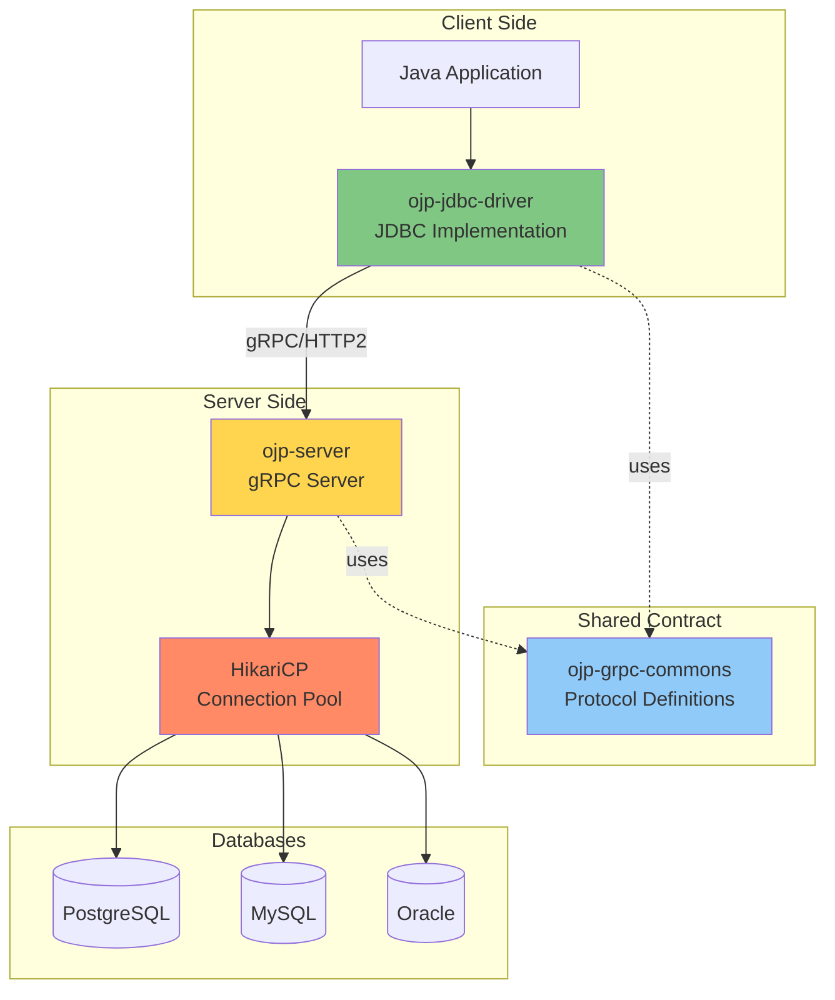

### ojp-server: The gRPC Server

**[IMAGE PROMPT 1]**: Create a detailed component diagram of ojp-server showing:
- gRPC Server endpoint (port 1059)
- HikariCP Connection Pool Manager
- Multiple database pools (PostgreSQL, MySQL, Oracle)
- Request Handler threads
- Metrics/Telemetry collector (Prometheus on port 9159)
- Configuration manager
Use a layered architecture style with clear component boundaries
Professional enterprise architecture diagram with icons and labels

The **ojp-server** is the heart of the OJP system. It's a standalone gRPC server that manages database connections and executes SQL operations on behalf of client applications.

At its core, the server listens for client requests over gRPC on port 1059 by default. When requests arrive, the server maintains HikariCP connection pools for each configured database, ensuring efficient resource utilization. The server then executes queries and updates against real database connections, managing the entire lifecycle of SQL operations. Throughout this process, it tracks client sessions and their transactional state, ensuring data consistency across distributed applications. For observability, the server exports comprehensive metrics via Prometheus on port 9159, and enforces security through IP whitelisting and access controls.

**Architecture Layers**:

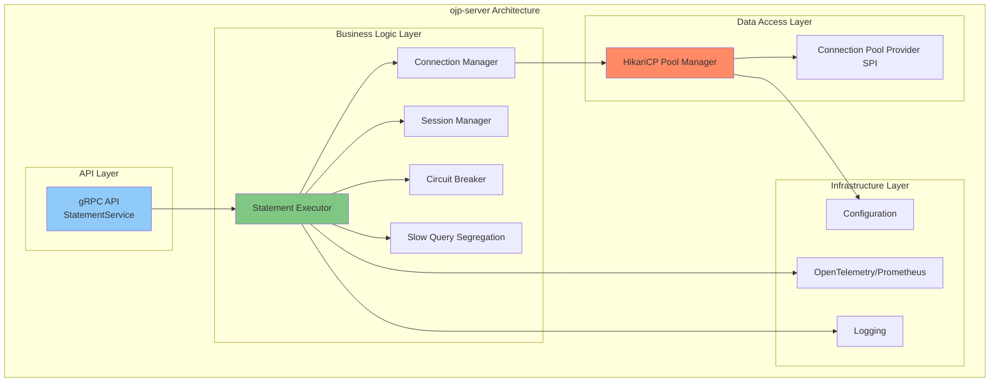

The server offers flexible deployment options to fit various infrastructure needs. You can run it as a Docker container with pre-built images that include open-source drivers, as a runnable JAR for standalone execution with external driver support, or deploy it to Kubernetes using Helm charts for cloud-native environments.

**Configuration**: Server behavior is controlled through environment variables or JVM system properties:

```properties
# Core Server Settings
ojp.server.port=1059
ojp.prometheus.port=9159
ojp.server.threadPoolSize=200
ojp.server.maxRequestSize=4194304

# Security
ojp.server.allowedIps=0.0.0.0/0

# Connection Management
ojp.server.connectionIdleTimeout=30000
ojp.server.circuitBreakerTimeout=60000
```

### ojp-jdbc-driver: The JDBC Implementation

**[IMAGE PROMPT 2]**: Create a layered diagram showing:
TOP: Standard JDBC interfaces (Connection, Statement, ResultSet, PreparedStatement)
MIDDLE: OJP implementations (OjpConnection, OjpStatement, OjpResultSet)
BOTTOM: gRPC Client communicating with OJP Server
Show how JDBC methods map to gRPC calls
Use UML-style class diagram with interfaces and implementations
Professional technical diagram style

The **ojp-jdbc-driver** is a complete JDBC 4.2 specification implementation that applications use as a drop-in replacement for traditional JDBC drivers.

The driver implements the JDBC API interfaces to ensure compliance with the standard. Rather than maintaining actual database connections, it provides lightweight virtual connection objects that delegate to the server. Under the hood, it acts as a gRPC client, communicating with ojp-server to execute all database operations. The driver handles result set streaming efficiently to minimize memory overhead, and manages transaction state across the network boundary. For high availability scenarios, it supports connecting to multiple OJP servers simultaneously, automatically failing over when needed.

**JDBC Implementation Mapping**:

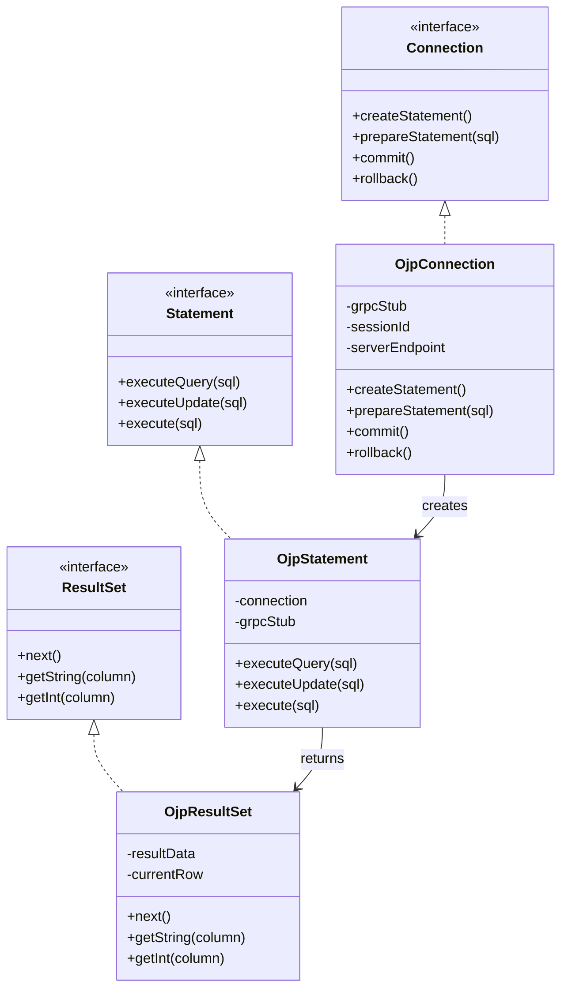

**Maven Dependency**:

```xml
<dependency>
    <groupId>org.openjproxy</groupId>
    <artifactId>ojp-jdbc-driver</artifactId>
    <version>0.3.1-beta</version>
</dependency>
```

**Usage Example**:

```java
// Load the OJP JDBC driver
Class.forName("org.openjproxy.jdbc.Driver");

// Connect with OJP URL format
String url = "jdbc:ojp[localhost:1059]_postgresql://localhost:5432/mydb";
Connection conn = DriverManager.getConnection(url, "user", "password");

// Use standard JDBC operations
Statement stmt = conn.createStatement();
ResultSet rs = stmt.executeQuery("SELECT * FROM users");

while (rs.next()) {
    System.out.println(rs.getString("username"));
}

rs.close();
stmt.close();
conn.close();
```

**Important Consideration**: When using OJP, you must **disable** any existing application-level connection pooling (HikariCP, C3P0, DBCP2) as it creates double-pooling and defeats OJP's purpose.

### ojp-grpc-commons: Shared Contracts

**[IMAGE PROMPT 3]**: Create a diagram showing Protocol Buffers (.proto files) in the center, with arrows pointing to:
LEFT: Java generated classes for ojp-jdbc-driver
RIGHT: Java generated classes for ojp-server
Show the contract acting as a bridge/shared language
Include sample proto message definitions (StatementRequest, ResultSetResponse)
Use professional technical documentation style

The **ojp-grpc-commons** module contains the gRPC service definitions and Protocol Buffer message schemas shared between the driver and server.

This module serves as the contract between client and server. It defines the gRPC service interfaces in `.proto` files, specifying exactly how client and server communicate. These files describe all request and response message structures with precise field types and semantics. From these proto files, Java classes are auto-generated at build time, ensuring both sides work with identical data structures. This approach guarantees version compatibility—when driver and server are compiled against the same proto definitions, protocol mismatches become impossible.

**Protocol Buffer Example**:

```protobuf
// Simplified example of protocol definition
service StatementService {
  rpc ExecuteQuery(StatementRequest) returns (stream ResultSetResponse);
  rpc ExecuteUpdate(StatementRequest) returns (UpdateResponse);
  rpc CreateSession(SessionRequest) returns (SessionResponse);
  rpc Commit(TransactionRequest) returns (TransactionResponse);
}

message StatementRequest {
  string session_id = 1;
  string sql = 2;
  repeated Parameter parameters = 3;
  int32 fetch_size = 4;
}

message ResultSetResponse {
  repeated Row rows = 1;
  ColumnMetadata metadata = 2;
  bool has_more = 3;
}
```

**Why This Matters**: The shared contract ensures type safety and version compatibility. Both driver and server are compiled against the same proto definitions, preventing protocol mismatches.

---

## 2.2 Communication Protocol

OJP uses **gRPC** (Google Remote Procedure Call) as its communication protocol, providing high-performance, low-latency communication between the driver and server.

### Why gRPC?

**[IMAGE PROMPT 4]**: Create a comparison infographic:
Traditional REST/JSON vs gRPC/Protocol Buffers
Show metrics: Latency, Throughput, Payload Size, Connection Efficiency
Use bar charts or comparison cards
Highlight gRPC advantages: HTTP/2, Binary encoding, Streaming, Type safety
Professional infographic style with clear data visualization

From the Architectural Decision Record (ADR-002):

> "gRPC's HTTP/2 transport enables multiplexed streams and low-latency communication, aligning perfectly with the project's scalability goals."

gRPC brings several compelling advantages to OJP's architecture. Its HTTP/2 multiplexing allows multiple requests to travel over a single TCP connection, dramatically reducing connection overhead. The binary protocol using Protocol Buffers results in much smaller payload sizes compared to JSON—typically 60-80% smaller. This isn't just about bandwidth; smaller payloads mean faster serialization and deserialization. gRPC provides native support for bi-directional streaming, perfect for handling large result sets efficiently. Protocol Buffers also bring compile-time type safety, catching errors during development rather than at runtime. The protocol is language-agnostic, making it straightforward to implement clients in languages beyond Java. Overall, gRPC delivers significantly better performance than traditional REST/JSON approaches, which is critical when database operations are involved.

When comparing REST/JSON to gRPC/Protobuf, the differences are striking. REST typically uses HTTP/1.1 with text-based JSON encoding, leading to larger payloads and limited streaming capabilities. Type checking happens at runtime, and performance is merely good. gRPC, on the other hand, uses HTTP/2 with binary encoding, achieving 60-80% payload size reduction, native streaming support, compile-time type safety, and excellent performance.

### Request-Response Flow

**[IMAGE PROMPT 5]**: Create a detailed sequence diagram showing:
1. Application calls executeQuery()
2. OJP Driver serializes to protobuf
3. gRPC call over HTTP/2
4. OJP Server deserializes
5. Server acquires pool connection
6. SQL executed on database
7. Results serialized to protobuf
8. Streamed back via gRPC
9. Driver deserializes
10. Returns to application
Use professional sequence diagram style with clear swim lanes and timing indicators

Let's trace a complete SQL query execution:

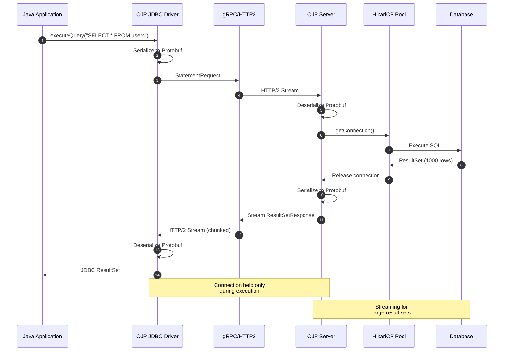

**Key Observations**:

- **Step 1-3**: Request serialization and transmission (~1-2ms)
- **Step 4-7**: Database operation execution (depends on query)
- **Step 8-10**: Result streaming and deserialization (~2-5ms for 1000 rows)
- **Connection Held**: Only during steps 6-7 (actual SQL execution)
- **Total Network Overhead**: ~5-10ms (much less than database operation time)

### Session Management

**[IMAGE PROMPT 6]**: Create a diagram showing:
LEFT: Multiple application threads/requests
CENTER: Session Manager maintaining session state (sessionId, transaction state, isolation level)
RIGHT: Server-side resources (connections, prepared statements)
Show how sessionId maps requests to resources
Use professional system architecture diagram style

Sessions maintain state across multiple requests:

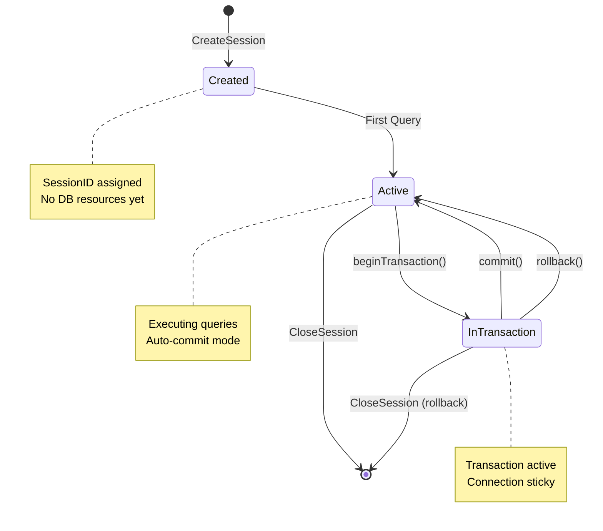

Each OJP session has several important characteristics that make the system work smoothly. Every connection gets a unique UUID as its session identifier, ensuring that requests are properly tracked across the distributed system. The session tracks transaction state meticulously, knowing whether a transaction is in progress and what operations have been committed or rolled back. Prepared statements are cached at the server side for reuse, avoiding repeated parsing overhead. The system maintains JDBC isolation level settings across the network boundary, preserving transactional semantics. In multi-node deployments, sessions exhibit connection affinity—once a session starts on a particular server, it sticks to that server for consistency.

### Connection Multiplexing

**[IMAGE PROMPT 7]**: Create a technical diagram showing:
Multiple JDBC operations from different threads
All multiplexed over a single gRPC channel (HTTP/2 connection)
Show concurrent streams within the single TCP connection
Label: "10 concurrent queries" → "1 TCP connection" → "10 database operations"
Use network diagram style with clear connection visualization

One of gRPC's killer features is connection multiplexing:

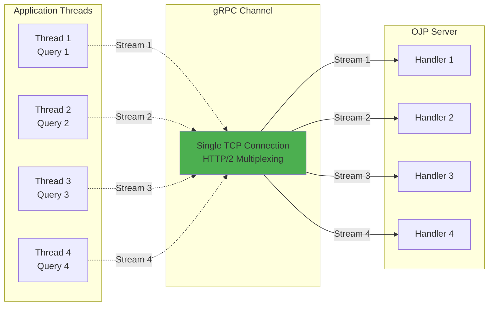

This multiplexing delivers several concrete benefits. The reduced overhead from maintaining one TCP connection instead of many translates to better performance and resource utilization. Server resources are conserved—fewer sockets and file descriptors mean more capacity for actual work. Most importantly, the system can handle concurrent operations gracefully, with multiple queries in flight simultaneously without the connection management overhead of traditional approaches.

---

## 2.3 Connection Pool Management

At the core of OJP's efficiency is its use of **HikariCP**, the fastest JDBC connection pool available.

### Why HikariCP?

**[IMAGE PROMPT 8]**: Create a performance comparison chart:
Show HikariCP vs other connection pools (C3P0, DBCP, Tomcat Pool)
Metrics: Throughput (ops/sec), Latency (ms), Memory usage
Bar chart or radar chart showing HikariCP's superiority
Include quote: "HikariCP is the fastest JDBC connection pool"
Professional data visualization style

From the Architectural Decision Record (ADR-003):

> "HikariCP is the fastest JDBC connection pool, with extensive configuration options and a proven track record in high-performance systems."

HikariCP brings multiple advantages that make it the ideal choice for OJP. Benchmark results consistently show it's 2-10x faster than alternatives like C3P0, DBCP2, or Tomcat's pool. This speed isn't theoretical—HikariCP has been extensively tested in production environments across thousands of deployments. It maintains minimal memory and CPU footprint, leaving more resources for your actual application logic. The pool works great out-of-the-box with smart defaults, though it offers extensive tuning options when needed. Finally, it's actively developed and well-maintained, with responsive support for issues and continuous improvements.

Performance benchmarks tell the story clearly. HikariCP achieves approximately 45,000 operations per second with 0.9ms average latency. Compare this to Tomcat's pool at 23,000 ops/sec with 1.8ms latency, C3P0 at 18,000 ops/sec with 2.3ms latency, or DBCP2 at 20,000 ops/sec with 2.1ms latency. HikariCP essentially doubles the throughput while halving the latency.

### Pool Sizing and Configuration

**[IMAGE PROMPT 9]**: Create an infographic showing optimal pool sizing:
Show relationship between: # of cores, # of concurrent queries, optimal pool size
Include modern formulas for SSD/cloud storage and traditional spinning disk scenarios
Visualize with server icons, CPU cores, and database connections
Professional technical infographic style

#### Modern Pool Sizing Formula

For modern cloud and SSD-based deployments, the traditional spindle-count formula is outdated. Research and production data show that smaller pool sizes often perform better than traditional formulas suggest.

**Modern Formula** (recommended for SSD/cloud databases):
```
pool_size = T_n × (C_m / T_m) + buffer
```

Where:
- `T_n` = Number of threads (concurrent request handlers in your application)
- `C_m` = Average database query time (milliseconds)
- `T_m` = Average think time between queries (milliseconds)
- `buffer` = Small safety margin (typically 2-5 connections)

**Simplified Rule of Thumb**: For most modern OLTP workloads with sub-10ms queries:
```
pool_size ≈ number_of_cpu_cores + 2
```

**Example 1** (High-frequency OLTP): 
- 50 application threads
- 5ms average query time
- 25ms think time between queries
- Pool size = 50 × (5/25) + 3 = 13 connections

**Example 2** (Simple rule): 
- 8-core database server
- Pool size = 8 + 2 = 10 connections

**Why This Works Better**:
- **SSDs eliminate I/O wait**: Modern storage doesn't block on disk seeks
- **Context switching overhead**: Too many connections cause CPU thrashing
- **Research-backed**: Studies show pools larger than (cores × 2) rarely help and often hurt performance
- **Real-world validation**: PostgreSQL, MySQL, and Oracle all recommend similar conservative sizing

**Key Insight**: With modern hardware, the bottleneck is rarely I/O—it's CPU scheduling. A connection doing actual work needs a CPU core. Having 100 connections on an 8-core database means 92 connections are just waiting, consuming memory and causing context switch overhead.

**Traditional Formula** (for spinning disk legacy systems):
```
connections = ((core_count * 2) + effective_spindle_count)
```
This formula made sense when databases were I/O-bound waiting for spinning disks. With mechanical drives, having extra connections meant some could compute while others waited for disk I/O. Modern SSDs with microsecond latencies have eliminated this trade-off.

OJP Server manages separate HikariCP pools for each database:

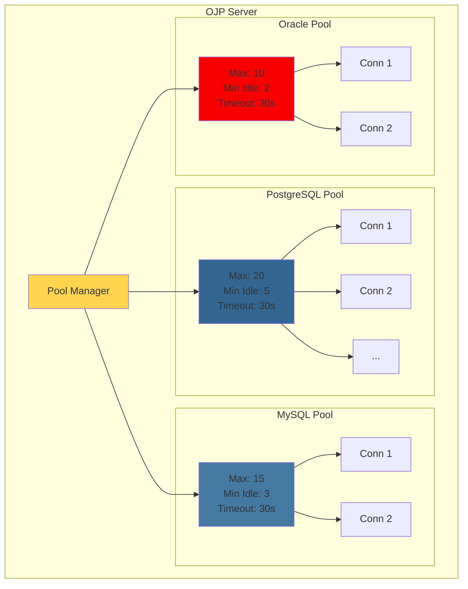

**Key Configuration Parameters**:

```properties
# Maximum pool size (most important setting)
maximumPoolSize=20

# Minimum idle connections (kept ready)
minimumIdle=5

# Connection timeout (wait for available connection)
connectionTimeout=30000

# Idle timeout (close unused connections)
idleTimeout=600000

# Max lifetime (force connection refresh)
maxLifetime=1800000

# Validation query (test connections)
connectionTestQuery=SELECT 1
```

**Pool Sizing Guidelines**:

A common formula for pool sizing:
```
connections = ((core_count * 2) + effective_spindle_count)
```

For modern SSDs (effectively infinite spindles):
```
connections = core_count * 2
```

**Example**: For a database server with 8 cores:
- Optimal pool size: 16-20 connections
- This handles concurrent queries efficiently without overwhelming the database

### Connection Abstraction Layer

**[IMAGE PROMPT 10]**: Create an architecture diagram showing:
TOP: OJP Server using ConnectionPoolProvider interface
MIDDLE: Provider SPI layer (abstraction)
BOTTOM: Multiple implementations (HikariCP, DBCP2, Custom)
Show pluggable architecture with different providers
UML-style interface diagram showing polymorphism
Professional software architecture diagram style

OJP includes a **Connection Pool Provider SPI** (Service Provider Interface) that abstracts the underlying connection pool implementation:

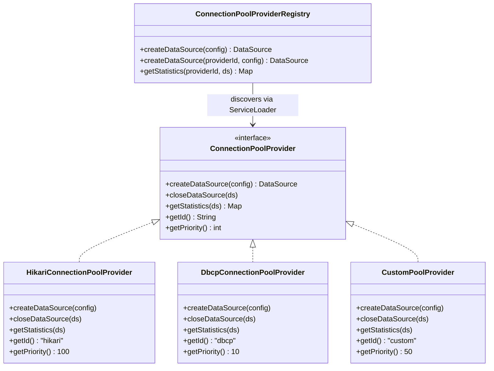

The abstraction layer brings several important benefits. It provides flexibility—you can switch connection pool implementations without changing any code. The system is extensible through the SPI, allowing organizations to add custom pool providers. This abstraction makes testing easier, as you can mock the pool provider for unit tests. Most importantly, it future-proofs the architecture, making it simple to adapt to new pool technologies as they emerge.

OJP ships with multiple providers out of the box. HikariCP is the default provider with ID "hikari" and priority 100, recommended for its high performance. Apache DBCP2 is available as an alternative with ID "dbcp" and priority 10, offering a feature-rich implementation. Organizations can also create custom providers with user-defined IDs and priorities for specialized requirements. The provider with the highest priority is used by default, though you can explicitly specify which provider to use when creating a data source.

The provider with the highest priority is used by default, but you can explicitly specify a provider:

```java
// Default (highest priority - HikariCP)
DataSource ds = ConnectionPoolProviderRegistry.createDataSource(config);

// Explicit provider selection
DataSource ds = ConnectionPoolProviderRegistry.createDataSource("dbcp", config);
```

### Pool Provider SPI

The SPI allows organizations to plug in their own connection pool implementations:

**Example Custom Provider**:

```java
public class MyCustomPoolProvider implements ConnectionPoolProvider {
    
    @Override
    public String getId() {
        return "mypool";
    }
    
    @Override
    public int getPriority() {
        return 50; // Between hikari (100) and dbcp (10)
    }
    
    @Override
    public DataSource createDataSource(PoolConfig config) {
        // Create and configure your custom pool
        MyCustomPool pool = new MyCustomPool();
        pool.setUrl(config.getUrl());
        pool.setMaxConnections(config.getMaxPoolSize());
        return pool;
    }
    
    @Override
    public boolean isAvailable() {
        try {
            Class.forName("com.example.MyCustomPool");
            return true;
        } catch (ClassNotFoundException e) {
            return false;
        }
    }
}
```

Register via ServiceLoader:
```
META-INF/services/org.openjproxy.datasource.ConnectionPoolProvider
com.example.MyCustomPoolProvider
```

This architecture makes OJP adaptable to specialized requirements while maintaining HikariCP as the proven, high-performance default.

**XA Transaction Support**: Beyond the standard connection pool, OJP also provides an **XA Pool SPI** for distributed transactions. This pluggable architecture allows custom XA-aware pooling providers while defaulting to Apache Commons Pool 2. The XA pooling strategy and its unique dual-condition lifecycle are covered in detail in **Chapter 10: XA Distributed Transactions**.

---

## 2.4 Architecture Diagrams

### Complete System Architecture

**[IMAGE PROMPT 11]**: Create a comprehensive end-to-end architecture diagram showing:
- Application layer (multiple instances)
- OJP JDBC Driver layer
- Network layer (gRPC/HTTP2)
- OJP Server layer (with all internal components)
- Connection Pool layer (HikariCP with multiple DB pools)
- Database layer (multiple databases)
Include all protocols, ports, and data flows
Use professional enterprise architecture poster style
Large, detailed, suitable for printing

Here's the complete OJP architecture from end to end:

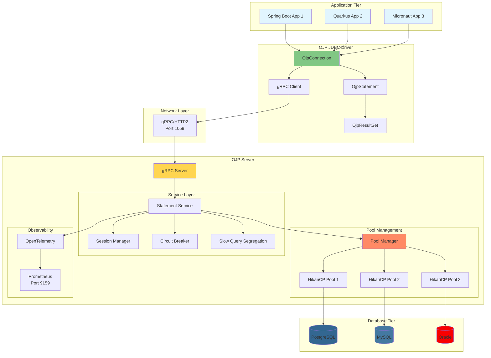

### Component Interaction

**[IMAGE PROMPT 12]**: Create a detailed component interaction diagram showing:
- How components communicate
- What data flows between them
- Key interfaces and contracts
- Configuration and dependencies
Use UML component diagram notation
Professional software architecture documentation style

Let's examine how components interact during a typical database operation:

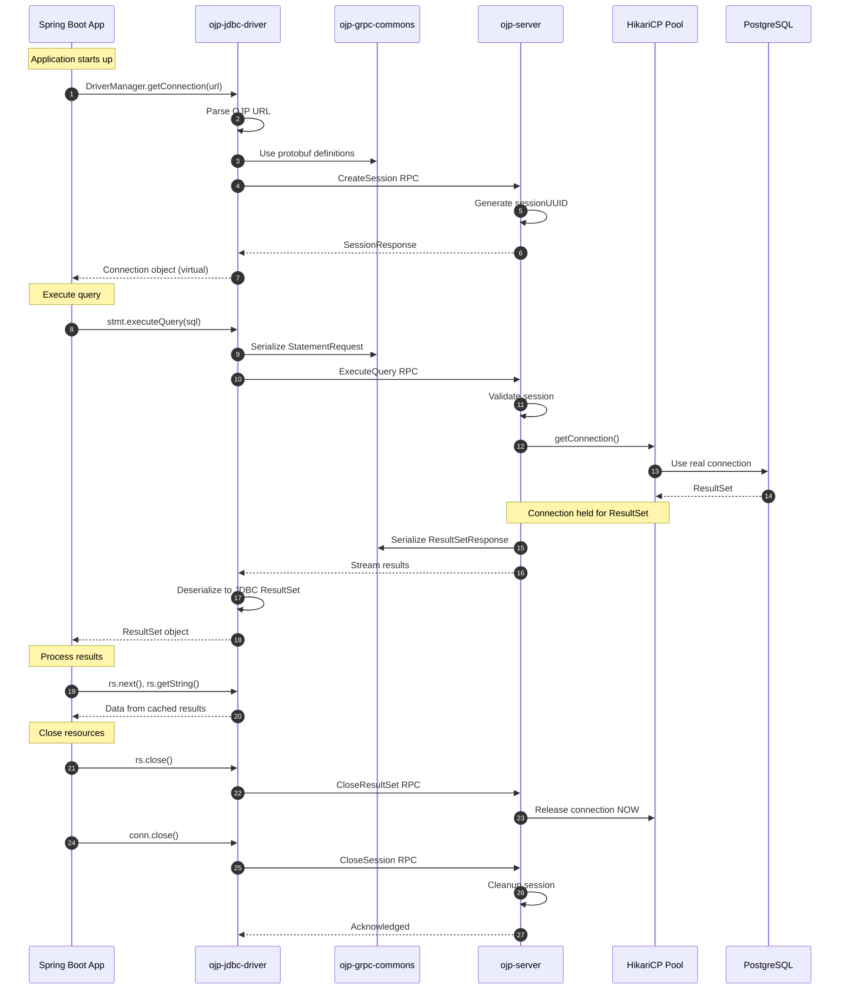

### Data Flow Diagram

**[IMAGE PROMPT 13]**: Create a data flow diagram (DFD) showing:
- External entities (Applications, Databases, Monitoring systems)
- Processes (OJP Driver, OJP Server, Connection Pools)
- Data stores (Session cache, Prepared statement cache, Metrics)
- Data flows (SQL queries, Result sets, Metrics, Configuration)
Use standard DFD notation with appropriate symbols
Professional systems analysis diagram style

The flow of data through the OJP system:

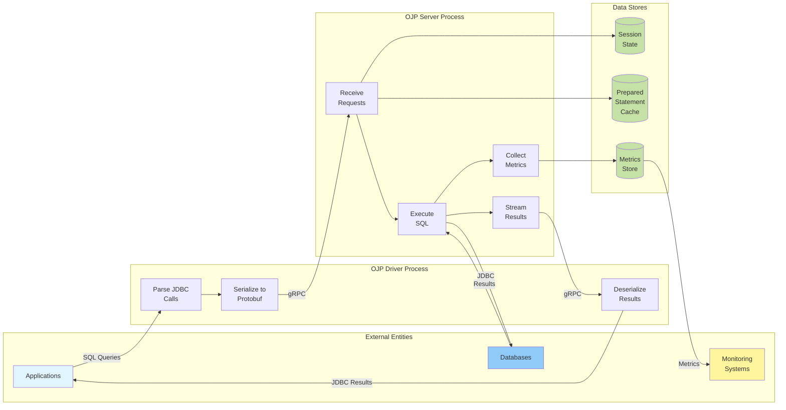

---

## 2.5 Action Pattern Architecture (Server-Side)

**[IMAGE PROMPT 15]**: Create a modern architectural diagram showing the Action Pattern transformation:
LEFT: "Before" - Large StatementServiceImpl monolith box (2500+ lines)
RIGHT: "After" - Multiple focused Action class boxes (ConnectAction, CommitTransactionAction, ExecuteQueryAction, XaStartAction, etc.)
Show transformation arrow in the middle labeled "Action Pattern Refactoring (2026-01)"
Use clean, professional style with color coding: monolith in red, actions in green
Include metrics: "1 class → 20+ Actions", "Better testability", "Reduced complexity"

In January 2026, OJP underwent a significant architectural refactoring, transforming the StatementServiceImpl class from a 2,500+ line monolith into a collection of focused Action classes. This improved code maintainability, testability, and scalability.

### The Action Pattern Approach

The refactoring introduced a clean Action Pattern where each operation is encapsulated in its own class implementing a simple interface:

```java
public interface Action<T> {
    T execute(ActionContext context) throws SQLException;
}
```

The ActionContext serves as a data transfer object carrying all necessary state (session, connection, request, managers). All Action classes implement the singleton pattern for memory efficiency, with zero allocation overhead and thread-safe stateless design.

### Core Action Categories

Operations are organized into logical categories:

**Connection & Session Management**: ConnectAction, CreateSlowQuerySegregationManagerAction, TerminateSessionAction

**Transaction Operations**: CommitTransactionAction, RollbackTransactionAction

**XA Transactions**: XaStartAction, XaEndAction, XaPrepareAction, XaCommitAction, XaRollbackAction, XaRecoverAction, XaForgetAction, plus timeout and resource management actions

**LOB Operations**: CreateLobAction, ReadLobAction

### Benefits Realized

**Code Quality**: From one 2,500-line class to 20+ focused classes averaging 100-150 lines each, with improved cohesion and organization

**Testability**: Each action can be unit tested independently with simplified mocking

**Performance**: Singleton pattern eliminates object allocation overhead and reduces GC pressure

**Developer Experience**: Easier code navigation, reduced merge conflicts, clear extension points

### Implementation Example

```java
// After refactoring
public ConnectResponse connect(ConnectRequest request) {
    ActionContext context = ActionContext.builder()
        .request(request)
        .sessionManager(sessionManager)
        .build();
        
    ConnectAction.getInstance().execute(context);
    return buildResponse(context);
}
```

The refactoring maintains full backward compatibility while making the internal implementation modular and maintainable. The phased rollout throughout January 2026 (PRs #261-#284) ensured continuous integration without disrupting development.

---

## Summary

OJP's architecture is built on three core components working in harmony:

1. **ojp-jdbc-driver**: A complete JDBC implementation that provides virtual connections and communicates via gRPC
2. **ojp-server**: A gRPC server managing HikariCP connection pools and executing SQL operations
3. **ojp-grpc-commons**: Shared Protocol Buffer contracts ensuring type-safe communication

The use of **gRPC** enables high-performance, low-latency communication with HTTP/2 multiplexing, while **HikariCP** provides industry-leading connection pool performance. The modular architecture with the **Connection Pool Provider SPI** ensures flexibility and extensibility.

This architecture enables OJP to deliver on its promise: **elastic scalability without proportional database connection growth**, all while maintaining JDBC compliance and requiring minimal application changes.

In the next chapter, we'll explore how OJP's architecture enables smart load balancing and automatic failover capabilities that surpass traditional database proxies.

---

**Previous Chapter**: [← Chapter 1: Introduction to OJP](part1-chapter1-introduction.md)  
**Next Chapter**: [Chapter 2a: OJP as Smart Load Balancer and Automatic Failover →](part1-chapter2a-smart-load-balancing.md)
