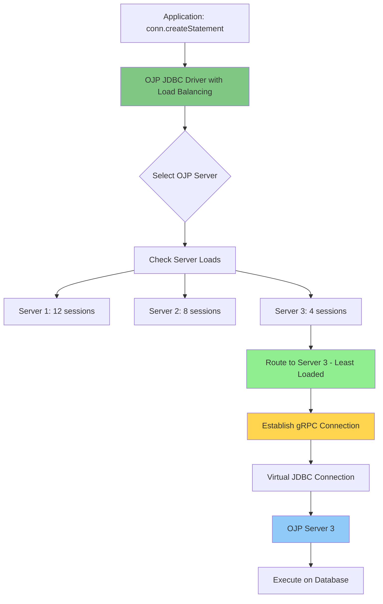
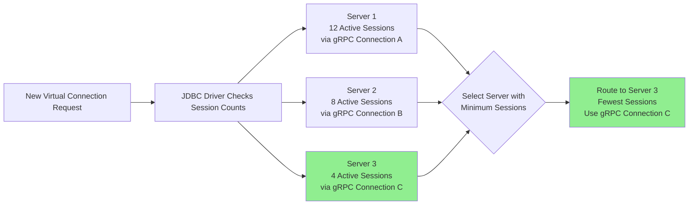

# Chapter 2a: OJP as Smart Load Balancer and Automatic Failover Mechanism

> **Chapter Overview**: This chapter explains how OJP's JDBC driver architecture provides intelligent load balancing and automatic failover capabilities that surpass traditional database proxies. You'll understand why OJP's client-side, protocol-aware approach offers unique advantages for modern distributed applications.

---

## Introduction: Beyond Traditional Database Proxies

When architects think about database high availability and load distribution, they often reach for well-known solutions like PgPool-II or ProxySQL. These tools have served the industry well for years, providing connection pooling, read/write splitting, and basic failover capabilities. But they were designed for a different era—one where applications were monolithic, deployments were static, and the database tier was a carefully managed set of physical servers.

Open J Proxy takes a fundamentally different approach. **OJP uses its own implementation of the JDBC driver as a smart load balancer and automatic failover mechanism**. Rather than deploying external proxy infrastructure that requires additional load balancers for HA, OJP embeds intelligence directly into your application's JDBC driver. This JDBC driver-based architecture enables capabilities that traditional proxies cannot match without additional infrastructure layers: **client-side load balancing with real-time load awareness, automatic failover with transaction semantics, and no need for external load balancers**.

> **AI Image Prompt**: Create a comparison diagram showing two architectures side by side. LEFT: "Traditional Proxy HA Architecture" - show applications connecting through an external load balancer (HAProxy/Keepalived) which then connects to multiple database proxy nodes (PgPool/ProxySQL), which finally connect to databases. Show 3 network hops. Label the load balancer layer as "Required for Proxy HA". RIGHT: "OJP Architecture" - show applications with embedded JDBC drivers connecting directly to multiple OJP servers (using built-in client-side load balancing), which connect to databases. Show 2 network hops. Highlight "No External Load Balancer Needed" and "Built-in Client-Side Load Balancing". Use professional architecture diagram style with clear visual distinction between the two approaches.

This chapter explores what makes OJP's approach "smart"—how it provides built-in high availability and load balancing through the JDBC driver itself, eliminating the need for additional infrastructure that traditional proxies require.

---

## 2a.1 Understanding OJP's Unique Architecture

### Type 3 JDBC Driver: Built-In Load Balancing and Failover

Traditional database proxies operate as external processes—separate infrastructure that requires deployment, management, and additional networking. To achieve high availability for the proxy layer itself, they require external load balancers:

- **ProxySQL** requires Keepalived with a Virtual IP (VIP) or HAProxy in front of multiple ProxySQL nodes to prevent a single point of failure
- **PgPool-II** uses Watchdog for HA but typically still needs HAProxy or similar for inbound traffic distribution and VIP management
- This adds an entire infrastructure layer: **App → Load Balancer → Proxy → Database**

OJP, in contrast, is a **Type 3 JDBC driver** with built-in client-side load balancing. This means it's a library that becomes part of your application's runtime. When your application calls `DriverManager.getConnection()`, the OJP driver handles load balancing and failover directly—no external load balancer needed.

The Type 3 architecture with built-in load balancing provides three fundamental advantages:

**Direct Integration with Load Balancing**: The driver runs in your application's JVM, with direct access to the application's context. It knows when you start a transaction, when you execute a query, and when you commit or rollback. This semantic awareness enables intelligent routing decisions that respect transaction boundaries—and it includes the load balancing logic directly, eliminating external load balancer infrastructure.

**Client-Side Load Balancing at Scale**: Each application instance makes its own routing decisions based on its view of server health and load. This distributes the decision-making load across all application instances rather than centralizing it in an external load balancer that can become a bottleneck. When you scale from 10 to 100 application instances, the load balancing capacity scales with it automatically—no need to scale load balancer infrastructure separately.

**One Less Network Hop**: Traditional proxies with HA require: App → Load Balancer → Proxy → Database (3 hops). OJP's architecture is: App with JDBC Driver → OJP Server → Database (2 hops). For query-intensive workloads, eliminating that load balancer hop saves latency.

> **AI Image Prompt**: Create a layered architecture diagram showing OJP's position in the application stack. From top to bottom: "Application Code" → "OJP JDBC Driver (Type 3) with Built-in Load Balancing" → "gRPC/HTTP2 Protocol (Multiplexed)" → "Multiple OJP Servers" → "HikariCP Connection Pool" → "Database". Highlight that the JDBC driver is embedded within the application's JVM boundary (shown as a dotted box around Application Code and JDBC Driver). Show multiple gRPC connections from the driver to different OJP servers with a note "Client-side server selection". Use technical architecture style with clear layer separation.

### Layer 7 Protocol Awareness with Transaction-Aware Routing

Being a JDBC driver means OJP operates at Layer 7—the application protocol layer. Unlike Layer 4 TCP load balancers that only see raw network packets, OJP understands JDBC operations. It knows the difference between a SELECT query and an UPDATE statement. It understands prepared statements, result sets, and transaction boundaries.

This protocol awareness enables sophisticated load balancing and failover features:

**Transaction-Aware Routing**: OJP maintains session stickiness within transactions. When you start a transaction, all subsequent operations in that transaction go to the same OJP server and the same backend database connection. This guarantees ACID properties even in a multi-node deployment. External load balancers can't do this reliably because they don't understand where transaction boundaries begin and end.

**Semantic Error Handling**: When an OJP Server connection fails mid-transaction, OJP knows the transaction's state and can provide appropriate error messages to the application. It can distinguish between retriable errors (like transient network failures outside a transaction) and fatal errors (like mid-transaction server failures that require application retry), enabling intelligent retry logic.



### Virtual JDBC Connections Over Multiplexed gRPC

It's important to understand that OJP JDBC driver hands out **virtual JDBC connections** that all use the same **multiplexed gRPC connection** to each OJP Server. These "virtual" connections are lightweight objects that implement the JDBC `Connection` interface but don't correspond to actual network connections or backend database connections. Instead, when you call `getConnection()`, you get a virtual connection object that sends operations over an existing gRPC channel to the selected OJP Server, which then manages the actual database connections.

> **Note**: The gRPC connection to each OJP Server is established only on the first connection request to that server, then cached and reused for all subsequent virtual connections. This means the network connection overhead is paid once per OJP Server, not per virtual JDBC connection.

This multiplexing is key to OJP's efficiency:
- **Single gRPC Connection per Server**: The driver establishes one gRPC connection to each configured OJP Server when first connecting
- **Multiple Virtual Connections**: Your application can create hundreds of JDBC `Connection` objects, all sharing the same underlying gRPC channels
- **Load-Aware Routing**: When you execute a query, the driver decides which OJP Server's gRPC connection to use based on current load

This design allows OJP to support high connection counts at the application level (thousands of virtual connections) while maintaining a controlled number of actual network connections (one gRPC connection per OJP Server).

---

## 2a.2 Smart Load Balancing: Built Into the JDBC Driver

Traditional proxies use external load balancers like HAProxy or Keepalived to distribute traffic across multiple proxy nodes. These external load balancers use simple algorithms like round-robin or least connections at the TCP level. OJP eliminates this entire layer by implementing intelligent load balancing directly in the JDBC driver.

### Load-Aware Server Selection

OJP implements **load-aware server selection** within the JDBC driver itself, where routing decisions consider the actual current load on each OJP Server. The JDBC driver maintains a client-side view of how many active sessions each server is handling. When establishing a new virtual connection, the driver routes to the server with the fewest active sessions.

This approach adapts automatically to varying workloads:

**Long-Running Queries**: Suppose Server 1 is executing several long-running analytical queries while Servers 2 and 3 handle quick transactional queries. Server 1's session count remains high because those queries haven't completed yet. The driver directs new connections to Servers 2 and 3, preventing Server 1 from becoming even more overloaded. With traditional round-robin (used by external load balancers), Server 1 would continue receiving connections simply because it's "next," exacerbating the imbalance.

**Natural Rebalancing**: When long-running queries complete, Server 1's session count drops, making it attractive again for new connections. No manual intervention or configuration is needed—the system self-balances based on actual observed load.

**No Separate Load Balancer Infrastructure**: Because this intelligence is in the JDBC driver, you don't need to deploy HAProxy, Keepalived, or manage VIPs. Each application instance does its own load balancing independently.



### Connection Pool Sizing with Multi-Server Configuration

When you configure OJP with multiple servers, the connection pool sizing works differently than you might expect. **Each OJP Server automatically caps its connections based on the total pool size divided by the number of servers**.

For example, if you configure a total maximum of 30 backend database connections in your application instance's pool settings and you have 3 OJP Servers configured:
- The 30 connections are automatically divided across the 3 servers: each server will cap at 10 backend database connections (30 ÷ 3 = 10 per server)
- If one OJP Server goes down, the remaining two will rebalance to max 15 connections each (30 ÷ 2 = 15 per server) to maintain the total capacity
- When that OJP node comes back online, it will rebalance back to 10 connections per server (30 ÷ 3 = 10 per server)

This automatic rebalancing ensures:
- **Consistent Total Capacity**: Your application always has access to the total configured connection pool size, distributed across available servers
- **Automatic Failover Adjustment**: When servers fail, capacity is automatically redistributed without manual intervention
- **Gradual Recovery**: When servers recover, they gradually take their share of connections back

### Configuration: Load-Aware Selection is Default

Load-aware selection is enabled by default in OJP because it provides the best behavior for nearly all workloads:

```properties
# Load-aware server selection (default: true, strongly recommended)
ojp.loadaware.selection.enabled=true
```

You should almost always use load-aware selection. The only scenarios where you might disable it are for debugging or troubleshooting when you want deterministic, predictable routing.

---

## 2a.3 Automatic Failover: No External Load Balancer Needed

High availability requires graceful handling of failures. Traditional proxies achieve HA by deploying multiple proxy nodes behind an external load balancer (HAProxy or Keepalived with VIP). OJP's automatic failover is built into the JDBC driver itself, eliminating that entire infrastructure layer.

### OJP's Built-In Failover

OJP achieves high availability **without external load balancers**, using client-side failover logic in the JDBC driver:

**Multi-Server Configuration**:
```java
// OJP HA: Built-in client-side failover, no external load balancer needed
String url = "jdbc:ojp[proxy1.example.com:1059,proxy2.example.com:1059,proxy3.example.com:1059]" +
             "_postgresql://localhost:5432/mydb";
```

From your application's perspective, this is still just a JDBC URL. The driver handles all failover logic:

**Health Checking**: The driver periodically checks server health using lightweight gRPC health check RPCs. Servers that fail health checks are temporarily marked as unhealthy and excluded from routing.

**Transparent Retry**: If a connection request fails (server unreachable, timeout, or gRPC error), the driver automatically retries with another server from the list. This happens transparently—your application just sees a successful connection after a slight delay, or an error if all servers are unavailable.

**Session Awareness**: For idle virtual connections (not in a transaction), failover is transparent. For active connections within a transaction, failover cannot preserve transaction state (since the transaction exists on a specific backend database connection). In this case, the application receives an error and must retry the transaction. This behavior is correct and expected—ACID guarantees cannot survive a mid-transaction server failure without distributed transaction coordination.

> **AI Image Prompt**: Create a sequence diagram showing failover process. Show: 1) Application requests JDBC connection from Driver, 2) Driver attempts gRPC connection to Server 1 (marked with red X - failed), 3) Driver detects failure (timeout or error), 4) Driver automatically retries gRPC connection to Server 2 (green checkmark - success), 5) Virtual JDBC connection established and returned to application. Include note: "No External Load Balancer - Failover in JDBC Driver". Use timeline-style sequence diagram with clear success/failure indicators.

---

## 2a.4 Comparing OJP with Traditional Database Proxies

To understand when and why to choose OJP over traditional solutions, let's compare it directly with popular database proxy tools, focusing specifically on how they achieve high availability for the proxy layer itself.

### Comparison Table: OJP vs Traditional Database Proxies

| Capability | OJP | PgPool-II | ProxySQL |
|------------|-----|-----------|----------|
| **Architecture** | Type 3 JDBC Driver + Server | External Proxy | External Proxy |
| **Deployment** | JDBC Driver in Application + External OJP Servers | Separate Infrastructure | Separate Infrastructure |
| **Protocol Layer** | Layer 7 (JDBC/SQL) | Layer 7 (PostgreSQL) | Layer 7 (MySQL) |
| **Load Balancing for Proxy HA** | Built into JDBC Driver (Client-side) | Requires external LB (HAProxy/Watchdog) | Requires external LB (HAProxy/Keepalived) |
| **Failover Mechanism** | Automatic, Client-driven | Watchdog-based + external LB | Native clustering + Keepalived/HAProxy |
| **Transaction Awareness** | Full JDBC semantics | PostgreSQL protocol | MySQL protocol |
| **Connection Pooling** | Server-side (HikariCP) | Built-in | Built-in |
| **Database Support** | Any JDBC database | PostgreSQL only | MySQL/MariaDB only |
| **Network Hops for HA** | 2 (App+Driver → OJP Server → DB) | 3 (App → LB → Proxy → DB) | 3 (App → LB → Proxy → DB) |
| **External LB Required for Proxy HA** | No | Yes (HAProxy or Watchdog VIP) | Yes (HAProxy or Keepalived VIP) |
| **Single Point of Failure** | No (client-side logic) | No (with external LB configured) | No (with external LB configured) |
| **Infrastructure Overhead** | Minimal (JVM library + servers) | High (proxy VMs + LB) | High (proxy VMs + LB) |
| **License** | Apache 2.0 (Open Source) | BSD-like (Open Source) | GPLv3 (Open Source) |

### Key Differences: Proxy Tier High Availability

#### 1. **How Proxy HA is Achieved**

**Traditional Proxies**: Deploy multiple proxy nodes with an external load balancer (HAProxy/Keepalived with VIP) in front. The external LB becomes the entry point: App → External LB → Proxy Nodes → Database.

**OJP**: Load balancing and failover logic built into the JDBC driver. Multiple OJP Servers specified in JDBC URL. Each application instance independently balances across servers: App with JDBC Driver (built-in LB) → OJP Servers → Database.

#### 2. **Infrastructure and Operations**

**OJP**: Deploy OJP Servers and update JDBC URL. The driver handles the rest. No external LB to deploy, configure, or monitor.

**Traditional Proxies**: Deploy proxy nodes + external load balancer. Configure VIP management and failover scripts. Monitor both layers.

---

## 2a.5 Real-World Deployment Scenarios

Let's explore how OJP's smart load balancing and failover work in practice across common deployment patterns.

### Scenario 1: Kubernetes with Horizontal Pod Autoscaling

You have a microservice deployed in Kubernetes with Horizontal Pod Autoscaler (HPA) configured to scale from 2 to 20 pods based on CPU utilization.

**Without OJP**: Each pod connects directly to the database. When HPA scales to 20 pods, you have 20 connection pools (perhaps 10 connections each = 200 total database connections). When traffic drops and HPA scales down to 2 pods, you have 20 connections. The database sees wildly varying connection counts, making capacity planning difficult.

**With OJP**: Each pod uses virtual JDBC connections via the OJP driver. You deploy 3 OJP Servers, each managing a HikariCP pool of 20 database connections (60 total). As pods scale from 2 to 20, database connections remain constant at 60. The OJP Servers absorb the application scaling. Pods distribute across the 3 OJP Servers using the driver's built-in load-aware selection. If one OJP Server pod fails (Kubernetes recreates it), applications automatically fail over to the other 2 servers—no connection storms, no database disruption, and no external load balancer needed.

### Scenario 2: Multi-Datasource Configuration

You want to configure separate connection pools for different purposes—one for the primary database and another for a read replica or analytics workload.

**Example Setup Using Named Datasources**:
```java
// Primary database connections using named datasource
String primaryUrl = "jdbc:ojp[ojp-1a.internal:1059,ojp-1b.internal:1059,ojp-1c.internal:1059(primaryDS)]" +
                    "_postgresql://primary.rds:5432/mydb";
DataSource primaryDS = createDataSource(primaryUrl);

// Read replica connections using named datasource
// Note: You can use the same OJP servers with a different datasource name
String replicaUrl = "jdbc:ojp[ojp-1a.internal:1059,ojp-1b.internal:1059,ojp-1c.internal:1059(replicaDS)]" +
                    "_postgresql://replica.rds:5432/mydb";
DataSource replicaDS = createDataSource(replicaUrl);
```

With this configuration:
- Your application can choose which datasource to use based on the query type (writes to primary, reads to replica)
- **Same OJP Servers, different datasources**: The same set of OJP Servers can manage multiple named datasources, each connecting to different database endpoints
- Each datasource has its own connection pool on the OJP Servers
- The OJP driver handles load balancing and failover independently for each datasource
- No external load balancer infrastructure needed

### Scenario 3: Blue-Green Deployment with Zero Downtime

You're deploying a new version of your application using blue-green deployment pattern. You want to switch traffic from the old version to the new version without dropping connections.

**Traditional Approach**: Both blue and green environments connect through the same load balancer to the same proxy. Connection handling depends on proxy behavior and connection draining configuration.

**With OJP**: Both blue and green environments use the same OJP Server URLs. Because OJP Servers are independent of application versions, you can:

1. Deploy green environment (new version), which connects to existing OJP Servers
2. Switch traffic from blue to green at load balancer
3. Green environment establishes new connections to OJP Servers (load-aware distribution)
4. Drain connections from blue environment gracefully
5. OJP Servers see a gradual shift in session counts, not a sudden spike

The database connection count remains stable throughout—OJP Servers maintain their pools regardless of which application version is connecting.

---

## 2a.6 Practical Configuration and Best Practices

To leverage OJP's smart load balancing and failover effectively, follow these configuration guidelines:

### Multi-Server JDBC URL Configuration

Always configure at least 3 OJP Servers in production for high availability:

```java
// Production HA configuration (3 servers minimum)
String url = "jdbc:ojp[ojp-server-1:1059,ojp-server-2:1059,ojp-server-3:1059]_" +
             "postgresql://db.internal:5432/proddb";
```

Three servers is the recommended minimum because it provides better fault tolerance: with 3 servers, losing 1 server leaves 2 active servers with redundancy, whereas with only 2 servers, losing 1 leaves just 1 server with no redundancy. You can deploy more servers (4, 5, or more) if you need higher capacity or want to tolerate multiple simultaneous failures, but 3 is the practical minimum for production HA.

### Health Check Tuning

The driver performs health checks to detect failed servers. The default configuration works for most scenarios:

```properties
# Health check interval (default: 30 seconds)
ojp.healthcheck.interval.seconds=30

# Health check timeout (default: 5 seconds)
ojp.healthcheck.timeout.seconds=5

# Unhealthy threshold (consecutive failures before marking unhealthy)
ojp.healthcheck.unhealthy.threshold=3
```

---

## 2a.7 Chapter Summary

This chapter explored how OJP's JDBC driver architecture provides built-in load balancing and automatic failover, eliminating the external load balancer infrastructure that traditional database proxies require.

**Key Takeaways**:

1. **Built-in HA**: OJP's JDBC driver includes load balancing and failover logic, eliminating the need for external load balancers (HAProxy, Keepalived) that PgPool-II and ProxySQL require.

2. **Virtual Connections**: OJP hands out lightweight virtual JDBC connections over multiplexed gRPC channels (established once per server, then cached and reused).

3. **Load-Aware Selection**: Real-time session count tracking routes connections to the least-loaded server, with automatic pool rebalancing when servers fail or recover.

4. **Simplified Architecture**: Fewer network hops (App+Driver → OJP Server → DB vs App → LB → Proxy → DB) and less infrastructure to deploy and manage.

**When OJP Excels**: Cloud-native microservices, latency-sensitive applications, and Java environments where minimizing infrastructure complexity is valued.

**Complementary Approach**: OJP handles proxy tier HA; database-native replication tools handle database tier HA. Use both for comprehensive resilience.

---

**[IMAGE PROMPT - Chapter Summary Visual]**: Create an infographic summarizing OJP's advantages. Include 4 sections: 1) "Built-In Load Balancing" with JDBC driver icon showing internal LB logic, 2) "No External LB Needed" with crossed-out HAProxy/Keepalived icons vs OJP's simple architecture, 3) "Fewer Network Hops" with comparison chart (OJP: 2 hops vs Traditional: 3 hops), 4) "Auto-Rebalancing Pools" with diagram showing pool division across servers. Use modern, clean infographic style with icons and minimal text. Professional color scheme with OJP branding.

---

## Related Chapters

- **[Chapter 1: Introduction](part1-chapter1-introduction.md)**: Foundational concepts about Type 3 drivers and Layer 7 proxies
- **[Chapter 2: Architecture Deep Dive](part1-chapter2-architecture.md)**: Detailed component architecture
- **[Chapter 9: Multinode Deployment](part3-chapter9-multinode-deployment.md)**: Comprehensive multinode configuration and operational details
- **[Chapter 13: Telemetry and Monitoring](part4-chapter13-telemetry.md)**: Observability for load balancing and failover events
- **[Appendix G: Troubleshooting](appendix-g-troubleshooting.md)**: Debugging failover and load balancing issues

---

**Navigation**: [← Previous: Chapter 2](part1-chapter2-architecture.md) | [Next: Chapter 3 →](part1-chapter3-quickstart.md)
