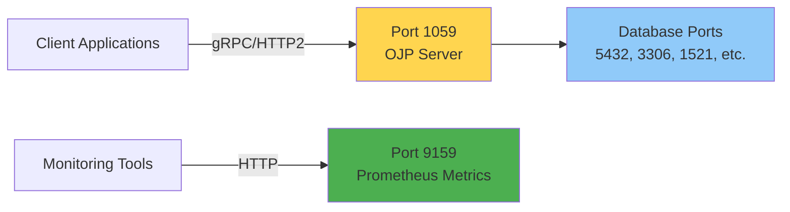
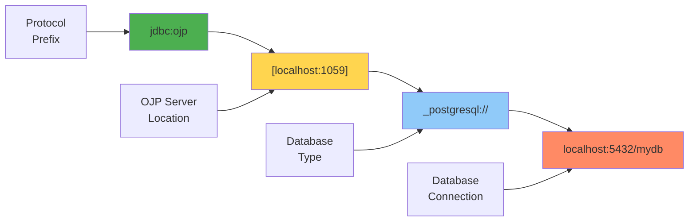
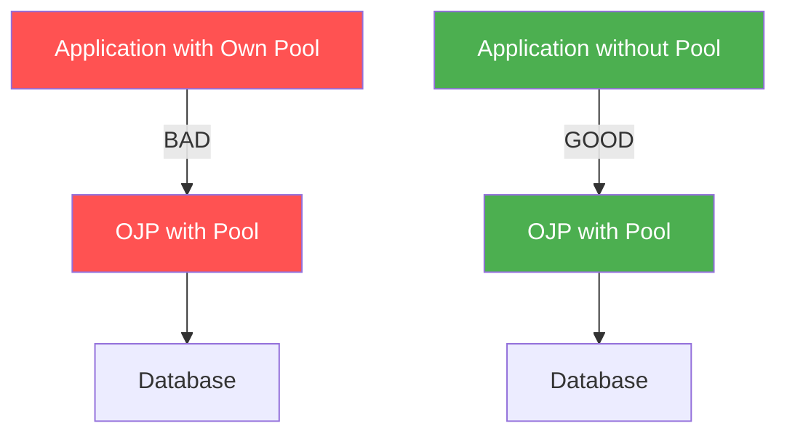
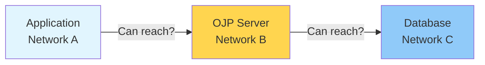

# Chapter 3: Quick Start Guide

> **Chapter Overview**: Get OJP up and running in under 5 minutes. This chapter provides step-by-step instructions for installing OJP Server, adding the JDBC driver to your project, and executing your first query through OJP.

---

## 3.1 Prerequisites

Before starting with OJP, ensure you have the following prerequisites in place.

### Java Version Requirements

**[IMAGE PROMPT 1]**: Create a simple requirements checklist infographic:
- OJP Server: Java 21+ (with Java logo)
- OJP JDBC Driver: Java 11+ (with Java logo)
- Maven 3.9+ or Gradle (with logos)
- Docker (optional, with Docker logo)
- Network access (ports 1059, 9159)
Use clean, modern icon-based design with checkmarks
Professional getting-started guide style

OJP has different Java requirements for server and client:
- **OJP Server** requires **Java 21 or higher**
- **OJP JDBC Driver** requires **Java 11 or higher** (for broader client compatibility)

**Verify your Java version**:

```bash
java -version
```

Expected output:
```
openjdk version "22.0.1" 2024-04-16
OpenJDK Runtime Environment (build 22.0.1+8-16)
OpenJDK 64-Bit Server VM (build 22.0.1+8-16, mixed mode, sharing)
```

If you don't have Java 22+, you can download it from Eclipse Temurin at adoptium.net, Oracle JDK from oracle.com, or Amazon Corretto from aws.amazon.com/corretto.

### Docker/Container Options

Docker is **optional** but recommended for the quickest setup. You can use Docker Desktop for Windows and macOS development, Docker Engine for Linux servers, or Podman as a Docker-compatible alternative.

Check Docker installation:
```bash
docker --version
# Expected: Docker version 20.10+
```

### Network Requirements

OJP Server uses these ports by default:



For firewall configuration, port 1059 must be accessible to all application instances that need to connect. Port 9159 is optional but useful for metrics and monitoring. Additionally, the OJP Server must be able to reach your database ports (typically 5432 for PostgreSQL, 3306 for MySQL, 1521 for Oracle, etc.).

---

## 3.2 Installation Options

OJP Server can be deployed in three ways: Docker (fastest), Runnable JAR, or built from source.

### Option 1: Docker Deployment (Batteries Included) ⭐ Recommended

**[IMAGE PROMPT 2]**: Create a step-by-step visual guide showing:
Step 1: Docker command in terminal
Step 2: OJP Server starting up (container icon)
Step 3: Server ready with ports exposed
Step 4: Applications connecting to OJP
Use a horizontal timeline or numbered steps format
Modern tutorial style with screenshots/mockups

The fastest way to get started is using the pre-built Docker image that includes open-source database drivers (H2, PostgreSQL, MySQL, MariaDB).

**Start OJP Server**:

```bash
docker run --rm -d \
  --name ojp-server \
  --network host \
  rrobetti/ojp:0.3.1-beta
```

This command accomplishes several things in one step. It downloads the OJP Server image (approximately 50MB), which includes drivers for H2, PostgreSQL, MySQL, and MariaDB out of the box. The server starts on port 1059 for gRPC communication and exposes metrics on port 9159 for Prometheus. The `-d` flag runs the container in detached mode, while `--rm` ensures the container is automatically removed when stopped.

**Verify it's running**:

```bash
docker ps | grep ojp-server
# Should show container running

# Check logs
docker logs ojp-server
```

Expected log output:
```
[main] INFO org.openjproxy.grpc.server.ServerConfiguration - OJP Server Configuration:
[main] INFO org.openjproxy.grpc.server.ServerConfiguration -   Server Port: 1059
[main] INFO org.openjproxy.grpc.server.ServerConfiguration -   Prometheus Port: 9159
[main] INFO org.openjproxy.grpc.server.GrpcServer - Starting OJP gRPC Server on port 1059
[main] INFO org.openjproxy.grpc.server.GrpcServer - OJP gRPC Server started successfully
```

**Custom Configuration**:

```bash
docker run --rm -d \
  --name ojp-server \
  --network host \
  -e OJP_SERVER_PORT=9059 \
  -e OJP_PROMETHEUS_PORT=9090 \
  -e OJP_SERVER_LOGLEVEL=DEBUG \
  rrobetti/ojp:0.3.1-beta
```

**For Proprietary Databases** (Oracle, SQL Server, DB2):

```bash
# Mount external drivers directory
docker run --rm -d \
  --name ojp-server \
  --network host \
  -v /path/to/drivers:/ojp-libs \
  rrobetti/ojp:0.3.1-beta
```

Place your proprietary JDBC driver JARs in `/path/to/drivers` on your host machine.

### Option 2: Runnable JAR Setup

**[IMAGE PROMPT 3]**: Create a visual guide for JAR deployment showing:
1. Download/build JAR file
2. Download database drivers
3. Run Java command
4. Server startup confirmation
Use terminal screenshots with highlighted commands
Professional technical documentation style

If Docker isn't available, use the standalone executable JAR.

**Download or Build the JAR**:

```bash
# Option A: Download pre-built JAR (when available)
# wget https://github.com/Open-J-Proxy/ojp/releases/download/v0.3.1-beta/ojp-server.jar

# Option B: Build from source
git clone https://github.com/Open-J-Proxy/ojp.git
cd ojp
mvn clean install -DskipTests

# JAR location: ojp-server/target/ojp-server-0.3.2-snapshot-shaded.jar
```

**Download Database Drivers**:

```bash
cd ojp-server
bash download-drivers.sh
# Downloads H2, PostgreSQL, MySQL, MariaDB drivers to ./ojp-libs
```

**Start the Server**:

```bash
java -jar ojp-server/target/ojp-server-0.3.2-snapshot-shaded.jar
```

**With Custom Configuration**:

```bash
java \
  -Dojp.server.port=9059 \
  -Dojp.prometheus.port=9090 \
  -Dojp.server.logLevel=DEBUG \
  -jar ojp-server/target/ojp-server-0.3.2-snapshot-shaded.jar
```

**Run as Background Service**:

```bash
# Start in background
nohup java -jar ojp-server/target/ojp-server-0.3.2-snapshot-shaded.jar \
  > ojp-server.log 2>&1 &

# Check it's running
ps aux | grep ojp-server

# Stop the server
kill $(ps aux | grep 'ojp-server.*jar' | grep -v grep | awk '{print $2}')
```

### Option 3: Building from Source

**[IMAGE PROMPT 4]**: Create a development workflow diagram showing:
Git clone → Maven build → Run tests → Start server
Include relevant logos (Git, Maven, Java)
Developer-focused technical diagram style

For developers who want to modify or contribute to OJP:

**Complete Build Process**:

```bash
# 1. Clone repository
git clone https://github.com/Open-J-Proxy/ojp.git
cd ojp

# 2. Download drivers
cd ojp-server
bash download-drivers.sh
cd ..

# 3. Build all modules
mvn clean install -DskipTests

# 4. Run OJP Server (in one terminal)
mvn verify -pl ojp-server -Prun-ojp-server

# 5. Run tests (in another terminal)
cd ojp-jdbc-driver
mvn test -DenableH2Tests=true
```

**Module Structure**:

```
ojp/
├── ojp-grpc-commons/       # Shared protocol definitions
├── ojp-server/             # Server implementation
├── ojp-jdbc-driver/        # JDBC driver implementation
├── ojp-datasource-api/     # Pool abstraction API
├── ojp-datasource-hikari/  # HikariCP provider
├── ojp-datasource-dbcp/    # DBCP2 provider
├── ojp-xa-pool-commons/    # XA transaction support
└── pom.xml                 # Parent POM
```

---

## 3.3 Your First OJP Connection

Once OJP Server is running, integrate it into your application with three simple steps.

### Step 1: Add OJP JDBC Driver Dependency

**[IMAGE PROMPT 5]**: Create a side-by-side comparison showing:
LEFT: Maven pom.xml with ojp-jdbc-driver dependency
RIGHT: Gradle build.gradle with ojp-jdbc-driver dependency
Use code editor style with syntax highlighting
Professional code documentation style

**Maven** (`pom.xml`):

```xml
<dependency>
    <groupId>org.openjproxy</groupId>
    <artifactId>ojp-jdbc-driver</artifactId>
    <version>0.3.1-beta</version>
</dependency>
```

**Gradle** (`build.gradle`):

```groovy
dependencies {
    implementation 'org.openjproxy:ojp-jdbc-driver:0.3.1-beta'
}
```

**Gradle Kotlin** (`build.gradle.kts`):

```kotlin
dependencies {
    implementation("org.openjproxy:ojp-jdbc-driver:0.3.1-beta")
}
```

### Step 2: Update Your JDBC URL

**[IMAGE PROMPT 6]**: Create a before/after transformation diagram:
Show traditional JDBC URLs transforming to OJP URLs for different databases
Use arrows showing the transformation
Include PostgreSQL, MySQL, Oracle, SQL Server examples
Infographic style with database logos

The only code change required is modifying your JDBC URL by prefixing it with `ojp[host:port]_`.

**URL Format**:
```
jdbc:ojp[ojp-server-host:port]_original-jdbc-url
```

**Examples for Different Databases**:

```java
// ============ PostgreSQL ============
// Before
String url = "jdbc:postgresql://localhost:5432/mydb";

// After
String url = "jdbc:ojp[localhost:1059]_postgresql://localhost:5432/mydb";

// ============ MySQL ============
// Before
String url = "jdbc:mysql://localhost:3306/mydb";

// After
String url = "jdbc:ojp[localhost:1059]_mysql://localhost:3306/mydb";

// ============ Oracle ============
// Before
String url = "jdbc:oracle:thin:@localhost:1521/XEPDB1";

// After
String url = "jdbc:ojp[localhost:1059]_oracle:thin:@localhost:1521/XEPDB1";

// ============ SQL Server ============
// Before
String url = "jdbc:sqlserver://localhost:1433;databaseName=mydb";

// After
String url = "jdbc:ojp[localhost:1059]_sqlserver://localhost:1433;databaseName=mydb";

// ============ H2 (for testing) ============
// Before
String url = "jdbc:h2:~/testdb";

// After
String url = "jdbc:ojp[localhost:1059]_h2:~/testdb";
```

**URL Components**:



### Step 3: Execute Your First Query

**[IMAGE PROMPT 7]**: Create a complete code example visualization showing:
Full Java class with imports, connection setup, query execution, and result processing
Highlight the OJP-specific parts (URL format, driver class)
Use IDE/code editor style with line numbers and syntax highlighting
Include success output at the bottom
Professional code tutorial style

**Complete Working Example**:

```java
import java.sql.*;

public class OjpQuickStart {
    
    public static void main(String[] args) {
        // OJP JDBC URL - only change from traditional JDBC
        String url = "jdbc:ojp[localhost:1059]_h2:~/testdb";
        String username = "sa";
        String password = "";
        
        try {
            // Optional: Explicitly load the driver
            Class.forName("org.openjproxy.jdbc.Driver");
            
            // Connect to database through OJP
            try (Connection conn = DriverManager.getConnection(url, username, password)) {
                
                System.out.println("✅ Connected to database via OJP!");
                System.out.println("   Connection class: " + conn.getClass().getName());
                
                // Create a test table
                try (Statement stmt = conn.createStatement()) {
                    stmt.executeUpdate(
                        "CREATE TABLE IF NOT EXISTS users (" +
                        "id INT PRIMARY KEY, " +
                        "name VARCHAR(100), " +
                        "email VARCHAR(100))"
                    );
                    System.out.println("✅ Table created");
                }
                
                // Insert test data
                try (PreparedStatement pstmt = conn.prepareStatement(
                    "INSERT INTO users (id, name, email) VALUES (?, ?, ?)")) {
                    
                    pstmt.setInt(1, 1);
                    pstmt.setString(2, "Alice");
                    pstmt.setString(3, "alice@example.com");
                    pstmt.executeUpdate();
                    
                    pstmt.setInt(1, 2);
                    pstmt.setString(2, "Bob");
                    pstmt.setString(3, "bob@example.com");
                    pstmt.executeUpdate();
                    
                    System.out.println("✅ Data inserted");
                }
                
                // Query data
                try (Statement stmt = conn.createStatement();
                     ResultSet rs = stmt.executeQuery("SELECT * FROM users")) {
                    
                    System.out.println("\n📊 Query Results:");
                    System.out.println("ID | Name  | Email");
                    System.out.println("---|-------|-------------------");
                    
                    while (rs.next()) {
                        System.out.printf("%2d | %-5s | %s%n",
                            rs.getInt("id"),
                            rs.getString("name"),
                            rs.getString("email"));
                    }
                }
                
                System.out.println("\n✅ All operations completed successfully!");
                
            }
            
        } catch (SQLException e) {
            System.err.println("❌ SQL Error: " + e.getMessage());
            e.printStackTrace();
        } catch (ClassNotFoundException e) {
            System.err.println("❌ JDBC Driver not found: " + e.getMessage());
        }
    }
}
```

**Expected Output**:

```
✅ Connected to database via OJP!
   Connection class: org.openjproxy.jdbc.OjpConnection
✅ Table created
✅ Data inserted

📊 Query Results:
ID | Name  | Email
---|-------|-------------------
 1 | Alice | alice@example.com
 2 | Bob   | bob@example.com

✅ All operations completed successfully!
```

### Verifying the Connection

**Check OJP Server Logs**:

```bash
# Docker
docker logs ojp-server

# Runnable JAR
tail -f ojp-server.log
```

Look for:
```
[grpc-request-handler-1] DEBUG - Received CreateSession request
[grpc-request-handler-1] DEBUG - Session created: sessionUUID=abc-123-def
[grpc-request-handler-2] DEBUG - Executing query: SELECT * FROM users
```

**Check Prometheus Metrics** (optional):

```bash
curl http://localhost:9159/metrics | grep ojp
```

You should see metrics like:
```
ojp_grpc_requests_total{method="ExecuteQuery"} 5
ojp_active_sessions 1
ojp_connection_pool_active{database="h2"} 0
```

---

## 3.4 Common Gotchas

**[IMAGE PROMPT 8]**: Create a troubleshooting flowchart or FAQ-style infographic:
Show common problems and their solutions:
- Connection refused → Check OJP server is running
- Double pooling → Disable application pool
- Driver not found → Check dependency
- Port conflict → Change port configuration
Use friendly, helpful design with icons for each issue
Professional troubleshooting guide style

### Issue #1: Disabling Application-Level Pooling ⚠️ Critical

**Problem**: OJP won't work correctly if your application uses its own connection pool (HikariCP, C3P0, DBCP2).

**Why**: Double-pooling defeats OJP's purpose and causes resource waste.

**Solution**: Disable application-level pooling in your framework configuration.



**Spring Boot Example**:

```yaml
# application.yml - Use SimpleDataSource (NO pooling)
spring:
  datasource:
    url: jdbc:ojp[localhost:1059]_postgresql://localhost:5432/mydb
    username: myuser
    password: mypassword
    # IMPORTANT: Use SimpleDataSource instead of HikariCP
    type: org.openjproxy.jdbc.SimpleDataSource
```

**Note**: For best results, remove HikariCP entirely from your Maven/Gradle dependencies when using OJP. This prevents any accidental pooling configuration and ensures clean integration with OJP's server-side pooling.

**Quarkus Example**:

```properties
# application.properties - Use OJP without pooling
quarkus.datasource.jdbc.url=jdbc:ojp[localhost:1059]_postgresql://localhost:5432/mydb
quarkus.datasource.username=myuser
quarkus.datasource.password=mypassword
# Don't configure Agroal (Quarkus's pool)
```

### Issue #2: Driver Availability

**Problem**: `ClassNotFoundException: org.openjproxy.jdbc.Driver`

If you encounter `ClassNotFoundException: org.openjproxy.jdbc.Driver`, start by checking that your Maven or Gradle dependency is correctly added. Verify the dependency actually downloaded by looking in your `.m2/repository` directory or Gradle cache. Try a clean rebuild with `mvn clean install` or `gradle clean build`. Finally, refresh or reimport the project in your IDE to ensure it picks up the dependency changes.

### Issue #3: Port Configuration

**Problem**: OJP Server fails to start with "Address already in use"

**Cause**: Another process is using port 1059 or 9159

**Solutions**:

```bash
# Find what's using the port
lsof -i :1059
netstat -tulpn | grep 1059

# Option 1: Stop the conflicting process
kill <PID>

# Option 2: Use different ports
# Docker
docker run -e OJP_SERVER_PORT=9059 -e OJP_PROMETHEUS_PORT=9090 ...

# JAR
java -Dojp.server.port=9059 -Dojp.prometheus.port=9090 -jar ojp-server.jar

# Then update your JDBC URL
jdbc:ojp[localhost:9059]_postgresql://...
```

### Issue #4: Connection Refused

**Problem**: `Connection refused: localhost/127.0.0.1:1059`

When you see "Connection refused: localhost/127.0.0.1:1059", work through these diagnostic steps. First, confirm OJP Server is actually running with `docker ps | grep ojp-server` or `ps aux | grep ojp-server`. Next, verify it's listening on the correct port using `netstat -tlnp | grep 1059` or `lsof -i :1059`. Test basic connectivity with `telnet localhost 1059` or `nc -zv localhost 1059`. Check your firewall rules with `sudo iptables -L | grep 1059` or `sudo firewall-cmd --list-ports`. If using Docker, inspect the network configuration with `docker network inspect bridge`.

### Issue #5: Wrong Database Driver

**Problem**: "No suitable driver found" for PostgreSQL/MySQL/Oracle

**Cause**: OJP Server doesn't have the required database driver

**Solutions**:

**For Open-Source Databases** (PostgreSQL, MySQL, MariaDB, H2):
```bash
cd ojp-server
bash download-drivers.sh
```

For proprietary databases like Oracle, SQL Server, or DB2, you'll need to download the driver JAR from the vendor. Place it in the `ojp-libs` directory and restart the OJP Server.

```bash
# Example: Adding Oracle driver
cd ojp-libs
# Download ojdbc11.jar from Oracle
cp ~/Downloads/ojdbc11.jar .

# Restart server
docker restart ojp-server
# or restart the JAR process
```

### Issue #6: Network Topology

**Problem**: Application and database on different networks than OJP Server

**Solution**: Understand the network flow:



**Requirements**:
- ✅ Application → OJP Server: Must be reachable (port 1059)
- ✅ OJP Server → Database: Must be reachable (database port)
- ❌ Application → Database: Does NOT need direct connection

**Docker Networking**:
```bash
# If all services in Docker, create a network
docker network create ojp-network

# Start database
docker run --network ojp-network --name postgres postgres:15

# Start OJP Server
docker run --network ojp-network --name ojp-server rrobetti/ojp:0.3.1-beta

# Application connects to: ojp-server:1059
# OJP connects to: postgres:5432
```

---

## Testing Your Setup

**[IMAGE PROMPT 9]**: Create a verification checklist infographic:
- Server is running ✓
- Port is accessible ✓
- Driver dependency added ✓
- URL format is correct ✓
- First query successful ✓
Use checkboxes and friendly icons
Professional setup verification guide style

Use this checklist to verify your OJP installation:

```bash
# 1. OJP Server is running
docker ps | grep ojp-server || ps aux | grep ojp-server
# Expected: Process shown

# 2. gRPC port is listening
netstat -tlnp | grep 1059
# Expected: LISTEN on port 1059

# 3. Metrics port is accessible
curl http://localhost:9159/metrics | head -5
# Expected: Prometheus metrics output

# 4. Test connection (using H2 for simplicity)
java -cp "ojp-jdbc-driver.jar:h2.jar:." TestConnection
```

**TestConnection.java**:
```java
public class TestConnection {
    public static void main(String[] args) throws Exception {
        String url = "jdbc:ojp[localhost:1059]_h2:mem:test";
        try (var conn = java.sql.DriverManager.getConnection(url, "sa", "")) {
            System.out.println("✅ SUCCESS: Connected via OJP");
            System.out.println("   Driver: " + conn.getMetaData().getDriverName());
            System.out.println("   Version: " + conn.getMetaData().getDriverVersion());
        }
    }
}
```

---

## Summary

You now have OJP up and running! You've successfully installed OJP Server using Docker, JAR, or built from source. The JDBC driver is now part of your project dependencies. You've updated your JDBC URL with the OJP prefix format and executed your first query through the proxy. Most importantly, you understand the common gotchas and how to avoid them, particularly around double-pooling.

The key takeaways are straightforward. OJP requires only one change to your existing code: the JDBC URL format. Remember to disable application-level connection pooling to avoid resource waste. You can run OJP Server via Docker for the easiest setup, or use the standalone JAR when needed. Best of all, the driver is a standard JDBC implementation, so there's no special API to learn.

In the next chapter, we'll explore Kubernetes deployment with Helm charts for cloud-native environments.

---

**Previous Chapter**: [← Chapter 2a: OJP as Smart Load Balancer and Automatic Failover](part1-chapter2a-smart-load-balancing.md)  
**Next Chapter**: [Chapter 3a: Kubernetes Deployment with Helm →](part1-chapter3a-kubernetes-helm.md)
