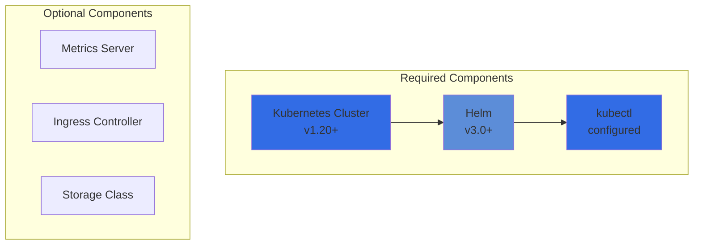
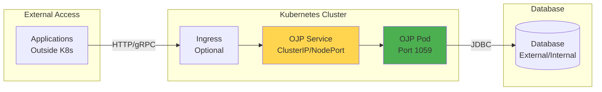
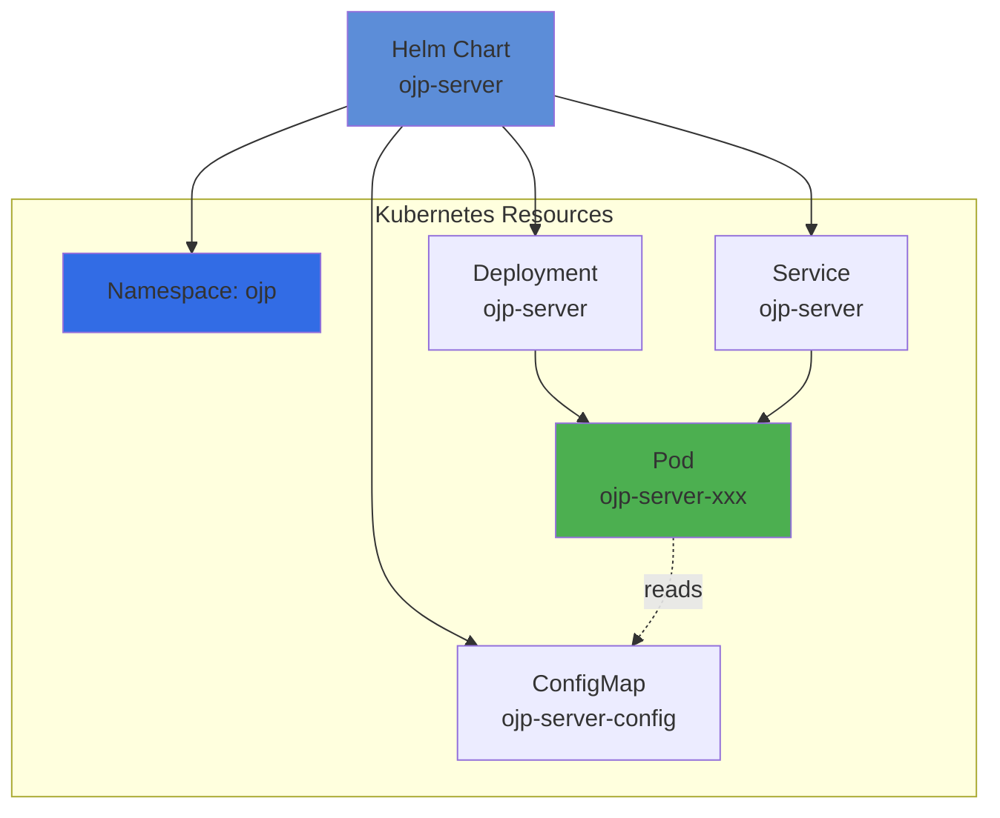
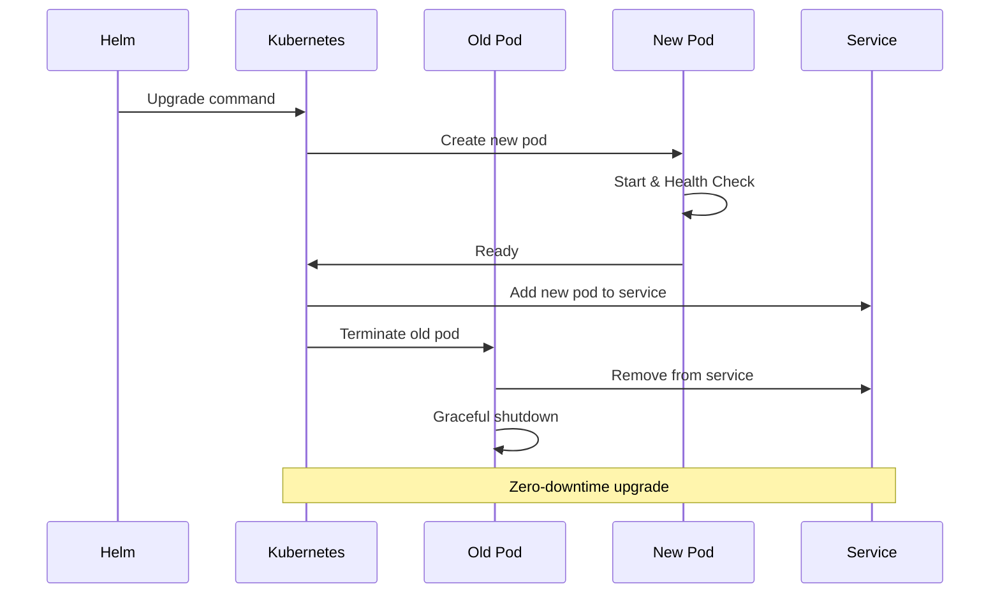
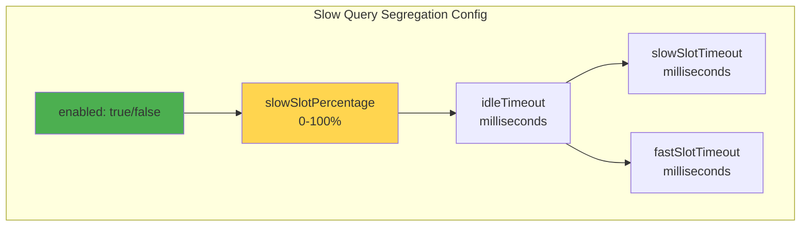
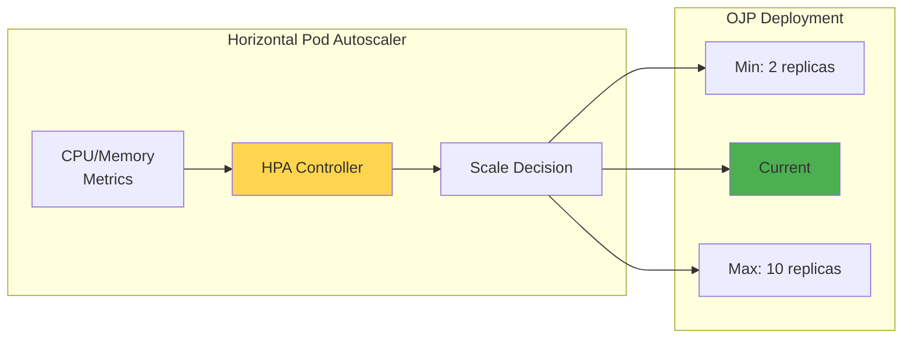
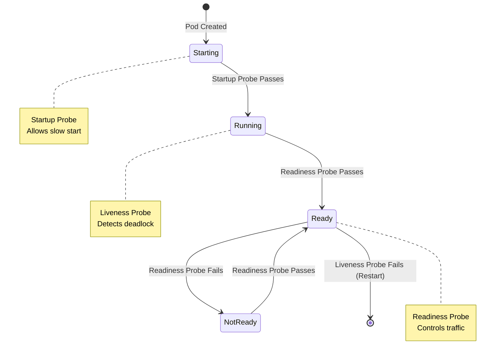
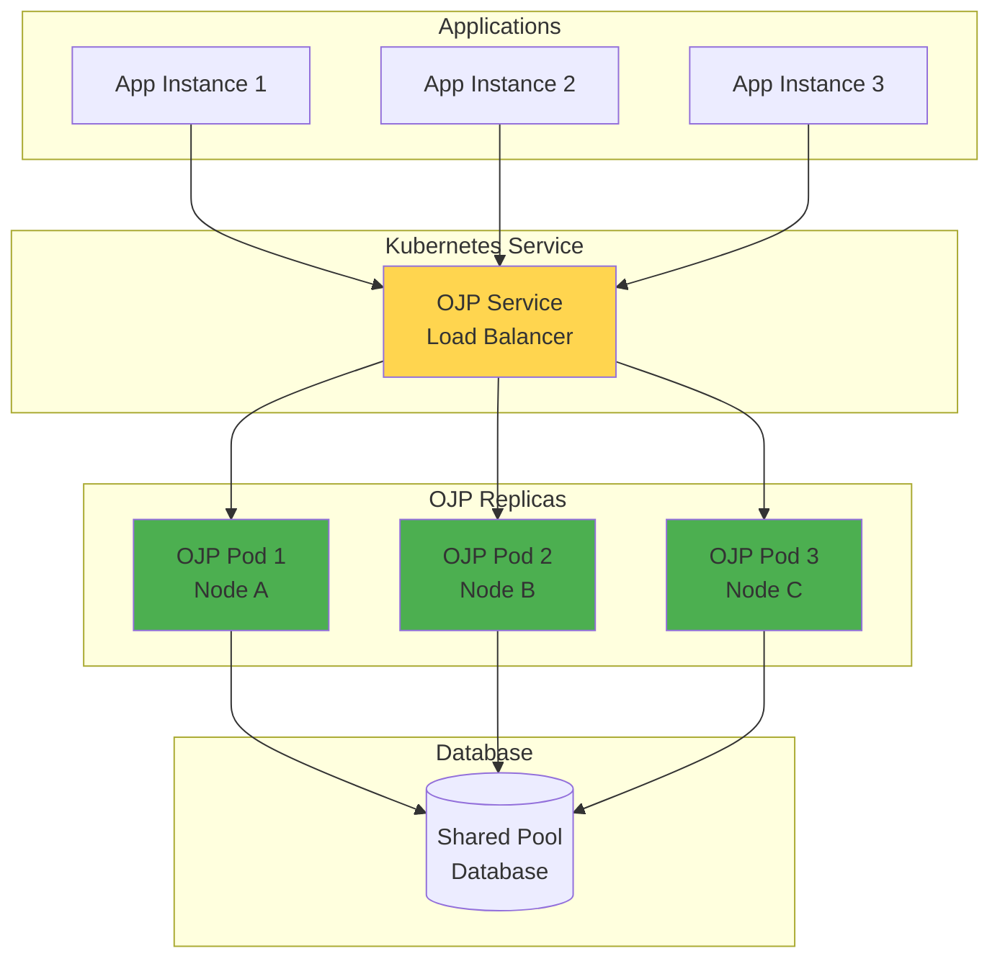

# Chapter 3a: Kubernetes Deployment with Helm

> **Chapter Overview**: Deploy OJP Server to Kubernetes using Helm charts. This chapter covers everything from prerequisites and basic installation to advanced Kubernetes patterns and production best practices for cloud-native environments.

---

## 3a.1 Kubernetes Prerequisites

Before deploying OJP to Kubernetes, ensure you have the necessary tools and infrastructure in place.

### Required Tools

**[IMAGE PROMPT 1]**: Create a prerequisites checklist infographic showing:
- Kubernetes cluster (with K8s logo and version 1.20+)
- Helm 3.x installed (with Helm logo)
- kubectl configured (with kubectl logo)
- Network access to cluster
Use modern cloud-native design with icons
Professional getting-started guide style with checkboxes



#### Kubernetes Cluster

OJP requires a Kubernetes cluster **version 1.20 or higher**. You can use:

- **Managed Kubernetes Services**:
  - Amazon EKS (Elastic Kubernetes Service)
  - Google GKE (Google Kubernetes Engine)
  - Azure AKS (Azure Kubernetes Service)
  - DigitalOcean Kubernetes
  
- **Self-Managed Clusters**:
  - kubeadm
  - kops
  - Rancher
  
- **Local Development**:
  - Minikube
  - Kind (Kubernetes in Docker)
  - Docker Desktop with Kubernetes
  - k3s (lightweight Kubernetes)

**Verify your cluster**:

```bash
kubectl version --short
# Expected: Client and Server version 1.20+

kubectl cluster-info
# Expected: Cluster endpoints displayed

kubectl get nodes
# Expected: At least one node in Ready status
```

#### Helm Installation

**[IMAGE PROMPT 2]**: Create a visual guide showing Helm installation on different platforms:
- macOS (using Homebrew)
- Linux (using package manager)
- Windows (using Chocolatey)
Show terminal commands and success indicators
Professional cross-platform installation guide style

Install Helm 3.x (Helm 2 is not supported):

**macOS**:
```bash
brew install helm
```

**Linux**:
```bash
curl https://raw.githubusercontent.com/helm/helm/main/scripts/get-helm-3 | bash
```

**Windows (Chocolatey)**:
```bash
choco install kubernetes-helm
```

**Verify Helm installation**:
```bash
helm version
# Expected: version.BuildInfo{Version:"v3.x.x", ...}
```

#### kubectl Configuration

Ensure `kubectl` is configured to access your cluster:

```bash
# View current context
kubectl config current-context

# List all contexts
kubectl config get-contexts

# Switch context if needed
kubectl config use-context <your-context>

# Test cluster access
kubectl get namespaces
```

### Cluster Requirements

**Minimum Resources** for OJP Server:

| Resource | Minimum | Recommended |
|----------|---------|-------------|
| CPU | 0.5 cores | 1-2 cores |
| Memory | 512 MB | 1-2 GB |
| Storage | 1 GB | 5 GB (for logs) |
| Nodes | 1 | 3+ (HA) |

**Network Requirements**:



**Required Network Access**:
- ✅ OJP Pod → Database (outbound to database port)
- ✅ Applications → OJP Service (inbound on port 1059)
- ✅ Monitoring Tools → Prometheus Metrics (port 9090/9159)

---

## 3a.2 Installing OJP Server with Helm

The official OJP Helm chart simplifies deployment and configuration management.

### Adding the OJP Helm Repository

**[IMAGE PROMPT 3]**: Create a step-by-step visual guide showing:
Step 1: helm repo add command
Step 2: helm repo update command
Step 3: helm search showing ojp-server
Step 4: Success confirmation
Use terminal-style screenshots with highlighted commands
Professional Helm tutorial style

First, add the OJP Helm repository to your Helm configuration:

```bash
# Add the OJP Helm repository
helm repo add ojp https://Open-J-Proxy.github.io/ojp-helm

# Expected output:
# "ojp" has been added to your repositories
```

**Update your Helm repositories**:

```bash
helm repo update

# Expected output:
# Hang tight while we grab the latest from your chart repositories...
# ...Successfully got an update from the "ojp" chart repository
# Update Complete. ⎈Happy Helming!⎈
```

**Verify the chart is available**:

```bash
helm search repo ojp

# Expected output:
# NAME              CHART VERSION  APP VERSION  DESCRIPTION
# ojp/ojp-server    0.1.2          0.1.0-beta   A OJP Server Helm chart for Kubernetes
```

### Basic Installation

**[IMAGE PROMPT 4]**: Create a Kubernetes deployment visualization showing:
- Helm chart being deployed
- Kubernetes resources being created (Deployment, Service, ConfigMap)
- Pod starting up with OJP Server
- Service exposing the pod
Use Kubernetes architecture diagram style with resource icons
Professional cloud-native deployment guide

Install OJP Server with default configuration:

```bash
# Create a dedicated namespace
kubectl create namespace ojp

# Install OJP Server
helm install ojp-server ojp/ojp-server \
    --namespace ojp \
    --create-namespace
```

**What gets created**:



### Verifying the Deployment

**Check deployment status**:

```bash
# Check Helm release
helm list -n ojp

# Expected output:
# NAME        NAMESPACE  REVISION  STATUS    CHART              APP VERSION
# ojp-server  ojp        1         deployed  ojp-server-0.1.2   0.1.0-beta
```

**Check Kubernetes resources**:

```bash
# Check pod status
kubectl get pods -n ojp

# Expected output:
# NAME                          READY   STATUS    RESTARTS   AGE
# ojp-server-7d8f9c5b4d-xyz12   1/1     Running   0          2m

# Check service
kubectl get svc -n ojp

# Expected output:
# NAME         TYPE        CLUSTER-IP      EXTERNAL-IP   PORT(S)    AGE
# ojp-server   ClusterIP   10.96.123.456   <none>        1059/TCP   2m
```

**View logs**:

```bash
kubectl logs -n ojp -l app.kubernetes.io/name=ojp-server

# Expected logs:
# [main] INFO - OJP Server Configuration:
# [main] INFO -   Server Port: 1059
# [main] INFO - Starting OJP gRPC Server on port 1059
# [main] INFO - OJP gRPC Server started successfully
```

### Custom Values Installation

**[IMAGE PROMPT 5]**: Create a side-by-side comparison showing:
LEFT: Default installation with standard values
RIGHT: Custom installation with custom values file
Show configuration differences highlighted
Professional configuration guide style

Create a custom `values.yaml` file to override defaults:

```yaml
# my-values.yaml

# Increase replica count for high availability
replicaCount: 3

server:
  # Custom server port
  port: 8080
  
  # Increase thread pool for higher concurrency
  threadPoolSize: 500
  
  # Enable debug logging
  logLevel: DEBUG
  
  # Configure IP whitelist for security
  allowedIps: "10.0.0.0/8,172.16.0.0/12"
  
  # Slow query segregation tuning
  slowQuerySegregation:
    enabled: true
    slowSlotPercentage: 30
    fastSlotTimeout: 45000

# Configure resource limits
resources:
  limits:
    cpu: "2"
    memory: "2Gi"
  requests:
    cpu: "500m"
    memory: "1Gi"

# Enable autoscaling (see note below about OJP multinode considerations)
autoscaling:
  enabled: false  # Disabled by default - see architectural note
  minReplicas: 2
  maxReplicas: 10
  targetCPUUtilizationPercentage: 70

# Use NodePort for external access
service:
  type: NodePort
  port: 1059
```

**Install with custom values**:

```bash
helm install ojp-server ojp/ojp-server \
    --namespace ojp \
    --create-namespace \
    --values my-values.yaml
```

**Or use command-line overrides**:

```bash
helm install ojp-server ojp/ojp-server \
    --namespace ojp \
    --create-namespace \
    --set replicaCount=3 \
    --set server.threadPoolSize=500 \
    --set resources.requests.cpu=500m \
    --set resources.requests.memory=1Gi
```

### Upgrading OJP Server

**[IMAGE PROMPT 6]**: Create a visual representation of Helm upgrade process:
Show: Current release → Helm upgrade command → Rolling update → New version deployed
Include rollback option as a safety net
Use flowchart style with Kubernetes rolling update visualization
Professional deployment pipeline style

Update your deployment with new configuration or chart version:

```bash
# Update Helm repositories
helm repo update

# Upgrade to latest version
helm upgrade ojp-server ojp/ojp-server \
    --namespace ojp \
    --values my-values.yaml

# Upgrade with specific version
helm upgrade ojp-server ojp/ojp-server \
    --namespace ojp \
    --version 0.1.3 \
    --values my-values.yaml
```

**Rolling Update Behavior**:



**Rollback if needed**:

```bash
# View release history
helm history ojp-server -n ojp

# Rollback to previous version
helm rollback ojp-server -n ojp

# Rollback to specific revision
helm rollback ojp-server 1 -n ojp
```

### Uninstalling OJP Server

```bash
# Uninstall the Helm release
helm uninstall ojp-server -n ojp

# Optionally, delete the namespace
kubectl delete namespace ojp
```

---

## 3a.3 Helm Chart Configuration

The OJP Helm chart provides extensive configuration options through the `values.yaml` file.

### Complete Configuration Reference

**[IMAGE PROMPT 7]**: Create an infographic showing configuration categories:
- Server Settings (port, thread pool, timeouts)
- Observability (OpenTelemetry, Prometheus)
- Advanced Features (slow query segregation, circuit breaker)
- Kubernetes Settings (replicas, resources, autoscaling)
Use categorized sections with icons for each category
Professional configuration reference guide style

#### Server Configuration

```yaml
server:
  # Core server settings
  port: 1059                        # gRPC server port
  prometheusPort: 9090              # Metrics endpoint port
  threadPoolSize: 200               # gRPC server thread pool
  maxRequestSize: 4194304           # Max request size (4MB)
  connectionIdleTimeout: "30000"    # Connection idle timeout (ms)
  
  # Security settings
  allowedIps: "0.0.0.0/0"          # IP whitelist (CIDR notation)
  prometheusAllowedIps: "0.0.0.0/0" # Metrics endpoint whitelist
  
  # Circuit breaker configuration
  circuitBreakerTimeout: "60000"    # Timeout when circuit is open (ms)
  circuitBreakerThreshold: 3        # Failures before opening circuit
  
  # Logging
  logLevel: INFO                    # Log level: TRACE, DEBUG, INFO, WARN, ERROR
```

#### OpenTelemetry Configuration

```yaml
server:
  opentelemetry:
    enabled: true                   # Enable OpenTelemetry
    endpoint: ""                    # OTLP endpoint (empty = default)
```

**Example with custom OTLP endpoint**:

```yaml
server:
  opentelemetry:
    enabled: true
    endpoint: "http://otel-collector:4317"
```

#### Slow Query Segregation



```yaml
server:
  slowQuerySegregation:
    enabled: true                   # Enable feature
    slowSlotPercentage: 20          # % of pool for slow queries
    idleTimeout: 10000              # Idle time before slot borrowing (ms)
    slowSlotTimeout: 120000         # Timeout for slow query slots (ms)
    fastSlotTimeout: 60000          # Timeout for fast query slots (ms)
```

#### Image Configuration

```yaml
image:
  repository: rrobetti/ojp          # Docker image repository
  pullPolicy: IfNotPresent          # Pull policy: Always, IfNotPresent, Never
  tag: ""                           # Override tag (default: chart appVersion)

# Private registry support
imagePullSecrets:
  - name: my-registry-secret
```

**Using a specific version**:

```yaml
image:
  repository: rrobetti/ojp
  tag: "0.3.1-beta"
  pullPolicy: IfNotPresent
```

#### Deployment Configuration

```yaml
replicaCount: 1                     # Number of pod replicas

# Pod annotations (for monitoring, service mesh, etc.)
podAnnotations:
  prometheus.io/scrape: "true"
  prometheus.io/port: "9090"
  prometheus.io/path: "/metrics"

# Security contexts
podSecurityContext:
  fsGroup: 2000

securityContext:
  capabilities:
    drop:
    - ALL
  readOnlyRootFilesystem: true
  runAsNonRoot: true
  runAsUser: 1000
```

#### Service Configuration

**[IMAGE PROMPT 8]**: Create a diagram showing different service types:
- ClusterIP (internal only)
- NodePort (exposed on node ports)
- LoadBalancer (cloud load balancer)
Show access patterns for each type
Use Kubernetes service architecture style
Professional K8s networking guide

```yaml
service:
  type: ClusterIP                   # Service type: ClusterIP, NodePort, LoadBalancer
  port: 1059                        # Service port
```

**Service type examples**:

```yaml
# ClusterIP - Internal access only (default)
service:
  type: ClusterIP
  port: 1059

# NodePort - Access via node IP:nodePort
service:
  type: NodePort
  port: 1059
  nodePort: 31059  # Optional: specify node port (30000-32767)

# LoadBalancer - Cloud provider load balancer
service:
  type: LoadBalancer
  port: 1059
  # annotations for cloud-specific settings
```

#### Resource Limits

```yaml
resources:
  limits:
    cpu: 2000m                      # Maximum CPU (2 cores)
    memory: 2Gi                     # Maximum memory (2 GB)
  requests:
    cpu: 500m                       # Requested CPU (0.5 cores)
    memory: 1Gi                     # Requested memory (1 GB)
```

**Resource Sizing Guidelines**:

| Workload | CPU Request | Memory Request | CPU Limit | Memory Limit |
|----------|-------------|----------------|-----------|--------------|
| Development | 100m | 256Mi | 500m | 512Mi |
| Testing | 250m | 512Mi | 1000m | 1Gi |
| Production | 500m | 1Gi | 2000m | 2Gi |
| High Load | 1000m | 2Gi | 4000m | 4Gi |

#### Autoscaling Configuration



```yaml
autoscaling:
  enabled: true                              # Enable HPA
  minReplicas: 2                             # Minimum pod count
  maxReplicas: 10                            # Maximum pod count
  targetCPUUtilizationPercentage: 80         # Scale at 80% CPU
  targetMemoryUtilizationPercentage: 80      # Scale at 80% memory (optional)
```

**How autoscaling works**:

1. **Metrics Server** collects pod resource usage
2. **HPA** compares current usage to targets
3. **Scale Up**: When usage > target, add pods (up to max)
4. **Scale Down**: When usage < target, remove pods (down to min)
5. **Cooldown**: Waits between scaling operations to avoid flapping

#### Node Affinity and Tolerations

```yaml
# Schedule pods on specific nodes
nodeSelector:
  disktype: ssd
  workload: database-proxy

# Allow pods on nodes with specific taints
tolerations:
  - key: "dedicated"
    operator: "Equal"
    value: "database"
    effect: "NoSchedule"

# Advanced pod affinity rules
affinity:
  nodeAffinity:
    requiredDuringSchedulingIgnoredDuringExecution:
      nodeSelectorTerms:
      - matchExpressions:
        - key: kubernetes.io/hostname
          operator: In
          values:
          - node1
          - node2
```

---

## 3a.4 Advanced Kubernetes Deployment

Beyond basic installation, OJP can leverage advanced Kubernetes features for production deployments.

### ConfigMaps and Secrets

**[IMAGE PROMPT 9]**: Create a diagram showing:
ConfigMap for non-sensitive configuration
Secret for sensitive data (passwords, API keys)
Both being mounted into OJP pods
Use Kubernetes security diagram style
Professional K8s configuration management guide

#### Using ConfigMaps for Configuration

Create a ConfigMap for additional OJP configuration:

```yaml
# ojp-config.yaml
apiVersion: v1
kind: ConfigMap
metadata:
  name: ojp-config
  namespace: ojp
data:
  # Additional environment variables
  JAVA_OPTS: "-Xmx2g -Xms1g"
  TZ: "America/New_York"
```

Apply the ConfigMap:

```bash
kubectl apply -f ojp-config.yaml -n ojp
```

Reference in Helm values:

```yaml
# Add to deployment via values
env:
  - name: JAVA_OPTS
    valueFrom:
      configMapKeyRef:
        name: ojp-config
        key: JAVA_OPTS
```

#### Using Secrets for Sensitive Data

**[IMAGE PROMPT 10]**: Create a security-focused diagram showing:
Kubernetes Secret encrypted at rest
Secret mounted as environment variable or file
Application accessing secret securely
Use security/encryption iconography
Professional security guide style

Create a secret for database credentials:

```bash
# Create secret from literals
kubectl create secret generic ojp-db-credentials \
  --namespace ojp \
  --from-literal=username=ojp_user \
  --from-literal=password='MyS3cur3P@ssw0rd'

# Or from a file
kubectl create secret generic ojp-db-credentials \
  --namespace ojp \
  --from-file=username.txt \
  --from-file=password.txt
```

**Secret YAML example**:

```yaml
apiVersion: v1
kind: Secret
metadata:
  name: ojp-db-credentials
  namespace: ojp
type: Opaque
stringData:
  username: ojp_user
  password: MyS3cur3P@ssw0rd
```

**Use secret in deployment**:

```yaml
# In Helm values or deployment template
env:
  - name: DB_USERNAME
    valueFrom:
      secretKeyRef:
        name: ojp-db-credentials
        key: username
  - name: DB_PASSWORD
    valueFrom:
      secretKeyRef:
        name: ojp-db-credentials
        key: password
```

### Persistent Volumes for Logs

**[IMAGE PROMPT 11]**: Create a diagram showing:
PersistentVolumeClaim → PersistentVolume → Storage Backend
Pod mounting the PVC for log persistence
Use Kubernetes storage architecture diagram style
Professional K8s storage guide

For persistent log storage:

```yaml
# pvc.yaml
apiVersion: v1
kind: PersistentVolumeClaim
metadata:
  name: ojp-logs
  namespace: ojp
spec:
  accessModes:
    - ReadWriteOnce
  resources:
    requests:
      storage: 10Gi
  storageClassName: standard  # Or your storage class
```

Mount in Helm values:

```yaml
# Add to values.yaml
persistence:
  enabled: true
  storageClass: "standard"
  accessMode: ReadWriteOnce
  size: 10Gi
  mountPath: /var/log/ojp
```

### Network Policies

**[IMAGE PROMPT 12]**: Create a network security diagram showing:
Allowed traffic: Applications → OJP (port 1059)
Allowed traffic: OJP → Database
Allowed traffic: Monitoring → Metrics (port 9090)
Blocked: All other traffic
Use network security diagram with firewall iconography
Professional K8s security guide

Restrict network access to OJP:

```yaml
# network-policy.yaml
apiVersion: networking.k8s.io/v1
kind: NetworkPolicy
metadata:
  name: ojp-server-policy
  namespace: ojp
spec:
  podSelector:
    matchLabels:
      app.kubernetes.io/name: ojp-server
  policyTypes:
    - Ingress
    - Egress
  ingress:
    # Allow from application namespace
    - from:
      - namespaceSelector:
          matchLabels:
            name: applications
      ports:
      - protocol: TCP
        port: 1059
    # Allow from monitoring namespace
    - from:
      - namespaceSelector:
          matchLabels:
            name: monitoring
      ports:
      - protocol: TCP
        port: 9090
  egress:
    # Allow to database
    - to:
      - namespaceSelector:
          matchLabels:
            name: database
      ports:
      - protocol: TCP
        port: 5432
    # Allow DNS
    - to:
      - namespaceSelector:
          matchLabels:
            name: kube-system
      ports:
      - protocol: UDP
        port: 53
```

### Ingress Configuration

**[IMAGE PROMPT 13]**: Create an architecture comparison diagram showing:
- Traditional approach: External traffic → Ingress Controller → Load Balanced OJP Pods (showing single TCP connection issue)
- Recommended approach: External traffic → Individual OJP Pod Services (NodePort/LoadBalancer) → Client-side load balancing
Use Kubernetes architecture comparison style with pros/cons annotations
Professional K8s networking guide

#### ⚠️ Important: Ingress and OJP Multinode Architecture

**OJP's multinode architecture requires special consideration in Kubernetes**:

OJP clients use a **client-side load balancing** strategy where the JDBC driver connects to multiple OJP server addresses simultaneously (e.g., `jdbc:ojp[server1:1059,server2:1059,server3:1059]_...`). This enables:
- **Intelligent load distribution** based on real-time server load
- **Automatic failover** when servers become unavailable
- **Connection affinity** for transactions and temporary tables

**Ingress Limitations for OJP**:

While Ingress can technically expose OJP via gRPC, it creates architectural challenges:

1. **TCP Connection Stickiness**: Ingress controllers load balance at the **TCP connection level**. Once a gRPC connection is established, all requests flow through that single OJP pod, defeating OJP's client-side load balancing.

2. **Loss of Failover Capabilities**: If the selected pod fails, the entire connection fails rather than transparently failing over to another pod.

3. **Reduced Load Distribution**: The OJP driver cannot intelligently distribute load across servers based on real-time metrics.

**Recommended Approach for Production**:

Instead of using a single Ingress endpoint, **expose each OJP pod individually** so the JDBC driver can connect to all instances:

```yaml
# Per-pod services using StatefulSet
apiVersion: v1
kind: Service
metadata:
  name: ojp-server-0
  namespace: ojp
spec:
  type: LoadBalancer  # or NodePort
  selector:
    statefulset.kubernetes.io/pod-name: ojp-server-0
  ports:
    - protocol: TCP
      port: 1059
      targetPort: 1059
---
apiVersion: v1
kind: Service
metadata:
  name: ojp-server-1
  namespace: ojp
spec:
  type: LoadBalancer
  selector:
    statefulset.kubernetes.io/pod-name: ojp-server-1
  ports:
    - protocol: TCP
      port: 1059
      targetPort: 1059
# Repeat for each replica
```

**JDBC URL with multiple endpoints**:

```java
// Connect to all OJP pods directly
String url = "jdbc:ojp[ojp-server-0.example.com:1059,ojp-server-1.example.com:1059,ojp-server-2.example.com:1059]_postgresql://localhost:5432/mydb";
```

This configuration preserves OJP's advanced capabilities while leveraging Kubernetes orchestration.

**When Ingress Might Be Acceptable**:

Ingress can be used for OJP in specific scenarios where the trade-offs are acceptable:
- **Development/testing environments** where simplified access is prioritized over resilience
- **Single-server deployments** where client-side load balancing isn't needed
- **Non-critical workloads** where connection-level affinity is acceptable

If you choose to use Ingress despite the limitations, here's the configuration:

```yaml
# ingress.yaml (for single-endpoint access - not recommended for production HA)
apiVersion: networking.k8s.io/v1
kind: Ingress
metadata:
  name: ojp-ingress
  namespace: ojp
  annotations:
    # For gRPC support (nginx-specific)
    nginx.ingress.kubernetes.io/backend-protocol: "GRPC"
    # Note: This creates TCP-level load balancing, not request-level
spec:
  ingressClassName: nginx
  rules:
    - host: ojp.example.com
      http:
        paths:
          - path: /
            pathType: Prefix
            backend:
              service:
                name: ojp-server
                port:
                  number: 1059
  # TLS configuration
  tls:
    - hosts:
        - ojp.example.com
      secretName: ojp-tls-cert
```

**Create TLS secret**:

```bash
kubectl create secret tls ojp-tls-cert \
  --namespace ojp \
  --cert=path/to/cert.pem \
  --key=path/to/key.pem
```

**gRPC Client configuration (single endpoint)**:

```java
// Connect via Ingress (loses multinode benefits)
String url = "jdbc:ojp[ojp.example.com:443]_postgresql://localhost:5432/mydb";
```

---

## 3a.5 Kubernetes Best Practices

Production-ready deployments require additional considerations for reliability and observability.

### Health Checks and Readiness Probes

**[IMAGE PROMPT 14]**: Create a diagram showing Kubernetes health check lifecycle:
Pod starts → Startup probe → Readiness probe → Liveness probe
Show when traffic is routed and when pods are restarted
Use flowchart with health status indicators
Professional K8s reliability guide

Configure probes for OJP:

```yaml
# In deployment template or Helm values
livenessProbe:
  tcpSocket:
    port: 1059
  initialDelaySeconds: 30
  periodSeconds: 10
  timeoutSeconds: 5
  failureThreshold: 3

readinessProbe:
  tcpSocket:
    port: 1059
  initialDelaySeconds: 10
  periodSeconds: 5
  timeoutSeconds: 3
  failureThreshold: 2

startupProbe:
  tcpSocket:
    port: 1059
  initialDelaySeconds: 0
  periodSeconds: 10
  timeoutSeconds: 3
  failureThreshold: 30
```

**Probe Types Explained**:



- **Startup Probe**: Gives pod time to start (useful for slow initialization)
- **Readiness Probe**: Determines if pod should receive traffic
- **Liveness Probe**: Detects deadlocked pods and restarts them

### Rolling Updates and Rollbacks

**[IMAGE PROMPT 15]**: Create a visual representation of rolling update strategy for OJP:
Show old pods gradually being replaced by new pods
Display: maxSurge and maxUnavailable settings with client reconnection
Illustrate graceful client failover to new pods
Use timeline/animation-style diagram showing JDBC driver reconnection
Professional deployment strategy guide

#### Rolling Updates with OJP's Multinode Architecture

**Important Consideration**: OJP's client-side load balancing provides natural support for rolling updates. When the JDBC driver detects a pod is unavailable (during replacement), it automatically fails over to available pods. This makes rolling updates seamless from the client perspective.

Configure deployment strategy:

```yaml
strategy:
  type: RollingUpdate
  rollingUpdate:
    maxSurge: 1          # Max extra pods during update
    maxUnavailable: 0    # Max unavailable pods (for zero-downtime)
```

**How It Works with OJP**:

1. New pod starts with updated version
2. Health probes pass, pod becomes ready
3. Old pod is terminated (graceful shutdown)
4. JDBC driver detects unavailable pod and redistributes connections
5. Process repeats for next pod

**Zero-Downtime Update Example**:

```mermaid
gantt
    title Rolling Update: 3 Replicas to New Version
    dateFormat X
    axisFormat %L
    
    section Pod 1
    Old Version: 0, 3
    New Version: 3, 6
    
    section Pod 2
    Old Version: 0, 4
    New Version: 4, 6
    
    section Pod 3
    Old Version: 0, 5
    New Version: 5, 6
    
    section Pod 4 (Surge)
    New Version: 1, 2
```



**Update Strategy Options**:

| Configuration | Zero-Downtime | Speed | Resource Usage |
|---------------|---------------|-------|----------------|
| maxSurge=1, maxUnavailable=0 | ✅ Yes | Moderate | Low extra |
| maxSurge=2, maxUnavailable=0 | ✅ Yes | Fast | Higher extra |
| maxSurge=0, maxUnavailable=1 | ❌ No | Fast | No extra |

### Monitoring and Logging in Kubernetes

**[IMAGE PROMPT 16]**: Create a comprehensive monitoring stack diagram:
- Prometheus scraping OJP metrics
- Grafana dashboards visualizing data
- Logs flowing to centralized logging (Loki, ELK)
- Alerts being sent to notification systems
Use modern observability architecture style
Professional monitoring guide

#### Prometheus Integration

OJP exposes Prometheus metrics on port 9090 by default.

**ServiceMonitor for Prometheus Operator**:

```yaml
apiVersion: monitoring.coreos.com/v1
kind: ServiceMonitor
metadata:
  name: ojp-server
  namespace: ojp
  labels:
    app: ojp-server
spec:
  selector:
    matchLabels:
      app.kubernetes.io/name: ojp-server
  endpoints:
    - port: prometheus
      interval: 30s
      path: /metrics
```

**Prometheus scrape config (without Operator)**:

```yaml
# In Prometheus ConfigMap
scrape_configs:
  - job_name: 'ojp-server'
    kubernetes_sd_configs:
      - role: pod
        namespaces:
          names:
            - ojp
    relabel_configs:
      - source_labels: [__meta_kubernetes_pod_label_app_kubernetes_io_name]
        action: keep
        regex: ojp-server
      - source_labels: [__meta_kubernetes_pod_container_port_name]
        action: keep
        regex: prometheus
```

#### Centralized Logging

**Fluent Bit/Fluentd example**:

```yaml
# Pod annotations for log parsing
podAnnotations:
  fluentbit.io/parser: json
  fluentbit.io/exclude: "false"
```

**Loki labels**:

```yaml
podAnnotations:
  loki.io/scrape: "true"
  loki.io/labels: "app=ojp-server,namespace=ojp"
```

### Multi-Replica Deployments for High Availability

**[IMAGE PROMPT 17]**: Create a high-availability deployment diagram showing:
- 3 OJP replicas (StatefulSet pods) with individual Services/endpoints
- JDBC driver connecting to all three endpoints simultaneously
- Client-side load balancing and failover arrows
- Node failure scenario with automatic failover to remaining pods
- Each replica connecting to the same database backend
Use HA architecture diagram style emphasizing client-side intelligence
Professional high-availability guide with OJP multinode focus

#### Understanding OJP HA Architecture in Kubernetes

**Key Principle**: OJP achieves high availability through **client-side load balancing** rather than traditional server-side load balancers. This requires exposing each pod individually so JDBC drivers can connect to all instances.

**Recommended HA Setup**:

For high availability, deploy multiple replicas using **StatefulSet** with individual pod services:

```yaml
# Use StatefulSet instead of Deployment for stable network identities
apiVersion: apps/v1
kind: StatefulSet
metadata:
  name: ojp-server
  namespace: ojp
spec:
  serviceName: ojp-server
  replicas: 3
  selector:
    matchLabels:
      app: ojp-server
  template:
    metadata:
      labels:
        app: ojp-server
    spec:
      # Anti-affinity to spread across nodes
      affinity:
        podAntiAffinity:
          preferredDuringSchedulingIgnoredDuringExecution:
            - weight: 100
              podAffinityTerm:
                labelSelector:
                  matchExpressions:
                    - key: app
                      operator: In
                      values:
                        - ojp-server
                topologyKey: kubernetes.io/hostname
      containers:
        - name: ojp-server
          image: rrobetti/ojp-server:latest
          ports:
            - containerPort: 1059
              name: grpc
            - containerPort: 9090
              name: prometheus
```

**Individual Pod Services** (for client-side load balancing):

```yaml
# Service for pod-0
apiVersion: v1
kind: Service
metadata:
  name: ojp-server-0
  namespace: ojp
spec:
  type: LoadBalancer  # or NodePort
  selector:
    statefulset.kubernetes.io/pod-name: ojp-server-0
  ports:
    - protocol: TCP
      port: 1059
      targetPort: 1059
      name: grpc
---
# Service for pod-1
apiVersion: v1
kind: Service
metadata:
  name: ojp-server-1
  namespace: ojp
spec:
  type: LoadBalancer
  selector:
    statefulset.kubernetes.io/pod-name: ojp-server-1
  ports:
    - protocol: TCP
      port: 1059
      targetPort: 1059
      name: grpc
---
# Service for pod-2
apiVersion: v1
kind: Service
metadata:
  name: ojp-server-2
  namespace: ojp
spec:
  type: LoadBalancer
  selector:
    statefulset.kubernetes.io/pod-name: ojp-server-2
  ports:
    - protocol: TCP
      port: 1059
      targetPort: 1059
      name: grpc
```

**JDBC URL Configuration**:

```java
// All pods accessible to JDBC driver for client-side load balancing
String url = "jdbc:ojp[ojp-server-0.example.com:1059,ojp-server-1.example.com:1059,ojp-server-2.example.com:1059]_postgresql://db.example.com:5432/mydb";
```

**Why This Architecture**:

- ✅ **True Load Balancing**: Driver distributes connections based on real-time server load
- ✅ **Automatic Failover**: If one pod fails, driver immediately fails over to healthy pods
- ✅ **Transaction Affinity**: Transactions stay on the same pod automatically
- ✅ **No Single Point of Failure**: No load balancer dependency

**Autoscaling Considerations**:

Kubernetes HPA (Horizontal Pod Autoscaler) can scale OJP pods, **but** clients must be reconfigured with new pod addresses. This makes autoscaling operationally complex:

```yaml
# Autoscaling is possible but requires coordination
autoscaling:
  enabled: false  # Disabled by default
  minReplicas: 3  # Fixed size recommended
  maxReplicas: 10
```

**Current Limitation**: OJP doesn't yet support dynamic service discovery (planned enhancement). For now, use a **fixed replica count** that handles peak load:

```yaml
replicaCount: 3
                  - ojp-server
          topologyKey: kubernetes.io/hostname
```

**Benefits of Multi-Replica**:
- ✅ High availability: Survives pod/node failures
- ✅ Load distribution: Requests spread across pods
- ✅ Rolling updates: Zero-downtime deployments
- ✅ Scalability: Handle more concurrent connections

**Connection handling with replicas**:



### Production Checklist

**[IMAGE PROMPT 18]**: Create a production readiness checklist infographic:
- Resource limits configured ✓
- Health probes configured ✓
- Multiple replicas ✓
- Monitoring enabled ✓
- Logs centralized ✓
- Network policies applied ✓
- Security contexts set ✓
- Backup strategy defined ✓
Use checklist style with completion indicators
Professional production readiness guide

Before going to production, verify:

```yaml
# ✅ Resource Limits
resources:
  requests: { cpu: 500m, memory: 1Gi }
  limits: { cpu: 2000m, memory: 2Gi }

# ✅ Health Probes
livenessProbe: configured
readinessProbe: configured
startupProbe: configured

# ✅ High Availability
replicaCount: >= 3
podAntiAffinity: configured

# ✅ Security
securityContext: configured
networkPolicy: applied
allowedIps: restricted (not 0.0.0.0/0)

# ✅ Monitoring
prometheus: enabled
alerts: configured
dashboards: created

# ✅ Logging
centralized logging: enabled
log retention: configured

# ✅ Autoscaling
HPA: enabled
metrics-server: running

# ✅ Updates
rollingUpdate: configured
maxUnavailable: 0 (zero-downtime)
```

---

## Summary

You now have comprehensive knowledge of deploying OJP to Kubernetes with Helm:

✅ **Prerequisites**: Kubernetes cluster, Helm, kubectl configured  
✅ **Installation**: Simple Helm install with the ojp-server chart  
✅ **Configuration**: Complete understanding of all Helm values  
✅ **Advanced Features**: ConfigMaps, Secrets, Ingress, Network Policies  
✅ **Best Practices**: Health checks, rolling updates, monitoring, HA deployment

**Key Takeaways**:
- Helm simplifies OJP deployment and upgrades
- Extensive configuration options via `values.yaml`
- Production deployments require multiple replicas and health checks
- Integration with Kubernetes ecosystem (Prometheus, Ingress, NetworkPolicy)
- Zero-downtime updates with proper rolling update strategy

In the next chapter, we'll explore database driver configuration, covering both open-source and proprietary databases.

---

**Previous Chapter**: [← Chapter 3: Quick Start Guide](part1-chapter3-quickstart.md)  
**Next Chapter**: [Chapter 4: Database Driver Configuration →](part2-chapter4-database-drivers.md)
