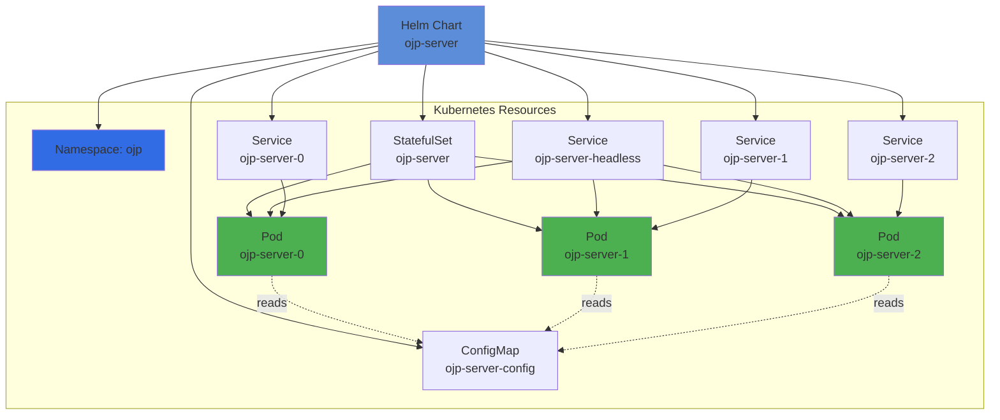

# Chapter 3a: Kubernetes Deployment with Helm

> **Chapter Overview**: Deploy OJP Server to Kubernetes using Helm charts. This chapter covers everything from prerequisites and basic installation to advanced Kubernetes patterns and production best practices for cloud-native environments.

> **✅ Production-Ready Architecture**: The official OJP Helm charts use a **StatefulSet** deployment model with individual per-pod LoadBalancer services. Each OJP instance gets its own stable network identity and external IP address, enabling direct client access and connection affinity. This architecture is production-ready and aligns with best practices for stateful proxies requiring persistent network identities.

---

## 3a.1 Kubernetes Prerequisites

Before deploying OJP to Kubernetes, ensure you have the necessary tools and infrastructure in place.

### Required Tools

**[IMAGE PROMPT 1]**: Create a prerequisites checklist infographic showing:
- Kubernetes cluster (with K8s logo and version 1.20+)
- Helm 3.x installed (with Helm logo)
- kubectl configured (with kubectl logo)
- Network access to cluster
Use modern cloud-native design with icons
Professional getting-started guide style with checkboxes


#### Kubernetes Cluster

OJP requires a Kubernetes cluster **version 1.20 or higher**. You can use:

- **Managed Kubernetes Services**:
  - Amazon EKS (Elastic Kubernetes Service)
  - Google GKE (Google Kubernetes Engine)
  - Azure AKS (Azure Kubernetes Service)
  - DigitalOcean Kubernetes
  
- **Self-Managed Clusters**:
  - kubeadm
  - kops
  - Rancher
  
- **Local Development**:
  - Minikube
  - Kind (Kubernetes in Docker)
  - Docker Desktop with Kubernetes
  - k3s (lightweight Kubernetes)

**Verify your cluster**:

```bash
kubectl version --short
# Expected: Client and Server version 1.20+

kubectl cluster-info
# Expected: Cluster endpoints displayed

kubectl get nodes
# Expected: At least one node in Ready status
```

#### Helm Installation

**[IMAGE PROMPT 2]**: Create a visual guide showing Helm installation on different platforms:
- macOS (using Homebrew)
- Linux (using package manager)
- Windows (using Chocolatey)
Show terminal commands and success indicators
Professional cross-platform installation guide style

Install Helm 3.x (Helm 2 is not supported):

**macOS**:
```bash
brew install helm
```

**Linux**:
```bash
curl https://raw.githubusercontent.com/helm/helm/main/scripts/get-helm-3 | bash
```

**Windows (Chocolatey)**:
```bash
choco install kubernetes-helm
```

**Verify Helm installation**:
```bash
helm version
# Expected: version.BuildInfo{Version:"v3.x.x", ...}
```

#### kubectl Configuration

Ensure `kubectl` is configured to access your cluster:

```bash
# View current context
kubectl config current-context

# List all contexts
kubectl config get-contexts

# Switch context if needed
kubectl config use-context <your-context>

# Test cluster access
kubectl get namespaces
```

### Cluster Requirements

**Minimum Resources** for OJP Server:

| Resource | Minimum | Recommended |
|----------|---------|-------------|
| CPU | 0.5 cores | 1-2 cores |
| Memory | 512 MB | 1-2 GB |
| Storage | 1 GB | 5 GB (for logs) |
| Nodes | 1 | 3+ (HA) |

**Network Requirements**:


**Required Network Access**:
- ✅ OJP Pod → Database (outbound to database port)
- ✅ Applications → OJP Service (inbound on port 1059)
- ✅ Monitoring Tools → Prometheus Metrics (port 9090/9159)

---

## 3a.2 Installing OJP Server with Helm

The official OJP Helm chart simplifies deployment and configuration management.

### Adding the OJP Helm Repository

**[IMAGE PROMPT 3]**: Create a step-by-step visual guide showing:
Step 1: helm repo add command
Step 2: helm repo update command
Step 3: helm search showing ojp-server
Step 4: Success confirmation
Use terminal-style screenshots with highlighted commands
Professional Helm tutorial style

First, add the OJP Helm repository to your Helm configuration:

```bash
# Add the OJP Helm repository
helm repo add ojp https://Open-J-Proxy.github.io/ojp-helm

# Expected output:
# "ojp" has been added to your repositories
```

**Update your Helm repositories**:

```bash
helm repo update

# Expected output:
# Hang tight while we grab the latest from your chart repositories...
# ...Successfully got an update from the "ojp" chart repository
# Update Complete. ⎈Happy Helming!⎈
```

**Verify the chart is available**:

```bash
helm search repo ojp

# Expected output:
# NAME              CHART VERSION  APP VERSION  DESCRIPTION
# ojp/ojp-server    0.1.2          0.1.0-beta   A OJP Server Helm chart for Kubernetes
```

### Basic Installation

**[IMAGE PROMPT 4]**: Create a Kubernetes deployment visualization showing:
- Helm chart being deployed
- Kubernetes resources being created (StatefulSet, Services, ConfigMap)
- Pods starting up with stable identities (ojp-server-0, ojp-server-1, ojp-server-2)
- Individual per-pod LoadBalancer services exposing each pod
- Headless service for StatefulSet DNS discovery
Use Kubernetes architecture diagram style with resource icons
Professional cloud-native deployment guide showing StatefulSet architecture

Install OJP Server with default configuration:

```bash
# Create a dedicated namespace
kubectl create namespace ojp

# Install OJP Server
helm install ojp-server ojp/ojp-server \
    --namespace ojp \
    --create-namespace
```

**What gets created**:



### Verifying the Deployment

**Check Helm release**:

```bash
# Check Helm release
helm list -n ojp

# Expected output:
# NAME        NAMESPACE  REVISION  STATUS    CHART              APP VERSION
# ojp-server  ojp        1         deployed  ojp-server-0.1.2   0.1.0-beta
```

**Check Kubernetes resources**:

```bash
# Check StatefulSet status
kubectl get statefulset -n ojp

# Expected output:
# NAME         READY   AGE
# ojp-server   3/3     5m

# Check pods (StatefulSet creates predictable names)
kubectl get pods -n ojp

# Expected output:
# NAME           READY   STATUS    RESTARTS   AGE
# ojp-server-0   1/1     Running   0          5m
# ojp-server-1   1/1     Running   0          4m
# ojp-server-2   1/1     Running   0          3m

# Check services (headless + individual pod services)
kubectl get svc -n ojp

# Expected output:
# NAME         TYPE        CLUSTER-IP      EXTERNAL-IP   PORT(S)    AGE
# ojp-server   ClusterIP   10.96.123.456   <none>        1059/TCP   2m
```

**View logs**:

```bash
kubectl logs -n ojp -l app.kubernetes.io/name=ojp-server

# Expected logs:
# [main] INFO - OJP Server Configuration:
# [main] INFO -   Server Port: 1059
# [main] INFO - Starting OJP gRPC Server on port 1059
# [main] INFO - OJP gRPC Server started successfully
```

### Custom Values Installation

**[IMAGE PROMPT 5]**: Create a side-by-side comparison showing:
LEFT: Default installation with standard values
RIGHT: Custom installation with custom values file
Show configuration differences highlighted
Professional configuration guide style

Create a custom `values.yaml` file to override defaults:

```yaml
# my-values.yaml

# Increase replica count for high availability
replicaCount: 3

server:
  # Custom server port
  port: 8080
  
  # Increase thread pool for higher concurrency
  threadPoolSize: 500
  
  # Enable debug logging
  logLevel: DEBUG
  
  # Configure IP whitelist for security
  allowedIps: "10.0.0.0/8,172.16.0.0/12"
  
  # Slow query segregation tuning
  slowQuerySegregation:
    enabled: true
    slowSlotPercentage: 30
    fastSlotTimeout: 45000

# Configure resource limits
resources:
  limits:
    cpu: "2"
    memory: "2Gi"
  requests:
    cpu: "500m"
    memory: "1Gi"

# Enable autoscaling (see note below about OJP multinode considerations)
autoscaling:
  enabled: false  # Disabled by default - see architectural note
  minReplicas: 2
  maxReplicas: 10
  targetCPUUtilizationPercentage: 70

# Use NodePort for external access
service:
  type: NodePort
  port: 1059
```

**Install with custom values**:

```bash
helm install ojp-server ojp/ojp-server \
    --namespace ojp \
    --create-namespace \
    --values my-values.yaml
```

**Or use command-line overrides**:

```bash
helm install ojp-server ojp/ojp-server \
    --namespace ojp \
    --create-namespace \
    --set replicaCount=3 \
    --set server.threadPoolSize=500 \
    --set resources.requests.cpu=500m \
    --set resources.requests.memory=1Gi
```

### Upgrading OJP Server

**[IMAGE PROMPT 6]**: Create a visual representation of Helm upgrade process:
Show: Current release → Helm upgrade command → Rolling update → New version deployed
Include rollback option as a safety net
Use flowchart style with Kubernetes rolling update visualization
Professional deployment pipeline style

Update your deployment with new configuration or chart version:

```bash
# Update Helm repositories
helm repo update

# Upgrade to latest version
helm upgrade ojp-server ojp/ojp-server \
    --namespace ojp \
    --values my-values.yaml

# Upgrade with specific version
helm upgrade ojp-server ojp/ojp-server \
    --namespace ojp \
    --version 0.1.3 \
    --values my-values.yaml
```

**Rolling Update Behavior**:


**Rollback if needed**:

```bash
# View release history
helm history ojp-server -n ojp

# Rollback to previous version
helm rollback ojp-server -n ojp

# Rollback to specific revision
helm rollback ojp-server 1 -n ojp
```

### Uninstalling OJP Server

```bash
# Uninstall the Helm release
helm uninstall ojp-server -n ojp

# Optionally, delete the namespace
kubectl delete namespace ojp
```

---

## 3a.3 Helm Chart Configuration

The OJP Helm chart provides extensive configuration options through the `values.yaml` file.

### Complete Configuration Reference

**[IMAGE PROMPT 7]**: Create an infographic showing configuration categories:
- Server Settings (port, thread pool, timeouts)
- Observability (OpenTelemetry, Prometheus)
- Advanced Features (slow query segregation, circuit breaker)
- Kubernetes Settings (replicas, resources, autoscaling)
Use categorized sections with icons for each category
Professional configuration reference guide style

#### Server Configuration

```yaml
server:
  # Core server settings
  port: 1059                        # gRPC server port
  prometheusPort: 9090              # Metrics endpoint port
  threadPoolSize: 200               # gRPC server thread pool
  maxRequestSize: 4194304           # Max request size (4MB)
  connectionIdleTimeout: "30000"    # Connection idle timeout (ms)
  
  # Security settings
  allowedIps: "0.0.0.0/0"          # IP whitelist (CIDR notation)
  prometheusAllowedIps: "0.0.0.0/0" # Metrics endpoint whitelist
  
  # Circuit breaker configuration
  circuitBreakerTimeout: "60000"    # Timeout when circuit is open (ms)
  circuitBreakerThreshold: 3        # Failures before opening circuit
  
  # Logging
  logLevel: INFO                    # Log level: TRACE, DEBUG, INFO, WARN, ERROR
```

#### OpenTelemetry Configuration

```yaml
server:
  opentelemetry:
    enabled: true                   # Enable OpenTelemetry
    endpoint: ""                    # OTLP endpoint (empty = default)
```

**Example with custom OTLP endpoint**:

```yaml
server:
  opentelemetry:
    enabled: true
    endpoint: "http://otel-collector:4317"
```

#### Slow Query Segregation


```yaml
server:
  slowQuerySegregation:
    enabled: true                   # Enable feature
    slowSlotPercentage: 20          # % of pool for slow queries
    idleTimeout: 10000              # Idle time before slot borrowing (ms)
    slowSlotTimeout: 120000         # Timeout for slow query slots (ms)
    fastSlotTimeout: 60000          # Timeout for fast query slots (ms)
```

#### Image Configuration

```yaml
image:
  repository: rrobetti/ojp          # Docker image repository
  pullPolicy: IfNotPresent          # Pull policy: Always, IfNotPresent, Never
  tag: ""                           # Override tag (default: chart appVersion)

# Private registry support
imagePullSecrets:
  - name: my-registry-secret
```

**Using a specific version**:

```yaml
image:
  repository: rrobetti/ojp
  tag: "0.3.1-beta"
  pullPolicy: IfNotPresent
```

#### StatefulSet Deployment Configuration

The OJP Helm chart uses a **StatefulSet** deployment model, providing stable network identities and ordered deployment:

```yaml
replicaCount: 3                     # Number of StatefulSet replicas (default: 3)

# Pod annotations (for monitoring, service mesh, etc.)
podAnnotations:
  prometheus.io/scrape: "true"
  prometheus.io/port: "9159"       # OJP uses port 9159 for Prometheus metrics
  prometheus.io/path: "/metrics"

# Security contexts
podSecurityContext:
  fsGroup: 2000

securityContext:
  capabilities:
    drop:
    - ALL
  readOnlyRootFilesystem: true
  runAsNonRoot: true
  runAsUser: 1000
```

**Why StatefulSet?**

StatefulSets provide several advantages for OJP deployments:
- **Stable network identities**: Each pod gets a predictable DNS name (e.g., `ojp-server-0`, `ojp-server-1`, `ojp-server-2`)
- **Ordered deployment**: Pods are created sequentially, ensuring controlled rollout
- **Persistent pod names**: Pod names remain stable across restarts and rescheduling
- **Per-pod services**: Each pod can be individually addressed via its own LoadBalancer service

This architecture is essential for OJP's XA transaction support, where XA sessions must remain sticky to a single OJP instance for the duration of the transaction.

#### Service Configuration

The Helm chart creates two types of services:

1. **Headless Service**: For StatefulSet pod discovery and internal DNS
2. **Per-Pod LoadBalancer Services**: For individual pod access with external IPs

**[IMAGE PROMPT 8]**: Create a diagram showing OJP StatefulSet service architecture:
- Headless service (ClusterIP: None) for StatefulSet DNS
- Individual per-pod LoadBalancer services (ojp-server-0, ojp-server-1, ojp-server-2)
- Each pod with its own external IP
- Clients connecting directly to specific pods
Use Kubernetes service architecture style with StatefulSet networking patterns
Professional K8s networking guide showing per-pod service model

```yaml
service:
  # Main headless service for StatefulSet (always clusterIP: None)
  type: ClusterIP
  port: 1059                        # Main OJP server port for client connections
  
  # Per-pod services allow individual addressability for each StatefulSet pod
  perPodService:
    enabled: true                   # Enable individual per-pod services
    type: LoadBalancer              # LoadBalancer (cloud) or NodePort (on-premise)
```

**Service Architecture Explained**:

1. **Headless Service (`ojp-server`)**: 
   - Type: `ClusterIP` with `clusterIP: None`
   - Enables StatefulSet DNS: `ojp-server-0.ojp-server.namespace.svc.cluster.local`
   - Used for internal pod discovery

2. **Per-Pod Services** (`ojp-server-0`, `ojp-server-1`, `ojp-server-2`):
   - Type: `LoadBalancer` (default for cloud environments)
   - Each pod gets its own external IP address
   - Enables direct client access to specific OJP instances
   - Required for XA session stickiness

**Service type examples**:

```yaml
# For cloud environments (AWS, GCP, Azure) - Default
service:
  perPodService:
    enabled: true
    type: LoadBalancer           # Each pod gets its own external IP

# For on-premise clusters - Use NodePort instead
service:
  perPodService:
    enabled: true
    type: NodePort               # Each pod accessible via node IP:nodePort

# Disable per-pod services (use headless service only)
service:
  perPodService:
    enabled: false               # Only headless service for internal access
```

**Important Notes**:
- **LoadBalancer** is recommended for cloud deployments where each pod needs its own external IP
- **NodePort** is suitable for on-premise deployments where external load balancers aren't available
- Per-pod services are **automatically disabled** when autoscaling is enabled (to prevent service/pod mismatches)
- When using XA transactions, per-pod services should remain **enabled** to support session stickiness

#### Resource Limits

```yaml
resources:
  limits:
    cpu: 2000m                      # Maximum CPU (2 cores)
    memory: 2Gi                     # Maximum memory (2 GB)
  requests:
    cpu: 500m                       # Requested CPU (0.5 cores)
    memory: 1Gi                     # Requested memory (1 GB)
```

**Resource Sizing Guidelines**:

| Workload | CPU Request | Memory Request | CPU Limit | Memory Limit |
|----------|-------------|----------------|-----------|--------------|
| Development | 100m | 256Mi | 500m | 512Mi |
| Testing | 250m | 512Mi | 1000m | 1Gi |
| Production | 500m | 1Gi | 2000m | 2Gi |
| High Load | 1000m | 2Gi | 4000m | 4Gi |

#### Autoscaling Configuration

⚠️ **Important Note on Autoscaling**: OJP's current multinode architecture does **not support dynamic autoscaling** in Kubernetes without additional infrastructure for service discovery. The JDBC driver must be configured with explicit server addresses, so when pods are added or removed, clients require reconfiguration.

```yaml
# Autoscaling is disabled by default for OJP
autoscaling:
  enabled: false                             # Not recommended without dynamic discovery
  
# Instead, use a fixed replica count sized for peak load
replicaCount: 3                              # Static count based on capacity planning
```

**Why Autoscaling is Challenging**:

1. **Static Client Configuration**: JDBC URL contains explicit server addresses (`server-0:1059,server-1:1059,server-2:1059`)
2. **No Dynamic Discovery**: Clients cannot automatically discover new pods
3. **Manual Reconfiguration**: Adding/removing pods requires updating client connection strings
4. **Coordination Complexity**: Requires external service discovery mechanism (not yet implemented)

**Recommended Approach**:

- **Size for peak load**: Deploy enough replicas to handle maximum expected load
- **Use monitoring**: Track resource utilization with Prometheus/Grafana
- **Manual scaling**: Adjust replica count during maintenance windows when clients can be updated
- **Future enhancement**: Dynamic service discovery is a planned feature (see Chapter 22: Project Vision)

#### Node Affinity and Tolerations

```yaml
# Schedule pods on specific nodes
nodeSelector:
  disktype: ssd
  workload: database-proxy

# Allow pods on nodes with specific taints
tolerations:
  - key: "dedicated"
    operator: "Equal"
    value: "database"
    effect: "NoSchedule"

# Advanced pod affinity rules
affinity:
  nodeAffinity:
    requiredDuringSchedulingIgnoredDuringExecution:
      nodeSelectorTerms:
      - matchExpressions:
        - key: kubernetes.io/hostname
          operator: In
          values:
          - node1
          - node2
```

---

## 3a.4 Advanced Kubernetes Deployment

Beyond basic installation, OJP can leverage advanced Kubernetes features for production deployments.

### ConfigMaps and Secrets

**[IMAGE PROMPT 9]**: Create a diagram showing:
ConfigMap for non-sensitive configuration
Secret for sensitive data (passwords, API keys)
Both being mounted into OJP pods
Use Kubernetes security diagram style
Professional K8s configuration management guide

#### Using ConfigMaps for Configuration

Create a ConfigMap for additional OJP configuration:

```yaml
# ojp-config.yaml
apiVersion: v1
kind: ConfigMap
metadata:
  name: ojp-config
  namespace: ojp
data:
  # Additional environment variables
  JAVA_OPTS: "-Xmx2g -Xms1g"
  TZ: "America/New_York"
```

Apply the ConfigMap:

```bash
kubectl apply -f ojp-config.yaml -n ojp
```

Reference in Helm values:

```yaml
# Add to deployment via values
env:
  - name: JAVA_OPTS
    valueFrom:
      configMapKeyRef:
        name: ojp-config
        key: JAVA_OPTS
```

#### Using Secrets for Sensitive Data

**[IMAGE PROMPT 10]**: Create a security-focused diagram showing:
Kubernetes Secret encrypted at rest
Secret mounted as environment variable or file
Application accessing secret securely
Use security/encryption iconography
Professional security guide style

Create a secret for database credentials:

```bash
# Create secret from literals
kubectl create secret generic ojp-db-credentials \
  --namespace ojp \
  --from-literal=username=ojp_user \
  --from-literal=password='MyS3cur3P@ssw0rd'

# Or from a file
kubectl create secret generic ojp-db-credentials \
  --namespace ojp \
  --from-file=username.txt \
  --from-file=password.txt
```

**Secret YAML example**:

```yaml
apiVersion: v1
kind: Secret
metadata:
  name: ojp-db-credentials
  namespace: ojp
type: Opaque
stringData:
  username: ojp_user
  password: MyS3cur3P@ssw0rd
```

**Use secret in deployment**:

```yaml
# In Helm values or deployment template
env:
  - name: DB_USERNAME
    valueFrom:
      secretKeyRef:
        name: ojp-db-credentials
        key: username
  - name: DB_PASSWORD
    valueFrom:
      secretKeyRef:
        name: ojp-db-credentials
        key: password
```

### Persistent Volumes for Logs

**[IMAGE PROMPT 11]**: Create a diagram showing:
PersistentVolumeClaim → PersistentVolume → Storage Backend
Pod mounting the PVC for log persistence
Use Kubernetes storage architecture diagram style
Professional K8s storage guide

For persistent log storage:

```yaml
# pvc.yaml
apiVersion: v1
kind: PersistentVolumeClaim
metadata:
  name: ojp-logs
  namespace: ojp
spec:
  accessModes:
    - ReadWriteOnce
  resources:
    requests:
      storage: 10Gi
  storageClassName: standard  # Or your storage class
```

Mount in Helm values:

```yaml
# Add to values.yaml
persistence:
  enabled: true
  storageClass: "standard"
  accessMode: ReadWriteOnce
  size: 10Gi
  mountPath: /var/log/ojp
```

### Network Policies

**[IMAGE PROMPT 12]**: Create a network security diagram showing:
Allowed traffic: Applications → OJP (port 1059)
Allowed traffic: OJP → Database
Allowed traffic: Monitoring → Metrics (port 9090)
Blocked: All other traffic
Use network security diagram with firewall iconography
Professional K8s security guide

Restrict network access to OJP:

```yaml
# network-policy.yaml
apiVersion: networking.k8s.io/v1
kind: NetworkPolicy
metadata:
  name: ojp-server-policy
  namespace: ojp
spec:
  podSelector:
    matchLabels:
      app.kubernetes.io/name: ojp-server
  policyTypes:
    - Ingress
    - Egress
  ingress:
    # Allow from application namespace
    - from:
      - namespaceSelector:
          matchLabels:
            name: applications
      ports:
      - protocol: TCP
        port: 1059
    # Allow from monitoring namespace
    - from:
      - namespaceSelector:
          matchLabels:
            name: monitoring
      ports:
      - protocol: TCP
        port: 9090
  egress:
    # Allow to database
    - to:
      - namespaceSelector:
          matchLabels:
            name: database
      ports:
      - protocol: TCP
        port: 5432
    # Allow DNS
    - to:
      - namespaceSelector:
          matchLabels:
            name: kube-system
      ports:
      - protocol: UDP
        port: 53
```

### Exposing OJP Servers with Individual Pod Services

**[IMAGE PROMPT 13]**: Create an architecture diagram showing:
- Recommended approach: External traffic → Individual OJP Pod Services (StatefulSet) → Client-side load balancing
- Show: StatefulSet pods (ojp-server-0, ojp-server-1, ojp-server-2) each with dedicated LoadBalancer/NodePort service
- Illustrate JDBC driver connecting to all three endpoints simultaneously
- Use Kubernetes architecture style with multinode connection visualization
Professional K8s networking guide for OJP

#### ⚠️ Why Ingress is Not Recommended for OJP

**OJP's multinode architecture requires each pod to be individually addressable**:

OJP clients use a **client-side load balancing** strategy where the JDBC driver connects to multiple OJP server addresses simultaneously (e.g., `jdbc:ojp[server1:1059,server2:1059,server3:1059]_...`). This design enables:
- **Intelligent load distribution** based on real-time server load metrics
- **Automatic failover** when individual servers become unavailable
- **Connection affinity** for transactions and temporary tables

**Why Ingress defeats OJP's architecture**:

Ingress controllers load balance at the **TCP connection level**. Once a gRPC connection is established through Ingress, all subsequent requests flow through that single OJP pod, completely defeating OJP's client-side intelligence. This results in:
- ❌ Loss of intelligent load distribution
- ❌ Loss of automatic failover capabilities  
- ❌ Reduced resilience (single point of failure)

**Recommended Pattern: StatefulSet with Individual Pod Services**

Deploy OJP using a **StatefulSet** and expose each pod with its own LoadBalancer or NodePort service:

```yaml
# Per-pod services for StatefulSet
apiVersion: v1
kind: Service
metadata:
  name: ojp-server-0
  namespace: ojp
spec:
  type: LoadBalancer  # or NodePort for on-premises
  selector:
    statefulset.kubernetes.io/pod-name: ojp-server-0
  ports:
    - protocol: TCP
      port: 1059
      targetPort: 1059
      name: grpc
---
apiVersion: v1
kind: Service
metadata:
  name: ojp-server-1
  namespace: ojp
spec:
  type: LoadBalancer
  selector:
    statefulset.kubernetes.io/pod-name: ojp-server-1
  ports:
    - protocol: TCP
      port: 1059
      targetPort: 1059
      name: grpc
---
apiVersion: v1
kind: Service
metadata:
  name: ojp-server-2
  namespace: ojp
spec:
  type: LoadBalancer
  selector:
    statefulset.kubernetes.io/pod-name: ojp-server-2
  ports:
    - protocol: TCP
      port: 1059
      targetPort: 1059
      name: grpc
```

**Retrieve external endpoints**:

```bash
# Get LoadBalancer external IPs
kubectl get svc -n ojp ojp-server-0 ojp-server-1 ojp-server-2

# Example output:
# NAME            TYPE           EXTERNAL-IP       PORT(S)
# ojp-server-0    LoadBalancer   34.123.45.67      1059:30001/TCP
# ojp-server-1    LoadBalancer   34.123.45.68      1059:30002/TCP
# ojp-server-2    LoadBalancer   34.123.45.69      1059:30003/TCP
```

**JDBC URL using Kubernetes DNS names**:

```java
// Connect to all OJP pods using StatefulSet DNS for full multinode benefits
// Use the full DNS names that survive pod restarts
String url = "jdbc:ojp[ojp-server-0.ojp-server.ojp.svc.cluster.local:1059,ojp-server-1.ojp-server.ojp.svc.cluster.local:1059,ojp-server-2.ojp-server.ojp.svc.cluster.local:1059]_postgresql://dbhost:5432/mydb";

// For external access with LoadBalancer IPs (use DNS or configure external DNS):
// String url = "jdbc:ojp[ojp-0.example.com:1059,ojp-1.example.com:1059,ojp-2.example.com:1059]_postgresql://dbhost:5432/mydb";
```

**Why use DNS names instead of IPs**:
- Pod IPs change on every restart - DNS provides stable identities
- StatefulSet DNS pattern: `<pod-name>.<service-name>.<namespace>.svc.cluster.local`
- For external clients, configure DNS records pointing to LoadBalancer IPs

This configuration preserves OJP's intelligent client-side load balancing, automatic failover, and connection affinity while running in Kubernetes.

---

## 3a.5 Kubernetes Best Practices

Production-ready deployments require additional considerations for reliability and observability.

### Health Checks and Readiness Probes

**[IMAGE PROMPT 14]**: Create a diagram showing Kubernetes health check lifecycle:
Pod starts → Startup probe → Readiness probe → Liveness probe
Show when traffic is routed and when pods are restarted
Use flowchart with health status indicators
Professional K8s reliability guide

Configure probes for OJP:

```yaml
# In deployment template or Helm values
livenessProbe:
  tcpSocket:
    port: 1059
  initialDelaySeconds: 30
  periodSeconds: 10
  timeoutSeconds: 5
  failureThreshold: 3

readinessProbe:
  tcpSocket:
    port: 1059
  initialDelaySeconds: 10
  periodSeconds: 5
  timeoutSeconds: 3
  failureThreshold: 2

startupProbe:
  tcpSocket:
    port: 1059
  initialDelaySeconds: 0
  periodSeconds: 10
  timeoutSeconds: 3
  failureThreshold: 30
```

**Probe Types Explained**:


- **Startup Probe**: Gives pod time to start (useful for slow initialization)
- **Readiness Probe**: Determines if pod should receive traffic
- **Liveness Probe**: Detects deadlocked pods and restarts them

### Rolling Updates and Rollbacks

**[IMAGE PROMPT 15]**: Create a visual representation of rolling update strategy for OJP StatefulSet:
Show StatefulSet pods (0,1,2) gradually being replaced by new versions
Display: Pod termination → Client failover → New pod ready
Illustrate graceful client failover to remaining pods during update
Use timeline/animation-style diagram showing JDBC driver reconnection behavior
Professional StatefulSet deployment strategy guide

#### Rolling Updates with OJP's Multinode Architecture

**Rolling updates require careful handling to minimize disruption**. When a pod is terminated during a rolling update:
- **In-flight transactions will fail** - any active database transactions on that pod's connections will be interrupted
- **Active queries will be disrupted** - queries mid-execution will fail with connection errors
- **The JDBC driver will failover** - it automatically detects the unavailable pod and routes new requests to healthy pods

**This is not automatic zero-downtime** - the failover is reactive, not proactive, so there will be brief disruptions for requests in progress on the terminating pod.

**StatefulSet Update Strategy**:

```yaml
# StatefulSet rolling update configuration
apiVersion: apps/v1
kind: StatefulSet
metadata:
  name: ojp-server
spec:
  updateStrategy:
    type: RollingUpdate
    rollingUpdate:
      partition: 0  # Update all pods (no partition)
  # Note: StatefulSets update pods in reverse ordinal order (highest to lowest)
```

**How It Works with StatefulSet**:

1. **Pod N termination begins** (e.g., ojp-server-2)
2. **JDBC driver detects unavailability** and redistributes connections to pods 0 and 1
3. **New pod N starts** with updated version and passes health checks
4. **JDBC driver reconnects** to updated pod N
5. **Process repeats** for pod N-1, N-2, etc., in reverse order

This **reverse ordinal update** ensures the highest-numbered pod is updated first, maintaining at least N-1 pods available during the update.

**Zero-Downtime Update Example**:

```mermaid
gantt
    title StatefulSet Rolling Update: 3 Replicas
    dateFormat X
    axisFormat %L
    
    section Pod 0
    Old Version    : 0, 6
    New Version    : 6, 7
    
    section Pod 1
    Old Version    : 0, 4
    New Version    : 4, 7
    
    section Pod 2
    Old Version    : 0, 2
    Terminating    : 2, 3
    New Version    : 3, 7
    
    section Client
    Connected to 0,1,2 : 0, 2
    Connected to 0,1   : 2, 3
    Connected to 0,1,2 : 3, 7
```



**Best Practices for Minimizing Disruption During Updates**:

1. **Always deploy at least 3 replicas** for updates (minimum 2 remain available)
2. **Implement connection draining** using lifecycle hooks (see below)
3. **Use pod disruption budgets** to control update pace
4. **Monitor client connections** during updates to verify failover behavior
5. **Test updates in staging** with production-like traffic patterns

#### Understanding gRPC Connection Behavior During Pod Termination

**Critical architectural consideration**: With gRPC's long-lived HTTP/2 connections, Kubernetes cannot prevent clients from sending new requests over existing connections. When a pod enters termination:

- **Kubernetes removes the pod from endpoints** - new connections won't be established
- **Existing gRPC connections remain open** - clients continue sending requests through the persistent HTTP/2 pipe
- **PreStop hooks cannot stop traffic** - the client still has an open connection and will keep using it
- **Requests fail when pod terminates** - once SIGTERM is sent, the server stops processing and connections close abruptly

**The Reality**: There is no way to gracefully drain gRPC connections from the Kubernetes side alone. The persistent nature of HTTP/2 means:

1. **Client controls the connection** - not Kubernetes or the pod
2. **New requests will arrive** - even after pod enters termination phase
3. **Operations will fail** - when SIGTERM finally terminates the process

#### Minimizing Disruption During Rolling Updates

Given these constraints, here are realistic approaches to reduce (but not eliminate) disruptions:

**Approach 1: Client-Side Awareness** (Recommended)

The JDBC driver's multinode failover handles this best:
- When a pod terminates, connections fail immediately
- The driver detects the failure and fails over to healthy pods
- Retry logic in the application handles the brief disruption
- Failed transactions must be retried at the application level

**Approach 2: Longer Termination Grace Period**

Give more time for in-flight operations to complete naturally:

```yaml
apiVersion: apps/v1
kind: StatefulSet
metadata:
  name: ojp-server
spec:
  template:
    spec:
      terminationGracePeriodSeconds: 60  # Longer grace period
      containers:
      - name: ojp-server
        lifecycle:
          preStop:
            exec:
              command: ["/bin/sh", "-c", "sleep 15"]  # Small delay before SIGTERM
```

This gives active queries more time but doesn't prevent new requests - it only delays the inevitable connection termination.

**Approach 3: Coordinated Maintenance Windows**

For critical updates requiring minimal disruption:
- Schedule during low-traffic periods
- Temporarily scale up replicas (e.g., 3 → 5)
- Perform rolling update with extra capacity
- Scale back down after update completes

**Approach 4: Application-Level Retry Logic** (Essential)

The most effective approach is defensive programming:
- **Implement retry logic** - catch connection failures and retry operations
- **Make operations idempotent** - ensure retries don't cause duplicate actions
- **Use transaction boundaries carefully** - keep transactions short
- **Monitor and alert** - track failure rates during deployments

**Current Limitations and Future Enhancements**:

True zero-downtime rolling updates would require:
1. **OJP server "draining mode"** - server signals to clients it's shutting down
2. **Client-side connection migration** - JDBC driver proactively moves connections before termination
3. **Graceful connection closure** - server finishes in-flight requests before accepting SIGTERM

These would need to be implemented in OJP itself and are potential future enhancements.

**Recommendation**: Accept that rolling updates will cause brief disruptions to in-flight operations. Design your application with retry logic and idempotent operations to handle these failures gracefully. The JDBC driver's automatic failover minimizes the impact, but cannot completely eliminate it.

**Pod Disruption Budget Example**:

```yaml
apiVersion: policy/v1
kind: PodDisruptionBudget
metadata:
  name: ojp-server-pdb
  namespace: ojp
spec:
  minAvailable: 2  # Ensure at least 2 pods available during updates
  selector:
    matchLabels:
      app.kubernetes.io/name: ojp-server
```

**Rollback if needed**:

```bash
# View StatefulSet history
kubectl rollout history statefulset ojp-server -n ojp

# Rollback to previous version
kubectl rollout undo statefulset ojp-server -n ojp

# Rollback to specific revision
kubectl rollout undo statefulset ojp-server -n ojp --to-revision=2
```

### Monitoring and Logging in Kubernetes

**[IMAGE PROMPT 16]**: Create a comprehensive monitoring stack diagram:
- Prometheus scraping OJP metrics
- Grafana dashboards visualizing data
- Logs flowing to centralized logging (Loki, ELK)
- Alerts being sent to notification systems
Use modern observability architecture style
Professional monitoring guide

#### Prometheus Integration

OJP exposes Prometheus metrics on port 9090 by default.

**ServiceMonitor for Prometheus Operator**:

```yaml
apiVersion: monitoring.coreos.com/v1
kind: ServiceMonitor
metadata:
  name: ojp-server
  namespace: ojp
  labels:
    app: ojp-server
spec:
  selector:
    matchLabels:
      app.kubernetes.io/name: ojp-server
  endpoints:
    - port: prometheus
      interval: 30s
      path: /metrics
```

**Prometheus scrape config (without Operator)**:

```yaml
# In Prometheus ConfigMap
scrape_configs:
  - job_name: 'ojp-server'
    kubernetes_sd_configs:
      - role: pod
        namespaces:
          names:
            - ojp
    relabel_configs:
      - source_labels: [__meta_kubernetes_pod_label_app_kubernetes_io_name]
        action: keep
        regex: ojp-server
      - source_labels: [__meta_kubernetes_pod_container_port_name]
        action: keep
        regex: prometheus
```

#### Centralized Logging

**Fluent Bit/Fluentd example**:

```yaml
# Pod annotations for log parsing
podAnnotations:
  fluentbit.io/parser: json
  fluentbit.io/exclude: "false"
```

**Loki labels**:

```yaml
podAnnotations:
  loki.io/scrape: "true"
  loki.io/labels: "app=ojp-server,namespace=ojp"
```

### Multi-Replica Deployments for High Availability

**[IMAGE PROMPT 17]**: Create a high-availability deployment diagram showing:
- 3 OJP StatefulSet pods (ojp-server-0, ojp-server-1, ojp-server-2) with individual LoadBalancer services
- Each pod with its own stable network identity and external IP
- JDBC driver connecting to all three endpoints simultaneously via multi-host connection string
- Client-side load balancing and failover arrows
- Node failure scenario with automatic failover to remaining pods
- Each replica connecting to the same database backend
Use HA architecture diagram style emphasizing StatefulSet and per-pod services
Professional high-availability guide with OJP multinode focus

#### Understanding OJP HA Architecture in Kubernetes

**Key Principle**: OJP achieves high availability through **client-side load balancing** with the **OJP JDBC driver**. The official Helm chart uses a StatefulSet with per-pod LoadBalancer services, making each OJP instance individually addressable for direct client connections.

**Production HA Architecture** (using official Helm chart):

The official OJP Helm chart is **production-ready** and implements best practices:

```yaml
# values.yaml - Default HA configuration
replicaCount: 3                       # Deploy 3 StatefulSet replicas

service:
  # Headless service for StatefulSet DNS
  type: ClusterIP
  port: 1059
  
  # Per-pod LoadBalancer services (enabled by default)
  perPodService:
    enabled: true
    type: LoadBalancer               # Each pod gets external IP
```

**What the Helm chart creates**:

```yaml
# StatefulSet with stable pod names
apiVersion: apps/v1
kind: StatefulSet
metadata:
  name: ojp-server
  namespace: ojp
spec:
  serviceName: ojp-server
  replicas: 3
  selector:
    matchLabels:
      app: ojp-server
  template:
    metadata:
      labels:
        app: ojp-server
    spec:
      # Anti-affinity to spread pods across nodes (configured via affinity in values.yaml)
      containers:
        - name: ojp-server
          image: rrobetti/ojp:latest
          ports:
            - containerPort: 1059
              name: http                  # OJP uses HTTP, not gRPC
            - containerPort: 9159         # OJP Prometheus port
              name: prometheus
```

**Individual Per-Pod LoadBalancer Services** (created automatically by Helm):

```yaml
# Service for ojp-server-0 (created by Helm)
apiVersion: v1
kind: Service
metadata:
  name: ojp-server-0
  namespace: ojp
  labels:
    statefulset.kubernetes.io/pod-name: ojp-server-0
spec:
  type: LoadBalancer
  selector:
    statefulset.kubernetes.io/pod-name: ojp-server-0
  ports:
    - port: 1059
      targetPort: http
      protocol: TCP
      name: http
    - port: 9159
      targetPort: prometheus
      protocol: TCP
      name: prometheus
---
# Service for ojp-server-1 (created by Helm)
apiVersion: v1
kind: Service
metadata:
  name: ojp-server-1
  namespace: ojp
spec:
  type: LoadBalancer
  selector:
    statefulset.kubernetes.io/pod-name: ojp-server-1
  ports:
    - port: 1059
      targetPort: http
      protocol: TCP
      name: http
    - port: 9159
      targetPort: prometheus
      protocol: TCP
      name: prometheus
---
# Service for ojp-server-2 (created by Helm)
apiVersion: v1
kind: Service
metadata:
  name: ojp-server-2
  namespace: ojp
spec:
  type: LoadBalancer
  selector:
    statefulset.kubernetes.io/pod-name: ojp-server-2
  ports:
    - port: 1059
      targetPort: http
      protocol: TCP
      name: http
    - port: 9159
      targetPort: prometheus
      protocol: TCP
      name: prometheus
```

**JDBC URL Configuration**:

```java
// All pods accessible to JDBC driver for client-side load balancing
String url = "jdbc:ojp[ojp-server-0.example.com:1059,ojp-server-1.example.com:1059,ojp-server-2.example.com:1059]_postgresql://db.example.com:5432/mydb";
```

**Why This Architecture**:

- ✅ **True Load Balancing**: Driver distributes connections based on real-time server load
- ✅ **Automatic Failover**: If one pod fails, driver immediately fails over to healthy pods
- ✅ **Transaction Affinity**: Transactions stay on the same pod automatically
- ✅ **No Single Point of Failure**: No load balancer dependency

**Autoscaling Considerations**:

Kubernetes HPA (Horizontal Pod Autoscaler) can scale OJP pods, **but** clients must be reconfigured with new pod addresses. This makes autoscaling operationally complex:

```yaml
# Autoscaling is possible but requires coordination
autoscaling:
  enabled: false  # Disabled by default
  minReplicas: 3  # Fixed size recommended
  maxReplicas: 10
```

**Current Limitation**: OJP doesn't yet support dynamic service discovery (planned enhancement). For now, use a **fixed replica count** that handles peak load:

```yaml
replicaCount: 3
                  - ojp-server
          topologyKey: kubernetes.io/hostname
```

**Benefits of Multi-Replica**:
- ✅ High availability: Survives pod/node failures
- ✅ Load distribution: Requests spread across pods
- ✅ Rolling updates: Zero-downtime deployments
- ✅ Scalability: Handle more concurrent connections

**Connection handling with replicas**:


### Production Checklist

**[IMAGE PROMPT 18]**: Create a production readiness checklist infographic:
- Resource limits configured ✓
- Health probes configured ✓
- Multiple replicas ✓
- Monitoring enabled ✓
- Logs centralized ✓
- Network policies applied ✓
- Security contexts set ✓
- Backup strategy defined ✓
Use checklist style with completion indicators
Professional production readiness guide

Before going to production, verify:

```yaml
# ✅ Resource Limits
resources:
  requests: { cpu: 500m, memory: 1Gi }
  limits: { cpu: 2000m, memory: 2Gi }

# ✅ Health Probes
livenessProbe: configured
readinessProbe: configured
startupProbe: configured

# ✅ High Availability
replicaCount: >= 3
podAntiAffinity: configured

# ✅ Security
securityContext: configured
networkPolicy: applied
allowedIps: restricted (not 0.0.0.0/0)

# ✅ Monitoring
prometheus: enabled
alerts: configured
dashboards: created

# ✅ Logging
centralized logging: enabled
log retention: configured

# ✅ Autoscaling
HPA: enabled
metrics-server: running

# ✅ Updates
rollingUpdate: configured
maxUnavailable: 0 (zero-downtime)
```

---

## Summary

You now have comprehensive knowledge of deploying OJP to Kubernetes with Helm:

✅ **Prerequisites**: Kubernetes cluster, Helm, kubectl configured  
✅ **Installation**: Simple Helm install with the ojp-server chart  
✅ **Configuration**: Complete understanding of all Helm values  
✅ **Advanced Features**: ConfigMaps, Secrets, Ingress, Network Policies  
✅ **Best Practices**: Health checks, rolling updates, monitoring, HA deployment

**Key Takeaways**:
- Helm simplifies OJP deployment and upgrades
- Extensive configuration options via `values.yaml`
- Production deployments require multiple replicas and health checks
- Integration with Kubernetes ecosystem (Prometheus, Ingress, NetworkPolicy)
- Zero-downtime updates with proper rolling update strategy

In the next chapter, we'll explore database driver configuration, covering both open-source and proprietary databases.

---

**Previous Chapter**: [← Chapter 3: Quick Start Guide](part1-chapter3-quickstart.md)  
**Next Chapter**: [Chapter 4: Database Driver Configuration →](part2-chapter4-database-drivers.md)
