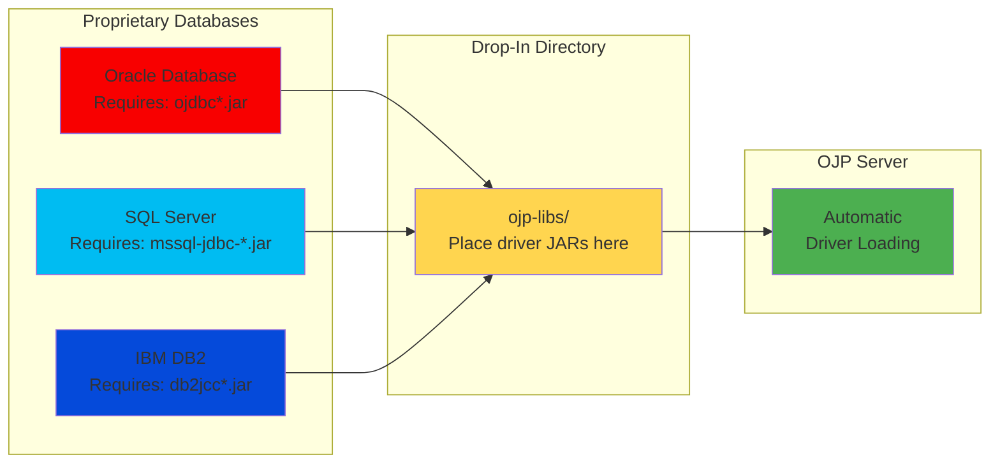
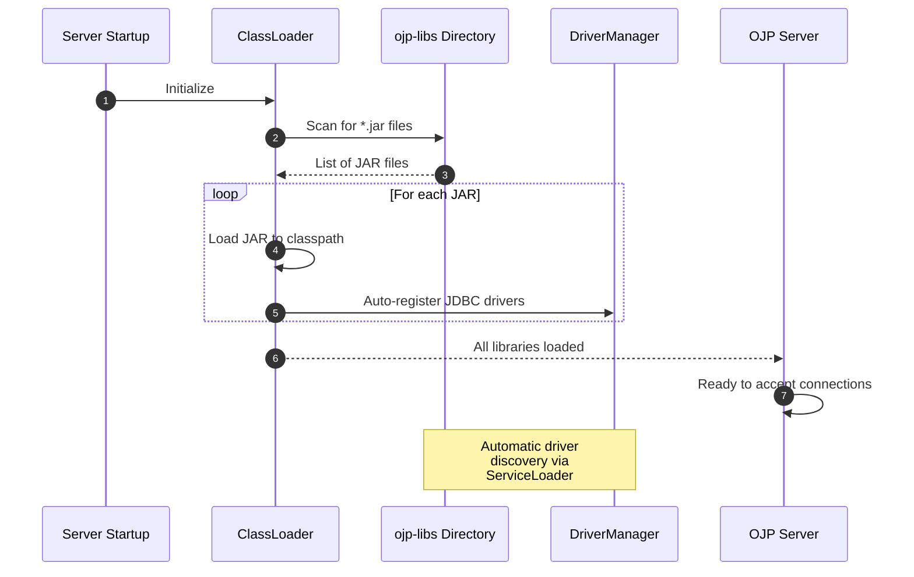

# Chapter 4: Database Driver Configuration

> **Chapter Overview**: Learn how to configure database drivers for OJP Server, from open-source databases included by default to adding proprietary database drivers. This chapter covers the flexible "drop-in" driver mechanism and provides practical examples for all major databases.

---

## 4.1 Open Source Drivers

OJP Server includes built-in support for popular open-source databases, making it "batteries included" for the most common use cases.

### Included Databases

**[IMAGE PROMPT 1]**: Create an infographic showing the four included open-source databases:
- H2 (with logo) - Embedded/file-based
- PostgreSQL (with logo) - Enterprise-grade
- MySQL (with logo) - Widely-used
- MariaDB (with logo) - MySQL-compatible
Show each with a checkmark indicating "included by default"
Use professional database vendor style with clean icons
Modern "batteries included" theme

```mermaid
graph TB
    subgraph "Open Source Drivers - Included"
    H2[H2 Database<br/>v2.3.232<br/>Embedded/File-based]
    PG[PostgreSQL<br/>v42.7.8<br/>Enterprise RDBMS]
    MY[MySQL<br/>v9.5.0<br/>Popular Open Source]
    MA[MariaDB<br/>v3.5.2<br/>MySQL Compatible]
    end
    
    subgraph "OJP Docker Image"
    DOCKER[Pre-installed<br/>Ready to Use]
    end
    
    H2 --> DOCKER
    PG --> DOCKER
    MY --> DOCKER
    MA --> DOCKER
    
    style H2 fill:#1e5b8e
    style PG fill:#336791
    style MY fill:#4479a1
    style MA fill:#003545
    style DOCKER fill:#4caf50
```



These drivers are:
These drivers come pre-installed in Docker images, making deployment instant. For runnable JAR deployments, they're automatically available through the download script. All drivers are tested and verified to work correctly with OJP, and they're kept up-to-date with the latest stable versions from Maven Central.

### Using Docker with Open Source Drivers

**[IMAGE PROMPT 2]**: Create a step-by-step visual guide showing:
Step 1: Docker pull command
Step 2: Docker run with included drivers
Step 3: Instant connection to any of the 4 databases
Step 4: Success indicator
Use terminal-style screenshots with highlights
Professional Docker quick start style

The simplest way to use OJP with open-source databases is Docker:

```bash
# Pull the latest OJP image (includes all 4 drivers)
docker pull rrobetti/ojp:0.3.1-beta

# Run OJP Server - ready for H2, PostgreSQL, MySQL, MariaDB
docker run -d \
  --name ojp-server \
  -p 1059:1059 \
  -p 9159:9159 \
  rrobetti/ojp:0.3.1-beta

# Check logs to verify driver loading
docker logs ojp-server | grep "driver"
# Expected: Lines showing H2, PostgreSQL, MySQL, MariaDB drivers loaded
```

**What's included**:

| Driver | Version | JAR Size | Use Case |
|--------|---------|----------|----------|
| H2 | 2.3.232 | ~2.6 MB | Development, testing, embedded |
| PostgreSQL | 42.7.8 | ~1.1 MB | Production PostgreSQL |
| MySQL | 9.5.0 | ~2.5 MB | Production MySQL 5.7+ |
| MariaDB | 3.5.2 | ~726 KB | Production MariaDB |

### Managing Drivers in Docker Deployments

The Docker image includes open-source drivers by default, but you have full flexibility to customize which drivers are loaded. This is the standard approach for using specific driver versions, adding proprietary drivers (Oracle, SQL Server, DB2), or optimizing the container for specific databases.

**Volume Mount Method** (recommended):

The Docker image loads all `.jar` files from `/opt/ojp/ojp-libs`. You can replace the bundled drivers by mounting your own directory:

```bash
# Step 1: Create directory with your desired drivers
mkdir my-drivers

# Step 2: Add specific driver versions (open-source or proprietary)
cp ~/Downloads/postgresql-42.6.0.jar my-drivers/
cp ~/Downloads/mysql-connector-j-8.0.33.jar my-drivers/

# For proprietary databases, add their drivers:
cp ~/Downloads/ojdbc11-23.5.0.23.jar my-drivers/          # Oracle
cp ~/Downloads/mssql-jdbc-12.8.1.jre11.jar my-drivers/    # SQL Server
cp ~/Downloads/db2jcc4.jar my-drivers/                     # IBM DB2

# Step 3: Mount your drivers directory
docker run -d \
  --name ojp-server \
  -p 1059:1059 \
  -p 9159:9159 \
  -v $(pwd)/my-drivers:/opt/ojp/ojp-libs \
  rrobetti/ojp:0.3.1-beta

# Step 4: Verify your drivers loaded
docker logs ojp-server | grep "driver"
# Expected: Only your specified drivers appear
```

**Key benefits**:
- Full control over which drivers are loaded
- Easy driver version updates without rebuilding images
- Standard method for adding proprietary database drivers
- Reduces memory footprint by loading only required drivers
- Maintains consistent driver versions across environments

**Common use cases**:
- **Proprietary databases**: Add Oracle, SQL Server, or DB2 drivers
- **Version control**: Use specific driver versions for compatibility
- **Legacy support**: Deploy older driver versions for legacy databases
- **Optimization**: Load only the drivers you actually use
- **Testing**: Try new driver versions before committing to production

**Alternative: Build Custom Image**:

For production deployments where you want to bake drivers into your container image permanently:

```dockerfile
FROM rrobetti/ojp:0.3.1-beta

# Remove bundled drivers
RUN rm -rf /opt/ojp/ojp-libs/*.jar

# Add your specific drivers (open-source or proprietary)
COPY drivers/*.jar /opt/ojp/ojp-libs/
```

```bash
# Build your custom image
docker build -t my-company/ojp:custom-drivers .

# Deploy with your driver configuration locked in
docker run -d -p 1059:1059 my-company/ojp:custom-drivers
```

This approach is ideal when you want to version and distribute a standardized OJP configuration with specific driver versions through your container registry.

### Automatic Driver Download (Runnable JAR)

**[IMAGE PROMPT 3]**: Create a visual showing the download-drivers.sh script in action:
Show script downloading from Maven Central
Progress indicators for each driver
Files appearing in ojp-libs directory
Success confirmation with checksums
Use terminal screenshot style with clear file operations
Professional script execution guide

For runnable JAR deployments, OJP provides a convenient script:

```bash
# Navigate to ojp-server directory
cd ojp-server

# Run the download script
bash download-drivers.sh

# Expected output:
# Downloading H2 driver...
# ✓ h2-2.3.232.jar downloaded (2.6 MB)
# Downloading PostgreSQL driver...
# ✓ postgresql-42.7.8.jar downloaded (1.1 MB)
# Downloading MySQL driver...
# ✓ mysql-connector-j-9.5.0.jar downloaded (2.5 MB)
# Downloading MariaDB driver...
# ✓ mariadb-java-client-3.5.2.jar downloaded (726 KB)
# All drivers downloaded successfully to ./ojp-libs
```

The script handles everything automatically. It downloads drivers from Maven Central (the official source), verifies each download to ensure integrity, places files in the correct location (`./ojp-libs`), and is idempotent so you can safely run it multiple times. The total download size is approximately 7 MB.

**Custom Download Location**:

```bash
# Download to custom directory
bash download-drivers.sh /opt/ojp/drivers

# Update server startup
java -Dojp.libs.path=/opt/ojp/drivers -jar ojp-server.jar
```

### Driver Verification

**[IMAGE PROMPT 4]**: Create a verification checklist infographic showing:
- Check files exist in ojp-libs
- Check file sizes match expected
- Check server logs for driver loading
- Test connection to each database type
Use checklist style with file icons and status indicators
Professional verification guide style

Verify drivers are available:

```bash
# Check downloaded files
ls -lh ojp-libs/

# Expected output:
# -rw-r--r-- 1 user group 2.6M  h2-2.3.232.jar
# -rw-r--r-- 1 user group 726K  mariadb-java-client-3.5.2.jar
# -rw-r--r-- 1 user group 2.5M  mysql-connector-j-9.5.0.jar
# -rw-r--r-- 1 user group 1.1M  postgresql-42.7.8.jar
```

**Test connections**:

```java
// H2 (embedded)
String h2Url = "jdbc:ojp[localhost:1059]_h2:~/testdb";

// PostgreSQL
String pgUrl = "jdbc:ojp[localhost:1059]_postgresql://localhost:5432/mydb";

// MySQL
String myUrl = "jdbc:ojp[localhost:1059]_mysql://localhost:3306/mydb";

// MariaDB
String maUrl = "jdbc:ojp[localhost:1059]_mariadb://localhost:3306/mydb";

// Each should connect successfully
try (Connection conn = DriverManager.getConnection(url, user, pass)) {
    System.out.println("✓ Connected: " + conn.getMetaData().getDatabaseProductName());
}
```

---

## 4.2 Proprietary Database Drivers

For Oracle, SQL Server, DB2, and other proprietary databases, you need to add drivers to the OJP Server.

### Supported Proprietary Databases

**[IMAGE PROMPT 5]**: Create a database support matrix infographic:
LEFT: Proprietary databases (Oracle, SQL Server, DB2) with logos
CENTER: "Add driver" arrow indicating manual step
RIGHT: OJP Server with support enabled
Include vendor download links
Professional enterprise database guide style



**Proprietary Driver Sources**:

| Database | Driver Name | Download Source |
|----------|-------------|-----------------|
| Oracle | ojdbc11.jar | [Oracle JDBC Downloads](https://www.oracle.com/database/technologies/jdbc-downloads.html) |
| SQL Server | mssql-jdbc-*.jar | [Microsoft JDBC Downloads](https://learn.microsoft.com/en-us/sql/connect/jdbc/download-microsoft-jdbc-driver-for-sql-server) |
| DB2 | db2jcc*.jar | IBM Support / DB2 installation |
| CockroachDB | postgresql-*.jar | Compatible with PostgreSQL driver (included!) |

### Oracle Database Setup

**[IMAGE PROMPT 6]**: Create a step-by-step Oracle setup guide:
Step 1: Download ojdbc11.jar from Oracle
Step 2: Place in ojp-libs directory
Step 3: (Optional) Add UCP jars for XA support
Step 4: Restart OJP Server
Step 5: Connect using Oracle JDBC URL
Use Oracle-themed colors and clear file operations
Professional Oracle DBA style guide

#### Basic Oracle Driver

Download the Oracle JDBC driver from Oracle's website:

```bash
# Download from Oracle (requires Oracle account)
# https://www.oracle.com/database/technologies/jdbc-downloads.html
# Choose: ojdbc11.jar for Java 11+

# Place in ojp-libs directory
cp ~/Downloads/ojdbc11.jar ./ojp-libs/

# Verify
ls -lh ojp-libs/ojdbc11.jar
# Expected: ~4-5 MB file
```

**Runnable JAR with Oracle**:

```bash
java -jar ojp-server-0.3.1-beta-shaded.jar
# Server will automatically load ojdbc11.jar from ./ojp-libs
```

**Docker with Oracle**:

```bash
# Create libs directory with Oracle driver
mkdir -p ./ojp-libs
cp ~/Downloads/ojdbc11.jar ./ojp-libs/

# Run with volume mount
docker run -d \
  --name ojp-server \
  -p 1059:1059 \
  -v $(pwd)/ojp-libs:/opt/ojp/ojp-libs \
  rrobetti/ojp:0.3.1-beta
```

#### Oracle with UCP (Optional - Advanced)

**[IMAGE PROMPT 7]**: Create a diagram showing Oracle UCP integration:
Show OJP Server → Oracle UCP → Oracle Database
Highlight XA transaction support
Include SPI implementation requirement
Use Oracle architecture diagram style
Professional Oracle advanced features guide

For XA transaction support or advanced Oracle features, add Oracle UCP (Universal Connection Pool):

```bash
# Download from Oracle (same page as JDBC driver)
# - ojdbc11.jar (required)
# - ucp.jar (Universal Connection Pool)
# - ons.jar (Oracle Notification Services)

# Place all in ojp-libs
cp ~/Downloads/ojdbc11.jar ./ojp-libs/
cp ~/Downloads/ucp.jar ./ojp-libs/
cp ~/Downloads/ons.jar ./ojp-libs/
```

**Important**: To use Oracle UCP with OJP, you must provide an implementation of the OJP SPI (Service Provider Interface). See Chapter 11 for details on implementing `XAConnectionPoolProvider` and/or `ConnectionPoolProvider`.

**Connect to Oracle**:

```java
// Standard Oracle connection
String url = "jdbc:ojp[localhost:1059]_oracle:thin:@localhost:1521/XEPDB1";
Connection conn = DriverManager.getConnection(url, "system", "oracle");

// Oracle with SID (instead of service name)
String sidUrl = "jdbc:ojp[localhost:1059]_oracle:thin:@localhost:1521:XE";

// Oracle RAC
String racUrl = "jdbc:ojp[localhost:1059]_oracle:thin:@" +
                "(DESCRIPTION=(ADDRESS_LIST=(ADDRESS=(PROTOCOL=TCP)" +
                "(HOST=rac1)(PORT=1521))(ADDRESS=(PROTOCOL=TCP)" +
                "(HOST=rac2)(PORT=1521)))(CONNECT_DATA=(SERVICE_NAME=racdb)))";
```

### SQL Server Setup

**[IMAGE PROMPT 8]**: Create a SQL Server setup guide:
Step 1: Download mssql-jdbc jar from Microsoft
Step 2: Place in ojp-libs directory
Step 3: Restart OJP Server
Step 4: Connect using SQL Server URL with options
Use SQL Server themed colors (blue)
Professional SQL Server DBA guide

Download and install the Microsoft JDBC driver:

```bash
# Download from Microsoft
# https://learn.microsoft.com/en-us/sql/connect/jdbc/download-microsoft-jdbc-driver-for-sql-server
# Choose: mssql-jdbc-12.6.1.jre11.jar (or latest)

# Place in ojp-libs
cp ~/Downloads/mssql-jdbc-12.6.1.jre11.jar ./ojp-libs/

# Verify
ls -lh ojp-libs/mssql-jdbc-*.jar
# Expected: ~1-2 MB file
```

**Connect to SQL Server**:

```java
// SQL Server with database name
String url = "jdbc:ojp[localhost:1059]_sqlserver://localhost:1433;" +
             "databaseName=mydb;encrypt=false";
Connection conn = DriverManager.getConnection(url, "sa", "YourPassword");

// SQL Server with instance name
String instanceUrl = "jdbc:ojp[localhost:1059]_sqlserver://localhost;" +
                     "instanceName=SQLEXPRESS;databaseName=mydb;encrypt=false";

// SQL Server with Windows authentication (requires additional setup)
String winAuthUrl = "jdbc:ojp[localhost:1059]_sqlserver://localhost:1433;" +
                    "databaseName=mydb;integratedSecurity=true";

// SQL Server with TLS encryption
String sslUrl = "jdbc:ojp[localhost:1059]_sqlserver://localhost:1433;" +
                "databaseName=mydb;encrypt=true;trustServerCertificate=false";
```

### DB2 Setup

**[IMAGE PROMPT 9]**: Create a DB2 setup guide:
Step 1: Locate db2jcc*.jar in DB2 installation or download from IBM
Step 2: Place in ojp-libs directory
Step 3: Optional license jar for specific features
Step 4: Restart and connect
Use IBM blue theme
Professional DB2 DBA guide

IBM DB2 drivers are typically found in your DB2 installation:

```bash
# Find DB2 driver in DB2 installation
# Common locations:
# Linux: /opt/ibm/db2/V11.5/java/db2jcc4.jar
# Windows: C:\Program Files\IBM\SQLLIB\java\db2jcc4.jar

# Copy to ojp-libs
cp /opt/ibm/db2/V11.5/java/db2jcc4.jar ./ojp-libs/

# Optional: DB2 license jar (for some features)
cp /opt/ibm/db2/V11.5/java/db2jcc_license_cu.jar ./ojp-libs/
```

**Connect to DB2**:

```java
// DB2 connection
String url = "jdbc:ojp[localhost:1059]_db2://localhost:50000/mydb";
Connection conn = DriverManager.getConnection(url, "db2admin", "password");

// DB2 with additional properties
String propsUrl = "jdbc:ojp[localhost:1059]_db2://localhost:50000/mydb:" +
                  "currentSchema=MYSCHEMA;";
```

### CockroachDB Setup

**[IMAGE PROMPT 10]**: Create an infographic showing CockroachDB compatibility:
Show CockroachDB logo with PostgreSQL driver
Indicate "wire-compatible" connection
Highlight that no additional driver needed
Use modern distributed database theme
Professional compatibility guide

Good news! CockroachDB uses the PostgreSQL wire protocol:

```java
// CockroachDB works with the included PostgreSQL driver!
String url = "jdbc:ojp[localhost:1059]_postgresql://localhost:26257/mydb?" +
             "sslmode=disable";
Connection conn = DriverManager.getConnection(url, "root", "");

// CockroachDB cluster
String clusterUrl = "jdbc:ojp[localhost:1059]_postgresql://" +
                    "node1:26257,node2:26257,node3:26257/mydb?" +
                    "sslmode=require&load_balance=true";
```

**No additional driver required** - the included PostgreSQL driver works out of the box!

---

## 4.3 Drop-In External Libraries

OJP provides a flexible mechanism for adding any JAR file to the server classpath.

### How It Works

**[IMAGE PROMPT 11]**: Create an architecture diagram showing:
- ojp-libs directory on filesystem
- OJP Server ClassLoader scanning directory
- All JARs loaded at startup
- Drivers registered with DriverManager
- Additional libraries available to OJP
Use technical architecture style with class loading visualization
Professional Java ClassLoader guide



**Key Features**:
1. **Automatic Discovery**: All `.jar` files in the directory are loaded
2. **ServiceLoader Integration**: JDBC drivers self-register automatically
3. **No Recompilation**: Add drivers without rebuilding OJP
4. **Additional Libraries**: Include connection pools, monitoring tools, etc.

### Understanding the ojp-libs Directory

**Directory Structure**:

```
ojp-libs/
├── h2-2.3.232.jar                      # H2 database driver
├── postgresql-42.7.8.jar               # PostgreSQL driver
├── mysql-connector-j-9.5.0.jar         # MySQL driver
├── mariadb-java-client-3.5.2.jar       # MariaDB driver
├── ojdbc11.jar                         # Oracle driver (if added)
├── ucp.jar                             # Oracle UCP (if added)
├── ons.jar                             # Oracle ONS (if added)
├── mssql-jdbc-12.6.1.jre11.jar        # SQL Server (if added)
└── custom-library.jar                  # Any additional JARs
```

**Location Configuration**:

| Deployment Method | Default Location | Custom Configuration |
|-------------------|------------------|----------------------|
| Docker | `/opt/ojp/ojp-libs` | Volume mount |
| Runnable JAR | `./ojp-libs` | `-Dojp.libs.path=/custom/path` |
| Built from source | `ojp-server/ojp-libs` | System property |

### Adding Custom Libraries

**[IMAGE PROMPT 12]**: Create a use case diagram showing different types of libraries:
- JDBC Drivers (database connectivity)
- Connection Pools (Oracle UCP, HikariCP variants)
- Monitoring/Telemetry (custom exporters)
- Security Libraries (encryption, authentication)
Show each category with example JARs
Professional library management guide

Beyond JDBC drivers, you can add:

**Oracle UCP (Universal Connection Pool)**:
```bash
# For advanced Oracle connection pooling
cp ~/Downloads/ucp.jar ./ojp-libs/
cp ~/Downloads/ons.jar ./ojp-libs/
```

**Custom Monitoring Libraries**:
```bash
# Add custom metric exporters or monitoring tools
cp custom-metrics-1.0.jar ./ojp-libs/
```

**Security/Encryption Libraries**:
```bash
# Add security providers or encryption libraries
cp bouncycastle-provider-1.70.jar ./ojp-libs/
```

**Example**: Adding Multiple Libraries

```bash
# Create libs directory
mkdir -p ./ojp-libs

# Add multiple database drivers
cp ~/drivers/ojdbc11.jar ./ojp-libs/
cp ~/drivers/mssql-jdbc-12.6.1.jre11.jar ./ojp-libs/
cp ~/drivers/db2jcc4.jar ./ojp-libs/

# Add Oracle UCP for XA support
cp ~/oracle/ucp.jar ./ojp-libs/
cp ~/oracle/ons.jar ./ojp-libs/

# Add custom monitoring
cp ~/custom/my-monitor.jar ./ojp-libs/

# Verify
ls -lh ./ojp-libs/
# All JARs will be loaded automatically
```

### Configuration Options

**System Property**:

```bash
# Specify custom directory location
java -Dojp.libs.path=/opt/ojp/drivers \
     -jar ojp-server.jar
```

**Environment Variable**:

```bash
# Alternative: use environment variable
export OJP_LIBS_PATH=/opt/ojp/drivers
java -jar ojp-server.jar
```

**Docker Volume Mount**:

```bash
# Mount external directory
docker run -d \
  -v /host/path/to/libs:/opt/ojp/ojp-libs \
  rrobetti/ojp:0.3.1-beta
```

**Kubernetes ConfigMap** (for small JARs):

```yaml
apiVersion: v1
kind: ConfigMap
metadata:
  name: ojp-drivers
  namespace: ojp
binaryData:
  custom-driver.jar: <base64-encoded-jar-content>
```

---

## 4.4 Testing Database Connections

Verify your database driver configuration with these testing strategies.

### Local Database Testing

**[IMAGE PROMPT 13]**: Create a testing workflow diagram:
Step 1: Start local database (Docker/Native)
Step 2: Start OJP Server with drivers
Step 3: Test connection from application
Step 4: Verify in OJP logs
Step 5: Check metrics
Use flowchart style with success/failure paths
Professional testing guide

#### H2 Database (Embedded)

**[IMAGE PROMPT 14]**: Create a quick H2 testing guide:
Show H2 in-memory and file-based modes
Include console access instructions
Display connection success indicators
Use development/testing theme
Professional H2 guide

Perfect for development and testing:

```bash
# No separate database needed!
# H2 driver is included

# File-based H2 database
String url = "jdbc:ojp[localhost:1059]_h2:~/testdb";

# In-memory H2 database
String memUrl = "jdbc:ojp[localhost:1059]_h2:mem:testdb";

// Test connection
try (Connection conn = DriverManager.getConnection(url, "sa", "")) {
    try (Statement stmt = conn.createStatement()) {
        stmt.executeUpdate("CREATE TABLE test (id INT, name VARCHAR(100))");
        stmt.executeUpdate("INSERT INTO test VALUES (1, 'Hello OJP')");
        
        ResultSet rs = stmt.executeQuery("SELECT * FROM test");
        while (rs.next()) {
            System.out.println("✓ H2 works: " + rs.getString("name"));
        }
    }
}
```

#### PostgreSQL with Docker

```bash
# Start PostgreSQL
docker run -d \
  --name postgres \
  -e POSTGRES_PASSWORD=postgres \
  -e POSTGRES_DB=testdb \
  -p 5432:5432 \
  postgres:15

# Test connection through OJP
String url = "jdbc:ojp[localhost:1059]_postgresql://localhost:5432/testdb";
Connection conn = DriverManager.getConnection(url, "postgres", "postgres");
```

#### MySQL with Docker

```bash
# Start MySQL
docker run -d \
  --name mysql \
  -e MYSQL_ROOT_PASSWORD=mysql \
  -e MYSQL_DATABASE=testdb \
  -p 3306:3306 \
  mysql:8

# Test connection through OJP
String url = "jdbc:ojp[localhost:1059]_mysql://localhost:3306/testdb";
Connection conn = DriverManager.getConnection(url, "root", "mysql");
```

### Docker Compose for Multi-Database Testing

**[IMAGE PROMPT 15]**: Create a Docker Compose architecture diagram:
Show OJP Server container + multiple database containers
All connected on same network
Clear port mappings and service names
Use Docker Compose visualization style
Professional multi-container setup guide

Create `docker-compose.yml`:

```yaml
version: '3.8'

services:
  ojp-server:
    image: rrobetti/ojp:0.3.1-beta
    ports:
      - "1059:1059"
      - "9159:9159"
    networks:
      - ojp-network
  
  postgres:
    image: postgres:15
    environment:
      POSTGRES_PASSWORD: postgres
      POSTGRES_DB: testdb
    ports:
      - "5432:5432"
    networks:
      - ojp-network
  
  mysql:
    image: mysql:8
    environment:
      MYSQL_ROOT_PASSWORD: mysql
      MYSQL_DATABASE: testdb
    ports:
      - "3306:3306"
    networks:
      - ojp-network
  
  mariadb:
    image: mariadb:10
    environment:
      MARIADB_ROOT_PASSWORD: mariadb
      MARIADB_DATABASE: testdb
    ports:
      - "3307:3306"
    networks:
      - ojp-network

networks:
  ojp-network:
    driver: bridge
```

**Start all services**:

```bash
docker-compose up -d

# Test each database
String pgUrl = "jdbc:ojp[localhost:1059]_postgresql://postgres:5432/testdb";
String myUrl = "jdbc:ojp[localhost:1059]_mysql://mysql:3306/testdb";
String maUrl = "jdbc:ojp[localhost:1059]_mariadb://mariadb:3306/testdb";
```

### Testcontainers Integration

**[IMAGE PROMPT 16]**: Create a Testcontainers workflow diagram:
Show: JUnit test → Testcontainers starts DB → OJP connects → Test runs → Cleanup
Include code snippets and Docker icons
Use testing framework style
Professional integration testing guide

For automated testing with JUnit:

```java
import org.junit.jupiter.api.Test;
import org.testcontainers.containers.PostgreSQLContainer;
import org.testcontainers.junit.jupiter.Container;
import org.testcontainers.junit.jupiter.Testcontainers;

@Testcontainers
public class OjpPostgreSQLTest {
    
    @Container
    public static PostgreSQLContainer<?> postgres = 
        new PostgreSQLContainer<>("postgres:15")
            .withDatabaseName("testdb")
            .withUsername("test")
            .withPassword("test");
    
    @Test
    public void testOjpWithPostgreSQL() throws SQLException {
        // OJP Server should be running on localhost:1059
        String ojpUrl = String.format(
            "jdbc:ojp[localhost:1059]_postgresql://%s:%d/%s",
            postgres.getHost(),
            postgres.getFirstMappedPort(),
            postgres.getDatabaseName()
        );
        
        try (Connection conn = DriverManager.getConnection(
                ojpUrl, 
                postgres.getUsername(), 
                postgres.getPassword())) {
            
            // Run your tests
            assertNotNull(conn);
            assertFalse(conn.isClosed());
        }
    }
}
```

### Verifying Driver Loading

**Check OJP Server logs**:

```bash
# Docker
docker logs ojp-server | grep -i "driver"

# Runnable JAR
cat ojp-server.log | grep -i "driver"
```

**Expected log entries**:

```
[main] INFO - Loading external libraries from: /opt/ojp/ojp-libs
[main] INFO - Found JDBC driver: org.h2.Driver
[main] INFO - Found JDBC driver: org.postgresql.Driver
[main] INFO - Found JDBC driver: com.mysql.cj.jdbc.Driver
[main] INFO - Found JDBC driver: org.mariadb.jdbc.Driver
[main] INFO - Found JDBC driver: oracle.jdbc.OracleDriver
[main] INFO - All drivers loaded successfully
```

### Connection Test Utility

**[IMAGE PROMPT 17]**: Create a visual test utility interface mockup:
Show input fields for database type, host, port, credentials
Test button
Success/failure results with connection details
Use UI mockup style
Professional testing tool interface

Create a simple test utility:

```java
public class OjpDriverTest {
    
    public static void main(String[] args) {
        testDatabase("H2", "jdbc:ojp[localhost:1059]_h2:~/test", "sa", "");
        testDatabase("PostgreSQL", "jdbc:ojp[localhost:1059]_postgresql://localhost:5432/testdb", "postgres", "postgres");
        testDatabase("MySQL", "jdbc:ojp[localhost:1059]_mysql://localhost:3306/testdb", "root", "mysql");
        testDatabase("MariaDB", "jdbc:ojp[localhost:1059]_mariadb://localhost:3307/testdb", "root", "mariadb");
    }
    
    private static void testDatabase(String name, String url, String user, String pass) {
        try (Connection conn = DriverManager.getConnection(url, user, pass)) {
            DatabaseMetaData meta = conn.getMetaData();
            System.out.printf("✓ %s: Connected to %s %s%n", 
                name, 
                meta.getDatabaseProductName(), 
                meta.getDatabaseProductVersion());
        } catch (SQLException e) {
            System.out.printf("✗ %s: Failed - %s%n", name, e.getMessage());
        }
    }
}
```

---

## Summary

You now have complete knowledge of database driver configuration for OJP:

✅ **Open Source Drivers**: H2, PostgreSQL, MySQL, MariaDB included by default  
✅ **Proprietary Drivers**: Oracle, SQL Server, DB2 via drop-in mechanism  
✅ **Flexible Loading**: ojp-libs directory with automatic discovery  
✅ **Testing Strategies**: Docker Compose, Testcontainers, manual verification  

**Key Takeaways**:
- Docker images are "batteries included" for open-source databases
- Use `download-drivers.sh` for runnable JAR deployments
- Add proprietary drivers by placing JARs in `ojp-libs` directory
- No recompilation needed - drivers loaded automatically at startup
- Test your setup with simple connection tests

In the next chapter, we'll explore JDBC driver configuration on the client side, including connection pool settings and multi-datasource support.

---

**Previous Chapter**: [← Chapter 3a: Kubernetes Deployment with Helm](part1-chapter3a-kubernetes-helm.md)  
**Next Chapter**: [Chapter 5: OJP JDBC Driver Configuration →](part2-chapter5-jdbc-configuration.md)
