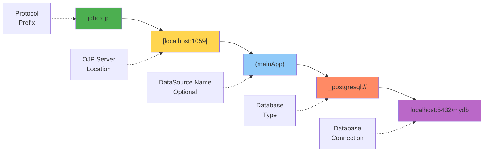
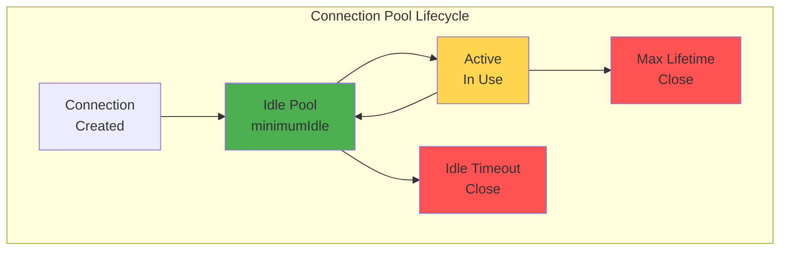
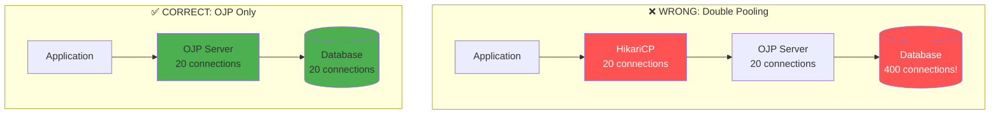

# Chapter 5: OJP JDBC Driver Configuration

> **Chapter Overview**: Configure the OJP JDBC driver on the client side with connection pool settings, multi-datasource support, and framework integration. This chapter covers advanced configuration patterns that optimize performance for different application workloads.

---

## 5.1 JDBC URL Format

The OJP JDBC URL follows a specific format that wraps your existing database JDBC URL.

### URL Structure

**[IMAGE PROMPT 1]**: Create a detailed URL anatomy diagram:
Break down the OJP URL into components with labels and examples:
- Protocol prefix (jdbc:ojp)
- Server location [host:port]
- Optional datasource name (datasourceName)
- Separator (_)
- Original JDBC URL (database-specific)
Use color coding for each component
Professional URL specification guide style



**Basic Format**:
```
jdbc:ojp[server-host:server-port]_original-jdbc-url
```

**With DataSource Name**:
```
jdbc:ojp[server-host:server-port(datasource-name)]_original-jdbc-url
```

### URL Components Explained

| Component | Description | Example | Required |
|-----------|-------------|---------|----------|
| `jdbc:ojp` | OJP protocol prefix | `jdbc:ojp` | Yes |
| `[host:port]` | OJP Server location | `[localhost:1059]` | Yes |
| `(datasource)` | Named datasource | `(mainApp)` | No |
| `_` | Separator | `_` | Yes |
| Original URL | Database JDBC URL | `postgresql://...` | Yes |

### Multi-Database Examples

**[IMAGE PROMPT 2]**: Create a reference card showing URL examples for all major databases:
PostgreSQL, MySQL, MariaDB, H2, Oracle, SQL Server, DB2
Show both before and after OJP URL format
Use database vendor colors and logos
Professional quick reference card style

**PostgreSQL**:
```java
// Before OJP
String before = "jdbc:postgresql://localhost:5432/mydb";

// After OJP
String after = "jdbc:ojp[localhost:1059]_postgresql://localhost:5432/mydb";

// With datasource name
String named = "jdbc:ojp[localhost:1059(mainApp)]_postgresql://localhost:5432/mydb";

// With connection parameters (including SSL)
String params = "jdbc:ojp[localhost:1059]_postgresql://localhost:5432/mydb?" +
                "ssl=true&sslfactory=org.postgresql.ssl.NonValidatingFactory";
// For SSL configuration details between OJP and database, see Chapter 6 Security section
```

**MySQL**:
```java
// Standard MySQL
String mysql = "jdbc:ojp[localhost:1059]_mysql://localhost:3306/mydb";

// With timezone
String tz = "jdbc:ojp[localhost:1059]_mysql://localhost:3306/mydb?" +
            "serverTimezone=UTC";

// With charset
String charset = "jdbc:ojp[localhost:1059]_mysql://localhost:3306/mydb?" +
                 "useUnicode=true&characterEncoding=utf8";
```

**Oracle**:
```java
// Thin connection with service name
String service = "jdbc:ojp[localhost:1059]_oracle:thin:@localhost:1521/XEPDB1";

// Thin connection with SID
String sid = "jdbc:ojp[localhost:1059]_oracle:thin:@localhost:1521:XE";

// TNS Names
String tns = "jdbc:ojp[localhost:1059]_oracle:thin:@PROD_DB";

// Oracle RAC
String rac = "jdbc:ojp[localhost:1059]_oracle:thin:@" +
             "(DESCRIPTION=" +
             "(ADDRESS_LIST=" +
             "(ADDRESS=(PROTOCOL=TCP)(HOST=rac1)(PORT=1521))" +
             "(ADDRESS=(PROTOCOL=TCP)(HOST=rac2)(PORT=1521)))" +
             "(CONNECT_DATA=(SERVICE_NAME=racdb)))";
```

**SQL Server**:
```java
// With database name
String db = "jdbc:ojp[localhost:1059]_sqlserver://localhost:1433;" +
            "databaseName=mydb;encrypt=false";

// With instance
String instance = "jdbc:ojp[localhost:1059]_sqlserver://localhost;" +
                  "instanceName=SQLEXPRESS;databaseName=mydb";

// Windows authentication
String winAuth = "jdbc:ojp[localhost:1059]_sqlserver://localhost:1433;" +
                 "databaseName=mydb;integratedSecurity=true";
```

**H2**:
```java
// File-based
String file = "jdbc:ojp[localhost:1059]_h2:~/testdb";

// In-memory
String mem = "jdbc:ojp[localhost:1059]_h2:mem:testdb";

// With options
String opts = "jdbc:ojp[localhost:1059]_h2:~/testdb;AUTO_SERVER=TRUE";
```

### Connection Parameters

**[IMAGE PROMPT 3]**: Create an infographic showing how parameters are passed through:
Application → OJP URL with params → OJP Server → Database with params
Highlight that database-specific parameters are preserved
Use data flow diagram style
Professional parameter handling guide

Database-specific parameters are passed through to the underlying database:

```java
// PostgreSQL with SSL
String pgSsl = "jdbc:ojp[localhost:1059]_postgresql://localhost:5432/mydb?" +
               "ssl=true&sslmode=require&sslcert=/path/to/cert.pem";

// MySQL with connection options
String myOpts = "jdbc:ojp[localhost:1059]_mysql://localhost:3306/mydb?" +
                "useSSL=true&requireSSL=true&" +
                "serverTimezone=UTC&" +
                "maxAllowedPacket=1048576";

// Oracle with connection properties
String orOpts = "jdbc:ojp[localhost:1059]_oracle:thin:@localhost:1521/XEPDB1?" +
                "oracle.net.encryption_client=REQUIRED&" +
                "oracle.net.encryption_types_client=(AES256)";
```

**Key Point**: OJP passes all database-specific parameters directly to the underlying driver. Configure SSL, timeouts, and other database settings as you normally would.

---

## 5.2 Connection Pool Settings

OJP Server supports multiple connection pool implementations:
- **HikariCP** (default for non-XA connections) - High-performance JDBC connection pool
- **Apache DBCP** (alternative for non-XA connections) - Traditional pooling implementation  
- **Custom XA Implementation** (for XA transactions) - Uses Apache Commons Pool 2 for backend session pooling (see Chapter 10 for details)

These pools run on the OJP Server side, but you configure them from the client side via the `ojp.properties` file in your application. This allows you to tune the server-side connection pool behavior without modifying server configuration files. For XA-specific pooling architecture, refer to Chapter 10 which explains the dual-condition lifecycle and backend session management.

### Configuration File Location

**[IMAGE PROMPT 4]**: Create a file location diagram showing:
- Classpath root (src/main/resources)
- ojp.properties file
- Application loading configuration
- Multiple datasource configs in one file
Use file system and classpath visualization
Professional configuration management guide

The `ojp.properties` file should be placed in your application's classpath root:

```
src/
└── main/
    └── resources/
        └── ojp.properties   ← Place here
```

**Alternative locations**:
- JAR root: `/ojp.properties` (inside the JAR)
- Working directory: `./ojp.properties` (for quick testing)
- Custom location: Use system property `-Dojp.config.file=/path/to/ojp.properties`

### Basic Configuration

**[IMAGE PROMPT 5]**: Create a configuration example showing:
Default datasource configuration with common settings
Side annotations explaining each property
Use code editor style with syntax highlighting
Professional configuration guide

**Example `ojp.properties`**:

```properties
# Default DataSource Configuration (backward compatible)
# These settings apply when no datasource name is specified in the URL

# Maximum pool size - max concurrent connections
ojp.connection.pool.maximumPoolSize=20

# Minimum idle connections - kept ready for use
ojp.connection.pool.minimumIdle=5

# Connection timeout - max wait for connection (milliseconds)
ojp.connection.pool.connectionTimeout=30000

# Idle timeout - close unused connections after this time (milliseconds)
ojp.connection.pool.idleTimeout=600000

# Max lifetime - maximum time a connection can exist (milliseconds)
ojp.connection.pool.maxLifetime=1800000

# Connection test query (optional, auto-detected if not set)
ojp.connection.pool.connectionTestQuery=SELECT 1

# Leak detection threshold - warn if connection held too long (milliseconds)
ojp.connection.pool.leakDetectionThreshold=60000
```

### Configuration Reference

**[IMAGE PROMPT 6]**: Create a comprehensive configuration reference table:
Show all HikariCP properties with:
- Property name
- Default value
- Recommended range
- Use case
Use table/matrix format
Professional reference documentation style



**Complete Property Reference**:

| Property | Type | Default | Description |
|----------|------|---------|-------------|
| `maximumPoolSize` | int | 10 | Maximum number of connections in pool |
| `minimumIdle` | int | same as max | Minimum number of idle connections |
| `connectionTimeout` | long | 30000 | Max wait for connection (ms) |
| `idleTimeout` | long | 600000 | Max idle time before close (ms) |
| `maxLifetime` | long | 1800000 | Max connection lifetime (ms) |
| `connectionTestQuery` | String | null | Query to test connection validity |
| `initializationFailTimeout` | long | 1 | Timeout for pool initialization (ms) |
| `leakDetectionThreshold` | long | 0 | Connection leak detection (ms, 0=off) |
| `validationTimeout` | long | 5000 | Max time for connection validation (ms) |
| `keepaliveTime` | long | 0 | Keepalive interval (ms, 0=off) |

### Pool Sizing Guidelines

**[IMAGE PROMPT 7]**: Create an infographic showing pool sizing recommendations:
Show relationship between: # of CPU cores, concurrent requests, optimal pool size
Include formulas and examples for different workloads
Use charts and calculations
Professional capacity planning guide

**Sizing Formula** (General Guidance):

The most well-known pool sizing guidance comes from Brett Wooldridge (creator of HikariCP) and the PostgreSQL wiki:
```
Pool Size = (number of CPU cores × 2) + effective spindle count
```

For application-centric sizing based on concurrent thread load, an alternative formula is:
```
Pool Size = (Tn × (Cm - 1)) + 1

Where:
Tn = Number of threads making requests
Cm = Connection multiplier (1.5-2.0 for most workloads)
```

**Important**: These formulas are provided as general guidance only. Real-world pool sizing depends heavily on your specific workload characteristics, query execution times, transaction patterns, database capabilities, and hardware resources. Start with these recommendations, then adjust based on monitoring data, connection wait times, and actual usage patterns. Always load test with your specific workload before deploying to production.

**Recommendations by Workload**:

| Application Type | Concurrent Requests | Suggested Pool Size |
|------------------|---------------------|---------------------|
| Microservice (lightweight) | 10-20 | 5-10 |
| Web Application | 50-100 | 20-30 |
| API Server | 100-500 | 30-50 |
| Batch Processing | Variable | 10-20 |
| Real-time Analytics | High | 50-100 |

**Example Configurations**:

```properties
# Microservice - Light load
ojp.connection.pool.maximumPoolSize=10
ojp.connection.pool.minimumIdle=3
ojp.connection.pool.connectionTimeout=20000

# Web Application - Medium load  
ojp.connection.pool.maximumPoolSize=25
ojp.connection.pool.minimumIdle=10
ojp.connection.pool.connectionTimeout=30000

# High-traffic API - Heavy load
ojp.connection.pool.maximumPoolSize=50
ojp.connection.pool.minimumIdle=20
ojp.connection.pool.connectionTimeout=40000
ojp.connection.pool.idleTimeout=300000
```

---

## 5.3 Client-Side Configuration

Configure OJP client behavior for specific application needs.

### Properties File Setup

**Full configuration example**:

```properties
# ============================================
# OJP Client Configuration
# ============================================

# Default DataSource Pool Configuration
ojp.connection.pool.maximumPoolSize=20
ojp.connection.pool.minimumIdle=5
ojp.connection.pool.connectionTimeout=30000
ojp.connection.pool.idleTimeout=600000
ojp.connection.pool.maxLifetime=1800000
ojp.connection.pool.leakDetectionThreshold=60000

# gRPC Configuration
ojp.grpc.maxInboundMessageSize=16777216  # 16 MB

# Connection retry settings
ojp.connection.retry.maxAttempts=3
ojp.connection.retry.backoffMs=1000
```

### Programmatic Configuration

**[IMAGE PROMPT 8]**: Create a code example showing:
Programmatic configuration via Properties object
Setting properties before getting connection
Use IDE/code style with syntax highlighting
Professional Java configuration guide

For applications that need dynamic configuration:

```java
import java.sql.*;
import java.util.Properties;

public class OjpProgrammaticConfig {
    
    public static Connection getConfiguredConnection() throws SQLException {
        String url = "jdbc:ojp[localhost:1059]_postgresql://localhost:5432/mydb";
        
        // Create properties
        Properties props = new Properties();
        props.setProperty("user", "myuser");
        props.setProperty("password", "mypassword");
        
        // OJP-specific properties (optional)
        props.setProperty("ojp.connection.pool.maximumPoolSize", "30");
        props.setProperty("ojp.connection.pool.minimumIdle", "10");
        props.setProperty("ojp.connection.pool.connectionTimeout", "25000");
        
        // Database-specific properties
        props.setProperty("ssl", "true");
        props.setProperty("sslfactory", "org.postgresql.ssl.NonValidatingFactory");
        
        return DriverManager.getConnection(url, props);
    }
    
    public static void main(String[] args) throws SQLException {
        try (Connection conn = getConfiguredConnection()) {
            DatabaseMetaData meta = conn.getMetaData();
            System.out.println("Connected to: " + meta.getDatabaseProductName());
        }
    }
}
```

### Environment-Specific Settings

**[IMAGE PROMPT 9]**: Create a multi-environment configuration diagram:
Show Development, Testing, Production environments
Each with different pool sizes and timeouts
Use environment-specific color coding
Professional multi-environment guide

**Development Environment**:
```properties
# dev-ojp.properties - Small pools, verbose logging
ojp.connection.pool.maximumPoolSize=5
ojp.connection.pool.minimumIdle=2
ojp.connection.pool.connectionTimeout=10000
ojp.connection.pool.leakDetectionThreshold=30000  # Aggressive leak detection
```

**Testing Environment**:
```properties
# test-ojp.properties - Medium pools, moderate timeouts
ojp.connection.pool.maximumPoolSize=15
ojp.connection.pool.minimumIdle=5
ojp.connection.pool.connectionTimeout=20000
ojp.connection.pool.idleTimeout=300000
```

**Production Environment**:
```properties
# prod-ojp.properties - Large pools, production-grade settings
ojp.connection.pool.maximumPoolSize=50
ojp.connection.pool.minimumIdle=20
ojp.connection.pool.connectionTimeout=30000
ojp.connection.pool.idleTimeout=600000
ojp.connection.pool.maxLifetime=1800000
ojp.connection.pool.keepaliveTime=300000  # 5 minutes
```

**Load configuration by environment**:

```java
public class ConfigLoader {
    public static void loadConfig() {
        String env = System.getenv("ENVIRONMENT");  // dev, test, prod
        String configFile = String.format("ojp-%s.properties", env);
        
        System.setProperty("ojp.config.file", 
            ConfigLoader.class.getClassLoader()
                .getResource(configFile).getPath());
    }
}
```

---

## 5.4 Framework Integration Best Practices

Integrate OJP with popular Java frameworks while avoiding common pitfalls.

### Disabling Application-Level Pooling

**[IMAGE PROMPT 10]**: Create a "do's and don'ts" infographic:
DON'T: Application pool + OJP pool (double pooling)
DO: Direct connection + OJP pool
Show resource waste in double pooling scenario
Use warning icons and clear visual contrast
Professional best practices guide

**Critical Rule**: ⚠️ **Disable all application-level connection pooling when using OJP**



Double pooling creates several serious problems. It wastes connections through multiplication—N applications times M pool size times P OJP pool size equals N×M×P database connections, far more than needed. This defeats OJP's core purpose of providing centralized connection control. Resource exhaustion becomes inevitable as database connection limits are reached quickly. Finally, performance degrades because multiple pool layers add unnecessary overhead at each level.

### Spring Boot Integration

Spring Boot integration with OJP requires disabling the framework's built-in connection pooling to avoid double-pooling issues. The key concepts and patterns are covered briefly below, but for detailed examples, complete configuration options, and troubleshooting guidance, see **Chapter 7: Framework Integration**.

**Quick Reference**:
```yaml
spring:
  datasource:
    url: jdbc:ojp[localhost:1059]_postgresql://localhost:5432/mydb
    username: myuser
    password: mypassword
    driver-class-name: org.openjproxy.jdbc.Driver
    # Disable HikariCP - see Chapter 7 for details
```

**See Chapter 7** for complete Spring Boot integration including:
- Full configuration examples for Spring Boot 2.x and 3.x
- SLF4J logging conflict resolution
- Transaction management patterns
- Testing strategies

**Better approach - Custom DataSource**:

```java
import org.springframework.context.annotation.Bean;
import org.springframework.context.annotation.Configuration;
import javax.sql.DataSource;
import org.springframework.jdbc.datasource.DriverManagerDataSource;

@Configuration
public class DataSourceConfig {
    
    @Bean
    public DataSource dataSource() {
        // Use simple DataSource without pooling
        DriverManagerDataSource dataSource = new DriverManagerDataSource();
        dataSource.setDriverClassName("org.openjproxy.jdbc.Driver");
        dataSource.setUrl("jdbc:ojp[localhost:1059]_postgresql://localhost:5432/mydb");
        dataSource.setUsername("myuser");
        dataSource.setPassword("mypassword");
        
        return dataSource;
    }
}
```


### Quarkus and Micronaut Integration

Both Quarkus and Micronaut also require special configuration to avoid double-pooling. Each framework has specific patterns for disabling built-in connection pooling and integrating with OJP.

**See Chapter 7** for complete framework integration coverage:
- **Quarkus**: Unpooled mode configuration, native compilation considerations, dev mode setup
- **Micronaut**: Custom DataSource factory patterns, AOP considerations
- **Comparison**: Framework-specific trade-offs and best practices

---

### Transaction Management

**[IMAGE PROMPT 12]**: Create a transaction flow diagram:
Show: Application → Transaction Manager → OJP Connection → Database
Highlight that standard JTA/JDBC transactions work normally
Use transaction sequence diagram style
Professional transaction management guide

OJP fully supports standard JDBC transactions:

```java
import org.springframework.transaction.annotation.Transactional;
import org.springframework.stereotype.Service;

@Service
public class UserService {
    
    private final JdbcTemplate jdbcTemplate;
    
    // Spring's @Transactional works normally with OJP
    @Transactional
    public void transferFunds(int fromAccount, int toAccount, double amount) {
        // Both operations in same transaction
        jdbcTemplate.update(
            "UPDATE accounts SET balance = balance - ? WHERE id = ?",
            amount, fromAccount
        );
        
        jdbcTemplate.update(
            "UPDATE accounts SET balance = balance + ? WHERE id = ?",
            amount, toAccount
        );
        
        // Transaction commits automatically (or rolls back on exception)
    }
    
    // Manual transaction management also works
    public void manualTransaction() throws SQLException {
        String url = "jdbc:ojp[localhost:1059]_postgresql://localhost:5432/mydb";
        
        try (Connection conn = DriverManager.getConnection(url, "user", "pass")) {
            conn.setAutoCommit(false);  // Start transaction
            
            try (Statement stmt = conn.createStatement()) {
                stmt.executeUpdate("UPDATE accounts SET balance = balance - 100 WHERE id = 1");
                stmt.executeUpdate("UPDATE accounts SET balance = balance + 100 WHERE id = 2");
                
                conn.commit();  // Commit transaction
                System.out.println("Transaction committed");
            } catch (SQLException e) {
                conn.rollback();  // Rollback on error
                System.out.println("Transaction rolled back");
                throw e;
            }
        }
    }
}
```

**Transaction Isolation Levels**:

```java
// Set isolation level (works with OJP)
connection.setTransactionIsolation(Connection.TRANSACTION_READ_COMMITTED);
connection.setTransactionIsolation(Connection.TRANSACTION_REPEATABLE_READ);
connection.setTransactionIsolation(Connection.TRANSACTION_SERIALIZABLE);
```

---

## Summary

You now have comprehensive knowledge of OJP JDBC driver configuration:

✅ **URL Format**: Understand OJP URL structure and multi-database examples  
✅ **Pool Settings**: Configure HikariCP properties via `ojp.properties`  
✅ **Client Configuration**: Set up environment-specific and programmatic configs  
✅ **Framework Integration**: Properly integrate with Spring Boot, Quarkus, Micronaut  

**Key Takeaways**:
- OJP URL wraps your existing database JDBC URL
- Configure connection pools via `ojp.properties` in classpath
- **Always disable application-level connection pooling**
- Standard JDBC transactions work seamlessly with OJP
- Framework-specific configuration differs but principle remains: no double pooling

In the next chapter, we'll explore OJP Server configuration, covering advanced settings for security, performance, and resilience.

---

**Previous Chapter**: [← Chapter 4: Database Driver Configuration](part2-chapter4-database-drivers.md)  
**Next Chapter**: [Chapter 6: OJP Server Configuration →](part2-chapter6-server-configuration.md)
