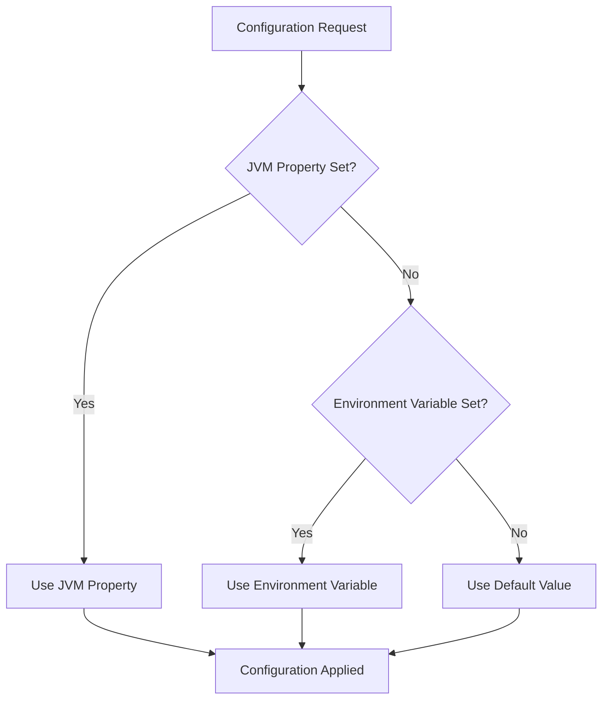
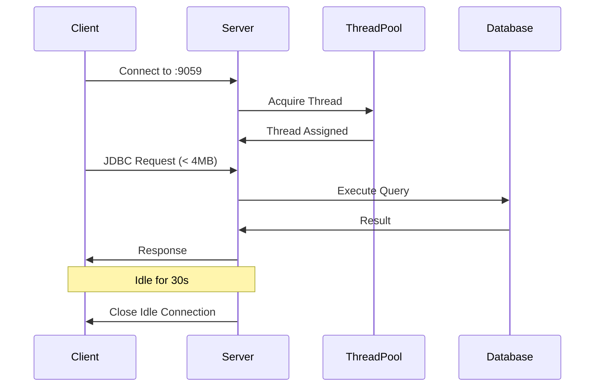
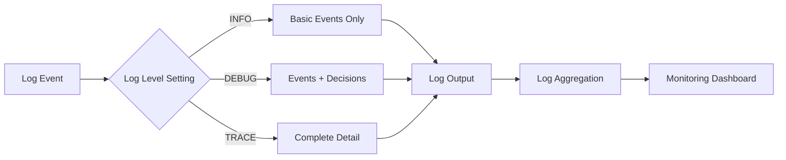
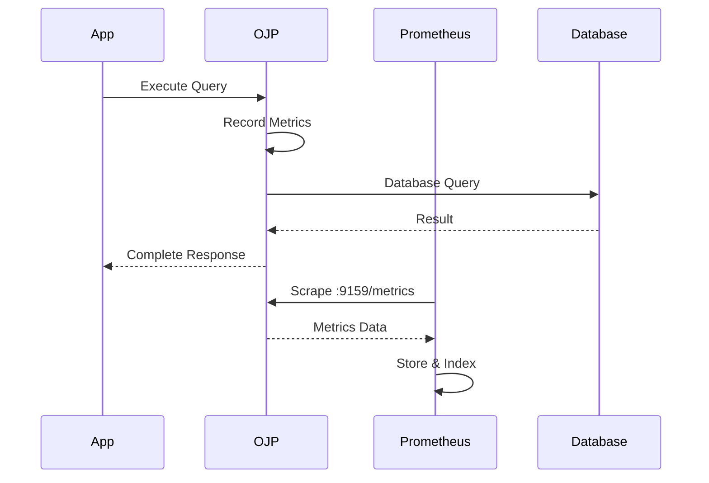
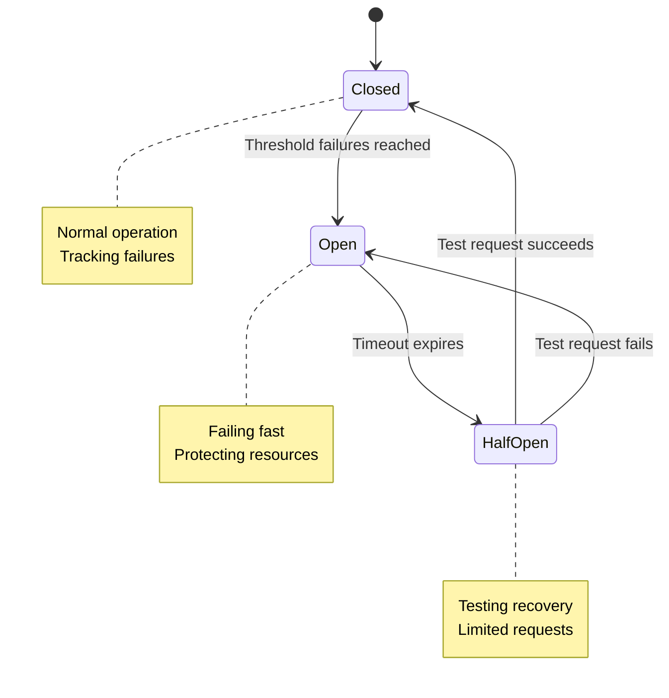
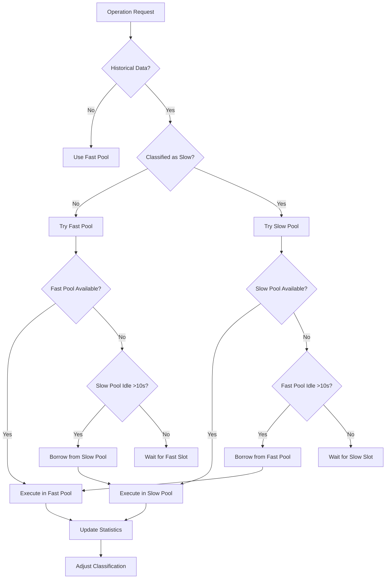
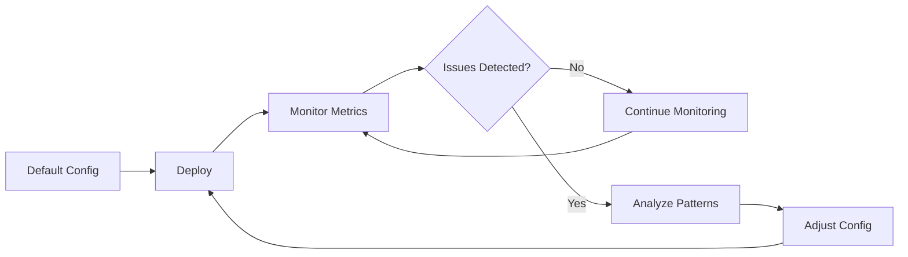

# Chapter 6: OJP Server Configuration

Configuring the OJP server is straightforward yet powerful. The server gives you control over every aspect of its operation, from network settings to advanced features like slow query segregation and circuit breakers. In this chapter, we'll explore how to configure your OJP server for different deployment scenarios, whether you're running in development mode on your laptop or deploying to production Kubernetes clusters.

## 6.1 Understanding Configuration Hierarchy

Before diving into specific settings, it's important to understand how OJP handles configuration. The server supports two primary configuration methods that work together in a well-defined hierarchy. JVM system properties always take precedence over environment variables, giving you the flexibility to override environment-level settings when needed. This design allows you to set baseline configurations through environment variables while making targeted overrides for specific scenarios using system properties.

This hierarchy becomes particularly valuable in containerized environments. You might set production defaults through environment variables in your Docker or Kubernetes configuration, then override specific settings for troubleshooting or testing without modifying your deployment files. The server reads both configuration sources at startup and merges them intelligently, ensuring you always get the behavior you expect.

**[IMAGE PROMPT: Create a layered diagram showing configuration hierarchy with three levels: "JVM System Properties" at the top (highest priority, shown in bold color), "Environment Variables" in the middle (medium priority), and "Default Values" at the bottom (lowest priority, shown in faded color). Use arrows flowing upward labeled "Overrides" to show precedence. Include example values at each level like `-Dojp.server.port=9059`, `OJP_SERVER_PORT=1059`, and `default: 1059`. Style: Clean, hierarchical infographic with color-coded priority levels.]**



## 6.2 Core Server Settings

Let's start with the foundational settings that control how your OJP server operates. The most fundamental setting is the gRPC server port, which determines where clients connect to access your database connections. By default, OJP listens on port 1059, though you'll often want to change this for production deployments or when running multiple instances on the same host.

The server also exposes a separate Prometheus metrics endpoint on port 9159 by default. This separation is intentional—it allows you to apply different network policies and access controls to your operational metrics versus your database traffic. In production, you might expose the gRPC port only to your application network while making the Prometheus endpoint available to your monitoring infrastructure on a separate network segment.

Performance tuning starts with the thread pool size, which defaults to 200 threads. This setting controls how many concurrent client requests the server can handle. The right value depends on your workload characteristics and server resources. A CPU-intensive workload might benefit from fewer threads (closer to the number of CPU cores), while I/O-bound workloads can often handle more threads. Start with the default and adjust based on your monitoring data.

**[IMAGE PROMPT: Create a technical server architecture diagram showing OJP Server as a central component with two network interfaces: one labeled "gRPC Port :1059" (shown with database connection icons) and another labeled "Prometheus Port :9159" (shown with metrics/monitoring icons). Include a thread pool visualization showing multiple worker threads (default: 200) handling concurrent requests. Use professional blue and gray color scheme with clear labels and connection lines. Style: Modern technical architecture diagram.]**

The maximum request size setting provides protection against oversized requests that could impact server stability. The default of 4MB is generous for typical JDBC operations, but you might increase it if you're working with very large result sets or binary data. Just remember that larger request sizes consume more memory, so balance this against your available resources.

Connection idle timeout controls how long the server waits before closing inactive **gRPC connections** from clients. The default of 30 seconds strikes a balance between resource conservation and connection overhead. When a gRPC connection times out due to inactivity, the client automatically reconnects on demand when the next JDBC operation is requested, so there's no need for manual reconnection handling.

**Important**: These are gRPC connection timeouts, not database connection timeouts. Each gRPC connection uses HTTP/2 multiplexing, allowing many virtual JDBC connections to share a single gRPC connection. This multiplexed architecture means one gRPC connection can handle hundreds of `getConnection()` calls from the client side.

For most deployments, the default 30-second timeout works well. However, if you want to avoid frequent reconnections, consider increasing this timeout (or even disabling it with a very high value like 3600000 for 1 hour) for environments with consistent traffic patterns. The gRPC connection reestablishment is relatively lightweight, but avoiding it entirely is even better for performance.

Here's how you configure these core settings:

```bash
# Using JVM system properties
java -Dojp.server.port=9059 \
     -Dojp.prometheus.port=9091 \
     -Dojp.server.threadPoolSize=100 \
     -Dojp.server.maxRequestSize=8388608 \
     -Dojp.server.connectionIdleTimeout=60000 \
     -jar ojp-server.jar
```

Or using environment variables for container deployments:

```bash
export OJP_SERVER_PORT=9059
export OJP_PROMETHEUS_PORT=9091
export OJP_SERVER_THREADPOOLSIZE=100
export OJP_SERVER_MAXREQUESTSIZE=8388608
export OJP_SERVER_CONNECTIONIDLETIMEOUT=60000
java -jar ojp-server.jar
```



## 6.3 Security Configuration

Security in OJP includes multiple layers: IP-based access control, TLS/mTLS encryption, and network segregation. This section covers IP whitelisting for basic access control. For comprehensive security guidance including SSL/TLS configuration between OJP Server and databases, mTLS between JDBC driver and OJP Server, and network architecture patterns, see **Chapter 11: Security**.

### IP-Based Access Control

IP whitelisting gives you fine-grained control over who can connect to your server. The security model is simple yet effective: you define IP whitelists that specify which clients can access the gRPC endpoint and which can access the Prometheus metrics endpoint.

By default, both endpoints accept connections from anywhere (0.0.0.0/0), which is perfect for development but inappropriate for production. In production environments, you'll want to lock down access to specific networks or IP addresses. The server supports multiple formats for defining allowed addresses, including individual IPs, CIDR notation for network ranges, and comma-separated lists for multiple rules.

**[IMAGE PROMPT: Create a network security diagram showing OJP Server at the center with two separate firewalls/shields. The left shield guards "gRPC Endpoint" with rules like "192.168.1.0/24" and "10.0.0.0/8" (labeled "Application Network"). The right shield guards "Prometheus Endpoint" with rules like "192.168.100.0/24" (labeled "Monitoring Network"). Show blocked connections (red X) and allowed connections (green checkmark) from different IP ranges. Style: Professional security diagram with red, green, and blue color coding.]**

A common pattern is to allow gRPC connections from your application network while restricting Prometheus access to your monitoring infrastructure. This separation of concerns reflects the principle of least privilege—applications need database access, but they don't need access to operational metrics.

```bash
# Restrict gRPC to internal application network
# Allow Prometheus from monitoring subnet only
java -Dojp.server.allowedIps="10.0.0.0/8,172.16.0.0/12" \
     -Dojp.prometheus.allowedIps="192.168.100.0/24" \
     -jar ojp-server.jar
```

The IP whitelist supports several formats to match your network topology. You can specify individual hosts for precise control, use CIDR notation for subnet ranges, or combine multiple rules. Here are some practical examples:

```bash
# Allow specific development machines
-Dojp.server.allowedIps="192.168.1.100,192.168.1.101,192.168.1.102"

# Allow entire department subnet
-Dojp.server.allowedIps="192.168.10.0/24"

# Multiple subnets plus localhost
-Dojp.server.allowedIps="10.0.0.0/8,192.168.1.0/24,127.0.0.1"

# Production: restrict to Kubernetes pod network
-Dojp.server.allowedIps="10.244.0.0/16"
```

Remember that security configuration is checked on every connection attempt. The server performs efficient CIDR matching, so even with complex rulesets, the performance impact is negligible. However, overly permissive rules can't be fixed with monitoring—start restrictive and open up as needed.

**[IMAGE PROMPT: Create a flowchart diagram showing IP access control decision process. Start with "Incoming Connection" at top, flow through "Extract Client IP", then "Check Against Whitelist Rules" (shown as a list icon with CIDR rules), then a diamond decision "Match Found?". On "Yes" path: "Allow Connection" (green box), on "No" path: "Reject Connection" (red box) with "Log Security Event" beneath it. Style: Clean technical flowchart with green/red color coding for accept/reject paths.]**

## 6.4 Logging and Debugging

Effective logging is crucial for understanding server behavior and troubleshooting issues. OJP provides granular log level control, allowing you to adjust verbosity based on your needs. The server supports five log levels that follow the standard severity hierarchy: TRACE, DEBUG, INFO, WARN, and ERROR.

For production environments, **ERROR level is recommended** for maximum performance unless investigating issues. This logs only critical errors while minimizing overhead. INFO level provides more operational visibility but increases log volume. Use DEBUG or TRACE only temporarily when troubleshooting specific issues.

When troubleshooting, DEBUG level reveals the internal decision-making process, showing you exactly how the server handles requests, manages connections, and applies configuration.

TRACE level is your deep-dive diagnostic tool. It logs every operation in exhaustive detail, including gRPC message contents, connection lifecycle events, and thread pool activity. Use TRACE sparingly and temporarily—the log volume can be substantial, and the performance impact is noticeable. Enable it when you need to understand exact request flow or diagnose subtle timing issues, then switch back to DEBUG or INFO once you've gathered your diagnostic data.

```bash
# Production: ERROR level for maximum performance
-Dojp.server.logLevel=ERROR

# Production with operational visibility: INFO level
-Dojp.server.logLevel=INFO

# Development: DEBUG for detailed behavior
-Dojp.server.logLevel=DEBUG

# Troubleshooting: TRACE for complete diagnostics
-Dojp.server.logLevel=TRACE
```

Here's what you'll see at each level:

At ERROR level, you'll only see critical failures and exceptions that require immediate attention. This is the recommended production setting for maximum performance.

WARN level adds warnings about non-critical issues like configuration inconsistencies, deprecated features, or recoverable errors. Useful when you want to catch potential problems before they become critical.

INFO level adds server lifecycle events (startup, shutdown), configuration summaries, connection pool statistics, and slow query notifications. This gives you operational awareness without excessive detail.

DEBUG level adds request routing decisions, connection acquisition and release events, circuit breaker state changes, and detailed error contexts. This level helps you understand why the server makes specific decisions.

TRACE level includes everything from DEBUG plus gRPC message contents, thread scheduling details, raw protocol events, and internal state transitions. This is your "show me everything" level for deep debugging sessions.

**[IMAGE PROMPT: Create a layered visualization showing three log level views of the same event. Top layer labeled "INFO" shows a single line: "Connection established to PostgreSQL". Middle layer labeled "DEBUG" shows INFO plus 3-4 additional lines with connection details. Bottom layer labeled "TRACE" shows DEBUG plus many detailed lines including raw protocol messages and timestamps. Use different background shades (light, medium, dark) to distinguish layers. Style: Code editor-style display with monospace font and subtle line numbers.]**

The log format is designed for both human readability and machine parsing. Each log entry includes a timestamp, thread ID, log level, logger name, and message. This structured format works well with log aggregation tools like Splunk, ELK Stack, or CloudWatch Logs.



## 6.5 OpenTelemetry Integration

Modern observability goes beyond logs. OJP integrates with OpenTelemetry to provide metrics through Prometheus. The server automatically instruments gRPC operations, providing insights into request processing and server performance.

**Note**: Currently, OJP exports metrics via Prometheus but does not export distributed traces. The OpenTelemetry integration focuses on providing operational metrics such as request rates, error rates, and latency through the Prometheus endpoint.

OpenTelemetry support is enabled by default, making the Prometheus metrics endpoint available at the configured port (default 9159). The server automatically instruments all gRPC operations, creating metrics for connection acquisition, query execution, and server resource usage.

**[IMAGE PROMPT: Create a metrics dashboard visualization showing Prometheus metrics from OJP Server. Display panels for: "Request Rate" (line graph), "Connection Pool Usage" (gauge), "Query Latency p95/p99" (histogram), "Error Rate" (area chart). Use modern Grafana-style UI with dark theme, multiple time series, and clear metric labels. Style: Modern observability dashboard with color-coded metrics and real-time graphs.]**

The default configuration provides metrics through the Prometheus HTTP endpoint. You can enable or disable OpenTelemetry as needed:

```bash
# Enable OpenTelemetry (default)
-Dojp.opentelemetry.enabled=true

# Disable telemetry for performance-critical scenarios
-Dojp.opentelemetry.enabled=false
```

The metrics available through Prometheus include standard gRPC instrumentation metrics such as request counts, request durations, and error rates. These metrics integrate well with Prometheus-based monitoring stacks and can be visualized in Grafana or other observability platforms.



## 6.6 Circuit Breaker Configuration

Resilience patterns are built into OJP, starting with the circuit breaker. When database operations consistently fail, the circuit breaker prevents your applications from overwhelming the database with retry attempts. Instead, it fails fast after a configured threshold, giving the database time to recover while protecting your application threads from hanging on impossible operations.

The circuit breaker operates in three states: closed (normal operation), open (failing fast), and half-open (testing recovery). When connection attempts fail repeatedly, the breaker trips to the open state and rejects new requests immediately. After a timeout period, it enters half-open state to test if the database has recovered. If test requests succeed, it closes again; if they fail, it remains open for another timeout period.

**[IMAGE PROMPT: Create a state machine diagram showing circuit breaker states. Three circles labeled "CLOSED" (green), "OPEN" (red), and "HALF-OPEN" (yellow). Arrows between states: "CLOSED to OPEN" labeled "3 failures" (configurable threshold), "OPEN to HALF-OPEN" labeled "60s timeout", "HALF-OPEN to CLOSED" labeled "Success", "HALF-OPEN to OPEN" labeled "Failure". Include small icons: green checkmark for CLOSED, red X for OPEN, yellow caution symbol for HALF-OPEN. Style: Clean state diagram with color-coded states and clear transition labels.]**

The failure threshold defaults to 3 consecutive failures, which strikes a balance between resilience and responsiveness. If you're experiencing intermittent network issues, you might increase this threshold to avoid unnecessary circuit trips. In environments where database downtime is rare but catastrophic, a lower threshold helps protect application resources more aggressively.

The timeout period controls how long the circuit breaker stays open before attempting recovery. The default of 60 seconds gives most transient issues time to resolve without excessive retry overhead. Adjust this based on your recovery time objectives and database restart characteristics.

```bash
# Production: Aggressive failure detection
-Dojp.server.circuitBreakerThreshold=3 \
-Dojp.server.circuitBreakerTimeout=60000

# Development: More tolerant of temporary issues
-Dojp.server.circuitBreakerThreshold=5 \
-Dojp.server.circuitBreakerTimeout=30000

# High-availability: Quick recovery attempts
-Dojp.server.circuitBreakerThreshold=2 \
-Dojp.server.circuitBreakerTimeout=15000
```

When the circuit breaker trips, clients receive immediate failures instead of hanging connections. This fail-fast behavior is crucial for maintaining application responsiveness. Your application can handle these failures gracefully, perhaps by serving cached data or returning degraded functionality, rather than leaving users waiting for doomed requests.

The circuit breaker state transitions are logged and exposed as Prometheus metrics, giving you visibility into database health and resilience events. Monitor these metrics to understand if you're experiencing connection issues that need investigation.



## 6.7 Slow Query Segregation

One of OJP's useful features is slow query segregation, which can help prevent long-running queries from starving fast operations in certain workload scenarios. The server dynamically classifies operations as fast or slow based on historical patterns, then manages separate connection slots for each category. This can be beneficial when you have a mixed workload where a heavy analytical query running for minutes might otherwise prevent your quick transaction processing from getting database connections.

The feature works by monitoring operation execution times and building a statistical model of each operation's performance characteristics. When an operation consistently takes longer than average, the server classifies it as slow and routes it to the slow slot pool. Fast operations continue using the fast slot pool, maintaining their responsiveness even under mixed workload pressure.

**[IMAGE PROMPT: Create a side-by-side comparison showing connection pool behavior. Left side labeled "Without Segregation": single queue with fast queries (lightning bolt icons) blocked behind slow queries (turtle icons), showing red warning indicators. Right side labeled "With Segregation": two separate queues, top queue "Fast Slots (80%)" with lightning bolts flowing freely, bottom queue "Slow Slots (20%)" with turtle icons, showing green success indicators. Style: Before/after comparison with color-coded performance indicators.]**

Slow query segregation can be beneficial because it provides advantages with minimal configuration when you have a mixed workload of fast and slow queries. The percentage of slots reserved for slow operations defaults to 20%, which accommodates most workload patterns. You might increase this if you have many legitimate long-running queries, or decrease it if your workload is predominantly fast transactional operations.

```bash
# Enable with default 20% slow slots
-Dojp.server.slowQuerySegregation.enabled=true \
-Dojp.server.slowQuerySegregation.slowSlotPercentage=20

# Analytical workload: more slow slots
-Dojp.server.slowQuerySegregation.slowSlotPercentage=40

# Transactional workload: fewer slow slots
-Dojp.server.slowQuerySegregation.slowSlotPercentage=10

# Disable for consistent behavior (not recommended)
-Dojp.server.slowQuerySegregation.enabled=false
```

The idle timeout setting controls when slots can borrow from the other pool. If the fast pool is empty but slow slots sit idle, fast operations can temporarily borrow those slots. This prevents resource waste while maintaining the segregation benefits when both pools are active. The default 10-second timeout means slots must be idle briefly before lending—preventing constant oscillation.

Timeout settings for acquiring slots provide backpressure when pools are exhausted. Fast operations wait up to 60 seconds by default, while slow operations get more generous 120-second timeouts. These asymmetric timeouts reflect the different expectations: fast operations should complete quickly or fail, while slow operations naturally take longer and deserve more patience.

**[IMAGE PROMPT: Create a dynamic allocation diagram showing how idle slots can be borrowed between pools. Show two pools: "Fast Slots" (4 boxes, 3 active, 1 idle) and "Slow Slots" (2 boxes, 1 active, 1 idle). Draw a curved arrow labeled "Temporary Borrow (if idle >10s)" from the idle slow slot to fast pool. Include a timer icon and "Returns when fast demand drops" annotation. Use green for active, gray for idle, and dotted lines for temporary borrowing. Style: Technical system diagram with clear state visualization.]**

The classification algorithm adapts to your workload patterns over time. An operation that starts fast but becomes slow under load will gradually migrate to slow slot management. This dynamic behavior means you don't need to manually categorize your queries—the server learns from observation.



## 6.8 Configuration Best Practices

With all these configuration options available, how do you choose the right settings? Start with the defaults—they're designed for typical workloads and provide good performance out of the box. Then adjust based on monitoring data and observed behavior. Don't preemptively tune settings based on assumptions; let your actual workload guide your configuration.

For development environments, prioritize visibility and fast feedback. Use INFO logging (or DEBUG for active development), generous timeouts, and tolerant circuit breaker settings. This makes it easier to understand server behavior and diagnose issues during development.

```bash
# Development configuration
export OJP_SERVER_PORT=1059
export OJP_SERVER_LOGLEVEL=DEBUG
export OJP_PROMETHEUS_PORT=9159
export OJP_SERVER_THREADPOOLSIZE=50
export OJP_SERVER_CIRCUITBREAKERTHRESHOLD=5
export OJP_SERVER_ALLOWEDIPS="0.0.0.0/0"
export OJP_OPENTELEMETRY_ENABLED=true
```

Production environments require different trade-offs. Use ERROR or INFO logging (ERROR recommended for maximum performance; INFO for operational visibility). Implement proper IP restrictions for security. Enable OpenTelemetry for distributed tracing. Configure appropriate timeouts for your SLAs. Be very careful with DEBUG and TRACE in production—they are extremely verbose and can impact performance significantly.

```bash
# Production configuration
export OJP_SERVER_PORT=1059
export OJP_SERVER_LOGLEVEL=ERROR  # Recommended for production performance
export OJP_PROMETHEUS_PORT=9159
export OJP_SERVER_THREADPOOLSIZE=200
export OJP_SERVER_CIRCUITBREAKERTHRESHOLD=3
export OJP_SERVER_CIRCUITBREAKERTIMEOUT=60000
export OJP_SERVER_ALLOWEDIPS="10.0.0.0/8"
export OJP_PROMETHEUS_ALLOWEDIPS="192.168.100.0/24"
export OJP_OPENTELEMETRY_ENABLED=true
export OJP_OPENTELEMETRY_ENDPOINT=http://jaeger:4317
export OJP_SERVER_SLOWQUERYSEGREGATION_ENABLED=true
```

**[IMAGE PROMPT: Create a comparison table visualization showing recommended configurations for three environments. Three columns labeled "Development", "Staging", and "Production". Rows for key settings like Log Level (DEBUG/INFO/INFO), Security (Open/Restricted/Locked Down), Telemetry (Optional/Enabled/Required), Thread Pool (Low/Medium/High), Circuit Breaker (Tolerant/Balanced/Strict). Use color coding: green for development-friendly, yellow for balanced, red for production-strict. Style: Professional configuration matrix with clear visual hierarchy.]**

Monitor your configuration's effectiveness through the Prometheus metrics endpoint. Watch for circuit breaker trips, connection pool saturation, slow query segregation balance, and request latencies. These metrics tell you if your configuration matches your workload or needs adjustment.

Remember that configuration is not set-and-forget. As your application evolves and workload patterns change, revisit your OJP server configuration. What worked for 1000 requests per second might not work for 10000. Continuous monitoring and periodic tuning keep your server running optimally.



## 6.9 Configuration Validation and Troubleshooting

When things don't work as expected, configuration issues are often the culprit. OJP provides clear error messages when configuration values are invalid or inconsistent. The server validates configuration at startup and fails fast if critical settings are problematic.

Common configuration mistakes include conflicting port assignments, invalid IP whitelist formats, out-of-range percentage values, and mismatched property names. The startup logs show exactly which configuration values were loaded and from which sources, making it easy to verify your settings took effect.

If you're experiencing unexpected behavior, enable DEBUG logging temporarily and watch the startup sequence. You'll see each configuration property being loaded, any validation errors, and the final active configuration. This diagnostic information usually points directly to the problem.

**[IMAGE PROMPT: Create a troubleshooting flowchart for common configuration issues. Start with "Server Won't Start" diamond. Branch to "Check Logs" which shows code snippet of startup logs. From there, multiple paths: "Port Conflict?" leads to "Change Port", "Invalid IP Format?" leads to "Fix CIDR Syntax", "Missing Required Value?" leads to "Set Property". Each resolution path leads back to "Restart Server" then "Verify Success" (green checkmark). Style: Decision tree flowchart with code snippets and clear resolution paths.]**

For Docker deployments, remember that environment variables must use the `OJP_` prefix and uppercase with underscores. JVM system properties use the `ojp.` prefix with lowercase and dots. Mixing these formats is a common mistake that results in configuration being silently ignored.

```bash
# Correct environment variable format
export OJP_SERVER_PORT=9059

# Incorrect: will be ignored
export ojp.server.port=9059

# Correct JVM property format
-Dojp.server.port=9059

# Incorrect: will cause error
-DOJP_SERVER_PORT=9059
```

The server logs its active configuration at INFO level during startup. Review this output to confirm your settings were applied correctly. If you see unexpected defaults, it means your configuration wasn't recognized—check for typos, case sensitivity, and format issues.

## Summary

OJP server configuration gives you precise control over server behavior, security, performance, and observability. The hierarchical configuration system with JVM properties and environment variables provides flexibility for different deployment scenarios. Default settings work well for most use cases, but understanding the available options lets you optimize for your specific workload.

Key configuration areas include core server settings for network and threading, security controls through IP whitelisting, logging levels for operational visibility, OpenTelemetry integration for observability, circuit breakers for resilience, and slow query segregation for performance under mixed workloads. Each area offers sensible defaults that you can refine based on monitoring data.

Start simple, monitor closely, and adjust based on observed behavior. Good configuration emerges from understanding your workload and using OJP's flexibility to match it, not from cargo-culting settings from other environments.

**[IMAGE PROMPT: Create a summary mind map with "OJP Server Configuration" at the center. Six main branches radiating outward: "Core Settings" (server icon), "Security" (lock icon), "Logging" (document icon), "Telemetry" (graph icon), "Circuit Breaker" (shield icon), and "Slow Query Segregation" (speedometer icon). Each branch has 2-3 sub-branches with key points. Use colors to group related concepts and make it visually hierarchical. Style: Modern mind map with icons and color coding.]**
