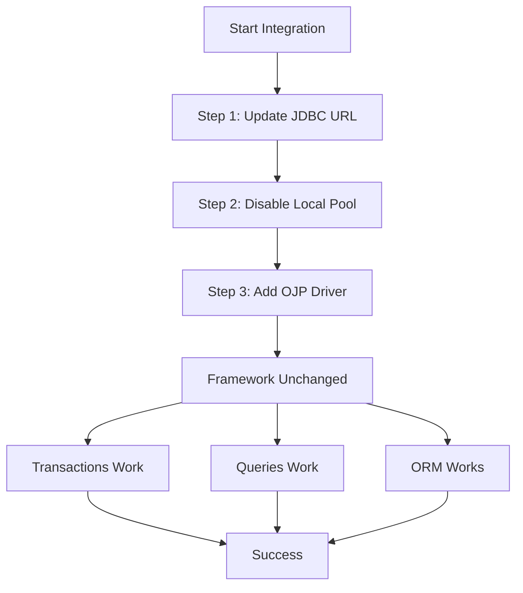
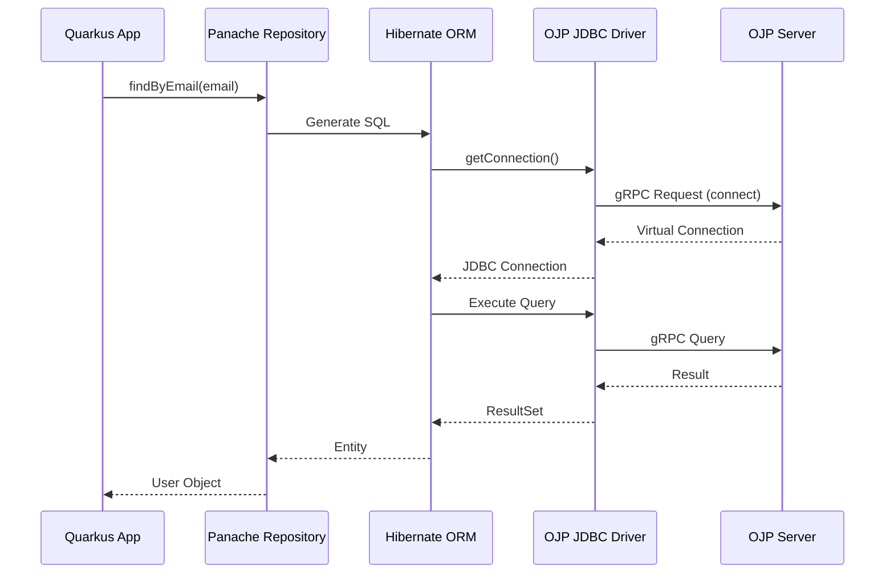
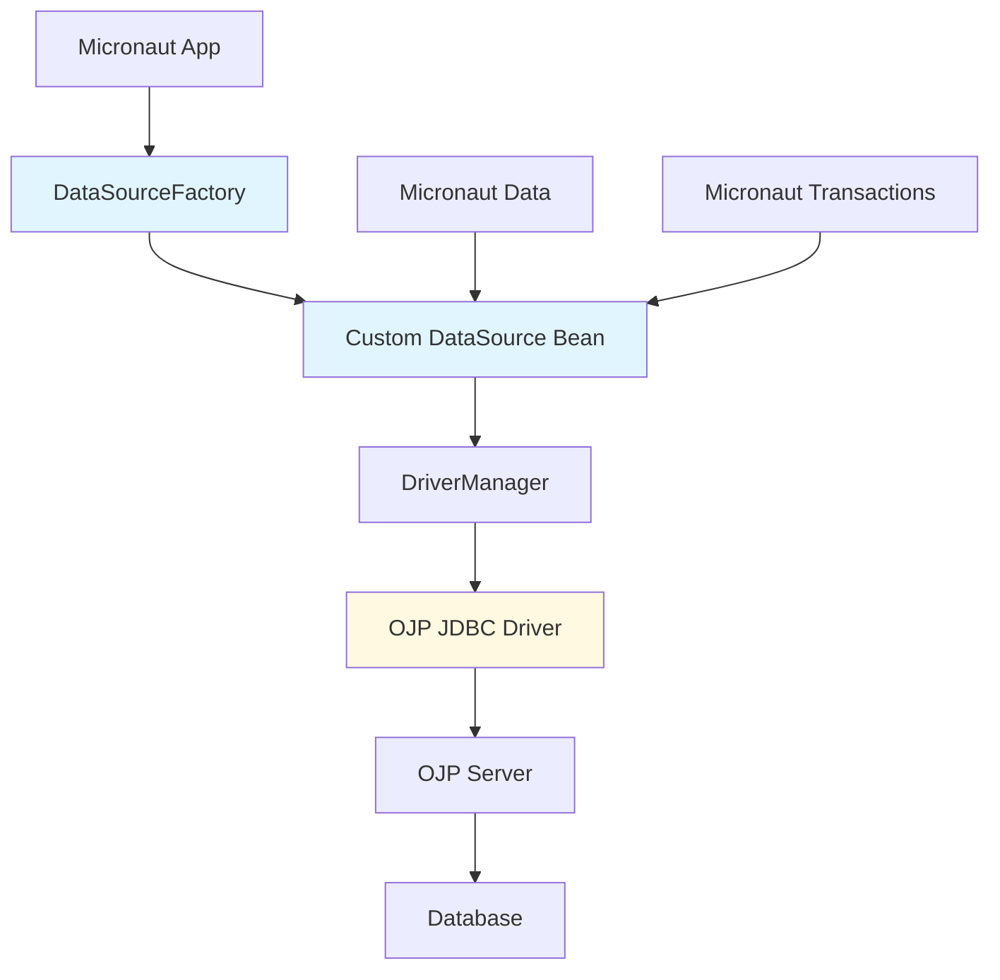
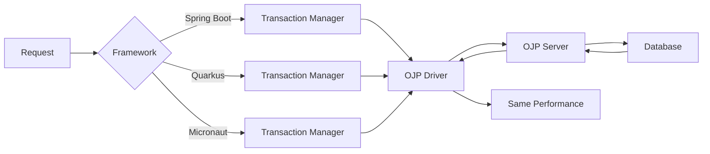
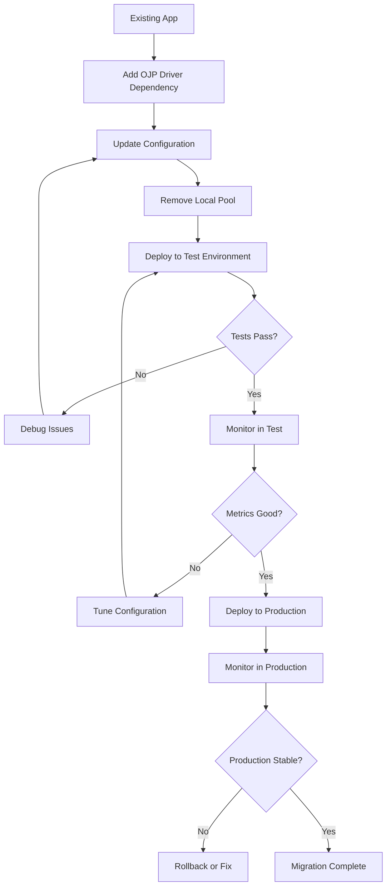

# Chapter 7: Framework Integration

Modern Java applications rarely use raw JDBC. Instead, they leverage frameworks like Spring Boot, Quarkus, and Micronaut that provide database integration, dependency injection, and transaction management. Integrating OJP with these frameworks is straightforward, but it requires understanding how each framework handles connection pooling and datasource configuration. The key insight is simple: OJP replaces your application's connection pool, so you must disable the framework's built-in pooling to avoid double-pooling anti-patterns.

In this chapter, we'll explore how to integrate OJP with the three most popular Java application frameworks. While the specific mechanics differ, the underlying principle remains consistent: modify your connection URL, remove local pooling, and add the OJP JDBC driver dependency. Once configured, your framework's database features work exactly as before—queries, transactions, and ORM integration all function normally. The difference happens behind the scenes, where OJP manages connections centrally instead of creating isolated pools in each application instance.

## 7.1 Understanding Framework Integration Patterns

Before diving into framework-specific details, let's understand why OJP integration follows a consistent pattern. Traditional frameworks bundle connection pooling libraries like HikariCP directly into your application. When your application starts, the framework creates a local connection pool with connections to your database. This works fine for monolithic applications, but creates problems in distributed architectures where hundreds of microservices each maintain their own isolated pools.

OJP changes this model by moving pooling to a central server. Your application still uses familiar datasource APIs and transaction management, but instead of pooling real database connections, it creates lightweight virtual connections to the OJP server. The server maintains the actual database connection pool and coordinates access across all your application instances.

**[IMAGE PROMPT: Create a before/after architecture diagram comparing traditional vs OJP connection management. Top half "Before OJP": Show 3 application instances, each with its own HikariCP pool (mini pool icons) connecting to database, resulting in 3 separate connection pools. Label: "Each app maintains separate pool, difficult to coordinate". Bottom half "With OJP": Show 3 application instances with thin dotted lines to central OJP Server (large pool icon), which connects to database with single consolidated pool. Label: "Centralized pooling, coordinated management". Style: Clear before/after comparison with color coding—red for problematic pattern, green for improved pattern.]**

This architectural shift requires you to disable the framework's local connection pooling. If you leave it enabled, you'll end up with double-pooling: your application creates a pool of virtual OJP connections, which then compete for real database connections in the OJP pool. This wastes resources and obscures the benefits of centralized management.

The integration pattern always follows three steps, regardless of framework. First, update your JDBC URL to use the OJP format that specifies the OJP server location and target database. Second, remove or disable the framework's bundled connection pool implementation. Third, add the OJP JDBC driver as a dependency so your application can communicate with the OJP server.



Let's see how this pattern applies to each major framework.

## 7.2 Spring Boot Integration

Spring Boot is the most widely used Java framework, and integrating OJP with it showcases the typical challenges and solutions. Spring Boot applications by default include HikariCP as their connection pool implementation. This tight integration makes Spring Boot applications fast and efficient out of the box, but it also means you need to explicitly remove HikariCP when using OJP.

The integration starts with your Maven or Gradle build file. You'll add the OJP JDBC driver dependency and modify your Spring Boot JDBC starter to exclude HikariCP. Maven makes this straightforward with the exclusions mechanism:

```xml
<!-- Add OJP JDBC Driver -->
<dependency>
    <groupId>org.openjproxy</groupId>
    <artifactId>ojp-jdbc-driver</artifactId>
    <version>0.3.1-beta</version>
</dependency>

<!-- Spring JDBC Starter WITHOUT HikariCP -->
<dependency>
    <groupId>org.springframework.boot</groupId>
    <artifactId>spring-boot-starter-jdbc</artifactId>
    <exclusions>
        <exclusion>
            <groupId>com.zaxxer</groupId>
            <artifactId>HikariCP</artifactId>
        </exclusion>
    </exclusions>
</dependency>
```

With the dependencies configured, turn your attention to the application configuration. Spring Boot's `application.properties` or `application.yml` file controls datasource settings. You'll update three properties: the JDBC URL to point to OJP, the driver class name to use OJP's driver, and the datasource type to prevent pooling.

**[IMAGE PROMPT: Create a side-by-side code comparison showing application.properties transformation. Left side labeled "Before OJP": Shows traditional config with `spring.datasource.url=jdbc:postgresql://localhost:5432/mydb` and default HikariCP settings. Right side labeled "With OJP": Shows `spring.datasource.url=jdbc:ojp[localhost:1059]_postgresql://localhost:5432/mydb`, `spring.datasource.driver-class-name=org.openjproxy.jdbc.Driver`, and `spring.datasource.type=SimpleDriverDataSource`. Highlight the changes with arrows and annotations. Style: Clean code comparison with syntax highlighting and change indicators.]**

Here's a complete configuration example:

```properties
# application.properties with OJP
spring.datasource.url=jdbc:ojp[localhost:1059]_postgresql://localhost:5432/mydb
spring.datasource.driver-class-name=org.openjproxy.jdbc.Driver
spring.datasource.type=org.springframework.jdbc.datasource.SimpleDriverDataSource
spring.datasource.username=myuser
spring.datasource.password=mypassword
```

The URL format deserves attention. You insert `ojp[hostname:port]_` immediately after `jdbc:`, where hostname and port identify your OJP server. The remainder of the URL is your standard database-specific JDBC URL. Spring Boot parses this URL and connects to the OJP server, which then manages the real database connections.

Setting the datasource type to `SimpleDriverDataSource` is crucial. This tells Spring Boot to obtain single connections directly rather than attempting to pool them. Since OJP already provides pooling, this configuration avoids double-pooling while maintaining Spring's transaction management and other datasource features.

### Spring Boot with JPA and Hibernate

Spring Boot applications often use Spring Data JPA with Hibernate for object-relational mapping. The good news is that OJP integrates seamlessly with this stack. Your JPA repositories, entity mappings, and `@Transactional` annotations all work exactly as before. Hibernate doesn't know or care that connections come from OJP—it just sees standard JDBC connections.

```properties
# Full configuration with JPA/Hibernate
spring.datasource.url=jdbc:ojp[localhost:1059]_postgresql://localhost:5432/mydb
spring.datasource.driver-class-name=org.openjproxy.jdbc.Driver
spring.datasource.type=org.springframework.jdbc.datasource.SimpleDriverDataSource

spring.jpa.database-platform=org.hibernate.dialect.PostgreSQLDialect
spring.jpa.hibernate.ddl-auto=validate
spring.jpa.show-sql=false
spring.jpa.properties.hibernate.format_sql=true
```

Your entity classes, repositories, and service layer remain unchanged. The only difference is in how connections are acquired behind the scenes:

```java
@Service
@Transactional
public class UserService {
    @Autowired
    private UserRepository userRepository;
    
    public User createUser(String name, String email) {
        User user = new User();
        user.setName(name);
        user.setEmail(email);
        return userRepository.save(user);  // OJP manages the connection
    }
}
```


## 7.3 Quarkus Integration

Quarkus, the Kubernetes-native Java framework, emphasizes fast startup times and low memory footprint. Its integration with OJP follows the same three-step pattern but with Quarkus-specific configuration syntax. Quarkus applications use Agroal as their default connection pool, which you'll disable in favor of OJP.

Start with the Maven dependency for OJP's JDBC driver:

```xml
<dependency>
    <groupId>org.openjproxy</groupId>
    <artifactId>ojp-jdbc-driver</artifactId>
    <version>0.3.1-beta</version>
</dependency>
```

Quarkus configuration lives in `application.properties`, where you'll specify datasource settings. The key is enabling JDBC but marking it as unpooled. Quarkus respects this configuration and creates simple non-pooled connections instead of using Agroal:

```properties
# application.properties for Quarkus with OJP
quarkus.datasource.jdbc=true
quarkus.datasource.jdbc.unpooled=true
quarkus.datasource.jdbc.url=jdbc:ojp[localhost:1059]_postgresql://localhost:5432/mydb
quarkus.datasource.jdbc.driver=org.openjproxy.jdbc.Driver
quarkus.datasource.username=myuser
quarkus.datasource.password=mypassword
```

The `unpooled=true` setting is Quarkus's explicit way of indicating you don't want connection pooling at the application layer. This maps directly to our requirement of avoiding double-pooling with OJP.

**[IMAGE PROMPT: Create a Quarkus-specific configuration diagram showing the application.properties file with key settings highlighted. Show three configuration layers: top layer "JDBC Enabled" (checkmark icon), middle layer "Unpooled Mode" (crossed-out pool icon), bottom layer "OJP URL & Driver" (connection icon). Use arrows to show how these settings work together to disable local pooling while enabling OJP connectivity. Style: Layered technical diagram with clear annotations.]**

### Quarkus Native Mode Considerations

Quarkus's killer feature is native compilation with GraalVM, producing executables that start in milliseconds with minimal memory. OJP works with Quarkus native mode, but you must ensure the OJP JDBC driver and its dependencies are properly configured for native compilation.

The OJP driver is designed to be GraalVM-compatible, but you should test your native build thoroughly. Include database operations in your native tests to verify the complete integration path. If you encounter issues, check that reflection configuration includes the OJP driver class and any database-specific driver classes it loads.

```properties
# Native build configuration
quarkus.native.additional-build-args=--initialize-at-run-time=org.openjproxy.jdbc.Driver
```

### Quarkus with Hibernate ORM and Panache

Quarkus applications often use Hibernate ORM with Panache for elegant data access patterns. OJP integrates seamlessly here too. Your Panache entities and repositories work without modification:

```java
@Entity
public class User extends PanacheEntity {
    public String name;
    public String email;
    
    public static User findByEmail(String email) {
        return find("email", email).firstResult();
    }
}

@ApplicationScoped
public class UserService {
    @Transactional
    public User createUser(String name, String email) {
        User user = new User();
        user.name = name;
        user.email = email;
        user.persist();  // OJP manages the connection
        return user;
    }
}
```

The key is that Hibernate never knows it's using OJP. From Hibernate's perspective, it's just getting JDBC connections from a datasource. The fact that those connections are virtual connections to an OJP server is transparent to the ORM layer.



## 7.4 Micronaut Integration

Micronaut, designed for microservices and cloud-native applications, takes a slightly different approach to datasource configuration. While Spring Boot and Quarkus let you simply disable pooling, Micronaut requires you to provide a custom DataSource bean that creates unpooled connections.

The first step remains familiar—add the OJP JDBC driver dependency:

```xml
<dependency>
    <groupId>org.openjproxy</groupId>
    <artifactId>ojp-jdbc-driver</artifactId>
    <version>0.3.1-beta</version>
</dependency>
```

Next, remove Micronaut's default HikariCP dependency from your project:

```xml
<!-- Remove this dependency -->
<dependency>
    <groupId>io.micronaut.sql</groupId>
    <artifactId>micronaut-jdbc-hikari</artifactId>
</dependency>
```

Now comes the Micronaut-specific part: creating a DataSource factory. Micronaut's dependency injection system expects to find a DataSource bean, so you'll create one that returns simple connections without pooling:

```java
import io.micronaut.context.annotation.Factory;
import io.micronaut.context.annotation.Value;
import jakarta.inject.Named;
import jakarta.inject.Singleton;

import javax.sql.DataSource;
import java.sql.Connection;
import java.sql.DriverManager;
import java.sql.SQLException;

@Factory
public class DataSourceFactory {
    
    @Singleton
    @Named("default")
    public DataSource dataSource(
        @Value("${datasources.default.url}") String url,
        @Value("${datasources.default.username}") String user,
        @Value("${datasources.default.password}") String password,
        @Value("${datasources.default.driver-class-name}") String driver
    ) throws ClassNotFoundException {
        // Register the OJP driver
        Class.forName(driver);
        
        // Return a simple DataSource that gets connections from DriverManager
        return new DataSource() {
            @Override
            public Connection getConnection() throws SQLException {
                return DriverManager.getConnection(url, user, password);
            }
            
            @Override
            public Connection getConnection(String username, String password) throws SQLException {
                return DriverManager.getConnection(url, username, password);
            }
            
            // Required wrapper methods (can throw UnsupportedOperationException)
            @Override
            public <T> T unwrap(Class<T> iface) { 
                throw new UnsupportedOperationException(); 
            }
            
            @Override
            public boolean isWrapperFor(Class<?> iface) { 
                return false; 
            }
            
            @Override
            public java.io.PrintWriter getLogWriter() { 
                throw new UnsupportedOperationException(); 
            }
            
            @Override
            public void setLogWriter(java.io.PrintWriter out) { 
                throw new UnsupportedOperationException(); 
            }
            
            @Override
            public void setLoginTimeout(int seconds) { 
                throw new UnsupportedOperationException(); 
            }
            
            @Override
            public int getLoginTimeout() { 
                throw new UnsupportedOperationException(); 
            }
            
            @Override
            public java.util.logging.Logger getParentLogger() { 
                throw new UnsupportedOperationException(); 
            }
        };
    }
}
```

**[IMAGE PROMPT: Create a code visualization showing the Micronaut DataSource factory pattern. Show a class diagram-style representation with DataSourceFactory at the top, connecting to a simple DataSource implementation below, which connects to DriverManager. Highlight that this pattern bypasses HikariCP pooling. Use arrows labeled "Creates", "Returns", and "Uses" to show relationships. Include code snippets for key methods. Style: Clean UML-style class diagram with code integration.]**

This factory creates a DataSource that obtains connections directly from DriverManager rather than maintaining a pool. Since DriverManager is registered with the OJP JDBC driver, it returns OJP virtual connections automatically.

Your `application.properties` file provides the configuration values:

```properties
datasources.default.url=jdbc:ojp[localhost:1059]_postgresql://localhost:5432/mydb
datasources.default.driver-class-name=org.openjproxy.jdbc.Driver
datasources.default.username=myuser
datasources.default.password=mypassword

# If using Hibernate with Micronaut
jpa.default.properties.hibernate.dialect=org.hibernate.dialect.PostgreSQLDialect
```

### Micronaut Data Integration

Micronaut Data provides compile-time generated repositories similar to Spring Data. These work seamlessly with OJP once you've configured the datasource:

```java
@Repository
public interface UserRepository extends CrudRepository<User, Long> {
    Optional<User> findByEmail(String email);
}

@Singleton
public class UserService {
    @Inject
    private UserRepository userRepository;
    
    @Transactional
    public User createUser(String name, String email) {
        User user = new User();
        user.setName(name);
        user.setEmail(email);
        return userRepository.save(user);  // OJP manages the connection
    }
}
```

The key insight is that your data access code doesn't change. Whether you're using Spring Boot, Quarkus, or Micronaut, your repositories, services, and transactions work exactly the same way. OJP integration happens at the configuration layer, not in your business logic.



## 7.5 Framework Comparison and Trade-offs

Each framework brings its own philosophy and trade-offs to OJP integration. Spring Boot offers the smoothest integration path because it has mature support for customizing datasource configuration. The exclusion mechanism for removing HikariCP is well-documented and widely used. Spring Boot's configuration hierarchy also makes it easy to have different settings for different environments.

Quarkus provides the most explicit configuration through its `unpooled=true` setting. There's no ambiguity about whether pooling is enabled—the configuration clearly states the intent. Quarkus's focus on native compilation means you get excellent startup times and memory efficiency, though you must verify GraalVM compatibility for your specific deployment.

Micronaut requires the most custom code with its DataSource factory pattern, but this approach gives you complete control over connection acquisition. If you need custom logic around connection creation—perhaps for multi-tenancy or dynamic datasource routing—Micronaut's factory pattern provides natural extension points.

**[IMAGE PROMPT: Create a comparison matrix showing the three frameworks. Three columns (Spring Boot, Quarkus, Micronaut), rows for: "Configuration Complexity" (Low/Low/Medium), "Custom Code Required" (None/None/Factory Class), "Native Compilation" (Limited/Excellent/Good), "Ecosystem Maturity" (Highest/Growing/Moderate), "Integration Smoothness" (Smoothest/Smooth/Moderate). Use color coding: green for best, yellow for good, orange for moderate. Style: Professional comparison matrix with visual indicators.]**

All three frameworks support the full feature set of JDBC and JPA. Transactions, connection pooling (via OJP), batch operations, and stored procedures all work correctly regardless of framework choice. The differences lie in configuration style rather than capabilities.

### Performance Considerations

From a performance perspective, the framework choice has minimal impact on OJP integration. Once connections are acquired, all frameworks use the same underlying JDBC APIs. The OJP driver handles communication with the OJP server identically regardless of which framework initiated the request.

The main performance difference comes from how frameworks handle transaction boundaries and connection lifecycle. Spring's transaction management is mature and optimizes connection holding time well. Quarkus's reactive extensions can provide better throughput for high-concurrency scenarios, though this applies to the entire application stack, not just OJP integration.

What matters most is ensuring you've disabled local connection pooling correctly. A misconfigured application that maintains both local pooling and OJP connections will show degraded performance due to the double-pooling overhead. Monitor your application's connection behavior to verify that only OJP connections are being created.



## 7.6 Integration Best Practices

Successful OJP integration across frameworks follows common patterns. First, always verify that local connection pooling is completely disabled. Check your dependency tree to ensure no pooling libraries are included. Run your application with debug logging and observe connection acquisition—you should see OJP driver activity, not local pool creation.

Second, use framework-specific health checks to monitor database connectivity. Spring Boot Actuator, Quarkus health endpoints, and Micronaut health indicators all support datasource health checks. These help you quickly identify connectivity issues between your application and the OJP server.

```properties
# Spring Boot health check
management.endpoint.health.show-details=always
management.health.db.enabled=true

# Quarkus health check
quarkus.datasource.health.enabled=true

# Micronaut health check
endpoints.health.jdbc.enabled=true
```

Third, configure appropriate timeouts at both the framework level and in your OJP properties file. The framework's datasource timeout should be slightly longer than OJP's connection acquisition timeout to avoid racing error conditions. This ensures OJP's circuit breaker can trip before your framework timeout fires, giving you clearer error messages.

**[IMAGE PROMPT: Create a timing diagram showing timeout coordination. Show three horizontal bars representing different timeout layers from top to bottom: "Framework Datasource Timeout" (90s), "OJP Connection Acquisition" (60s), and "Database Query Timeout" (30s). Use arrows and labels to show cascading timeout behavior: if database times out, OJP catches it; if OJP times out, framework catches it. Style: Technical timing diagram with color-coded layers and clear duration labels.]**

Fourth, leverage your framework's transaction management properly. Use `@Transactional` annotations (or equivalent) to define clear transaction boundaries. OJP tracks transaction state across the virtual connection, ensuring that real database connections are held only for the duration of your transactions, not the entire HTTP request.

Finally, test your integration thoroughly. Write integration tests that exercise database operations through your framework's repository layer. Verify that transactions commit and rollback correctly, that connection leaks don't occur, and that concurrent requests don't interfere with each other. These tests give you confidence that OJP integration works correctly in your specific application context.

## 7.7 Migration from Existing Applications

If you're adding OJP to an existing application, the migration process is straightforward but requires careful testing. Start with a non-production environment where you can experiment safely. Make a checklist of the configuration changes needed for your specific framework.

The migration typically proceeds in phases. First, deploy the OJP server and verify it can connect to your database. Configure a small test application to use OJP and validate that basic operations work. Then migrate one application at a time, monitoring each for connection behavior and performance.

During migration, watch for common pitfalls. Applications that manually create datasources in code rather than using framework configuration might bypass your OJP setup. Custom connection management code that assumes local database access may need adjustment. Connection string builders that construct URLs programmatically need updates to include the OJP server specification.

**[IMAGE PROMPT: Create a migration roadmap showing five phases as connected blocks: "1. Deploy OJP Server" → "2. Test Connection" → "3. Update Config" → "4. Test Application" → "5. Monitor Production". Each block contains 2-3 checkpoints. Use a timeline-style layout with checkmarks for completed steps and circles for pending steps. Include risk indicators (red/yellow/green) for each phase. Style: Project management roadmap with clear progression.]**

Monitor your applications closely after migration. Look at connection metrics, query performance, transaction success rates, and error logs. Compare these metrics to pre-migration baselines to ensure OJP integration hasn't introduced regressions. Most issues surface quickly if they exist—within the first day or two of running with real traffic.



## Summary

Integrating OJP with modern Java frameworks is straightforward once you understand the core principle: disable local connection pooling and configure the OJP JDBC driver. Spring Boot, Quarkus, and Micronaut all support this integration, though each uses different configuration mechanisms.

Spring Boot users exclude HikariCP and use SimpleDriverDataSource. Quarkus users enable unpooled JDBC mode. Micronaut users create a custom DataSource factory. All three approaches achieve the same goal: creating single connections that connect to OJP rather than maintaining local connection pools.

The beauty of this integration is that your application code doesn't change. Repositories, services, transactions, and ORM mappings all work exactly as before. OJP integration happens entirely at the configuration layer, making it low-risk and reversible if needed.

Choose your framework based on your application requirements, not OJP compatibility—all three work excellently with OJP. Focus on properly disabling local pooling, configuring appropriate timeouts, and monitoring connection behavior to ensure your integration works correctly.

**[IMAGE PROMPT: Create a summary diagram showing the three frameworks (Spring Boot, Quarkus, Micronaut logos) all connecting to a central OJP Server icon, which then connects to a database. Above each framework, show the key integration requirements in small text: "Exclude HikariCP + SimpleDriverDataSource", "Unpooled=true", "Custom DataSource Factory". Below the database, show benefits: "Centralized Pooling", "Coordinated Management", "Transparent to App Code". Style: Clean architectural summary with icons and clear relationships.]**
