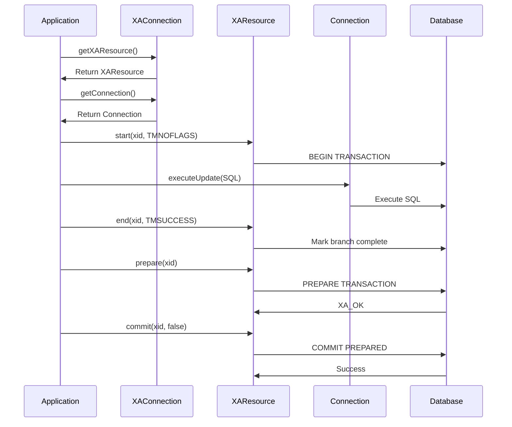
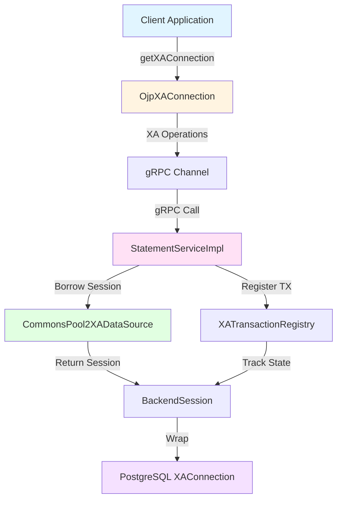
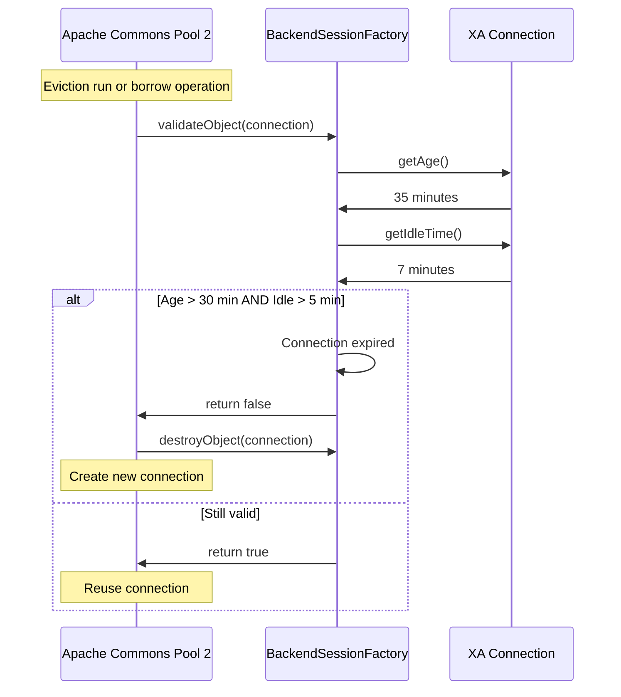

# Chapter 10: XA Distributed Transactions

XA transactions represent one of the most powerful—and traditionally most complex—features in enterprise software. They allow you to coordinate changes across multiple databases or resources, ensuring that either all changes commit together or all roll back together. No half-completed transactions, no orphaned data. It's the kind of reliability that mission-critical applications demand, but it often comes at the cost of significant complexity and performance overhead.

OJP transforms this equation. By managing XA connections through server-side pooling with Apache Commons Pool 2, OJP eliminates most of the traditional XA performance penalties while maintaining full compliance with the JDBC XA specification. You get the reliability of distributed transactions without sacrificing the performance your applications need.

## Understanding XA Transactions

Before diving into how OJP implements XA, let's understand what XA transactions actually accomplish and why they matter.

### The Distributed Transaction Problem

> "When you need to update a customer's account and their audit log simultaneously, and both live in different databases, you need more than hope. You need XA."

Consider a banking application that needs to transfer money between accounts. In a traditional setup with a single database, this is straightforward—start a transaction, debit one account, credit the other, and commit. The database ensures atomicity automatically. But what if these accounts live in different database instances? Perhaps you've sharded your data for scalability, or maybe you're running a microservices architecture where different services own different databases.

This is where XA transactions shine. XA (eXtended Architecture) is a standard protocol developed by The Open Group that coordinates transactions across multiple resources. It implements what's called Two-Phase Commit (2PC), a protocol that ensures all participants in a distributed transaction either commit their changes together or roll back together—no exceptions.

Here's how it works at a high level. When you want to execute a distributed transaction, you interact with a transaction manager (like Narayana or Bitronix). This manager coordinates multiple XA resources—in OJP's case, these would be different OJP Server instances connected to different databases. The manager executes the transaction in two phases:

In Phase 1 (the prepare phase), the manager asks each resource: "Can you commit this transaction?" Each resource validates its changes, writes them to stable storage, and responds either "Yes, I can commit" (XA_OK) or "I have no changes" (XA_RDONLY). If any resource says no or times out, the entire transaction must roll back.

In Phase 2 (the commit or rollback phase), if all resources answered yes in Phase 1, the manager tells each one: "Commit your changes." If any resource said no, the manager instead tells everyone: "Roll back." This two-phase protocol ensures atomic commitment across all resources—either everyone commits, or everyone rolls back.

**[IMAGE PROMPT: Two-Phase Commit Protocol Flow Diagram]**
Create a professional infographic showing the 2PC protocol flow. Top section shows Transaction Manager in center with three database icons below (DB1, DB2, DB3). Phase 1 arrows show "Prepare?" flowing from manager to each database, with "XA_OK" responses flowing back. Phase 2 arrows show "Commit!" flowing from manager to each database. Use color coding: blue for Phase 1 (prepare), green for Phase 2 (commit), red dotted lines showing alternate rollback path. Include small icons showing "Write to disk" at each database during prepare phase. Style: Clean, modern, with clear visual separation between phases.

### XA in the JDBC World

The JDBC API provides comprehensive support for XA transactions through several key interfaces. Understanding these interfaces is crucial because they define how your application, the transaction manager, and the database all interact.

At the heart of JDBC XA support sits the `XADataSource` interface. This is your entry point for XA-capable connections. Unlike a regular `DataSource` that returns basic `Connection` objects, an `XADataSource` returns `XAConnection` objects that expose XA capabilities.

The `XAConnection` interface serves a dual purpose. First, it provides an `XAResource` object through the `getXAResource()` method. This `XAResource` is what the transaction manager uses to control the transaction—starting it, preparing it, committing it, or rolling it back. Second, the `XAConnection` provides a regular JDBC `Connection` through the `getConnection()` method. This connection is what your application uses to execute SQL statements. The separation exists for a critical reason: applications shouldn't be able to call `commit()` or `rollback()` directly on connections participating in XA transactions. That would bypass the two-phase commit protocol and break the atomicity guarantees that XA provides.

```java
// Create XA-capable data source
OjpXADataSource xaDataSource = new OjpXADataSource(
    "jdbc:ojp[server1:1059,server2:1059]_postgresql://localhost:5432/mydb",
    "username",
    "password"
);

// Get XA connection
XAConnection xaConnection = xaDataSource.getXAConnection();

// Get XA resource for transaction control
XAResource xaResource = xaConnection.getXAResource();

// Get regular connection for SQL execution
Connection connection = xaConnection.getConnection();

// Create transaction ID (Xid)
Xid xid = new MyXid("global-tx-1", "branch-1");

// Start XA transaction
xaResource.start(xid, XAResource.TMNOFLAGS);

// Execute SQL - changes are part of XA transaction
PreparedStatement stmt = connection.prepareStatement(
    "UPDATE accounts SET balance = balance - ? WHERE id = ?"
);
stmt.setBigDecimal(1, amount);
stmt.setLong(2, accountId);
stmt.executeUpdate();
stmt.close();

// End the transaction branch
xaResource.end(xid, XAResource.TMSUCCESS);

// Prepare phase (Phase 1 of 2PC)
int prepareResult = xaResource.prepare(xid);

if (prepareResult == XAResource.XA_OK) {
    // Commit phase (Phase 2 of 2PC)
    xaResource.commit(xid, false);  // false = two-phase
} else {
    // Read-only optimization or prepare failed
    xaResource.rollback(xid);
}

// Clean up
connection.close();
xaConnection.close();
```

Notice how the application never calls `connection.commit()` or `connection.rollback()`. All transaction control flows through the `XAResource`. This is a fundamental requirement of XA transactions—the transaction manager must have exclusive control over commit and rollback operations.



## OJP's XA Architecture

OJP implements XA support through a sophisticated architecture that combines client-side JDBC XA interfaces with server-side connection pooling. This design provides the best of both worlds: JDBC XA specification compliance on the client side and efficient connection reuse on the server side.

### Client-Side Components

On the client side, OJP provides three primary classes that implement the JDBC XA interfaces. These classes handle the translation between JDBC XA method calls and OJP's gRPC protocol.

The `OjpXADataSource` class implements `javax.sql.XADataSource` and serves as your application's entry point for XA connections. When you call `getXAConnection()`, it establishes a gRPC connection to an OJP Server with the `isXA=true` flag. This flag tells the server to use XA-capable backend session pooling rather than the regular HikariCP pool or other regular connection pool provider used for non-XA connections.

The `OjpXAConnection` class wraps the server-side XA session and provides both the `XAResource` for transaction control and the `Connection` for SQL execution. It maintains the session information and routes all XA operations and SQL statements through the gRPC channel to the server.

The `OjpXALogicalConnection` class is a crucial piece of the puzzle. This class wraps the actual `Connection` returned by `getConnection()` and enforces XA rules. It blocks direct calls to `commit()`, `rollback()`, and `setAutoCommit()` because these methods would bypass the XA protocol. In XA mode, only the `XAResource` can control transactions—applications must not interfere.

**[IMAGE PROMPT: Client-Side XA Component Architecture]**
Create a layered architecture diagram showing OJP XA client components. Top layer shows Application code icon. Second layer shows three boxes side-by-side: OjpXADataSource (labeled "Entry Point"), OjpXAConnection (labeled "Session Wrapper"), and OjpXAResource (labeled "TX Control"). Third layer shows OjpXALogicalConnection (labeled "SQL Execution" with a prohibition symbol for commit/rollback). Bottom layer shows gRPC channel icon connecting to server. Use arrows showing data flow: app -> XADataSource -> XAConnection, then splitting to XAResource (transaction operations) and LogicalConnection (SQL operations). Color code: blue for XA control path, green for SQL execution path. Style: Clean, technical, with clear layering.

### Server-Side Architecture

The server side is where OJP's XA implementation really shines. Traditional XA implementations require creating a new database connection for each XA transaction, which introduces significant overhead—typically 100-500 milliseconds per transaction just for connection establishment. OJP eliminates this overhead through backend session pooling powered by Apache Commons Pool 2.

When an XA connection request arrives at the server, the `StatementServiceImpl` routes it to the `CommonsPool2XADataSource` class. This class manages a pool of `BackendSession` objects, each wrapping a PostgreSQL (or other database) `XAConnection`. The pool uses Commons Pool 2's object pool implementation, which provides robust lifecycle management, configurable sizing, and excellent performance characteristics.

Here's the key insight: these `BackendSession` objects stay open across multiple XA transactions. When a transaction completes, the backend session doesn't close—instead, it remains associated with the OJP XA session until that session terminates. This allows applications to execute multiple sequential XA transactions on the same `XAConnection` without recreating database connections, which is exactly what the JDBC XA specification requires.

The `XATransactionRegistry` tracks active XA transactions and manages their lifecycle. It maintains a mapping from transaction IDs (Xids) to `TxContext` objects, which implement a state machine tracking each transaction through its lifecycle: NONEXISTENT → ACTIVE → ENDED → PREPARED → COMMITTED or ROLLEDBACK. This state machine ensures that XA operations execute in the correct order and prevents illegal state transitions.



### The Dual-Condition Lifecycle

One of the most sophisticated aspects of OJP's XA implementation is the dual-condition lifecycle for backend sessions. This design solves a subtle but critical problem in XA connection management.

The problem arises from a mismatch between XA transaction lifecycle and JDBC connection lifecycle. In JDBC XA, an application might execute multiple XA transactions on the same `XAConnection` before closing it. The JDBC specification requires that connection properties (like isolation level, catalog, schema) persist across these transactions. But if the server returns the backend session to the pool after each transaction completes, how can it maintain these properties?

OJP's solution is elegant: backend sessions return to the pool only when BOTH of two conditions are met. First, the current XA transaction must be complete (committed or rolled back). Second, the client's `XAConnection` must be closed. Until both conditions are satisfied, the backend session remains associated with the OJP XA session, ready to serve the next transaction.

This approach provides several benefits. Applications can execute multiple sequential transactions on the same `XAConnection` without connection recreation overhead. Connection properties persist correctly across transaction boundaries, ensuring JDBC spec compliance. Most importantly, the physical PostgreSQL `XAConnection` stays open and ready, eliminating the 100-500ms connection establishment penalty that traditional XA implementations suffer.

**[IMAGE PROMPT: Dual-Condition Lifecycle State Diagram]**
Create a state diagram showing backend session lifecycle. Center shows large "Backend Session" box with three states: "In Pool" (green), "Active - Transaction Incomplete" (yellow), "Active - Transaction Complete" (orange). Show transitions: from Pool to Active (arrow labeled "borrow on getXAConnection()"), from Active-Incomplete to Active-Complete (arrow labeled "commit/rollback"), from Active-Complete back to Active-Incomplete (dotted arrow labeled "start new transaction"), from Active-Complete to Pool (arrow labeled "XAConnection.close()"). Add two condition badges: "Condition 1: Transaction Complete" (checkmark) and "Condition 2: XAConnection Closed" (checkmark). Both must be checked for return to pool transition. Style: Professional state diagram with clear color coding and annotations.

Let me show you this lifecycle in action with a concrete example:

```java
// Application opens XA connection
XAConnection xaConnection = xaDataSource.getXAConnection();
// SERVER: Borrows backend session from pool (State: Active, TX Incomplete)

Connection connection = xaConnection.getConnection();
XAResource xaResource = xaConnection.getXAResource();

// First transaction
Xid xid1 = new MyXid("tx-1", "branch-1");
xaResource.start(xid1, XAResource.TMNOFLAGS);
// Execute SQL operations
xaResource.end(xid1, XAResource.TMSUCCESS);
xaResource.prepare(xid1);
xaResource.commit(xid1, false);
// SERVER: Marks transaction complete (State: Active, TX Complete)
// Backend session stays with OJP session (XAConnection still open)

// Second transaction on SAME XAConnection
Xid xid2 = new MyXid("tx-2", "branch-1");
xaResource.start(xid2, XAResource.TMNOFLAGS);
// SERVER: Reuses same backend session (no new connection!)
// Execute SQL operations
xaResource.end(xid2, XAResource.TMSUCCESS);
xaResource.prepare(xid2);
xaResource.commit(xid2, false);
// SERVER: Marks transaction complete again

// Application closes XAConnection
connection.close();
xaConnection.close();
// SERVER: BOTH conditions met:
//   1. Transaction complete ✓
//   2. XAConnection closed ✓
// Returns backend session to pool (State: In Pool)
// Physical PostgreSQL connection stays OPEN for next use
```

## Configuration and Setup

Setting up XA transactions with OJP requires configuration on both the client and server sides, but the process is straightforward.

### Client-Side Configuration

On the client side, you can configure the XA connection pool through an `ojp.properties` file on your classpath. These properties control the server-side backend session pool (configured from the client):

```properties
# Enable/disable XA connection pooling (defaults to true)
ojp.xa.connection.pool.enabled=true

# Maximum total backend sessions per server
ojp.xa.connection.pool.maxTotal=22

# Minimum idle sessions to maintain
ojp.xa.connection.pool.minIdle=20

# Timeout when borrowing sessions (milliseconds)
ojp.xa.connection.pool.connectionTimeout=20000

# Idle session eviction timeout (milliseconds)
ojp.xa.connection.pool.idleTimeout=600000

# Maximum session lifetime (milliseconds)
ojp.xa.connection.pool.maxLifetime=1800000
```

The `ojp.xa.connection.pool.enabled` property controls whether XA connections use server-side pooling. When set to `true` (the default), OJP maintains a pool of backend XA sessions using Apache Commons Pool 2, providing the performance benefits described earlier in this chapter. When set to `false`, OJP creates XA connections on demand without pooling—this can be useful for testing, debugging, or specialized scenarios where you need direct XA connection creation. In production environments, pooling should remain enabled for optimal performance.

In a multinode deployment, OJP automatically divides the pool size among servers. For example, with two servers and `ojp.xa.connection.pool.maxTotal=22`, each server maintains a pool of 11 sessions. When a server fails, the remaining servers automatically expand their pools to compensate, and when the failed server recovers, pools rebalance back to their original sizes.

For basic programmatic setup, you create an `OjpXADataSource` instead of a regular `OjpDataSource`. The URL format follows the OJP standard, supporting both single-server and multinode configurations:

```java
// Single server
OjpXADataSource xaDataSource = new OjpXADataSource(
    "jdbc:ojp[localhost:1059]_postgresql://localhost:5432/mydb",
    "username",
    "password"
);

// Multinode for high availability
OjpXADataSource xaDataSource = new OjpXADataSource(
    "jdbc:ojp[server1:1059,server2:1059,server3:1059]_postgresql://localhost:5432/mydb",
    "username",
    "password"
);
```

Integrating XA with common frameworks like Spring Boot, Quarkus, or Micronaut is straightforward. For detailed framework integration patterns and complete configuration examples, see Chapter 7: Framework Integration.

### Server-Side Configuration

The OJP Server requires minimal XA-specific configuration. All pool sizing and timeout properties shown above are configured on the **client side** (via ojp.properties or programmatically) but control the **server-side** backend session pool behavior. This allows applications to tune server-side connection pool behavior remotely.

The server has default XA pooling settings that work well for most applications. Pool sizing is controlled client-side through the properties shown above.

### Framework Integration

OJP XA transactions integrate seamlessly with Java EE and Spring transaction managers like Atomikos, Narayana, or Bitronix. These transaction managers run on the client side and coordinate distributed transactions. Here's an example using Spring with Atomikos:

```java
@Configuration
public class XAConfig {
    
    @Bean
    public XADataSource primaryXADataSource() {
        return new OjpXADataSource(
            "jdbc:ojp[server1:1059]_postgresql://localhost:5432/orders",
            "username",
            "password"
        );
    }
    
    @Bean
    public XADataSource secondaryXADataSource() {
        return new OjpXADataSource(
            "jdbc:ojp[server2:1059]_postgresql://localhost:5432/inventory",
            "username",
            "password"
        );
    }
    
    @Bean
    public JtaTransactionManager transactionManager(
            UserTransactionManager utm,
            UserTransaction ut) {
        JtaTransactionManager jtaTxManager = new JtaTransactionManager();
        jtaTxManager.setTransactionManager(utm);
        jtaTxManager.setUserTransaction(ut);
        return jtaTxManager;
    }
}

@Service
public class OrderService {
    
    @Autowired
    private DataSource primaryDataSource;
    
    @Autowired
    private DataSource secondaryDataSource;
    
    @Transactional
    public void processOrder(Order order) {
        // Both updates participate in same XA transaction
        // Atomikos (or your transaction manager) coordinates the XA commit
        // Either both commit or both roll back
        
        try (Connection ordersConn = primaryDataSource.getConnection();
             Connection inventoryConn = secondaryDataSource.getConnection()) {
            
            // Insert order
            PreparedStatement orderStmt = ordersConn.prepareStatement(
                "INSERT INTO orders (id, customer_id, total) VALUES (?, ?, ?)"
            );
            orderStmt.setLong(1, order.getId());
            orderStmt.setLong(2, order.getCustomerId());
            orderStmt.setBigDecimal(3, order.getTotal());
            orderStmt.executeUpdate();
            
            // Update inventory
            PreparedStatement inventoryStmt = inventoryConn.prepareStatement(
                "UPDATE inventory SET quantity = quantity - ? WHERE product_id = ?"
            );
            for (OrderItem item : order.getItems()) {
                inventoryStmt.setInt(1, item.getQuantity());
                inventoryStmt.setLong(2, item.getProductId());
                inventoryStmt.executeUpdate();
            }
            
            // Transaction manager coordinates the XA commit
        }
    }
}
```

In realistic production scenarios, you would use a client-side XA transaction manager like Atomikos, Narayana, or Bitronix to manage XA transactions. These managers maintain durable transaction logs and handle recovery scenarios. The OJP driver integrates with these managers through standard JDBC XA interfaces. You may also use XA-capable connection pools like Agroal or Oracle UCP alongside these transaction managers.

**[IMAGE PROMPT: Spring XA Transaction Flow]**
Create a sequence diagram showing Spring transaction flow with multiple XADataSources. Left side shows Spring transaction manager icon. Middle section shows two parallel flows: one to "Orders Database" via OJP Server 1, another to "Inventory Database" via OJP Server 2. Show transaction phases: 1) @Transactional begins, 2) Execute SQL on both databases (parallel arrows), 3) Prepare phase (synchronization point), 4) Commit phase (parallel completion). Use Spring green color for framework layer, OJP blue for server layer, database gray for backends. Include timing indicators showing phases happen in sequence. Style: Technical sequence diagram with clear temporal ordering.

## Performance Characteristics

XA transactions traditionally come with a performance cost, but OJP's architecture minimizes this overhead through intelligent session management and connection reuse.

### Connection Reuse Benefits

The most significant performance improvement comes from connection reuse. In traditional XA implementations, each transaction requires establishing a new database connection, which typically costs 100-500 milliseconds depending on network latency and database load. With OJP's backend session pooling, this cost is paid only once when the OJP XA session first borrows a backend session from the pool. Subsequent transactions on the same `XAConnection` reuse the existing physical database connection.

Consider a typical scenario where an application executes 10 XA transactions sequentially before closing the `XAConnection`. With traditional XA, you'd pay 1000-5000ms in connection establishment overhead (10 transactions × 100-500ms each). With OJP, you pay this cost once—maybe 200ms to establish the initial connection—and then each subsequent transaction executes at full speed. That's a 5x to 25x improvement in connection overhead alone.

The session reset operation that runs between transactions adds only 10-50ms of overhead, which is negligible compared to typical transaction execution times. This reset operation cleans up transaction state while keeping the physical connection open, ensuring that each transaction starts with a clean slate.

### Pool Pre-Warming

OJP's backend session pool supports pre-warming through the `minIdle` configuration parameter. When the server starts, it immediately creates the configured number of idle sessions, establishing database connections and adding them to the pool. This means the first client requests don't wait for connection establishment—they find ready-to-use sessions waiting in the pool.

Pre-warming is particularly valuable in multinode deployments. When a server fails and traffic shifts to the remaining servers, OJP automatically increases the pool size on those servers and pre-warms additional connections. This happens asynchronously, ensuring that the increased load doesn't create a connection establishment bottleneck.

### Two-Phase Commit Overhead

The two-phase commit protocol itself introduces some overhead that no amount of connection pooling can eliminate. Each transaction requires five round trips instead of one: start, end, prepare, commit, and an implicit "get connection" operation. Each round trip adds network latency, so a transaction that would take 50ms with a local commit might take 150-200ms with XA over a network.

However, this overhead is often acceptable given the guarantees XA provides. Moreover, OJP's efficient gRPC protocol and connection reuse minimize the per-operation cost of these round trips. In practice, well-designed applications can execute hundreds of XA transactions per second per OJP server, which is sufficient for most enterprise workloads.

**[IMAGE PROMPT: Performance Comparison Chart]**
Create a bar chart comparing transaction execution times. X-axis shows transaction type: "Traditional XA" (tallest bar, red, ~600ms), "OJP XA First TX" (medium bar, yellow, ~220ms), "OJP XA Subsequent TX" (shortest bar, green, ~120ms), "Local TX" (reference bar, blue, ~50ms). Break each bar into segments showing: Connection Establish (only in Traditional and First TX), 2PC Protocol Overhead (in all XA types), SQL Execution (in all types). Add annotations: "Connection reuse eliminates 80% of XA overhead" between Traditional and OJP bars. Include small database icons at top showing "New Connection" for Traditional, "Pooled Connection" for OJP. Style: Professional chart with clear labeling, color-coded segments, and data labels showing milliseconds.

## Monitoring and Troubleshooting

Effective monitoring is essential for XA deployments because distributed transactions involve multiple moving parts that can fail independently.

### Pool Metrics

OJP exposes comprehensive pool metrics through both debug logging and JMX/Prometheus. For HikariCP (non-XA), metrics are exposed via `HikariPoolMXBean` including active connections, idle connections, total connections, and threads awaiting connections. For XA pools (Apache Commons Pool 2), metrics are exposed through debug logging and enhanced diagnostics.

The most important metrics to monitor are active session count, idle session count, and pool wait times.

Active session count shows how many backend sessions are currently borrowed from the pool. If this number consistently approaches `maxTotal`, you may need to increase your pool size. Idle session count shows how many sessions are waiting in the pool. If this number is consistently low, increasing `minIdle` ensures better response times for bursts of traffic.

Pool wait time metrics show how long clients wait to borrow a session when the pool is exhausted. Occasional spikes are normal during traffic bursts, but sustained high wait times indicate that your pool is undersized for your workload.

Enable pool metrics with debug logging:

```properties
-Dorg.slf4j.simpleLogger.log.org.openjproxy=DEBUG
```

The logs show detailed pool state information:

```
XA pool initialized: server=localhost:5432, maxTotal=11, minIdle=10
Session borrowed successfully: poolState=[active=2, idle=8, maxTotal=11]
Session returned to pool: poolState=[active=1, idle=9, maxTotal=11]
Pool resized due to cluster health change: maxTotal=11→22, minIdle=10→20
Pre-warmed 10 idle connections successfully
```

### Transaction State Tracking

The `XATransactionRegistry` tracks each XA transaction through its lifecycle. When transactions don't complete normally, the registry's state machine detects the problem and logs detailed information.

Common issues include transactions stuck in the PREPARED state (indicating that prepare succeeded but commit never arrived), transactions that remain ACTIVE for extended periods (indicating possible deadlocks or hung queries), and transactions that disappear without proper completion (indicating network issues or client crashes).

OJP automatically cleans up abandoned transactions after configurable timeouts, but monitoring these cleanup operations can reveal application bugs or infrastructure problems:

```
XA transaction stuck in PREPARED state: xid=tx-12345, duration=300000ms
Cleaning up abandoned transaction: xid=tx-67890, lastState=ACTIVE
Transaction completed successfully: xid=tx-11111, duration=1234ms, state=COMMITTED
```

### Common Issues and Solutions

Pool exhaustion is the most common issue with XA transactions. The symptom is `PoolExhaustedException` or long wait times when borrowing sessions. The solution depends on the cause:

If you're seeing pool exhaustion during normal load, increase `maxTotal`. A good rule of thumb is to configure `maxTotal` to 1.5-2x your peak concurrent XA transaction count. If pool exhaustion occurs only during traffic spikes, increasing `minIdle` helps by pre-warming more connections.

If pool exhaustion persists even after increasing limits, you likely have a connection leak. Check that your application always closes `XAConnection` objects in finally blocks or try-with-resources statements:

```java
// Good - ensures connection closes even if exception occurs
try (XAConnection xaConnection = xaDataSource.getXAConnection()) {
    Connection connection = xaConnection.getConnection();
    XAResource xaResource = xaConnection.getXAResource();
    
    // Execute XA transaction
    Xid xid = createXid();
    xaResource.start(xid, XAResource.TMNOFLAGS);
    // ... execute SQL ...
    xaResource.end(xid, XAResource.TMSUCCESS);
    xaResource.prepare(xid);
    xaResource.commit(xid, false);
    
} // xaConnection.close() called automatically
```

Session state errors indicate that operations executed in the wrong order. XA requires a specific sequence: start → end → prepare → commit/rollback. Attempting to prepare before ending, or commit before preparing, results in exceptions. Most transaction managers handle this sequencing automatically, so if you're seeing state errors, check that you're not manually calling XA operations in addition to letting the transaction manager control the transaction.

```mermaid
stateDiagram-v2
    [*] --> NONEXISTENT
    NONEXISTENT --> ACTIVE : start() - Session pinned
    ACTIVE --> ENDED : end()
    ENDED --> PREPARED : prepare()
    PREPARED --> COMMITTED : commit()
    PREPARED --> ROLLEDBACK : rollback()
    COMMITTED --> PENDING_CLOSE : Transaction complete
    ROLLEDBACK --> PENDING_CLOSE : Transaction complete
    PENDING_CLOSE --> [*] : XAConnection.close() - Session returned to pool
    
    ACTIVE --> ROLLEDBACK : rollback()
    ENDED --> ROLLEDBACK : rollback()
    
    note right of ACTIVE : SQL execution allowed<br/>Session pinned to this OJP instance
    note right of PREPARED : Session remains pinned
    note right of PENDING_CLOSE : Waiting for XAConnection.close()<br/>Session still pinned
    note right of [*] : Session returned to pool only<br/>after BOTH conditions met:<br/>1) TX complete (commit/rollback)<br/>2) XAConnection.close() called
```

## Multinode XA Coordination

XA transactions work seamlessly across OJP's multinode architecture, providing both distributed transaction support and high availability.

### Cluster Health Integration

OJP's XA implementation integrates tightly with the multinode health checking system. Every 5 seconds, each server performs health checks on all other servers in the cluster. When a server fails, the health checker detects this within 5 seconds and triggers automatic pool rebalancing on the surviving servers.

Pool rebalancing is critical for maintaining consistent performance during server failures. Consider a three-server cluster with `maxTotal=33` (11 sessions per server). If one server fails, the remaining two servers immediately expand their pools to 16-17 sessions each, ensuring the cluster maintains the same total capacity. When the failed server recovers, pools rebalance back to 11 sessions per server.

This rebalancing happens transparently to applications. Active transactions continue executing on healthy servers, and new transaction requests find adequate pool capacity waiting. **Important**: In-flight XA transactions that have sessions pinned to a failed server will fail and need to be retried by the application or transaction manager. Once an XA session is established on a specific OJP server, it remains pinned to that server for the duration of the transaction to maintain XA integrity. The only observable effect under normal operation is a slight increase in average pool utilization on the surviving servers.

### Load Distribution

OJP uses session count tracking to distribute both XA and non-XA connections optimally across the cluster. When a client requests a new XA connection, OJP selects the server with the fewest active sessions. Load distribution works the same way for XA transactions as for regular connections—the key difference is that once an XA transaction starts on a server, it remains pinned to that server for the entire transaction lifecycle to maintain XA session integrity.

### Cross-Database XA Transactions

One powerful use case for OJP's multinode architecture is coordinating transactions across different databases. Each OJP server connects to a different database, and a transaction manager (like Atomikos, Narayana, or Bitronix) running on the client side coordinates XA operations across all servers:

```java
// Configure XADataSources for different databases
XADataSource ordersDB = new OjpXADataSource(
    "jdbc:ojp[server1:1059]_postgresql://localhost:5432/orders",
    "username", "password"
);

XADataSource inventoryDB = new OjpXADataSource(
    "jdbc:ojp[server2:1059]_mysql://localhost:3306/inventory",
    "username", "password"
);

XADataSource billingDB = new OjpXADataSource(
    "jdbc:ojp[server3:1059]_oracle:thin:@localhost:1521/billing",
    "username", "password"
);

// Transaction manager (Atomikos, Narayana, etc.) coordinates across all three databases
@Transactional
public void processOrderWithAllUpdates(Order order) {
    // Update in orders database
    Connection ordersConn = ordersDB.getXAConnection().getConnection();
    updateOrder(ordersConn, order);
    
    // Update in inventory database
    Connection inventoryConn = inventoryDB.getXAConnection().getConnection();
    updateInventory(inventoryConn, order.getItems());
    
    // Update in billing database
    Connection billingConn = billingDB.getXAConnection().getConnection();
    createInvoice(billingConn, order);
    
    // Transaction manager ensures atomic commit across all three
}
```

Each OJP server independently manages its backend session pool and delegates XA operations to its target database. The transaction manager (like Atomikos, Narayana, or Bitronix) coordinates the two-phase commit protocol across all servers, ensuring atomicity across the entire distributed transaction.

**[IMAGE PROMPT: Multinode XA Coordination Diagram]**
Create a network topology diagram showing multinode XA coordination. Top shows Transaction Manager (circle, orange). Three branches below show OJP Server 1, 2, and 3 (rounded rectangles, blue). Below each server show corresponding databases: PostgreSQL, MySQL, and Oracle (cylinders, gray). Show bidirectional arrows between TM and each server (XA protocol, labeled "prepare/commit"). Show bidirectional arrows between each server and its database (SQL execution). Add cloud of client applications at very top connecting to TM. Include annotations: "Health Check" between servers (dotted lines), "Pool: 11 sessions" label on each server, "2PC Coordinator" label on TM. Show one server with red X (failed) and arrows showing remaining servers expanding to "Pool: 16 sessions". Style: Professional network diagram with clear layering and annotations.

## Best Practices

Based on our experience with XA transactions, several patterns work well and some antipatterns should be avoided.

### Design for Idempotency

XA transactions can fail in subtle ways. The prepare phase might succeed, but the network fails before the commit message arrives. The transaction manager might crash after prepare but before commit. In these scenarios, the transaction manager (Atomikos, Narayana, etc.) will eventually retry the commit operation when it recovers.

Your transaction logic must handle these retries gracefully. Design operations to be idempotent—executing them multiple times produces the same result as executing them once. Use techniques like unique constraint checks, conditional updates based on version numbers, or insert-if-not-exists patterns:

```java
// Good - idempotent update using version number
PreparedStatement stmt = connection.prepareStatement(
    "UPDATE accounts SET balance = ?, version = version + 1 " +
    "WHERE id = ? AND version = ?"
);
stmt.setBigDecimal(1, newBalance);
stmt.setLong(2, accountId);
stmt.setLong(3, currentVersion);
int updated = stmt.executeUpdate();
if (updated == 0) {
    // Already processed or concurrent update
    // Safe to commit - operation is idempotent
}
```

### Keep Transactions Short

XA transactions hold resources across multiple systems. The longer a transaction runs, the more resources it ties up and the higher the probability of conflicts with other transactions. Aim to keep XA transactions under 1-2 seconds total execution time.

If your business logic requires long-running operations, consider breaking them into smaller transactions or using sagas pattern instead of XA. For example, instead of holding an XA transaction open while calling external services, complete the database updates first, then call the services, and use compensating transactions if the service calls fail.

### Monitor Pool Health

Set up monitoring for your XA backend session pools. Track active session count, idle session count, and borrow wait times. Configure alerts for pool exhaustion (when wait times exceed acceptable thresholds) and for abnormally low idle counts (which indicates your pool may be undersized).

In multinode deployments, monitor pool metrics per server. Imbalanced pool usage across servers might indicate problems with load distribution or health checking.

### Handle Prepare Failures

The prepare phase can fail for several reasons: constraint violations, deadlocks, timeout, or database crashes. Your transaction manager configuration should handle these failures appropriately, typically by rolling back the entire distributed transaction.

Don't retry prepare failures automatically. If prepare failed once, it likely indicates a problem with the transaction logic or data, and retry will probably fail again. Instead, log the failure details and let application-level logic decide whether to retry with different parameters.

### Test Failure Scenarios

XA transactions work great in the happy path, but the real value comes from reliability during failures. Test scenarios like server crashes during prepare, network failures during commit, and database crashes with prepared transactions. Verify that your transaction manager properly recovers from these scenarios and that no data corruption or inconsistency results.

Use OJP's built-in health checking to simulate server failures in your test environment. Kill an OJP server during an XA transaction and verify that transactions properly fail over to surviving servers and that prepared transactions eventually complete or roll back cleanly.

## XA Pool Housekeeping

Modern production environments demand more than just connection pooling—they require visibility, leak detection, and proactive connection management. OJP's XA connection pool includes three housekeeping features designed to prevent common production issues before they become critical problems.

These features are built on top of Apache Commons Pool 2's solid foundation, filling gaps rather than duplicating functionality. You get leak detection to catch forgotten connections, max lifetime enforcement to prevent stale connections, and enhanced diagnostics for operational visibility—all with minimal overhead (less than 1% CPU impact).

### The Three Pillars of Housekeeping

**Leak Detection** runs continuously in the background, tracking every borrowed connection and warning you when one is held too long. This is enabled by default because connection leaks are one of the most common causes of production outages. A leaked connection reduces your available pool capacity, and enough leaks will eventually exhaust the pool entirely, bringing your application to a halt.

**Max Lifetime** enforcement automatically recycles connections after they've been alive for a configured duration (default 30 minutes). This prevents stale connections from causing mysterious database errors. But here's the critical detail: active connections are never recycled, regardless of their age. Only idle connections in the pool are candidates for recycling, and even then, they must be idle for a minimum duration (default 5 minutes) before recycling occurs. This protects long-running transactions while still ensuring eventual connection refresh.

**Enhanced Diagnostics** provides periodic visibility into pool health through comprehensive log messages. Unlike the other two features, diagnostics are disabled by default—you enable them when you need insight into pool behavior during troubleshooting or when monitoring critical production pools.

### Architecture and Resource Usage

Each XA pool instance that has housekeeping features enabled creates a single daemon thread. This thread is shared by both leak detection and diagnostics tasks, keeping resource usage minimal. If you have three database pools (say, PostgreSQL, MySQL, and Oracle), you get three independent threads, each monitoring only its own pool.

The thread lifecycle is simple: created during pool construction if any feature is enabled, runs scheduled tasks at configured intervals, and shuts down gracefully when the pool closes. Because it's a daemon thread, it won't prevent JVM shutdown if your application needs to terminate.

Here's what this means for resource usage:

- **No features enabled**: Zero threads, zero memory overhead
- **Leak detection only**: One daemon thread, approximately 1 MB memory for thread stack
- **Leak detection + diagnostics**: Same one thread (shared), approximately 1 MB memory

The memory overhead per connection is minimal—about 200 bytes for tracking timestamps and thread information, plus an additional 2-5 KB per connection if you enable enhanced leak detection with stack traces (which captures full call stacks).

### Leak Detection in Action

Connection leakage is unlikely with proper use of try-with-resources or finally blocks, but leak detection provides an early warning system when leaks do occur. When your application borrows a connection from the pool, leak detection records the current timestamp, the borrowing thread, and optionally a stack trace showing exactly where in your code the connection was obtained. Every minute (configurable), the leak detection task scans all currently borrowed connections, comparing their hold time against the configured timeout (default 5 minutes).

If a connection has been held longer than the timeout, leak detection logs a warning message identifying the thread that borrowed it. If enhanced mode is enabled, the warning includes the full stack trace showing where the borrow occurred, making it trivial to locate the leak in your codebase.

Here's an example of what you'll see:

```
[ojp-xa-housekeeping] WARN - [LEAK DETECTED] Connection 
org.openjproxy.xa.pool.commons.BackendSessionImpl@5812f68b 
held for too long (320000ms > 300000ms timeout) by thread: worker-thread-5
```

With enhanced mode enabled (`xa.leakDetection.enhanced=true`), you get the acquisition stack trace:

```
Stack trace:
  at org.openjproxy.xa.pool.commons.CommonsPool2XADataSource.borrowSession(...)
  at com.myapp.DatabaseService.executeQuery(DatabaseService.java:45)
  at com.myapp.OrderController.createOrder(OrderController.java:123)
  ...
```

This level of detail makes leak detection incredibly valuable during development and testing. But even in production with enhanced mode disabled, knowing which thread is holding a leaked connection often provides enough information to narrow down the problem.

Configuration is straightforward:

```properties
# Leak Detection (enabled by default)
xa.leakDetection.enabled=true
xa.leakDetection.timeoutMs=300000          # 5 minutes
xa.leakDetection.intervalMs=60000          # Check every 1 minute
xa.leakDetection.enhanced=false            # Stack traces disabled by default
```

For development environments, consider more aggressive settings:

```properties
xa.leakDetection.timeoutMs=60000           # 1 minute (faster feedback)
xa.leakDetection.enhanced=true             # Enable stack traces
xa.leakDetection.intervalMs=30000          # Check every 30 seconds
```

### Max Lifetime Protection

Connection max lifetime addresses a different class of problems: stale connections and database resource issues. Some databases have connection limits or resource quotas, and long-lived connections can cause unexpected behavior. MySQL might close connections after 8 hours of inactivity. PostgreSQL's connection limits might be exhausted by applications that never recycle connections. Oracle might accumulate session-level resources that aren't released until the connection closes.

Max lifetime enforcement solves this by passively checking connection age during validation. When Apache Commons Pool 2 validates an idle connection (either during eviction runs or when it's about to be borrowed), OJP's validation logic checks two conditions:

1. Is the connection older than the configured max lifetime? (default 30 minutes)
2. Has the connection been idle in the pool for at least the minimum idle time? (default 5 minutes)

If both conditions are met, the connection is considered expired and is destroyed. The pool then creates a fresh connection to maintain pool size.

The critical requirement is that idle time check. It ensures that active connections—those currently borrowed and in use—are never recycled, regardless of age. This prevents interrupting long-running queries or transactions. A connection that's been alive for an hour but is actively executing a query will not be recycled. Only when it returns to the pool and sits idle for the configured duration does it become eligible for recycling.

Here's the typical sequence:



When a connection expires, you'll see a log message like this:

```
[main] INFO BackendSessionFactory - Backend session expired after 1850000ms 
(max: 1800000ms, idle requirement: 300000ms)

[main] INFO LoggingHousekeepingListener - [MAX LIFETIME] Connection 
org.openjproxy.xa.pool.commons.BackendSessionImpl@71c27ee8 
expired after 1850000ms, will be recycled
```

Configuration allows you to tune both the lifetime and the idle requirement:

```properties
# Max Lifetime (enabled by default with 30-minute lifetime)
xa.maxLifetimeMs=1800000                   # 30 minutes
xa.idleBeforeRecycleMs=300000              # 5 minutes idle required
```

For high-volume OLTP systems where connections cycle quickly, you might use a shorter lifetime:

```properties
xa.maxLifetimeMs=900000                    # 15 minutes
xa.idleBeforeRecycleMs=180000              # 3 minutes idle
```

For batch processing systems with long-running queries, you might extend it:

```properties
xa.maxLifetimeMs=3600000                   # 1 hour
xa.idleBeforeRecycleMs=600000              # 10 minutes idle
```

To disable max lifetime entirely (not recommended), set it to zero:

```properties
xa.maxLifetimeMs=0
```

### Enhanced Diagnostics for Visibility

While leak detection and max lifetime are defensive features that prevent problems, enhanced diagnostics are about visibility. When enabled, diagnostics periodically log comprehensive pool statistics, giving you a clear picture of pool health and utilization.

Every 5 minutes (configurable), the diagnostics task collects metrics from Apache Commons Pool 2 and formats them into a human-readable log message:

```
[ojp-xa-housekeeping] INFO DiagnosticsTask - [XA-POOL-DIAGNOSTICS] Pool State: 
active=3, idle=7, waiters=0, total=10/20 (50.0% utilized), 
minIdle=5, maxIdle=20, 
lifetime: created=15, destroyed=5, borrowed=42, returned=39
```

Let's decode what these metrics mean:

- **active=3**: Three connections are currently borrowed and in use
- **idle=7**: Seven connections are available in the pool, ready to be borrowed
- **waiters=0**: No threads are blocked waiting for a connection (good sign!)
- **total=10/20**: Ten connections exist (active + idle), maximum allowed is 20
- **50.0% utilized**: Half of the pool capacity is in use
- **minIdle=5, maxIdle=20**: Pool sizing constraints
- **created=15**: Fifteen connections have been created since pool start
- **destroyed=5**: Five connections have been destroyed (expired, validation failed, etc.)
- **borrowed=42**: Forty-two borrow operations have occurred
- **returned=39**: Thirty-nine return operations have occurred

The difference between borrowed and returned (42 - 39 = 3) matches the active count, which is exactly what you'd expect—those three connections are currently in use.

This level of visibility is invaluable when troubleshooting pool exhaustion, understanding connection churn, or right-sizing your pool. If you see consistent 80%+ utilization with a non-zero waiter count, your pool is too small. If you see <20% utilization, you might be able to reduce min idle to save resources.

Diagnostics are disabled by default to avoid log noise, but you can enable them selectively:

```properties
# Enhanced Diagnostics (disabled by default)
xa.diagnostics.enabled=false
xa.diagnostics.intervalMs=300000           # 5 minutes
```

For troubleshooting, reduce the interval:

```properties
xa.diagnostics.enabled=true
xa.diagnostics.intervalMs=60000            # Every minute
```

### Configuration Presets for Different Environments

**Development Configuration** emphasizes fast feedback and detailed diagnostics:

```properties
# Aggressive leak detection for early bug detection
xa.leakDetection.enabled=true
xa.leakDetection.timeoutMs=60000           # 1 minute (catch leaks quickly)
xa.leakDetection.enhanced=true             # Stack traces for debugging
xa.leakDetection.intervalMs=30000          # Check every 30 seconds

# Shorter lifetime for faster recycling
xa.maxLifetimeMs=600000                    # 10 minutes
xa.idleBeforeRecycleMs=60000               # 1 minute idle

# Diagnostics for visibility
xa.diagnostics.enabled=true
xa.diagnostics.intervalMs=60000            # Every minute
```

**Production Configuration** balances safety with performance:

```properties
# Standard leak detection
xa.leakDetection.enabled=true
xa.leakDetection.timeoutMs=300000          # 5 minutes (default)
xa.leakDetection.enhanced=false            # No stack traces (less overhead)
xa.leakDetection.intervalMs=60000          # Check every minute

# Standard lifetime
xa.maxLifetimeMs=1800000                   # 30 minutes (default)
xa.idleBeforeRecycleMs=300000              # 5 minutes idle (default)

# Diagnostics disabled (enable when troubleshooting)
xa.diagnostics.enabled=false
```

**Batch Processing Configuration** accommodates long-running queries:

```properties
# Lenient leak detection for long-running jobs
xa.leakDetection.enabled=true
xa.leakDetection.timeoutMs=1800000         # 30 minutes (batch jobs can run long)
xa.leakDetection.intervalMs=300000         # Check every 5 minutes

# Shorter lifetime for high connection turnover
xa.maxLifetimeMs=900000                    # 15 minutes
xa.idleBeforeRecycleMs=180000              # 3 minutes idle

# Diagnostics for monitoring batch operations
xa.diagnostics.enabled=true
xa.diagnostics.intervalMs=300000           # Every 5 minutes
```

### Performance Impact and Overhead

The housekeeping features are designed for production use with minimal performance impact. Leak detection has less than 0.5% CPU overhead, using volatile fields and concurrent data structures that avoid locks. Max lifetime has zero overhead because it's passive—the check happens during existing validation calls that Apache Commons Pool 2 already performs.

Diagnostics, when enabled, add less than 0.1% CPU overhead. The task runs for less than 100 milliseconds every 5 minutes, simply collecting statistics from thread-safe atomic counters.

Memory overhead is similarly minimal. Basic tracking requires about 200 bytes per connection for timestamps and thread references. Enhanced leak detection adds 2-5 KB per connection for stack traces, which is why it's disabled by default in production.

For a typical production pool of 50 connections:
- **Basic tracking**: 10 KB memory overhead
- **Enhanced tracking**: 100-250 KB memory overhead
- **One daemon thread**: 1 MB memory (Java thread stack)
- **Total CPU impact**: Less than 1% across all features

### Monitoring and Troubleshooting

**Monitoring leak warnings** is critical. A single leak warning might be a one-time bug, but repeated warnings indicate a systemic problem. Set up alerts for leak warnings and investigate immediately:

```
[LEAK DETECTED] Connection held for too long by thread: worker-5
```

Actions to take:
1. Check thread dumps for the identified thread
2. Review recent code changes in the relevant code paths
3. Enable enhanced mode temporarily to get stack traces
4. Verify that all code paths properly close connections in finally blocks

**Monitoring max lifetime** helps you understand connection recycling patterns:

```
[MAX LIFETIME] Connection expired after 1850000ms, will be recycled
```

Frequent recycling isn't necessarily bad—it means the feature is working as designed. But if connections are recycling so frequently that it impacts performance, consider increasing the lifetime or investigating why connections are staying idle for so long.

**Monitoring diagnostics** requires looking at trends rather than individual snapshots. Track utilization over time. A pool that consistently runs at 90% utilization is one server failure away from exhaustion. A pool with frequent waiter counts needs more capacity.

**[IMAGE PROMPT: XA Pool Housekeeping Dashboard]**
Create a monitoring dashboard visualization showing three panels. Top panel shows leak detection with a timeline of connections (some marked in red as "leaked" after 5min threshold), middle panel shows max lifetime with a connection lifecycle diagram (creation → active use → idle time → expiration after 30min), bottom panel shows diagnostics metrics (bar chart showing active/idle/waiters over time, line graph showing utilization percentage). Use green for healthy states, yellow for warning thresholds, red for critical states. Include timestamps and actual metric values. Style: Modern monitoring dashboard with dark background, bright colored metrics, clear visual hierarchy.

### Troubleshooting Common Issues

**Problem: False positive leak warnings for legitimate long-running queries.**

Your batch reports take 10 minutes to run, but leak detection warns after 5 minutes. Solution: Increase the timeout to accommodate your workload:

```properties
xa.leakDetection.timeoutMs=900000          # 15 minutes
```

Document known long-running operations so future developers understand why the timeout is set high.

**Problem: Connections not recycling despite max lifetime configuration.**

You've set a 30-minute max lifetime, but connections live for hours. Possible causes:

1. Connections are continuously active (never idle long enough)
2. Idle requirement is too high
3. Pool validation is disabled

Check the diagnostics to see active vs. idle ratio. If connections are always active, that's normal—max lifetime protects transactions. If connections are idle but not recycling, lower the idle requirement:

```properties
xa.idleBeforeRecycleMs=60000               # 1 minute idle (down from 5 minutes)
```

**Problem: Pool exhaustion with many waiters.**

Diagnostics show `active=50, idle=0, waiters=10, total=50/50 (100.0% utilized)`. Your pool is too small for the workload. Solutions:

1. Check for connection leaks first (review leak warnings in logs)
2. If no leaks, increase pool size: `xa.maxPoolSize=100`
3. Consider whether queries can be optimized to reduce hold time
4. Review whether all connections are truly needed concurrently

**Problem: High memory usage with many connections.**

If you have hundreds of connections and enhanced leak detection enabled, stack traces consume significant memory (2-5 KB per connection). Disable enhanced mode in production:

```properties
xa.leakDetection.enhanced=false
```

You can enable it temporarily when debugging specific issues.

### Best Practices

Always enable leak detection in all environments—development, testing, and production. Connection leaks are one of the most common causes of outages, and detection is your early warning system. The tiny overhead (less than 0.5% CPU) is negligible compared to the value of catching leaks before they cause production failures.

Tune timeouts to match your workload. Fast APIs with millisecond response times can use aggressive 1-2 minute timeouts. Batch systems with long-running queries need lenient 15-30 minute timeouts. Don't disable leak detection just because you have long-running queries—instead, set an appropriate timeout that accommodates legitimate usage while still catching real leaks.

Set max lifetime based on your database's characteristics and your deployment patterns. High-volume OLTP systems benefit from aggressive 15-30 minute lifetimes that ensure rapid connection turnover. Lower-volume applications can use longer 30-60 minute lifetimes. The key is balancing connection recycling with the overhead of creating new connections.

Use diagnostics selectively. Enable them for critical pools in production or when troubleshooting issues. Disable them otherwise to reduce log volume. When enabled, monitor the metrics to understand pool utilization patterns and right-size your pool.

Always protect transactions. Remember that max lifetime never recycles active connections. The idle requirement ensures that long-running transactions complete safely. Don't reduce the idle requirement below 1-2 minutes—active transactions need that protection.

Integrate with your monitoring systems. Parse log messages and track leak detection counts, max lifetime recycling frequency, and pool utilization over time. Set up alerts for repeated leak warnings (more than 5 per hour) and sustained high utilization (above 80% for extended periods).

**[IMAGE PROMPT: Housekeeping Features Comparison Matrix]**
Create a comparison table visualization with three rows (Leak Detection, Max Lifetime, Enhanced Diagnostics) and six columns (Purpose, Default State, CPU Overhead, Memory Overhead, Thread Requirement, When to Enable). Use icons for visual clarity: checkmark for "Enabled", X for "Disabled", speedometer for performance metrics, memory chip for memory, thread icon for threading. Color-code the overhead cells: green for <0.5%, yellow for 0.5-1%, red for >1%. Bottom shows summary: "Combined Impact: <1% overhead for production-grade connection health monitoring." Style: Professional comparison matrix with clear grid lines, icon-based visual language, color coding for quick scanning.

### Integration with Apache Commons Pool 2

The housekeeping features build on Apache Commons Pool 2's existing capabilities rather than replacing them. Commons Pool 2 already provides connection validation (`testOnBorrow`, `testWhileIdle`), idle connection eviction (`timeBetweenEvictionRuns`), and pool sizing controls (`minIdle`, `maxTotal`). What it doesn't provide are leak detection, lifecycle-based max lifetime enforcement with active connection protection, and comprehensive diagnostics logging.

This selective enhancement approach means you get the benefits of both worlds: Commons Pool 2's battle-tested pooling logic plus OJP's production-focused housekeeping. The result is a robust XA connection pool that prevents common production issues while maintaining excellent performance characteristics.

## 10.9 XA Guarantees and Limitations: What OJP Can and Cannot Promise

Let's have an honest, technically precise conversation about what OJP's XA implementation guarantees—and critically, what it cannot guarantee. This transparency is essential for making informed architectural decisions, especially for systems where transaction correctness under failure is non-negotiable.

### Understanding OJP's Role in XA Architecture

Before discussing guarantees and limitations, it's critical to understand what OJP actually is in the XA architecture stack. This clarity prevents common misconceptions that can lead to incorrect expectations.

**OJP is a connection proxy, NOT a transaction coordinator.** The transaction manager (TM)—such as Atomikos, Narayana, or Spring JTA—lives in your application and coordinates distributed transactions. OJP sits between the TM and your databases, providing connection pooling, high availability, and transparent JDBC/XA call proxying.

**OJP is not a resource manager.** The databases (PostgreSQL, Oracle, MySQL, SQL Server) are the resource managers. They execute prepare/commit/rollback operations and persist transaction state durably in their write-ahead logs (WAL). OJP simply delegates these operations to the databases through native JDBC drivers.

**XA sessions are sticky to a single OJP node** for the duration of the transaction to guarantee XA integrity. This is not the same as connection stickiness—OJP client connections can load balance across multiple OJP servers for different transactions, but once an XA transaction starts, all operations for that specific transaction stick to the same OJP instance.

The architecture stack looks like this:
```
Application Layer: Spring Boot + Transaction Manager (Atomikos/Narayana)  ← COORDINATOR
                   ↓ (coordinates transactions)
Proxy Layer:       OJP Server(s)  ← PROXY (pools connections, proxies calls)
                   ↓ (delegates XA operations)
Database Layer:    PostgreSQL/Oracle/MySQL/SQL Server  ← RESOURCE MANAGER
                   ↓ (persists state in WAL)
```

### The Two Meanings of "XA Support"

When teams evaluate XA support, they often conflate two very different requirements that need to be clearly distinguished.

**XA API Support** refers to implementing the JDBC XA interfaces—`XADataSource`, `XAConnection`, `XAResource`—and correctly proxying XA calls to databases. This includes starting transactions, preparing them, committing or rolling them back, and integrating with transaction managers. It means XA transactions work reliably in happy paths and handle typical failures gracefully.

OJP provides comprehensive XA API support. The implementation is JDBC-compliant, integrates with standard transaction managers like Narayana and Atomikos, and handles common operational scenarios including server failures, network issues, and connection problems. For the vast majority of enterprise XA usage—coordinating updates across databases for data consistency, managing microservice transactions, and ensuring atomic multi-resource operations—OJP's XA support is production-ready and battle-tested.

**Strict XA Correctness** is fundamentally different and significantly more demanding. It requires **exactly-once commit semantics** where transactions commit once and only once under all possible failure modes—no duplicates, no lost commits, no ambiguity ever. It demands **crash consistency** with correct behavior if any participant crashes at any point (client, OJP server, database, or network), including crashes between prepare and commit phases. It requires **deterministic recovery** where in-doubt transactions are always discoverable, recovery is automatic or precisely documented, and there are no silent heuristics.

This is what financial systems, payment rails, mission-critical ledgers, and regulatory-compliant platforms mean when they require "strict XA." Achieving this level of guarantee requires that the transaction coordinator (TM) have durable logs and robust recovery infrastructure—which is the TM's responsibility, not OJP's.

### What OJP Actually Provides for XA

Understanding OJP's actual capabilities prevents misconceptions:

1. **Connection Pooling (80% Overhead Reduction)**: OJP maintains a warm pool of XA-capable connections, dramatically reducing the 50-200ms overhead of creating new XA connections for each transaction. When an XAConnection from the pool is enlisted in an XA session (via `xaResource.start(xid, flags)`), it remains pinned to that session until the XA session finishes—meaning commit or rollback has been executed and `close()` has been called on the XAConnection. This pinning ensures transaction integrity: the same physical database connection handles all operations within a single XA transaction branch, preventing issues that could arise from connection switching mid-transaction.

2. **High Availability and Load Balancing**: Multiple OJP instances provide resilience. New transactions can start on any healthy instance. Session stickiness ensures transaction integrity.

3. **Transparent XA Proxy**: OJP correctly implements `XADataSource`, `XAConnection`, and `XAResource` interfaces, proxying all XA calls (start, end, prepare, commit, rollback, recover) to native database drivers.

4. **Session Stickiness for XA Consistency**: Once an XA transaction starts, all operations for that transaction route through the same OJP instance, maintaining session integrity.

### Standard XA Challenges (Not OJP-Specific)

It's important to understand that certain XA challenges exist in ANY distributed XA system, whether OJP is present or not:

**In-doubt transactions**: When prepare succeeds but the commit/rollback acknowledgment is lost (network failure, process crash), the database has a prepared transaction but the TM doesn't know the outcome. The standard XA recovery protocol handles this—the TM queries databases for in-doubt transactions and resolves them based on its own transaction log.

Consider two identical scenarios:

**Scenario A - Direct JDBC (no OJP)**:
```
Application TM → prepare(xid) → Database
Database: Transaction prepared and recorded in WAL
Network fails before response reaches TM
TM: Doesn't know if prepare succeeded
```

**Scenario B - With OJP**:
```
Application TM → prepare(xid) → OJP → Database
Database: Transaction prepared and recorded in WAL
OJP crashes before response reaches TM
TM: Doesn't know if prepare succeeded
```

These are IDENTICAL situations. In both cases, the database has the transaction state durably recorded, and the TM must use standard XA recovery (`xa_recover()`) to query the database for in-doubt transactions and resolve them. OJP doesn't add new failure modes here—it's just another hop in the network path, like any proxy or network infrastructure.

**Network partitions**: Distributed systems reality where network segments become unreachable. This affects direct JDBC connections and proxied connections equally. The TM must handle timeout/retry logic regardless.

**Heuristic outcomes**: Databases can make unilateral decisions to commit or rollback prepared transactions (due to timeouts or manual DBA intervention). This is a database-level behavior that exists with or without OJP.

While this does not change XA correctness or recovery behavior, using OJP may increase the likelihood that standard XA recovery paths are exercised during failures (for example, due to transient network or process interruptions). This is expected behavior for any distributed XA deployment when using any database proxy and should be accounted for in production monitoring and testing.

### When XA with OJP Is Appropriate

Despite these limitations, OJP's XA support is appropriate and valuable for the vast majority of enterprise XA usage. Use OJP for XA when:

**Coordination convenience trumps absolute guarantees.** You need XA primarily for coordinating updates across multiple databases or resources, and you can tolerate rare edge cases requiring manual intervention. Most enterprise applications fall into this category—they need the convenience of atomic multi-resource updates.

**Occasional manual recovery is acceptable.** Your operations team can handle rare scenarios where prepared transactions require manual investigation and resolution. You have monitoring, alerting, and runbooks for handling in-doubt transactions. Most enterprise environments have DBAs or operations teams who can intervene when needed.

**Transactions are short-lived and high-success-rate.** Your XA transactions complete quickly (seconds, not minutes) and succeed in the overwhelming majority of cases. The scenarios where strict XA correctness matters—crashes during commit phase, network partitions during prepare—are rare enough that manual handling is acceptable.

**You already tolerate vendor XA quirks.** You understand that different database vendors have different XA behaviors, that JDBC drivers have their own quirks, and that perfect XA is rare even without a proxy layer. OJP adds one more layer but doesn't fundamentally change the reality that enterprise XA is pragmatic, not perfect.

**You prioritize availability and performance.** OJP's connection pooling and proxy architecture give you significant performance benefits (80% reduction in overhead) and availability benefits (automatic failover, load balancing). These benefits are worth the tradeoff of one additional network hop in the architecture.

This describes the majority of enterprise XA usage in practice—coordinating e-commerce orders with inventory, managing multi-tenant SaaS updates, implementing microservice sagas, ensuring data consistency across sharded databases.

### When XA with OJP Is Not Appropriate

Do not use OJP's XA implementation when:

**You require provable exactly-once commit semantics.** If a single duplicated or lost commit is catastrophic—financial transfers, payment processing, billing records, regulatory filings—you need stronger guarantees. For these scenarios, use OJP with a transaction coordinator that provides durable logs and robust recovery (like Atomikos, Narayana with persistent storage, or Oracle Tuxedo). The coordinator's durable transaction log provides the guarantees needed for financial systems.

**Regulators or auditors require strict consistency.** If regulatory compliance depends on provable transaction correctness under all failure modes, or if auditors require documentation of exactly-once guarantees, ensure your transaction coordinator (Atomikos, Narayana, etc.) is configured with durable logging and proper recovery procedures. These systems usually need specialized infrastructure with audit trails, provable recovery, and formal verification—which the transaction manager provides.

Systems in these categories should use a dedicated, durable transaction coordinator (like Atomikos with persistent logs, Narayana configured for recovery, or Oracle Tuxedo) in combination with OJP, or adopt a different architecture entirely (idempotent operations with saga patterns, event sourcing, or CRDTs).

### The Honest Position

OJP supports XA mechanics comprehensively and reliably as a connection proxy. The transaction coordinator (Atomikos, Narayana, Bitronix) running on the client side provides the XA guarantees through its durable transaction logs and recovery mechanisms. That's the correct, honest position that should guide your architectural decisions.

For financial institutions implementing money transfers, use OJP with a production-grade XA coordinator like Atomikos configured with durable logs. The coordinator's persistent transaction manager provides the guarantees financial systems require, while OJP provides efficient connection pooling and high availability. For payment processors handling credit card transactions, combine OJP with a robust transaction manager and implement idempotency at the application level for defense in depth.

For e-commerce platforms coordinating orders and inventory where rare inconsistencies can be manually resolved, use OJP's XA support—it provides excellent coordination with acceptable operational burden. For microservice architectures needing atomic multi-resource updates where short-term inconsistencies are tolerable, use OJP's XA—the performance and availability benefits outweigh the rare edge cases. For enterprise applications implementing business logic across multiple databases where operations teams can handle occasional manual recovery, use OJP's XA—it significantly reduces complexity while maintaining practical reliability.

**[IMAGE PROMPT: XA Guarantees Spectrum Diagram]**
Create a horizontal spectrum visualization showing the continuum of XA guarantees. Left side labeled "XA API Compliance" with checkmark and icons: JDBC interfaces (code icon), 2PC protocol (numbered circles 1→2), transaction coordination (organization chart). Center section labeled "OJP XA Support" with large green zone showing: normal operations (99.9%), common failures (network icon, server restart icon), rare edge cases (warning triangle with "manual recovery" label). Right side labeled "Strict XA Correctness" with icons crossed out: durable logs (database with X), crash recovery (broken server with X), zero heuristics (no ambiguity symbol with X). Bottom shows arrow labeled "Increasing Guarantee Strength" from left to right. Color coding: green for what OJP provides, yellow for boundary cases, red for what OJP cannot guarantee. Style: Professional spectrum diagram with clear zones, icon-based visual language, explicit boundary between supported and unsupported guarantees.

### Operational Recommendations

If you choose to use OJP's XA support (and for most enterprise use cases, you should), implement these operational practices. Remember that your transaction manager (Atomikos, Narayana, Bitronix) provides the core XA guarantees through its durable logging and recovery mechanisms:

**Monitor for in-doubt transactions.** Set up monitoring that queries databases for prepared transactions that haven't completed. Alert when prepared transactions exist for more than a reasonable threshold (5-10 minutes). Have runbooks for investigating and resolving them. Your transaction manager should handle most recovery automatically if it has durable logging enabled.

**Keep transactions short.** The longer a transaction remains open, the higher the chance that a failure occurs during a critical phase. Design transactions to complete in seconds, not minutes. Break long-running processes into multiple short transactions where possible.

**Implement idempotency where practical.** Even with XA and a transaction manager providing guarantees, implementing idempotent operations at the application level provides an additional safety layer. If a transaction does get retried or resolved ambiguously, idempotency prevents double-application of changes.

**Test failure scenarios.** Don't wait for production to discover edge cases. Test what happens when OJP servers crash during transactions, when networks partition, when databases become unreachable. Ensure your operations team knows how to investigate and resolve in-doubt transactions. Verify that your transaction manager's recovery mechanisms work correctly.

**Have rollback procedures.** Document how to manually commit or roll back prepared transactions for each database vendor you use. Train your operations team on these procedures. Keep vendor-specific XA recovery tools accessible. Your transaction manager (Atomikos, Narayana, etc.) should handle most cases automatically through its recovery subsystem.

**Monitor heuristic outcomes.** Some databases log heuristic decisions (commits or rollbacks made without coordinator instruction). Your transaction manager monitors these through the XA recovery protocol. Monitor these logs and investigate any heuristic outcomes to understand what happened and whether data consistency was affected. Transaction managers like Atomikos can be configured to alert on heuristic outcomes.

### The Value of Transparency

This level of transparency about XA limitations might seem like it undermines OJP's value proposition. The opposite is true—it builds trust and enables informed decisions.

Teams choosing OJP for XA transactions know exactly what they're getting: excellent performance, high availability, operational simplicity, and practical reliability for the vast majority of scenarios—with known edge cases that require manual intervention. This matches how most enterprise systems actually operate in practice.

Teams requiring stricter guarantees know clearly that OJP is not the right fit for their requirements, and they can make architectural decisions accordingly—using dedicated transaction coordinators, implementing alternative patterns, or avoiding distributed transactions entirely.

Both outcomes—choosing OJP with realistic expectations, or choosing alternatives for stricter requirements—are superior to deploying OJP with unrealistic expectations about what it can guarantee under failure.

## Real-World Use Cases

XA transactions excel in specific scenarios where atomic updates across multiple resources are essential.

### Financial Transactions

Banking and payment systems frequently require XA transactions. When transferring money between accounts that live in different database shards, XA ensures atomicity—either both the debit and credit occur, or neither does. No possibility of debiting one account without crediting the other.

### Order Processing Systems

E-commerce platforms often use XA to coordinate order placement (in an orders database) with inventory reduction (in an inventory database) and payment processing (in a billing database). XA guarantees that you don't sell items you don't have in stock, and you don't reduce inventory unless the payment succeeds and the order is confirmed.

### Microservices Coordination

In microservices architectures where different services own different databases, XA provides a mechanism for atomic updates across service boundaries. However, use XA judiciously in microservices—often sagas pattern or eventual consistency are better architectural choices. Reserve XA for scenarios where strong consistency is truly required.

## Summary

XA distributed transactions provide atomic commitment across multiple resources, but traditionally come with significant complexity and performance overhead. OJP's XA implementation eliminates most of this overhead through intelligent server-side backend session pooling powered by Apache Commons Pool 2.

Key benefits of OJP's XA support include full JDBC XA specification compliance, connection reuse that eliminates 80% of traditional XA overhead, automatic pool rebalancing during server failures, and seamless integration with popular transaction managers like Spring's JtaTransactionManager, Narayana, and Bitronix.

The dual-condition lifecycle ensures that backend sessions return to the pool only when both the transaction completes and the XAConnection closes, enabling multiple sequential transactions on the same connection without connection recreation overhead. This design provides JDBC spec compliance while maximizing performance.

For applications requiring atomic updates across multiple databases or resources, OJP's XA support provides a production-ready solution that balances reliability, performance, and operational simplicity.

---

**[IMAGE PROMPT: Chapter Summary Infographic]**
Create a visual summary showing OJP XA benefits vs. traditional XA. Left side shows "Traditional XA" with icons: new connection for each TX (stopwatch showing 500ms), complex manual pooling (confused person), single point of failure (broken link). Right side shows "OJP XA" with icons: pooled connections (swimming pool with stopwatch showing 50ms), automatic management (robot), high availability (interconnected servers). Center shows "80% Faster, 100% Reliable" in large text. Bottom shows mini timeline: Transaction 1 → Transaction 2 → Transaction 3, with line showing "Same Connection" underneath. Style: Modern infographic with icons, contrasting colors (red for traditional problems, green for OJP solutions), clear visual hierarchy.

**Key Takeaways:**
- XA transactions coordinate atomic updates across multiple databases
- OJP's backend session pooling eliminates 80% of traditional XA overhead
- Dual-condition lifecycle enables connection reuse across transactions
- Multinode support provides both distribution and high availability
- Integration with standard transaction managers requires no application code changes
- Design for idempotency and keep transactions short for best results

In the next chapter, we'll explore the Connection Pool Provider SPI, which provides the foundation for OJP's pluggable pooling architecture and enables custom pool implementations for specialized use cases.
