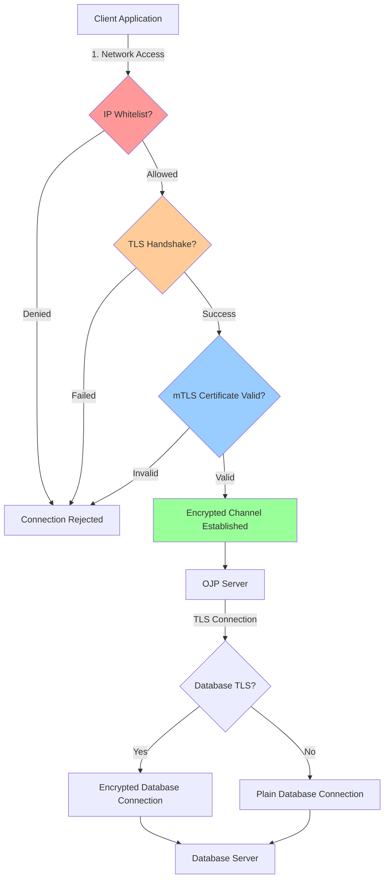
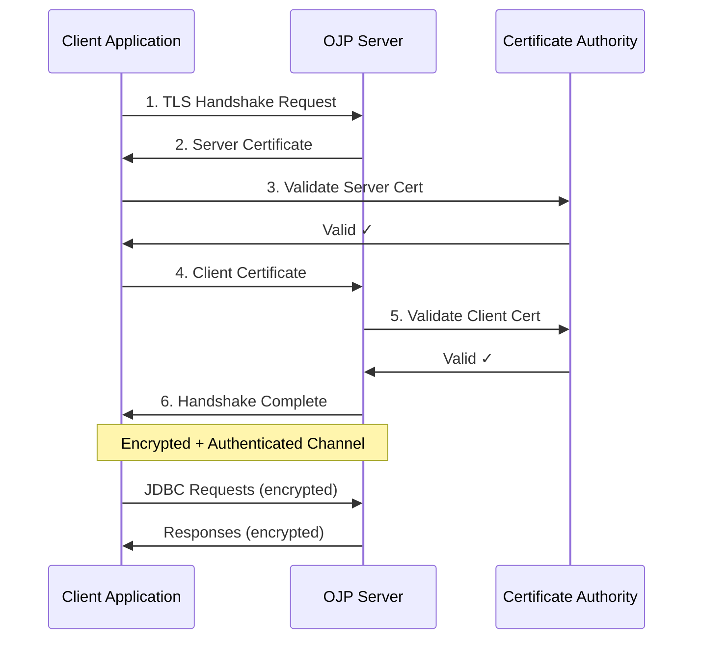

# Chapter 11: Security & Network Architecture

Security is not just a feature—it's a fundamental aspect of running OJP in production. When your proxy server sits between applications and databases, it becomes a critical component in your security posture. This chapter covers the complete security landscape: encrypting traffic between all components, implementing mutual TLS authentication, designing secure network architectures, and following security best practices.

## 11.1 Security Overview

OJP's security model follows a defense-in-depth approach with multiple layers working together. At the network level, you control which clients can connect through IP whitelisting (covered in Chapter 6). At the transport level, TLS encryption protects data in transit. At the application level, mutual TLS provides strong authentication. And at the architectural level, network segregation limits the blast radius of any potential compromise.

Understanding these layers and how they interact is crucial for designing a secure OJP deployment. Each layer addresses different threat models: IP whitelisting prevents unauthorized network access, TLS encryption protects against eavesdropping and man-in-the-middle attacks, mTLS provides strong authentication without passwords, and network segregation contains breaches. Together, they create a robust security posture that protects your most critical asset—your data.

**[IMAGE PROMPT: Create a multi-layered security diagram showing OJP Server at the center with four concentric rings/shields: outermost ring labeled "Network Segregation" (showing isolated network zones), second ring "IP Whitelisting" (showing firewall rules), third ring "TLS Encryption" (showing encrypted tunnel), innermost ring "mTLS Authentication" (showing certificate exchange). Use blue/green color gradient from outer to inner rings. Show threat types blocked at each layer (network intrusion, unauthorized access, eavesdropping, impersonation). Style: Professional infographic with clear layer separation and security shield icons.]**



## 11.2 SSL/TLS Between OJP Server and Databases

The first security boundary is between your OJP Server and backend databases. Encrypting this connection protects sensitive data as it travels across your network, particularly important when OJP and your database are in different network segments or data centers.

### Why Encrypt Database Connections?

Database connections carry your most sensitive information—user credentials, personal data, financial records, healthcare information. Without encryption, this data travels in plaintext across network cables, switches, and routers. Any compromise at the network level exposes everything. TLS encryption renders intercepted traffic unreadable, protecting confidentiality even if network security is breached.

Beyond compliance requirements (GDPR, HIPAA, PCI-DSS typically mandate encryption in transit), encrypted connections provide integrity guarantees. TLS ensures that data isn't modified in transit, protecting against sophisticated attacks that alter data between application and database. This integrity protection is just as important as confidentiality.

**[IMAGE PROMPT: Create a before/after comparison diagram. LEFT side shows "Without TLS" - OJP Server connected to Database with transparent pipe showing readable SQL queries, passwords, and data flowing (labeled "Plaintext - Vulnerable to Interception"). RIGHT side shows "With TLS" - same connection but with opaque encrypted tunnel, showing padlock icons and encrypted data symbols (labeled "Encrypted - Protected from Eavesdropping"). Include a hacker icon with X on the right side showing blocked attack. Use red for left, green for right. Style: Clear visual comparison with security indicators.]**

### PostgreSQL SSL Configuration

PostgreSQL provides the most straightforward SSL configuration. The driver supports multiple SSL modes that offer different levels of security and verification.

**Connection String Configuration:**

```properties
# Basic SSL (encrypts but doesn't verify server)
jdbc:postgresql://dbhost:5432/mydb?ssl=true&sslmode=require

# Verify server certificate against CA
jdbc:postgresql://dbhost:5432/mydb?ssl=true&sslmode=verify-ca&sslrootcert=/path/to/ca-cert.pem

# Full verification including hostname
jdbc:postgresql://dbhost:5432/mydb?ssl=true&sslmode=verify-full&sslrootcert=/path/to/ca-cert.pem

# Client certificate authentication (mTLS)
jdbc:postgresql://dbhost:5432/mydb?ssl=true&sslmode=verify-full&sslcert=/path/to/client-cert.pem&sslkey=/path/to/client-key.pem&sslrootcert=/path/to/ca-cert.pem
```

**OJP Server Configuration:**

In your `ojp.properties` file, specify the backend JDBC URL with SSL parameters:

```properties
# PostgreSQL with full SSL verification
ojp.backend.jdbc.url=jdbc:postgresql://dbhost:5432/mydb?ssl=true&sslmode=verify-full&sslrootcert=/etc/ojp/certs/ca-cert.pem
ojp.backend.jdbc.username=ojp_user
ojp.backend.jdbc.password=${DB_PASSWORD}
```

**SSL Mode Reference:**

| Mode | Encryption | Server Verification | Hostname Verification | Use Case |
|------|------------|-------------------|---------------------|----------|
| `disable` | No | No | No | Development only (never production) |
| `allow` | Opportunistic | No | No | Legacy compatibility |
| `prefer` | Opportunistic | No | No | Transitioning to SSL |
| `require` | Yes | No | No | Basic encryption without trust |
| `verify-ca` | Yes | Yes (CA) | No | Verify server authenticity |
| `verify-full` | Yes | Yes (CA) | Yes | Maximum security (recommended) |

**Certificate Management:**

For production deployments, proper certificate management is essential:

```bash
# Generate CA certificate (one-time)
openssl req -new -x509 -days 3650 -keyout ca-key.pem -out ca-cert.pem

# Generate server certificate request
openssl req -newkey rsa:2048 -keyout server-key.pem -out server-req.pem -nodes

# Sign server certificate with CA
openssl x509 -req -in server-req.pem -CA ca-cert.pem -CAkey ca-key.pem -CAcreateserial -out server-cert.pem -days 365

# For client certificates (mTLS)
openssl req -newkey rsa:2048 -keyout client-key.pem -out client-req.pem -nodes
openssl x509 -req -in client-req.pem -CA ca-cert.pem -CAkey ca-key.pem -CAcreateserial -out client-cert.pem -days 365
```

### MySQL/MariaDB SSL Configuration

MySQL and MariaDB use similar SSL configuration, with some differences in parameter names:

```properties
# MySQL with SSL
jdbc:mysql://dbhost:3306/mydb?useSSL=true&requireSSL=true&verifyServerCertificate=true&trustCertificateKeyStoreUrl=file:/path/to/truststore.jks&trustCertificateKeyStorePassword=changeit

# MariaDB with SSL
jdbc:mariadb://dbhost:3306/mydb?useSsl=true&serverSslCert=/path/to/server-cert.pem

# Client certificate authentication (mTLS)
jdbc:mysql://dbhost:3306/mydb?useSSL=true&requireSSL=true&clientCertificateKeyStoreUrl=file:/path/to/keystore.jks&clientCertificateKeyStorePassword=changeit
```

MySQL typically uses Java keystores (JKS format) rather than PEM files:

```bash
# Convert PEM certificate to JKS keystore
keytool -import -alias mysql-ca -file ca-cert.pem -keystore truststore.jks -storepass changeit

# Import client certificate for mTLS
openssl pkcs12 -export -in client-cert.pem -inkey client-key.pem -out client.p12 -name client
keytool -importkeystore -srckeystore client.p12 -srcstoretype PKCS12 -destkeystore keystore.jks -deststoretype JKS
```

### Oracle SSL Configuration

Oracle requires the Oracle Wallet for SSL configuration, which is more complex but provides robust security:

```properties
# Oracle with SSL using wallet
jdbc:oracle:thin:@(DESCRIPTION=(ADDRESS=(PROTOCOL=tcps)(HOST=dbhost)(PORT=2484))(CONNECT_DATA=(SERVICE_NAME=mydb))(SECURITY=(SSL_SERVER_CERT_DN="CN=dbhost,O=MyOrg,C=US")))

# Oracle wallet location (set as JVM property)
-Doracle.net.wallet_location=/path/to/wallet
-Djavax.net.ssl.trustStore=/path/to/wallet/truststore.jks
-Djavax.net.ssl.trustStorePassword=changeit
```

Oracle Wallet setup:

```bash
# Create Oracle Wallet
orapki wallet create -wallet /path/to/wallet -auto_login

# Add trusted certificate
orapki wallet add -wallet /path/to/wallet -trusted_cert -cert ca-cert.pem

# Add client certificate for mTLS
orapki wallet add -wallet /path/to/wallet -user_cert -cert client-cert.pem -pwd wallet_password
```

### SQL Server SSL Configuration

SQL Server uses the `encrypt` parameter for TLS configuration:

```properties
# SQL Server with encryption
jdbc:sqlserver://dbhost:1433;databaseName=mydb;encrypt=true;trustServerCertificate=false;trustStore=/path/to/truststore.jks;trustStorePassword=changeit

# Client certificate authentication
jdbc:sqlserver://dbhost:1433;databaseName=mydb;encrypt=true;integratedSecurity=false;authentication=SqlPassword;clientCertificate=/path/to/client-cert.pem;clientKey=/path/to/client-key.pem
```

### SSL Certificate Path Placeholders

One of the challenges with SSL/TLS configuration in OJP deployments is that certificate files reside on the OJP Server, not on client machines. Hardcoding certificate paths in JDBC connection URLs is inflexible and makes it difficult to manage certificates across different environments (development, staging, production).

OJP Server 0.4.0-beta+ introduces **property placeholder support** that allows you to use placeholders like `${ojp.server.sslrootcert}` in JDBC URLs. The server automatically resolves these placeholders to actual certificate paths at runtime using JVM system properties or environment variables.

**How It Works:**

1. **Client Configuration**: In your `ojp.properties` file, use placeholders in the JDBC URL:
   ```properties
   # Note: In actual properties files, the URL must be on a single line
   ojp.datasource.url=jdbc:ojp[localhost:1059]_postgresql://dbhost:5432/mydb?ssl=true&sslmode=verify-full&sslrootcert=${ojp.server.sslrootcert}
   ```

2. **Server Configuration**: Start the OJP Server with JVM properties or environment variables:
   ```bash
   # Using JVM properties
   java -jar ojp-server.jar -Dojp.server.sslrootcert=/etc/ojp/certs/ca-cert.pem
   
   # Or using environment variables (property names converted to uppercase with underscores)
   export OJP_SERVER_SSLROOTCERT=/etc/ojp/certs/ca-cert.pem
   java -jar ojp-server.jar
   ```

3. **Runtime Resolution**: When the server receives the connection request, it resolves `${ojp.server.sslrootcert}` to `/etc/ojp/certs/ca-cert.pem` before establishing the database connection.

**Security Validation:**

To prevent security vulnerabilities when a client is compromised, OJP implements strict whitelist-based validation of property names. Only property names matching specific patterns are allowed:

- **Must start with**: `ojp.server.` or `ojp.client.`
- **Can contain**: Alphanumeric characters, dots (`.`), hyphens (`-`), and underscores (`_`)
- **Length limits**: Suffix must be 1-200 characters (total property name up to 211 characters)

**Why This Security Is Critical:**

If a malicious actor compromises a client application, they could attempt to inject unauthorized placeholders into JDBC URLs. Without validation, this could lead to:
- **System property exposure**: Reading sensitive system properties like `${java.home}` or `${user.home}`
- **Command injection**: Using special characters like `;`, `|`, or `&` to execute commands
- **SQL injection**: Injecting malicious SQL through certificate path parameters
- **Path traversal**: Accessing files outside intended directories (e.g., `../../../etc/passwd`)

The whitelist validation blocks all these attacks:

```properties
# Valid placeholders (allowed)
${ojp.server.sslrootcert}           ✓
${ojp.server.mysql.truststore}      ✓
${ojp.client.config-value}          ✓

# Blocked attacks
${java.home}                        ✗ System property exposure
${ojp.server.cert;rm -rf /}         ✗ Command injection
${ojp.server.cert../../../passwd}   ✗ Path traversal
```

When an invalid property name is detected, the server:
1. Immediately rejects the connection
2. Throws a `SecurityException` with violation details
3. Logs the security violation for audit purposes

**Database-Specific Examples:**

PostgreSQL:
```properties
ojp.datasource.url=jdbc:ojp[localhost:1059]_postgresql://dbhost:5432/mydb?ssl=true&sslmode=verify-full&sslrootcert=${ojp.server.sslrootcert}&sslcert=${ojp.server.sslcert}&sslkey=${ojp.server.sslkey}
```

MySQL:
```properties
ojp.datasource.url=jdbc:ojp[localhost:1059]_mysql://dbhost:3306/mydb?useSSL=true&requireSSL=true&trustCertificateKeyStoreUrl=${ojp.server.mysql.truststore}&trustCertificateKeyStorePassword=${ojp.server.mysql.truststorePassword}
```

Oracle (with placeholders):
```properties
ojp.datasource.url=jdbc:ojp[localhost:1059]_oracle:thin:@dbhost:2484/myservice?oracle.net.wallet_location=${ojp.server.oracle.wallet}
```

Oracle (JVM-based without placeholders):
```properties
# Simple URL - Oracle JDBC natively reads JVM properties
ojp.datasource.url=jdbc:ojp[localhost:1059]_oracle:thin:@(DESCRIPTION=(ADDRESS=(PROTOCOL=TCPS)(HOST=dbhost)(PORT=2484))(CONNECT_DATA=(SERVICE_NAME=myservice)))

# Server started with JVM properties (no placeholders needed)
java -jar ojp-server.jar \
  -Doracle.net.wallet_location=/etc/ojp/wallet \
  -Doracle.net.ssl_server_dn_match=true
```

SQL Server:
```properties
ojp.datasource.url=jdbc:ojp[localhost:1059]_sqlserver://dbhost:1433;databaseName=mydb;encrypt=true;trustStore=${ojp.server.sqlserver.truststore};trustStorePassword=${ojp.server.sqlserver.truststorePassword}
```

DB2:
```properties
ojp.datasource.url=jdbc:ojp[localhost:1059]_db2://dbhost:50001/mydb:sslConnection=true;sslTrustStoreLocation=${ojp.server.db2.truststore};sslTrustStorePassword=${ojp.server.db2.truststorePassword};
```

**Alternative: JVM-Based SSL Configuration**

Some databases, particularly **Oracle**, support reading SSL configuration directly from JVM system properties without requiring URL parameters. This approach works when:
- SSL properties are standardized across all connections
- You want to avoid exposing certificate paths in connection URLs
- The JDBC driver natively supports JVM property resolution

For Oracle, you can configure SSL entirely through JVM properties:
```bash
java -jar ojp-server.jar \
  -Doracle.net.wallet_location=/etc/ojp/wallet \
  -Doracle.net.tns_admin=/etc/ojp/tns \
  -Doracle.net.ssl_server_dn_match=true \
  -Doracle.net.ssl_version=1.2
```

MySQL and SQL Server also support standard Java SSL properties (`javax.net.ssl.trustStore`, `javax.net.ssl.keyStore`) for basic SSL, but driver-specific properties still require URL parameters or placeholders.

**Best Practices:**

1. **Use descriptive property names** that clearly indicate purpose and environment:
   ```bash
   -Dojp.server.postgresql.prod.sslrootcert=/etc/certs/prod/ca.pem
   -Dojp.server.mysql.dev.truststore=/etc/certs/dev/truststore.jks
   ```

2. **Organize certificates by database and environment**:
   ```
   /etc/ojp/certs/
   ├── postgresql/
   │   ├── prod/
   │   │   ├── ca-cert.pem
   │   │   ├── client-cert.pem
   │   │   └── client-key.pem
   │   └── dev/
   │       └── ...
   ├── mysql/
   │   ├── prod/
   │   │   ├── truststore.jks
   │   │   └── keystore.jks
   │   └── dev/
   │       └── ...
   └── oracle/
       ├── prod/
       │   └── wallet/
       └── dev/
           └── wallet/
   ```

3. **Secure file permissions** on certificate files:
   ```bash
   # Use find for better portability across shells
   find /etc/ojp/certs \( -name '*.pem' -o -name '*.jks' \) -exec chmod 400 {} \;
   chown -R ojp-server:ojp-server /etc/ojp/certs
   ```

4. **Never commit credentials** to version control—use environment-specific configuration:
   ```bash
   # Development
   export OJP_SERVER_MYSQL_TRUSTSTOREPASSWORD=dev_password
   
   # Production (use secrets management)
   export OJP_SERVER_MYSQL_TRUSTSTOREPASSWORD=$(vault read -field=password secret/ojp/mysql/truststore)
   ```

For complete details on SSL certificate placeholder configuration, including security considerations, troubleshooting, and advanced scenarios, see the [SSL/TLS Certificate Configuration Guide](../configuration/ssl-tls-certificate-placeholders.md).

### Testing SSL Connections

Always test your SSL configuration before deploying to production:

```bash
# Test PostgreSQL SSL connection
psql "postgresql://dbhost:5432/mydb?sslmode=verify-full&sslrootcert=/path/to/ca-cert.pem" -U myuser

# Test MySQL SSL connection
mysql --host=dbhost --ssl-ca=/path/to/ca-cert.pem --ssl-verify-server-cert -u myuser -p

# Verify encryption is active (PostgreSQL)
SELECT * FROM pg_stat_ssl WHERE pid = pg_backend_pid();

# Verify encryption is active (MySQL)
SHOW STATUS LIKE 'Ssl_cipher';
```

## 11.3 mTLS Between JDBC Driver and OJP Server

Mutual TLS (mTLS) provides the strongest authentication model for gRPC connections between your applications and the OJP Server. Unlike traditional password-based authentication, mTLS uses certificate-based authentication where both client and server prove their identities cryptographically. This eliminates password-related vulnerabilities (weak passwords, password reuse, credential theft) and provides non-repudiation—you can prove which client made which connection.

### Understanding gRPC mTLS

gRPC is built on HTTP/2 over TLS, making it naturally suited for certificate-based authentication. With mTLS enabled, every connection undergoes a mutual handshake: the server presents its certificate to the client (proving server identity), and the client presents its certificate to the server (proving client identity). Both certificates must be signed by a trusted Certificate Authority (CA), and neither can be expired or revoked.

This bidirectional trust model means compromising a single component doesn't grant access—an attacker needs both a valid client certificate and the server's trust. Combined with certificate rotation and revocation capabilities, mTLS provides enterprise-grade security suitable for sensitive production environments.

**[IMAGE PROMPT: Create a sequence diagram showing mTLS handshake between Client Application and OJP Server. Show 6 steps: 1) Client initiates connection, 2) Server sends its certificate, 3) Client validates server certificate against CA, 4) Client sends its certificate, 5) Server validates client certificate against CA, 6) Encrypted channel established. Use different colors for client-to-server (blue) and server-to-client (green) messages. Show certificate icons and CA validation steps. Include padlock icon when channel is established. Style: Clear technical sequence diagram with labeled steps.]**



### Generating Certificates for mTLS

Setting up mTLS starts with certificate generation. You need a Certificate Authority (CA), server certificates, and client certificates. Here's a complete workflow:

**Step 1: Create Certificate Authority**

```bash
# Generate CA private key
openssl genrsa -out ca-key.pem 4096

# Generate CA certificate (valid for 10 years)
openssl req -new -x509 -days 3650 -key ca-key.pem -out ca-cert.pem \
  -subj "/C=US/ST=State/L=City/O=MyOrg/OU=IT/CN=MyOrg Root CA"

# Secure the CA key (critical - protect this file!)
chmod 400 ca-key.pem
```

**Step 2: Generate OJP Server Certificate**

```bash
# Generate server private key
openssl genrsa -out ojp-server-key.pem 2048

# Create certificate signing request
openssl req -new -key ojp-server-key.pem -out ojp-server.csr \
  -subj "/C=US/ST=State/L=City/O=MyOrg/OU=IT/CN=ojp-server.internal.company.com"

# Sign server certificate with CA (valid for 1 year)
openssl x509 -req -in ojp-server.csr -CA ca-cert.pem -CAkey ca-key.pem \
  -CAcreateserial -out ojp-server-cert.pem -days 365

# Verify server certificate
openssl verify -CAfile ca-cert.pem ojp-server-cert.pem
```

**Step 3: Generate Client Certificate**

```bash
# Generate client private key
openssl genrsa -out ojp-client-key.pem 2048

# Create certificate signing request
openssl req -new -key ojp-client-key.pem -out ojp-client.csr \
  -subj "/C=US/ST=State/L=City/O=MyOrg/OU=IT/CN=app-server-01.internal.company.com"

# Sign client certificate with CA (valid for 1 year)
openssl x509 -req -in ojp-client.csr -CA ca-cert.pem -CAkey ca-key.pem \
  -CAcreateserial -out ojp-client-cert.pem -days 365

# Verify client certificate
openssl verify -CAfile ca-cert.pem ojp-client-cert.pem
```

**Step 4: Convert to Java Keystore Format**

gRPC in Java uses keystores and truststores:

```bash
# Create server keystore
openssl pkcs12 -export -in ojp-server-cert.pem -inkey ojp-server-key.pem \
  -out ojp-server.p12 -name ojp-server -password pass:changeit

keytool -importkeystore -srckeystore ojp-server.p12 -srcstoretype PKCS12 \
  -srcstorepass changeit -destkeystore ojp-server-keystore.jks \
  -deststoretype JKS -deststorepass changeit

# Create server truststore (for client certificates)
keytool -import -alias ca -file ca-cert.pem -keystore ojp-server-truststore.jks \
  -storepass changeit -noprompt

# Create client keystore
openssl pkcs12 -export -in ojp-client-cert.pem -inkey ojp-client-key.pem \
  -out ojp-client.p12 -name ojp-client -password pass:changeit

keytool -importkeystore -srckeystore ojp-client.p12 -srcstoretype PKCS12 \
  -srcstorepass changeit -destkeystore ojp-client-keystore.jks \
  -deststoretype JKS -deststorepass changeit

# Create client truststore (for server certificate)
keytool -import -alias ca -file ca-cert.pem -keystore ojp-client-truststore.jks \
  -storepass changeit -noprompt
```

### Configuring OJP Server for mTLS

Configure the OJP Server to require client certificates:

```bash
# Start OJP Server with mTLS enabled
java -Dojp.server.tls.enabled=true \
     -Dojp.server.tls.keystore.path=/path/to/ojp-server-keystore.jks \
     -Dojp.server.tls.keystore.password=changeit \
     -Dojp.server.tls.truststore.path=/path/to/ojp-server-truststore.jks \
     -Dojp.server.tls.truststore.password=changeit \
     -Dojp.server.tls.client.auth=REQUIRE \
     -jar ojp-server.jar
```

Or using environment variables:

```bash
export OJP_SERVER_TLS_ENABLED=true
export OJP_SERVER_TLS_KEYSTORE_PATH=/path/to/ojp-server-keystore.jks
export OJP_SERVER_TLS_KEYSTORE_PASSWORD=changeit
export OJP_SERVER_TLS_TRUSTSTORE_PATH=/path/to/ojp-server-truststore.jks
export OJP_SERVER_TLS_TRUSTSTORE_PASSWORD=changeit
export OJP_SERVER_TLS_CLIENT_AUTH=REQUIRE

java -jar ojp-server.jar
```

**Configuration Properties Reference:**

| Property | Description | Values |
|----------|-------------|--------|
| `ojp.server.tls.enabled` | Enable TLS for gRPC | `true`, `false` (default) |
| `ojp.server.tls.keystore.path` | Server certificate keystore location | File path |
| `ojp.server.tls.keystore.password` | Keystore password | Encrypted string |
| `ojp.server.tls.truststore.path` | Client certificate truststore location | File path |
| `ojp.server.tls.truststore.password` | Truststore password | Encrypted string |
| `ojp.server.tls.client.auth` | Client certificate requirement | `NONE`, `OPTIONAL`, `REQUIRE` |

### Configuring JDBC Driver for mTLS

Client applications need keystore (client certificate) and truststore (to verify server):

```java
import com.zaxxer.hikari.HikariConfig;
import com.zaxxer.hikari.HikariDataSource;
import javax.sql.DataSource;

public class DataSourceConfig {
    
    public DataSource createSecureDataSource() {
        // Set system properties for client TLS
        System.setProperty("ojp.client.tls.enabled", "true");
        System.setProperty("ojp.client.tls.keystore.path", "/path/to/ojp-client-keystore.jks");
        System.setProperty("ojp.client.tls.keystore.password", "changeit");
        System.setProperty("ojp.client.tls.truststore.path", "/path/to/ojp-client-truststore.jks");
        System.setProperty("ojp.client.tls.truststore.password", "changeit");
        
        HikariConfig config = new HikariConfig();
        config.setJdbcUrl("jdbc:ojp://ojp-server.internal.company.com:1059/postgresql://dbhost:5432/mydb");
        config.setUsername("app_user");
        config.setPassword("app_password");
        config.setMaximumPoolSize(20);
        
        return new HikariDataSource(config);
    }
}
```

Or via `ojp.properties` file on the classpath:

```properties
# Client mTLS configuration
ojp.client.tls.enabled=true
ojp.client.tls.keystore.path=/path/to/ojp-client-keystore.jks
ojp.client.tls.keystore.password=changeit
ojp.client.tls.truststore.path=/path/to/ojp-client-truststore.jks
ojp.client.tls.truststore.password=changeit

# Connection settings
ojp.connection.url=jdbc:ojp://ojp-server.internal.company.com:1059/postgresql://dbhost:5432/mydb
```

### Certificate Rotation and Management

Production environments require certificate lifecycle management:

**Certificate Expiration Monitoring:**

```bash
# Check certificate expiration
openssl x509 -in ojp-server-cert.pem -noout -dates

# Check days until expiration
openssl x509 -in ojp-server-cert.pem -noout -checkend 2592000  # 30 days
```

**Rotation Strategy:**

1. **Generate new certificates 30 days before expiration**
2. **Add new certificates to keystores without removing old ones**
3. **Deploy updated keystores to all components**
4. **Verify new certificates are working**
5. **Remove expired certificates after grace period**

**Automated Rotation with Let's Encrypt (for external-facing deployments):**

```bash
# Install certbot
apt-get install certbot

# Generate certificates
certbot certonly --standalone -d ojp-server.example.com

# Convert to JKS
openssl pkcs12 -export -in /etc/letsencrypt/live/ojp-server.example.com/fullchain.pem \
  -inkey /etc/letsencrypt/live/ojp-server.example.com/privkey.pem \
  -out ojp-server.p12 -name ojp-server -password pass:changeit

keytool -importkeystore -srckeystore ojp-server.p12 -srcstoretype PKCS12 \
  -destkeystore ojp-server-keystore.jks -deststoretype JKS

# Automate renewal
echo "0 0 * * 0 certbot renew --deploy-hook /path/to/update-keystores.sh" | crontab -
```

### Testing mTLS Configuration

Verify your mTLS setup before production deployment:

```bash
# Test TLS connection (should succeed with valid client cert)
openssl s_client -connect ojp-server.internal.company.com:1059 \
  -cert ojp-client-cert.pem -key ojp-client-key.pem -CAfile ca-cert.pem

# Test without client cert (should fail)
openssl s_client -connect ojp-server.internal.company.com:1059 -CAfile ca-cert.pem

# Java client test
java -Dojp.client.tls.enabled=true \
     -Dojp.client.tls.keystore.path=ojp-client-keystore.jks \
     -Dojp.client.tls.keystore.password=changeit \
     -Dojp.client.tls.truststore.path=ojp-client-truststore.jks \
     -Dojp.client.tls.truststore.password=changeit \
     -jar test-app.jar
```

**[IMAGE PROMPT: Create a certificate lifecycle flowchart showing: "Certificate Generation" (day 0) → "Deployment" (day 1) → "Active Use" (days 2-335) → "Expiration Warning" (day 335, yellow alert) → "Rotation Begins" (day 350, orange) → "New Certificate Active" (day 360) → "Old Certificate Removed" (day 365+30). Show calendar icons and color progression from green (early) to yellow (warning) to orange (critical). Include automation arrows for monitoring and rotation. Style: Process flowchart with time-based progression and alert indicators.]**

## 11.4 Network Segregation Patterns

Network architecture determines your security posture as much as encryption and authentication. Where you place your OJP Server within your network topology affects attack surfaces, compliance requirements, and operational complexity. Let's explore the three primary patterns and when to use each.

### Pattern 1: OJP in Application Network

**Architecture:**

```
[Internet] → [Load Balancer] → [Application Network]
                                  ├─ App Servers
                                  ├─ OJP Server ←─┐
                                  └────────────────┘
                                         ↓
                                  [Database Network]
                                  └─ Database Servers
```

In this pattern, OJP Server resides in the same network segment as your application servers, with the database tier in a separate protected network. Applications connect to OJP over the local network, and OJP connects to databases across a network boundary.

**Advantages:**

- **Low Latency:** Applications and OJP communicate over the local network with minimal network hops (typically <1ms latency)
- **Simple Configuration:** No complex routing rules needed for application-to-OJP communication
- **Easy Troubleshooting:** Network diagnostics are straightforward with all components in the same subnet
- **Flexible Scaling:** Applications and OJP can scale independently within the same network

**Disadvantages:**

- **Database Exposure:** Every application server needs network access to the database tier through OJP
- **Compliance Complexity:** Some frameworks (PCI-DSS, HIPAA) prefer databases completely isolated from application networks
- **Attack Surface:** Compromised application servers have a direct path to the database network via OJP

**Best For:**

- Internal applications with moderate security requirements
- Development and staging environments
- Microservices architectures with service mesh
- Deployments prioritizing performance over maximum isolation

**[IMAGE PROMPT: Create a network topology diagram showing three zones from top to bottom: "Internet" (cloud icon) → "Application Network" zone (containing 3 app servers and 1 OJP server in light blue box) → "Database Network" zone (containing 2 database servers in darker blue box). Show firewall icons between zones. Highlight the connection path from App Servers → OJP (local network, green) and OJP → Database (cross-zone, orange with firewall). Include latency indicators (~0.5ms local, ~2ms cross-zone). Style: Clean network diagram with zone separation and traffic flow indicators.]**

### Pattern 2: OJP in Database Network

**Architecture:**

```
[Internet] → [Load Balancer] → [Application Network]
                                  └─ App Servers
                                         ↓
                                  [Database Network]
                                  ├─ OJP Server
                                  └─ Database Servers
```

Here, OJP Server sits within the database network tier, fully isolated from the application network. Applications reach OJP across a network boundary, and OJP communicates with databases over the local network.

**Advantages:**

- **Maximum Database Protection:** Databases never receive direct connections from the application tier
- **Compliance-Friendly:** Satisfies requirements for database tier isolation (PCI-DSS Level 1, HIPAA)
- **Reduced Attack Surface:** Application compromises don't grant database network access
- **Database Performance:** OJP-to-database communication has minimal latency

**Disadvantages:**

- **Application Latency:** Cross-network boundary adds latency (typically 2-5ms per request)
- **Complex Firewall Rules:** Requires allowing gRPC traffic from application network to database network
- **Operational Overhead:** Changes to application network topology require database network firewall updates
- **Single Point of Failure Risk:** OJP becomes critical—its failure isolates the entire database tier

**Best For:**

- High-security environments (financial services, healthcare, government)
- Compliance-driven architectures
- Production systems handling sensitive data
- Organizations with strict database access policies

**[IMAGE PROMPT: Create a network topology diagram showing: "Application Network" zone (top, containing 4 app servers in light gray box) connected via firewall to "Database Network" zone (bottom, containing 1 OJP server and 3 database servers in dark blue box). Show firewall rules explicitly: "Allow gRPC :1059 from App Network" and "Deny All Other Traffic". Highlight App→OJP path (cross-boundary, orange with latency ~3ms) and OJP→DB path (local, green with latency <1ms). Show shield icons on Database Network. Style: Professional architecture diagram with security emphasis and clear zone boundaries.]**

### Pattern 3: OJP in Dedicated DMZ/Middleware Network

**Architecture:**

```
[Internet] → [Load Balancer] → [Application Network]
                                  └─ App Servers
                                         ↓
                                  [Middleware Network]
                                  └─ OJP Server
                                         ↓
                                  [Database Network]
                                  └─ Database Servers
```

This pattern introduces a third network tier specifically for middleware components like OJP. Applications connect to the middleware network, and middleware connects to the database network. Each boundary has independent security controls.

**Advantages:**

- **Defense in Depth:** Three network boundaries provide layered security
- **Blast Radius Limitation:** Compromise in any single tier doesn't grant access to others
- **Independent Scaling:** Middleware tier scales without affecting application or database networks
- **Audit and Compliance:** Clear separation satisfies strict regulatory requirements
- **Flexible Security Policies:** Each boundary can have different rules and monitoring

**Disadvantages:**

- **Maximum Latency:** Two network boundaries add latency (typically 3-8ms per request)
- **Operational Complexity:** Three networks to manage, monitor, and secure
- **Cost:** Additional network infrastructure and firewall appliances required
- **Troubleshooting Difficulty:** Network issues span multiple tiers, complicating diagnostics

**Best For:**

- Enterprise environments with mature network operations
- Zero-trust architecture implementations
- Multi-tenant SaaS platforms
- Highly regulated industries requiring maximum separation
- Organizations with dedicated network security teams

**[IMAGE PROMPT: Create a three-tier network diagram showing: "Application Network" (top tier, light blue with app servers) → Firewall 1 → "Middleware Network" (middle tier, green with OJP servers) → Firewall 2 → "Database Network" (bottom tier, dark blue with databases). Show traffic flow vertically with latency annotations (~2ms per firewall hop). Include monitoring icons on each firewall. Show "Security Zone 1", "Security Zone 2", "Security Zone 3" labels. Highlight that app-to-database requires crossing two boundaries. Style: Enterprise architecture diagram with emphasis on defense in depth and zone isolation.]**

### Pattern Comparison Matrix

| Aspect | App Network | Database Network | DMZ/Middleware |
|--------|-------------|------------------|----------------|
| **Security Level** | Moderate | High | Very High |
| **Latency** | Low (1-2ms) | Moderate (2-5ms) | Higher (3-8ms) |
| **Operational Complexity** | Simple | Moderate | Complex |
| **Compliance Suitability** | Basic | Good | Excellent |
| **Cost** | Low | Moderate | High |
| **Blast Radius** | Large | Moderate | Small |
| **Scaling Flexibility** | High | Moderate | Very High |
| **Best For** | Dev/Internal Apps | Prod/Sensitive Data | Enterprise/Regulated |

### Hybrid Patterns

Real-world deployments often combine patterns:

**Example: Multi-Environment Strategy**

```
Development Environment:
  ├─ Pattern 1: OJP in App Network (maximum simplicity)
  
Staging Environment:
  ├─ Pattern 2: OJP in Database Network (production-like security)
  
Production Environment:
  ├─ Pattern 3: OJP in DMZ (maximum security)
```

**Example: Tiered Security by Data Sensitivity**

```
Public-Facing Apps (low sensitivity):
  ├─ Pattern 1: OJP in App Network
  
Internal Apps (moderate sensitivity):
  ├─ Pattern 2: OJP in Database Network
  
PII/Financial Apps (high sensitivity):
  ├─ Pattern 3: OJP in dedicated secure tier
```

## 11.5 IP Whitelisting and Access Control

IP whitelisting provides network-level access control, complementing encryption and authentication. This section expands on the basic IP whitelisting covered in Chapter 6, focusing on production patterns and advanced use cases.

### Why IP Whitelisting Matters

Even with strong encryption and mTLS, network-level access control provides an essential first line of defense. IP whitelisting prevents unauthorized connection attempts before they reach your application logic, reducing attack surface and creating audit trails of access attempts. It's particularly valuable for limiting lateral movement in case of application compromise—even if an attacker controls an application server outside your trusted networks, they can't reach OJP.

### Advanced IP Whitelisting Patterns

**Pattern 1: Separate Rules for Different Endpoints**

```properties
# Allow gRPC from application subnets only
ojp.server.allowedIps=10.0.0.0/8,172.16.0.0/12,192.168.0.0/16

# Allow Prometheus from monitoring subnet only
ojp.prometheus.allowedIps=192.168.100.0/24

# Deny all other traffic (implicit)
```

This pattern applies different rules to different endpoints, following the principle of least privilege. Applications need database access; monitoring systems need metrics; nobody needs both.

**Pattern 2: Dynamic Whitelisting with Kubernetes**

In Kubernetes, pod IPs change dynamically. Use pod CIDR ranges:

```yaml
apiVersion: v1
kind: ConfigMap
metadata:
  name: ojp-config
data:
  OJP_SERVER_ALLOWEDIPS: "10.244.0.0/16"  # Kubernetes pod CIDR
  OJP_PROMETHEUS_ALLOWEDIPS: "10.245.0.0/24"  # Monitoring namespace CIDR
```

**Pattern 3: Environment-Specific Rules**

```properties
# Development: Allow all (for ease of development)
ojp.server.allowedIps=0.0.0.0/0

# Staging: Allow internal networks only
ojp.server.allowedIps=10.0.0.0/8,172.16.0.0/12

# Production: Specific subnets only
ojp.server.allowedIps=10.100.0.0/16,10.101.0.0/16
```

### Monitoring and Alerting

Log rejected connections to detect intrusion attempts:

```bash
# Enable access logging
-Dojp.server.access.logging.enabled=true
-Dojp.server.access.logging.level=INFO

# Sample log output
[WARN] Access denied from 203.0.113.45:54123 - Not in whitelist
[WARN] Access denied from 198.51.100.89:62541 - Not in whitelist
```

Set up alerts for repeated rejections (potential attack):

```promql
# Prometheus alert rule
rate(ojp_access_denied_total[5m]) > 10
```

## 11.6 Security Best Practices

### Defense in Depth

Never rely on a single security layer. Combine multiple controls:

1. **Network Level:** IP whitelisting + network segregation
2. **Transport Level:** TLS encryption for all connections
3. **Application Level:** mTLS authentication
4. **Data Level:** Encrypted database connections
5. **Operational Level:** Monitoring, logging, and alerting

### Secrets Management

Never hardcode passwords or certificates. Use secure secrets management:

**Kubernetes Secrets:**

```yaml
apiVersion: v1
kind: Secret
metadata:
  name: ojp-secrets
type: Opaque
stringData:
  keystore-password: changeit
  truststore-password: changeit
  db-password: actual-db-password
```

**HashiCorp Vault:**

```bash
# Store secrets in Vault
vault kv put secret/ojp/prod keystore-password=changeit truststore-password=changeit

# Retrieve at runtime
export OJP_SERVER_TLS_KEYSTORE_PASSWORD=$(vault kv get -field=keystore-password secret/ojp/prod)
```

**AWS Secrets Manager:**

```bash
# Store secret
aws secretsmanager create-secret --name ojp/prod/keystore-password --secret-string changeit

# Retrieve in application
aws secretsmanager get-secret-value --secret-id ojp/prod/keystore-password --query SecretString
```

### Audit Logging

Maintain comprehensive audit logs:

```properties
# Enable audit logging
ojp.server.audit.enabled=true
ojp.server.audit.log.path=/var/log/ojp/audit.log

# Log all connections
ojp.server.audit.log.connections=true

# Log all queries (use with caution - performance impact)
ojp.server.audit.log.queries=false

# Log authentication events
ojp.server.audit.log.auth=true
```

### Regular Security Assessments

**Monthly:**
- Review access logs for anomalies
- Check certificate expiration dates
- Update IP whitelists for infrastructure changes

**Quarterly:**
- Rotate service account passwords
- Review and revoke unused client certificates
- Audit network firewall rules

**Annually:**
- Conduct penetration testing
- Review and update security policies
- Rotate CA certificates (if using internal CA)

### Compliance Considerations

Different regulations have specific requirements:

**PCI-DSS:**
- Encrypt all cardholder data in transit (TLS/mTLS)
- Restrict network access (IP whitelisting + network segregation)
- Maintain audit logs for all access (enable audit logging)
- Regular security testing (quarterly scans, annual penetration testing)

**HIPAA:**
- Encrypt PHI in transit (TLS/mTLS)
- Implement access controls (mTLS certificates tied to specific services)
- Maintain audit trails (comprehensive logging)
- Regular risk assessments (annual reviews)

**GDPR:**
- Encrypt personal data in transit (TLS/mTLS)
- Implement access controls (certificate-based authentication)
- Data breach notification (monitoring and alerting)
- Privacy by design (default deny access policies)

## Summary

Security in OJP requires a holistic approach. Encrypt all connections—from applications to OJP, and from OJP to databases. Implement mTLS for strong authentication without password vulnerabilities. Design your network architecture to limit blast radius and satisfy compliance requirements. Use IP whitelisting as a first line of defense. And follow operational best practices for secrets management, audit logging, and regular assessments.

The investment in proper security pays dividends in reduced risk, compliance confidence, and operational peace of mind. Start with the basics (TLS encryption and IP whitelisting), progress to mTLS for production systems, and evolve your network architecture as security requirements mature.

**[IMAGE PROMPT: Create a comprehensive security checklist infographic with 5 main sections arranged vertically, each with icons and checkboxes: 1) "Transport Security" (padlock icon) - TLS encryption enabled, Certificates valid, Strong cipher suites; 2) "Authentication" (key icon) - mTLS configured, Client certificates issued, Certificate rotation scheduled; 3) "Network Security" (firewall icon) - IP whitelist configured, Network segregation implemented, Firewall rules tested; 4) "Operations" (gear icon) - Secrets in vault, Audit logging enabled, Monitoring configured; 5) "Compliance" (clipboard icon) - Regular assessments, Policies documented, Team trained. Use green checkmarks for completed items. Style: Professional checklist poster with clear hierarchy and actionable items.]**

---

## Next Steps

With security fundamentals in place, you're ready to explore advanced extensibility in **Chapter 12: Connection Pool Provider SPI**, where you'll learn how to implement custom connection pooling providers and integrate alternative pooling libraries beyond HikariCP and DBCP.

For operational concerns, review **Chapter 13: Telemetry and Monitoring** to ensure you have visibility into your secure OJP deployment. And for contribution opportunities, security features are always welcome—see **Chapter 17: Contributing Workflow** for guidelines on submitting security enhancements.
