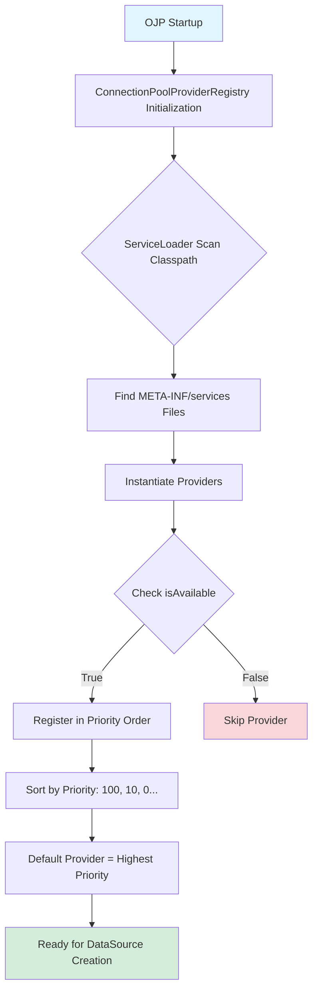

# Chapter 12: Connection Pool Provider SPI

The evolution of modern software architectures demands flexibility in component selection. Different workloads, databases, and operational requirements call for different connection pool implementations. Open J Proxy recognizes this reality by providing a pluggable Service Provider Interface (SPI) for connection pool providers. This architecture allows you to choose the pool implementation that best fits your specific needs—or even build your own.

This chapter explores OJP's connection pool abstraction layer, examining how the SPI enables seamless switching between pool implementations, how the built-in providers work, and how you can create custom providers for specialized requirements. Whether you're optimizing for a specific database vendor, integrating with proprietary connection management systems, or simply curious about the architecture, this chapter provides comprehensive coverage of the pool provider ecosystem.

## 12.1 Understanding the Pool Abstraction

At its core, the Connection Pool Provider SPI separates **what** OJP needs from a connection pool from **how** that pool is implemented. OJP actually defines two distinct SPI interfaces to handle the different requirements of standard and distributed transactions—**ConnectionPoolProvider** for regular JDBC connections and **XAConnectionPoolProvider** for XA distributed transactions.

### The Two SPI Interfaces

The **ConnectionPoolProvider** interface (`org.openjproxy.datasource.ConnectionPoolProvider`) manages standard JDBC connection pools for non-distributed transactions. It defines the contract for creating `DataSource` instances from configuration, managing their lifecycle, exposing statistics for monitoring, and handling graceful shutdown. This interface powers the HikariCP and DBCP providers that handle the majority of OJP workloads. The consistent interface means switching between implementations requires no changes to OJP's core code or your application configuration—just a different provider JAR on the classpath.

The **XAConnectionPoolProvider** interface (`org.openjproxy.xa.pool.spi.XAConnectionPoolProvider`) extends the abstraction to XA distributed transactions, which require fundamentally different pool management. While standard pools manage `DataSource` objects that produce regular connections, XA pools manage `XADataSource` instances that produce XA-capable connections for two-phase commit protocols. The XA interface adds methods for borrowing and returning `XABackendSession` objects—wrappers that maintain transaction state across prepare/commit/rollback phases—along with session invalidation for error handling. This separation of concerns allows OJP to optimize each pool type independently while maintaining the same pluggable architecture.

Both interfaces share common patterns: a unique `id()` for provider selection, `getPriority()` for automatic selection when multiple providers are available, `isAvailable()` to check for required dependencies, and `getStatistics()` for operational visibility. The key difference lies in what they pool and how lifecycle is managed. Standard pools create and destroy connections around single-phase transactions, while XA pools maintain session affinity across distributed transaction boundaries, holding connections through prepare phases and potentially across multiple sequential transactions on the same logical session.

### Supporting Infrastructure

The **PoolConfig** class defines pool configuration in a vendor-neutral way for standard pools. It captures essential settings like pool size, timeout values, and connection properties without binding to any specific pool implementation. Think of it as a translation layer—your application specifies requirements using standard terminology, and the SPI translates those requirements into whatever configuration format the chosen provider expects. For XA pools, configuration is passed as a `Map<String, String>` with canonical keys like `xa.maxPoolSize` and `xa.datasource.className`, providing the flexibility needed for reflection-based instantiation of vendor XADataSource classes.

The **ConnectionPoolProviderRegistry** serves as the discovery and factory mechanism for standard pools. Using Java's ServiceLoader pattern, it automatically discovers available providers at startup by scanning for `META-INF/services/org.openjproxy.datasource.ConnectionPoolProvider` files, selects the appropriate one based on configuration or priority, and provides a unified API for interacting with pools regardless of which implementation is active underneath. XA providers follow the same ServiceLoader pattern with their own service file (`META-INF/services/org.openjproxy.xa.pool.spi.XAConnectionPoolProvider`), ensuring consistent discovery and selection mechanisms across both pool types.

### Architectural Benefits

This dual-SPI architecture delivers powerful benefits across both standard and distributed transaction scenarios. You gain **vendor flexibility** by easily switching between pool implementations based on performance characteristics, licensing requirements, or operational preferences—whether for standard connections (HikariCP vs. DBCP) or XA transactions (Commons Pool 2 vs. vendor-specific implementations like Oracle UCP). The design supports **operational isolation** through the ability to size pools independently for different databases or workloads within the same OJP instance. **Custom integrations** become straightforward when you need to integrate with proprietary connection management systems or implement specialized pooling logic. And you maintain **future compatibility** because new pool implementations can be added without modifying OJP's core code—the ServiceLoader pattern ensures automatic discovery and integration.

**[IMAGE PROMPT: Dual SPI Architecture]**
Create a side-by-side comparison showing two parallel abstraction stacks. Left side labeled "Standard Transactions" shows: Top layer "OJP Server" in blue, middle layer "ConnectionPoolProviderRegistry" in purple, third layer "ConnectionPoolProvider SPI" in orange with method signatures (createDataSource, closeDataSource, getStatistics), bottom layer showing "HikariCP" and "DBCP" providers. Right side labeled "XA Distributed Transactions" shows: Same top layer "OJP Server", middle layer "XA Registry" in purple, third layer "XAConnectionPoolProvider SPI" in green with method signatures (createXADataSource, borrowSession, returnSession, invalidateSession), bottom layer showing "Commons Pool 2 XA Provider". Use arrows showing ServiceLoader discovery for both sides. Add a dividing line between the two stacks with bidirectional arrows at the top showing "OJP Server routes based on transaction type".

### Transaction Type Routing

OJP's server automatically routes connection requests to the appropriate SPI based on the transaction type. When your application requests a standard `DataSource` through JDBC, OJP uses the **ConnectionPoolProvider** SPI—defaulting to HikariCP for its performance characteristics or DBCP when fine-grained control is needed. When your application requests an `XADataSource` for distributed transactions, OJP routes to the **XAConnectionPoolProvider** SPI, which currently uses the Apache Commons Pool 2 implementation.

This routing happens transparently based on the connection type requested. Standard JDBC connections follow the traditional pooling model optimized for single-phase commits. XA connections require specialized handling—the XAConnectionPoolProvider pools `XABackendSession` objects rather than raw connections, maintaining transaction state and session associations across transaction branches even after the application releases them. As covered in detail in Section 12.2 and Chapter 10, this session affinity is essential for distributed transactions, where a connection must remain associated with a transaction branch through prepare/commit/rollback phases—capabilities that require custom pool logic beyond what standard connection pools provide.

## 12.2 Built-in Pool Providers

OJP ships with three production-ready pool providers, each optimized for different scenarios and preferences. Understanding their characteristics helps you choose the right one for your workload.

### HikariCP Provider: The Default Choice

HikariCP earned its position as OJP's default provider through relentless focus on performance and efficiency. Created by Brett Wooldridge, HikariCP consistently demonstrates the lowest overhead and highest throughput in connection pool benchmarks. Its "zero-overhead" philosophy means minimal abstraction layers, direct bytecode manipulation for performance-critical paths, and aggressive optimization of every microsecond.

The provider (`ojp-datasource-hikari`) registers with ID `hikari` and priority `100`, making it the automatic choice when multiple providers are present. It translates `PoolConfig` settings into HikariCP's native configuration format, mapping pool sizes, timeout values, and validation queries to their HikariCP equivalents.

HikariCP excels in high-throughput scenarios where connection acquisition latency directly impacts application performance. Web applications handling thousands of requests per second, API gateways routing between services, and real-time data processing systems all benefit from HikariCP's performance characteristics. The pool's instrumentation provides detailed metrics through JMX or Micrometer integration, enabling deep observability into connection usage patterns.

The trade-off? HikariCP prioritizes performance over flexibility. Its configuration is intentionally streamlined—exposing fewer knobs than alternatives because the maintainers believe the defaults are right for 95% of use cases. If you need advanced connection pool behaviors like custom validation logic or complex eviction strategies, HikariCP may feel constraining.

```java
// HikariCP provider automatically selected (highest priority)
PoolConfig config = PoolConfig.builder()
    .url("jdbc:postgresql://localhost:5432/mydb")
    .username("app_user")
    .password("secret")
    .maxPoolSize(30)
    .minIdle(10)
    .connectionTimeoutMs(5000)
    .validationQuery("SELECT 1")
    .build();

DataSource ds = ConnectionPoolProviderRegistry.createDataSource(config);
```

### DBCP Provider: The Flexible Alternative

Apache Commons DBCP2 (Database Connection Pool) represents the mature, feature-rich alternative. Part of the Apache Commons family since 2001, DBCP has powered countless Java applications through its extensive configuration options and battle-tested reliability.

The provider (`ojp-datasource-dbcp`) registers with ID `dbcp` and priority `10`, positioning it as the fallback when HikariCP isn't available or the explicit alternative when specified. It maps `PoolConfig` to DBCP's `BasicDataSource`, translating OJP's abstraction into DBCP's comprehensive configuration model.

DBCP shines in scenarios requiring fine-grained control over connection lifecycle. Its extensive configuration allows customization of validation behavior, eviction policies, and connection state management. Enterprise environments with strict operational requirements—specific connection testing intervals, particular eviction strategies, or custom validation logic—often prefer DBCP's flexibility over HikariCP's streamlined approach.

The pool provides granular statistics including active connections, idle connections, connection wait time histograms, and detailed eviction metrics. This depth of information proves invaluable when debugging connection exhaustion issues or optimizing pool sizing for complex workloads.

```java
// Explicitly request DBCP provider
PoolConfig config = PoolConfig.builder()
    .url("jdbc:postgresql://localhost:5432/mydb")
    .username("app_user")
    .password("secret")
    .maxPoolSize(20)
    .minIdle(5)
    .property("testOnBorrow", "true")
    .property("testWhileIdle", "true")
    .property("timeBetweenEvictionRunsMillis", "30000")
    .build();

DataSource ds = ConnectionPoolProviderRegistry.createDataSource("dbcp", config);
```

### Choosing Between Providers

The choice often comes down to your priorities. Choose **HikariCP** when performance is paramount, you trust the maintainer's defaults, and you prefer simplicity over configurability. Web applications, microservices, and high-throughput APIs typically benefit from HikariCP's speed. Choose **DBCP** when you need fine-grained control, have specific operational requirements around connection management, or operate in environments where the Apache Commons license is preferred. Batch processing systems, enterprise applications with complex database interactions, and scenarios requiring custom validation or eviction logic often lean toward DBCP.

Both providers are production-ready, well-maintained, and capable of handling demanding workloads. The SPI architecture means you can switch between them without application code changes—just modify the `ojp.datasource.provider` property or change the provider JAR on the classpath.

### Apache Commons Pool 2 XA Provider: Distributed Transaction Support

While HikariCP and DBCP handle traditional (non-XA) connection pooling, OJP's distributed transaction support requires a different approach. The Apache Commons Pool 2 XA provider (`ojp-xa-pool-commons`) delivers a specialized implementation designed specifically for XA distributed transactions, addressing the unique session management requirements that standard connection pools cannot handle.

Traditional connection pools like HikariCP and DBCP excel at managing regular JDBC connections, but XA transactions introduce complexities that require specialized handling. XA connections must maintain their association with transaction branches even after the application releases them, support multiple sequential transactions on the same connection, and provide state management for prepare/commit/rollback operations. These requirements led to the development of a custom XA pool provider built on Apache Commons Pool 2's battle-tested foundation.

The provider (`ojp-xa-pool-commons`) pools `XABackendSession` objects rather than raw `XAConnection` instances. Each session wraps a database XAConnection and maintains transaction state, OJP-specific metadata, and lifecycle management hooks. This architecture allows OJP to eliminate the traditional XA performance penalty—typically 100-500 milliseconds per transaction for connection establishment—by reusing backend sessions across multiple sequential XA transactions.

Apache Commons Pool 2's generic `PooledObjectFactory<T>` design proved ideal for this use case. Rather than forcing a connection-centric model, Commons Pool 2 allows pooling arbitrary object types. The `BackendSessionFactory` manages session lifecycle—creation, validation, passivation, and destruction—while Commons Pool 2 handles the core pooling mechanics that power Tomcat and DBCP with 15+ years of production hardening.

The provider supports universal database compatibility through reflection-based instantiation. Whether you're connecting to PostgreSQL, SQL Server, DB2, MySQL, or MariaDB, the provider works seamlessly without compile-time vendor dependencies. This contrasts with alternative approaches that require explicit vendor-specific configuration.

```java
// XA provider configuration (managed internally by OJP)
// Pool configuration in ojp.properties
ojp.xa.connection.pool.enabled=true
ojp.xa.connection.pool.maxTotal=22
ojp.xa.connection.pool.minIdle=5
ojp.xa.connection.pool.maxWaitMillis=10000
```

The XA provider includes production-ready housekeeping features built on Commons Pool 2's foundation. Leak detection runs continuously to catch forgotten connections before they exhaust the pool. Max lifetime enforcement recycles idle connections after a configured duration (default 30 minutes), preventing stale connections while protecting active transactions. Enhanced diagnostics provide operational visibility through debug logging and metrics exposure.

Configuration focuses on pool sizing rather than vendor-specific settings. The `maxTotal` property controls the maximum number of backend sessions, while `minIdle` maintains a minimum number of idle sessions for burst traffic. In multinode deployments, OJP automatically divides the pool size among servers—for example, with two servers and `maxTotal=22`, each server maintains 11 sessions. When a server fails, remaining servers expand their pools to compensate, and pools rebalance when the failed server recovers.

The implementation represents a deliberate architectural decision documented in ADR 007. Rather than adopting an off-the-shelf XA connection pool like Agroal, OJP built a custom solution that aligns with its proxy architecture. Since OJP pools session wrappers containing transaction state and OJP-specific logic—not raw connections—standard XA pools cannot effectively track leaks or manage lifecycle at the appropriate abstraction level. The custom implementation achieves the same monitoring and management goals while maintaining compatibility with OJP's universal provider model.

For detailed coverage of XA transaction mechanics, session lifecycle, monitoring, and troubleshooting, see Chapter 10. The key takeaway for this chapter: when your application uses XA distributed transactions, OJP automatically uses the Apache Commons Pool 2 XA provider instead of HikariCP or DBCP, providing the specialized pooling behavior that XA requires while maintaining the same configuration simplicity and operational visibility.

**[IMAGE PROMPT: Pool Provider Comparison Matrix]**
Create a three-column comparison chart showing HikariCP on the left, DBCP in the middle, and Apache Commons Pool 2 XA on the right. Include these comparison dimensions as rows: Performance (HikariCP: Very High with speedometer icon, DBCP: High, XA: Optimized for XA), Configurability (HikariCP: Streamlined/Essential, DBCP: Extensive/Granular, XA: Pool-focused/XA-specific), Maturity (HikariCP: Modern/Optimized, DBCP: Battle-Tested/Legacy, XA: Built on 15+ year Commons Pool 2 foundation), Use Cases (HikariCP: High-throughput APIs/Web apps, DBCP: Enterprise apps/Batch jobs, XA: Distributed transactions/XA workloads), Transaction Type (HikariCP: Non-XA only, DBCP: Non-XA only, XA: XA distributed transactions), Pooled Object (HikariCP: Connections, DBCP: Connections, XA: XABackendSessions), Learning Curve (HikariCP: Gentle, DBCP: Steeper, XA: Automatic/Transparent), Monitoring Depth (HikariCP: JMX/Micrometer, DBCP: Detailed statistics, XA: Debug logging/Metrics). Use green for strengths, yellow for neutral, and provide icons to make it visually engaging.

## 12.3 Configuration and Discovery

The SPI leverages Java's ServiceLoader mechanism for automatic discovery, making provider integration seamless. Understanding how configuration flows from your application to the selected provider helps you diagnose issues and optimize settings.

### ServiceLoader Discovery Process

When OJP starts, the `ConnectionPoolProviderRegistry` scans the classpath for provider implementations. Each provider JAR contains a `META-INF/services/org.openjproxy.datasource.ConnectionPoolProvider` file listing the implementing class. Java's ServiceLoader reads these files, instantiates each provider, and registers them in the internal registry.

The registry maintains providers in priority order. Each provider reports its priority through the `getPriority()` method—higher numbers indicate preference for automatic selection. HikariCP returns `100`, DBCP returns `10`, and custom providers typically return `0` unless configured otherwise. This priority system means HikariCP automatically becomes the default when present, DBCP serves as the fallback when HikariCP is absent, and custom providers integrate seamlessly by declaring their priority.

Providers also report availability through the `isAvailable()` method. This allows providers to gracefully degrade when their dependencies are missing. For example, the HikariCP provider checks for the HikariCP JAR at runtime—if absent, it reports unavailable and the registry moves to the next provider. This prevents cryptic ClassNotFoundExceptions and provides clear feedback about missing dependencies.



### Configuration Flow

Configuration starts with your `ojp.properties` file or programmatic `PoolConfig` creation. The properties use the `ojp.` prefix following OJP's naming convention. Core pool settings map to `PoolConfig` builder methods, while provider-specific properties pass through the `properties` map.

```properties
# Provider selection (optional, defaults to highest priority)
ojp.datasource.provider=hikari

# Core pool configuration
ojp.connection.pool.maximumPoolSize=30
ojp.connection.pool.minimumIdle=10
ojp.connection.pool.connectionTimeout=10000
ojp.connection.pool.idleTimeout=600000
ojp.connection.pool.maxLifetime=1800000

# Provider-specific properties (passed through)
ojp.datasource.properties.cachePrepStmts=true
ojp.datasource.properties.prepStmtCacheSize=250
```

When creating a DataSource, the registry either uses the explicitly specified provider or selects the default (highest priority available). The chosen provider receives the `PoolConfig` and translates it into its native configuration format. HikariCP maps to `HikariConfig`, DBCP maps to `BasicDataSource` properties, and custom providers apply their own mapping logic.

The abstraction means you define configuration once in OJP's terminology, and providers handle the translation. This insulates your application from provider-specific configuration formats while still allowing advanced settings through the properties map.

### Provider-Specific Properties

Each provider accepts additional properties beyond the standard `PoolConfig` fields. These properties pass through without interpretation, allowing fine-grained control over provider-specific behaviors.

For HikariCP, common advanced properties include connection validation behavior, metrics integration, and performance tuning:

```java
PoolConfig config = PoolConfig.builder()
    .url("jdbc:postgresql://localhost:5432/mydb")
    .username("app_user")
    .password("secret")
    .maxPoolSize(30)
    .minIdle(10)
    // HikariCP-specific: Prepared statement caching
    .property("cachePrepStmts", "true")
    .property("prepStmtCacheSize", "250")
    .property("prepStmtCacheSqlLimit", "2048")
    // HikariCP-specific: Metrics naming
    .property("poolName", "primary-pool")
    .property("registerMbeans", "true")
    .build();
```

For DBCP, properties control connection testing, eviction behavior, and validation timing:

```java
PoolConfig config = PoolConfig.builder()
    .url("jdbc:postgresql://localhost:5432/mydb")
    .username("app_user")
    .password("secret")
    .maxPoolSize(20)
    .minIdle(5)
    // DBCP-specific: Testing behavior
    .property("testOnBorrow", "true")
    .property("testWhileIdle", "true")
    .property("numTestsPerEvictionRun", "3")
    // DBCP-specific: Eviction timing
    .property("timeBetweenEvictionRunsMillis", "30000")
    .property("softMinEvictableIdleTimeMillis", "180000")
    .build();
```

The registry doesn't validate these properties—that responsibility lies with the provider. Invalid properties typically result in exceptions during DataSource creation, with error messages specific to the chosen provider's validation logic.

**[IMAGE PROMPT: Configuration Flow Diagram]**
Create a flowchart showing configuration flowing from left to right. Start with "ojp.properties" or "PoolConfig.builder()" on the left. Arrow to "Property Mapping" box showing standard properties (maxPoolSize, minIdle, timeouts). Split into two paths: upper path shows "Standard PoolConfig Fields" (blue) flowing to "Provider Translation", lower path shows "Provider-Specific Properties Map" (orange) bypassing translation. Both merge at "Selected Provider" (HikariCP or DBCP icon). Final arrow to "DataSource Creation" with checkmark. Add small icons for config files, translation gears, and datasource pool. Use clear colors to distinguish standard vs provider-specific flows.

## 12.4 Monitoring and Statistics

Production systems demand visibility into connection pool health. The SPI standardizes statistics reporting across providers, enabling consistent monitoring regardless of which implementation you've chosen.

### Standard Statistics Interface

Every provider implements the `getStatistics(DataSource)` method, returning a map of metrics relevant to that provider's capabilities. While the specific metrics vary, most providers expose common dimensions:

| Metric | Description | Interpretation |
|--------|-------------|----------------|
| `activeConnections` | Currently in-use connections | Should stay well below maxPoolSize |
| `idleConnections` | Connections waiting in the pool | Indicates spare capacity |
| `totalConnections` | Active + idle connections | Should equal or be near maxPoolSize at steady state |
| `maxPoolSize` | Configured maximum | Upper bound for total connections |
| `minIdle` | Configured minimum idle | Lower bound for idle connections |
| `threadsAwaitingConnection` | Blocked acquisition requests | High values indicate pool exhaustion |

HikariCP provides additional performance metrics through JMX or Micrometer integration. These include connection acquisition time histograms (showing P50, P95, P99 latencies), connection usage duration, and connection creation/destruction rates. This depth of instrumentation makes HikariCP particularly valuable when diagnosing subtle performance issues.

DBCP exposes granular lifecycle metrics including connection borrow time, return time, validation failures, and eviction statistics. The pool tracks connections created, destroyed, and validated over time, providing insight into pool churn and validation overhead.

```java
// Query statistics from any provider
DataSource ds = ConnectionPoolProviderRegistry.createDataSource(config);

Map<String, Object> stats = ConnectionPoolProviderRegistry.getStatistics(ds);

System.out.println("Active: " + stats.get("activeConnections"));
System.out.println("Idle: " + stats.get("idleConnections"));
System.out.println("Total: " + stats.get("totalConnections"));

// Provider-specific metrics (if available)
if (stats.containsKey("threadsAwaitingConnection")) {
    int waiting = (int) stats.get("threadsAwaitingConnection");
    if (waiting > 0) {
        System.out.println("WARNING: " + waiting + " threads waiting for connections");
    }
}
```

### Integration with Monitoring Systems

OJP exposes pool statistics through its Prometheus metrics endpoint (covered in depth in Chapter 13). The metrics include both standard pool dimensions and provider-specific gauges, allowing you to build comprehensive dashboards in Grafana or other visualization tools.

Common monitoring patterns include tracking connection utilization over time (active connections divided by max pool size), alerting on threads waiting for connections (indicating pool exhaustion), monitoring connection acquisition latency (P95 and P99 percentiles), and correlating pool metrics with application-level performance indicators.

For HikariCP deployments, JMX beans provide real-time insight through tools like JConsole or VisualVM. The beans expose connection pool state, pending requests, and cache efficiency metrics. This proves invaluable during performance troubleshooting when you need immediate insight into pool behavior without waiting for time-series data aggregation.

DBCP's statistics integrate naturally with Apache Commons Pool monitoring infrastructure. If you're already monitoring other Commons Pool instances in your environment, DBCP connection pools appear in the same tooling ecosystem.

**[IMAGE PROMPT: Monitoring Dashboard Mockup]**
Create a monitoring dashboard visualization showing 4 panels arranged in a grid. Top-left: Line graph "Connection Pool Utilization" showing active (green), idle (blue), and max (red dashed) over time. Top-right: Gauge "Current Pool Status" showing 18/30 connections used (60%) in yellow. Bottom-left: Bar chart "Connection Acquisition Latency" showing P50, P95, P99 percentiles in milliseconds. Bottom-right: Counter "Threads Awaiting Connection" showing "0" in green with checkmark. Add time range selector at top and provider name (HikariCP) in corner. Use professional dashboard styling like Grafana.

## 12.5 Building Custom Providers

The true power of the SPI emerges when you need pool behavior beyond what HikariCP or DBCP provide. Custom providers enable integration with proprietary connection management systems, implementation of specialized pooling logic, or extension of pool behavior for unique requirements.

OJP supports custom implementations of both the **ConnectionPoolProvider** (for standard connections) and **XAConnectionPoolProvider** (for XA distributed transactions). This section focuses primarily on ConnectionPoolProvider since it represents the more common use case, but the patterns apply equally to XAConnectionPoolProvider implementations. The key differences: XA providers implement `createXADataSource()` instead of `createDataSource()`, add session management methods (`borrowSession()`, `returnSession()`, `invalidateSession()`), and work with `XABackendSession` objects that wrap XAConnections with transaction state. For detailed XA provider implementation guidance, see the `XAConnectionPoolProvider` interface javadoc and the `CommonsPool2XAProvider` source code in the `ojp-xa-pool-commons` module.

### Provider Interface Implementation

Creating a custom provider starts with implementing the `ConnectionPoolProvider` interface. This contract defines five essential methods that establish your provider's identity and behavior.

The `id()` method returns a unique identifier for your provider. This string appears in configuration files, logs, and management interfaces. Choose something descriptive and unlikely to conflict with other providers—typically your company name or product name followed by "pool".

The `getPriority()` method determines automatic selection order. Return a value higher than `10` to prioritize your provider over DBCP, higher than `100` to prioritize over HikariCP, or `0` to serve as a fallback. Most custom providers return `0`, leaving the decision between HikariCP and DBCP to their standard priorities.

The `isAvailable()` method reports whether your provider can function in the current environment. Check for required libraries, validate configuration, or test connectivity to external systems. Returning `false` prevents cryptic failures and allows the registry to try alternative providers.

```java
package com.example.ojp.pool;

import org.openjproxy.datasource.ConnectionPoolProvider;
import org.openjproxy.datasource.PoolConfig;
import javax.sql.DataSource;
import java.sql.SQLException;
import java.util.Map;
import java.util.HashMap;

public class CustomPoolProvider implements ConnectionPoolProvider {

    public static final String PROVIDER_ID = "custompool";

    @Override
    public String id() {
        return PROVIDER_ID;
    }

    @Override
    public int getPriority() {
        return 0; // Fallback priority
    }

    @Override
    public boolean isAvailable() {
        try {
            // Check if our DataSource implementation is available
            Class.forName("com.example.CustomDataSource");
            return true;
        } catch (ClassNotFoundException e) {
            return false;
        }
    }

    @Override
    public DataSource createDataSource(PoolConfig config) throws SQLException {
        // Create and configure your DataSource
        CustomDataSource ds = new CustomDataSource();
        
        // Map standard PoolConfig fields
        ds.setJdbcUrl(config.getUrl());
        ds.setUsername(config.getUsername());
        ds.setPassword(config.getPasswordAsString());
        ds.setMaxPoolSize(config.getMaxPoolSize());
        ds.setMinIdle(config.getMinIdle());
        ds.setConnectionTimeout(config.getConnectionTimeoutMs());
        
        // Map provider-specific properties
        for (Map.Entry<String, String> entry : config.getProperties().entrySet()) {
            ds.setProperty(entry.getKey(), entry.getValue());
        }
        
        // Initialize and validate
        ds.initialize();
        
        return ds;
    }

    @Override
    public void closeDataSource(DataSource dataSource) throws Exception {
        if (dataSource instanceof CustomDataSource) {
            ((CustomDataSource) dataSource).shutdown();
        }
    }

    @Override
    public Map<String, Object> getStatistics(DataSource dataSource) {
        Map<String, Object> stats = new HashMap<>();
        
        if (dataSource instanceof CustomDataSource) {
            CustomDataSource ds = (CustomDataSource) dataSource;
            stats.put("activeConnections", ds.getActiveCount());
            stats.put("idleConnections", ds.getIdleCount());
            stats.put("totalConnections", ds.getTotalCount());
            stats.put("maxPoolSize", ds.getMaxPoolSize());
            stats.put("pendingAcquisitions", ds.getPendingCount());
        }
        
        return stats;
    }
}
```

### ServiceLoader Registration

Java's ServiceLoader requires a specific file in your JAR's resources directory. Create `src/main/resources/META-INF/services/org.openjproxy.datasource.ConnectionPoolProvider` containing the fully-qualified class name of your provider:

```
com.example.ojp.pool.CustomPoolProvider
```

Multiple providers can exist in the same file, one per line. The ServiceLoader instantiates each listed class at discovery time, so ensure your provider has a no-argument constructor.

### Configuration Mapping

The art of building a good provider lies in thoughtful configuration mapping. Your `createDataSource` method receives a `PoolConfig` object containing both standard fields and provider-specific properties. Map standard fields to their equivalents in your pool implementation, validate required settings, apply sensible defaults, and pass through provider-specific properties.

Pay particular attention to timeout values. `PoolConfig` uses milliseconds consistently, but your underlying pool might expect seconds, minutes, or different units. Convert appropriately and document any differences in behavior.

Password handling deserves special care. The `PoolConfig` provides passwords as char arrays (`getPassword()`) or as strings (`getPasswordAsString()`). If your DataSource implementation supports char arrays, prefer that method for better security hygiene. If not, use `getPasswordAsString()` and ensure your implementation doesn't log or persist the value.

```java
@Override
public DataSource createDataSource(PoolConfig config) throws SQLException {
    // Validate required configuration
    if (config.getUrl() == null || config.getUrl().isEmpty()) {
        throw new SQLException("JDBC URL is required");
    }
    
    CustomDataSource ds = new CustomDataSource();
    
    // Map standard fields with validation
    ds.setJdbcUrl(config.getUrl());
    ds.setUsername(config.getUsername());
    
    // Prefer char[] for passwords, fall back to String if necessary
    if (config.getPasswordAsString() != null) {
        ds.setPassword(config.getPasswordAsString());
    }
    
    // Apply pool sizing with bounds checking
    int maxPoolSize = Math.max(1, config.getMaxPoolSize());
    int minIdle = Math.max(0, Math.min(config.getMinIdle(), maxPoolSize));
    ds.setMaxPoolSize(maxPoolSize);
    ds.setMinIdle(minIdle);
    
    // Convert timeouts to expected units (ms -> seconds)
    ds.setConnectionTimeoutSeconds((int) (config.getConnectionTimeoutMs() / 1000));
    ds.setIdleTimeoutSeconds((int) (config.getIdleTimeoutMs() / 1000));
    
    // Apply validation query if provided
    if (config.getValidationQuery() != null) {
        ds.setTestQuery(config.getValidationQuery());
        ds.setTestOnBorrow(true);
    }
    
    // Pass through provider-specific properties
    config.getProperties().forEach((key, value) -> {
        try {
            ds.setProperty(key, value);
        } catch (Exception e) {
            throw new SQLException("Invalid property: " + key, e);
        }
    });
    
    // Initialize pool
    ds.initialize();
    
    return ds;
}
```

### Lifecycle Management

The `closeDataSource` method handles graceful shutdown. Your implementation should close active connections, release resources, unregister JMX beans, clear any caches, and handle cleanup gracefully even if the DataSource is in an error state.

```java
@Override
public void closeDataSource(DataSource dataSource) throws Exception {
    if (!(dataSource instanceof CustomDataSource)) {
        return;  // Not our DataSource, nothing to clean up
    }
    
    CustomDataSource ds = (CustomDataSource) dataSource;
    
    try {
        // Signal shutdown to prevent new acquisitions
        ds.markShuttingDown();
        
        // Wait for active connections to be returned (with timeout)
        long deadline = System.currentTimeMillis() + 30000; // 30 second timeout
        while (ds.hasActiveConnections() && System.currentTimeMillis() < deadline) {
            Thread.sleep(100);
        }
        
        // Force close if timeout exceeded
        if (ds.hasActiveConnections()) {
            ds.forceCloseActive();
        }
        
        // Clean up idle connections
        ds.closeIdleConnections();
        
        // Unregister metrics/JMX
        ds.unregisterMetrics();
        
    } catch (InterruptedException e) {
        Thread.currentThread().interrupt();
        throw new Exception("Interrupted during shutdown", e);
    } finally {
        // Ensure resources are released even on error
        ds.releaseResources();
    }
}
```

### Testing Your Provider

Comprehensive testing ensures your provider behaves correctly under various conditions. Focus on configuration validation, connection lifecycle, statistics accuracy, concurrent access, error conditions, and cleanup behavior.

```java
import org.junit.jupiter.api.Test;
import org.junit.jupiter.api.BeforeEach;
import static org.junit.jupiter.api.Assertions.*;

class CustomPoolProviderTest {

    private CustomPoolProvider provider;

    @BeforeEach
    void setUp() {
        provider = new CustomPoolProvider();
    }

    @Test
    void testProviderIdentification() {
        assertEquals("custompool", provider.id());
        assertTrue(provider.isAvailable());
        assertEquals(0, provider.getPriority());
    }

    @Test
    void testDataSourceCreation() throws Exception {
        PoolConfig config = PoolConfig.builder()
            .url("jdbc:h2:mem:test")
            .username("sa")
            .password("")
            .maxPoolSize(10)
            .minIdle(2)
            .build();

        DataSource ds = provider.createDataSource(config);
        assertNotNull(ds);
        
        // Verify connection works
        try (Connection conn = ds.getConnection()) {
            assertFalse(conn.isClosed());
        }
        
        provider.closeDataSource(ds);
    }

    @Test
    void testStatistics() throws Exception {
        PoolConfig config = PoolConfig.builder()
            .url("jdbc:h2:mem:test")
            .username("sa")
            .password("")
            .maxPoolSize(5)
            .build();

        DataSource ds = provider.createDataSource(config);
        Map<String, Object> stats = provider.getStatistics(ds);
        
        assertNotNull(stats);
        assertTrue(stats.containsKey("maxPoolSize"));
        assertEquals(5, stats.get("maxPoolSize"));
        
        provider.closeDataSource(ds);
    }

    @Test
    void testConcurrentAccess() throws Exception {
        PoolConfig config = PoolConfig.builder()
            .url("jdbc:h2:mem:test")
            .username("sa")
            .password("")
            .maxPoolSize(10)
            .build();

        DataSource ds = provider.createDataSource(config);
        
        // Simulate concurrent connection acquisition
        int threadCount = 20;
        CountDownLatch latch = new CountDownLatch(threadCount);
        AtomicInteger successCount = new AtomicInteger(0);
        
        for (int i = 0; i < threadCount; i++) {
            new Thread(() -> {
                try (Connection conn = ds.getConnection()) {
                    successCount.incrementAndGet();
                } catch (SQLException e) {
                    // Expected when pool exhausted
                } finally {
                    latch.countDown();
                }
            }).start();
        }
        
        latch.await(10, TimeUnit.SECONDS);
        assertTrue(successCount.get() > 0);
        
        provider.closeDataSource(ds);
    }
}
```

**[IMAGE PROMPT: Custom Provider Development Workflow]**
Create a workflow diagram showing 6 sequential steps from left to right with arrows connecting them. Step 1: "Implement ConnectionPoolProvider" (code icon). Step 2: "Create ServiceLoader Registration" (file icon with META-INF path). Step 3: "Map Configuration" (mapping arrows between boxes). Step 4: "Handle Lifecycle" (circular lifecycle arrows). Step 5: "Implement Statistics" (chart icon). Step 6: "Package as JAR" (JAR file icon with checkmark). Below the main flow, add a testing loop showing "Unit Tests" and "Integration Tests" feeding back to early steps. Use progressive colors from blue to green to show progress.

## 12.6 Real-World Custom Provider Examples

Theory becomes concrete through examples. Let's explore three real-world scenarios where custom providers deliver value beyond what HikariCP or DBCP provide out of the box.

### Oracle UCP Integration

Oracle Universal Connection Pool (UCP) offers Oracle-specific optimizations and features like Fast Connection Failover, Runtime Connection Load Balancing, and integration with Oracle RAC. Organizations standardizing on Oracle Database often want to leverage these capabilities.

A custom OJP provider wrapping UCP translates `PoolConfig` into UCP's configuration model, enables Oracle-specific features through provider properties, exposes UCP metrics through the statistics interface, and handles UCP lifecycle including graceful drain and shutdown.

```java
public class OracleUcpProvider implements ConnectionPoolProvider {
    
    @Override
    public String id() {
        return "oracle-ucp";
    }
    
    @Override
    public DataSource createDataSource(PoolConfig config) throws SQLException {
        PoolDataSource pds = PoolDataSourceFactory.getPoolDataSource();
        
        // Basic configuration
        pds.setConnectionFactoryClassName("oracle.jdbc.pool.OracleDataSource");
        pds.setURL(config.getUrl());
        pds.setUser(config.getUsername());
        pds.setPassword(config.getPasswordAsString());
        
        // Pool sizing
        pds.setInitialPoolSize(config.getMinIdle());
        pds.setMinPoolSize(config.getMinIdle());
        pds.setMaxPoolSize(config.getMaxPoolSize());
        
        // Oracle-specific: Fast Connection Failover
        if ("true".equals(config.getProperties().get("fastConnectionFailover"))) {
            pds.setFastConnectionFailoverEnabled(true);
        }
        
        // Oracle-specific: Connection Load Balancing
        if ("true".equals(config.getProperties().get("connectionLoadBalancing"))) {
            pds.setConnectionLoadBalancingEnabled(true);
        }
        
        return pds;
    }
    
    @Override
    public Map<String, Object> getStatistics(DataSource dataSource) {
        if (!(dataSource instanceof PoolDataSource)) {
            return Map.of();
        }
        
        PoolDataSource pds = (PoolDataSource) dataSource;
        Map<String, Object> stats = new HashMap<>();
        
        try {
            stats.put("availableConnections", pds.getAvailableConnectionsCount());
            stats.put("borrowedConnections", pds.getBorrowedConnectionsCount());
            stats.put("totalConnections", pds.getTotalConnectionsCount());
            stats.put("failedConnectionAttempts", pds.getFailedConnectionAttemptsCount());
        } catch (SQLException e) {
            // Statistics unavailable
        }
        
        return stats;
    }
}
```

### AWS RDS IAM Authentication

AWS RDS supports IAM-based authentication where database passwords are short-lived tokens retrieved from IAM instead of static credentials. This pattern enhances security by eliminating long-lived database passwords and integrating database access with AWS IAM policies.

A custom provider implementing this pattern uses `PoolConfig.passwordSupplier()` to dynamically retrieve IAM tokens, refreshes tokens before expiration, integrates with AWS SDK for token generation, and handles token refresh failures gracefully.

```java
public class AwsRdsIamProvider implements ConnectionPoolProvider {
    
    @Override
    public String id() {
        return "aws-rds-iam";
    }
    
    @Override
    public DataSource createDataSource(PoolConfig config) throws SQLException {
        // Use HikariCP under the hood but inject IAM token supplier
        HikariConfig hikariConfig = new HikariConfig();
        hikariConfig.setJdbcUrl(config.getUrl());
        hikariConfig.setUsername(config.getUsername());
        
        // Set up IAM token supplier
        RdsIamAuthTokenGenerator generator = RdsIamAuthTokenGenerator.builder()
            .credentials(DefaultCredentialsProvider.create())
            .region(Region.of(config.getProperties().get("awsRegion")))
            .build();
        
        String hostname = extractHostnameFromUrl(config.getUrl());
        int port = extractPortFromUrl(config.getUrl());
        
        // Password supplier generates fresh IAM tokens
        hikariConfig.setPassword(null); // Don't set static password
        hikariConfig.addDataSourceProperty("password", (Supplier<String>) () -> {
            return generator.getAuthToken(GetAuthTokenRequest.builder()
                .hostname(hostname)
                .port(port)
                .username(config.getUsername())
                .build());
        });
        
        // IAM tokens expire in 15 minutes, so set short connection lifetime
        hikariConfig.setMaxLifetime(600000); // 10 minutes
        hikariConfig.setMaximumPoolSize(config.getMaxPoolSize());
        
        return new HikariDataSource(hikariConfig);
    }
    
    private String extractHostnameFromUrl(String url) {
        // Parse JDBC URL to extract hostname
        // jdbc:postgresql://mydb.cluster-xxx.us-east-1.rds.amazonaws.com:5432/mydb
        // Implementation omitted for brevity
        return "";
    }
    
    private int extractPortFromUrl(String url) {
        // Parse JDBC URL to extract port
        return 5432;
    }
}
```

## 12.7 Production Considerations

Deploying custom providers in production requires attention to operational concerns beyond basic functionality. These considerations ensure your provider behaves predictably under load and integrates smoothly with existing infrastructure.

### Classpath and Packaging

Package your provider as a standalone JAR containing your implementation classes, the ServiceLoader registration file, and any provider-specific dependencies. Place this JAR in OJP's classpath—typically the `ojp-libs` directory alongside database drivers.

If your provider wraps an existing pool implementation (like Oracle UCP), decide whether to bundle that dependency or require separate installation. Bundling simplifies deployment but increases JAR size and can create version conflicts. Separate installation keeps your provider lightweight but adds deployment steps.

Use Maven's shade plugin or Gradle's shadow plugin to relocate transitive dependencies if conflicts arise. This prevents your provider's dependencies from colliding with other classpath entries.

```xml
<!-- Maven: Shade plugin configuration for conflict-free packaging -->
<plugin>
    <groupId>org.apache.maven.plugins</groupId>
    <artifactId>maven-shade-plugin</artifactId>
    <version>3.5.0</version>
    <executions>
        <execution>
            <phase>package</phase>
            <goals>
                <goal>shade</goal>
            </goals>
            <configuration>
                <relocations>
                    <relocation>
                        <pattern>com.example.dependency</pattern>
                        <shadedPattern>com.example.shaded.dependency</shadedPattern>
                    </relocation>
                </relocations>
            </configuration>
        </execution>
    </executions>
</plugin>
```

### Error Handling and Logging

Production providers must handle errors gracefully and provide actionable log messages. Consider these patterns:

Log provider selection at INFO level so operators know which provider is active. Log configuration warnings at WARN level if settings seem unusual. Log initialization failures at ERROR level with context about what failed and why. Avoid logging sensitive information like passwords or connection strings containing credentials.

```java
@Override
public DataSource createDataSource(PoolConfig config) throws SQLException {
    logger.info("Creating DataSource with {} provider", id());
    
    if (config.getMaxPoolSize() > 100) {
        logger.warn("Large maxPoolSize configured: {}. Ensure database can handle this many connections.", 
                   config.getMaxPoolSize());
    }
    
    try {
        DataSource ds = createUnderlying(config);
        logger.info("DataSource created successfully with {} connections", config.getMaxPoolSize());
        return ds;
    } catch (SQLException e) {
        logger.error("Failed to create DataSource: {}", e.getMessage());
        throw e;
    }
}
```

### Security Considerations

Handle passwords with care throughout your provider. Avoid storing passwords in instance variables—retrieve them from `PoolConfig` during DataSource creation only. Don't log passwords or include them in error messages. Clear char arrays containing passwords after use if you've copied them. Consider supporting `passwordSupplier` for integration with secret management systems.

If your provider stores configuration, ensure that configuration objects mask or exclude password fields from `toString()` output. This prevents accidental logging of credentials.

### Performance Implications

Custom providers add a thin abstraction layer between OJP and the underlying pool. Minimize overhead in statistics gathering—cache values when possible rather than querying the underlying pool on every call. Avoid synchronization in connection acquisition paths unless absolutely necessary. Delegate lifecycle management to the underlying pool rather than adding your own connection tracking.

Profile your provider under load to identify bottlenecks. Connection acquisition is often the hottest path, so any overhead there multiplies across thousands of requests per second.

### Versioning and Compatibility

Document which versions of underlying libraries your provider supports. If you wrap HikariCP, Oracle UCP, or another pool, specify compatible versions and test against version ranges. Consider supporting multiple major versions through version detection and conditional logic.

Maintain backward compatibility with `PoolConfig` across OJP releases. If OJP adds new configuration fields, older providers should handle their absence gracefully by using sensible defaults.

```java
@Override
public DataSource createDataSource(PoolConfig config) throws SQLException {
    CustomDataSource ds = new CustomDataSource();
    
    // New configuration field added in OJP 0.4.0
    // Handle gracefully if not present
    int keepAliveTime = config.getProperties().containsKey("keepAliveTime")
        ? Integer.parseInt(config.getProperties().get("keepAliveTime"))
        : 30000; // Default 30 seconds
    
    ds.setKeepAliveTimeMs(keepAliveTime);
    
    return ds;
}
```

### Documentation and Support

Comprehensive documentation makes the difference between a provider that sees adoption and one that languishes unused. Document supported configuration properties with examples, provide performance characteristics and benchmarks, explain error messages and troubleshooting steps, include migration guides from standard providers, and maintain a changelog across provider versions.

Consider creating example configurations for common scenarios. Users shouldn't need to reverse-engineer your provider's behavior from source code.

## 12.8 The Future of Pool Abstraction

The SPI architecture positions OJP to evolve with the Java ecosystem and emerging database technologies. Several trends will likely influence future provider development.

### Observability Enhancements

Modern observability demands rich context beyond simple metrics. Future providers might emit OpenTelemetry traces for connection acquisition, provide structured logging with correlation IDs, expose detailed connection lifecycle events, and integrate with distributed tracing systems.

### Multi-Tenancy Support

SaaS applications often manage connections for multiple tenants with different requirements. Enhanced provider APIs might support tenant isolation with separate pools per tenant, dynamic pool sizing based on tenant activity, and policy-based connection routing.

The SPI's extensibility ensures OJP remains relevant as these patterns emerge. Custom providers can experiment with new approaches without waiting for core OJP changes, and successful patterns can be standardized into future versions.

## Key Takeaways

- **The SPI architecture separates configuration from implementation**, allowing seamless switching between pool providers
- **HikariCP provides the performance-optimized default**, while DBCP offers extensive configurability
- **ServiceLoader discovery enables automatic provider registration** through simple classpath placement
- **Custom providers unlock integration** with proprietary systems, cloud services, and specialized requirements
- **Production considerations including packaging, error handling, and security** ensure custom providers operate reliably under load
- **The abstraction positions OJP for future evolution** including enhanced observability and multi-tenancy support

The Connection Pool Provider SPI embodies OJP's philosophy of flexibility without complexity. Whether you stick with the high-performance defaults or build custom providers for unique requirements, the abstraction layer ensures consistent configuration, monitoring, and lifecycle management. These architectural decisions empower you to optimize connection management for your specific environment while maintaining OJP's unified interface.

---

**Next Chapter Preview**: Chapter 13 explores telemetry and monitoring, examining how OJP exposes metrics through Prometheus, integrates with Grafana dashboards, and provides operational visibility into connection usage, performance, and health across all configured pool providers.
