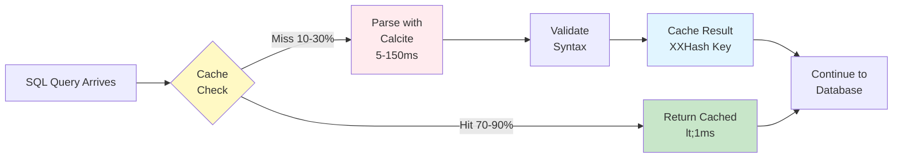

# Chapter 12: Connection Pool Provider SPI

The evolution of modern software architectures demands flexibility in component selection. Different workloads, databases, and operational requirements call for different connection pool implementations. Open J Proxy recognizes this reality by providing a pluggable Service Provider Interface (SPI) for connection pool providers. This architecture allows you to choose the pool implementation that best fits your specific needs—or even build your own.

This chapter explores OJP's connection pool abstraction layer, examining how the SPI enables seamless switching between pool implementations, how the built-in providers work, and how you can create custom providers for specialized requirements. Whether you're optimizing for a specific database vendor, integrating with proprietary connection management systems, or simply curious about the architecture, this chapter provides comprehensive coverage of the pool provider ecosystem.

## 12.1 Understanding the Pool Abstraction

At its core, the Connection Pool Provider SPI separates **what** OJP needs from a connection pool from **how** that pool is implemented. This abstraction layer consists of three main components working in concert.

The **PoolConfig** class defines pool configuration in a vendor-neutral way. It captures essential settings like pool size, timeout values, and connection properties without binding to any specific pool implementation. Think of it as a translation layer—your application specifies requirements using standard terminology, and the SPI translates those requirements into whatever configuration format the chosen provider expects.

The **ConnectionPoolProvider** interface defines the contract that all pool implementations must fulfill. Providers must create DataSource instances from configuration, manage their lifecycle, expose statistics for monitoring, and handle graceful shutdown. This consistent interface means switching from HikariCP to DBCP (or to your custom provider) requires no changes to OJP's core code or your application configuration—just a different provider JAR on the classpath.

The **ConnectionPoolProviderRegistry** serves as the discovery and factory mechanism. Using Java's ServiceLoader pattern, it automatically discovers available providers at startup, selects the appropriate one based on configuration or priority, and provides a unified API for interacting with pools regardless of which implementation is active underneath.

This architecture delivers powerful benefits. You gain **vendor flexibility** by easily switching between pool implementations based on performance characteristics, licensing requirements, or operational preferences. The design supports **operational isolation** through the ability to size pools independently for different databases or workloads within the same OJP instance. **Custom integrations** become straightforward when you need to integrate with proprietary connection management systems or implement specialized pooling logic. And you maintain **future compatibility** because new pool implementations can be added without modifying OJP's core code.

**[IMAGE PROMPT: Connection Pool Abstraction Architecture]**
Create a layered architecture diagram showing the abstraction stack from top to bottom. Top layer: "OJP Server (StatementServiceImpl)" in blue. Middle layer: "ConnectionPoolProviderRegistry" (discovery and factory) in purple. Third layer: "ConnectionPoolProvider SPI Interface" (with method signatures: createDataSource, closeDataSource, getStatistics) in orange. Bottom layer split into three sections showing "HikariCP Provider (Priority: 100, Default)", "DBCP Provider (Priority: 10, Alternative)", and "Custom Provider (Priority: 0, User-defined)" all in different colors connecting down to their respective implementations. Use arrows to show the flow from top to bottom, with a side note showing "ServiceLoader Discovery" pointing to the provider layer.

The abstraction excels in Non-XA scenarios where traditional connection pooling applies. For XA distributed transactions, a specialized variation called the **XA Connection Pool Provider SPI** handles the unique requirements of XA session management. Chapter 10 explored this in depth, but the key difference lies in how XA connections maintain their association with transaction branches even after the application code releases them—a capability that requires custom pool logic beyond what standard connection pools provide.

## 12.2 Built-in Pool Providers

OJP ships with two production-ready pool providers, each optimized for different scenarios and preferences. Understanding their characteristics helps you choose the right one for your workload.

### HikariCP Provider: The Default Choice

HikariCP earned its position as OJP's default provider through relentless focus on performance and efficiency. Created by Brett Wooldridge, HikariCP consistently demonstrates the lowest overhead and highest throughput in connection pool benchmarks. Its "zero-overhead" philosophy means minimal abstraction layers, direct bytecode manipulation for performance-critical paths, and aggressive optimization of every microsecond.

The provider (`ojp-datasource-hikari`) registers with ID `hikari` and priority `100`, making it the automatic choice when multiple providers are present. It translates `PoolConfig` settings into HikariCP's native configuration format, mapping pool sizes, timeout values, and validation queries to their HikariCP equivalents.

HikariCP excels in high-throughput scenarios where connection acquisition latency directly impacts application performance. Web applications handling thousands of requests per second, API gateways routing between services, and real-time data processing systems all benefit from HikariCP's performance characteristics. The pool's instrumentation provides detailed metrics through JMX or Micrometer integration, enabling deep observability into connection usage patterns.

The trade-off? HikariCP prioritizes performance over flexibility. Its configuration is intentionally streamlined—exposing fewer knobs than alternatives because the maintainers believe the defaults are right for 95% of use cases. If you need advanced connection pool behaviors like custom validation logic or complex eviction strategies, HikariCP may feel constraining.

```java
// HikariCP provider automatically selected (highest priority)
PoolConfig config = PoolConfig.builder()
    .url("jdbc:postgresql://localhost:5432/mydb")
    .username("app_user")
    .password("secret")
    .maxPoolSize(30)
    .minIdle(10)
    .connectionTimeoutMs(5000)
    .validationQuery("SELECT 1")
    .build();

DataSource ds = ConnectionPoolProviderRegistry.createDataSource(config);
```

### DBCP Provider: The Flexible Alternative

Apache Commons DBCP2 (Database Connection Pool) represents the mature, feature-rich alternative. Part of the Apache Commons family since 2001, DBCP has powered countless Java applications through its extensive configuration options and battle-tested reliability.

The provider (`ojp-datasource-dbcp`) registers with ID `dbcp` and priority `10`, positioning it as the fallback when HikariCP isn't available or the explicit alternative when specified. It maps `PoolConfig` to DBCP's `BasicDataSource`, translating OJP's abstraction into DBCP's comprehensive configuration model.

DBCP shines in scenarios requiring fine-grained control over connection lifecycle. Its extensive configuration allows customization of validation behavior, eviction policies, and connection state management. Enterprise environments with strict operational requirements—specific connection testing intervals, particular eviction strategies, or custom validation logic—often prefer DBCP's flexibility over HikariCP's streamlined approach.

The pool provides granular statistics including active connections, idle connections, connection wait time histograms, and detailed eviction metrics. This depth of information proves invaluable when debugging connection exhaustion issues or optimizing pool sizing for complex workloads.

```java
// Explicitly request DBCP provider
PoolConfig config = PoolConfig.builder()
    .url("jdbc:postgresql://localhost:5432/mydb")
    .username("app_user")
    .password("secret")
    .maxPoolSize(20)
    .minIdle(5)
    .property("testOnBorrow", "true")
    .property("testWhileIdle", "true")
    .property("timeBetweenEvictionRunsMillis", "30000")
    .build();

DataSource ds = ConnectionPoolProviderRegistry.createDataSource("dbcp", config);
```

### Choosing Between Providers

The choice often comes down to your priorities. Choose **HikariCP** when performance is paramount, you trust the maintainer's defaults, and you prefer simplicity over configurability. Web applications, microservices, and high-throughput APIs typically benefit from HikariCP's speed. Choose **DBCP** when you need fine-grained control, have specific operational requirements around connection management, or operate in environments where the Apache Commons license is preferred. Batch processing systems, enterprise applications with complex database interactions, and scenarios requiring custom validation or eviction logic often lean toward DBCP.

Both providers are production-ready, well-maintained, and capable of handling demanding workloads. The SPI architecture means you can switch between them without application code changes—just modify the `ojp.datasource.provider` property or change the provider JAR on the classpath.

**[IMAGE PROMPT: HikariCP vs DBCP Comparison Matrix]**
Create a side-by-side comparison chart showing HikariCP on the left and DBCP on the right. Include these comparison dimensions as rows: Performance (HikariCP: Very High with speedometer icon, DBCP: High), Configurability (HikariCP: Streamlined/Essential, DBCP: Extensive/Granular), Maturity (HikariCP: Modern/Optimized, DBCP: Battle-Tested/Legacy), Use Cases (HikariCP: High-throughput APIs, Web apps, DBCP: Enterprise apps, Batch jobs), Learning Curve (HikariCP: Gentle, DBCP: Steeper), Monitoring Depth (HikariCP: JMX/Micrometer, DBCP: Detailed statistics). Use green for strengths, yellow for neutral, and provide icons to make it visually engaging.

## 12.3 Configuration and Discovery

The SPI leverages Java's ServiceLoader mechanism for automatic discovery, making provider integration seamless. Understanding how configuration flows from your application to the selected provider helps you diagnose issues and optimize settings.

### ServiceLoader Discovery Process

When OJP starts, the `ConnectionPoolProviderRegistry` scans the classpath for provider implementations. Each provider JAR contains a `META-INF/services/org.openjproxy.datasource.ConnectionPoolProvider` file listing the implementing class. Java's ServiceLoader reads these files, instantiates each provider, and registers them in the internal registry.

The registry maintains providers in priority order. Each provider reports its priority through the `getPriority()` method—higher numbers indicate preference for automatic selection. HikariCP returns `100`, DBCP returns `10`, and custom providers typically return `0` unless configured otherwise. This priority system means HikariCP automatically becomes the default when present, DBCP serves as the fallback when HikariCP is absent, and custom providers integrate seamlessly by declaring their priority.

Providers also report availability through the `isAvailable()` method. This allows providers to gracefully degrade when their dependencies are missing. For example, the HikariCP provider checks for the HikariCP JAR at runtime—if absent, it reports unavailable and the registry moves to the next provider. This prevents cryptic ClassNotFoundExceptions and provides clear feedback about missing dependencies.


### Configuration Flow

Configuration starts with your `ojp.properties` file or programmatic `PoolConfig` creation. The properties use the `ojp.` prefix following OJP's naming convention. Core pool settings map to `PoolConfig` builder methods, while provider-specific properties pass through the `properties` map.

```properties
# Provider selection (optional, defaults to highest priority)
ojp.datasource.provider=hikari

# Core pool configuration
ojp.connection.pool.maximumPoolSize=30
ojp.connection.pool.minimumIdle=10
ojp.connection.pool.connectionTimeout=10000
ojp.connection.pool.idleTimeout=600000
ojp.connection.pool.maxLifetime=1800000

# Provider-specific properties (passed through)
ojp.datasource.properties.cachePrepStmts=true
ojp.datasource.properties.prepStmtCacheSize=250
```

When creating a DataSource, the registry either uses the explicitly specified provider or selects the default (highest priority available). The chosen provider receives the `PoolConfig` and translates it into its native configuration format. HikariCP maps to `HikariConfig`, DBCP maps to `BasicDataSource` properties, and custom providers apply their own mapping logic.

The abstraction means you define configuration once in OJP's terminology, and providers handle the translation. This insulates your application from provider-specific configuration formats while still allowing advanced settings through the properties map.

### Provider-Specific Properties

Each provider accepts additional properties beyond the standard `PoolConfig` fields. These properties pass through without interpretation, allowing fine-grained control over provider-specific behaviors.

For HikariCP, common advanced properties include connection validation behavior, metrics integration, and performance tuning:

```java
PoolConfig config = PoolConfig.builder()
    .url("jdbc:postgresql://localhost:5432/mydb")
    .username("app_user")
    .password("secret")
    .maxPoolSize(30)
    .minIdle(10)
    // HikariCP-specific: Prepared statement caching
    .property("cachePrepStmts", "true")
    .property("prepStmtCacheSize", "250")
    .property("prepStmtCacheSqlLimit", "2048")
    // HikariCP-specific: Metrics naming
    .property("poolName", "primary-pool")
    .property("registerMbeans", "true")
    .build();
```

For DBCP, properties control connection testing, eviction behavior, and validation timing:

```java
PoolConfig config = PoolConfig.builder()
    .url("jdbc:postgresql://localhost:5432/mydb")
    .username("app_user")
    .password("secret")
    .maxPoolSize(20)
    .minIdle(5)
    // DBCP-specific: Testing behavior
    .property("testOnBorrow", "true")
    .property("testWhileIdle", "true")
    .property("numTestsPerEvictionRun", "3")
    // DBCP-specific: Eviction timing
    .property("timeBetweenEvictionRunsMillis", "30000")
    .property("softMinEvictableIdleTimeMillis", "180000")
    .build();
```

The registry doesn't validate these properties—that responsibility lies with the provider. Invalid properties typically result in exceptions during DataSource creation, with error messages specific to the chosen provider's validation logic.

**[IMAGE PROMPT: Configuration Flow Diagram]**
Create a flowchart showing configuration flowing from left to right. Start with "ojp.properties" or "PoolConfig.builder()" on the left. Arrow to "Property Mapping" box showing standard properties (maxPoolSize, minIdle, timeouts). Split into two paths: upper path shows "Standard PoolConfig Fields" (blue) flowing to "Provider Translation", lower path shows "Provider-Specific Properties Map" (orange) bypassing translation. Both merge at "Selected Provider" (HikariCP or DBCP icon). Final arrow to "DataSource Creation" with checkmark. Add small icons for config files, translation gears, and datasource pool. Use clear colors to distinguish standard vs provider-specific flows.

## 12.4 Monitoring and Statistics

Production systems demand visibility into connection pool health. The SPI standardizes statistics reporting across providers, enabling consistent monitoring regardless of which implementation you've chosen.

### Standard Statistics Interface

Every provider implements the `getStatistics(DataSource)` method, returning a map of metrics relevant to that provider's capabilities. While the specific metrics vary, most providers expose common dimensions:

| Metric | Description | Interpretation |
|--------|-------------|----------------|
| `activeConnections` | Currently in-use connections | Should stay well below maxPoolSize |
| `idleConnections` | Connections waiting in the pool | Indicates spare capacity |
| `totalConnections` | Active + idle connections | Should equal or be near maxPoolSize at steady state |
| `maxPoolSize` | Configured maximum | Upper bound for total connections |
| `minIdle` | Configured minimum idle | Lower bound for idle connections |
| `threadsAwaitingConnection` | Blocked acquisition requests | High values indicate pool exhaustion |

HikariCP provides additional performance metrics through JMX or Micrometer integration. These include connection acquisition time histograms (showing P50, P95, P99 latencies), connection usage duration, and connection creation/destruction rates. This depth of instrumentation makes HikariCP particularly valuable when diagnosing subtle performance issues.

DBCP exposes granular lifecycle metrics including connection borrow time, return time, validation failures, and eviction statistics. The pool tracks connections created, destroyed, and validated over time, providing insight into pool churn and validation overhead.

```java
// Query statistics from any provider
DataSource ds = ConnectionPoolProviderRegistry.createDataSource(config);

Map<String, Object> stats = ConnectionPoolProviderRegistry.getStatistics(ds);

System.out.println("Active: " + stats.get("activeConnections"));
System.out.println("Idle: " + stats.get("idleConnections"));
System.out.println("Total: " + stats.get("totalConnections"));

// Provider-specific metrics (if available)
if (stats.containsKey("threadsAwaitingConnection")) {
    int waiting = (int) stats.get("threadsAwaitingConnection");
    if (waiting > 0) {
        System.out.println("WARNING: " + waiting + " threads waiting for connections");
    }
}
```

### Integration with Monitoring Systems

OJP exposes pool statistics through its Prometheus metrics endpoint (covered in depth in Chapter 13). The metrics include both standard pool dimensions and provider-specific gauges, allowing you to build comprehensive dashboards in Grafana or other visualization tools.

Common monitoring patterns include tracking connection utilization over time (active connections divided by max pool size), alerting on threads waiting for connections (indicating pool exhaustion), monitoring connection acquisition latency (P95 and P99 percentiles), and correlating pool metrics with application-level performance indicators.

For HikariCP deployments, JMX beans provide real-time insight through tools like JConsole or VisualVM. The beans expose connection pool state, pending requests, and cache efficiency metrics. This proves invaluable during performance troubleshooting when you need immediate insight into pool behavior without waiting for time-series data aggregation.

DBCP's statistics integrate naturally with Apache Commons Pool monitoring infrastructure. If you're already monitoring other Commons Pool instances in your environment, DBCP connection pools appear in the same tooling ecosystem.

**[IMAGE PROMPT: Monitoring Dashboard Mockup]**
Create a monitoring dashboard visualization showing 4 panels arranged in a grid. Top-left: Line graph "Connection Pool Utilization" showing active (green), idle (blue), and max (red dashed) over time. Top-right: Gauge "Current Pool Status" showing 18/30 connections used (60%) in yellow. Bottom-left: Bar chart "Connection Acquisition Latency" showing P50, P95, P99 percentiles in milliseconds. Bottom-right: Counter "Threads Awaiting Connection" showing "0" in green with checkmark. Add time range selector at top and provider name (HikariCP) in corner. Use professional dashboard styling like Grafana.

## 12.5 Building Custom Providers

The true power of the SPI emerges when you need pool behavior beyond what HikariCP or DBCP provide. Custom providers enable integration with proprietary connection management systems, implementation of specialized pooling logic, or extension of pool behavior for unique requirements.

### Provider Interface Implementation

Creating a custom provider starts with implementing the `ConnectionPoolProvider` interface. This contract defines five essential methods that establish your provider's identity and behavior.

The `id()` method returns a unique identifier for your provider. This string appears in configuration files, logs, and management interfaces. Choose something descriptive and unlikely to conflict with other providers—typically your company name or product name followed by "pool".

The `getPriority()` method determines automatic selection order. Return a value higher than `10` to prioritize your provider over DBCP, higher than `100` to prioritize over HikariCP, or `0` to serve as a fallback. Most custom providers return `0`, leaving the decision between HikariCP and DBCP to their standard priorities.

The `isAvailable()` method reports whether your provider can function in the current environment. Check for required libraries, validate configuration, or test connectivity to external systems. Returning `false` prevents cryptic failures and allows the registry to try alternative providers.

```java
package com.example.ojp.pool;

import org.openjproxy.datasource.ConnectionPoolProvider;
import org.openjproxy.datasource.PoolConfig;
import javax.sql.DataSource;
import java.sql.SQLException;
import java.util.Map;
import java.util.HashMap;

public class CustomPoolProvider implements ConnectionPoolProvider {

    public static final String PROVIDER_ID = "custompool";

    @Override
    public String id() {
        return PROVIDER_ID;
    }

    @Override
    public int getPriority() {
        return 0; // Fallback priority
    }

    @Override
    public boolean isAvailable() {
        try {
            // Check if our DataSource implementation is available
            Class.forName("com.example.CustomDataSource");
            return true;
        } catch (ClassNotFoundException e) {
            return false;
        }
    }

    @Override
    public DataSource createDataSource(PoolConfig config) throws SQLException {
        // Create and configure your DataSource
        CustomDataSource ds = new CustomDataSource();
        
        // Map standard PoolConfig fields
        ds.setJdbcUrl(config.getUrl());
        ds.setUsername(config.getUsername());
        ds.setPassword(config.getPasswordAsString());
        ds.setMaxPoolSize(config.getMaxPoolSize());
        ds.setMinIdle(config.getMinIdle());
        ds.setConnectionTimeout(config.getConnectionTimeoutMs());
        
        // Map provider-specific properties
        for (Map.Entry<String, String> entry : config.getProperties().entrySet()) {
            ds.setProperty(entry.getKey(), entry.getValue());
        }
        
        // Initialize and validate
        ds.initialize();
        
        return ds;
    }

    @Override
    public void closeDataSource(DataSource dataSource) throws Exception {
        if (dataSource instanceof CustomDataSource) {
            ((CustomDataSource) dataSource).shutdown();
        }
    }

    @Override
    public Map<String, Object> getStatistics(DataSource dataSource) {
        Map<String, Object> stats = new HashMap<>();
        
        if (dataSource instanceof CustomDataSource) {
            CustomDataSource ds = (CustomDataSource) dataSource;
            stats.put("activeConnections", ds.getActiveCount());
            stats.put("idleConnections", ds.getIdleCount());
            stats.put("totalConnections", ds.getTotalCount());
            stats.put("maxPoolSize", ds.getMaxPoolSize());
            stats.put("pendingAcquisitions", ds.getPendingCount());
        }
        
        return stats;
    }
}
```

### ServiceLoader Registration

Java's ServiceLoader requires a specific file in your JAR's resources directory. Create `src/main/resources/META-INF/services/org.openjproxy.datasource.ConnectionPoolProvider` containing the fully-qualified class name of your provider:

```
com.example.ojp.pool.CustomPoolProvider
```

Multiple providers can exist in the same file, one per line. The ServiceLoader instantiates each listed class at discovery time, so ensure your provider has a no-argument constructor.

### Configuration Mapping

The art of building a good provider lies in thoughtful configuration mapping. Your `createDataSource` method receives a `PoolConfig` object containing both standard fields and provider-specific properties. Map standard fields to their equivalents in your pool implementation, validate required settings, apply sensible defaults, and pass through provider-specific properties.

Pay particular attention to timeout values. `PoolConfig` uses milliseconds consistently, but your underlying pool might expect seconds, minutes, or different units. Convert appropriately and document any differences in behavior.

Password handling deserves special care. The `PoolConfig` provides passwords as char arrays (`getPassword()`) or as strings (`getPasswordAsString()`). If your DataSource implementation supports char arrays, prefer that method for better security hygiene. If not, use `getPasswordAsString()` and ensure your implementation doesn't log or persist the value.

```java
@Override
public DataSource createDataSource(PoolConfig config) throws SQLException {
    // Validate required configuration
    if (config.getUrl() == null || config.getUrl().isEmpty()) {
        throw new SQLException("JDBC URL is required");
    }
    
    CustomDataSource ds = new CustomDataSource();
    
    // Map standard fields with validation
    ds.setJdbcUrl(config.getUrl());
    ds.setUsername(config.getUsername());
    
    // Prefer char[] for passwords, fall back to String if necessary
    if (config.getPasswordAsString() != null) {
        ds.setPassword(config.getPasswordAsString());
    }
    
    // Apply pool sizing with bounds checking
    int maxPoolSize = Math.max(1, config.getMaxPoolSize());
    int minIdle = Math.max(0, Math.min(config.getMinIdle(), maxPoolSize));
    ds.setMaxPoolSize(maxPoolSize);
    ds.setMinIdle(minIdle);
    
    // Convert timeouts to expected units (ms -> seconds)
    ds.setConnectionTimeoutSeconds((int) (config.getConnectionTimeoutMs() / 1000));
    ds.setIdleTimeoutSeconds((int) (config.getIdleTimeoutMs() / 1000));
    
    // Apply validation query if provided
    if (config.getValidationQuery() != null) {
        ds.setTestQuery(config.getValidationQuery());
        ds.setTestOnBorrow(true);
    }
    
    // Pass through provider-specific properties
    config.getProperties().forEach((key, value) -> {
        try {
            ds.setProperty(key, value);
        } catch (Exception e) {
            throw new SQLException("Invalid property: " + key, e);
        }
    });
    
    // Initialize pool
    ds.initialize();
    
    return ds;
}
```

### Lifecycle Management

The `closeDataSource` method handles graceful shutdown. Your implementation should close active connections, release resources, unregister JMX beans, clear any caches, and handle cleanup gracefully even if the DataSource is in an error state.

```java
@Override
public void closeDataSource(DataSource dataSource) throws Exception {
    if (!(dataSource instanceof CustomDataSource)) {
        return;  // Not our DataSource, nothing to clean up
    }
    
    CustomDataSource ds = (CustomDataSource) dataSource;
    
    try {
        // Signal shutdown to prevent new acquisitions
        ds.markShuttingDown();
        
        // Wait for active connections to be returned (with timeout)
        long deadline = System.currentTimeMillis() + 30000; // 30 second timeout
        while (ds.hasActiveConnections() && System.currentTimeMillis() < deadline) {
            Thread.sleep(100);
        }
        
        // Force close if timeout exceeded
        if (ds.hasActiveConnections()) {
            ds.forceCloseActive();
        }
        
        // Clean up idle connections
        ds.closeIdleConnections();
        
        // Unregister metrics/JMX
        ds.unregisterMetrics();
        
    } catch (InterruptedException e) {
        Thread.currentThread().interrupt();
        throw new Exception("Interrupted during shutdown", e);
    } finally {
        // Ensure resources are released even on error
        ds.releaseResources();
    }
}
```

### Testing Your Provider

Comprehensive testing ensures your provider behaves correctly under various conditions. Focus on configuration validation, connection lifecycle, statistics accuracy, concurrent access, error conditions, and cleanup behavior.

```java
import org.junit.jupiter.api.Test;
import org.junit.jupiter.api.BeforeEach;
import static org.junit.jupiter.api.Assertions.*;

class CustomPoolProviderTest {

    private CustomPoolProvider provider;

    @BeforeEach
    void setUp() {
        provider = new CustomPoolProvider();
    }

    @Test
    void testProviderIdentification() {
        assertEquals("custompool", provider.id());
        assertTrue(provider.isAvailable());
        assertEquals(0, provider.getPriority());
    }

    @Test
    void testDataSourceCreation() throws Exception {
        PoolConfig config = PoolConfig.builder()
            .url("jdbc:h2:mem:test")
            .username("sa")
            .password("")
            .maxPoolSize(10)
            .minIdle(2)
            .build();

        DataSource ds = provider.createDataSource(config);
        assertNotNull(ds);
        
        // Verify connection works
        try (Connection conn = ds.getConnection()) {
            assertFalse(conn.isClosed());
        }
        
        provider.closeDataSource(ds);
    }

    @Test
    void testStatistics() throws Exception {
        PoolConfig config = PoolConfig.builder()
            .url("jdbc:h2:mem:test")
            .username("sa")
            .password("")
            .maxPoolSize(5)
            .build();

        DataSource ds = provider.createDataSource(config);
        Map<String, Object> stats = provider.getStatistics(ds);
        
        assertNotNull(stats);
        assertTrue(stats.containsKey("maxPoolSize"));
        assertEquals(5, stats.get("maxPoolSize"));
        
        provider.closeDataSource(ds);
    }

    @Test
    void testConcurrentAccess() throws Exception {
        PoolConfig config = PoolConfig.builder()
            .url("jdbc:h2:mem:test")
            .username("sa")
            .password("")
            .maxPoolSize(10)
            .build();

        DataSource ds = provider.createDataSource(config);
        
        // Simulate concurrent connection acquisition
        int threadCount = 20;
        CountDownLatch latch = new CountDownLatch(threadCount);
        AtomicInteger successCount = new AtomicInteger(0);
        
        for (int i = 0; i < threadCount; i++) {
            new Thread(() -> {
                try (Connection conn = ds.getConnection()) {
                    successCount.incrementAndGet();
                } catch (SQLException e) {
                    // Expected when pool exhausted
                } finally {
                    latch.countDown();
                }
            }).start();
        }
        
        latch.await(10, TimeUnit.SECONDS);
        assertTrue(successCount.get() > 0);
        
        provider.closeDataSource(ds);
    }
}
```

**[IMAGE PROMPT: Custom Provider Development Workflow]**
Create a workflow diagram showing 6 sequential steps from left to right with arrows connecting them. Step 1: "Implement ConnectionPoolProvider" (code icon). Step 2: "Create ServiceLoader Registration" (file icon with META-INF path). Step 3: "Map Configuration" (mapping arrows between boxes). Step 4: "Handle Lifecycle" (circular lifecycle arrows). Step 5: "Implement Statistics" (chart icon). Step 6: "Package as JAR" (JAR file icon with checkmark). Below the main flow, add a testing loop showing "Unit Tests" and "Integration Tests" feeding back to early steps. Use progressive colors from blue to green to show progress.

## 12.6 Real-World Custom Provider Examples

Theory becomes concrete through examples. Let's explore three real-world scenarios where custom providers deliver value beyond what HikariCP or DBCP provide out of the box.

### Oracle UCP Integration

Oracle Universal Connection Pool (UCP) offers Oracle-specific optimizations and features like Fast Connection Failover, Runtime Connection Load Balancing, and integration with Oracle RAC. Organizations standardizing on Oracle Database often want to leverage these capabilities.

A custom OJP provider wrapping UCP translates `PoolConfig` into UCP's configuration model, enables Oracle-specific features through provider properties, exposes UCP metrics through the statistics interface, and handles UCP lifecycle including graceful drain and shutdown.

```java
public class OracleUcpProvider implements ConnectionPoolProvider {
    
    @Override
    public String id() {
        return "oracle-ucp";
    }
    
    @Override
    public DataSource createDataSource(PoolConfig config) throws SQLException {
        PoolDataSource pds = PoolDataSourceFactory.getPoolDataSource();
        
        // Basic configuration
        pds.setConnectionFactoryClassName("oracle.jdbc.pool.OracleDataSource");
        pds.setURL(config.getUrl());
        pds.setUser(config.getUsername());
        pds.setPassword(config.getPasswordAsString());
        
        // Pool sizing
        pds.setInitialPoolSize(config.getMinIdle());
        pds.setMinPoolSize(config.getMinIdle());
        pds.setMaxPoolSize(config.getMaxPoolSize());
        
        // Oracle-specific: Fast Connection Failover
        if ("true".equals(config.getProperties().get("fastConnectionFailover"))) {
            pds.setFastConnectionFailoverEnabled(true);
        }
        
        // Oracle-specific: Connection Load Balancing
        if ("true".equals(config.getProperties().get("connectionLoadBalancing"))) {
            pds.setConnectionLoadBalancingEnabled(true);
        }
        
        return pds;
    }
    
    @Override
    public Map<String, Object> getStatistics(DataSource dataSource) {
        if (!(dataSource instanceof PoolDataSource)) {
            return Map.of();
        }
        
        PoolDataSource pds = (PoolDataSource) dataSource;
        Map<String, Object> stats = new HashMap<>();
        
        try {
            stats.put("availableConnections", pds.getAvailableConnectionsCount());
            stats.put("borrowedConnections", pds.getBorrowedConnectionsCount());
            stats.put("totalConnections", pds.getTotalConnectionsCount());
            stats.put("failedConnectionAttempts", pds.getFailedConnectionAttemptsCount());
        } catch (SQLException e) {
            // Statistics unavailable
        }
        
        return stats;
    }
}
```

### AWS RDS IAM Authentication

AWS RDS supports IAM-based authentication where database passwords are short-lived tokens retrieved from IAM instead of static credentials. This pattern enhances security by eliminating long-lived database passwords and integrating database access with AWS IAM policies.

A custom provider implementing this pattern uses `PoolConfig.passwordSupplier()` to dynamically retrieve IAM tokens, refreshes tokens before expiration, integrates with AWS SDK for token generation, and handles token refresh failures gracefully.

```java
public class AwsRdsIamProvider implements ConnectionPoolProvider {
    
    @Override
    public String id() {
        return "aws-rds-iam";
    }
    
    @Override
    public DataSource createDataSource(PoolConfig config) throws SQLException {
        // Use HikariCP under the hood but inject IAM token supplier
        HikariConfig hikariConfig = new HikariConfig();
        hikariConfig.setJdbcUrl(config.getUrl());
        hikariConfig.setUsername(config.getUsername());
        
        // Set up IAM token supplier
        RdsIamAuthTokenGenerator generator = RdsIamAuthTokenGenerator.builder()
            .credentials(DefaultCredentialsProvider.create())
            .region(Region.of(config.getProperties().get("awsRegion")))
            .build();
        
        String hostname = extractHostnameFromUrl(config.getUrl());
        int port = extractPortFromUrl(config.getUrl());
        
        // Password supplier generates fresh IAM tokens
        hikariConfig.setPassword(null); // Don't set static password
        hikariConfig.addDataSourceProperty("password", (Supplier<String>) () -> {
            return generator.getAuthToken(GetAuthTokenRequest.builder()
                .hostname(hostname)
                .port(port)
                .username(config.getUsername())
                .build());
        });
        
        // IAM tokens expire in 15 minutes, so set short connection lifetime
        hikariConfig.setMaxLifetime(600000); // 10 minutes
        hikariConfig.setMaximumPoolSize(config.getMaxPoolSize());
        
        return new HikariDataSource(hikariConfig);
    }
    
    private String extractHostnameFromUrl(String url) {
        // Parse JDBC URL to extract hostname
        // jdbc:postgresql://mydb.cluster-xxx.us-east-1.rds.amazonaws.com:5432/mydb
        // Implementation omitted for brevity
        return "";
    }
    
    private int extractPortFromUrl(String url) {
        // Parse JDBC URL to extract port
        return 5432;
    }
}
```

### Circuit Breaker Pattern

High-availability systems benefit from circuit breaker patterns that prevent cascading failures. If the database becomes unresponsive, continuing to attempt connections exhausts thread pools and slows the entire application. A circuit breaker detects failure patterns and "opens the circuit," failing fast instead of waiting for timeouts.

A custom provider implementing circuit breaker logic wraps connection acquisition with failure detection, transitions between CLOSED, OPEN, and HALF_OPEN states based on failure rates, provides fast-fail behavior when the circuit is open, and exposes circuit state through statistics.

```java
public class CircuitBreakerPoolProvider implements ConnectionPoolProvider {
    
    private enum CircuitState { CLOSED, OPEN, HALF_OPEN }
    
    @Override
    public String id() {
        return "circuit-breaker-pool";
    }
    
    @Override
    public DataSource createDataSource(PoolConfig config) throws SQLException {
        // Wrap HikariCP with circuit breaker logic
        HikariDataSource underlying = createHikariDataSource(config);
        
        int failureThreshold = Integer.parseInt(
            config.getProperties().getOrDefault("circuitBreaker.failureThreshold", "5")
        );
        long openDurationMs = Long.parseLong(
            config.getProperties().getOrDefault("circuitBreaker.openDurationMs", "30000")
        );
        
        return new CircuitBreakerDataSource(underlying, failureThreshold, openDurationMs);
    }
    
    private HikariDataSource createHikariDataSource(PoolConfig config) {
        HikariConfig hikariConfig = new HikariConfig();
        hikariConfig.setJdbcUrl(config.getUrl());
        hikariConfig.setUsername(config.getUsername());
        hikariConfig.setPassword(config.getPasswordAsString());
        hikariConfig.setMaximumPoolSize(config.getMaxPoolSize());
        return new HikariDataSource(hikariConfig);
    }
    
    // CircuitBreakerDataSource wraps the underlying pool
    private static class CircuitBreakerDataSource implements DataSource {
        private final DataSource underlying;
        private final int failureThreshold;
        private final long openDurationMs;
        private final AtomicInteger failureCount = new AtomicInteger(0);
        private volatile CircuitState state = CircuitState.CLOSED;
        private volatile long circuitOpenedAt = 0;
        
        CircuitBreakerDataSource(DataSource underlying, int failureThreshold, long openDurationMs) {
            this.underlying = underlying;
            this.failureThreshold = failureThreshold;
            this.openDurationMs = openDurationMs;
        }
        
        @Override
        public Connection getConnection() throws SQLException {
            checkCircuitState();
            
            if (state == CircuitState.OPEN) {
                throw new SQLException("Circuit breaker is OPEN - database unavailable");
            }
            
            try {
                Connection conn = underlying.getConnection();
                onSuccess();
                return conn;
            } catch (SQLException e) {
                onFailure();
                throw e;
            }
        }
        
        private void checkCircuitState() {
            if (state == CircuitState.OPEN) {
                long now = System.currentTimeMillis();
                if (now - circuitOpenedAt >= openDurationMs) {
                    state = CircuitState.HALF_OPEN;
                    failureCount.set(0);
                }
            }
        }
        
        private void onSuccess() {
            if (state == CircuitState.HALF_OPEN) {
                state = CircuitState.CLOSED;
            }
            failureCount.set(0);
        }
        
        private void onFailure() {
            int failures = failureCount.incrementAndGet();
            if (failures >= failureThreshold) {
                state = CircuitState.OPEN;
                circuitOpenedAt = System.currentTimeMillis();
            }
        }
        
        // Implement other DataSource methods by delegating to underlying...
    }
}
```

**[IMAGE PROMPT: Circuit Breaker State Machine]**
Create a state diagram showing three states: CLOSED (green circle), OPEN (red circle), and HALF_OPEN (yellow circle). CLOSED transitions to OPEN when "Failures >= Threshold" (5 failed attempts shown as X marks). OPEN transitions to HALF_OPEN after "Timeout Duration" (30s timer). HALF_OPEN transitions back to CLOSED on "Success" (checkmark) or to OPEN on "Failure" (X mark). Show connection icons flowing through in CLOSED state, blocked in OPEN state, and single test connection in HALF_OPEN state. Use bold arrows and clear labels.

## 12.7 Production Considerations

Deploying custom providers in production requires attention to operational concerns beyond basic functionality. These considerations ensure your provider behaves predictably under load and integrates smoothly with existing infrastructure.

### Classpath and Packaging

Package your provider as a standalone JAR containing your implementation classes, the ServiceLoader registration file, and any provider-specific dependencies. Place this JAR in OJP's classpath—typically the `ojp-libs` directory alongside database drivers.

If your provider wraps an existing pool implementation (like Oracle UCP), decide whether to bundle that dependency or require separate installation. Bundling simplifies deployment but increases JAR size and can create version conflicts. Separate installation keeps your provider lightweight but adds deployment steps.

Use Maven's shade plugin or Gradle's shadow plugin to relocate transitive dependencies if conflicts arise. This prevents your provider's dependencies from colliding with other classpath entries.

```xml
<!-- Maven: Shade plugin configuration for conflict-free packaging -->
<plugin>
    <groupId>org.apache.maven.plugins</groupId>
    <artifactId>maven-shade-plugin</artifactId>
    <version>3.5.0</version>
    <executions>
        <execution>
            <phase>package</phase>
            <goals>
                <goal>shade</goal>
            </goals>
            <configuration>
                <relocations>
                    <relocation>
                        <pattern>com.example.dependency</pattern>
                        <shadedPattern>com.example.shaded.dependency</shadedPattern>
                    </relocation>
                </relocations>
            </configuration>
        </execution>
    </executions>
</plugin>
```

### Error Handling and Logging

Production providers must handle errors gracefully and provide actionable log messages. Consider these patterns:

Log provider selection at INFO level so operators know which provider is active. Log configuration warnings at WARN level if settings seem unusual. Log initialization failures at ERROR level with context about what failed and why. Avoid logging sensitive information like passwords or connection strings containing credentials.

```java
@Override
public DataSource createDataSource(PoolConfig config) throws SQLException {
    logger.info("Creating DataSource with {} provider", id());
    
    if (config.getMaxPoolSize() > 100) {
        logger.warn("Large maxPoolSize configured: {}. Ensure database can handle this many connections.", 
                   config.getMaxPoolSize());
    }
    
    try {
        DataSource ds = createUnderlying(config);
        logger.info("DataSource created successfully with {} connections", config.getMaxPoolSize());
        return ds;
    } catch (SQLException e) {
        logger.error("Failed to create DataSource: {}", e.getMessage());
        throw e;
    }
}
```

### Security Considerations

Handle passwords with care throughout your provider. Avoid storing passwords in instance variables—retrieve them from `PoolConfig` during DataSource creation only. Don't log passwords or include them in error messages. Clear char arrays containing passwords after use if you've copied them. Consider supporting `passwordSupplier` for integration with secret management systems.

If your provider stores configuration, ensure that configuration objects mask or exclude password fields from `toString()` output. This prevents accidental logging of credentials.

### Performance Implications

Custom providers add a thin abstraction layer between OJP and the underlying pool. Minimize overhead in statistics gathering—cache values when possible rather than querying the underlying pool on every call. Avoid synchronization in connection acquisition paths unless absolutely necessary. Delegate lifecycle management to the underlying pool rather than adding your own connection tracking.

Profile your provider under load to identify bottlenecks. Connection acquisition is often the hottest path, so any overhead there multiplies across thousands of requests per second.

### Versioning and Compatibility

Document which versions of underlying libraries your provider supports. If you wrap HikariCP, Oracle UCP, or another pool, specify compatible versions and test against version ranges. Consider supporting multiple major versions through version detection and conditional logic.

Maintain backward compatibility with `PoolConfig` across OJP releases. If OJP adds new configuration fields, older providers should handle their absence gracefully by using sensible defaults.

```java
@Override
public DataSource createDataSource(PoolConfig config) throws SQLException {
    CustomDataSource ds = new CustomDataSource();
    
    // New configuration field added in OJP 0.4.0
    // Handle gracefully if not present
    int keepAliveTime = config.getProperties().containsKey("keepAliveTime")
        ? Integer.parseInt(config.getProperties().get("keepAliveTime"))
        : 30000; // Default 30 seconds
    
    ds.setKeepAliveTimeMs(keepAliveTime);
    
    return ds;
}
```

### Documentation and Support

Comprehensive documentation makes the difference between a provider that sees adoption and one that languishes unused. Document supported configuration properties with examples, provide performance characteristics and benchmarks, explain error messages and troubleshooting steps, include migration guides from standard providers, and maintain a changelog across provider versions.

Consider creating example configurations for common scenarios. Users shouldn't need to reverse-engineer your provider's behavior from source code.

## 12.8 The Future of Pool Abstraction

The SPI architecture positions OJP to evolve with the Java ecosystem and emerging database technologies. Several trends will likely influence future provider development.

### Reactive and Async Pools

Project Reactor and reactive streams introduce asynchronous connection acquisition patterns. Future providers might implement `ReactiveConnectionPool` interfaces that return `Mono<Connection>` or `Flux<Connection>`, enabling non-blocking database access. This aligns with frameworks like Spring WebFlux and Quarkus that embrace reactive paradigms.

### Cloud-Native Integration

Cloud platforms increasingly offer managed connection pooling services like AWS RDS Proxy, Google Cloud SQL Proxy, and Azure Database's connection pooling. Future providers might integrate with these services, offloading pool management to the cloud platform while maintaining OJP's consistent abstraction.

### Observability Enhancements

Modern observability demands rich context beyond simple metrics. Future providers might emit OpenTelemetry traces for connection acquisition, provide structured logging with correlation IDs, expose detailed connection lifecycle events, and integrate with distributed tracing systems.

### Multi-Tenancy Support

SaaS applications often manage connections for multiple tenants with different requirements. Enhanced provider APIs might support tenant isolation with separate pools per tenant, dynamic pool sizing based on tenant activity, and policy-based connection routing.

The SPI's extensibility ensures OJP remains relevant as these patterns emerge. Custom providers can experiment with new approaches without waiting for core OJP changes, and successful patterns can be standardized into future versions.

## 12.9 SQL Enhancer Engine

Modern applications generate diverse SQL patterns—some well-optimized, others carrying legacy inefficiencies, and many vulnerable to syntax errors that only surface at runtime. The SQL Enhancer Engine addresses these challenges by validating and caching SQL queries using Apache Calcite before they reach your database. This optional feature adds a layer of intelligence to OJP's query processing pipeline, catching errors early and improving query consistency.

### What the SQL Enhancer Does

At its core, the SQL Enhancer Engine performs two critical functions: validation and caching. When a SQL query flows through OJP, the enhancer parses it using Apache Calcite's industry-standard SQL parser, validates the syntax and structure, and caches the validation result using XXHash—the same fast hashing algorithm OJP uses throughout for performance tracking.

The first time a unique SQL query executes, the enhancer parses it completely, incurring a cost of 5-150ms depending on query complexity. Simple SELECT statements parse quickly while complex multi-table joins with subqueries take longer. But here's the key: OJP caches the result using the query's hash as the key. Subsequent executions of the same SQL hit the cache and bypass parsing entirely, adding less than 1ms of overhead.

This caching strategy proves remarkably effective in practice. Most applications execute a limited set of SQL patterns repeatedly—perhaps 100-10,000 unique queries that get invoked thousands or millions of times. The SQL Enhancer's cache hit rate typically reaches 70-90%, meaning the vast majority of queries bypass the parsing overhead and flow through with minimal latency impact.

```properties
# Enable SQL enhancer in ojp.properties
ojp.sql.enhancer.enabled=true
```

The feature operates synchronously in the same thread as query execution. This design choice prioritizes simplicity and predictability over theoretical async performance gains. When you execute a query, you know immediately whether it's valid—no background threads, no eventual consistency, no surprise errors minutes later when an async validation finally completes. The cache makes this synchronous approach performant enough for production use.

### Apache Calcite Integration

Apache Calcite powers the SQL Enhancer's validation capabilities. Calcite is a mature, widely-used SQL parser and query optimizer framework that understands ANSI SQL and various database dialects. Projects like Apache Flink, Apache Drill, and Apache Kylin all rely on Calcite for SQL processing, demonstrating its production readiness and versatility.

The integration uses Calcite's `SqlParser` with configurable dialect support. Currently, OJP uses the GENERIC dialect which parses ANSI-standard SQL that works across all databases. The code includes full support for database-specific dialects—PostgreSQL, MySQL, Oracle, SQL Server, H2—but this isn't yet wired to configuration. Future updates will allow you to specify the dialect that matches your database, enabling validation of database-specific syntax extensions.

Calcite's parser converts SQL text into an Abstract Syntax Tree (AST), validates structure and semantics, and detects errors that would otherwise only surface when the database rejects the query. This early validation provides immediate feedback through OJP's logging, helping developers catch mistakes during testing rather than in production.



**[IMAGE PROMPT: SQL Enhancement Flow Diagram]**
Create a detailed flowchart showing the SQL enhancement process. Start with "SQL Query" entering from the left, flowing to a "Cache Check" diamond. The cache hit path (marked "70-90% of queries") flows directly to execution with green highlighting and "<1ms" badge. The cache miss path (marked "10-30% of queries") flows through "Parse with Apache Calcite" (5-150ms in orange), then "Validate Structure" (with checkmark icon), then "Cache Result" (storing to cache with purple highlighting), and finally joins the main execution path. Show the cache as a cylinder labeled "XXHash Cache" with capacity notes. Use distinct colors for fast path (green), slow path (orange), and cache operations (purple). Include timing annotations and percentage badges to emphasize the performance characteristics.

### Performance Characteristics and Caching Strategy

Understanding the SQL Enhancer's performance profile helps you decide whether to enable it and how to tune your application around its behavior. The enhancement adds measurable latency to the first execution of each unique query, but subsequent executions see minimal overhead thanks to aggressive caching.

For a simple query like `SELECT * FROM users WHERE id = ?`, the first execution might add 10-20ms for parsing and validation. A moderately complex query with joins across three tables might add 30-60ms. Very complex queries with multiple subqueries, unions, and nested CTEs can take 100-200ms to parse. But remember: this cost is paid once per unique SQL pattern, not once per execution.

The cache implementation uses ConcurrentHashMap with XXHash keys, providing thread-safe operations without explicit locking. Get operations are lock-free and extremely fast. Put operations don't block readers, ensuring minimal contention even under high concurrent load. The cache has no size limit—it grows dynamically to accommodate your application's working set of unique SQL patterns.

Most applications stabilize quickly. During startup and initial user activity, the cache fills with the application's SQL patterns. Once steady state is reached, new cache entries become rare and the cache hit rate climbs to 70-90%. At this point, the SQL Enhancer adds approximately 3-5% overall latency—a small price for the validation and error detection benefits.

```java
// Example cache behavior during application lifecycle
// First execution of query: 15ms parse + 100ms database = 115ms total
// Second execution: <1ms cache hit + 98ms database = 99ms total
// Hundredth execution: <1ms cache hit + 95ms database = 96ms total
//
// Cache hit rate: 99/100 = 99% after warmup
// Average overhead: ~1ms per query (negligible)
```

The XXHash algorithm provides excellent collision resistance while remaining extremely fast. Hashing a typical SQL string takes microseconds, making the cache lookup overhead immeasurable in practice. This is the same hashing algorithm OJP uses for query performance tracking, ensuring consistency across the codebase and proven production performance.

### Configuration and Operation

Enabling the SQL Enhancer requires a single configuration property. The feature is disabled by default, providing a safe opt-in model where you explicitly choose to enable validation.

```properties
# Enable SQL enhancer
ojp.sql.enhancer.enabled=true

# Restart OJP server for the change to take effect
```

Once enabled, the enhancer operates transparently. SQL queries flow through validation and caching automatically with no application code changes required. The only visible change is additional debug logging showing parse success, cache hits, and validation results.

```
[INFO] SQL Enhancer Engine initialized and enabled with dialect: GENERIC
[DEBUG] SQL parsed successfully in 12ms: SELECT * FROM users WHERE ...
[DEBUG] Cache hit for SQL (hash: a7f3c9b2): SELECT * FROM orders ...
[DEBUG] SQL validation passed for query: INSERT INTO ...
```

Error handling follows a fail-safe philosophy. If the enhancer encounters an error during parsing or validation, it logs the error at DEBUG level and passes the original SQL through unchanged to the database. This ensures that enhancer failures never block legitimate queries—they simply bypass validation and execute normally. The database performs its own validation as always, so no correctness is lost.

This graceful degradation is intentional. The SQL Enhancer is an enhancement, not a requirement. If Calcite's parser doesn't understand vendor-specific syntax, if parsing times out, or if any unexpected error occurs, OJP falls back to its core behavior of passing SQL through to the database. Your application continues working; you just lose the validation benefit for that particular query.

### Database Dialect Support

The SQL Enhancer currently uses Apache Calcite's GENERIC dialect, which parses ANSI-standard SQL that works across all databases. This conservative choice ensures broad compatibility without requiring database-specific configuration.

The underlying code includes full support for database-specific dialects including PostgreSQL, MySQL, Oracle, SQL Server, H2, and DB2. Each dialect understands vendor-specific syntax extensions, functions, and operators. However, the configuration wiring to select specific dialects isn't yet implemented—a future enhancement will allow you to specify your database type in `ojp.properties`.

```properties
# Future configuration (not yet wired)
# Will enable in a future update
ojp.sql.enhancer.dialect=POSTGRESQL  # or MYSQL, ORACLE, SQLSERVER, H2
```

Even without dialect-specific parsing, the GENERIC dialect provides substantial value. It validates standard SQL syntax, catches typos and structural errors, and ensures queries follow basic SQL grammar rules. Most SQL queries—especially those generated by ORMs or query builders—use standard syntax that the GENERIC dialect handles correctly.

When database-specific dialect support becomes available, you'll be able to validate vendor-specific features like PostgreSQL's `RETURNING` clause, MySQL's `ON DUPLICATE KEY UPDATE`, or Oracle's `CONNECT BY` hierarchical queries. Until then, the GENERIC dialect serves as a solid foundation.

### Monitoring and Troubleshooting

The SQL Enhancer integrates with OJP's existing logging infrastructure, providing visibility into its operation through standard log levels.

At INFO level, you see the enhancer's initialization and current state:
```
[INFO] SQL Enhancer Engine initialized and enabled with dialect: GENERIC
```

At DEBUG level, you see detailed parse results, cache hits, and validation outcomes:
```
[DEBUG] SQL parsed successfully in 8ms
[DEBUG] Cache hit for SQL: SELECT * FROM users WHERE id = ?
[DEBUG] Validation passed for query: INSERT INTO orders ...
```

If parsing fails, the enhancer logs at DEBUG level and falls back to passthrough:
```
[DEBUG] SQL parse error (passing through to database): Encountered unexpected token ...
```

For unexpected errors, WARN level logging captures the issue:
```
[WARN] SQL enhancer unexpected error (falling back to passthrough): ...
```

This logging strategy keeps production logs clean while providing detailed diagnostic information when you enable DEBUG logging for troubleshooting. The enhancer never logs at ERROR level because all failures are handled gracefully with passthrough—there are no error conditions that prevent normal operation.

**[IMAGE PROMPT: SQL Enhancer Monitoring Dashboard Concept]**
Create a monitoring dashboard mockup showing SQL Enhancer metrics. Include four main panels: 1) "Cache Hit Rate" gauge showing 87% in green, 2) "Parse Performance" line graph showing parse times declining over time as cache warms up (starting at 50ms average, declining to 2ms average), 3) "Query Status" pie chart showing 87% cached (green), 11% parsed (yellow), 2% passthrough on error (orange), and 4) "Recent Activity" log showing last 5 queries with timestamps, SQL snippets, cache hit/miss status, and parse times. Use a modern dashboard style with purple/blue color scheme, clean typography, and status badges (Enabled, Healthy). Include a timestamp "2026-01-10 10:30:00" and total queries processed "1,247,892" in header.

### Use Cases and Benefits

The SQL Enhancer shines in several scenarios where early SQL validation provides tangible benefits.

**Legacy Application Modernization**: Applications with hand-written SQL often contain syntax errors, typos, or deprecated constructs that only manifest under specific conditions. The enhancer catches these issues immediately, helping you identify and fix problematic queries before they impact users.

**ORM-Generated SQL**: Object-Relational Mappers like Hibernate, JPA, and MyBatis generate SQL dynamically based on configuration and entity mappings. Misconfigured relationships or mapping errors can produce invalid SQL. The enhancer validates this generated SQL, providing an early warning system for ORM configuration issues.

**Query Consistency**: Applications that build SQL dynamically based on user input or configuration can inadvertently construct invalid queries. The enhancer validates these dynamic queries before database execution, catching construction errors that might otherwise cause runtime failures.

**Development and Testing**: Enabling the enhancer in development and staging environments catches SQL errors during testing rather than in production. The immediate validation feedback accelerates the development cycle by surfacing issues when they're easiest to fix.

**Database Migration Support**: When migrating between databases, subtle SQL syntax differences can cause queries to fail on the new platform. While the enhancer can't prevent all migration issues, it validates that queries follow standard SQL syntax, reducing the likelihood of basic syntax compatibility problems.

The caching aspect provides an additional benefit: query fingerprinting. Each unique SQL pattern gets hashed and cached, effectively creating a catalog of your application's SQL usage. This catalog can inform optimization efforts, help identify frequently-executed queries that might benefit from caching or indexing, and provide insights into application database access patterns.

### Limitations and Future Enhancements

The current implementation focuses on validation and caching with a conservative approach to syntax support. Several limitations exist that future enhancements will address.

**No Query Rewriting**: The enhancer validates queries but doesn't modify them. Calcite includes powerful query optimization capabilities—predicate pushdown, join reordering, constant folding—but these aren't currently enabled. Future versions might offer opt-in query optimization for applications that want automatic query improvement.

**Generic Dialect Only**: While the code supports database-specific dialects, configuration to select them isn't yet wired. Future updates will allow you to specify your database type, enabling validation of vendor-specific syntax and functions.

**No Schema Validation**: The enhancer validates SQL syntax but doesn't validate that referenced tables and columns actually exist. True semantic validation requires schema metadata that OJP doesn't currently maintain. Future enhancements might optionally query database catalogs to validate against actual schema.

**Synchronous Processing**: The enhancer processes queries synchronously in the request thread, blocking query execution during the first parse. An async mode could parse queries in the background and gradually build the cache without blocking, though this adds complexity and makes behavior less predictable.

**No Per-Datasource Configuration**: The enhancer is globally enabled or disabled. Future versions might support per-datasource configuration, allowing you to enable validation only for specific databases or connection pools.

Despite these limitations, the SQL Enhancer delivers value today through robust validation, effective caching, and graceful error handling. The architecture supports future enhancements without requiring breaking changes to configuration or behavior.

### Production Recommendations

Based on the current implementation and field experience, several recommendations apply when deploying the SQL Enhancer to production.

**Start in Development**: Enable the enhancer in development and testing environments first. Let your test suite exercise all SQL patterns, warming the cache and identifying any validation issues before production deployment.

**Monitor Cache Performance**: During initial production deployment, monitor cache hit rates and parse times through DEBUG logging. Once the cache warms up (typically within minutes to hours depending on traffic), you should see 70-90% hit rates with <1ms overhead for cached queries.

**Expect First-Query Latency**: The first execution of each unique query incurs parsing overhead. For user-facing requests, this might be noticeable. Consider pre-warming the cache by executing common queries during application startup, or accept the one-time latency cost as the cache builds naturally.

**Use ERROR Logging in Production**: For maximum performance, set OJP's log level to ERROR in production as recommended in Chapter 6. The enhancer's DEBUG logging is detailed but verbose. Only enable DEBUG temporarily when troubleshooting specific issues.

**Plan for Cache Memory**: The cache has no size limit and grows to accommodate all unique SQL patterns. For typical applications with 100-10,000 unique queries, this consumes 100KB-10MB of heap—negligible on modern JVMs. Applications with millions of unique SQL patterns might need heap tuning or cache eviction policies (future enhancement).

**Test Disable Workflow**: Verify you can disable the enhancer by setting `ojp.sql.enhancer.enabled=false` and restarting. Practice this in staging so you're comfortable with the process if you need to disable it quickly in production.

**Monitor Passthrough Rate**: The enhancer logs at DEBUG level when queries pass through due to parse errors. A high passthrough rate suggests your SQL patterns include syntax the enhancer doesn't understand. This is fine—passthrough ensures correctness—but monitoring helps you understand how effectively the enhancer validates your specific workload.

**Consider Workload Characteristics**: High-throughput applications benefit most from the enhancer because the cache hit rate climbs quickly and offsets the initial parsing cost. Applications with highly dynamic SQL generation might see more cache misses and higher average overhead. Test with your actual workload to measure impact.

## Key Takeaways

- **The SPI architecture separates configuration from implementation**, allowing seamless switching between pool providers
- **HikariCP provides the performance-optimized default**, while DBCP offers extensive configurability
- **ServiceLoader discovery enables automatic provider registration** through simple classpath placement
- **Custom providers unlock integration** with proprietary systems, cloud services, and specialized requirements
- **Production considerations including packaging, error handling, and security** ensure custom providers operate reliably under load
- **The SQL Enhancer Engine adds validation and caching** to detect errors early and improve query consistency
- **Apache Calcite integration provides industry-standard SQL parsing** with support for multiple database dialects
- **Aggressive caching achieves 70-90% hit rates**, making validation overhead negligible after warmup
- **Graceful error handling ensures reliability** by passing through unvalidated queries rather than blocking execution
- **The abstraction positions OJP for future evolution** including reactive patterns, cloud integration, enhanced observability, and query optimization

The Connection Pool Provider SPI embodies OJP's philosophy of flexibility without complexity. Whether you stick with the high-performance defaults or build custom providers for unique requirements, the abstraction layer ensures consistent configuration, monitoring, and lifecycle management. The addition of the SQL Enhancer Engine further demonstrates this philosophy—providing optional validation that strengthens your application without imposing mandatory overhead. These architectural decisions empower you to optimize both connection management and query processing for your specific environment while maintaining OJP's unified interface.

---

**Next Chapter Preview**: Chapter 13 explores telemetry and monitoring, examining how OJP exposes metrics through Prometheus, integrates with Grafana dashboards, and provides operational visibility into connection usage, performance, and health across all configured pool providers and SQL enhancement operations.
