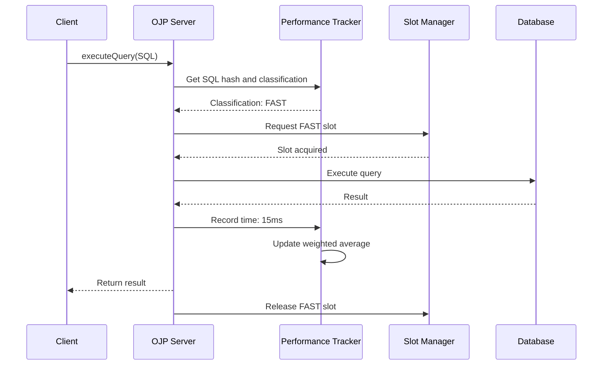
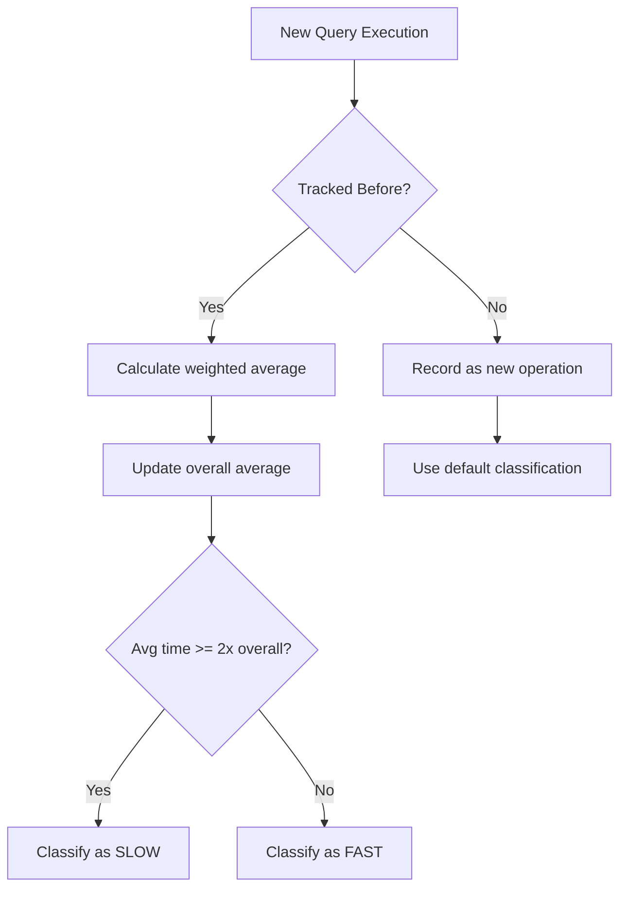
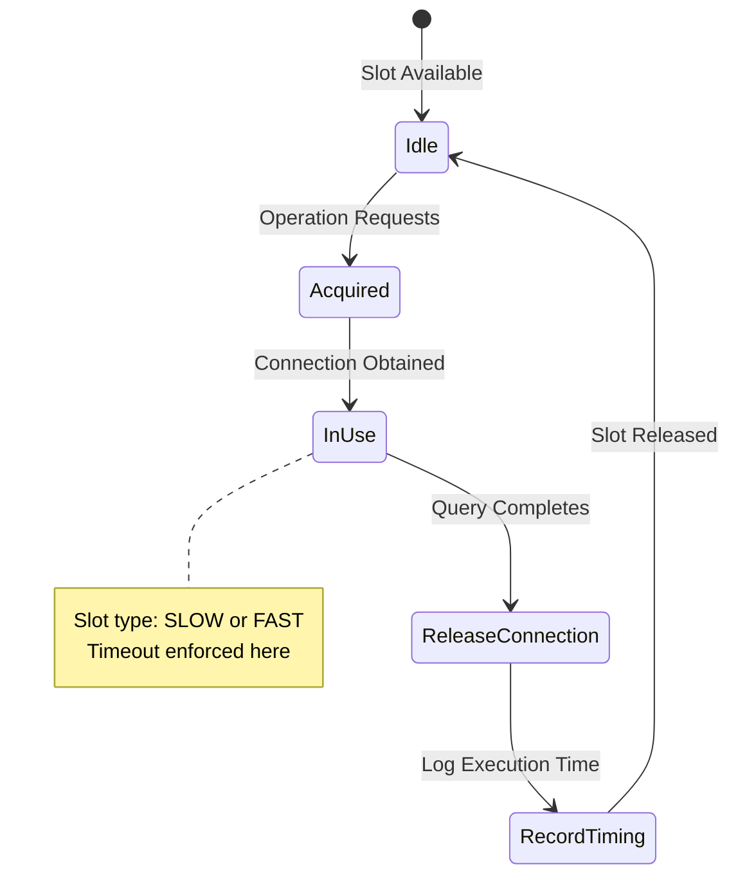
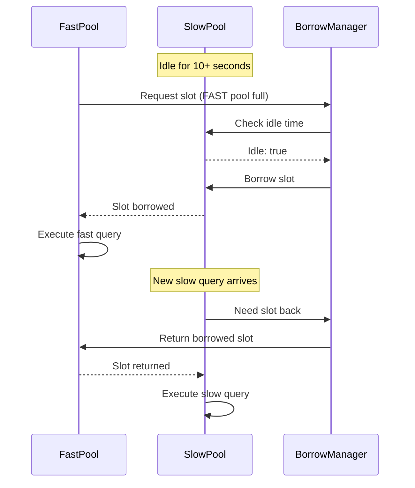
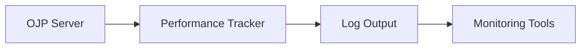

# Chapter 8: Slow Query Segregation

## Introduction

Picture this scenario: your application is humming along nicely, processing hundreds of quick database queries per second. Users are getting instant responses, everything feels snappy. Then end-of-month balance closure begins, launching 25 complex reporting queries simultaneously. With a pool of 30 connections, only 5 remain for everything else. When all 30 connections are consumed by these slow operations, the entire system grinds to a halt. Those fast queries that usually return in milliseconds are now waiting for heavy queries to complete, and your users are staring at loading spinners.

This is the classic problem of resource contention in database systems. When slow operations monopolize connection pool resources, fast operations suffer unnecessarily. Open J Proxy's Slow Query Segregation feature solves this problem elegantly by learning which operations are slow and managing them separately from fast operations.

> **AI Image Prompt**: Create a before/after comparison diagram showing database query processing. The "Before" side shows a single queue where fast queries (small boxes) are stuck behind slow queries (large boxes), with frustrated user icons. The "After" side shows two separate queues - one for fast queries processing smoothly and one for slow queries running independently, with happy user icons. Use traffic light colors (red for slow, green for fast) and visual flow arrows.

## The Problem: Mixed Workload Performance

Modern applications typically have a mix of query types. Some queries are simple lookups that return in milliseconds, while others are complex aggregations or reports that can take seconds or even minutes. When these share the same connection pool without any segregation, the system's overall responsiveness is determined by its slowest operations.

Consider a typical e-commerce application. Most user actions—viewing products, checking cart contents, looking up orders—involve simple, indexed queries that return instantly. But administrative reports, inventory reconciliation, or recommendation engine queries might scan large datasets and take much longer. Without segregation, a few slow reports can block hundreds of customer-facing queries, degrading the user experience for everyone.

The challenge is that you can't simply create separate pools manually because you don't always know ahead of time which queries will be slow. Query performance varies based on data size, index effectiveness, and query complexity. What you need is a system that automatically learns and adapts.

> **AI Image Prompt**: Create an infographic showing the "ripple effect" of slow queries. At the top, show a slow query (represented as a large anchor) entering a connection pool. Below, show multiple fast queries (represented as small speedboats) all stopped and waiting. Add timestamp indicators showing increasing wait times. Use visual elements like clock faces and frustrated emoji to emphasize the delay impact.

## How Slow Query Segregation Works

OJP's Slow Query Segregation feature solves this problem through intelligent monitoring, classification, and resource allocation. The system operates in several phases that work together seamlessly.

### Operation Monitoring and Learning

Every SQL operation that flows through OJP Server is monitored automatically. When a query executes, the system tracks two key pieces of information: the SQL statement itself (as a hash to save memory) and how long it took to complete. This isn't just a one-time measurement—OJP builds a historical profile of each unique SQL statement over time.

The tracking uses a weighted average formula that balances historical data with recent measurements. Each time an operation executes, the new measurement gets 20% weight while the historical average retains 80% weight. This approach smooths out outliers (like a query that happens to run slow once due to a temporary lock) while still adapting to changes in query patterns. The formula looks like this:

```
new_average = ((stored_average × 4) + new_measurement) / 5
```

This weighted approach means that if a query normally takes 10ms but occasionally takes 50ms due to contention, it won't suddenly be misclassified as slow. The system learns the typical behavior of each query and uses that knowledge for classification.

> **AI Image Prompt**: Create a flowchart diagram showing the query monitoring lifecycle. Show a SQL query entering the system, passing through a "Hash Generator" box, then into a "Performance Tracker" that records timing. Below, show a graph with multiple data points illustrating the weighted average calculation, with older points fading and newer points brighter. Use database and stopwatch icons.



### Classification: Slow vs Fast

Once the system has enough data about each operation, it performs classification. The classification logic is beautifully simple yet effective: any operation whose average execution time is double (2x) or more than the overall average is classified as "slow." Everything else is "fast."

Let's walk through a concrete example to see how this works. Imagine your application has three types of queries:

- User lookup queries average 10ms
- Order queries average 20ms  
- Report queries average 500ms

The system calculates the overall average across all operation types: (10 + 20 + 500) / 3 = 177ms. The slow threshold becomes 2 × 177 = 354ms. In this scenario, only the report queries exceed this threshold and get classified as slow. The user and order queries remain classified as fast, even though there's some variation between them.

This dynamic thresholding means the system adapts to your workload automatically. If you add more complex queries or if your data grows and slows down operations, the threshold adjusts accordingly. You don't need to manually configure query timeouts or maintain lists of which queries are slow.

> **AI Image Prompt**: Create a bar chart visualization showing query classification. Display multiple SQL queries as vertical bars with their average execution times. Draw a horizontal line representing the "overall average" and another dashed line at 2x that level labeled "Slow Threshold". Color bars below the threshold green (fast) and above it red (slow). Add labels with actual times like "10ms", "20ms", "500ms".



### Execution Slot Management

Here's where the magic happens. Once operations are classified, OJP manages their execution using a slot system. The total number of available slots is determined by your connection pool configured size. By default, OJP allocates these slots with a 20/80 split: 20% for slow operations and 80% for fast operations.

When a request comes in, it must first acquire an appropriate slot before it can obtain a database connection and execute. A fast query requests a fast slot; a slow query requests a slow slot. If no slots of the appropriate type are available, the request waits (with configurable timeouts).

This segregation is what protects your system. Even if all slow slots are occupied by long-running reports, fast slots remain available for quick queries. Your user-facing features stay responsive while background operations chug along in their own lane.

Let's make this concrete with numbers. Suppose your HikariCP pool has a maximum size of 20 connections. With default settings, OJP allocates 4 slots for slow operations (20%) and 16 slots for fast operations (80%). If four slow reports are running, a fifth slow report must wait for one to complete. Meanwhile, fast queries can use any of their 16 dedicated slots without interference.

> **AI Image Prompt**: Create a pool visualization showing slot allocation. Display 20 connection "slots" as boxes arranged in two groups - 4 red boxes labeled "SLOW SLOTS" and 16 green boxes labeled "FAST SLOTS". Show some boxes filled (darker) to represent "in use" and others empty (lighter) for "available". Add arrows showing queries being routed to appropriate slot types. Include percentage labels: "20% Slow" and "80% Fast".



### Dynamic Slot Borrowing

OJP adds one more clever optimization: slot borrowing. If one pool (slow or fast) has been idle for a configurable period (default: 10 seconds), the other pool can temporarily borrow its slots. This ensures you're not wasting resources when your workload is unbalanced.

Consider an application that processes mostly fast queries during the day but runs analytics reports at night. During daytime, the slow slots sit idle while fast slots might be fully utilized. With slot borrowing, those idle slow slots become available to fast queries, maximizing throughput. When a slow query eventually arrives, the borrowed slots are returned to the slow pool.

The borrowing mechanism includes safeguards to prevent thrashing. Slots are only borrowed when the source pool has been consistently idle, and they're returned immediately when the source pool needs them. This creates a system that's both protective (ensuring slow queries don't starve fast ones) and efficient (not leaving resources unused).

> **AI Image Prompt**: Create an animated-style diagram showing slot borrowing. Display two pools: "SLOW POOL (Idle)" with 4 empty slots and "FAST POOL (Busy)" with 16 filled slots. Draw an arrow showing 2 slots moving from SLOW to FAST pool (represented with dotted borders to show they're "borrowed"). Add a timer icon showing "Idle > 10s" triggering the borrowing. Include a reverse arrow labeled "Return on demand" showing slots going back.



## Configuration

Configuring Slow Query Segregation is straightforward. All settings are optional, with sensible defaults that work well for most applications. You'll add these properties to your OJP Server configuration file (typically `ojp-server.properties`).

### Enabling the Feature

The feature is controlled by a single enable/disable flag. When enabled, OJP performs full monitoring, classification, and slot management. When disabled, queries flow through without segregation (though basic monitoring still occurs for observability).

```properties
# Enable or disable slow query segregation
ojp.server.slowQuerySegregation.enabled=true
```

Starting with the feature enabled is generally recommended. If you need to disable it for troubleshooting, you can do so without restarting the server by updating the property and reloading configuration.

### Slot Allocation Percentage

The slot allocation percentage determines how many slots are reserved for slow operations. The default of 20% works well for most workloads, but you can adjust this based on your application's characteristics.

```properties
# Percentage of total slots allocated to slow operations (0-100)
ojp.server.slowQuerySegregation.slowSlotPercentage=20
```

If your application has many legitimate slow operations (like scheduled reports), you might increase this to 30% or even 40%. Conversely, if slow operations are rare and you want to maximize fast query throughput, you could reduce it to 10% or 15%. The key is ensuring that slow operations have enough slots to make progress without blocking fast operations.

> **AI Image Prompt**: Create a configuration guide infographic showing three scenarios: "Default 20%", "Report-Heavy 40%", and "Fast-Only 10%". For each, show a pie chart of slot allocation and describe the use case below. Use icons representing different application types (e-commerce for fast-only, analytics platform for report-heavy).

### Timeout Configuration

Two timeout settings control how long operations will wait to acquire slots. These timeouts are important for preventing requests from hanging indefinitely when the system is under heavy load.

```properties
# Timeout for acquiring a slow operation slot (milliseconds)
ojp.server.slowQuerySegregation.slowSlotTimeout=120000

# Timeout for acquiring a fast operation slot (milliseconds)
ojp.server.slowQuerySegregation.fastSlotTimeout=60000
```

The default slow slot timeout is 120 seconds (2 minutes), reflecting the expectation that slow operations might take a while. The fast slot timeout defaults to 60 seconds (1 minute), which is generous for operations that should complete quickly. If a timeout occurs, the client receives an exception indicating that no slot was available within the timeout period.

You might adjust these based on your SLAs and expected query durations. Consider your actual performance characteristics when setting timeouts—the goal is to catch genuine problems without false positives.

### Idle Timeout for Borrowing

The idle timeout determines how long a pool must be idle before its slots can be borrowed. The default of 10 seconds prevents rapid borrowing and returning that could cause instability.

```properties
# Idle time before allowing slot borrowing (milliseconds)
ojp.server.slowQuerySegregation.idleTimeout=10000
```

A longer idle timeout (like 30 seconds) makes borrowing less aggressive, which might be appropriate if your workload has short bursts of slow queries separated by idle periods. A shorter timeout (like 5 seconds) makes the system more responsive to load changes but could cause more slot shuffling.

### Complete Configuration Example

Here's a complete example showing all settings with explanatory comments:

```properties
# === Slow Query Segregation Configuration ===

# Enable the feature (default: true)
ojp.server.slowQuerySegregation.enabled=true

# Allocate 25% of slots to slow operations (default: 20)
# Increased from default because this application runs regular reports
ojp.server.slowQuerySegregation.slowSlotPercentage=25

# Slow operations can wait up to 3 minutes for a slot (default: 120000)
ojp.server.slowQuerySegregation.slowSlotTimeout=180000

# Fast operations fail after 30 seconds (default: 60000)
# Reduced from default to detect issues quickly
ojp.server.slowQuerySegregation.fastSlotTimeout=30000

# Pools must be idle 15 seconds before borrowing (default: 10000)
# Increased to prevent aggressive slot movement
ojp.server.slowQuerySegregation.idleTimeout=15000
```

This configuration reflects an application that runs regular reports (higher slow percentage) but wants fast queries to fail quickly if something is wrong (lower fast timeout), with conservative borrowing behavior (higher idle timeout).

## Benefits in Practice

The Slow Query Segregation feature delivers several concrete benefits that directly improve application behavior and user experience.

### Preventing Resource Starvation

The most immediate benefit is that fast operations never get blocked by slow ones. In traditional pooling, a single slow query could consume a connection for minutes while dozens of fast queries wait. With segregation, those fast queries continue flowing through their dedicated slots, maintaining application responsiveness even under mixed load.

This benefit is particularly valuable for customer-facing applications where user experience is paramount. Background reports or analytics can run without impacting the snappy feel of the UI. Users browsing products, checking out, or viewing their accounts experience consistent performance regardless of what administrative or analytical operations are happening behind the scenes.

### Maintaining System Throughput

By keeping fast and slow operations separate, the system maintains high overall throughput. Fast operations process quickly and release their slots for the next query, maintaining a high query-per-second rate. Slow operations use their own slots without slowing down the fast path.

Consider the math: if you have 16 fast slots handling queries that average 10ms each, you can theoretically process 1,600 queries per second through those slots. Without segregation, even one slow query consuming a connection for 10 seconds would reduce your effective capacity and increase average latency for all queries.

> **AI Image Prompt**: Create a line graph showing throughput over time (queries per second on Y-axis, time on X-axis). Show two lines: "Without Segregation" (red, dropping significantly when slow queries appear) and "With Segregation" (green, maintaining steady high throughput). Mark points where slow queries enter the system. Add annotations highlighting the throughput difference.

### Automatic Adaptation

The feature learns and adapts without manual intervention. As your data grows, as queries become more complex, or as usage patterns change, the classification adjusts automatically. You don't need to maintain configuration files listing which queries are slow or manually tune thresholds.

This automatic adaptation is especially valuable in agile development environments where the application evolves rapidly. New features might introduce new query patterns, or data growth might slow down previously fast operations. The segregation system adapts to these changes transparently.

### Efficient Resource Utilization

The slot borrowing mechanism ensures resources aren't wasted. During periods when your workload is unbalanced—heavily fast or heavily slow—the system dynamically adjusts slot allocation to match demand. This efficiency means you can configure more conservative slot percentages (ensuring protection when needed) without sacrificing performance during normal operation.

### Configurable Trade-offs

Every application is different, and the configuration options let you tune the behavior to match your specific requirements. Need more capacity for legitimate slow operations? Increase the slot percentage. Want to fail fast when something is wrong? Reduce timeouts. The system provides sensible defaults but gives you control when needed.

## Monitoring and Observability

Understanding what the Slow Query Segregation feature is doing in your production system is crucial for tuning and troubleshooting. OJP provides several ways to monitor the feature's behavior.

### Status Information

The feature exposes status information that shows the current state of the slot management system. This includes how many operations are being tracked, the current overall average execution time, and how slots are currently allocated (how many slow slots are in use, how many fast slots, how many are borrowed).

You can access basic status information through OJP's logging output, which includes slot usage and classification statistics. For production monitoring, consider implementing custom JMX beans or logging parsers to extract performance metrics.

### Per-Operation Classification

Beyond aggregate statistics, you can see how individual operations are classified. This is particularly useful when tuning the system or troubleshooting performance issues. If a query you expected to be fast is classified as slow, it might indicate a performance problem with that query that needs investigation.

### Historical Trends

Over time, you can track how classification changes. This can reveal patterns like queries that become slower as data grows, or operations that show high variability (sometimes fast, sometimes slow). These insights can guide optimization efforts and capacity planning.

> **AI Image Prompt**: Create a monitoring dashboard mockup showing key metrics for Slow Query Segregation. Include: a gauge showing current slot usage (fast vs slow), a real-time graph of query execution times with fast/slow threshold line, a table of top operations with their classifications, and alert indicators. Use a modern dashboard design with dark theme and green/red/yellow indicators.



## Practical Use Cases

Let's explore some real-world scenarios where Slow Query Segregation provides clear value.

### E-Commerce Platform

An online retailer's application handles thousands of customer queries per minute—product searches, cart operations, order status checks. These are all indexed, fast operations. However, the platform also runs periodic inventory synchronization queries and sales analytics reports that scan large tables.

Without segregation, when the inventory sync runs at the top of each hour, customer-facing operations slow down noticeably. Page load times increase, and in extreme cases, customers see timeout errors. With Slow Query Segregation enabled, the inventory sync uses its dedicated slow slots while customer operations continue using fast slots unimpeded. The retailer sees consistent sub-second response times regardless of background operations.

### SaaS Analytics Platform

A multi-tenant analytics SaaS application serves dashboard queries (fast) and custom report generation (slow) to hundreds of customers. Different customers have different usage patterns—some use mostly dashboards, others generate many reports.

Slow Query Segregation prevents a report-heavy customer from degrading performance for dashboard-heavy customers. Each customer's reports use slow slots, while all dashboard queries share the fast slot pool. The system maintains good performance for all customers without requiring per-customer resource allocation.

### Banking Application

A banking system processes thousands of transaction queries per second (checking balances, transferring money, paying bills). These must be fast for good customer experience. The system also runs compliance and fraud detection queries that scan historical transactions—these are complex and slow.

The bank configures Slow Query Segregation with 30% slow slots to accommodate fraud detection, while ensuring 70% of capacity remains available for customer transactions. Even during fraud investigation peaks, customer-facing operations maintain their performance targets, keeping customers happy while the bank fulfills its compliance obligations.

> **AI Image Prompt**: Create a use case comparison infographic showing three scenarios side-by-side: "E-Commerce", "SaaS Platform", and "Banking". For each, show a simple icon, list 2-3 fast query types and 2-3 slow query types, and include a key metric improvement (e.g., "99% of customer queries < 100ms"). Use consistent formatting and color coding.

## Thread Safety and Reliability

The Slow Query Segregation feature is designed to be production-ready and reliable under concurrent load. All components—the performance tracker, the classification engine, and the slot manager—are thread-safe and handle concurrent operations correctly without data corruption or deadlocks.

The weighted averaging calculation uses atomic operations to ensure that concurrent updates from multiple threads don't interfere with each other. The slot acquisition and release logic uses proper synchronization to prevent double-allocation or slot leaks. You can deploy this feature in high-concurrency environments with confidence.

## Backwards Compatibility

One of the design goals was to make the feature completely non-intrusive. When disabled, the feature performs only lightweight performance monitoring without affecting query execution. Existing applications continue to work without any code changes or configuration adjustments.

When you enable the feature, it activates smoothly without requiring application restarts (in most configurations) or client-side changes. The JDBC driver doesn't need to know about segregation—it all happens transparently on the server side. This makes adoption risk-free: you can enable it, observe its behavior, and disable it if needed, all without impacting your application.

## Best Practices

Based on our experience, here are some best practices for using Slow Query Segregation effectively.

**Start with defaults**: The default configuration (enabled, 20% slow slots) works well for most applications. Start there and only tune if you observe specific issues or have special requirements.

**Monitor before tuning**: Run with default settings for a few days while collecting metrics. Understand your actual workload before making configuration changes. You might be surprised by which queries are classified as slow.

**Tune conservatively**: When you do adjust settings, make small changes and observe the impact. A 5% change in slot percentage can have significant effects. Going from 20% to 40% slow slots doubles the slow capacity but halves the fast capacity—make sure that trade-off makes sense.

**Use timeouts appropriately**: The timeouts are safety nets, not performance tuning parameters. They should be generous enough that legitimate operations don't hit them during normal load. If timeouts are triggering frequently, you likely need more capacity (bigger pool or more servers) rather than shorter timeouts.

**Review classification regularly**: Periodically review which operations are classified as slow. If you see fast operations misclassified, investigate why they're running slowly. The classification is a valuable diagnostic signal.

> **AI Image Prompt**: Create a best practices checklist infographic with 6 items (one for each practice above). Use checkbox icons, brief 1-line summaries of each practice, and small illustrative icons (like a speedometer for "Monitor before tuning", a wrench for "Tune conservatively"). Use a clean, professional design with ample white space.

## Troubleshooting

While Slow Query Segregation typically works smoothly, here are some common issues and how to resolve them.

**Fast queries timing out**: If fast queries frequently hit the fast slot timeout, it usually means you need either more total capacity or a higher fast slot percentage. Check your slot usage metrics—if fast slots are consistently maxed out, increase the pool size or reduce slow slot percentage.

**Slow queries never completing**: If slow queries can't acquire slots and time out, you may have too few slow slots for your workload. Increase `slowSlotPercentage` or ensure that slow operations are actually completing and releasing their slots.

**Unexpected classifications**: If a query you expect to be fast is classified as slow (or vice versa), investigate the actual execution time. The classification is based on measured performance, so an unexpected classification often reveals a real performance issue. Check for missing indexes, lock contention, or data growth.

**Rapid classification changes**: If operations flip between fast and slow classification frequently, it might indicate high variability in performance. This could be due to caching effects, lock contention, or query plan changes. Consider if the operation's performance is actually stable or if there's an underlying issue.

**High slot contention**: If both fast and slow slots show high contention simultaneously, your overall pool size is likely too small for your workload. Increase the `maxPoolSize` configuration to add more total slots.

## Summary

Slow Query Segregation helps maintain application responsiveness in scenarios where you have mixed workloads. By automatically learning which operations are slow and reserving separate resources for each operation type, it can help protect your fast queries from being starved by slow ones.

The feature requires minimal configuration and adapts automatically to your workload. For applications that serve both interactive users and analytical workloads, it can be beneficial, though results will vary based on your specific use case and query patterns.

In the next chapter, we'll explore another feature that enhances availability and scalability: Multinode Deployment. While Slow Query Segregation ensures efficient use of resources on a single server, multinode deployment lets you spread load across multiple servers for even greater capacity and resilience.
