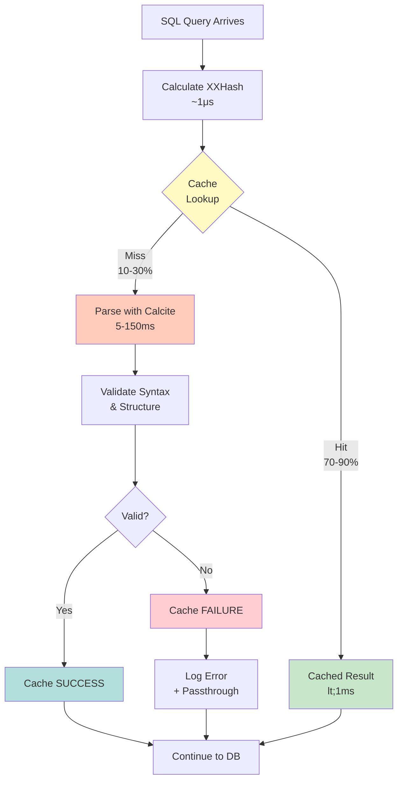

# Chapter 8a: SQL Enhancer Engine with Apache Calcite

Modern applications generate diverse SQL patterns through ORMs, query builders, and hand-written code. Some queries are well-optimized, others carry legacy inefficiencies, and many contain syntax errors that only surface at runtime when databases reject them. The SQL Enhancer Engine addresses these challenges by validating and optionally optimizing SQL queries using Apache Calcite before they reach your database.

This chapter explores OJP's SQL Enhancer Engine—an optional feature that adds intelligent query processing to your proxy layer. You'll learn how Apache Calcite integration provides syntax validation, how the caching strategy delivers high performance, how to configure and monitor the enhancer, and when to enable it for maximum benefit.

---

## 8a.1 Understanding SQL Enhancement

The SQL Enhancer Engine sits between your application and the database, intercepting queries for validation and optional optimization before execution. Think of it as a quality gate—queries pass through analysis that catches errors early, validates syntax correctness, and (in future versions) can improve query structure automatically.

### The Enhancement Pipeline

When a SQL query flows through OJP with the enhancer enabled, it follows a three-stage pipeline: hash calculation, cache lookup, and conditional parsing.

First, OJP calculates an XXHash fingerprint of the SQL text. XXHash is the same fast, collision-resistant algorithm used throughout OJP for performance tracking. Hashing a typical SQL string takes microseconds, making this step effectively free.

Second, OJP checks if this hash exists in the validation cache. If found (a cache hit), the query bypasses parsing entirely and proceeds directly to execution. This fast path adds less than 1 millisecond of overhead—immeasurable in production workloads.

Third, on a cache miss, OJP invokes Apache Calcite's SQL parser to validate the query. Calcite parses the SQL text into an Abstract Syntax Tree (AST), validates syntax and structure, and returns success or failure. This parsing takes 5-150ms depending on query complexity. OJP then caches the validation result and continues to database execution.

This three-stage design delivers a critical performance characteristic: **pay once, benefit always**. The first execution of a unique query incurs parsing cost, but every subsequent execution benefits from cached validation with minimal overhead.



**[IMAGE PROMPT]**: Create a detailed technical diagram showing the SQL enhancement pipeline. Use a horizontal flow from left to right: 1) SQL Query input (blue box), 2) XXHash calculation step (purple, "~1μs"), 3) Cache lookup decision diamond (yellow), splitting into two paths: Cache Hit path (green, "70-90% of queries", flowing through "Cached Validation <1ms" box) and Cache Miss path (orange, "10-30% of queries", flowing through "Apache Calcite Parser 5-150ms" box then "Syntax Validation" with checkmark icon), 4) Both paths converge at "Store in Cache" (purple cylinder icon), 5) Final "Execute on Database" box (green). Add timing annotations, percentage badges, and use professional colors with clear visual flow indicators. Include a sidebar showing cache statistics: "Hit Rate: 87%", "Avg Parse: 42ms", "Avg Hit: 0.8ms".

### Cache Effectiveness

The caching strategy's effectiveness stems from a fundamental characteristic of application database access patterns: **most applications execute a limited set of unique SQL patterns repeatedly**.

A typical web application might have 100-10,000 unique SQL queries defined in its codebase. These queries execute thousands or millions of times during application lifetime. An e-commerce application might execute the same "fetch product by ID" query millions of times, while the "generate annual sales report" query runs monthly.

This access pattern makes aggressive caching extremely effective. After a brief warmup period (minutes to hours depending on traffic), the cache contains all frequently-executed queries. New cache entries become rare. Cache hit rates stabilize at 70-90%, meaning the vast majority of queries bypass parsing overhead.

For a production application handling 10,000 queries per second with a 90% cache hit rate:
- **9,000 queries/second** hit the cache, adding <1ms overhead each
- **1,000 queries/second** miss the cache, incurring 5-150ms parsing cost
- **Average overhead**: ~5ms across all queries (negligible compared to database execution time)

The cache has no size limit—it grows dynamically to accommodate your application's working set. A typical application with 1,000 unique queries consumes about 1MB of heap for cache storage. Applications with 100,000 unique queries might use 100MB—still negligible on modern JVMs with multi-gigabyte heaps.

---

## 8a.2 Apache Calcite Integration

Apache Calcite powers the SQL Enhancer's validation capabilities. Understanding Calcite's role and capabilities helps you appreciate what the enhancer can and cannot do.

### What is Apache Calcite?

Apache Calcite is a mature, widely-adopted SQL parser and query optimizer framework. It understands ANSI SQL and various database dialects, parsing SQL text into Abstract Syntax Trees and providing query optimization capabilities.

Major projects rely on Calcite for SQL processing:
- **Apache Flink**: Stream processing SQL
- **Apache Drill**: Schema-free SQL queries
- **Apache Kylin**: OLAP cube SQL generation  
- **Apache Hive**: SQL-on-Hadoop query parsing

This broad adoption demonstrates Calcite's production readiness, performance characteristics, and versatility across diverse SQL workloads.

### Parsing and Validation

Calcite's `SqlParser` converts SQL text into a structured Abstract Syntax Tree (AST). This parsing process validates:

- **Syntax Correctness**: Keywords in correct positions, balanced parentheses, proper quoting
- **Structural Validity**: SELECT clauses before WHERE clauses, valid column references, proper join syntax
- **Grammar Compliance**: Queries follow SQL grammar rules defined by the selected dialect

What Calcite does NOT validate (in OJP's current integration):
- **Schema Correctness**: Whether referenced tables and columns actually exist
- **Type Compatibility**: Whether column types match operation requirements
- **Permission Validity**: Whether the user has access to referenced objects

This distinction is important. Calcite validates that SQL is **syntactically correct** but doesn't validate it against your actual database schema. Schema validation requires metadata that OJP doesn't currently maintain. The database performs these semantic validations during execution.

```java
// Example Calcite parsing in OJP
SqlParser.Config parserConfig = SqlParser.configBuilder()
    .setParserFactory(SqlParserImpl.FACTORY)
    .setConformance(SqlConformanceEnum.DEFAULT)
    .build();

SqlParser parser = SqlParser.create(sqlText, parserConfig);
SqlNode sqlNode = parser.parseQuery(); // Throws if invalid

// If we reach here, SQL is syntactically valid
// Cache the success and continue to database
```

### Dialect Support

SQL dialects differ in syntax extensions, supported functions, and keyword meanings. PostgreSQL's `RETURNING` clause, MySQL's `ON DUPLICATE KEY UPDATE`, and Oracle's `CONNECT BY` are all vendor-specific extensions.

Calcite supports multiple SQL dialects:
- **GENERIC**: ANSI-standard SQL, works across all databases
- **POSTGRESQL**: PostgreSQL-specific syntax and functions
- **MYSQL**: MySQL/MariaDB extensions
- **ORACLE**: Oracle SQL*Plus syntax
- **SQLSERVER**: Microsoft SQL Server T-SQL
- **H2**: H2 database syntax

Currently, OJP uses the GENERIC dialect regardless of your target database. This conservative choice ensures broad compatibility without requiring configuration. The code includes full support for database-specific dialects, but configuration wiring isn't yet complete.

```properties
# Current behavior (GENERIC dialect)
ojp.sql.enhancer.enabled=true

# Future configuration (not yet implemented)
ojp.sql.enhancer.dialect=POSTGRESQL
```

Using the GENERIC dialect provides substantial value even without vendor-specific parsing. It validates standard SQL syntax, catches typos and structural errors, and ensures queries follow basic SQL grammar rules. Most ORM-generated SQL and carefully-written application queries use standard syntax that GENERIC handles correctly.

When database-specific dialect support becomes available, you'll enable validation of vendor extensions. Until then, vendor-specific syntax that GENERIC doesn't understand triggers the passthrough mechanism—the query executes normally without validation.

### Parse Performance Characteristics

Understanding parse performance helps you predict enhancer impact on your workload.

**Simple Queries** (5-20ms parse time):
```sql
SELECT * FROM users WHERE id = 123
SELECT name, email FROM customers WHERE active = true
INSERT INTO logs (level, message) VALUES ('INFO', 'Started')
```

**Moderate Complexity** (20-60ms parse time):
```sql
SELECT u.name, COUNT(o.id) 
FROM users u
INNER JOIN orders o ON o.user_id = u.id
WHERE o.created_at > '2024-01-01'
GROUP BY u.name
```

**High Complexity** (60-150ms parse time):
```sql
WITH regional_sales AS (
  SELECT region, SUM(amount) as total_sales
  FROM orders
  WHERE year = 2024
  GROUP BY region
),
top_regions AS (
  SELECT region FROM regional_sales ORDER BY total_sales DESC LIMIT 5
)
SELECT r.region, r.total_sales,
       SUM(r.total_sales) OVER (ORDER BY r.total_sales DESC) as running_total
FROM regional_sales r
WHERE r.region IN (SELECT region FROM top_regions)
ORDER BY r.total_sales DESC
```

Parse time scales with query complexity—more joins, subqueries, and CTEs increase parsing cost. However, remember this cost is paid once per unique SQL pattern. A 100ms parse time for a complex report query is negligible when that query executes once per day and subsequent executions hit the cache.

---

## 8a.3 Configuration and Operation

Enabling and configuring the SQL Enhancer requires minimal effort. The feature integrates seamlessly with existing OJP configuration and operates transparently once enabled.

### Enabling the Enhancer

The SQL Enhancer is disabled by default. Enable it by setting a single property in `ojp.properties`:

```properties
# Enable SQL enhancement
ojp.sql.enhancer.enabled=true
```

Restart the OJP server for the change to take effect. The enhancer initializes during startup and logs its status:

```
[INFO] SQL Enhancer Engine initialized and enabled with dialect: GENERIC
```

To disable the enhancer, set the property to `false` or remove it entirely:

```properties
# Disable SQL enhancement
ojp.sql.enhancer.enabled=false
```

There is no performance penalty for having the enhancer disabled—queries flow through the normal path with no additional checks or overhead.

### Operation Modes

The enhancer operates in a single mode: **synchronous validation**. When enabled, every query flows through the enhancement pipeline before database execution.

This synchronous approach prioritizes predictability and simplicity:
- **Immediate Feedback**: Validation errors surface immediately in the same thread
- **No Background Processing**: No worker threads, background queues, or eventual consistency
- **Deterministic Behavior**: Query N always validates before executing, with no race conditions

The cache makes synchronous processing performant enough for production use. After warmup, the vast majority of queries hit the cache and incur minimal overhead.

### Error Handling and Passthrough

The enhancer follows a fail-safe philosophy: **validation failures never block legitimate queries**.

If Calcite cannot parse a query (due to vendor-specific syntax, timeout, or unexpected error), OJP:
1. Logs the error at DEBUG level
2. Passes the original SQL through unchanged to the database
3. Does NOT cache the failure (allowing retry on next execution)

```
[DEBUG] SQL parse error (passing through to database): Encountered unexpected token 'RETURNING'
```

This graceful degradation ensures the enhancer enhances but never breaks. If parsing fails, the database performs its own validation as always. You lose the benefit of early validation for that query, but application functionality remains intact.

This behavior makes the enhancer safe to enable in production. Even if Calcite struggles with certain SQL patterns, those queries simply bypass validation and execute normally.

### Configuration Properties Reference

```properties
# Core configuration
ojp.sql.enhancer.enabled=true              # Enable/disable enhancer (default: false)

# Future properties (not yet implemented)
ojp.sql.enhancer.dialect=GENERIC           # SQL dialect (default: GENERIC)
ojp.sql.enhancer.cache.max.size=1000000    # Max cache entries (default: unlimited)
ojp.sql.enhancer.parse.timeout.ms=5000     # Parse timeout (default: no timeout)
```

Currently, only `ojp.sql.enhancer.enabled` is active. Future versions will add dialect selection, cache size limits, and parse timeout configuration.

---

## 8a.4 Monitoring and Observability

The SQL Enhancer integrates with OJP's logging infrastructure, providing visibility into validation activity, cache performance, and error conditions.

### Log Levels and Output

**INFO Level** (recommended for production):
```
[INFO] SQL Enhancer Engine initialized and enabled with dialect: GENERIC
```

Shows enhancer initialization and current configuration. Minimal production overhead.

**DEBUG Level** (detailed diagnostics):
```
[DEBUG] SQL parsed successfully in 12ms: SELECT * FROM users WHERE ...
[DEBUG] Cache hit for SQL (hash: a7f3c9b2): SELECT * FROM orders ...
[DEBUG] SQL validation passed for query: INSERT INTO ...
[DEBUG] SQL parse error (passing through to database): Encountered unexpected token ...
```

Shows every validation attempt, cache hit/miss, parse timing, and validation results. Useful for troubleshooting but verbose for production.

**WARN Level** (unexpected conditions):
```
[WARN] SQL enhancer unexpected error (falling back to passthrough): NullPointerException in parser
```

Logs unexpected errors that cause passthrough. Indicates potential bugs or environmental issues worth investigating.

### Metrics and Performance Tracking

Currently, the SQL Enhancer doesn't export metrics to Prometheus or other monitoring systems. Observability relies on log analysis:

**Calculate Cache Hit Rate**:
```bash
# Count cache hits and misses from logs
grep "Cache hit for SQL" ojp.log | wc -l    # Cache hits
grep "SQL parsed successfully" ojp.log | wc -l  # Cache misses

# Hit rate = hits / (hits + misses)
```

**Analyze Parse Performance**:
```bash
# Extract parse times from debug logs
grep "SQL parsed successfully in" ojp.log | sed 's/.*in \([0-9]*\)ms.*/\1/' | awk '{sum+=$1; n++} END {print "Avg: " sum/n "ms"}'
```

**Count Passthrough Events**:
```bash
# Count validation failures
grep "passing through to database" ojp.log | wc -l
```

Future versions will add first-class metrics integration, exposing cache hit rate, parse timing percentiles, and validation success rate through Prometheus endpoints.

### Troubleshooting Common Issues

**High Parse Times**:
- **Symptom**: Average parse times exceed 100ms
- **Cause**: Very complex queries with many joins/subqueries
- **Solution**: Queries over 100ms might benefit from simplification. Review query structure for optimization opportunities.

**Low Cache Hit Rate** (below 50%):
- **Symptom**: More cache misses than hits in logs
- **Cause**: Highly dynamic SQL generation creates many unique queries
- **Solution**: Review query generation logic. Consider parameterizing dynamic values instead of embedding them in SQL text.

**Frequent Passthrough Events**:
- **Symptom**: Many "passing through to database" log entries
- **Cause**: Vendor-specific SQL syntax that GENERIC dialect doesn't understand
- **Solution**: Normal for database-specific features. Wait for dialect-specific parsing support, or disable enhancer if passthrough rate exceeds 30%.

**Memory Growth**:
- **Symptom**: OJP heap usage increases steadily
- **Cause**: Unbounded cache growing with unique SQL patterns
- **Solution**: Applications generating millions of unique queries may need cache size limits (future feature) or should disable enhancer.

---

## 8a.5 Use Cases and Best Practices

The SQL Enhancer provides maximum value in specific scenarios. Understanding when to enable it helps you make informed deployment decisions.

### Ideal Use Cases

**ORM-Generated SQL Validation**:

Object-Relational Mappers like Hibernate, JPA, and MyBatis generate SQL dynamically from entity mappings and configuration. Misconfigured relationships, missing annotations, or incorrect type mappings can produce invalid SQL that only manifests at runtime.

The enhancer validates this generated SQL immediately, providing early detection of ORM configuration issues. Instead of discovering a syntax error when a user triggers an edge case in production, you catch it during development or testing when the enhancer first encounters the generated SQL.

```java
// Example: Hibernate generates SQL from @Entity annotations
@Entity
public class User {
    @Id private Long id;
    @Column(name="user_name") private String name;  // Typo in column name
}

// SQL generated: SELECT user_nmae FROM users  -- Would fail at database
// Enhancer catches: Parse error, column name mismatch with schema (future feature)
```

**Legacy Application Modernization**:

Applications with decades-old hand-written SQL often contain:
- Deprecated syntax that works but generates warnings
- Typos that only fail under specific data conditions
- Constructs that worked in old database versions but fail in new ones

The enhancer catches these issues immediately, helping you identify and fix problematic queries before migrating to new database versions or refactoring the application.

**Dynamic Query Building**:

Applications that construct SQL dynamically from user input, configuration, or business rules can inadvertently create invalid queries. The enhancer validates these constructed queries before execution, catching construction errors early.

```java
// Example: Dynamic query building
StringBuilder sql = new StringBuilder("SELECT * FROM ");
sql.append(tableName);  // What if tableName is null or invalid?
sql.append(" WHERE ");
sql.append(condition);  // What if condition has syntax errors?

// Enhancer validates the constructed SQL before execution
```

**Development Environment Acceleration**:

Enabling the enhancer in development provides immediate feedback on SQL errors. Instead of executing a query, waiting for database response, and seeing an error, you get validation feedback instantly through OJP logs.

This accelerates the development cycle—developers identify and fix SQL issues faster, reducing the time from error to resolution.

### When NOT to Enable

**High-Throughput, Latency-Sensitive Workloads**:

If your application handles 100,000+ queries/second with strict sub-millisecond latency requirements, even the minimal cache overhead might be unacceptable. Profile carefully before enabling in such scenarios.

**Vendor-Specific SQL Heavy Applications**:

If your application heavily uses database-specific syntax (PostgreSQL arrays, MySQL JSON functions, Oracle hierarchical queries), the GENERIC dialect will trigger frequent passthrough. Wait for dialect-specific parsing support.

**Applications with Millions of Unique Queries**:

If your application generates truly unique SQL for every request (perhaps embedding timestamps or random values in query text), cache effectiveness drops dramatically. Such applications see minimal benefit and should disable the enhancer.

### Production Deployment Best Practices

**1. Test in Staging First**:

Enable the enhancer in staging environments that mirror production traffic. Monitor cache hit rates, parse times, and passthrough events. Verify that application behavior remains correct and performance acceptable.

**2. Pre-Warm the Cache**:

For user-facing applications, consider pre-warming the cache during startup by executing common queries against a test database. This avoids first-query latency for critical paths.

```java
// Example: Cache pre-warming during application startup
@PostConstruct
public void warmUpSQLCache() {
    jdbcTemplate.queryForList("SELECT * FROM users WHERE id = ?", 1);
    jdbcTemplate.queryForList("SELECT * FROM orders WHERE user_id = ?", 1);
    // ... execute other common queries
}
```

**3. Monitor Cache Effectiveness**:

During initial production deployment, enable DEBUG logging temporarily to measure cache hit rate and parse performance. Once you confirm 70%+ hit rate, reduce to INFO or WARN logging.

**4. Use ERROR/WARN Logging in Steady State**:

After the initial deployment monitoring period, set log levels to ERROR or WARN for maximum performance. The enhancer's DEBUG logging is detailed but verbose.

**5. Plan Disable Procedure**:

Document how to disable the enhancer (set property to false, restart). Practice this in staging so operations teams are comfortable executing it quickly if needed.

**6. Set Realistic Expectations**:

The first execution of each unique query incurs parsing overhead. For applications with 10,000 unique queries, expect 10,000 cache misses during warmup. Plan for this initial latency impact.

---

## 8a.6 Future Enhancements

The current SQL Enhancer implementation focuses on validation and caching with conservative syntax support. Several enhancements are planned for future releases.

### Query Optimization

Calcite includes powerful query optimization capabilities that OJP doesn't currently leverage:

- **Predicate Pushdown**: Moving filter conditions closer to data sources
- **Join Reordering**: Optimizing join order for better performance  
- **Constant Folding**: Simplifying expressions with constants at parse time
- **Redundant Expression Elimination**: Removing duplicate computations

Future versions may offer opt-in query rewriting where Calcite optimizes queries before database execution. This would enable automatic query improvement without application code changes.

```properties
# Future configuration
ojp.sql.enhancer.optimize.enabled=true
ojp.sql.enhancer.optimize.rules=PREDICATE_PUSHDOWN,JOIN_REORDERING
```

### Database-Specific Dialect Selection

Wiring configuration to select specific dialects will enable validation of vendor-specific syntax:

```properties
# Enables PostgreSQL-specific syntax validation
ojp.sql.enhancer.dialect=POSTGRESQL
```

This will reduce passthrough events and provide more accurate validation for applications using database-specific features.

### Schema-Aware Validation

True semantic validation requires knowledge of your database schema—tables, columns, types, constraints. Future versions might optionally query database catalogs to validate:

- Whether referenced tables exist
- Whether column names are correct
- Whether column types match operation requirements
- Whether indexes exist for query predicates

```properties
# Future schema validation
ojp.sql.enhancer.schema.validation.enabled=true
ojp.sql.enhancer.schema.cache.refresh.minutes=60
```

### Metrics and Observability Integration

First-class integration with Prometheus will expose enhancer metrics:

- `ojp_sql_enhancer_cache_hit_rate`: Cache effectiveness
- `ojp_sql_enhancer_parse_duration_ms`: Parse timing percentiles
- `ojp_sql_enhancer_validation_success_total`: Successful validations
- `ojp_sql_enhancer_passthrough_total`: Queries bypassing validation

These metrics will enable dashboards and alerting on enhancer behavior.

### Per-Datasource Configuration

Supporting enhancer enable/disable per connection pool will allow selective validation:

```properties
# Enable for production DB, disable for reporting DB
ojp.datasource.prod.sql.enhancer.enabled=true
ojp.datasource.reporting.sql.enhancer.enabled=false
```

### Asynchronous Parsing Mode

An async mode could parse queries in the background without blocking execution:

- First execution: Query executes immediately, parsing happens asynchronously
- Subsequent executions: Use cached validation result if parsing completed
- Trade-off: Immediate execution vs. deferred validation feedback

```properties
# Future async mode
ojp.sql.enhancer.async.enabled=true
ojp.sql.enhancer.async.thread.pool.size=4
```

---

## Key Takeaways

The SQL Enhancer Engine with Apache Calcite adds intelligent query validation to OJP's processing pipeline:

1. **Validation Focus**: The enhancer validates SQL syntax and structure, catching errors before database execution
2. **Aggressive Caching**: XXHash-based caching delivers 70-90% hit rates, making validation overhead minimal in steady state
3. **Calcite Integration**: Apache Calcite's mature parser handles ANSI SQL with support for database-specific dialects
4. **Fail-Safe Design**: Parse errors trigger passthrough, ensuring validation failures never block legitimate queries
5. **Production Ready**: Conservative defaults, graceful error handling, and transparent operation make it safe for production
6. **Optional Feature**: Disabled by default, providing opt-in adoption when validation benefits justify parsing overhead
7. **Future Potential**: Foundation supports query optimization, schema validation, and metrics integration in future releases

Enable the SQL Enhancer when early validation benefits outweigh first-query parsing costs—particularly for ORM-generated SQL, legacy application modernization, or development environments where immediate error feedback accelerates development cycles.

---

**Previous Chapter**: [← Chapter 8: Slow Query Segregation](part3-chapter8-slow-query-segregation.md)  
**Next Chapter**: [Chapter 9: Multinode Deployment →](part3-chapter9-multinode-deployment.md)
