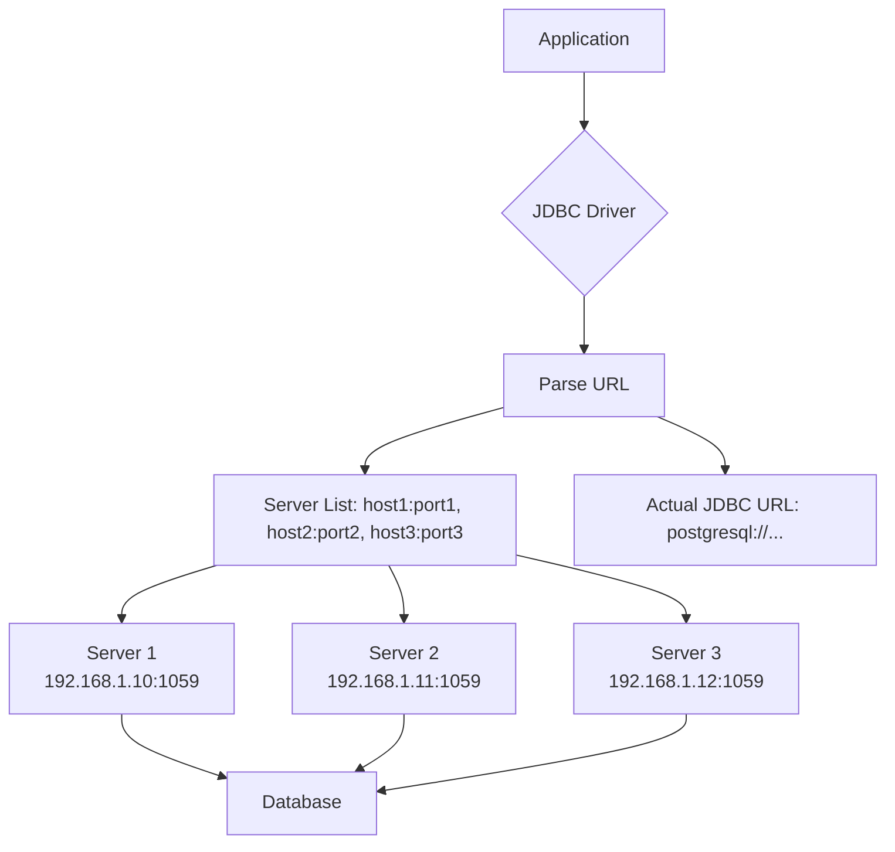
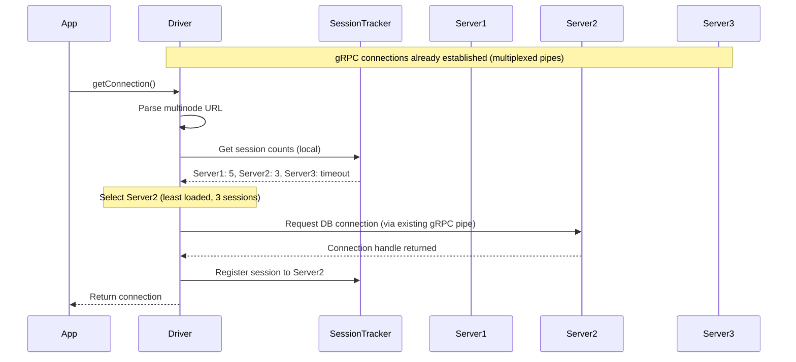
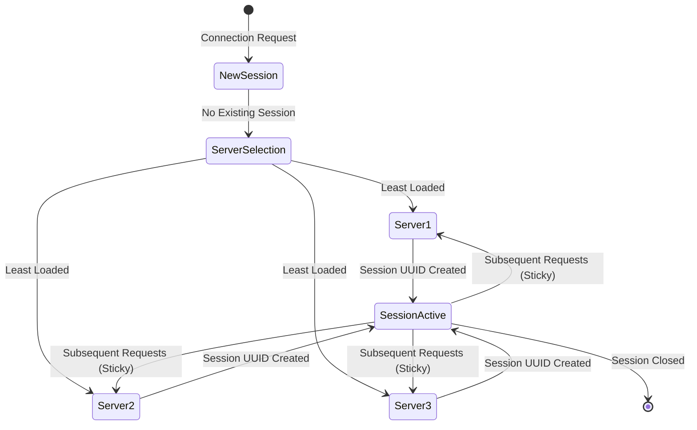
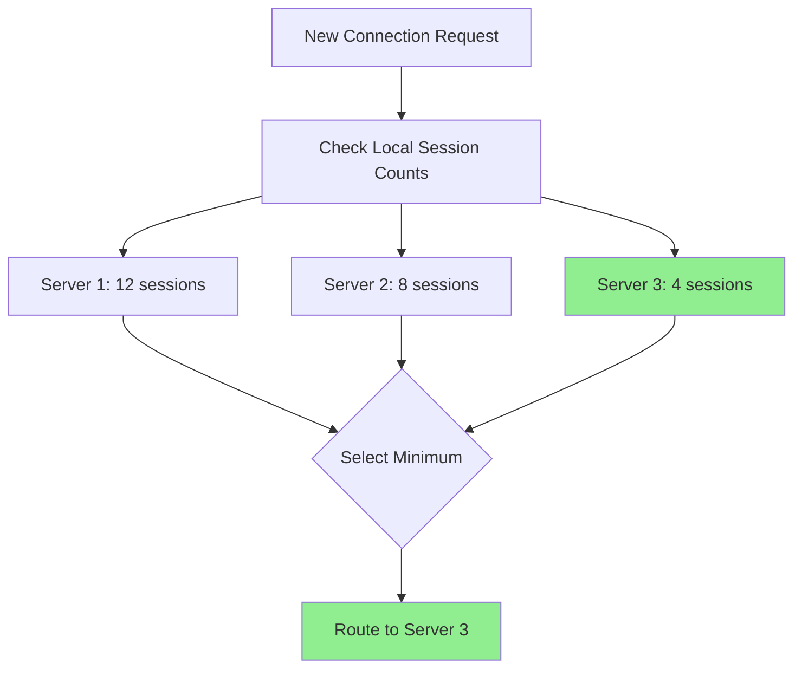
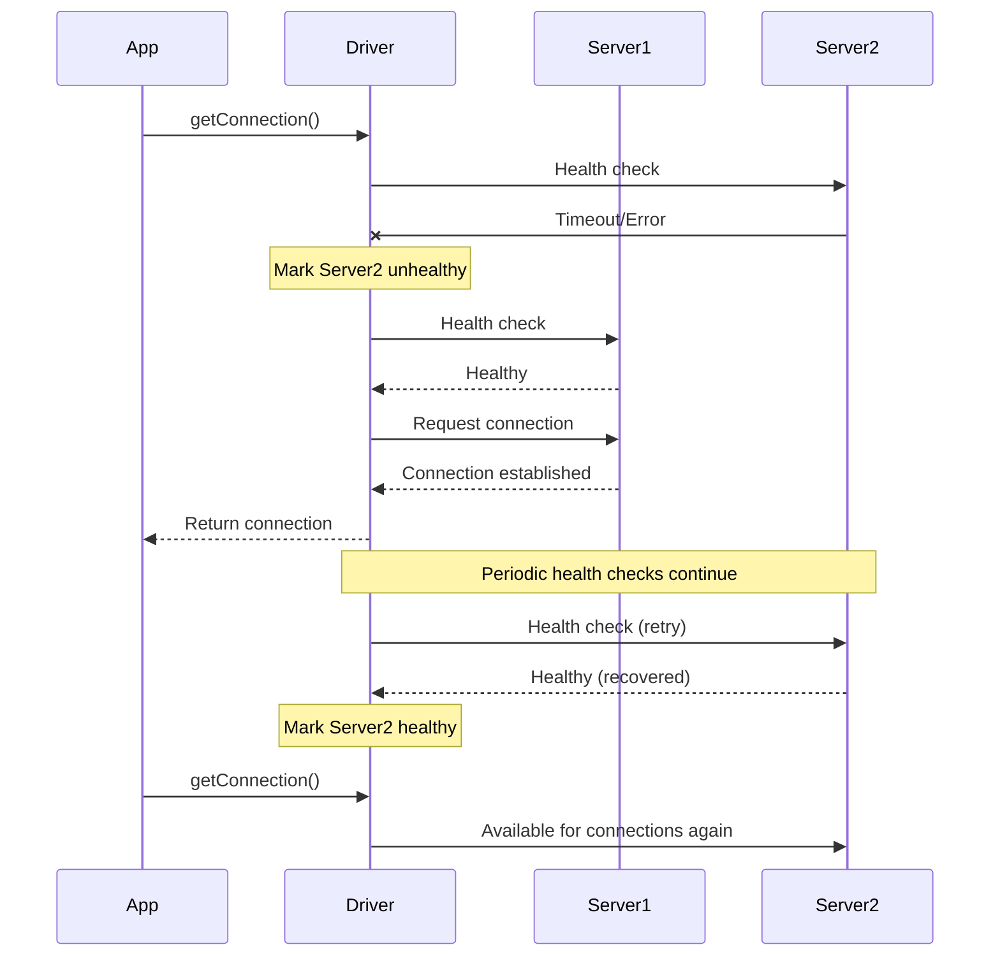
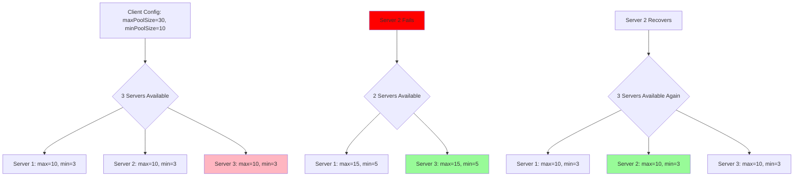
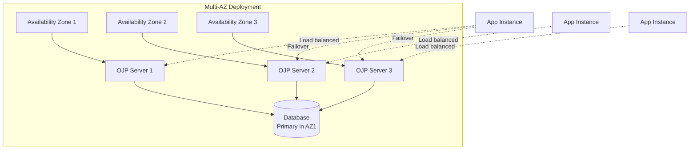
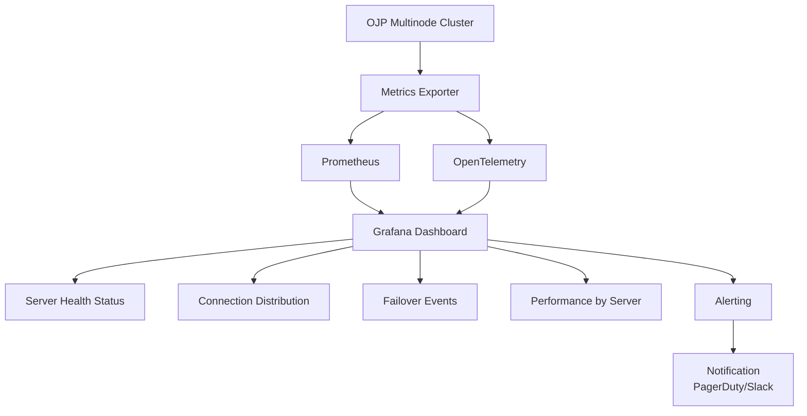

# Chapter 9: Multinode Deployment

> **Note**: This chapter focuses on the operational aspects of deploying and configuring OJP in multinode mode. For a conceptual understanding of OJP's smart load balancing and automatic failover mechanisms, and how they compare with traditional database proxies, see **[Chapter 2a: OJP as Smart Load Balancer and Automatic Failover](part1-chapter2a-smart-load-balancing.md)**.

## Introduction

Every production system eventually faces the question: "What happens if this server goes down?" For database connection management, the answer matters tremendously. Your application might be stateless and easily scalable, but if it depends on a single OJP Server instance for all database connectivity, that server becomes a single point of failure. A network blip, a hardware issue, or even a planned maintenance window could bring your entire application to a halt.

Open J Proxy's multinode deployment capability solves this problem elegantly. Instead of connecting to a single OJP Server, your application can connect to multiple servers simultaneously. These servers work together to provide high availability, automatic failover, load distribution, and fault tolerance—all without requiring changes to your application code beyond a simple URL modification.

> **AI Image Prompt**: Create a before/after architecture diagram. The "Before" side shows multiple application instances (represented as blue boxes) all connecting to a single OJP Server (represented as a yellow box with a red X or warning sign), which connects to a database. The "After" side shows the same applications connecting to three OJP Servers (represented as green boxes), demonstrating redundancy. Use arrows to show connections and include a small "failover" icon with a curved arrow between servers.

## The High Availability Challenge

Modern applications are designed for resilience. You run multiple instances behind a load balancer. You use health checks and automatic scaling. You deploy across availability zones. But what about your database connectivity layer?

If all your application instances connect through a single OJP Server, you've introduced a bottleneck and a single point of failure. Traditional load balancers might seem like a solution, but as explained in **[Chapter 2a](part1-chapter2a-smart-load-balancing.md)**, they don't understand the nuances of database connections—session stickiness, transaction boundaries, connection pooling semantics. OJP's client-side load balancing provides something smarter.

Consider a typical microservices deployment running in Kubernetes. You might have 20 pods of your application, each needing database access. With a single OJP Server, that server must handle all 20 pods' connection requests. If it fails, all 20 pods lose database connectivity simultaneously. If it becomes overloaded, all pods experience slow connection acquisition. The system's reliability is only as good as that single server.

Multinode deployment distributes these concerns across multiple OJP Servers. Your 20 application pods spread their connections across, say, three OJP Servers. Each server handles a portion of the load. If one fails, the other two absorb its share automatically. If load increases, you can add more servers without changing application code.

> **AI Image Prompt**: Create an illustrated problem scenario showing a single OJP server being overwhelmed. Draw the server as a cartoon character struggling under pressure (sweating, shaking) with many connection requests (represented as arrows) coming from multiple application instances above. Show warning indicators like "High CPU", "Queue Building Up", and "Response Slowing". Use expressive visual metaphors to convey system stress.

## How Multinode Deployment Works

The multinode capability builds on JDBC's standard URL mechanism in an elegant way. Instead of specifying a single OJP Server address, you provide a comma-separated list of server addresses. The driver handles everything else—connecting to servers, distributing load, detecting failures, and recovering when servers return to health.

### JDBC URL Format

The URL format extension is simple and intuitive. Where you previously had one server address, you now have multiple addresses separated by commas:

```
# Single node (original format)
jdbc:ojp[host:port]_actual_jdbc_url

# Multinode format
jdbc:ojp[host1:port1,host2:port2,host3:port3]_actual_jdbc_url
```

Let's look at some concrete examples to make this tangible. Here's a PostgreSQL connection using three OJP Servers:

```java
String url = "jdbc:ojp[192.168.1.10:1059,192.168.1.11:1059,192.168.1.12:1059]" +
             "_postgresql://localhost:5432/mydb";
Connection conn = DriverManager.getConnection(url, "user", "password");
```

From the application's perspective, this is still just a JDBC URL. You use `DriverManager.getConnection()` exactly as before. The complexity of managing multiple servers is hidden within the driver.

Here's the same concept with MySQL using hostname-based addresses:

```java
String url = "jdbc:ojp[db-proxy1.example.com:1059,db-proxy2.example.com:1059]" +
             "_mysql://localhost:3306/testdb";
Connection conn = DriverManager.getConnection(url, "user", "password");
```

Notice that the actual database URL (the part after the underscore) remains unchanged. You're still connecting to `localhost:3306/testdb`—that's the database your OJP Servers are proxying. What changed is that you now have two proxy servers instead of one.

The servers can even use different ports if needed:

```java
String url = "jdbc:ojp[db-proxy1:1059,db-proxy2:1060,db-proxy3:1061]" +
             "_oracle:thin:@localhost:1521/XEPDB1";
Connection conn = DriverManager.getConnection(url, "user", "password");
```

This flexibility lets you deploy OJP Servers however makes sense for your infrastructure. Maybe they're on different hosts at the same port, or all on the same host at different ports (useful for development), or any other combination.

> **AI Image Prompt**: Create a visual guide showing URL format evolution. Display three panels: "Single Node URL" showing the basic format, "Multi-Node URL" showing the comma-separated format, and "Parsed Structure" showing how the driver breaks down the URL into components (server addresses array + actual JDBC URL). Use different colors to highlight different URL parts and arrows to show the parsing flow.



### Connection Establishment Process

When your application requests a connection using a multinode URL, the JDBC driver goes through a sophisticated process to select the right server and establish the connection. Understanding this process helps you reason about your system's behavior.

First, the driver parses the URL and extracts the list of server addresses. It maintains state about each server: whether it's healthy, how many connections it currently has, and when it was last checked. This state persists across connection requests, so the driver learns and remembers each server's characteristics.

When establishing a new connection, the driver evaluates which servers are currently available. It pings each server (or uses cached health information from recent requests) to determine if it's responsive. Servers that fail health checks are temporarily marked as unhealthy and bypassed for new connections.

Among the healthy servers, the driver selects one based on its load-aware selection algorithm. By default (and you should use this default), operations are sent to the server with the fewest active connections. This approach naturally balances load across servers and prevents any single server from becoming a hotspot.

The gRPC connection to each OJP Server is established once when the driver first connects, creating a multiplexed pipe that handles multiple virtual connections (connection handles) on the client side. When a server is selected for a database operation, the driver sends the operation request over the existing gRPC connection to that server. The load-aware selection decides which server's gRPC pipe receives each operation, not which gRPC connection to establish. If an operation fails—perhaps the server went down between the health check and the request—the driver automatically retries with another healthy server. This retry logic happens transparently; your application simply sees a successful connection (after a slight delay) or an error if all servers are unavailable.

> **AI Image Prompt**: Create a flowchart showing the connection establishment decision process. Start with "Connection Request", flow through "Parse URL", "Check Server Health", "Select Server (Least Loaded)", "Establish gRPC Connection", with decision diamonds for "Servers Available?" and "Connection Successful?". Show retry loops and final outcomes. Use green paths for success and red paths for failure scenarios.



### Session Stickiness and Affinity

Once a session is established—identified by a unique session UUID—all subsequent operations for that specific connection must go to the same OJP Server. This session stickiness is crucial for maintaining consistency, especially for operations that involve server-side state like active transactions.

When you open a virtual connection and it gets assigned to, say, Server 2, that virtual connection's session UUID is associated with Server 2 in the driver's state. All operations on that specific connection handle are routed to Server 2.

This stickiness extends to transaction boundaries. If you start a transaction on Server 2, all operations within that transaction must execute on Server 2. The driver understands transaction semantics and enforces this routing transparently. You don't need to do anything special in your application code—just use normal JDBC transaction methods like `setAutoCommit(false)`, `commit()`, and `rollback()`.

**Note on Temporary Tables and Session Variables**: Features like temporary tables and session variables are session-specific database features. Support for these features in multinode deployments is currently in development and is expected from version 0.4.0-beta. In the current version, temporary tables created on one connection handle won't be automatically visible to another connection handle even from the same application.

> **AI Image Prompt**: Create a diagram illustrating session stickiness. Show an application making three database requests (labeled "Request 1", "Request 2", "Request 3") all with the same "Session UUID: abc-123". Draw arrows showing all three requests being routed to "Server 2" while "Server 1" and "Server 3" are visible but not used. Add a small inset showing a temporary table icon and transaction symbol to illustrate session-specific operations.



## Load-Aware Server Selection

The heart of multinode's intelligent behavior is its load-aware server selection algorithm. Rather than using simple round-robin distribution (which was the legacy behavior), modern OJP uses a sophisticated approach that considers actual server load when routing new connections. For a detailed explanation of how this compares to traditional database proxies, see **[Chapter 2a](part1-chapter2a-smart-load-balancing.md)**.

### How Load-Aware Selection Works

The JDBC driver maintains client-side session tracking for each OJP Server. When establishing a new connection, the driver consults these local session counts and routes the request to the server with the fewest active sessions.

This approach has several advantages over round-robin. Servers handling longer-running queries naturally accumulate more sessions, and the driver automatically directs new requests to less-loaded servers. This prevents round-robin from continuing to send connections to an already-overloaded server simply because it's "next in line."

Load-aware selection also adapts automatically when servers are added or removed. If you add a fourth server to a three-server cluster, it immediately starts receiving connections because it has zero active connections. The driver doesn't need any special configuration—it just starts using the new server naturally.

The selection happens at connection request time, not at URL parse time. This means the driver can adapt to changing conditions continuously. If a server becomes slow (perhaps due to a slow query or resource contention), it accumulates connections and becomes less attractive for new requests. When the slow condition resolves and connections complete, the server becomes attractive again automatically.

> **AI Image Prompt**: Create a diagram showing three servers as columns with different heights representing their current connection counts: "Server 1: 12 connections" (tallest), "Server 2: 8 connections" (medium), "Server 3: 4 connections" (shortest). Show a new connection request (represented as a glowing connection icon) with an arrow pointing to Server 3, which is labeled "Selected: Least Loaded". Use bar chart styling with numbers above each column.



### Configuration Options

While load-aware selection is the recommended default, you can configure the behavior if needed. The key setting is whether load-aware selection is enabled:

```properties
# Enable load-aware server selection (default: true, recommended)
ojp.loadaware.selection.enabled=true
```

When set to `true`, the driver uses the load-aware algorithm described above. When set to `false`, it falls back to legacy round-robin behavior where servers are selected in rotation regardless of their current load.

You should almost always use load-aware selection. The only reason to disable it would be if you have very specific requirements about connection distribution or if you're troubleshooting and want to eliminate variables. For production use, leave it enabled.

### Impact on Performance and Distribution

Load-aware selection typically results in more even distribution of work across servers compared to round-robin. This is somewhat counterintuitive—you might think round-robin would be perfectly even—but the reality of varying query durations means round-robin can create imbalances.

Consider this scenario: Server 1 happens to receive several long-running queries. With round-robin, it continues receiving new connections even though it's busy. Those new connections might be quick queries that would have completed instantly on a less-loaded server, but instead they wait for pool capacity. With load-aware selection, those quick queries go to servers that have capacity, completing faster and improving overall throughput.

The net effect is better utilization of your cluster capacity and more predictable performance characteristics. Queries complete faster on average because they're less likely to wait for capacity at an overloaded server.

## Automatic Failover and Recovery

One of the most powerful aspects of multinode deployment is automatic failover. When a server fails or becomes unreachable, the driver handles it gracefully without impacting your application (beyond the connections that were using the failed server).

### Failure Detection

The driver detects failures in multiple ways. The most obvious is when a connection attempt fails—the server doesn't respond, the network times out, or the gRPC call returns an error. When this happens, the driver immediately marks that server as unhealthy and won't use it for new connections.

Health checks also run periodically (as part of connection requests) to verify server status. If a server that was previously healthy stops responding to health checks, it's marked as unhealthy. This proactive detection means the driver often knows a server is down before trying to send it real traffic.

The driver tracks how long a server has been unhealthy. For recently failed servers, it checks frequently (every few seconds) to detect recovery quickly. For servers that have been down longer, check frequency decreases to avoid wasting resources. This adaptive checking balances quick recovery detection with efficient resource use.

> **AI Image Prompt**: Create a timeline diagram showing server failure and recovery. Display a horizontal timeline with markers for "Server 2 Fails" (red X), "Health Checks Fail" (multiple red dots), "Server 2 Marked Unhealthy" (orange warning triangle), "Server 2 Recovered" (green checkmark), and "Server 2 Returns to Service" (green circle). Show connections flowing to other servers during the failure period, then resuming to all servers after recovery.



### Retry Logic

When a connection request fails due to a server error, the driver doesn't immediately give up. It has configurable retry logic that attempts other healthy servers before returning an error to your application.

The retry behavior is controlled by two configuration properties:

```properties
# Number of retry attempts (-1 for infinite retry, or positive number)
ojp.multinode.retryAttempts=-1

# Delay between retry attempts (milliseconds)
ojp.multinode.retryDelayMs=5000
```

The default of `-1` for retry attempts means the driver will keep trying indefinitely (across all available servers) until either a connection is established or all servers are exhausted. This aggressive retry behavior makes sense for high-availability systems where you want to survive transient failures.

If you prefer bounded retry behavior, you can set `retryAttempts` to a positive number like `3`. The driver will then try up to three times before giving up. This might be appropriate if you want your application to fail fast and handle errors explicitly rather than blocking on retries.

The retry delay prevents rapid hammering of failed servers. With a 5-second delay (the default), if all servers fail, the driver waits 5 seconds before trying again. This gives transient network issues time to resolve without overwhelming the infrastructure with connection attempts.

### Server Recovery

When a failed server recovers and comes back online, the driver detects this through health checks and begins routing new connections to it. The recovery is automatic and gradual. The server isn't immediately flooded with connections; instead, it receives connections according to the load-aware selection algorithm.

If the recovered server is less loaded than others (which it typically is, since it wasn't receiving traffic while down), it gets more new connections until load balances across all servers. This gradual recovery prevents overwhelming a server that might have just recovered from an issue.

Applications should not use connection pools on the client side when using OJP, as OJP Server controls connection pooling on the server side. If a server recovers, the JDBC driver's load-aware selection automatically starts routing new connection requests to it, and the distribution rebalances naturally over time as operations are executed.

## Server Coordination and Pool Management

When you deploy multiple OJP Servers in a cluster, they need to coordinate on connection pool sizing to ensure you're not creating more database connections than intended. OJP handles this coordination automatically.

### Pool Size Division

Consider your OJP client configuration: you specify a maximum pool size, let's say 30 connections. When you connect to three OJP Servers, you don't want each server creating 30 connections to the database—that would give you 90 total, which might exceed your database's connection limit or licensing.

OJP Servers do not connect to each other directly. Instead, they use client relay information about cluster health to make decisions about pool sizing. When the JDBC driver connects to an OJP Server, it provides information about the cluster configuration (which servers exist) and health status (which servers are currently available). Each OJP Server uses this information from its clients to understand how many other healthy servers are in the cluster and adjusts its connection pool sizing accordingly.

This division happens dynamically. If a server fails and you're down to two healthy servers, each server increases its pool size to 15 to maintain the total capacity of 30. When the third server recovers, all three rebalance back to 10 each. Your total database connection count remains roughly constant regardless of server failures.

The coordination applies to both regular connection pools and XA backend session pools (which we'll cover in Chapter 10). Everything stays balanced automatically without manual intervention or complex configuration.

> **AI Image Prompt**: Create an illustrated diagram showing pool size coordination. Display three scenarios vertically: "3 Servers Healthy" (each showing "10 max connections" pool), "1 Server Fails" (two remaining servers each showing "15 max connections" pool, one failed server grayed out), and "Server Recovers" (three servers each back to "10 max connections"). Show the total always equals 30. Use pool/container visual metaphors with connection icons inside.



### Maintaining Total Capacity

The automatic pool coordination ensures your total database connection capacity remains stable. If you've sized your database to handle 30 concurrent connections from OJP, it continues to see roughly 30 connections regardless of how many OJP Servers are in the cluster.

This stability is crucial for database capacity planning. You don't need to provision your database for worst-case scenarios like "what if all my OJP Servers think they can use full pool size?" The coordination prevents that scenario automatically.

The rebalancing during failures also prevents capacity loss. If you lost one-third of your OJP Servers and each remaining server kept the same pool size, you'd lose one-third of your database connection capacity. With automatic rebalancing, the remaining servers increase their pool sizes to maintain full capacity.

### XA Transaction Coordination

For XA transactions (which we'll explore in depth in Chapter 10), the coordination extends to backend session pools. XA transactions require special connection handling, and their pool sizes are coordinated the same way as regular pools.

If your XA configuration specifies `maxTotal=30` backend sessions, those 30 sessions are divided among healthy servers. With three servers, each gets a maximum of 10 XA backend sessions. If a server fails, the remaining two servers increase to 15 each. This ensures XA transaction capacity remains available even during server failures.

## Configuration Deep Dive

Let's explore the complete configuration options for multinode deployment, including how they interact and what values make sense for different scenarios.

### Client-Side Configuration

All multinode configuration happens on the client side through `ojp.properties` or programmatic configuration. Servers don't need special multinode configuration—they work the same whether serving single-node or multinode clients.

Here's a comprehensive example with explanatory comments:

```properties
# === Standard Connection Pool Configuration ===
# These settings apply to each server in the cluster

# Maximum connections per server (divided among servers automatically)
ojp.connection.pool.maximumPoolSize=30

# Minimum idle connections per server
ojp.connection.pool.minimumIdle=5

# How long connections can stay idle before being closed (milliseconds)
ojp.connection.pool.idleTimeout=300000

# Maximum lifetime of any connection (milliseconds)
ojp.connection.pool.maxLifetime=900000

# Timeout for acquiring a connection from the pool (milliseconds)
ojp.connection.pool.connectionTimeout=15000

# === Multinode-Specific Configuration ===

# Number of retry attempts for connection requests
# -1 means infinite retry across all servers
# Positive number means try that many times then give up
ojp.multinode.retryAttempts=-1

# Delay between retry attempts (milliseconds)
# Prevents rapid hammering of failed servers
ojp.multinode.retryDelayMs=5000

# Enable load-aware server selection (default: true, recommended)
# When true, new connections go to least-loaded server
# When false, uses legacy round-robin distribution
ojp.loadaware.selection.enabled=true
```

### Server-Side Configuration

Servers in a multinode cluster should be configured identically. They share the same operational settings and feature flags. The only differences might be infrastructure-related like server hostnames or ports.

Each server's configuration file (ojp-server.properties) should specify identical settings for:

```properties
# Server settings  
ojp.server.port=1059
ojp.server.threadPoolSize=200
ojp.server.logLevel=ERROR

# Circuit breaker
ojp.server.circuitBreakerTimeout=60000
ojp.server.circuitBreakerThreshold=3

# Feature flags (same for all servers)
ojp.server.slowQuerySegregation.enabled=true
ojp.server.slowQuerySegregation.slowSlotPercentage=20

# OpenTelemetry and monitoring (same collector endpoint)
ojp.telemetry.enabled=true
ojp.telemetry.endpoint=http://otel-collector:4317
```

The key is consistency. All servers should be functionally identical, running the same version of OJP, with the same configuration. This makes the cluster behave predictably and simplifies troubleshooting.

### Tuning for Different Scenarios

Different deployment scenarios call for different configuration approaches.

**High Availability Focus**: If your primary goal is maximizing uptime, use infinite retry (`retryAttempts=-1`) with a reasonable delay like 5 seconds. Deploy at least three servers so you can lose one and still have redundancy. Configure generous connection timeouts to allow retry logic time to find healthy servers.

**Performance Focus**: If you're primarily using multinode for load distribution rather than high availability, you might use fewer retry attempts (like `retryAttempts=3`) to fail fast when issues occur. Enable load-aware selection (the default) to distribute load optimally.

**Cost Optimization**: If you're balancing cost against availability, two servers might be sufficient. Use the same pool size configuration as you would for a single server—the automatic division ensures you're not over-provisioning connections. This gives you failover capability without doubling your infrastructure.

**Development/Testing**: For development environments, you might run multiple OJP Servers on the same machine at different ports. This lets you test multinode behavior without deploying multiple VMs. Use the same configuration but with smaller pool sizes suitable for development workloads.

> **AI Image Prompt**: Create a comparison matrix showing four deployment scenarios: "High Availability", "Performance", "Cost Optimized", and "Development". For each, list: number of servers, retry configuration, key benefits, and when to use. Use icons to represent each scenario (shield for HA, lightning bolt for performance, dollar sign for cost, laptop for development). Design as a professional comparison chart.

## Deployment Topologies

Multinode deployment supports various physical deployment topologies to match your infrastructure and requirements.

### Same Data Center Deployment

The most common topology deploys all OJP Servers in the same data center, often in the same rack or availability zone. This provides redundancy against individual server failures while keeping network latency low between servers and the database.

In this topology, OJP Servers might run on dedicated VMs or physical servers, or they might run in Kubernetes pods. The key is that they're co-located with the database to minimize latency. Your application instances (which might be in the same or different data centers) connect to the OJP Servers over the network.

This topology is ideal for scenarios where you want to protect against server-level failures (hardware issues, crashes, maintenance) but don't need geographic redundancy. It offers excellent performance since all servers have similar latency to the database.

### Multi-Availability-Zone Deployment

For higher availability, you can deploy OJP Servers across multiple availability zones within a region. This protects against zone-level failures like power outages or network partitions affecting an entire zone.

The configuration is identical to same-zone deployment—you just spread the servers across zones. The automatic failover handles zone failures the same way it handles individual server failures. Applications in different zones can connect to their local OJP Server for best performance while automatically failing over to servers in other zones if needed.

One consideration with multi-AZ deployment is the increased latency between OJP Servers in different zones and the database (which typically resides in one zone). This latency affects all servers equally, so it doesn't create imbalances, but it does increase overall query latency slightly.

### Kubernetes Deployment

Kubernetes provides excellent support for multinode OJP deployment. You can deploy OJP Servers as a Deployment with multiple replicas or as a StatefulSet if you need stable network identities.

The Helm chart (which we covered in Chapter 3a) supports multinode deployment out of the box. You specify the number of replicas, and Kubernetes handles distributing them across nodes (and zones, if using a multi-AZ cluster). The chart creates a Service that load-balances gRPC health checks and provides a stable endpoint for your applications.

Your applications construct the multinode JDBC URL using the Service endpoints of the OJP Server pods. In Kubernetes, you might use pod DNS names like:

```
jdbc:ojp[ojp-server-0.ojp-server:1059,ojp-server-1.ojp-server:1059,ojp-server-2.ojp-server:1059]_postgresql://...
```

Kubernetes' built-in health checking, rolling updates, and self-healing complement OJP's failover capabilities. If a pod fails, Kubernetes restarts it while OJP automatically routes around the failure.

### Mixed Environment Deployment

In some cases, you might deploy OJP Servers in different environments—some on VMs, some in containers, some in different cloud providers. As long as your applications can reach all servers over the network, multinode works seamlessly.

This flexibility is valuable during migrations or for hybrid cloud architectures. You can gradually migrate from one environment to another by adding new servers in the target environment and removing old servers from the source environment, all without application downtime.

> **AI Image Prompt**: Create a layered architecture diagram showing different deployment topologies. Display four layers vertically: "Single Data Center" (3 servers in one box), "Multi-AZ" (3 servers spread across 3 boxes labeled AZ1, AZ2, AZ3), "Kubernetes" (pods in a cluster with K8s logo), and "Hybrid Cloud" (servers split between "On-Prem" and "Cloud" sections). Use consistent server icons but different background colors for each topology.



## Monitoring and Observability

Understanding your multinode cluster's behavior is essential for operations. OJP provides gRPC metrics through its standard telemetry integration, which includes basic connection and request metrics.

### Connection Distribution Metrics

OJP exposes gRPC metrics that can help you understand cluster behavior. While comprehensive multinode-specific metrics are under development, you can monitor basic connection activity through standard gRPC observability.

These metrics integrate with standard observability platforms. If you're using OpenTelemetry (covered in Chapter 13), connection distribution metrics flow through your existing telemetry pipeline. In Prometheus, you might query:

```promql
ojp_active_connections{server="server1"}
ojp_active_connections{server="server2"}
ojp_active_connections{server="server3"}
```

And graph them over time to visualize distribution and identify trends.

### Server Health Status

Each server reports its health status, which the driver uses for failover decisions. You can also query this status directly for monitoring purposes. Health status includes whether the server is reachable, responsive, and accepting connections.

In a monitoring dashboard, you might display each server's health as a status indicator (green for healthy, red for unhealthy, yellow for degraded). Alerting rules can trigger when servers become unhealthy or when the number of healthy servers drops below a threshold.

### Failover Events

When failover occurs—when a server is marked unhealthy or when connections are retried to different servers—OJP logs these events. You can aggregate these logs to understand cluster stability. Frequent failover might indicate network issues, resource constraints, or other problems that need investigation.

Failover event logs include timestamps, affected servers, and reason codes. This information helps with root cause analysis when troubleshooting incidents.

### Performance Metrics

Beyond health and distribution, you can monitor performance metrics like connection establishment time per server, query latency by server, and retry counts. These metrics help identify if particular servers are performing differently than others, which might suggest hardware differences or configuration drift.

> **AI Image Prompt**: Create a monitoring dashboard mockup showing multinode cluster health. Include: a world map or topology view showing 3 servers with status indicators (green checkmarks), a line graph showing "Connections per Server" over time with 3 colored lines, a bar chart showing "Queries per Second by Server", and an alert panel showing "All Servers Healthy". Use a modern dashboard design with dark theme.



## Best Practices

Based on our experience, here are best practices for deploying and operating OJP in multinode configuration.

**Use at least three servers**: While two servers provide failover capability, three is the minimum for robust high availability. With three servers, you can lose one and still have redundancy. Two servers means losing one leaves you with a single point of failure until recovery.

**Deploy across availability zones**: If your infrastructure supports it, spread servers across availability zones for zone-level resilience. This protects against power, network, and other infrastructure failures affecting an entire zone.

**Keep servers identical**: All servers should run the same OJP version with identical configuration. This consistency ensures predictable behavior and simplifies troubleshooting. Use configuration management tools (Ansible, Chef, Kubernetes ConfigMaps) to maintain consistency.

**Monitor connection distribution**: Set up dashboards showing connections per server. Verify that load balances as expected. Significant imbalances might indicate performance issues with particular servers.

**Test failover scenarios**: Periodically test failover by deliberately taking servers offline. Verify that applications continue working and that connection distribution rebalances correctly. **Important**: When an OJP Server node goes down, in-flight operations on that server will fail. If this is not acceptable in production (e.g., during critical business operations), perform failover testing in pre-production or test environments, or schedule tests during low-traffic maintenance windows.

**Use infinite retry for production**: The default `retryAttempts=-1` is appropriate for most production deployments. It ensures your application survives transient failures without manual intervention. Only use bounded retry if you have specific requirements for failing fast.

**Set appropriate retry delays**: The default 5-second retry delay balances recovery speed with infrastructure protection. Too short (like 1 second) can hammer failed servers unnecessarily; too long (like 30 seconds) means slow recovery from transient failures.

**Size pools appropriately**: The pool size is set on the OJP JDBC client side and communicated to OJP Servers along with cluster health information. Each OJP Server uses this information to calculate how many connections it should maintain by dividing the configured pool size by the number of healthy servers in the cluster. If you need 30 total connections and plan to run 3 servers, configure `maximumPoolSize=30` in the client—each of the 3 servers will maintain a maximum of 10 connections.

**Plan capacity for N-1 scenarios**: Ensure that any N-1 servers (your cluster minus one) can handle your full load. This means each server should be capable of handling more than its normal share of traffic to accommodate failover situations.

**Use health checks**: If running in Kubernetes or behind load balancers, configure health check endpoints. This provides an external view of server health beyond OJP's internal health tracking.

> **AI Image Prompt**: Create a best practices checklist infographic with 10 items (the practices above). Use checkbox icons, brief summaries (1 line each), and small illustrative icons (like a number "3" for "three servers", zones icon for "availability zones", matching icons for "identical"). Design with numbered items, clean layout, professional style.

## Troubleshooting

Here are common issues with multinode deployments and how to resolve them.

**Uneven connection distribution**: If connections are heavily skewed toward one server, verify that load-aware selection is enabled (`ojp.loadaware.selection.enabled=true`). Check if the heavily-loaded server is slower than others, causing connections to accumulate. Review server metrics to identify performance differences.

**Frequent failover**: If servers frequently flip between healthy and unhealthy states, investigate network reliability between applications and servers. Check server resource utilization (CPU, memory, disk I/O)—resource exhaustion can cause intermittent failures. Review retry delay settings to ensure they're not too aggressive.

**Connection timeouts**: If applications experience connection timeouts even though servers are healthy, check total capacity across all servers. With automatic pool division, you might have less per-server capacity than expected. Increase the total pool size or add more servers.

**Server not receiving traffic after recovery**: If a recovered server isn't receiving new connections, verify it's actually healthy by checking server logs and metrics. Try manually connecting to it. Check that applications have the correct multinode URL including the recovered server's address.

**All connections to one server**: If all connections route to a single server despite multiple healthy servers, verify the JDBC URL format is correct with comma-separated server addresses. Check driver logs for URL parsing errors. Ensure the driver version supports multinode (all recent versions do).

**Database connection limit exceeded**: If you exceed your database connection limit, review your pool size configuration. With automatic division, the total is your configured size, but temporary overlaps during failover can cause brief spikes. Consider either increasing your database connection limit or reducing your pool size.

## Migration from Single Node

Migrating an existing single-node deployment to multinode is straightforward but requires planning.

### Planning the Migration

First, provision additional OJP Servers. They should be identical to your existing server in terms of version and configuration. Test them independently to ensure they work correctly before adding them to the cluster.

Decide on your deployment topology. Will servers be in the same data center or spread across zones? How many servers will you deploy? Plan for at least three for robust high availability.

Review your capacity planning. Your total database connection capacity remains the same, but it's divided among servers. Ensure your database can handle the total load from all servers.

### Executing the Migration

The actual migration is a simple URL change. Update your application's JDBC URL from the single-node format to the multinode format including all server addresses:

```java
// Before
String url = "jdbc:ojp[server1:1059]_postgresql://localhost:5432/mydb";

// After
String url = "jdbc:ojp[server1:1059,server2:1059,server3:1059]_postgresql://localhost:5432/mydb";
```

Notice that the original server (`server1`) is included in the multinode URL. 

**Important**: All applications connecting to the same OJP cluster should use the same cluster configuration in their connection URLs. Having different applications report different cluster configurations (e.g., some seeing 1 server, others seeing 3 servers) will confuse the cluster health assessment. Each OJP Server relies on consistent cluster information from clients to properly coordinate pool sizing. 

During migration, update all application instances to use the multinode URL simultaneously, or use a phased approach where you fully migrate one application/service at a time. Avoid having some instances of the same application using single-node URLs while others use multinode URLs for extended periods.

### Rollback Plan

If issues arise, rolling back is as simple as reverting the URL change. Your original server continues working throughout the migration, so reverting the URL immediately restores single-node behavior. No data loss or state corruption occurs because the servers are stateless proxies.

## Summary

Multinode deployment transforms OJP from a connection management tool into a high-availability infrastructure component. By simply listing multiple server addresses in your JDBC URL, you gain automatic failover, load distribution, server health monitoring, and graceful failure handling—all without changing your application code.

The automatic coordination of connection pools across servers, combined with intelligent load-aware selection, ensures efficient resource utilization while maintaining high availability. Session stickiness and transaction awareness provide correct behavior for complex database operations. And the straightforward configuration makes deployment and operation manageable even in complex environments.

For production deployments where uptime and reliability are paramount, multinode deployment should be your default approach. The small additional infrastructure cost (running 2-3 servers instead of 1) is far outweighed by the increased reliability and operational peace of mind.

In the next chapter, we'll explore XA transactions—a feature that becomes even more powerful in multinode deployments, allowing distributed transactions across multiple databases with automatic coordination across your OJP Server cluster.
