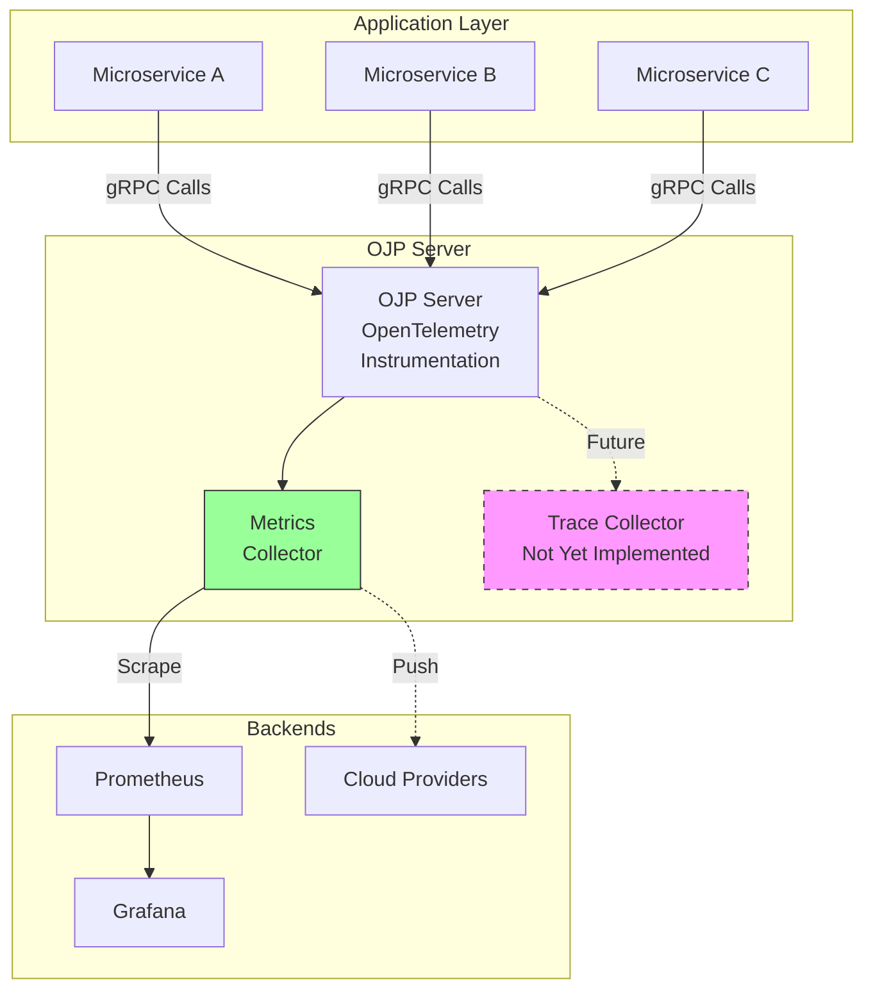
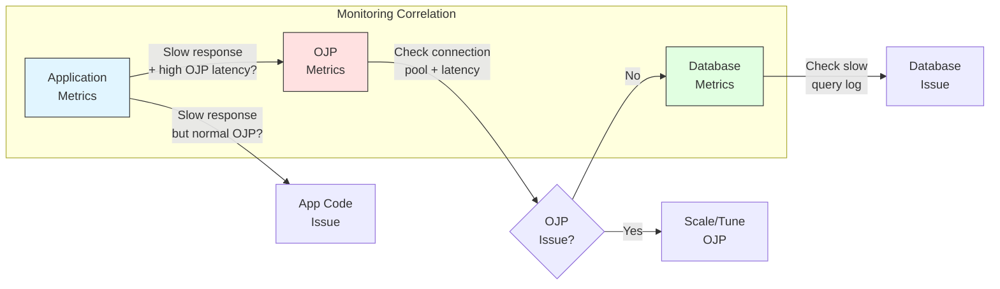

# Chapter 13: Telemetry and Monitoring

Understanding how your database proxy performs in production is essential for maintaining reliable systems. Open J Proxy provides comprehensive observability through OpenTelemetry integration, allowing you to track metrics, monitor performance, and identify issues before they impact your applications.

## 13.1 Understanding OJP's Observability Strategy

When we designed OJP's observability features, we made a deliberate choice to embrace industry standards rather than creating proprietary monitoring solutions. This decision, documented in ADR-005, brings several advantages to your operations team.

OpenTelemetry emerged as the clear winner in modern observability frameworks. It's vendor-neutral, widely supported, and provides seamless integration with the tools you're likely already using—Prometheus, Grafana, Datadog, or New Relic. By adopting OpenTelemetry, OJP ensures you're not locked into any particular monitoring ecosystem while still getting comprehensive insights into your proxy's behavior.

The observability architecture in OJP focuses on what matters most: understanding how your proxy processes database requests. Every gRPC call between your applications and OJP Server generates telemetry data. Connection pool behavior, session management, query routing decisions—all of these activities create metrics that help you understand system health and performance characteristics.

**[AI Image Prompt: Create a clean architecture diagram showing the OpenTelemetry observability flow in OJP. Show three layers: 1) Application layer with multiple microservices making database calls, 2) OJP Server with OpenTelemetry instrumentation highlighted, collecting metrics and traces, and 3) Observability backends (Prometheus, Grafana, cloud providers) receiving exported data. Use modern flat design with subtle icons for each component. Include arrows showing data flow from applications through OJP to monitoring systems. Style: Technical diagram, professional, clear visual hierarchy.]**

### What OJP Monitors

OJP's telemetry system captures several categories of operational data. At the gRPC communication level, you'll see metrics for request counts, latency distributions, and error rates. These metrics help you understand how efficiently applications communicate with the proxy and identify any network-related bottlenecks.

The server operational metrics provide insights into OJP's internal health. You can track thread pool utilization, memory usage, and garbage collection behavior. Understanding these metrics helps you right-size your OJP Server deployment and identify resource constraints before they cause problems.

Connection and session information forms another critical category of telemetry data. OJP tracks how many connections are active, how long sessions persist, and how effectively the connection pool serves requests. These metrics directly impact your database's performance, as connection management efficiency determines how well your applications can scale.

### Current Capabilities and Future Direction

Right now, OJP implements metrics collection with Prometheus export capabilities. This means you can scrape metrics from OJP's HTTP endpoint and visualize them in your monitoring dashboard of choice. The implementation uses OpenTelemetry's metrics SDK, ensuring compatibility with the broader observability ecosystem.

Distributed tracing remains on the roadmap but isn't yet implemented. While the foundation for tracing exists through OpenTelemetry, trace export to backends like Zipkin, Jaeger, or OTLP isn't currently functional. This limitation means you won't be able to follow a single request's journey from your application through OJP to the database and back—at least not yet. Understanding this constraint helps you set appropriate expectations for what OJP's observability can deliver today.



## 13.2 Setting Up Prometheus Metrics

Getting metrics from OJP into your monitoring system requires minimal configuration. The proxy exposes a Prometheus-compatible HTTP endpoint that any Prometheus server can scrape. Let's walk through setting this up from scratch.

### Basic Configuration

OJP's telemetry system activates by default when you start the server. The metrics endpoint listens on port 9159, and OpenTelemetry metrics collection starts automatically. For many deployments, you won't need to change anything—just point your Prometheus server at the endpoint and start collecting data.

However, production environments often require more specific configuration. You might need to change the metrics port to avoid conflicts with other services, or you might want to restrict which IP addresses can access telemetry data for security reasons. OJP provides configuration options through either JVM system properties or environment variables, giving you flexibility in how you manage configuration across different environments.

The configuration hierarchy works simply: JVM properties take precedence over environment variables, which take precedence over defaults. This means you can set defaults with environment variables in your deployment manifests while still allowing ops teams to override specific values at runtime using JVM properties when needed.

**[AI Image Prompt: Create an infographic showing OJP's metrics configuration hierarchy. Display three levels as a pyramid or stacked layers: bottom layer labeled "Defaults" (9159 port, enabled telemetry, open access), middle layer labeled "Environment Variables" (OJP_PROMETHEUS_PORT, OJP_OPENTELEMETRY_ENABLED, OJP_PROMETHEUS_ALLOWED_IPS), and top layer labeled "JVM Properties" (ojp.prometheus.port, ojp.opentelemetry.enabled, ojp.prometheus.allowedIps). Use arrows showing override direction from bottom to top. Include example values for each configuration method. Style: Educational infographic, modern colors, clear typography.]**

### Configuration Examples

Here's how you configure OJP's telemetry using JVM properties. This approach works well when you're starting OJP directly from the command line or when you want to override environment-based configuration in specific scenarios:

```bash
java -jar ojp-server.jar \
  -Dojp.opentelemetry.enabled=true \
  -Dojp.prometheus.port=9159 \
  -Dojp.prometheus.allowedIps=127.0.0.1,10.0.0.0/8
```

The `allowedIps` property deserves special attention. It accepts a comma-separated list of IP addresses or CIDR blocks that can access the metrics endpoint. The default value of `0.0.0.0/0` allows access from anywhere, which works fine for development but poses security risks in production. Always restrict this to your monitoring infrastructure's IP ranges in production deployments.

For containerized deployments, environment variables provide a cleaner configuration approach. Most container orchestrators like Kubernetes or Docker Compose make it easy to inject environment variables into containers:

```bash
export OJP_OPENTELEMETRY_ENABLED=true
export OJP_PROMETHEUS_PORT=9159
export OJP_PROMETHEUS_ALLOWED_IPS=127.0.0.1,10.0.0.0/8
java -jar ojp-server.jar
```

In Kubernetes environments, you might configure these through ConfigMaps or directly in your deployment manifests. The ojp-helm chart provides convenient parameters for telemetry configuration, making it easy to enable monitoring in cloud-native deployments.

### Accessing the Metrics Endpoint

Once OJP is running with telemetry enabled, the metrics endpoint becomes immediately available. You can verify it's working by curling the endpoint directly:

```bash
curl http://localhost:9159/metrics
```

This returns metrics in Prometheus's text-based exposition format. You'll see lines like:

```
# HELP grpc_server_started_total Total number of RPCs started on the server
# TYPE grpc_server_started_total counter
grpc_server_started_total{grpc_method="ExecuteQuery",grpc_service="ojp.OjpService",grpc_type="unary"} 1234

# HELP grpc_server_handled_total Total number of RPCs completed on the server
# TYPE grpc_server_handled_total counter
grpc_server_handled_total{grpc_code="OK",grpc_method="ExecuteQuery",grpc_service="ojp.OjpService",grpc_type="unary"} 1230
```

Each metric includes labels that provide context—the gRPC method being called, the service name, the response code. These labels allow you to slice and dice the metrics data in Grafana or your monitoring tool of choice.

**[AI Image Prompt: Create a screenshot mockup showing a terminal window displaying Prometheus metrics output from OJP. Show realistic metric names and values for gRPC server metrics, including counter and gauge types with labels. Highlight key metrics like grpc_server_started_total, grpc_server_handled_total, and connection pool metrics. Use a modern terminal theme (dark background, colored syntax highlighting). Include curl command at the top. Style: Terminal screenshot mockup, realistic, professional.]**

## 13.3 Integrating with Prometheus and Grafana

Now that OJP exposes metrics, you need to collect and visualize them. Prometheus and Grafana form the de facto standard for this in modern infrastructure, and they integrate seamlessly with OJP's telemetry system.

### Configuring Prometheus to Scrape OJP

Prometheus uses a pull model for metrics collection—it periodically scrapes HTTP endpoints to gather metrics. You configure these scrape jobs in Prometheus's configuration file. Here's a minimal configuration for monitoring OJP:

```yaml
# prometheus.yml
global:
  scrape_interval: 15s
  evaluation_interval: 15s

scrape_configs:
  - job_name: 'ojp-server'
    static_configs:
      - targets: ['ojp-server:9159']
    metrics_path: '/metrics'
    scrape_interval: 5s
```

The scrape interval determines how frequently Prometheus collects metrics. We set it to 5 seconds for OJP because database proxy metrics can change rapidly under load. A 5-second interval provides good resolution for understanding performance patterns without overwhelming Prometheus with data.

In production environments, you'll likely have multiple OJP Server instances. Prometheus supports service discovery mechanisms that automatically find all your OJP instances. In Kubernetes, for example, you can use the Kubernetes SD configuration to discover OJP pods automatically:

```yaml
scrape_configs:
  - job_name: 'ojp-server'
    kubernetes_sd_configs:
      - role: pod
        namespaces:
          names:
            - production
    relabel_configs:
      - source_labels: [__meta_kubernetes_pod_label_app]
        regex: ojp-server
        action: keep
      - source_labels: [__meta_kubernetes_pod_annotation_prometheus_io_scrape]
        regex: true
        action: keep
```

This configuration tells Prometheus to discover all pods in the production namespace labeled with `app=ojp-server` that have the annotation `prometheus.io/scrape=true`. It's a flexible pattern that scales as you add or remove OJP instances.

### Building Grafana Dashboards

Once Prometheus collects OJP metrics, Grafana provides the visualization layer. Creating effective dashboards requires understanding which metrics matter most for operational health.

Start with high-level health indicators. Create panels showing:

The total request rate (requests per second) helps you understand how busy OJP is. Use the `rate()` function in Prometheus to calculate this from the `grpc_server_started_total` counter:

```promql
sum(rate(grpc_server_started_total{job="ojp-server"}[1m]))
```

Error rate shows the percentage of failed requests. Calculate this by dividing failed requests by total requests:

```promql
sum(rate(grpc_server_handled_total{grpc_code!="OK",job="ojp-server"}[1m]))
/
sum(rate(grpc_server_handled_total{job="ojp-server"}[1m])) * 100
```

Request latency percentiles reveal performance characteristics. The histogram buckets let you calculate p50, p95, and p99 latency:

```promql
histogram_quantile(0.95, 
  sum(rate(grpc_server_handling_seconds_bucket{job="ojp-server"}[1m])) by (le, grpc_method)
)
```

**[AI Image Prompt: Create a modern Grafana dashboard mockup showing OJP monitoring panels. Include 4-6 panels: 1) Line graph showing request rate over time with multiple OJP instances, 2) Gauge showing current error rate percentage, 3) Line graph showing latency percentiles (p50, p95, p99), 4) Bar chart comparing request counts by gRPC method, 5) Connection pool utilization heatmap, 6) Server health status indicator. Use Grafana's dark theme, realistic metrics data with trends, proper axis labels. Style: Dashboard mockup, professional, data visualization best practices.]**

Beyond these basics, you'll want panels specific to OJP's functionality. Monitor connection pool metrics to understand how effectively OJP manages database connections. Track session durations to identify long-running transactions that might be holding connections. Watch for multinode coordination metrics if you're running multiple OJP servers.

### Setting Up Alerts

Metrics become actionable when you alert on problematic conditions. Prometheus's Alertmanager handles this through alert rules you define in Prometheus configuration:

```yaml
groups:
  - name: ojp_alerts
    interval: 30s
    rules:
      - alert: OJPHighErrorRate
        expr: |
          (sum(rate(grpc_server_handled_total{grpc_code!="OK",job="ojp-server"}[5m]))
          /
          sum(rate(grpc_server_handled_total{job="ojp-server"}[5m]))) > 0.05
        for: 2m
        labels:
          severity: warning
        annotations:
          summary: "OJP Server high error rate"
          description: "OJP error rate is {{ $value | humanizePercentage }} (threshold: 5%)"
```

This alert fires when more than 5% of requests fail for 2 consecutive minutes. The `for` clause prevents flapping—temporary spikes won't trigger the alert unless they persist.

Consider alerting on these conditions:
- Error rate exceeding acceptable thresholds (typically 1-5% depending on your SLAs)
- Latency percentiles degrading beyond normal ranges
- Connection pool exhaustion (available connections dropping to zero)
- Server instance unavailability (scrape failures from Prometheus)
- Memory pressure approaching configured limits

**[AI Image Prompt: Create an alert notification mockup showing a Slack or PagerDuty alert for an OJP issue. Display alert details: severity (warning/critical), metric that triggered (high error rate), current value vs threshold, affected OJP server instances, time period, and a link to Grafana dashboard. Include a graph thumbnail showing the metric spike. Use realistic alert formatting with proper color coding (yellow for warning, red for critical). Style: Modern alert notification, professional UI, clear information hierarchy.]**

## 13.4 Production Monitoring Best Practices

Effective monitoring requires more than just collecting metrics—you need a strategy for making those metrics actionable. Let's explore patterns that work well in production OJP deployments.

### Metric Aggregation Strategies

When running multiple OJP Server instances, you need to aggregate metrics intelligently. Some metrics should be summed across all instances—total request count, for example, makes sense as an aggregate. Other metrics work better as averages or percentiles—latency measurements typically aggregate this way.

Use Prometheus's aggregation functions appropriately. For request counts and error counts, sum across all instances:

```promql
sum(rate(grpc_server_started_total{job="ojp-server"}[1m]))
```

For latency and other percentile metrics, calculate percentiles from the already-aggregated histogram data:

```promql
histogram_quantile(0.95,
  sum(rate(grpc_server_handling_seconds_bucket{job="ojp-server"}[1m])) by (le)
)
```

Be careful with averages of averages—they can mislead. If one OJP instance handles much more traffic than others, simple averaging gives equal weight to all instances even though they don't contribute equally. Weight your averages by request volume when this matters.

### Capacity Planning with Metrics

Metrics data helps you plan for future capacity needs. Track these trends over time:

Request rate growth shows how quickly your traffic increases. Plot this over weeks or months to identify seasonal patterns and long-term trends. A steadily growing request rate suggests you'll need to scale OJP eventually.

Connection pool utilization reveals how close you are to saturation. If utilization regularly exceeds 80-90%, you're at risk of connection exhaustion during traffic spikes. Scale your connection pools or add more OJP instances before you hit this threshold.

Resource utilization at the host level (CPU, memory, network) indicates when your servers approach capacity. OJP is relatively lightweight, but heavy traffic can push CPU usage up. Monitor these metrics alongside OJP-specific metrics to get a complete picture.

### Correlating OJP Metrics with Application Performance

OJP sits between your applications and databases, so problems in either layer affect OJP's metrics. Learning to correlate metrics across these layers helps you diagnose issues faster.

When application response times degrade, check OJP latency metrics first. If OJP latency is normal but applications are slow, the problem likely lies in application code or non-database dependencies. If OJP latency spikes, investigate further down the stack.

Database performance directly impacts OJP. Slow database queries increase OJP's connection hold times and can cause connection pool exhaustion. When OJP metrics show connection pool pressure, query your database's slow query log to identify problematic queries.

Network issues between applications and OJP manifest as increased gRPC call latency or timeout errors. Network problems between OJP and databases show up as database connection errors or query timeouts. The error messages and specific metrics affected help you pinpoint the network segment having issues.



### Security and Access Control

Production monitoring systems often contain sensitive operational data. Protect your OJP metrics appropriately.

The `ojp.prometheus.allowedIps` configuration restricts which IP addresses can scrape metrics. In production, set this to your monitoring infrastructure's IP ranges. Never leave it at the default `0.0.0.0/0` in production environments.

Consider using network policies in Kubernetes to further restrict access. Create a NetworkPolicy that allows only your Prometheus pods to access OJP's metrics port:

```yaml
apiVersion: networking.k8s.io/v1
kind: NetworkPolicy
metadata:
  name: ojp-metrics-access
spec:
  podSelector:
    matchLabels:
      app: ojp-server
  ingress:
    - from:
      - podSelector:
          matchLabels:
            app: prometheus
      ports:
      - protocol: TCP
        port: 9159
```

If your organization requires it, you can place an authentication proxy in front of OJP's metrics endpoint. Tools like oauth2-proxy or Vouch work well for this purpose, adding OAuth2 authentication before requests reach OJP's metrics endpoint.

### Monitoring Overhead Considerations

Telemetry collection itself consumes resources. While OJP's OpenTelemetry implementation is efficient, heavy metrics collection can impact performance in extreme scenarios.

The scrape interval affects both data granularity and overhead. A 5-second interval provides good resolution for most use cases. Scraping every second gives you finer granularity but quadruples the overhead. Scraping every 15 seconds reduces overhead but might miss short-lived issues.

If you observe performance degradation correlated with metrics collection, consider these mitigations:
- Increase the scrape interval to reduce collection frequency
- Filter metrics at the Prometheus level to drop unnecessary ones
- If running many OJP instances, shard your Prometheus servers to distribute the scraping load

In practice, OJP's metrics overhead is minimal—typically well under 1% of CPU time. You're much more likely to hit capacity limits from actual request processing than from metrics collection.

**[AI Image Prompt: Create an isometric illustration showing monitoring architecture for a production OJP deployment. Display multiple layers: bottom layer with database servers, middle layer with a cluster of OJP Server instances (3-5 servers), top layer with monitoring stack (Prometheus, Grafana, Alert Manager). Show data flow arrows from OJP servers being scraped by Prometheus, feeding into Grafana dashboards, and triggering alerts. Include network security elements like firewalls and IP whitelisting symbols. Use modern isometric style, subtle gradients, professional color scheme. Style: Technical isometric illustration, clean, informative.]**

## 13.5 Understanding Available Metrics

OJP exposes dozens of metrics through its Prometheus endpoint. Understanding what each metric tells you helps you build effective monitoring dashboards and alerts. Let's explore the key metric categories.

### gRPC Server Metrics

These metrics track OJP's gRPC API—the interface applications use to communicate with the proxy.

`grpc_server_started_total` counts every RPC call OJP receives. It's labeled by gRPC method (like `ExecuteQuery`, `ExecuteUpdate`, `GetConnection`) and service. This metric helps you understand request volume and identify which database operations dominate your workload.

`grpc_server_handled_total` counts completed RPCs, labeled with response codes. The `grpc_code` label indicates success (`OK`) or various error conditions (`INVALID_ARGUMENT`, `UNAVAILABLE`, etc.). Monitoring this metric shows your error rate and helps you identify problematic API calls.

`grpc_server_handling_seconds` provides latency histograms for gRPC calls. The histogram buckets let you calculate percentiles—p50, p95, p99—which reveal performance characteristics better than simple averages. Use this to understand how responsive OJP is from the application's perspective.

`grpc_server_msg_received_total` and `grpc_server_msg_sent_total` track message volume. Large message counts relative to RPC counts might indicate applications sending batch operations or receiving large result sets.

### Connection Pool Metrics

Connection pool behavior directly impacts how well OJP performs. These metrics help you understand pool utilization and identify capacity issues.

`hikaricp_connections_active` shows how many connections currently execute queries. This should stay well below your maximum pool size under normal load. Sustained high values (>80% of max) suggest you need more database connections or fewer long-running queries.

`hikaricp_connections_idle` indicates available connections ready for use. This should typically be positive. If it drops to zero, you've hit connection pool exhaustion—new requests must wait for connections to become available.

`hikaricp_connections_pending` counts requests waiting for connections. Any non-zero value here indicates connection pool saturation. Persistent pending connection counts signal a need to scale your pool or reduce query execution times.

`hikaricp_connections_timeout_total` tracks how many connection acquisition requests timed out. Timeouts indicate severe connection pool pressure and directly impact application performance.

`hikaricp_connections_usage_seconds` provides latency histograms for connection acquisition. This tells you how long applications wait to get a database connection from OJP's pool.

### Server Health Metrics

These metrics indicate OJP's overall operational health.

JVM memory metrics (`jvm_memory_bytes_used`, `jvm_memory_bytes_max`) show memory consumption. Watch for memory usage approaching the maximum—this can trigger garbage collection storms that degrade performance.

Thread pool metrics reveal how effectively OJP processes concurrent requests. If all worker threads are busy, additional requests queue up, increasing latency.

Process metrics like CPU usage and file descriptor counts help you understand resource consumption at the OS level. Running out of file descriptors is a common issue in high-connection environments.

### Multinode Coordination Metrics

When running multiple OJP Server instances, additional metrics track coordination behavior.

Server discovery metrics show how many OJP instances each server knows about. Mismatches here indicate service discovery issues.

Load metrics track how much traffic each server handles. Significant imbalances might indicate misconfigured load balancing or network issues.

Failover metrics count how often servers fail and recovery occurs. Frequent failovers suggest instability in your OJP deployment.

**[AI Image Prompt: Create an infographic categorizing OJP's Prometheus metrics into 4 quadrants: 1) gRPC Server Metrics (request counts, latency, errors), 2) Connection Pool Metrics (active, idle, pending connections), 3) Server Health Metrics (JVM memory, threads, CPU), and 4) Multinode Metrics (discovery, load distribution, failover). For each category, show 2-3 key metric names with example values and simple sparkline graphs. Use icons to represent each category (API for gRPC, pool for connections, heartbeat for health, network for multinode). Style: Educational infographic, clean layout, modern flat design, professional colors.]**

## 13.6 Troubleshooting Telemetry Issues

Sometimes telemetry doesn't work as expected. Let's walk through common issues and their solutions.

### Metrics Endpoint Not Accessible

If you can't reach the metrics endpoint, start with the basics. Verify OJP Server is actually running and healthy. Check that the metrics port (default 9159) isn't blocked by firewall rules or security groups. Test connectivity from your Prometheus server to the OJP metrics endpoint using curl or telnet.

If you can reach the endpoint from the OJP server itself but not from Prometheus, you likely have a network issue. Check that the `ojp.prometheus.allowedIps` configuration includes your Prometheus server's IP address. Network policies in Kubernetes might also block access—verify your NetworkPolicy allows traffic from Prometheus to OJP's metrics port.

### Metrics Not Showing in Prometheus

When the endpoint is accessible but Prometheus doesn't show metrics, the issue usually lies in Prometheus configuration. Check Prometheus's targets page (`/targets` endpoint) to see if it's successfully scraping OJP. A red status indicates scrape failures.

Common configuration issues include incorrect target addresses (check the hostname or IP), wrong metrics path (should be `/metrics`), or SSL/TLS configuration mismatches if you've enabled HTTPS for the metrics endpoint.

Look at Prometheus logs for scrape errors. They'll often reveal exactly what's wrong—DNS resolution failures, connection timeouts, or HTTP error responses.

### Missing or Incomplete Metrics

Sometimes Prometheus scrapes OJP successfully but certain metrics are missing. This usually happens when the feature generating those metrics hasn't activated yet.

Connection pool metrics only appear after OJP creates at least one connection pool. If you're monitoring a fresh OJP instance that hasn't received any requests yet, pool metrics won't exist.

Multinode coordination metrics only exist when you're running multiple OJP instances. A single-server deployment won't expose these metrics.

Some metrics are counters that start at zero. They won't be visible in queries until they increment at least once. This is normal Prometheus behavior—counters don't appear in the metrics output until they have a non-zero value.

### Performance Impact from Metrics Collection

If you notice performance degradation correlated with metrics collection, check these areas. Verify your scrape interval isn't too aggressive—scraping every second usually provides more granularity than necessary and increases overhead proportionally.

Check Prometheus's series cardinality. If you have many OJP instances or high-cardinality labels (like query patterns), the sheer number of time series might overwhelm Prometheus. Use PromQL aggregations to reduce cardinality before storing data.

In extreme cases, consider using remote write to push metrics to a more scalable backend like Thanos or Cortex. These systems handle much higher metric volumes than a single Prometheus instance.

### Debugging with Logs

When troubleshooting telemetry issues, enable debug logging for OpenTelemetry in OJP. Add this to your server startup:

```bash
-Dojp.log.level=DEBUG
```

This increases log verbosity and shows exactly what OpenTelemetry is doing—initializing exporters, creating metric instruments, and reporting values. The logs often reveal configuration issues or errors that aren't obvious from external observation.

## 13.7 Roadmap: Future Telemetry Capabilities

Understanding OJP's current telemetry limitations and future direction helps you plan your monitoring strategy.

### Distributed Tracing

The most significant gap in OJP's telemetry is distributed tracing. While OpenTelemetry SDK supports tracing, OJP doesn't yet export traces to backends like Zipkin, Jaeger, or OTLP collectors.

When tracing is implemented, you'll be able to follow individual requests through your entire stack. A database query would generate a trace spanning your application, OJP, and the database itself. This visibility helps you identify where latency accumulates and which component causes slowdowns.

Trace context propagation will let you correlate application spans with OJP spans and database spans. You'll see the complete picture—how long a query spent in network transmission, how long OJP took to route it, how long the database took to execute it, and how long the result set took to stream back.

### SQL-Level Instrumentation

Currently, OJP's metrics operate at the gRPC call level. You see that `ExecuteQuery` was called, but you don't see which SQL statements executed or how they performed.

Future versions might include SQL-level metrics—tracking query patterns, execution times per statement type, and identifying expensive queries automatically. This would make OJP an even more powerful observability tool, giving you database-level insights without instrumenting every application.

### Custom Metrics

Application-specific metrics could flow through OJP's telemetry system in future releases. Imagine adding business-level metrics (like "orders processed" or "user registrations") that get exported alongside OJP's operational metrics. This would provide a unified view of both technical and business KPIs.

### Enhanced Multinode Metrics

As multinode capabilities mature, expect richer metrics around cluster coordination. Metrics showing data distribution patterns, node health scoring, and automatic rebalancing decisions would help operators understand and tune multinode deployments more effectively.

**[AI Image Prompt: Create a roadmap timeline visualization showing OJP's telemetry evolution. Display current state (Prometheus metrics) and three future phases: 1) Distributed Tracing (Zipkin/Jaeger/OTLP integration), 2) SQL-Level Instrumentation (query pattern tracking, execution time breakdowns), and 3) Advanced Features (custom metrics, enhanced multinode observability). For each phase, show a representative icon and key capabilities. Use a horizontal timeline with milestone markers. Style: Roadmap infographic, modern design, professional color scheme with gradient elements, clear information hierarchy.]**

---

This chapter covered OJP's observability capabilities comprehensively. You learned how OpenTelemetry integration provides metrics through Prometheus, how to set up monitoring infrastructure with Grafana, and how to interpret the metrics OJP exposes. While distributed tracing remains on the roadmap, the current metrics provide substantial operational visibility.

In the next chapter, we'll dive into OJP's protocol and wire format details—understanding how data flows between applications, OJP, and databases at the binary level. This knowledge proves valuable when debugging issues or implementing non-Java clients.
