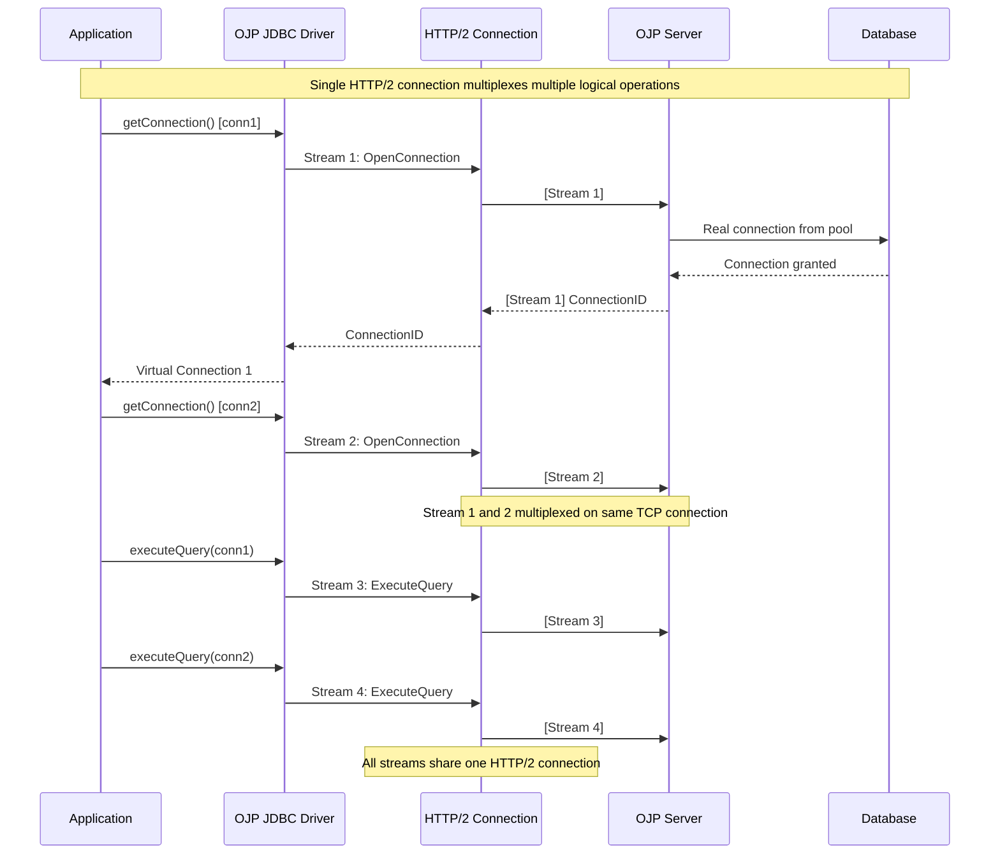

# Chapter 14: Protocol and Wire Format

When you send a database query through Open J Proxy, that request travels across the network multiple times—from your application to OJP Server, from OJP to the database, and back again with results. Understanding how OJP encodes this data on the wire helps you appreciate its efficiency and enables you to build non-Java clients that communicate with OJP Server directly.

## 14.1 The gRPC Foundation

OJP chose gRPC as its communication protocol, a decision that shapes everything about how data moves between components. Let's explore what this choice means in practical terms.

### Why gRPC?

When we designed OJP's protocol, several requirements drove the decision. The protocol needed to be efficient—JDBC operations can involve substantial data transfer, and network overhead would directly impact query performance. It needed to support multiple programming languages, as we wanted clients to interact with OJP from any ecosystem. And it needed to be maintainable, with clear contracts between client and server that could evolve over time.

Traditional REST APIs, while familiar, don't meet these needs well. JSON serialization is verbose and slow compared to binary formats. HTTP/1.1's request-response model doesn't support bidirectional streaming efficiently. And REST's informal contracts make API evolution error-prone.

gRPC addresses all these concerns. It uses Protocol Buffers for efficient binary serialization. HTTP/2's multiplexing allows multiple concurrent calls over a single connection. Streaming support enables large result sets to flow incrementally rather than buffering everything in memory. And Protocol Buffer's schema evolution features let us add new fields without breaking existing clients.

**[AI Image Prompt: Create a comparison infographic showing REST/JSON vs gRPC/Protobuf for JDBC operations. Split the image vertically: left side shows REST approach (JSON text, HTTP/1.1 sequential requests, verbose payloads) with example JSON structure for a database query. Right side shows gRPC approach (binary protobuf, HTTP/2 multiplexed streams, compact encoding) with protobuf message structure. Include metrics: typical payload size, serialization speed, and concurrent request handling. Use icons and visual metaphors (weight scales for size, speedometers for performance). Style: Technical comparison infographic, professional, clear visual differentiation between approaches.]**

### Protocol Buffer Basics

Protocol Buffers define structured data in `.proto` files that compile to code in your target language. Here's a simplified example of how OJP defines a query execution request:

```protobuf
syntax = "proto3";

package ojp;

message ExecuteQueryRequest {
  string connection_id = 1;
  string sql = 2;
  repeated Parameter parameters = 3;
  int32 fetch_size = 4;
}

message Parameter {
  oneof value {
    string string_value = 1;
    int32 int_value = 2;
    int64 long_value = 3;
    bool bool_value = 4;
    bytes bytes_value = 5;
    BigDecimalValue decimal_value = 6;
  }
}

message ExecuteQueryResponse {
  string result_set_id = 1;
  repeated ColumnMetadata columns = 2;
}
```

This schema defines the contract between OJP's JDBC driver and server. The driver serializes query requests into this binary format, sends them over HTTP/2, and the server deserializes them back into Java objects. The same process happens in reverse for query results.

The numbering (1, 2, 3, etc.) isn't arbitrary—these field numbers identify elements in the binary encoding and must remain stable across versions. You can add new fields with new numbers, but changing or removing existing field numbers breaks compatibility.

### HTTP/2 Multiplexing Benefits

One of gRPC's biggest advantages over traditional JDBC is connection multiplexing. Standard JDBC drivers typically establish one TCP connection per database connection, leading to connection proliferation in applications with large connection pools.

OJP's gRPC transport allows thousands of logical connections to share a few TCP connections. When your application opens 100 virtual connections to OJP, those all multiplex over perhaps 2-4 HTTP/2 connections. This dramatically reduces connection overhead, file descriptor usage, and network port consumption.

The multiplexing also improves performance. HTTP/2's stream prioritization means critical operations (like connection establishment) can proceed without waiting for large result sets to finish streaming on other logical channels.



## 14.2 BigDecimal Wire Format Evolution

One of OJP's most significant protocol improvements came in version 0.2.1 when we replaced Java serialization for `BigDecimal` values with a custom, language-neutral wire format. This change enables non-Java clients and improves both security and performance.

### The Java Serialization Problem

Before version 0.2.1, OJP serialized `BigDecimal` values using Java's built-in serialization mechanism. This worked fine for Java-to-Java communication but created several problems.

Java serialization is language-specific. If you wanted to build a Python or Go client for OJP, you'd need to parse Java's serialization format—a complex, undocumented protocol that changes between Java versions. This made non-Java clients impractical.

Security concerns also arose. Java deserialization has a history of vulnerabilities where attackers craft malicious serialized data that executes code during deserialization. While OJP had protections in place, eliminating Java serialization entirely removes this attack surface.

Performance wasn't optimal either. Java serialization includes substantial metadata overhead—class names, version identifiers, object graphs. For simple numeric values like `BigDecimal`, this overhead outweighs the actual data being transferred.

### The New BigDecimal Format

The new format represents `BigDecimal` in a simple, language-neutral way using three components: a presence flag, an unscaled value as a UTF-8 string, and a scale as a 32-bit integer.

Here's how it works. Every `BigDecimal` field starts with a single byte indicating whether the value is null (0) or non-null (1). This lets OJP represent SQL NULL values without needing special encoding.

For non-null values, the format encodes the unscaled value—essentially the decimal value with all decimal points removed—as a UTF-8 string. For example, `123.45` becomes the string `"12345"` with a scale of 2. Negative numbers include the minus sign: `-123.45` becomes `"-12345"` with scale 2.

The scale follows as a big-endian 32-bit signed integer. It represents how many digits fall to the right of the decimal point. Scale can be negative (for values like 1E10), zero (for integers), or positive (for fractional values).

Let's look at concrete examples. The value `123.45`:
- Presence flag: `0x01` (1 byte indicating non-null)
- Unscaled value length: `0x00000005` (5 bytes when encoded as UTF-8)
- Unscaled value: `0x3132333435` (UTF-8 bytes for "12345")
- Scale: `0x00000002` (big-endian int32 for 2)

For a very large value like `9999999999999999999999.123456789`:
- Presence flag: `0x01`
- Unscaled value: "9999999999999999999999123456789" (31 characters)
- Unscaled value length: `0x0000001F` (31 in hexadecimal)
- Scale: `0x00000009` (9 decimal places)

**[AI Image Prompt: Create a technical diagram showing BigDecimal wire format encoding. Display a BigDecimal value (123.45) being broken down into its wire format components. Show four blocks in sequence: 1) Presence byte (0x01 in hex, labeled "Non-null"), 2) Length integer (4 bytes, 0x00000005, labeled "Length: 5"), 3) Unscaled value bytes (5 bytes showing UTF-8 "12345"), 4) Scale integer (4 bytes, 0x00000002, labeled "Scale: 2"). Below, show a second example with a null value (just 0x00 byte). Use monospace font for hex values, clear labels, arrows showing data flow. Style: Technical wire format diagram, clean, educational, programmer-friendly.]**

### Why String-Based Unscaled Values?

You might wonder why we encode the unscaled value as a UTF-8 string rather than raw bytes from `BigInteger.toByteArray()`. The byte array would be more compact for very large numbers, but the string approach offers significant advantages.

String encoding is universally parseable. Every programming language has libraries for parsing decimal strings into arbitrary-precision numbers. Python's `Decimal`, Go's `big.Int`, JavaScript's `BigInt`—they all natively parse decimal strings. Parsing Java's `BigInteger` byte array format requires understanding its specific two's complement encoding, which varies by language.

Debugging becomes easier with string encoding. When you're troubleshooting network issues with a protocol analyzer like Wireshark, seeing `"12345"` in the packet capture is immediately meaningful. Raw byte arrays require binary-to-decimal conversion to understand.

Implementation simplicity matters when you're building clients in multiple languages. String parsing is a few lines of code in any language. Parsing Java's byte array format requires careful handling of sign bits, big-endian encoding, and integer boundaries—getting any of these wrong produces incorrect results.

### Security and Safety

The new format includes protections against denial-of-service attacks. OJP validates that unscaled value length doesn't exceed a reasonable maximum (default 10 million bytes). This prevents attackers from sending length values that would allocate gigabytes of memory.

Negative length values are explicitly rejected—they could cause buffer overflows or integer wraparound vulnerabilities in naive implementations. UTF-8 validation ensures the unscaled value bytes actually represent valid UTF-8 text, preventing encoding attacks.

These protections cost virtually nothing in performance but prevent entire classes of potential vulnerabilities.

## 14.3 Implementing Non-Java Clients

The language-neutral protocol means you can build OJP clients in any language that supports gRPC. Let's walk through what this requires.

### Protocol Buffer Compilation

Start by obtaining OJP's `.proto` definition files. These live in the `ojp-grpc-commons` module of the OJP repository. You'll need:
- `ojp_service.proto` - Defines the main gRPC service methods
- `ojp_types.proto` - Defines message types for requests and responses
- `ojp_common.proto` - Shared type definitions

Compile these for your target language using `protoc`, the Protocol Buffer compiler:

```bash
# For Python
protoc --python_out=. --grpc_python_out=. ojp_service.proto ojp_types.proto ojp_common.proto

# For Go
protoc --go_out=. --go-grpc_out=. ojp_service.proto ojp_types.proto ojp_common.proto

# For JavaScript/Node.js
protoc --js_out=import_style=commonjs:. --grpc-web_out=import_style=commonjs,mode=grpcwebtext:. *.proto
```

This generates language-specific code that handles serialization, deserialization, and gRPC client creation. You'll import these generated files in your client implementation.

### Python Example

Here's a minimal Python client that connects to OJP Server and executes a query:

```python
import grpc
from generated import ojp_service_pb2, ojp_service_pb2_grpc
from generated import ojp_types_pb2
import struct

class OJPClient:
    def __init__(self, server_address):
        self.channel = grpc.insecure_channel(server_address)
        self.stub = ojp_service_pb2_grpc.OjpServiceStub(self.channel)
    
    def open_connection(self, jdbc_url, username, password):
        request = ojp_types_pb2.OpenConnectionRequest(
            jdbc_url=jdbc_url,
            properties={
                'user': username,
                'password': password
            }
        )
        response = self.stub.OpenConnection(request)
        return response.connection_id
    
    def execute_query(self, connection_id, sql):
        request = ojp_types_pb2.ExecuteQueryRequest(
            connection_id=connection_id,
            sql=sql
        )
        response = self.stub.ExecuteQuery(request)
        return response.result_set_id, response.columns
    
    def fetch_rows(self, result_set_id, max_rows=100):
        request = ojp_types_pb2.FetchRowsRequest(
            result_set_id=result_set_id,
            max_rows=max_rows
        )
        # This is a streaming RPC - iterate over responses
        for response in self.stub.FetchRows(request):
            yield self._decode_rows(response.rows)
    
    def _decode_rows(self, rows):
        # Decode rows according to column types
        # Handle BigDecimal fields using the wire format
        decoded = []
        for row in rows:
            decoded_row = []
            for value in row.values:
                if value.HasField('decimal_value'):
                    decimal = self._decode_bigdecimal(value.decimal_value)
                    decoded_row.append(decimal)
                elif value.HasField('string_value'):
                    decoded_row.append(value.string_value)
                # Handle other types...
            decoded.append(decoded_row)
        return decoded
    
    def _decode_bigdecimal(self, decimal_value):
        from decimal import Decimal
        # decimal_value contains unscaled_value (string) and scale (int32)
        unscaled = int(decimal_value.unscaled_value)
        scale = decimal_value.scale
        return Decimal(unscaled) / Decimal(10 ** scale)

# Usage
client = OJPClient('localhost:9090')
conn_id = client.open_connection(
    'jdbc:postgresql://db.example.com:5432/mydb',
    'user',
    'password'
)
result_set_id, columns = client.execute_query(conn_id, 'SELECT * FROM users')
for rows in client.fetch_rows(result_set_id):
    for row in rows:
        print(row)
```

This example shows the basic pattern: create a gRPC channel, instantiate the service stub, call methods defined in the `.proto` files, and handle responses. The `BigDecimal` decoding demonstrates how the wire format works in practice.

### Go Example

Go's strong typing and explicit error handling make it well-suited for gRPC clients:

```go
package main

import (
    "context"
    "fmt"
    "io"
    "log"
    "math/big"
    
    "google.golang.org/grpc"
    pb "your-module/generated/ojp"
)

type OJPClient struct {
    client pb.OjpServiceClient
}

func NewOJPClient(serverAddress string) (*OJPClient, error) {
    conn, err := grpc.Dial(serverAddress, grpc.WithInsecure())
    if err != nil {
        return nil, err
    }
    
    return &OJPClient{
        client: pb.NewOjpServiceClient(conn),
    }, nil
}

func (c *OJPClient) OpenConnection(ctx context.Context, jdbcURL, username, password string) (string, error) {
    req := &pb.OpenConnectionRequest{
        JdbcUrl: jdbcURL,
        Properties: map[string]string{
            "user":     username,
            "password": password,
        },
    }
    
    resp, err := c.client.OpenConnection(ctx, req)
    if err != nil {
        return "", err
    }
    
    return resp.ConnectionId, nil
}

func (c *OJPClient) ExecuteQuery(ctx context.Context, connectionID, sql string) (string, []*pb.ColumnMetadata, error) {
    req := &pb.ExecuteQueryRequest{
        ConnectionId: connectionID,
        Sql:          sql,
    }
    
    resp, err := c.client.ExecuteQuery(ctx, req)
    if err != nil {
        return "", nil, err
    }
    
    return resp.ResultSetId, resp.Columns, nil
}

func (c *OJPClient) FetchRows(ctx context.Context, resultSetID string, maxRows int32) error {
    req := &pb.FetchRowsRequest{
        ResultSetId: resultSetID,
        MaxRows:     maxRows,
    }
    
    stream, err := c.client.FetchRows(ctx, req)
    if err != nil {
        return err
    }
    
    for {
        resp, err := stream.Recv()
        if err == io.EOF {
            break
        }
        if err != nil {
            return err
        }
        
        for _, row := range resp.Rows {
            processRow(row)
        }
    }
    
    return nil
}

func decodeBigDecimal(decimalValue *pb.BigDecimalValue) *big.Float {
    unscaled := new(big.Int)
    unscaled.SetString(decimalValue.UnscaledValue, 10)
    
    divisor := new(big.Int).Exp(
        big.NewInt(10),
        big.NewInt(int64(decimalValue.Scale)),
        nil,
    )
    
    result := new(big.Float).SetInt(unscaled)
    divisorFloat := new(big.Float).SetInt(divisor)
    result.Quo(result, divisorFloat)
    
    return result
}

func main() {
    client, err := NewOJPClient("localhost:9090")
    if err != nil {
        log.Fatal(err)
    }
    
    ctx := context.Background()
    connID, err := client.OpenConnection(ctx, 
        "jdbc:postgresql://db.example.com:5432/mydb",
        "user",
        "password")
    if err != nil {
        log.Fatal(err)
    }
    
    resultSetID, columns, err := client.ExecuteQuery(ctx, connID, "SELECT * FROM users")
    if err != nil {
        log.Fatal(err)
    }
    
    fmt.Printf("Columns: %v\n", columns)
    
    err = client.FetchRows(ctx, resultSetID, 100)
    if err != nil {
        log.Fatal(err)
    }
}
```

**[AI Image Prompt: Create a diagram showing the multi-language client ecosystem for OJP. Center: OJP Server icon. Surrounding it in a circle: icons and sample code snippets for Java (JDBC driver), Python (grpc client), Go (grpc client), JavaScript/Node.js (grpc-web client), and a generic "Any Language" placeholder. For each language, show the proto compilation step (protoc) and the gRPC library used. Use connecting lines from all clients to the central OJP Server. Include small logos for each language. Style: Technical ecosystem diagram, modern, colorful but professional, clear information flow.]**

### Handling Streaming Results

One of gRPC's powerful features is bidirectional streaming. OJP uses server-side streaming for result sets—the `FetchRows` method returns results incrementally rather than buffering everything in memory.

This streaming approach requires careful handling in your client. Don't try to collect all rows into memory before processing them, as large result sets could exhaust memory. Instead, process rows as they arrive:

```python
def process_large_result_set(client, result_set_id):
    total_rows = 0
    for batch in client.fetch_rows(result_set_id, max_rows=1000):
        # Process each batch
        for row in batch:
            # Do something with row
            process_row(row)
        total_rows += len(batch)
        
        # Optional: log progress
        if total_rows % 10000 == 0:
            print(f"Processed {total_rows} rows...")
    
    return total_rows
```

**Important:** OJP Server streams results in fixed batches of 100 records (currently hardcoded and not configurable via `max_rows`). The stream is continuous—if your client processes rows slowly, records will accumulate in client memory. Ensure your client processes each batch promptly to avoid memory pressure, especially with large result sets.

## 14.4 Protocol Versioning and Compatibility

As OJP evolves, the protocol will change. Understanding how Protocol Buffers handle versioning helps you maintain compatibility.

### Protocol Buffer Evolution Rules

Protocol Buffers provide strong compatibility guarantees if you follow certain rules:

You can add new fields with new field numbers without breaking compatibility. Old clients that don't understand the new fields simply ignore them. New clients receiving messages from old servers see default values for missing fields.

You can never change or reuse field numbers. Once field number 5 means "connection_id", it must always mean that. Changing it breaks binary compatibility in subtle, hard-to-debug ways.

You can mark fields as deprecated but shouldn't remove them entirely until all clients have upgraded. Deprecated fields continue to work but signal to developers that they should migrate to newer alternatives.

Optional vs. required field semantics changed in proto3 (which OJP uses). All fields are effectively optional, and you check presence with `has_` methods. This prevents compatibility issues when fields change from required to optional.

### Version Detection

Currently, OJP doesn't implement explicit protocol version negotiation. Clients and servers must run compatible versions. The version compatibility window is:
- Minor version upgrades are forward-compatible (new servers work with old clients)
- Backward compatibility varies based on the specific changes

Future versions might add version negotiation to the connection handshake. This would allow clients to discover server capabilities and adapt behavior accordingly.

### Migration Strategies

When protocol-breaking changes occur (like the BigDecimal format change in 0.2.1), coordinate deployments carefully. Rolling upgrades work for forward-compatible changes—upgrade servers first, then clients. Breaking changes require flag days where you upgrade everything at once.

For production systems that can't tolerate downtime, consider maintaining multiple protocol versions simultaneously. The server could support both old and new formats during a transition period, allowing gradual client migration.

**[AI Image Prompt: Create a timeline infographic showing OJP's protocol evolution. Show 3-4 major versions with key protocol changes: v0.1.x (initial gRPC/protobuf), v0.2.0 (added features), v0.2.1 (BigDecimal wire format change - mark as BREAKING), v0.3.0 (future - distributed tracing). For each version, show: version number, release date, key protocol changes, compatibility note (forward/backward/breaking). Use color coding: green for compatible changes, yellow for new features, red for breaking changes. Include small icons representing each change. Style: Technical timeline infographic, professional, clear version progression.]**

## 14.5 Performance Characteristics

Understanding the protocol's performance implications helps you make informed design decisions.

### Serialization Overhead

Binary Protocol Buffer encoding is significantly more efficient than JSON. Typical overhead comparisons:
- A simple query request: ~50 bytes protobuf vs ~200 bytes JSON
- A result set with 100 rows: ~5KB protobuf vs ~20KB JSON
- Large BigDecimal values: comparable size for both formats

The BigDecimal wire format performs well for typical financial data. A 12-digit value with 2 decimal places (like $1,234,567.89) takes about 20 bytes—1 byte presence flag, 4 bytes length, 10 bytes for digits and sign, 4 bytes scale, 1 byte for rounding. Compare this to JSON's string representation which might use similar space but requires parsing overhead.

### Network Efficiency

HTTP/2 multiplexing means multiple operations share a single TCP connection. This eliminates TCP handshake overhead for subsequent connections and reduces network file descriptor usage dramatically.

Header compression in HTTP/2 reduces redundant header data. gRPC metadata (similar to HTTP headers) compresses efficiently when repeated across requests.

Binary encoding means less data crosses the network. This matters especially for large result sets or high-throughput scenarios where network bandwidth becomes the bottleneck.

### When Protocol Overhead Matters

For most applications, OJP's protocol overhead is negligible—a few hundred microseconds of serialization time and a few kilobytes of extra data. But certain scenarios make protocol efficiency critical:

High-frequency trading systems executing thousands of queries per second notice every microsecond of latency. The binary encoding and multiplexed connections help, but you'll want to benchmark carefully.

Large result sets (millions of rows) amplify protocol overhead. Each row requires serialization and deserialization. The streaming approach helps by spreading this work over time rather than creating a massive upfront serialization cost.

Microservice environments with chatty APIs multiply protocol overhead. If each business operation triggers dozens of database calls through OJP, the cumulative overhead adds up. Consider batching operations or redesigning APIs to reduce call counts.

---

This chapter revealed the technical underpinnings of OJP's communication protocol. You learned how gRPC and Protocol Buffers enable efficient, language-neutral communication, how the BigDecimal wire format works, and how to implement non-Java clients. You also understand protocol versioning strategies and performance characteristics.

In the next chapter, we'll tackle troubleshooting—practical guidance for diagnosing and resolving common issues you'll encounter when running OJP in production.
