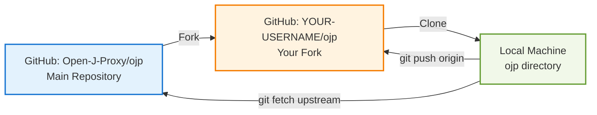
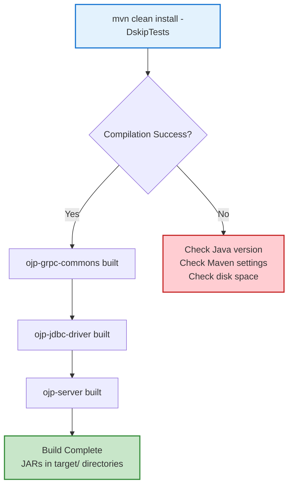
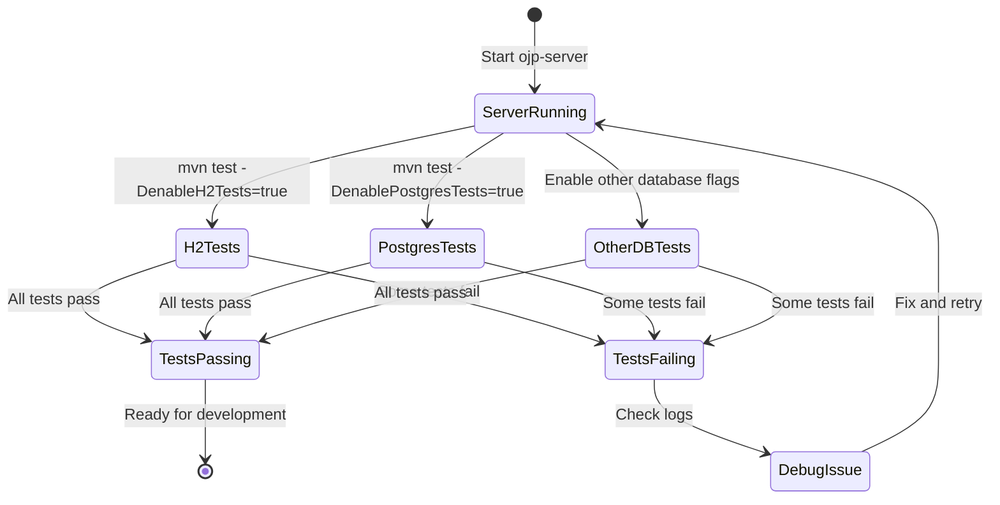

# Chapter 16: Development Environment Setup

Setting up your development environment for OJP is straightforward, but there are a few important steps to ensure everything works smoothly. This chapter walks you through the entire process, from installing prerequisites to running your first tests. Whether you're fixing a bug, adding a feature, or just exploring the codebase, following these steps will get you productive quickly.

## 16.1 Prerequisites and Installation

Before diving into OJP development, you'll need to have the right tools installed on your machine. The good news is that OJP doesn't require anything exotic—just the standard Java development toolchain plus Docker for running databases.

### Java 22 or Higher

OJP requires Java 22 or newer. This isn't just a recommendation—the project uses modern Java features that won't compile on earlier versions. You can download the latest JDK from [Oracle](https://www.oracle.com/java/technologies/downloads/), [Adoptium](https://adoptium.net/), or use a version manager like [SDKMAN!](https://sdkman.io/).

Once installed, verify your Java version:

```bash
java -version
```

You should see output indicating Java 22 or higher. If you have multiple Java versions installed, make sure your `JAVA_HOME` environment variable points to the correct one.

### Maven 3.9 or Higher

OJP uses Maven for builds, dependency management, and testing. Maven 3.9+ is required to ensure compatibility with Java 22 and modern dependency resolution. Most Linux distributions and macOS (via Homebrew) provide recent versions:

```bash
# macOS
brew install maven

# Linux (Ubuntu/Debian)
sudo apt install maven

# Or download from Apache Maven directly
```

Verify your Maven installation:

```bash
mvn -version
```

### Docker for Databases

While OJP includes H2 as an embedded database for quick testing, most real-world scenarios involve external databases like PostgreSQL, MySQL, or Oracle. Docker makes it trivial to spin up database instances without installing them directly on your machine.

Install Docker Desktop from [docker.com](https://www.docker.com/products/docker-desktop/), then verify:

```bash
docker --version
docker compose version
```

Docker Compose (included with Docker Desktop) is particularly useful because OJP's repository includes compose files for running multiple databases simultaneously.

### Git for Version Control

You'll need Git to clone the repository and manage your changes. Most systems come with Git pre-installed, but if not:

```bash
# macOS
brew install git

# Linux (Ubuntu/Debian)
sudo apt install git

# Windows: Download from git-scm.com
```

**[IMAGE_PROMPT_1]**: Create a technical diagram showing the development environment stack for OJP. Show four layers vertically: at the bottom "Operating System (Linux/macOS/Windows)", then "Java 22+ JDK & Maven 3.9+", then "Docker Engine with database containers (PostgreSQL, MySQL, H2)", and at the top "OJP Source Code (ojp-server, ojp-jdbc-driver, ojp-grpc-commons)". Use clean lines connecting the layers with arrows showing dependencies flowing upward. Include small icons for Java, Maven, Docker, and Git. Professional developer-focused style with muted blue and gray tones.

## 16.2 Forking and Cloning the Repository

OJP follows the standard GitHub fork-and-pull-request workflow. This means you'll work in your own fork of the repository and submit changes via pull requests.

### Fork the Repository

Navigate to [github.com/Open-J-Proxy/ojp](https://github.com/Open-J-Proxy/ojp) and click the **Fork** button in the top-right corner. This creates a copy of the repository under your GitHub account. You'll use this fork for all your development work.

### Clone Your Fork

Once forked, clone the repository to your local machine:

```bash
git clone https://github.com/YOUR-USERNAME/ojp.git
cd ojp
```

Replace `YOUR-USERNAME` with your actual GitHub username. This creates a local copy of your fork in an `ojp` directory.

### Add the Upstream Remote

To keep your fork synchronized with the main OJP repository, add it as an "upstream" remote:

```bash
git remote add upstream https://github.com/Open-J-Proxy/ojp.git
```

Now you can pull updates from the main repository anytime:

```bash
git fetch upstream
git checkout main
git merge upstream/main
```

It's good practice to sync your fork regularly, especially before starting new work. This prevents merge conflicts and ensures you're building on the latest code.



**[IMAGE_PROMPT_2]**: Create an infographic showing the Git workflow for OJP contributions. Show three connected nodes: (1) "Open-J-Proxy/ojp" (upstream) at the top, (2) "YOUR-USERNAME/ojp" (fork) in the middle, and (3) "Local Development" at the bottom. Draw arrows showing: "Fork" from upstream to fork, "Clone" from fork to local, "Fetch/Merge" from upstream to local (dashed line), and "Push/PR" from local back to fork and upstream. Use GitHub-style colors and include small Git command labels on arrows. Clean, professional diagram style.

## 16.3 Downloading JDBC Drivers

Here's where OJP's setup differs slightly from typical Java projects. Because JDBC drivers have varying licenses and some (like Oracle's) can't be redistributed, OJP doesn't bundle all drivers in its dependencies. Instead, you'll download them explicitly.

### The Download Script

OJP provides a convenient script that fetches open-source JDBC drivers from Maven Central:

```bash
cd ojp-server
bash download-drivers.sh
cd ..
```

This script downloads drivers for H2, PostgreSQL, MySQL, and MariaDB into `./ojp-libs/` at the repository root. These are the databases you can test with immediately after setup.

### Why Not Maven Dependencies?

You might wonder why these aren't regular Maven dependencies. The answer is flexibility and licensing. By keeping drivers in `ojp-libs/`, you can:

1. Easily swap driver versions without rebuilding
2. Add proprietary drivers (Oracle, DB2, SQL Server) that can't be in Maven Central
3. Test with specific driver versions that your production environment uses

### Proprietary Database Drivers

For Oracle, SQL Server, or DB2, you'll need to obtain the drivers separately:

- **Oracle**: Download `ojdbc11.jar` or `ojdbc8.jar` from Oracle's website and place it in `ojp-libs/`
- **SQL Server**: Use Maven to download `com.microsoft.sqlserver:mssql-jdbc` or get it from Microsoft
- **DB2**: Obtain `db2jcc4.jar` from IBM's download site

The repository includes detailed setup guides for each proprietary database in `documents/environment-setup/`.

**[IMAGE_PROMPT_3]**: Create a visual showing the driver download process. Show a folder structure with "ojp/" at the root, containing "ojp-libs/" directory. Inside ojp-libs, show JAR file icons for different drivers: h2-2.x.x.jar (green), postgresql-42.x.x.jar (blue), mysql-connector-9.x.x.jar (orange), mariadb-java-client-3.x.x.jar (brown), and placeholders for oracle and sqlserver (dashed boxes). Add a terminal window in the corner showing "$ bash download-drivers.sh" with a checkmark. Clean technical documentation style.

## 16.4 Building the Project

With prerequisites in place and drivers downloaded, you're ready to build OJP.

### Initial Build

Run a clean build to compile all modules and download dependencies:

```bash
mvn clean install -DskipTests
```

The `-DskipTests` flag skips running tests during the build. This is useful for the initial setup when you just want to verify that everything compiles. The build should complete without errors and typically takes 1-2 minutes on modern hardware.

OJP is organized as a multi-module Maven project:

- **ojp-grpc-commons**: Shared Protocol Buffer definitions and generated gRPC code
- **ojp-jdbc-driver**: The Type 3 JDBC driver that applications use
- **ojp-server**: The proxy server that manages database connections

The build processes all three modules in order, with each depending on the previous one.

### Understanding Build Artifacts

After a successful build, you'll find JARs in each module's `target/` directory:

- `ojp-grpc-commons/target/ojp-grpc-commons-<version>.jar`
- `ojp-jdbc-driver/target/ojp-jdbc-driver-<version>.jar`
- `ojp-server/target/ojp-server-<version>.jar`

The server JAR is executable and includes all dependencies except database drivers (which come from `ojp-libs/`).

### Common Build Issues

If the build fails, check these common issues:

**Java version mismatch**: Ensure `JAVA_HOME` points to Java 22+. Some systems have multiple JDKs, and Maven might pick up an older one.

**Maven settings**: Corporate firewalls or proxies might block Maven Central. Check your `~/.m2/settings.xml` if downloads fail.

**Disk space**: Maven downloads dependencies to `~/.m2/repository/`, which can grow large. Ensure you have at least 2GB free.



## 16.5 Running the OJP Server

Before you can run tests, you need a running OJP server. Think of it as the "backend" that your test code (acting as a client) connects to.

### Starting the Server

Maven provides a profile specifically for running the server in development mode:

```bash
mvn verify -pl ojp-server -Prun-ojp-server
```

Let's break this down:
- `mvn verify`: Runs the verification lifecycle phase (which includes compilation and packaging)
- `-pl ojp-server`: Runs only in the ojp-server module (pl = project list)
- `-Prun-ojp-server`: Activates the `run-ojp-server` Maven profile

The server starts on port 50051 by default and logs output to your terminal. You'll see messages like:

```
INFO  Starting OJP Server...
INFO  gRPC server started on port 50051
INFO  Server is ready to accept connections
```

Leave this terminal open—the server needs to stay running while you execute tests. If you need to stop it, use Ctrl+C.

### Server Configuration

The server loads configuration from `ojp-server/src/main/resources/application.yml` by default. During development, you typically don't need to change anything. The defaults work well for local testing:

- gRPC port: 50051
- Connection pool size: 10 per database
- Idle timeout: 10 minutes
- HikariCP settings tuned for development

If you want to test specific configurations, you can override settings via environment variables or JVM properties. For example, to change the port:

```bash
mvn verify -pl ojp-server -Prun-ojp-server -Dgrpc.port=50052
```

**[IMAGE_PROMPT_4]**: Create a split-screen diagram showing server startup. Left side shows a terminal window with "$ mvn verify -pl ojp-server -Prun-ojp-server" and log output lines "Starting OJP Server..." "gRPC server started on port 50051" "Server is ready". Right side shows a simplified architecture: ojp-server process box listening on port 50051, with an arrow pointing down to a database pool icon (showing multiple database connections), and an arrow pointing up to a "Test Client" box. Use green checkmarks to indicate successful startup. Professional documentation style with monospace font for terminal text.

## 16.6 Running Tests Locally

Now that the server is running, you can execute OJP's comprehensive test suite. Tests are organized by database type and disabled by default to avoid requiring complex setups.

### The Test Philosophy

OJP takes an unusual approach to tests: **all tests are disabled by default**. This might seem counterintuitive, but it's pragmatic. Setting up eight different databases just to run tests would be a huge barrier to contribution. Instead, OJP enables tests explicitly based on what's available.

### Running H2 Tests

H2 is perfect for initial development because it's embedded—no external database needed. With the server running in one terminal, open a new terminal and run:

```bash
cd ojp-jdbc-driver
mvn test -DenableH2Tests=true
```

This runs the full integration test suite against H2, which covers:
- Basic JDBC operations (queries, updates, transactions)
- Connection pooling behavior
- Error handling
- ResultSet operations
- Prepared statements and batch updates

The tests take 30-60 seconds to complete. If they all pass, you have a working development environment!

### Running PostgreSQL Tests

To test against PostgreSQL, you first need a running PostgreSQL instance. The easiest way is using Docker:

```bash
docker run -d --name ojp-postgres \
  -e POSTGRES_PASSWORD=postgres \
  -e POSTGRES_DB=testdb \
  -p 5432:5432 \
  postgres:15
```

Then run the tests with:

```bash
mvn test -DenablePostgresTests=true
```

The test suite automatically connects to `localhost:5432` using credentials from the test configuration files in `src/test/resources/`.

### Other Database Tests

OJP supports comprehensive testing with multiple databases, each with its own enable flag:

- **MySQL**: `-DenableMySQLTests=true`
- **MariaDB**: `-DenableMariaDBTests=true`
- **CockroachDB**: `-DenableCockroachDBTests=true`
- **Oracle**: `-DenableOracleTests=true` (requires manual driver setup)
- **SQL Server**: `-DenableSqlServerTests=true`
- **DB2**: `-DenableDB2Tests=true`

For detailed setup instructions for each database, see the guides in `documents/environment-setup/`.



**[IMAGE_PROMPT_5]**: Create a testing workflow diagram showing test execution across databases. Center the diagram on "ojp-server (running)" as a box. Draw arrows radiating out to different database test boxes: "H2 Tests (embedded)", "PostgreSQL Tests", "MySQL Tests", "MariaDB Tests", and "Other DB Tests". Color-code them: green for H2 (always available), blue for free databases (requires Docker), orange for proprietary (requires license). Show checkmarks for passing tests and question marks for optional tests. Add enable flags like "-DenableH2Tests=true" as labels. Clean, flowchart-style diagram.

## 16.7 Understanding Test Configuration

OJP's tests use CSV files to define database connections. This approach is flexible and allows testing against multiple database instances with different configurations.

### Connection CSV Files

Test connection configurations live in `ojp-jdbc-driver/src/test/resources/`. You'll see files like:

- `h2_connections.csv`: H2 database configurations
- `postgres_connections.csv`: PostgreSQL configurations
- `h2_postgres_connections.csv`: Both H2 and PostgreSQL

These CSV files define connection parameters:

```csv
id,url,username,password
h2-test,jdbc:ojp:h2://localhost:50051/mem:testdb,sa,
postgres-test,jdbc:ojp:postgresql://localhost:50051/testdb,postgres,postgres
```

Each test class loads the appropriate CSV file and runs all tests against each defined connection. This is why you might see test counts like "48 tests passed"—it's running 8 test methods across 6 configured connections.

### Modifying Test Configurations

You can add your own connection configurations to test specific scenarios:

1. Edit the relevant CSV file
2. Add a new row with your connection details
3. Rerun the tests

For example, to test against a PostgreSQL instance on a different port:

```csv
postgres-custom,jdbc:ojp:postgresql://localhost:50051/customdb,myuser,mypass
```

The test framework automatically picks up the new configuration and includes it in the test run.

### Test Database Schema

Tests automatically create and drop test tables. Each test class typically:

1. Creates a table in a `@BeforeAll` method
2. Runs tests that insert, query, update, and delete data
3. Drops the table in an `@AfterAll` method

This ensures tests are isolated and don't interfere with each other.

**[IMAGE_PROMPT_6]**: Create a technical diagram showing the test configuration flow. Show a CSV file icon labeled "h2_postgres_connections.csv" with sample rows visible. Draw an arrow from the CSV to a "Test Framework" box that reads and parses the configuration. From the test framework, draw multiple arrows to different "Test Execution" boxes, one for each connection ID in the CSV. Each execution box should connect to its respective database (H2 or PostgreSQL). Use a clean, architectural diagram style with clear labels and color-coding for different database types.

### 16.7.5 OJP TestContainers Module

**Added in January 2026**, OJP now provides a dedicated `ojp-testcontainers` module that simplifies integration testing by providing a standardized TestContainers-based `OjpContainer` implementation. This module makes it trivial to spin up complete OJP server instances in your tests, eliminating manual server management.

**What is TestContainers?** TestContainers is a Java library that provides lightweight, throwaway Docker containers for integration testing. It handles container lifecycle, port mapping, and cleanup automatically, making tests reproducible across different environments.

**The OjpContainer Implementation**: The `ojp-testcontainers` module provides an `OjpContainer` class that extends TestContainers' `GenericContainer`, offering a fluent API for OJP-specific configuration:

```java
import org.openjproxy.testcontainers.OjpContainer;
import org.testcontainers.junit.jupiter.Container;
import org.testcontainers.junit.jupiter.Testcontainers;

@Testcontainers
public class MyIntegrationTest {
    
    @Container
    private static final OjpContainer ojpContainer = new OjpContainer()
        .withDatabaseUrl("jdbc:h2:mem:testdb")
        .withDatabaseDriver("org.h2.Driver")
        .withDatabaseUsername("sa")
        .withDatabasePassword("")
        .withExposedPrometheusPort(); // Optional: expose metrics
    
    @Test
    void testWithOjp() {
        // Container is automatically started before tests
        String ojpJdbcUrl = ojpContainer.getOjpJdbcUrl();
        
        try (Connection conn = DriverManager.getConnection(ojpJdbcUrl)) {
            // Execute queries through OJP
            Statement stmt = conn.createStatement();
            ResultSet rs = stmt.executeQuery("SELECT 1");
            assertTrue(rs.next());
            assertEquals(1, rs.getInt(1));
        }
        // Container automatically stops after tests
    }
}
```

**Key Features**:

1. **Automatic Lifecycle Management**: The container starts before tests and stops after, with no manual setup required

2. **Dynamic Port Mapping**: TestContainers assigns random available ports, preventing conflicts in parallel test execution

3. **Database Integration**: Easily configure any JDBC-compatible database for OJP to proxy

4. **Custom Docker Images**: Support for both default OJP images and custom-built images with proprietary drivers:
   ```java
   OjpContainer ojp = new OjpContainer("my-registry/ojp-oracle:latest")
       .withDatabaseUrl("jdbc:oracle:thin:@//oracle-host:1521/ORCL")
       .withDatabaseDriver("oracle.jdbc.OracleDriver");
   ```

5. **Metrics Access**: Expose Prometheus metrics port for monitoring tests:
   ```java
   int metricsPort = ojpContainer.getPrometheusPort();
   String metricsUrl = "http://localhost:" + metricsPort + "/metrics";
   ```

**Module Structure**: The `ojp-testcontainers` module is published to Maven Central alongside other OJP artifacts:

```xml
<dependency>
    <groupId>org.openjproxy</groupId>
    <artifactId>ojp-testcontainers</artifactId>
    <version>0.3.1-beta</version>
    <scope>test</scope>
</dependency>
```

It includes:
- `OjpContainer` class with fluent configuration API
- Helper methods for common setup patterns
- Integration with JUnit 5 via TestContainers annotations
- Complete JavaDoc documentation

**Example Test Using OjpContainer**: The `ojp-jdbc-driver` module includes an example integration test:

```java
@Testcontainers
class H2IntegrationWithContainerTest {
    
    @Container
    static OjpContainer ojp = new OjpContainer()
        .withDatabaseUrl("jdbc:h2:mem:testdb;DB_CLOSE_DELAY=-1")
        .withDatabaseDriver("org.h2.Driver");
    
    @Test
    void shouldExecuteQueriesThroughOjp() throws SQLException {
        try (Connection conn = DriverManager.getConnection(ojp.getOjpJdbcUrl())) {
            // Create table
            conn.createStatement().execute(
                "CREATE TABLE users (id INT PRIMARY KEY, name VARCHAR(100))"
            );
            
            // Insert data
            PreparedStatement pstmt = conn.prepareStatement(
                "INSERT INTO users VALUES (?, ?)"
            );
            pstmt.setInt(1, 1);
            pstmt.setString(2, "Alice");
            assertEquals(1, pstmt.executeUpdate());
            
            // Query data
            ResultSet rs = conn.createStatement().executeQuery(
                "SELECT name FROM users WHERE id = 1"
            );
            assertTrue(rs.next());
            assertEquals("Alice", rs.getString(1));
        }
    }
}
```

**Benefits for Contributors**:

1. **Lower Barrier to Entry**: New contributors don't need to manually start OJP servers—tests handle it automatically

2. **Isolation**: Each test class can use its own OJP container with independent configuration

3. **Parallel Execution**: Random port assignment enables running multiple test classes concurrently

4. **Reproducibility**: Docker ensures consistent environment across development machines and CI

5. **Quick Iteration**: Containers start in seconds, accelerating the development cycle

**Development Workflow**: When developing new OJP features, the workflow becomes:

```bash
# 1. Make code changes
vi ojp-server/src/main/java/...

# 2. Build
mvn clean install -DskipTests

# 3. Run integration tests (no manual server startup needed!)
cd ojp-jdbc-driver
mvn test -Dtest=H2IntegrationWithContainerTest

# TestContainers automatically:
# - Pulls OJP Docker image (if not cached)
# - Starts container with random ports
# - Runs tests
# - Stops and removes container
```

**CI/CD Integration**: The `ojp-testcontainers` module works seamlessly in CI pipelines. GitHub Actions, GitLab CI, and other CI systems with Docker support can run these tests without additional configuration. The module includes example GitHub Actions workflows showing dual-server setup for testing SQL Enhancer features.

**Future Enhancements**: Planned improvements include:
- Support for multi-database test scenarios (testing failover, read replicas)
- Pre-configured database containers (PostgreSQL, MySQL, Oracle) bundled with OJP
- Performance test helpers for stress testing containerized OJP instances
- Network simulation for testing OJP behavior under poor network conditions

The `ojp-testcontainers` module represents a significant step toward making OJP development more accessible. By eliminating manual server management and providing reproducible test environments, it encourages contributors to write comprehensive integration tests.

## 16.8 Common Development Tasks

Once your environment is set up, here are some common tasks you'll perform during development.

### Creating a Feature Branch

Always work in a feature branch, never directly on `main`:

```bash
git checkout -b feature/add-statement-timeout
```

Use descriptive branch names that indicate what you're working on. Common prefixes include:
- `feature/` for new functionality
- `fix/` for bug fixes
- `docs/` for documentation updates
- `refactor/` for code improvements

### Making Changes and Testing

Make your changes, then verify them:

```bash
# Build to check for compilation errors
mvn clean install -DskipTests

# Start the server (in a separate terminal)
mvn verify -pl ojp-server -Prun-ojp-server

# Run tests for your changes
cd ojp-jdbc-driver
mvn test -DenableH2Tests=true
```

If you're changing server code, restart the server after building. If you're changing driver code, you just need to rerun the tests.

### Running Specific Tests

You don't always need to run the full test suite. Maven lets you run specific test classes or methods:

```bash
# Run a specific test class
mvn test -Dtest=ConnectionPoolTest -DenableH2Tests=true

# Run a specific test method
mvn test -Dtest=ConnectionPoolTest#shouldHandleConnectionTimeout -DenableH2Tests=true
```

This speeds up the development cycle significantly when you're working on a specific feature.

### Checking Code Style

While OJP doesn't enforce strict code style checks in CI, following Java conventions makes reviews easier:

- Use meaningful variable names
- Add comments only when necessary (code should be self-documenting)
- Follow existing patterns in the codebase
- Use 4-space indentation (not tabs)

### Viewing Logs for Debugging

When tests fail or behave unexpectedly, logs are your best friend. The server logs to stdout, so you'll see them in the terminal where it's running. For more detailed logging, edit `ojp-server/src/main/resources/logback.xml` and set log levels:

```xml
<logger name="io.openjproxy" level="DEBUG"/>
```

This gives you detailed information about connection creation, query execution, and pool management.

**[IMAGE_PROMPT_7]**: Create a workflow diagram showing the development cycle. Show circular flow: "Make Changes" → "Build (mvn clean install)" → "Start/Restart Server" → "Run Tests (mvn test)" → "Review Results" → back to "Make Changes" if needed, or "Commit & Push" if successful. Include a side branch from "Review Results" showing "Debug with Logs" that loops back to "Make Changes". Use blue for building steps, green for testing, orange for debugging, and purple for the final commit. Professional flowchart style with clear icons.

## 16.9 Troubleshooting Setup Issues

Even with careful setup, you might encounter issues. Here are solutions to common problems.

### "Address already in use" Error

If the server won't start with a message about port 50051 being in use, something else is using that port. Options:

1. Find and kill the process using the port:
   ```bash
   # macOS/Linux
   lsof -i :50051
   kill -9 <PID>
   
   # Windows
   netstat -ano | findstr :50051
   taskkill /PID <PID> /F
   ```

2. Or configure OJP to use a different port:
   ```bash
   mvn verify -pl ojp-server -Prun-ojp-server -Dgrpc.port=50052
   ```
   Then update test connection strings to match.

### Tests Fail with "Connection refused"

This usually means the OJP server isn't running. Verify:

1. The server terminal is still open and showing "Server is ready"
2. You're running tests from a different terminal (not the same one as the server)
3. No firewall is blocking port 50051

### "Driver not found" Errors

If tests fail with messages about missing JDBC drivers:

1. Ensure you ran `download-drivers.sh` from the `ojp-server` directory
2. Check that `ojp-libs/` exists at the repository root and contains JAR files
3. For proprietary databases, verify you've manually added the correct driver JARs

### Maven Dependency Resolution Fails

If Maven can't download dependencies:

1. Check your internet connection
2. Try cleaning the Maven cache: `rm -rf ~/.m2/repository/io/openjproxy`
3. If behind a corporate proxy, configure `~/.m2/settings.xml`

### OutOfMemoryError During Tests

Some database tests (especially with large result sets) can be memory-intensive. Increase Maven's memory:

```bash
export MAVEN_OPTS="-Xmx2g"
mvn test -DenableH2Tests=true
```

**[IMAGE_PROMPT_8]**: Create a troubleshooting decision tree. Start with "Setup Issue?" at the top, then branch into common problems: "Server won't start" (leads to solutions about port conflicts), "Tests fail" (leads to server status checks), "Driver not found" (leads to download-drivers.sh), and "Maven issues" (leads to proxy/cache solutions). Use a tree structure with problem nodes in red, decision nodes in orange, and solution nodes in green. Include small icons for each type of issue. Clean, professional decision tree style.

---

## Key Takeaways

Setting up OJP for development is straightforward once you understand the components:

1. Install Java 22+, Maven 3.9+, Docker, and Git
2. Fork and clone the repository, adding upstream as a remote
3. Download JDBC drivers using the provided script
4. Build the project with `mvn clean install -DskipTests`
5. Run the server with `mvn verify -pl ojp-server -Prun-ojp-server`
6. Execute tests with appropriate enable flags like `-DenableH2Tests=true`

The key difference from typical Java projects is that the server must be running before tests execute. Think of it as a two-process system: the server (which connects to databases) and the client (your test code).

Once set up, you're ready to make contributions—whether fixing bugs, adding features, or improving documentation. The next chapter covers the contribution workflow in detail, including how to structure commits, submit pull requests, and navigate code review.
