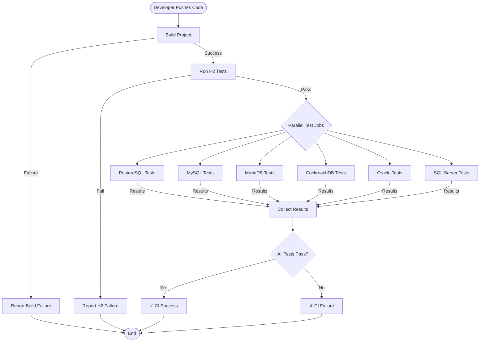

# Chapter 17: Testing Philosophy and Code Quality

Testing isn't just about finding bugs—it's about building confidence that your code works correctly under all conditions. For a project like OJP that sits between applications and databases, comprehensive testing is critical. A bug in connection pooling or transaction handling can cause production outages, data corruption, or silent failures that are difficult to diagnose.

This chapter explores OJP's testing philosophy, test infrastructure, and code quality standards. You'll learn how to write effective tests, understand the different types of testing used in OJP, and discover how to maintain high code quality standards as a contributor.

---

## 17.1 The Testing Philosophy

OJP's testing philosophy is built on several core principles that guide how we write, organize, and run tests.

### Integration Tests Over Unit Tests

Unlike many projects that emphasize unit testing, OJP prioritizes **integration tests** for database-related functionality. Why? Because JDBC drivers are integration layers—they don't have meaningful behavior in isolation. A connection pool that works perfectly with mocked connections might completely fail with a real PostgreSQL database under load.

Integration tests exercise the full stack: JDBC driver → gRPC communication → OJP Server → database connection pool → actual database. This catches issues that unit tests miss:
- Network timeout handling
- Transaction isolation levels
- Connection leaks under concurrency
- Database-specific SQL behavior
- Connection pool exhaustion
- Error handling with real database exceptions

Unit tests still have their place in OJP, particularly for:
- Load balancing logic that doesn't require database access
- Configuration parsing and validation
- Circuit breaker state machines
- Utility functions and helper classes

But when testing core JDBC operations—executing queries, managing transactions, handling ResultSets—integration tests are the gold standard.

### All Tests Disabled by Default

By default, **all database tests in OJP are disabled**, even H2. This design choice might seem unusual, but it serves an important purpose: lowering the barrier to entry for contributors.

Not every contributor has PostgreSQL, MySQL, Oracle, and SQL Server running locally. A developer fixing a documentation typo shouldn't need to set up five databases just to submit a PR. By disabling tests by default, we make it easy to contribute without complex setup.

When you want to run tests, you explicitly enable them:

```bash
mvn test -DenableH2Tests=true
mvn test -DenablePostgresTests=true
```

This explicit opt-in approach means contributors choose which databases to test based on what they have available and what they're working on.

### Fast Feedback with H2

The CI pipeline runs H2 tests first as a **fail-fast mechanism**. H2 is an embedded database that requires no external services—it starts instantly and runs tests in seconds. If H2 tests fail, there's no point running expensive PostgreSQL, MySQL, and Oracle tests.

This tiered approach saves CI time and provides rapid feedback:
1. **Main CI** runs H2 tests (30-60 seconds)
2. **Specialized jobs** run only if H2 passes (5-10 minutes each)

If you break basic JDBC functionality, H2 tests catch it immediately. Database-specific issues are caught by the specialized test jobs.

### Real Databases in CI

OJP's CI pipeline runs tests against **real databases**, not mocks or test containers (with exceptions for Oracle and SQL Server where licensing requires special handling). This ensures compatibility with production environments:
- PostgreSQL 12, 13, 14, 15, 16
- MySQL 5.7, 8.0, 8.4
- MariaDB 10.6, 10.11, 11.4
- CockroachDB 24.2
- Oracle 23ai Free (self-hosted runner)
- SQL Server 2022 (self-hosted runner)
- DB2 11.5 (self-hosted runner)

Each database runs in GitHub Actions workflows or on self-hosted runners, giving us confidence that OJP works correctly across the full ecosystem.

---

## 17.2 Types of Tests in OJP

OJP uses several types of tests, each serving a specific purpose in ensuring code quality.

### Integration Tests

Integration tests form the backbone of OJP's test suite. These tests exercise the full stack with real databases and verify end-to-end functionality.

**Example: Connection Pool Behavior**

```java
@Test
@EnabledIf("isH2Enabled")
void shouldReuseConnectionsFromPool() throws SQLException {
    // Create datasource with pool size 2
    OjpDataSource ds = new OjpDataSource();
    ds.setOjpServerEndpoint("localhost:1059");
    ds.setJdbcUrl("jdbc:h2:mem:testdb");
    ds.setMaxPoolSize(2);
    
    // Acquire and release connections multiple times
    Connection conn1 = ds.getConnection();
    String conn1Id = getConnectionId(conn1);
    conn1.close();
    
    Connection conn2 = ds.getConnection();
    String conn2Id = getConnectionId(conn2);
    conn2.close();
    
    Connection conn3 = ds.getConnection();
    String conn3Id = getConnectionId(conn3);
    
    // Connection 3 should reuse connection 1 or 2
    assertTrue(conn3Id.equals(conn1Id) || conn3Id.equals(conn2Id),
        "Pool should reuse connections");
}
```

This test verifies that the connection pool actually reuses connections rather than creating new ones each time. It requires a running OJP server and a real H2 database.

**Example: Transaction Isolation**

```java
@Test
@EnabledIf("isPostgresEnabled")
void shouldEnforceReadCommittedIsolation() throws SQLException {
    OjpDataSource ds = createDataSource("postgres");
    
    try (Connection conn1 = ds.getConnection();
         Connection conn2 = ds.getConnection()) {
        
        conn1.setTransactionIsolation(Connection.TRANSACTION_READ_COMMITTED);
        conn2.setTransactionIsolation(Connection.TRANSACTION_READ_COMMITTED);
        
        conn1.setAutoCommit(false);
        conn2.setAutoCommit(false);
        
        // Conn1 inserts a row but doesn't commit
        try (PreparedStatement ps = conn1.prepareStatement(
                "INSERT INTO test_table (id, value) VALUES (?, ?)")) {
            ps.setInt(1, 1);
            ps.setString(2, "test");
            ps.executeUpdate();
        }
        
        // Conn2 shouldn't see the uncommitted row
        try (Statement stmt = conn2.createStatement();
             ResultSet rs = stmt.executeQuery("SELECT COUNT(*) FROM test_table")) {
            rs.next();
            assertEquals(0, rs.getInt(1), 
                "Should not see uncommitted changes");
        }
        
        // After commit, conn2 should see the row
        conn1.commit();
        
        try (Statement stmt = conn2.createStatement();
             ResultSet rs = stmt.executeQuery("SELECT COUNT(*) FROM test_table")) {
            rs.next();
            assertEquals(1, rs.getInt(1), 
                "Should see committed changes");
        }
    }
}
```

This test verifies that transaction isolation works correctly with PostgreSQL. It requires careful coordination between two connections and validates JDBC behavior against a real database.

### Unit Tests

Unit tests focus on components that have meaningful behavior without database access.

**Example: Load Balancer Logic**

```java
@Test
void shouldDistributeConnectionsEvenly() {
    List<String> endpoints = Arrays.asList(
        "server1:1059",
        "server2:1059",
        "server3:1059"
    );
    
    LoadBalancer balancer = new RoundRobinLoadBalancer(endpoints);
    
    Map<String, Integer> distribution = new HashMap<>();
    
    // Request 300 connections
    for (int i = 0; i < 300; i++) {
        String endpoint = balancer.nextEndpoint();
        distribution.merge(endpoint, 1, Integer::sum);
    }
    
    // Each server should get roughly 100 connections (±5)
    for (String endpoint : endpoints) {
        int count = distribution.get(endpoint);
        assertTrue(count >= 95 && count <= 105,
            "Expected ~100 connections per server, got " + count);
    }
}
```

This unit test verifies load balancing logic without requiring databases or network connections. It's fast, deterministic, and tests a specific algorithmic behavior.

**Example: Configuration Validation**

```java
@Test
void shouldRejectNegativeConnectionTimeout() {
    OjpDataSource ds = new OjpDataSource();
    
    assertThrows(IllegalArgumentException.class, () -> {
        ds.setConnectionTimeout(-1);
    }, "Should reject negative timeout");
}

@Test
void shouldRejectZeroMaxPoolSize() {
    OjpDataSource ds = new OjpDataSource();
    
    assertThrows(IllegalArgumentException.class, () -> {
        ds.setMaxPoolSize(0);
    }, "Should reject zero pool size");
}
```

These unit tests verify configuration validation without needing any infrastructure.

### Multinode Tests

Multinode tests verify high-availability scenarios like server failover and connection redistribution.

**Example: Failover Test**

```java
@Test
@EnabledIf("isMultinodeEnabled")
void shouldFailoverWhenServerGoesDown() throws Exception {
    // Start with two OJP servers
    String endpoints = "server1:1059,server2:1059";
    OjpDataSource ds = new OjpDataSource();
    ds.setOjpServerEndpoint(endpoints);
    ds.setJdbcUrl("jdbc:postgresql://dbhost:5432/testdb");
    
    // Establish connections through server1
    List<Connection> connections = new ArrayList<>();
    for (int i = 0; i < 10; i++) {
        connections.add(ds.getConnection());
    }
    
    // Verify connections work
    for (Connection conn : connections) {
        try (ResultSet rs = conn.createStatement()
                .executeQuery("SELECT 1")) {
            assertTrue(rs.next());
        }
    }
    
    // Simulate server1 failure
    stopServer("server1");
    
    // Existing connections should still work (they're to the database)
    for (Connection conn : connections) {
        try (ResultSet rs = conn.createStatement()
                .executeQuery("SELECT 1")) {
            assertTrue(rs.next());
        }
    }
    
    // New connections should fail over to server2
    Connection newConn = ds.getConnection();
    try (ResultSet rs = newConn.createStatement()
            .executeQuery("SELECT 1")) {
        assertTrue(rs.next());
    }
    
    // Clean up
    for (Connection conn : connections) {
        conn.close();
    }
    newConn.close();
}
```

This test verifies that when one OJP server fails, new connections automatically fail over to the remaining server while existing connections continue working.

### Performance Tests

Performance tests verify that changes don't introduce regressions in critical operations.

**Example: Connection Acquisition Speed**

```java
@Test
@EnabledIf("isH2Enabled")
void shouldAcquireConnectionsQuickly() throws Exception {
    OjpDataSource ds = new OjpDataSource();
    ds.setOjpServerEndpoint("localhost:1059");
    ds.setJdbcUrl("jdbc:h2:mem:testdb");
    ds.setMaxPoolSize(20);
    
    // Warm up the pool
    List<Connection> warmup = new ArrayList<>();
    for (int i = 0; i < 20; i++) {
        warmup.add(ds.getConnection());
    }
    for (Connection conn : warmup) {
        conn.close();
    }
    
    // Measure acquisition time
    long start = System.nanoTime();
    List<Connection> connections = new ArrayList<>();
    
    for (int i = 0; i < 1000; i++) {
        Connection conn = ds.getConnection();
        connections.add(conn);
        conn.close();
    }
    
    long duration = System.nanoTime() - start;
    long avgMicros = duration / 1000 / 1000;
    
    // Average should be under 1ms per acquire/release cycle
    assertTrue(avgMicros < 1,
        "Average connection acquisition took " + avgMicros + "µs (expected < 1ms)");
    
    connections.clear();
}
```

This test ensures connection acquisition remains fast. If a change introduces a performance regression, this test catches it.

---

## 17.3 Test Infrastructure and Configuration

OJP's test infrastructure is designed to make running tests easy while providing flexibility for different environments.

### Test Configuration Files

Test database connections are configured in CSV files under `ojp-jdbc-driver/src/test/resources/`:

**h2_postgres_connections.csv**:
```csv
connectionName,ojpServerEndpoint,jdbcUrl,username,password
h2_mem,localhost:1059,jdbc:h2:mem:testdb,sa,
postgres_local,localhost:1059,jdbc:postgresql://localhost:5432/testdb,postgres,postgres
```

Each row defines a test connection. Tests iterate over these configurations, running against each defined database:

```java
@ParameterizedTest
@CsvFileSource(resources = "/h2_postgres_connections.csv", numLinesToSkip = 1)
void shouldExecuteSimpleQuery(String connectionName, String endpoint, 
        String jdbcUrl, String username, String password) throws SQLException {
    
    OjpDataSource ds = new OjpDataSource();
    ds.setOjpServerEndpoint(endpoint);
    ds.setJdbcUrl(jdbcUrl);
    ds.setUsername(username);
    ds.setPassword(password);
    
    try (Connection conn = ds.getConnection();
         ResultSet rs = conn.createStatement().executeQuery("SELECT 1")) {
        assertTrue(rs.next());
        assertEquals(1, rs.getInt(1));
    }
}
```

This parametrized test runs against every connection defined in the CSV file, ensuring the query execution works with both H2 and PostgreSQL.

### Enable Flags

Tests are controlled by system properties:

```java
static boolean isH2Enabled() {
    return Boolean.parseBoolean(System.getProperty("enableH2Tests", "false"));
}

static boolean isPostgresEnabled() {
    return Boolean.parseBoolean(System.getProperty("enablePostgresTests", "false"));
}
```

Tests check these flags using JUnit's `@EnabledIf` annotation:

```java
@Test
@EnabledIf("isH2Enabled")
void shouldWorkWithH2() {
    // H2-specific test
}

@Test
@EnabledIf("isPostgresEnabled")
void shouldWorkWithPostgres() {
    // PostgreSQL-specific test
}
```

This allows selective test execution:

```bash
# Run only H2 tests
mvn test -DenableH2Tests=true

# Run H2 and PostgreSQL tests
mvn test -DenableH2Tests=true -DenablePostgresTests=true

# Run all database tests
mvn test -DenableH2Tests=true -DenablePostgresTests=true \
         -DenableMySQLTests=true -DenableMariaDBTests=true \
         -DenableOracleTests=true -DenableSqlServerTests=true
```

### Test Isolation and Cleanup

Each test should be independent and clean up after itself:

```java
@BeforeEach
void setUp() throws SQLException {
    // Create test tables
    try (Connection conn = getTestConnection();
         Statement stmt = conn.createStatement()) {
        stmt.execute("CREATE TABLE IF NOT EXISTS test_table (" +
                     "id INT PRIMARY KEY, " +
                     "value VARCHAR(100))");
    }
}

@AfterEach
void tearDown() throws SQLException {
    // Clean up test tables
    try (Connection conn = getTestConnection();
         Statement stmt = conn.createStatement()) {
        stmt.execute("DROP TABLE IF EXISTS test_table");
    }
}
```

Tests should never depend on data left by previous tests or leave behind data that affects future tests.

---

## 17.4 Writing Good Tests

Effective tests share common characteristics. Here's how to write tests that are reliable, maintainable, and valuable.

### Test One Thing

Each test should verify a single, specific behavior:

**Good**:
```java
@Test
void shouldReturnNullForNonExistentColumn() throws SQLException {
    ResultSet rs = executeQuery("SELECT 1 as id");
    rs.next();
    assertNull(rs.getString("nonexistent"));
}

@Test
void shouldThrowExceptionForInvalidColumnIndex() {
    ResultSet rs = executeQuery("SELECT 1 as id");
    rs.next();
    assertThrows(SQLException.class, () -> rs.getString(999));
}
```

**Poor** (tests multiple things):
```java
@Test
void shouldHandleColumns() throws SQLException {
    ResultSet rs = executeQuery("SELECT 1 as id");
    rs.next();
    assertNull(rs.getString("nonexistent"));  // First behavior
    assertThrows(SQLException.class, () -> rs.getString(999));  // Second behavior
}
```

When a test fails, you should immediately know what broke. Testing multiple behaviors makes diagnosis harder.

### Use Descriptive Names

Test names should describe what is being tested and the expected outcome:

**Good**:
- `shouldReturnNullWhenColumnDoesNotExist`
- `shouldThrowExceptionWhenConnectionIsClosed`
- `shouldReuseConnectionsFromPool`
- `shouldFailoverToSecondServerWhenFirstFails`

**Poor**:
- `testResultSet`
- `test1`
- `checkConnections`
- `failover`

A good test name tells you what's being tested without reading the code.

### Arrange, Act, Assert

Structure tests with three clear sections:

```java
@Test
void shouldEnforceMaxPoolSizeLimit() throws SQLException {
    // Arrange: Set up datasource with pool size 2
    OjpDataSource ds = new OjpDataSource();
    ds.setOjpServerEndpoint("localhost:1059");
    ds.setJdbcUrl("jdbc:h2:mem:testdb");
    ds.setMaxPoolSize(2);
    
    // Act: Acquire connections
    Connection conn1 = ds.getConnection();
    Connection conn2 = ds.getConnection();
    
    // Assert: Third connection should time out
    assertThrows(SQLException.class, () -> {
        ds.getConnection();  // Should fail - pool exhausted
    }, "Should not exceed max pool size");
    
    // Cleanup
    conn1.close();
    conn2.close();
}
```

This structure makes tests easy to read and understand.

### Test Edge Cases

Don't just test the happy path. Test boundary conditions and error cases:

```java
@Test
void shouldHandleEmptyResultSet() throws SQLException {
    ResultSet rs = executeQuery("SELECT * FROM test_table WHERE 1=0");
    assertFalse(rs.next(), "Empty result set should not have rows");
}

@Test
void shouldHandleLargeResultSet() throws SQLException {
    // Insert 10,000 rows
    insertTestData(10_000);
    
    ResultSet rs = executeQuery("SELECT * FROM test_table");
    int count = 0;
    while (rs.next()) {
        count++;
    }
    
    assertEquals(10_000, count, "Should handle large result sets");
}

@Test
void shouldHandleNullValues() throws SQLException {
    executeUpdate("INSERT INTO test_table (id, value) VALUES (1, NULL)");
    
    ResultSet rs = executeQuery("SELECT * FROM test_table");
    rs.next();
    assertNull(rs.getString("value"), "Should handle NULL values");
}
```

Edge cases often reveal bugs that normal usage doesn't expose.

### Use Assertions Effectively

Choose the right assertion for the job:

```java
// Use specific assertions
assertEquals(expected, actual);  // For exact matches
assertTrue(condition);           // For boolean conditions
assertNull(value);              // For null checks
assertThrows(ExceptionClass.class, () -> { ... });  // For exceptions

// Avoid generic assertions
assertFalse(expected.equals(actual));  // Use assertEquals instead
assertTrue(value == null);             // Use assertNull instead
```

Specific assertions provide better error messages when tests fail.

### Add Helpful Failure Messages

Include context in assertion messages:

```java
@Test
void shouldDistributeConnectionsAcrossServers() {
    Map<String, Integer> distribution = getConnectionDistribution();
    
    for (Map.Entry<String, Integer> entry : distribution.entrySet()) {
        int count = entry.getValue();
        assertTrue(count >= 95 && count <= 105,
            String.format("Server %s got %d connections, expected 95-105", 
                entry.getKey(), count));
    }
}
```

When this test fails, you immediately see which server got an unexpected number of connections and by how much.

---

## 17.5 Code Quality Standards

Beyond testing, OJP maintains high code quality through consistent coding standards and practices.

### Java Coding Conventions

Follow standard Java conventions:

**Naming**:
- Classes: `PascalCase` (OjpDataSource, ConnectionPool)
- Methods: `camelCase` (getConnection, executeQuery)
- Constants: `UPPER_SNAKE_CASE` (MAX_POOL_SIZE, DEFAULT_TIMEOUT)
- Packages: `lowercase` (ojp.driver, ojp.pool)

**Formatting**:
- Indentation: 4 spaces (not tabs)
- Line length: 120 characters preferred, 140 maximum
- Braces: Opening brace on same line
- Imports: Organize and remove unused

**Example**:
```java
public class ConnectionPool {
    private static final int DEFAULT_MAX_SIZE = 10;
    private final BlockingQueue<Connection> availableConnections;
    
    public ConnectionPool(int maxSize) {
        this.availableConnections = new LinkedBlockingQueue<>(maxSize);
    }
    
    public Connection borrowConnection() throws SQLException {
        Connection conn = availableConnections.poll(30, TimeUnit.SECONDS);
        if (conn == null) {
            throw new SQLException("Connection acquisition timeout");
        }
        return conn;
    }
}
```

### Using Lombok

OJP uses Lombok to reduce boilerplate:

```java
@Getter
@Setter
@Builder
@NoArgsConstructor
@AllArgsConstructor
public class PoolConfig {
    private int maxPoolSize = 10;
    private int minPoolSize = 2;
    private long connectionTimeout = 30000;
    private boolean testOnBorrow = true;
}
```

This generates getters, setters, builder pattern, and constructors automatically. Use Lombok appropriately:
- Use `@Getter/@Setter` for data classes
- Use `@Builder` for complex object construction
- Use `@Slf4j` for logging
- Avoid `@Data` (too implicit, prefer explicit annotations)

### Comments and Documentation

Write code that's self-documenting, then add comments for complex logic:

**Good**:
```java
// Calculate pool size based on server CPU cores and expected load.
// Formula from HikariCP documentation: cores * 2 + spindles
int poolSize = Runtime.getRuntime().availableProcessors() * 2 + effectiveSpindleCount;
```

**Poor** (stating the obvious):
```java
// Set the pool size
int poolSize = 10;
```

Add Javadoc for public APIs:

```java
/**
 * Acquires a connection from the pool.
 * 
 * @return a database connection from the pool
 * @throws SQLException if connection acquisition fails or times out
 */
public Connection getConnection() throws SQLException {
    // Implementation
}
```

### Error Handling

Handle errors appropriately:

**Don't swallow exceptions**:
```java
// Bad
try {
    conn.close();
} catch (SQLException e) {
    // Silently ignoring
}

// Good
try {
    conn.close();
} catch (SQLException e) {
    log.warn("Failed to close connection", e);
}
```

**Provide context in exceptions**:
```java
// Bad
throw new SQLException("Connection failed");

// Good
throw new SQLException(
    String.format("Failed to connect to %s after %d attempts", 
        endpoint, attemptCount), 
    e);
```

**Use specific exception types**:
```java
// Bad
throw new Exception("Invalid configuration");

// Good
throw new IllegalArgumentException(
    "maxPoolSize must be positive, got " + maxPoolSize);
```

### Resource Management

Always close resources properly:

**Use try-with-resources**:
```java
// Good
try (Connection conn = dataSource.getConnection();
     Statement stmt = conn.createStatement();
     ResultSet rs = stmt.executeQuery("SELECT 1")) {
    // Use rs
} // Automatic close in reverse order

// Bad
Connection conn = null;
Statement stmt = null;
ResultSet rs = null;
try {
    conn = dataSource.getConnection();
    stmt = conn.createStatement();
    rs = stmt.executeQuery("SELECT 1");
    // Use rs
} finally {
    if (rs != null) rs.close();
    if (stmt != null) stmt.close();
    if (conn != null) conn.close();
}
```

Try-with-resources is safer, more concise, and handles exceptions correctly.

---

## 17.6 Code Review Checklist

When reviewing code (yours or others'), check these items:

**Functionality**:
- ☐ Does it solve the stated problem?
- ☐ Are edge cases handled?
- ☐ Is error handling appropriate?
- ☐ Are resources properly managed?

**Tests**:
- ☐ Are tests included?
- ☐ Do tests cover main functionality?
- ☐ Do tests cover error cases?
- ☐ Are tests clear and maintainable?

**Code Quality**:
- ☐ Follows Java conventions?
- ☐ Clear, descriptive names?
- ☐ No unnecessary complexity?
- ☐ Appropriate use of Lombok?
- ☐ Helpful comments where needed?

**Documentation**:
- ☐ Public APIs have Javadoc?
- ☐ README updated if needed?
- ☐ Configuration docs updated if needed?
- ☐ Breaking changes documented?

**Performance**:
- ☐ No obvious performance issues?
- ☐ Appropriate data structures?
- ☐ No resource leaks?
- ☐ No unnecessary object creation in hot paths?

---

## 17.7 Running Tests in CI

OJP's CI pipeline runs tests automatically on every PR. Understanding how CI works helps you debug failures.

### CI Workflow Structure

The CI pipeline has a hierarchical structure:

**Main CI** (runs first):
```yaml
jobs:
  build-test:
    runs-on: ubuntu-latest
    steps:
      - name: Build project
        run: mvn clean install -DskipTests
      
      - name: Start OJP Server
        run: mvn verify -pl ojp-server -Prun-ojp-server &
      
      - name: Run H2 Tests
        run: |
          cd ojp-jdbc-driver
          mvn test -DenableH2Tests=true
```

**Specialized Jobs** (run only if Main CI succeeds):
```yaml
  postgres-tests:
    needs: [build-test]
    runs-on: ubuntu-latest
    services:
      postgres:
        image: postgres:16
        env:
          POSTGRES_PASSWORD: postgres
    steps:
      - name: Run PostgreSQL Tests
        run: mvn test -DenablePostgresTests=true
```

This structure ensures fast feedback. If H2 tests fail (indicating basic functionality is broken), specialized database tests don't run, saving CI time.

### Interpreting CI Failures

When CI fails, check the logs:

**Build Failure**:
```
[ERROR] Failed to execute goal org.apache.maven.plugins:maven-compiler-plugin:3.11.0:compile
```
Fix compilation errors locally before pushing.

**Test Failure**:
```
[ERROR] Tests run: 47, Failures: 1, Errors: 0, Skipped: 0
[ERROR] shouldReuseConnectionsFromPool Time elapsed: 0.523 s  <<< FAILURE!
org.opentest4j.AssertionFailedError: Pool should reuse connections
```
The test name tells you what failed. Run it locally to debug:
```bash
mvn test -Dtest=ConnectionPoolTest#shouldReuseConnectionsFromPool -DenableH2Tests=true
```

**Timeout**:
```
[ERROR] Tests run: 23, Failures: 0, Errors: 1, Skipped: 0
[ERROR] shouldAcquireConnectionQuickly Time elapsed: 30.001 s  <<< ERROR!
java.util.concurrent.TimeoutException: Connection acquisition timeout
```
Test timed out, likely indicating a deadlock or resource exhaustion. Check connection management.

### Debugging CI-Only Failures

Sometimes tests pass locally but fail in CI. Common causes:

**Timing issues**: CI runs on shared infrastructure and might be slower:
```java
// Bad: Hardcoded sleeps
Thread.sleep(100);  // Might not be enough in CI

// Good: Wait for condition
await().atMost(Duration.ofSeconds(5))
    .until(() -> pool.getActiveConnections() == 0);
```

**Environment differences**: CI might have different defaults:
```java
// Explicitly set all configuration
ds.setConnectionTimeout(30000);
ds.setMaxPoolSize(10);
ds.setMinPoolSize(2);
```

**Resource cleanup**: Tests must clean up even when they fail:
```java
@AfterEach
void cleanup() {
    if (dataSource != null) {
        dataSource.close();
    }
}
```

---

## 17.8 Test-Driven Development (TDD)

While not required, Test-Driven Development can improve code quality and design.

### TDD Cycle

1. **Write a failing test**: Define expected behavior
2. **Write minimal code**: Make the test pass
3. **Refactor**: Improve code while keeping tests green

**Example: Adding Connection Timeout**

**Step 1: Write failing test**:
```java
@Test
void shouldTimeoutWhenPoolExhausted() throws SQLException {
    OjpDataSource ds = new OjpDataSource();
    ds.setMaxPoolSize(1);
    ds.setConnectionTimeout(1000);  // 1 second
    
    Connection conn1 = ds.getConnection();
    
    long start = System.currentTimeMillis();
    assertThrows(SQLException.class, () -> {
        ds.getConnection();  // Should timeout
    });
    long duration = System.currentTimeMillis() - start;
    
    assertTrue(duration >= 1000 && duration < 1500,
        "Should timeout in approximately 1 second");
    
    conn1.close();
}
```

Test fails because timeout isn't implemented yet.

**Step 2: Implement feature**:
```java
public class OjpDataSource implements DataSource {
    private long connectionTimeout = 30000;  // Default 30s
    
    public void setConnectionTimeout(long timeoutMs) {
        if (timeoutMs <= 0) {
            throw new IllegalArgumentException(
                "Timeout must be positive");
        }
        this.connectionTimeout = timeoutMs;
    }
    
    @Override
    public Connection getConnection() throws SQLException {
        long deadline = System.currentTimeMillis() + connectionTimeout;
        
        while (System.currentTimeMillis() < deadline) {
            Connection conn = tryAcquireConnection();
            if (conn != null) {
                return conn;
            }
            Thread.sleep(100);
        }
        
        throw new SQLException("Connection acquisition timeout");
    }
}
```

Test now passes.

**Step 3: Refactor**:
```java
public Connection getConnection() throws SQLException {
    return acquireConnectionWithTimeout(connectionTimeout);
}

private Connection acquireConnectionWithTimeout(long timeoutMs) 
        throws SQLException {
    long deadline = System.currentTimeMillis() + timeoutMs;
    
    while (System.currentTimeMillis() < deadline) {
        Connection conn = pool.poll(100, TimeUnit.MILLISECONDS);
        if (conn != null) {
            return conn;
        }
    }
    
    throw new SQLTimeoutException(
        "Failed to acquire connection within " + timeoutMs + "ms");
}
```

Test still passes, but code is cleaner and uses proper exception type.

---

## 17.9 Performance Testing Best Practices

Performance tests ensure changes don't introduce regressions.

### Warm-Up Phase

Always warm up before measuring:

```java
@Test
void shouldAcquireConnectionsQuickly() throws Exception {
    OjpDataSource ds = setupDataSource();
    
    // Warm up: let JIT compile, fill caches
    for (int i = 0; i < 1000; i++) {
        try (Connection conn = ds.getConnection()) {
            // Just acquire and release
        }
    }
    
    // Now measure
    long start = System.nanoTime();
    for (int i = 0; i < 10000; i++) {
        try (Connection conn = ds.getConnection()) {
            // Measured operation
        }
    }
    long duration = System.nanoTime() - start;
    
    // Assert performance
    long avgNanos = duration / 10000;
    assertTrue(avgNanos < 1_000_000,  // < 1ms
        "Average acquisition took " + avgNanos + "ns");
}
```

### Statistical Significance

Run operations many times and use percentiles:

```java
List<Long> timings = new ArrayList<>();

for (int i = 0; i < 10000; i++) {
    long start = System.nanoTime();
    try (Connection conn = ds.getConnection()) {
        // Operation
    }
    long duration = System.nanoTime() - start;
    timings.add(duration);
}

Collections.sort(timings);

long p50 = timings.get(timings.size() / 2);
long p95 = timings.get((int)(timings.size() * 0.95));
long p99 = timings.get((int)(timings.size() * 0.99));

assertTrue(p50 < 1_000_000, "p50 < 1ms");
assertTrue(p95 < 5_000_000, "p95 < 5ms");
assertTrue(p99 < 10_000_000, "p99 < 10ms");
```

Percentiles handle outliers better than averages.

---

## 17.10 Continuous Improvement

Code quality isn't static—it requires ongoing attention and improvement.

### Monitoring Test Health

Track test metrics over time:
- Test execution time (should stay relatively constant)
- Test flakiness (failures that disappear on retry)
- Code coverage trends
- CI success rate

### Fixing Flaky Tests

Flaky tests that pass sometimes and fail other times undermine confidence. Common causes:

**Race conditions**:
```java
// Flaky: depends on timing
executor.submit(task);
Thread.sleep(100);  // Might not be enough
assertTrue(task.isComplete());

// Better: wait for condition
executor.submit(task);
await().atMost(Duration.ofSeconds(5))
    .until(task::isComplete);
```

**Shared state**:
```java
// Flaky: tests interfere with each other
static Connection sharedConnection;

// Better: each test gets its own connection
@BeforeEach
void setUp() {
    connection = dataSource.getConnection();
}
```

**External dependencies**:
```java
// Flaky: depends on external service
String result = httpClient.get("http://example.com/api");

// Better: use test doubles or mock services
String result = mockApi.get("/api");
```

### Adding Test Coverage

When you find bugs, add regression tests:

```java
/**
 * Regression test for issue #234.
 * 
 * Previously, calling ResultSet.getString() on a non-existent column
 * threw NullPointerException instead of returning null per JDBC spec.
 */
@Test
void shouldReturnNullForNonExistentColumn_Issue234() throws SQLException {
    try (Connection conn = dataSource.getConnection();
         Statement stmt = conn.createStatement();
         ResultSet rs = stmt.executeQuery("SELECT 1 as id")) {
        
        rs.next();
        String value = rs.getString("nonexistent");
        assertNull(value, "Should return null for non-existent column");
    }
}
```

This ensures the bug doesn't regress in future changes.

---

## 17.11 Summary

OJP's testing philosophy prioritizes integration tests that verify real behavior with actual databases, while maintaining fast feedback through a tiered CI approach. Code quality standards ensure consistency and maintainability across the codebase.

Key takeaways:
- **Integration tests** validate real database behavior
- **Tests are disabled by default** to lower contribution barriers
- **H2 provides fast feedback** as the first line of defense
- **Write clear, focused tests** that verify one behavior
- **Follow Java conventions** and use Lombok appropriately
- **Handle resources properly** with try-with-resources
- **Performance tests prevent regressions** in critical paths
- **Fix flaky tests immediately** to maintain confidence

Contributing to OJP means writing code that's tested, maintainable, and meets quality standards. The investment in testing pays dividends when your code ships to production and just works.

---

**AI Image Prompts for Chapter 17:**

1. **Testing Philosophy Pyramid**: "Technical diagram showing OJP's inverted testing pyramid with integration tests at the base (largest), unit tests in middle, and performance tests at top. Include database icons and labels. Modern, clean design."

2. **CI Pipeline Flowchart**: "Flowchart showing OJP's tiered CI pipeline: Main CI with H2 tests, then branching to specialized database tests (PostgreSQL, MySQL, MariaDB, Oracle, SQL Server). Include pass/fail decision points. Professional diagram style."

3. **Test Lifecycle Visualization**: "Timeline diagram showing test execution lifecycle: arrange, act, assert phases with code snippets and annotations. Include resource setup and cleanup. Technical documentation style."

4. **Code Quality Checklist**: "Infographic checklist with categories (Functionality, Tests, Code Quality, Documentation, Performance) and checkboxes for each item. Include icons for each category. Designer-friendly layout."

5. **TDD Cycle Diagram**: "Circular diagram showing TDD cycle: Write failing test → Implement feature → Refactor → Repeat. Include green/red/refactor colors. Modern, minimalist design."

6. **Performance Testing Best Practices**: "Side-by-side comparison showing flaky vs robust performance test patterns. Include code snippets and annotations. Technical illustration style with syntax highlighting."

---

**Mermaid Diagram: Test Execution Flow**



---

## 17.12 Next Steps

You now understand how to contribute code, test it thoroughly, and maintain quality standards. The next chapter explores the Contributor Recognition Program—how your contributions are recognized and celebrated in the OJP community. You'll learn about the badge system, progression paths, and how contributions across different tracks (code, testing, documentation, evangelism) can all lead to the highest honor: OJP Champion.
