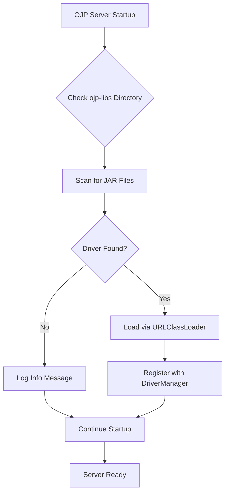
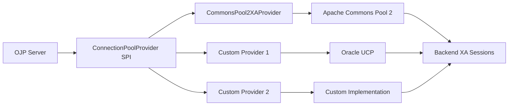

# Chapter 20: Implementation Analysis

Modern software development involves countless design decisions and trade-offs. The Open J Proxy project represents years of architectural evolution, with each implementation choice carefully considered to balance performance, maintainability, and flexibility. This chapter explores three critical implementation decisions that shaped OJP's architecture: driver externalization, the pool disable capability, and the XA Connection Pool Provider SPI. Understanding these design choices provides insights into how OJP achieves its goals of flexibility and efficiency.

## 20.1 Driver Externalization

When OJP first launched, it included all open-source JDBC drivers as embedded dependencies in the server JAR. While this "batteries included" approach simplified initial deployment, it created several challenges that became increasingly problematic as the project matured.

The original 70MB JAR file contained drivers for H2, PostgreSQL, MySQL, and MariaDB—regardless of which databases a user actually needed. Organizations that only connected to PostgreSQL still downloaded MySQL and H2 drivers. Security teams struggled to scan and approve the JAR because all drivers were bundled together. When a critical security vulnerability appeared in a driver, users had to wait for a new OJP release rather than simply updating that specific driver.

The externalization effort removed these embedded dependencies, shrinking the core JAR to just 20MB—a dramatic 71% reduction. More importantly, it placed control in users' hands. Now the `ojp-libs` directory serves as the loading mechanism for all drivers, whether open-source or proprietary. Users can update drivers independently, remove unnecessary ones for compliance purposes, or even add custom patched versions without rebuilding OJP.

The implementation required careful handling of class loading and reflection. The `DriverUtils` class manages driver discovery and loading, while `XADataSourceFactory` uses reflection-based instantiation to avoid compile-time dependencies. This approach maintains backward compatibility—Docker images still include all open-source drivers by default—while enabling the flexibility that enterprise users demand.

A simple bash script (`download-drivers.sh`) automates the process of retrieving drivers from Maven Central, making the setup as straightforward as running a single command. The script is idempotent, cross-platform compatible, and provides clear feedback about which drivers are present or missing.

Create a diagram showing two side-by-side comparisons. Left side labeled "Before: Embedded Drivers" shows a large monolithic JAR (70MB) containing OJP Server + H2 + PostgreSQL + MySQL + MariaDB all bundled together, with arrows pointing to update/security challenges. Right side labeled "After: Externalized Drivers" shows a smaller OJP Server JAR (20MB) separate from an `ojp-libs` directory containing individual driver JARs, with arrows showing independent updates, selective inclusion, and flexible versions. Use distinct colors for the server (blue) vs drivers (green/yellow).

The benefits extend beyond just file size. Security scanning became simpler because drivers can be analyzed separately from OJP's core code. Compliance teams can create minimal configurations containing only approved drivers. Development teams can test against specific driver versions without rebuilding the entire server. The architecture even enables organizations to use internal mirrors or proxies for driver distribution in air-gapped environments.



This implementation demonstrates a key principle in OJP's design philosophy: start with simplicity but architect for flexibility. The "batteries included" Docker image preserves the easy onboarding experience, while the externalization architecture accommodates enterprise requirements for control and customization.

## 20.2 Pool Disable Feature

Connection pooling typically improves performance by reusing database connections, but certain scenarios demand direct connections without pooling overhead. OJP's pool disable feature recognizes that one size doesn't fit all, allowing users to selectively disable pooling for both Non-XA and XA connections on a per-datasource basis.

The feature emerged from real-world use cases where pooling actually hindered rather than helped. Consider a batch processing system that maintains long-running database connections for hours during nightly ETL jobs. Traditional connection pools—designed for short-lived connections in transactional workloads—introduce unnecessary complexity and overhead. Or imagine a testing environment where developers want to observe exact connection behavior without pooling's abstraction layer.

For Non-XA connections, disabling the pool through the `ojp.connection.pool.enabled` property routes connection requests directly to `DriverManager.getConnection()`. Each request creates a fresh connection, and pool-related properties like `maximumPoolSize` are simply ignored. The implementation tracks these unpooled connections in a dedicated map, ensuring proper lifecycle management even without the pool's usual guardrails.

XA connections present additional complexity because they coordinate distributed transactions across multiple resource managers. The `ojp.xa.connection.pool.enabled` property governs XA pooling behavior. When disabled, OJP creates `XADataSource` instances directly and manages `XAConnection` lifecycles through the session mechanism. The XA operations—start, end, prepare, commit, rollback—work identically whether pooling is enabled or disabled, maintaining API consistency.

Create an infographic showing configuration hierarchy for pool disable feature. Display three tiers from top to bottom: 1) Environment Variables (shown as system-level config with UPPERCASE_NAMING), 2) System Properties (shown as Java process flags with -D notation), 3) Properties File (shown as ojp.properties file content). Each tier should show example syntax for both `ojp.connection.pool.enabled` and `ojp.xa.connection.pool.enabled`. Use arrows showing precedence from top to bottom. Include color coding: environment variables (green), system properties (yellow), properties file (blue).

The configuration follows a clear precedence hierarchy. Environment variables take highest priority, allowing operations teams to override behavior without changing application code. System properties provide flexibility for testing and development scenarios. Finally, the `ojp.properties` file serves as the default configuration, easily version-controlled and deployed with the application.

```properties
# Disable Non-XA pooling for batch processing
batch.ojp.connection.pool.enabled=false

# Keep XA pooling enabled for transactions
batch.ojp.xa.connection.pool.enabled=true

# Different configuration for real-time processing
realtime.ojp.connection.pool.enabled=true
realtime.ojp.xa.connection.pool.enabled=true
```

This granular control enables sophisticated deployment patterns. A single application might use unpooled connections for long-running analytical queries while maintaining pooled connections for transactional operations. Multi-tenant systems can configure pooling differently for each tenant based on their workload characteristics. Development environments can mirror production connection patterns for accurate testing.

The implementation required careful attention to resource management. Unpooled connections don't benefit from the pool's automatic cleanup and leak detection, so OJP tracks these connections explicitly and ensures proper closure. Error handling needed enhancement to provide clear guidance when pool-related properties are specified but pooling is disabled. The test suite expanded significantly to cover the matrix of pooling combinations across both Non-XA and XA scenarios.

Create a flowchart showing the connection acquisition decision process. Start with "Connection Request" splitting into "Non-XA" and "XA" paths. Each path then has a decision diamond "Pooling Enabled?" leading to either "Get from HikariCP Pool" or "Create via DriverManager" for Non-XA, and "Get from Backend Session Pool" or "Create XADataSource Directly" for XA. End both paths at "Connection Ready". Use consistent shapes: ovals for start/end, rectangles for processes, diamonds for decisions. Color code: Non-XA path (blue), XA path (purple).

From a performance perspective, disabled pooling introduces additional overhead for each connection request but eliminates the pooling infrastructure entirely. For workloads dominated by long-lived connections, this trade-off makes sense. For high-frequency, short-lived operations, pooling remains the clear winner. The feature empowers users to make this decision based on their specific workload characteristics rather than forcing a one-size-fits-all approach.

## 20.3 XA Pool SPI

The Connection Pool Provider SPI (Service Provider Interface) represents OJP's most extensible architecture component. While HikariCP handles Non-XA connection pooling exceptionally well, XA (distributed transaction) pooling requires specialized capabilities. Different databases and use cases benefit from different XA pooling implementations, so OJP provides a pluggable SPI that allows custom pool providers.

The SPI design follows Java's established service loader pattern. A provider implements the `ConnectionPoolProvider` interface, packages implementation details, and registers through the `META-INF/services` mechanism. At runtime, OJP discovers available providers and selects one based on configuration or defaults.

Apache Commons Pool 2 serves as OJP's default XA pool implementation, chosen for its maturity, flexibility, and robust behavior under stress. The `CommonsPool2XAProvider` wraps Commons Pool's `GenericObjectPool`, creating a pooling layer specifically optimized for `XAConnection` lifecycle management. This implementation handles the nuances of XA session management—connections must remain associated with their transactions until prepare/commit/rollback completes, even if the application code attempts premature closure.



The SPI shines in database-specific optimization scenarios. Oracle databases, for instance, benefit from Universal Connection Pool (UCP) which provides Oracle-specific optimizations and management capabilities. An organization could implement `OracleUCPXAProvider` that leverages UCP's advanced features like Fast Connection Failover and Runtime Connection Load Balancing, while falling back to Commons Pool for other databases.

The provider interface remains deliberately minimal, focusing on essential operations: creating the pool, acquiring connections, returning connections, and closing the pool. This simplicity makes implementation straightforward while leaving room for providers to add their own instrumentation, monitoring, and optimization logic.

```java
public interface ConnectionPoolProvider {
    void initialize(XADataSource xaDataSource, PoolConfiguration config);
    XAConnection borrowConnection() throws SQLException;
    void returnConnection(XAConnection connection);
    void close();
    PoolStatistics getStatistics();
}
```

Configuration flexibility extends to pool tuning parameters. The `PoolConfiguration` class encapsulates common settings like maximum pool size, minimum idle connections, and timeout values. Providers interpret these settings according to their underlying implementation—Commons Pool maps them to its configuration model, while a UCP provider would translate them to UCP equivalents.

Create a layered architecture diagram showing the XA Pool SPI structure. Top layer: "Application Code" making XA transaction calls. Middle layer: "OJP XA Management" containing the ConnectionPoolProvider SPI interface (shown as a plug-point). Bottom layer: Three provider implementations side-by-side: "Commons Pool 2 Provider" (default), "Oracle UCP Provider" (example), and "Custom Provider" (extensibility). Beneath these, show the actual pool implementations connecting down to "Backend XA Sessions". Use different colors for each provider and arrows showing the plug-in relationship to the SPI interface.

The SPI also facilitates testing and development. A `MockXAProvider` implementation can simulate various failure scenarios—connection timeouts, transaction failures, resource manager issues—without requiring actual database infrastructure. Development teams can validate error handling and recovery logic in isolation before progressing to integration testing against real databases.

Performance monitoring benefits from the SPI's `PoolStatistics` interface. Each provider exposes metrics relevant to its implementation: active connections, idle connections, wait times, timeouts, and any provider-specific data. These metrics integrate with OJP's telemetry infrastructure, enabling consistent monitoring regardless of which provider is active.

Migration between providers happens at configuration time without code changes. A team might start with Commons Pool during initial development, switch to Oracle UCP when deploying to production Oracle RAC clusters, and use a custom provider for specialized requirements. The application code remains unchanged—the provider swap happens transparently behind the SPI boundary.

Create a decision tree diagram showing provider selection logic. Start with "XA Connection Pool Initialization" at the top. First decision: "Provider Specified in Config?" If yes, arrow to "Load Specified Provider". If no, arrow to "Database Type Detection". From "Database Type Detection", show branches for "Oracle?" leading to "Try Oracle UCP Provider", "PostgreSQL/MySQL/Others?" leading to "Use Commons Pool 2 Provider". All paths converge at "Provider Initialized". Include configuration snippets beside relevant nodes showing example properties: `ojp.xa.pool.provider=oracle-ucp` for explicit configuration, and automatic selection for implicit configuration.

Looking forward, the SPI enables community contributions without requiring changes to OJP's core. An organization using Atomikos for transaction management could contribute an AtomikosXAProvider. A team leveraging HikariCP's XA support (if they extend it) could build a HikariXAProvider. The SPI creates an ecosystem where specialized implementations can coexist, each serving different use cases while maintaining API compatibility.

The implementation demonstrates sophisticated software engineering: defining clear boundaries, minimizing coupling, maximizing cohesion, and enabling extension without modification. It's the Open-Closed Principle in action—OJP is closed for modification but open for extension through the SPI mechanism.

## Conclusion

These three implementation analyses—driver externalization, pool disable capability, and XA Pool SPI—reveal recurring themes in OJP's design philosophy. Start with sensible defaults that work out of the box. Provide flexibility for users who need customization. Use established patterns and industry standards. Make extension easy without requiring core modifications.

Driver externalization moved complexity from compile-time to runtime, trading a larger JAR for deployment flexibility. Pool disable added configuration switches that enable optimal resource management for diverse workloads. The XA Pool SPI created an extensibility point that accommodates present needs while anticipating future requirements.

Each feature emerged from real-world usage patterns and feedback. They weren't theoretical exercises in over-engineering—they solved actual problems encountered by OJP users. This pragmatic approach, combined with thoughtful architecture, positions OJP as a production-ready solution that scales from prototype to enterprise deployment.

As you architect your own database access layer or evaluate connection management solutions, consider these implementation patterns. When should you externalize dependencies? How can configuration drive behavior without code changes? Where do extension points add value? The answers vary by context, but the patterns remain applicable across diverse technical domains.

