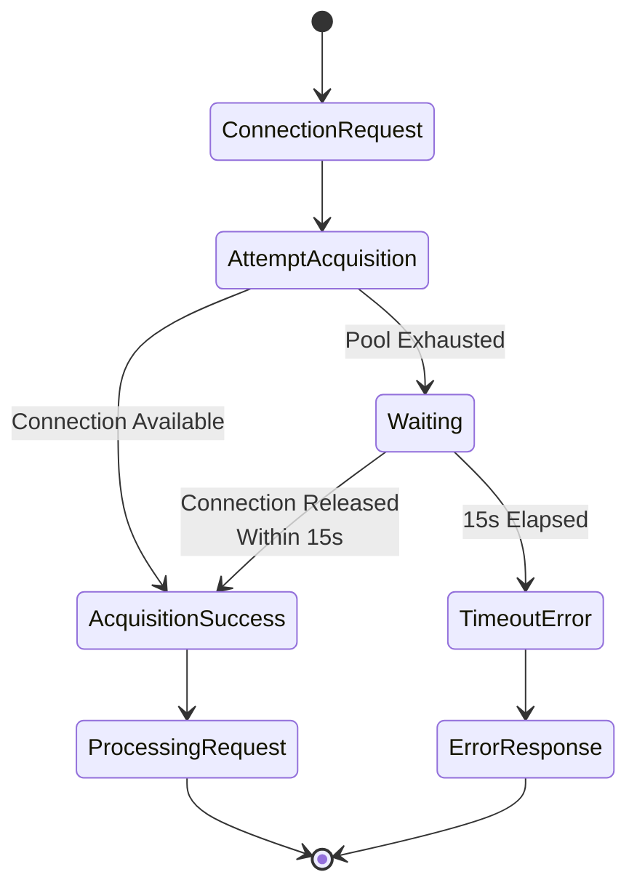

# Chapter 20: Fixed Issues and Lessons Learned

Software engineering is a discipline of continuous learning. Every bug fixed, every performance issue resolved, and every production incident weathered contributes to collective wisdom. The Open J Proxy project's journey includes critical fixes that shaped its architecture and operational characteristics. This chapter examines significant issues encountered in OJP's evolution, the engineering insights they revealed, and the lasting improvements they inspired.

## 20.1 Issue #29: The Indefinite Blocking Crisis

The most critical issue in OJP's history emerged from a seemingly straightforward integration test. Under high concurrent load—200+ threads hammering the server simultaneously—OJP would stop responding entirely. Queries wouldn't complete, errors wouldn't surface, and the system effectively hung until manually terminated. This behavior represented a catastrophic failure mode: silent, complete, and indefinite.

Understanding this issue requires examining how connection acquisition works under pressure. When an application requests a database connection, OJP's server component retrieves one from its HikariCP pool. Under normal conditions, this operation completes in milliseconds—either returning an available connection or quickly creating a new one up to the pool's maximum size. But when all connections are busy and the pool is at capacity, `dataSource.getConnection()` blocks, waiting for a connection to become available.

The blocking itself isn't inherently problematic; it's a standard backpressure mechanism. The disaster occurred when dozens of gRPC server threads simultaneously blocked waiting for connections, with no timeout protection enforcing an upper bound on wait time. As more threads joined the wait queue, the system's ability to process any requests deteriorated. Eventually, all available threads were blocked, creating a complete deadlock. No connections could be released because no threads were free to process the connection-releasing operations.

The investigation revealed multiple contributing factors. HikariCP's default maximum pool size of 10 connections was sized for modest concurrency, not the stress test scenario. The default connection timeout of 30 seconds was configured but proved ineffective under extreme contention—threads would block indefinitely despite this setting, suggesting an interaction problem between HikariCP's timeout mechanism and high concurrency.

**[IMAGE PROMPT: Thread Blocking Visualization]**
Create a diagram showing the progression of thread exhaustion. Top section shows "Normal Operation" with 10 gRPC threads, 10 pool connections, flowing smoothly between "Request" and "Response" with green arrows. Middle section shows "High Load Begins" with 50 threads trying to acquire connections from the 10-connection pool, some threads (yellow) waiting. Bottom section shows "System Locked" with 100+ threads all blocked (red) waiting for connections, no green arrows flowing, system completely deadlocked. Include a timeline arrow on the left showing progression over 5-10 seconds.

The solution required a multi-layered approach, starting with enhanced timeout protection at the application level. A new `ConnectionAcquisitionManager` class wraps connection requests in a `CompletableFuture` with a strict 15-second timeout. If acquisition doesn't complete within this window, the future times out with a clear error message rather than blocking indefinitely. This pattern provides absolute guarantee against indefinite waits, regardless of pool configuration.

```java
public static Connection acquireConnection(HikariDataSource dataSource, 
                                          String connectionHash) throws SQLException {
    CompletableFuture<Connection> connectionFuture = CompletableFuture.supplyAsync(() -> {
        try {
            return dataSource.getConnection();
        } catch (SQLException e) {
            throw new RuntimeException(e);
        }
    });
    
    try {
        return connectionFuture.get(ACQUISITION_TIMEOUT_MS, TimeUnit.MILLISECONDS);
    } catch (TimeoutException e) {
        connectionFuture.cancel(true);
        throw new SQLException(
            String.format("Connection acquisition timeout (%dms) for connection hash: %s", 
                         ACQUISITION_TIMEOUT_MS, connectionHash),
            "08001", e);
    }
}
```

Pool configuration required recalibration for better high-concurrency behavior. The maximum pool size increased from 10 to 20 connections, providing more capacity for concurrent operations. Minimum idle connections decreased from 10 to 5, allowing the pool to scale down during quiet periods while maintaining a ready reserve. Connection timeout shortened from 30 seconds to 10 seconds, providing faster feedback when the pool is exhausted.

Additional reliability improvements addressed related concerns. Leak detection with a 60-second threshold identifies connections that applications fail to close, preventing gradual pool exhaustion. Faster validation timeouts (5 seconds) ensure that broken connections don't waste time. JMX monitoring enables external tools to observe pool health. Unique pool names assist in diagnosing issues when multiple pools coexist.



The test results demonstrated dramatic improvement. Before the fix, the test never completed—it had to be killed after indefinite waiting with no error feedback. After the fix, the test completes in approximately 8 seconds with controlled failures. The system reports clear timeout errors: "Connection acquisition timeout (15000ms)" rather than hanging silently. Most crucially, the server remains responsive throughout, processing subsequent requests normally after load subsides.

The lessons learned extend far beyond this specific issue. First, **timeout protection belongs at multiple layers**. Don't rely solely on library defaults; implement application-level timeouts as a safety net. Second, **fail-fast beats fail-silent**. The pre-fix behavior's complete silence was worse than any error message. Third, **stress testing reveals architectural assumptions**. Code that works perfectly under modest load may behave catastrophically under stress.

Fourth, **connection pool sizing is workload-dependent**. There's no universal "right" size; it depends on query duration, concurrency patterns, and system resources. Fifth, **observability must include error scenarios**. Monitoring connection pool metrics during normal operation is useful, but understanding behavior during exhaustion is critical. Finally, **graceful degradation beats cascading failure**. The fix allows the system to shed load gracefully under pressure rather than collapsing entirely.

**[IMAGE PROMPT: Before and After Comparison]**
Create a split-screen comparison showing system behavior under high load. Left side "Before Fix": Show a dashboard with all metrics flatlined or frozen, system status "UNRESPONSIVE", error log showing no new entries, and a timestamp showing "10+ minutes elapsed". Right side "After Fix": Show active metrics with some operations succeeding (green) and some failing with timeout errors (yellow), system status "RESPONSIVE", error log showing clear timeout messages, and timestamp showing "~8 seconds elapsed". Include visual metaphors: left side shows a completely blocked pipe, right side shows a pipe with controlled flow and pressure relief valve.

## 20.2 Multinode Connection Redistribution

As OJP matured, multinode configurations became increasingly common. Multiple OJP servers provide high availability and horizontal scaling, but they introduced a subtle challenge: how connections redistribute when the server pool changes.

Consider a scenario with three OJP servers, each managing connections to the same database with a configured pool size of 30 connections per server, totaling 90 connections. Now one server shuts down for maintenance. The remaining two servers continue operating, but they still maintain their original pool sizes—30 connections each, totaling just 60 connections. The system lost one-third of its connection capacity even though two-thirds of the servers remain available.

The inverse problem occurs when adding servers. Starting with two servers at 30 connections each (60 total), adding a third server should ideally redistribute to 30 connections per server. But without coordination, the new server might initialize with 30 connections while the existing servers maintain their pools, resulting in 90 total connections—50% more than intended. For databases with strict connection limits, this overshoot can cause failures.

The root cause stems from treating pool sizes as server-local configuration rather than cluster-wide resources. Each server independently configures its pool based on local configuration, with no awareness of peer servers. When the server topology changes, pools don't automatically adjust to maintain the intended total connection count.

The solution implemented server coordination logic during pool initialization and topology changes. When a server starts or discovers topology changes, it calculates its share of the total configured connections: `local_pool_size = total_configured / number_of_servers`. A cluster of three servers with a configured total of 90 connections results in 30 connections per server. If one server fails, the remaining two recalculate: 90 / 2 = 45 connections each, maintaining total capacity.

This automatic redistribution requires careful handling of edge cases. When a server joins or leaves the cluster, existing connections don't immediately close; instead, the pool adjusts its target size through natural attrition. As connections complete their current work and return to the pool, the pool either releases excess connections (scaling down) or creates additional connections (scaling up) to reach the new target.

**[IMAGE PROMPT: Connection Redistribution Diagram]**
Create a three-panel timeline showing connection redistribution. Panel 1 "Initial State": Three servers, each with 30 connections (boxes), total = 90. Panel 2 "Server 2 Fails": Two servers remain, each still showing 30 connections, total drops to 60, with red warning indicating capacity loss. Panel 3 "After Redistribution": Two servers, each now showing 45 connections, total restored to 90, with green checkmark indicating full capacity maintained. Use color coding: healthy connections (blue), connection redistribution (purple arrows), failed server (red X).

Monitoring integration proved essential for operational confidence. The redistribution events generate log entries indicating the old and new pool sizes, helping operators understand system behavior during topology changes. Metrics exposed through Prometheus track actual pool sizes across the cluster, enabling alerts when redistribution completes or if servers maintain unexpected sizes.

The configuration design balances simplicity with control. Users specify total desired connections in their configuration, and OJP handles the arithmetic of distributing them across servers. Advanced users can override this automatic behavior with explicit per-server pool sizes if their deployment requires asymmetric configurations—perhaps dedicating more resources to specific servers based on their hardware or network proximity to the database.

The lessons learned from this issue emphasize the importance of **thinking at the cluster level, not just the server level**. In distributed systems, configuration that seems local often has global implications. Second, **automatic coordination beats manual calculation**. Expecting operators to manually calculate and adjust pool sizes during topology changes invites errors. Third, **smooth transitions prevent disruption**. Immediately closing connections during scale-down would terminate in-flight operations; gradual adjustment through attrition maintains service continuity.

## 20.3 Patterns and Insights

Beyond specific issues, OJP's journey has revealed recurring patterns and insights applicable to database connection management generally.

**Connection Lifecycle Tracking**: The distinction between virtual connections (from the application's perspective) and real connections (in the database) creates complexity but enables OJP's value proposition. Tracking this relationship across transactions and result sets requires meticulous state management. The lesson: explicit lifecycle modeling prevents resource leaks and enables smart optimizations.

**Backpressure Design**: OJP's intelligent backpressure—slowing clients when the database is overloaded—requires careful tuning. Too aggressive and you throttle needlessly; too passive and the database gets overwhelmed. The lesson: backpressure mechanisms need observability and tunability. Production teams must see the current state and adjust behavior to their specific workload.

**XA Transaction Complexity**: Distributed transactions introduce order-of-magnitude complexity compared to local transactions. Connection must persist across the prepare/commit boundary, state must survive network partitions, and recovery scenarios require careful protocol implementation. The lesson: XA support demands extraordinary attention to correctness; test exhaustively across failure scenarios.

**Observability as First-Class Feature**: Initially, OJP provided basic logging. Production usage revealed that logs alone don't suffice—metrics, traces(planned), and structured events all play crucial roles. OpenTelemetry integration wasn't an afterthought; it became fundamental to operating OJP reliably. The lesson: observability isn't a feature to bolt on later; it's architectural from the start.

**[IMAGE PROMPT: Lessons Learned Infographic]**
Create an infographic summarizing key lessons learned. Display five sections vertically: 1) "Timeout Protection" showing layered timeouts (library + application level), 2) "Fail Fast" showing explicit error vs silent failure, 3) "Cluster Thinking" showing individual server vs cluster-wide view, 4) "Gradual Adjustment" showing smooth scaling vs abrupt changes, 5) "Observable Everything" showing metrics/logs/traces coverage. Use icons and color coding consistently. Include a banner at top stating "Production Lessons from OJP" with project logo.

**Testing Philosophy Evolution**: Early OJP testing focused on functional correctness—does the feature work? Experience shifted emphasis toward non-functional testing—how does it behave under stress, during failures, when misconfigured? Integration tests now routinely include timeout scenarios, resource exhaustion, network partitions, and database failures. The lesson: testing the happy path is table stakes; testing failure modes is where reliability is proven.

## Conclusion

The issues and lessons presented in this chapter represent more than historical artifacts—they encode hard-won wisdom applicable to any database connectivity solution. Issue #29's indefinite blocking taught the necessity of defense-in-depth timeout protection. Multinode redistribution problems revealed the importance of cluster-aware configuration. Broader production patterns highlighted the interplay between features that seem independent in design but interact in deployment.

These lessons inform OJP's ongoing development. New features are now evaluated against criteria that emerged from these experiences: Does it fail fast or silent? How does it behave under stress? Will it cause issues in multinode scenarios? Can operators observe and control it? Does it handle partial failures gracefully?

For teams building or operating database-connected systems, these lessons apply directly. Implement multi-layered timeouts. Test failure scenarios explicitly. Think cluster-wide even for seemingly local configuration. Design for observability from the start. Value graceful degradation over perfect operation. Expect that production will surface behaviors testing didn't reveal.

Every software project accumulates these lessons—often painfully. OJP's transparent sharing of its challenges and solutions benefits the broader engineering community. The next time you encounter high-concurrency deadlocks, connection pool exhaustion, or distributed system coordination problems, you'll recognize the patterns and have proven solution approaches at hand.

