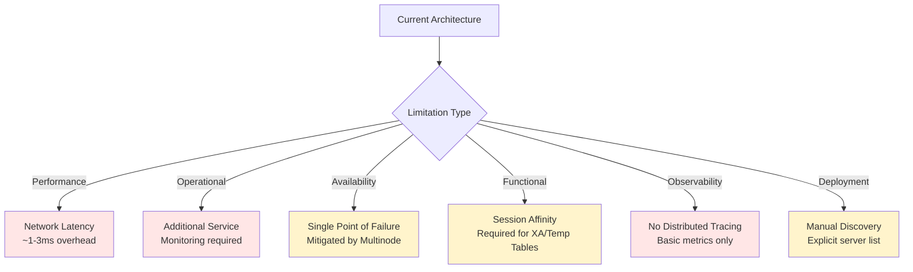

# Chapter 21: Project Vision and Future

Every successful open-source project starts with a vision—a clear picture of the problem being solved and the value being created. Open J Proxy emerged from a straightforward observation: modern cloud-native architectures create connection management challenges that traditional JDBC drivers weren't designed to address. As we conclude this comprehensive guide, let's explore OJP's vision, acknowledge current limitations honestly, and look toward the exciting enhancements on the horizon.

## 21.1 The Vision: Database-Agnostic Connection Management

At its core, OJP's vision is deceptively simple: **decouple application scaling from database connection pressure**. In traditional architectures, every application instance maintains its own connection pool, creating a direct linear relationship between application scale and database load. When you scale from 10 to 100 instances, your database suddenly faces 10x the connection count—regardless of whether actual query load increased proportionally.

This coupling creates an artificial scaling ceiling. Organizations hit database connection limits not because of query volume but because of connection count. Elastic scaling—a foundational cloud-native pattern—becomes dangerous when every new application instance translates to dozens more database connections. Auto-scaling triggers that should improve capacity under load instead risk overwhelming the database with connection storms.

OJP breaks this coupling by introducing a smart intermediary layer. Application instances scale independently while the OJP server maintains a controlled connection pool to the database. Scale from 10 to 100 application instances, and the database sees the same connection count—perhaps 50 connections from a single OJP server or 150 connections from three OJP servers in a high-availability configuration. The database load scales with actual query volume, not with application instance count.

The "open-source" aspect of the vision is equally important. While commercial database proxies exist, they're typically tied to specific databases (Oracle-only, PostgreSQL-only) or specific cloud platforms. OJP's database-agnostic approach means the same solution works for H2, PostgreSQL, MySQL, Oracle, SQL Server, and any database with a JDBC driver. Organizations with heterogeneous database estates—common in enterprises managing legacy and modern systems—gain a consistent connection management layer across their entire infrastructure.

**[IMAGE PROMPT: Vision Illustration - Decoupled Scaling]**
Create a conceptual diagram showing OJP's vision. Top half labeled "Without OJP": Show 10 application instances (small boxes) each with arrows connecting to a database, creating 100 connections (10 per instance). Add a red warning symbol and text "100 connections from 10 instances". Bottom half labeled "With OJP": Show 10 application instances connecting through 1-2 OJP servers (shown as blue proxy layer), which then connect to the database with only 20-30 connections. Add a green checkmark and text "30 connections for 10 instances". Include scaling arrows showing applications can scale further without increasing database connections.

The target architectures tell the story of where OJP provides maximum value:

**Microservices** proliferate instances. A typical microservices application might run dozens of service types, each with multiple instances for reliability and scale. Traditional connection pooling multiplies each service's pool size by its instance count, creating connection management nightmares. OJP collapses this multiplication, providing stable connection counts regardless of microservice instance scaling.

**Event-driven architectures** face variable load patterns. Message queue consumers scale up during high-volume periods and scale down during quiet times. Without OJP, the database experiences corresponding connection fluctuations. With OJP, the database sees stable connection counts even as event processors scale dynamically.

**Serverless functions** represent the extreme case. Each function invocation potentially creates a new runtime environment with its own connection pool. AWS Lambda, Azure Functions, and Google Cloud Functions all benefit from OJP's ability to maintain a steady-state connection pool while serverless functions scale to thousands of concurrent executions.

The vision extends beyond just connection count management. Intelligent features like slow query segregation prevent long-running analytical queries from starving fast transactional operations. XA transaction support enables distributed transaction coordination without requiring complex application-level orchestration. Multinode deployment provides high availability and horizontal scaling for the proxy layer itself.

## 21.2 Current Limitations and Trade-offs

Honesty about limitations is crucial for making informed technical decisions. OJP solves significant problems but introduces considerations that users should understand when evaluating whether it fits their architecture.

**Additional Network Hop**: OJP introduces an extra network hop between application and database. Instead of `Application → Database`, traffic flows `Application → OJP Server → Database`. This adds latency—typically 1-3 milliseconds in local networks, potentially more in geographically distributed deployments. For applications where every millisecond matters (high-frequency trading, real-time gaming), this overhead might be prohibitive. For most business applications processing hundreds or thousands of milliseconds per request, the overhead is negligible compared to the benefits gained.

**Operational Complexity**: Running OJP means operating an additional service. It requires monitoring, patching, capacity planning, and incident response procedures. Small teams might find this burden excessive if their current architecture operates smoothly. However, for teams already managing multiple infrastructure services (Redis caches, message brokers, API gateways), adding OJP fits naturally into existing operational patterns.

**Single Point of Failure (Mitigated)**: In single-server deployments, OJP becomes a potential single point of failure. If the OJP server crashes, all database connectivity fails until it recovers. The multinode feature addresses this limitation—multiple OJP servers provide redundancy, with automatic failover if a server becomes unavailable. For production deployments, running 2-3 OJP servers in a highly-available configuration is recommended standard practice.

**Observability Gaps**: Current telemetry provides metrics and basic health information but lacks distributed tracing export. You can see connection pool metrics and gRPC server statistics, but end-to-end trace visualization through systems like Zipkin or Jaeger isn't yet available. SQL-level instrumentation—seeing individual queries and their performance characteristics—isn't currently implemented. These observability features are on the roadmap but represent current limitations for teams requiring comprehensive tracing.

**Manual Server Discovery**: In multinode configurations, you must explicitly list servers in your JDBC URL. Automatic service discovery through systems like Consul, etcd, or Kubernetes Service Discovery isn't yet supported. This manual approach works reliably but requires updating configurations when the server pool changes. Dynamic discovery would enable true elastic scaling of the OJP server layer.

**Configuration Synchronization**: Each OJP server loads its configuration independently. Changes to connection pool settings, slow query thresholds, or security rules require updating all servers individually. There's no built-in configuration synchronization mechanism. Organizations typically address this through configuration management tools (Ansible, Chef, Puppet) or Kubernetes ConfigMaps, but native synchronization would improve operational simplicity.

Understanding these limitations helps set appropriate expectations. OJP isn't a universal solution for every database connectivity scenario. It shines in cloud-native environments with elastic scaling, variable load patterns, and heterogeneous database estates. It might be overkill for monolithic applications with stable instance counts and single databases. The key is matching the tool to the problem.

**[IMAGE PROMPT: Limitations vs Solutions Matrix]**
Create a table-style infographic showing current limitations and their solutions/mitigations. Four columns: "Limitation", "Impact", "Mitigation", "Roadmap Status". Rows include: Network Latency (Impact: 1-3ms, Mitigation: Accept for non-latency-critical apps, Status: Inherent trade-off), Single Point of Failure (Impact: Total outage, Mitigation: Deploy multinode, Status: Solved), Observability Gaps (Impact: Limited tracing, Mitigation: Use Prometheus metrics, Status: Planned), Manual Discovery (Impact: Manual updates, Mitigation: Use ConfigMaps, Status: Planned). Use color coding: red for high impact, yellow for medium, green for mitigated.

## 21.3 Future Enhancements and Roadmap

OJP's roadmap reflects both user requests and the maintainers' vision for enhancing core capabilities. These enhancements will arrive progressively as the project matures and community contributions accelerate.

**Distributed Tracing Export**: OpenTelemetry integration currently collects metrics but doesn't export distributed traces. Future versions will add trace exporters for Zipkin, Jaeger, OTLP, and cloud-provider tracing systems (AWS X-Ray, Google Cloud Trace, Azure Monitor). This will enable end-to-end request tracing from application through OJP to the database, providing visibility into complete request flows. Imagine seeing a single trace that shows application processing time, OJP proxy time, network time, and database execution time—debugging performance issues becomes dramatically simpler.

**SQL-Level Instrumentation**: Current observability operates at the connection and transaction level. Future enhancements will add SQL statement-level tracking: which queries execute most frequently, which consume the most time, which cause the most waits. This query intelligence enables sophisticated optimizations—perhaps automatically routing certain query patterns to read replicas, or flagging problematic queries for developer review.

**Dynamic Server Discovery**: Instead of manually listing OJP servers in JDBC URLs, future versions will support service discovery integration. Kubernetes users could reference a Service name; Consul users could query service registries; cloud platform users could leverage native discovery mechanisms. Applications wouldn't need configuration updates when adding or removing OJP servers—the system would discover topology changes automatically.

**Advanced Load Balancing Strategies**: Current multinode load balancing is connection-count-based—routing new connections to the least-loaded server. Future enhancements might include weighted round-robin (dedicating more load to more powerful servers), response-time-based routing (preferring faster servers), or geographic routing (preferring nearby servers to minimize latency). These strategies would be configurable per deployment based on infrastructure characteristics.

**Configuration Synchronization**: Rather than managing configurations separately on each server, future versions might support centralized configuration with automatic distribution. Change a connection pool setting once, and all servers receive the update. This could leverage existing tools (Consul Key/Value store, etcd) or implement custom distribution mechanisms. The goal is reducing operational overhead while maintaining flexibility.

**Health Check Endpoints**: While basic metrics exist, dedicated health check endpoints would integrate better with load balancers and orchestration platforms. HTTP-based health checks that return detailed status information (pool health, database connectivity, resource utilization) would enable smarter routing and monitoring. Kubernetes liveness and readiness probes could leverage these endpoints for more intelligent pod lifecycle management.

**Read Replica Routing**: Many databases support read replicas for scaling read-heavy workloads. Future OJP versions might intelligently route read-only queries to replicas while sending write operations to the primary. This routing could be automatic (based on query analysis) or explicit (via connection URL hints). The capability would maximize database cluster utilization without application code changes.

**Query Result Caching**: For queries that fetch relatively static data (configuration tables, reference data), an optional caching layer could cache results directly in OJP. Subsequent identical queries would return cached results without hitting the database. This capability requires careful cache invalidation strategies but could dramatically reduce database load for certain access patterns.

**[IMAGE PROMPT: Roadmap Timeline]**
Create a roadmap visualization showing enhancement phases. Display a horizontal timeline with three phases: "Near Term (6-12 months)", "Mid Term (1-2 years)", "Long Term (2+ years)". Near Term shows: Distributed Tracing Export, Enhanced Health Checks. Mid Term shows: Dynamic Server Discovery, Configuration Sync, SQL-Level Instrumentation. Long Term shows: Read Replica Routing, Connection Pool Autoscaling, Query Caching. Use different colors for observability (blue), operational (green), and performance (orange) enhancements. Add icons representing each feature.

The roadmap remains intentionally flexible. Community priorities help shape which enhancements arrive first. If multiple users request dynamic discovery, it jumps in priority. If distributed tracing emerges as a critical need, it accelerates. Open-source projects thrive on this feedback loop—users identifying needs, contributors implementing solutions, and the maintainers integrating improvements into the core.

## 21.4 Community and Ecosystem

OJP's future depends not just on code features but on building a vibrant community and ecosystem. Several initiatives support this goal:

**Contributor Recognition Program**: The badge system rewards contributions across multiple tracks—code, documentation, testing, and evangelism. This recognizes that valuable contributions extend beyond pull requests. Someone writing comprehensive documentation or creating YouTube tutorials contributes as meaningfully as someone fixing bugs. The recognition program validates diverse contributions and encourages broader participation.

**Partner Ecosystem**: Organizations like Comunidade Brasil JUG, Switcher API, Meterian, Cyber Jar, and Java Challengers partner with OJP, providing support through content creation, community outreach, and technical integration. These partnerships amplify OJP's reach and provide real-world validation of its value.

**Framework Integration Examples**: Spring Boot, Quarkus, and Micronaut integration guides with working example applications help teams adopt OJP rapidly. These framework-specific resources acknowledge that developers work within ecosystems, not in isolation. More framework integrations (Vert.x, Helidon, Jakarta EE) will broaden adoption further.

**Helm Charts for Kubernetes**: The separate ojp-helm repository provides production-ready Kubernetes deployment manifests. This integration acknowledges that modern deployments happen in containerized environments and that Kubernetes-native tooling matters. Artifact Hub publication makes OJP discoverable to the Kubernetes community.

**Discord Community**: Real-time chat provides a venue for quick questions, troubleshooting help, and community building. More responsive than GitHub issues for simple queries, Discord complements formal support channels. Community members help each other, reducing the burden on core maintainers while building relationships.

The ecosystem will grow as adoption increases. Database vendors might contribute database-specific optimizations. Cloud platforms could offer managed OJP services. Training providers might develop certification programs. Consulting firms could build practices around OJP deployment. These ecosystem activities don't require core team involvement—they emerge organically as the project proves valuable in production environments.

**[IMAGE PROMPT: Community and Ecosystem Map]**
Create a visual ecosystem map placing "OJP Core" at the center. Surround it with connected circles representing: "Contributors" (developers, documentation writers, testers), "Partners" (JUG communities, tool providers), "Users" (enterprises, startups, individual developers), "Integrations" (Spring Boot, Quarkus, Kubernetes), "Distribution" (Maven Central, Docker Hub, Artifact Hub), and "Support" (Discord, GitHub Issues, Stack Overflow). Use connecting lines showing interactions. Use brand colors where applicable and icons representing each ecosystem participant.

## 21.5 Invitation to Participate

This book concludes, but your OJP journey might just be beginning. Whether you're evaluating OJP for potential adoption, planning a production deployment, or already running it successfully, opportunities exist to engage more deeply.

**Try OJP in Your Environment**: The best way to understand OJP's value is experiencing it firsthand. Set up a test environment mirroring your production architecture. Run load tests comparing traditional connection pooling versus OJP-mediated connections. Measure connection counts, response times, and resource utilization. You'll quickly see where OJP provides value and where its trade-offs might be problematic.

**Contribute to the Project**: Found a bug? Submit a detailed issue. Fixed a problem? Open a pull request. Wrote integration code for your framework? Share it as an example. Improved documentation? Contribute updates. Even seemingly small contributions—fixing typos, improving error messages, adding test cases—accumulate to make the project better. Check the contributor recognition program to see how your contributions earn recognition.

**Share Your Experience**: Deployed OJP successfully? Write a blog post explaining your architecture and results. Gave a conference talk? Upload slides and video. Solved an interesting problem? Document it and share. These experience reports help others understand real-world OJP usage patterns and benefit the entire community.

**Engage in Community Discussions**: Join the Discord server and introduce yourself. Answer questions from newcomers based on your experience. Participate in discussions about feature priorities and design decisions. Community input shapes the project's direction, and your perspective matters whether you're a first-time user or a seasoned contributor.

The future of OJP depends on community engagement. Open-source projects thrive not through individual genius but through collective contribution. Every person who tries OJP, reports issues, suggests improvements, contributes code, or helps others contributes to the project's success and longevity.

## Conclusion

Open J Proxy represents a specific solution to a specific problem: managing database connections in cloud-native architectures where elastic scaling creates database pressure. Its vision—database-agnostic, open-source, intelligent connection management—addresses real pain points that traditional JDBC drivers weren't designed to solve.

Current limitations exist and should be understood when evaluating fit. The additional network hop, operational complexity, and observability gaps represent trade-offs made to achieve the core benefits. For many architectures, these trade-offs are worthwhile; for others, they might not be.

The roadmap points toward a more capable, more observable, more operationally simple future. Distributed tracing, dynamic discovery, and advanced load balancing will arrive progressively. Community input influences priorities, and contributions accelerate delivery.

Most importantly, OJP remains open-source, free to use, modify, and distribute. Commercial database proxies serve their purpose, but lock you into specific vendors or platforms. OJP's open nature ensures you control your database connectivity layer, adapt it to your needs, and avoid vendor lock-in.

As you close this guide and potentially begin your OJP journey, remember that every production deployment teaches lessons, every use case reveals insights, and every community member contributes value. Welcome to the OJP community. We're excited to see what you'll build.

